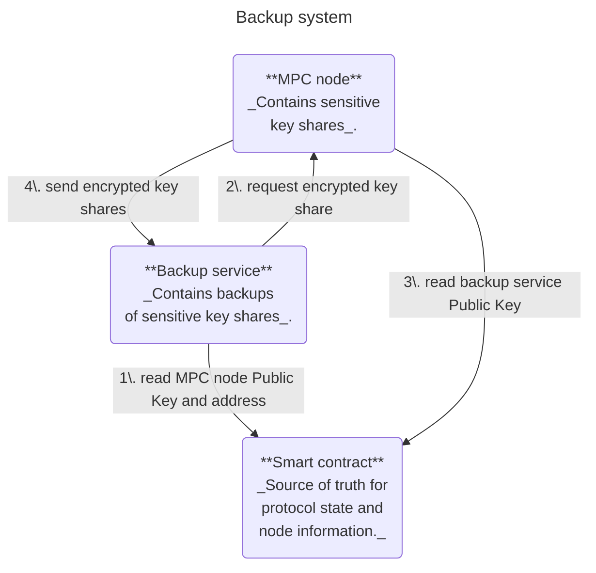
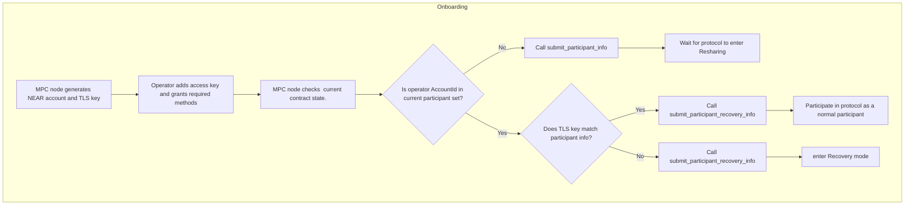
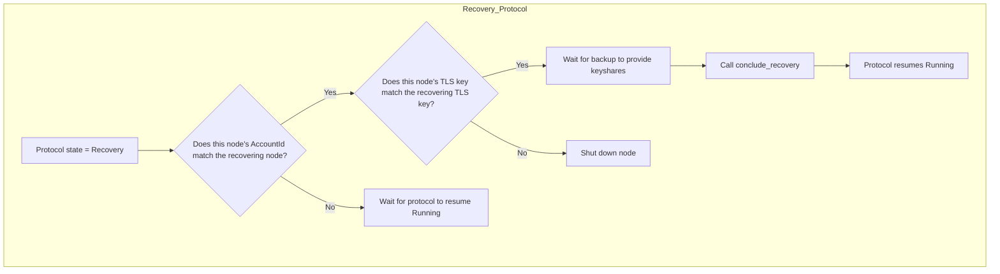

# TEE Integration

## Overview
A **t**rusted **e**xecution **e**nvironment (TEE) is an environment isolated from the operating system. A TEE provides security guarantees about confidentiality and integrity of the code and memory executed inside it.

The security guarantees provided by TEEs are attractive to the MPC network for two reasons:
1. They help enforce backward secrecy. Since TEEs can guarantee that former nodes never gain lasting possession of plain text secret-shares, collusion attacks after departure become infeasible.
2. They allow to relax the threat models (e.g. honest-but-curious instead of malicious adversaries). This allows the adoption of significantly more efficient MPC protocols.

TEEs provide their security guarantees by restricting how anything outside of the TEE can interact with the code running inside the TEE. This is great to protect against malicious actors, but it also restricts the honest actors. It has to be expected that debugging and handling of emergencies will become much more difficult compared to running an MPC node outside of a TEE.

In the context of threshold cryptography, this poses the risk of losing the "signing quorum". If too few nodes remain operational, the protocol grinds to halt, in which case, no funds can be moved.

Therefore, Near-One will roll-out its TEE implementation in two phases:
- Soft Launch: All mainnet nodes are running within TEEs. Their key shares are backed-up outside of the TEE.
- Hard Launch: All mainnet nodes are running within TEEs. Their key shares are backed-up inside a different TEE.

In order to protect the network from the worst case scenario (permanent loss of the signing quorum), a disaster recovery system is to be deployed.

## Disaster Recovery on a high-level
The purpose of the disaster recovery system is to prevent a permanent loss of the signing quorum.
As long as the secret shares of the MPC nodes are securely backed-up outside of the TEE environment in which the node is running, it is highly likely that the network will be able to recover from otherwise catastrophic failures. Therefore, each operator of an MPC node will be required to operate their own **backup service**. This service is separate from the MPC node and should run on a different machine.

### Backup service
The backup service has two responsibilities:
1. _Backup:_ Securely fetch the secret shares of the current key set from the MPC node it must back up and store the secrets in a secure manner.
2. _Recovery:_ Securely provide the backup shares to the MPC node if required.

For the hard-launch, the backup service must run inside a TEE.

The backup service needs a current view of the MPC smart contract on the NEAR blockchin. For that reason, it will be operating a NEAR node.

### Contract
The MPC contract is used for authenticating the backup service and the MPC node.
The node and service will each submit a public key to the contract that is then used for mutual authentication during backup generation and recovery processes.

### MPC network during a recovery process
Currently, the MPC network allows three protocol states:
- `Initializing` for generating new key shares
- `Running` when handling signature request
- `Resharing` when the network is resharing their secret keys for a change of the participant set, or for a change of the cryptography threshold

Until now, when a node operator wanted to switch their machine, they needed to do so through a `Resharing` - they had to leave the network and then re-join.
Unfortunately, it may not be possible to use the same mechanism for recovering from disaster, as by definition, a disaster implies that the network lost it signing quorum and thus, its ability to execute a resharing.
To account for this, a fourth protocol state must be introduced: `Recovery`.

The purpose of this state is to:
- allow participants to change their participant information (e.g. TLS keys, IP address, and anything other than their account id);
- allow a node to activate the Recovery mechanism and request the back-up share from the backup service.

This protocol state may:
- only be entered from a `Running` state. (_note: we might be able to also allow re-entering it from a `Recovery` state. But this adds complexity and is not necessary._)
- resume in a `Resharing` state under the same conditions under which the `Resharing` state could be resumed from a `Running` state.
- not resume in a state different to `Running` or `Resharing`.

Unlike the `Resharing` state, entering this state does not require `threshold` votes, but rather, a single vote is sufficient. However, the `AccountId` of all participants must be preserved. Only secondary participant details may be changed.

In a first iteration, it is okay if signature requests are not accepted while the protocol is in `Recovery` state.

## Implementation Details
_Note: In this document, the term node operator refers to a person operating a node that is acting as a participant in the MPC network. That person has a unique `AccountId` (an account on the NEAR blockchain) associated to its node. Without loss of generality, we assume that a node operator only operates a single node and that their `AccountId` serves as a unique identifier for the node as well as the operator._

### Version 1: Establish TCP p2p connection
The node crate already contains logic that allows mutual authentication via TLS. That logic sits in [`node/src/p2p.rs`](https://github.com/near/mpc/blob/b89d1084bcbd2fdc777140a4dda38de616b810ef/node/src/p2p.rs#L119). This implementation would re-use the existing logic.

#### Backup service workflow
##### Onboarding
1. The backup service generates a NEAR account public key and a TLS key.
2. The node operator adds the NEAR account public key as an access key to their account and grants it access to necessary contract methods (_todo: list of methods_).
3. The backup service submits their [todo: specify with TEE] information to the MPC smart contract.

##### Monitoring 
The backup service periodically fetches the current protocol state from the contract.
It compares the key set of the current `Running` protocol state with the secret shares it has possession of.
If there is a discrepancy, then the backup service requests a new copy of the key shares from the MPC node following the process outlined under [Backup](#backup).
If the contract is in `Recovery` state, then the backup service follows the protocol outlined under [Recovery](#recovery)

##### Backup 
1. The backup service looks up the details of its MPC node in the set of participants of the `Running` protocol state.
2. The backup service establishes a p2p connection with the node with mutual TLS authentication.
3. The backup service waits for the node to send the key shares, stores them securely and then closes the connection.

##### Recovery
1. The backup service looks up the details of its MPC node in the set of prospective participants of the `Recovery` protocol state.
2. the backup service establishes a p2p connection with the node with mutual TLS authentication.
3. The backup service sends the key shares to the node.
4. The backup service sends a confirmation to the MPC smart contract.

#### MPC node workflow
##### Onboarding
1. The MPC node generates a NEAR account public key and a TLS key.
2. The node operator adds the NEAR account public key as an access key to their account and grants it access to the necessary contract methods (_todo: list of methods_).
3. The MPC node monitors the MPC smart contract.
    - **If** the account ID of their node operator is **not** in the set of current participants:  
        - Submit their information to `submit_participant_info`.  
        - Wait to be included in the protocol via a `resharing`.  

    - **If** the account ID of their node operator **is** in the set of current participants **and** the TLS key of the participant info matches theirs:  
        - Submit their information to `submit_participant_info`.  
        - Engage normally with the protocol.  
        
    - **If** the account ID of their node operator **is** in the set of current participants, **but** the TLS key of the participant info does **not** match theirs:  
        - Submit their information to `submit_participant_recovery_info`. 
        - This puts the protocol in `Recovery` mode (c.f. also the [contract](#contract) section).

##### Recovery Protocol
The node follows this protocol when the protocol state is in `Recovery`:

- **If** this nodes account ID matches the account ID of the recovering node:
    - **If** this node is the recovering node (matches the TLS key):
        - They wait for the backup service to provide the keyshares.
        - Once in possession of key shares, the node calls `conclude_recovery()`, which resumes the protocol in the `Running` state.
    - **Else** they shut down (_note: This case means that the node is about to be de-commissioned. The node must shut down now, because otherwise, it will itself request a "Recovery" state once the contract resumes `Running`_).
- **Else** they wait for the protocol to resume `Running`

##### Backup:
The MPC node listens for any connection attempts by the backup service.
If it receives one, it compares the credentials sent by the p2p connection against the credentials stored in the contract.

### Version 2: web-endpoint and ephemeral keys:
Instead of establishing p2p connections, it is possible to leverage the web-endpoint already exposed by the node.
The endpoints are currently unprotected, so an authentication mechanism would need to be implemented.
Furthermore, the node and the backup service must be able to agree on a key for encrypting the secrets during transit.

This solution would be very similar to the one above, except that the contact and the node would need to submit ephemeral public keys to the contract each time they establish a connection. 

#### Cryptography
A pair-wise key establishment scheme can be leveraged to establish a symmetric key. A suitable implementation can be found in [libsodium](https://doc.libsodium.org/) and its rust wrapper [libsodium-rs](https://docs.rs/crate/libsodium-rs/latest). Specifically, the **key exchange protocol based on X25519** would be a good fit for the given set-up (c.f. [libsodium](https://doc.libsodium.org/key_exchange) and [libsodium-rs](https://docs.rs/libsodium-rs/latest/libsodium_rs/crypto_kx/index.html)).

The key establishment scheme requires that the node as well as the backup service have *mutually authenticated Curve25519 public keys*. The NEAR blockchain can be leveraged for this, more specifically, for each backup generation or recovery, the node and the backup service generate ephemeral keys on the `Curve25519` and publish them on the MPC smart contract. The node and the backup service can then each run a key generation protocol using their private key and the public key of the other party. 

_Note: The curious reader might ask why this protocol does not simply use the NEAR public/private key pairs associated to the MPC node and the backup service. The reason for this is is twofold:_
- _those keys are meant for signature generation._
- _While it is true that Curve25519 used in X25519 and edwards25519 used by the NEAR blockchain are [birationally equivalent](https://crypto.stackexchange.com/questions/43013/what-does-birational-equivalence-mean-in-a-cryptographic-context), so one could theoretically convert the NEAR account keys and use them for `X25519`, it is generally advised to use one key per application. This also allows us to use ephemeral keys, as opposed to static keys for the encryption. Which is desirable._

#### Node
The **MPC node** will expose a web endpoint over which the backup service can submit requests. These endpoints require some sort of authentication using the published public keys _(todo: yet to be specified)_.
The exposed endpoints are:
- GET /shares_backup - with an authentication header
    - Returns the encrypted shares, if a valid backup service is registered.
- POST /shares_recover
    - Posts encrypted shares to a new node.

## Todo
- it is advised that the node operator grants access only to specific contract methods for the backup service and the node.
- define attestation for backup service
- contract changing state from Running --> Recovery --> Running might be missed by some nodes. Need a way to update participant set while in Running state. In that case, nodes will need to re-establish p2p connections and purge their assets to avoid timing out requests. While it is possible to force nodes to do this synchronously, the effort for this is quite high and it is probably unnecessary.

## Materials:
https://nearone.slack.com/archives/C07UW93JVQ8/p1753830474083739
NIST SP 800-56A https://csrc.nist.gov/pubs/sp/800/56/a/r3/final
https://nvlpubs.nist.gov/nistpubs/SpecialPublications/NIST.SP.800-56Ar3.pdf - page 105 - 106

