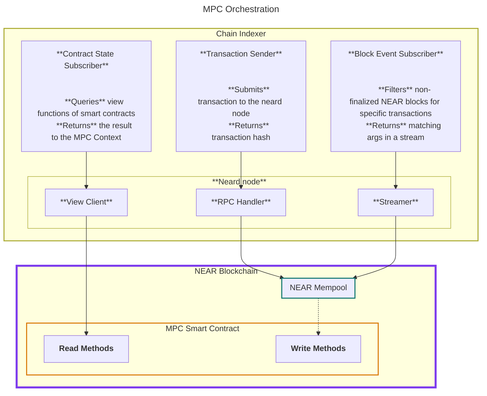

# Chain Gateway

This crate can be used to spawn and intract with a neard node.
It is currently work in progress, but aims to offer the API outlined in [indexer-breakout](../../docs/indexer-breakout.md).

current API (will gradually transition):

```rust
use chain_gateway::neard::start_with_streamer;

let (chain_gateway, stream) = start_with_streamer(near_indexer_config).await;
```


The chain indexer consists of three functionalities, each one with their own API:

- **Contract State subscriber:** subscribe to arbitrary view methods on arbitrary contracts on the NEAR blockchain.
- **Block Events:** Filter the mempool for transactions matching a specific pattern (receipient or executor id and method names). Receive a stream of all matching transactions.
- **Transaction Sender:** send transactions to the NEAR blockchain.



## API


### Contract State Subscriber

```rust
trait ContractStateSnapshot<T> {
    /// is synchronous, contains the last seen value
    fn latest(&self) -> Result<(BlockHeight, &T), Error>;
}

trait ContractStateStream<T> {
    /// is synchronous, contains the last seen value
    fn latest(&self) -> Result<(BlockHeight, &T), Error>;
    /// returns if the value of type `T` has changed
    async fn changed(&mut self) -> Result<(), Error>;
}


impl ContractStateSubscriber {
    async fn subscribe<T: DeserializeOwned + PartialEq + Send + 'static>(
        &self,
        contract: AccountId,
        view_method: &str,
    ) -> Result<impl ContractStateStream<T> + Send, Error>;

    async fn view<T: DeserializeOwned + PartialEq + Send + 'static>(
        &self,
        contract: AccountId,
        view_method: &str,
    ) -> Result<impl ContractStateSnapshot<T> + Send, Error>;
}

pub struct ContractStateSubscriber {
    /// nearcore view client
    view_client: IndexerViewClient
}
```


### Block Event Subscriber

```rust
impl BlockEventSubscriber {
    pub fn new(subscription_replay: SubscriptionReplay) -> Self;
    
    /// Configure queue size between producer and consumer.
    /// we can define overflow behavior later, by default we could just stop producing (neard indexer will consume unlimited amount of memory).
    pub fn buffer_size(&mut self, n: usize) -> Self;

    /// Add a subscription and get a unique identifier for it.
    /// Can be called multiple times before build().
    /// the identifier can be used to match a return value to the given subscription id.
    pub fn add_subscription(&mut self, filter: SubscriptionFilter) -> SubscriptionId;

    /// Finalise and start streaming.
    pub async fn start(&mut self) -> Result<tokio::sync::mpsc::Receiver<BlockUpdate>, BuilderError>;
}

/// an identifier for a subscription
pub struct SubscriptionId(pub u64);

/// Filter - can be easily extended later
pub enum SubscriptionFilter {
    /// Filter for events where a receipt outcome was executed by `transaction_outcome_executor_id` and called `method_name`.
    ExecutorFunctionCall {
        transaction_outcome_executor_id: AccountId,
        method_name: String,
    },
    /// Filter for events where a receipt was addressed to `receipt_receiver_id` and called `method_name`.
    ReceiverFunctionCall {
        receipt_receiver_id: AccountId,
        method_name: String,
    },
}

/// we want to offer the possibility to re-play blocks if necessary (c.f. [#236](https://github.com/near/mpc/issues/236))
pub enum SubscriptionReplay {
    /// no replay, start once indexer has caught up to the current block height
    None,
    /// Start at a specific height
    BlockHeight(u64),
}

```

Example usage:
```rust

let mut subscriber = BlockEventSubscriber::new(SubscriptionReplay::None);

let signature_requests_id = subscriber.add_subscription(
    SubscriptionFilter::ExecutorFunctionCall {
        transaction_outcome_executor_id: "v1.signer".parse()?,
        method_name: "sign".to_string(),
    }
);

let ckd_request_id = subscriber.add_subscription(
    SubscriptionFilter::ExecutorFunctionCall {
        transaction_outcome_executor_id: "v1.signer".parse()?,
        method_name: "request_app_private_key".to_string(),
    }
);

let mut block_stream_receiver : tokio::sync::mpsc::Receiver<BlockUpdate> = subscriber.start().await?;

while let Some(update) = block_stream_receiver.recv().await {
    for matched in update.events {
        match matched.id {
            id if id == signature_requests_id => { /* handle signature request */ }
            id if id == ckd_request_id => { /* handle ckd request */ }
            _ => {}
        }
    }
}

```

Specific types (c.f. [Appendix](#current-block-update) and `indexer/handler.rs` for justification).
```rust
/// The BlockUpdate returned by the Chain indexer. Similar to the current `BlockUpdate`
pub struct BlockUpdate {
    pub ctx: BlockContext,
    pub events: Vec<MatchedEvent>,
}

/// Context for a single block
pub struct BlockContext {
    pub hash: CryptoHash,
    pub height: u64,
    pub prev_hash: CryptoHash,
    pub last_final_block: CryptoHash,
    pub block_entropy: [u8; 32],
    pub block_timestamp_nanosec: u64,
}

pub struct MatchedEvent {
    /// this is needed such that the caller can identify the filter
    pub id: SubscriptionId,
    /// any data associated with that event
    pub event_data: EventData,
}

/// this can be extended if required
pub enum EventData {
    ExecutorFunctionCall(ExecutorFunctionCallEventData),
    ReceiverFunctionCall(ReceiverFunctionCallEventData),
}

/// This event is associated to a transaction that matched a specific (transaction_outcome_executor_id: AccountId, method_name: String) pattern.
struct ExecutorFunctionCallEventData {
    /// the receipt_id of the receipt this event came from
    receipt_id: CryptoHash,
    /// predecessor_id who signed the transaction
    predecessor_id : AccountId,
    /// the receipt that will hold the outcome of this receipt
    next_receipt_id: CryptoHash,
    /// raw bytes used for function call. Could probably also be a String.
    args_raw: Vec<u8>,
}

/// This event is associated to a transaction that matched a specific SubscriptionFilter
struct ReceiverFunctionCallEventData {
    // the receipt id for the matched transaction
    receipt_id: CrpytoHash,
}
```


### Transaction Sender

```rust

pub struct TransactionSender<V>
where
    V: LatestFinalBlock,
{
    /// rpc handler for sending txs to the chain (internal type, c.f. indexer.rs)
    rpc_handler: IndexerRpcHandler,
    /// method to the view client to query the latest final block (needed for nonce computation)
    view_client: V,
}

/// we could probably make this a trait for testing?
impl<V> TransactionSender<V>
where
    V: LatestFinalBlock
{
    /// creates a function call transaction for contract `receiver_id` with method `method_name` and args `args`
    /// returns the CryptoHash for the receipt, such that the execution outcome can be tracked
    pub async fn submit_function_call_tx(
        &self,
        /// Key with which this transaction should be signed
        signer: TransactionSigner,
        /// contract on which this method should be called
        receiver_id: AccountId,
        /// method name to call
        method_name: String,
        /// arguments for the method
        args: Vec<u8>,
        /// deposit amount
        deposit: Near,
        /// gas to attach
        gas: Gas,
    ) -> Result<CryptoHash, TxSignerError>;
}

/// we will implement this for the view client
trait LatestFinalBlock {
    async fn latest_final_block(&self) -> Result<BlockView, Error>;
}
```

Additionally, we will expose the following types and methods (omitting internals, c.f. tx_signer.rs)
```rust
pub struct TransactionSigner {
    signing_key: SigningKey,
    account_id: AccountId,
    nonce: Mutex<u64>,
}

impl TransactionSigner {
    pub fn from_key(account_id: AccountId, signing_key: SigningKey) -> Self {
        TransactionSigner {
            account_id,
            signing_key,
            nonce: Mutex::new(0),
        }
    }
    /// might be good to expose
    pub fn public_key(&self) -> VerifyingKey {
        self.signing_key.verifying_key()
    }
}
```
