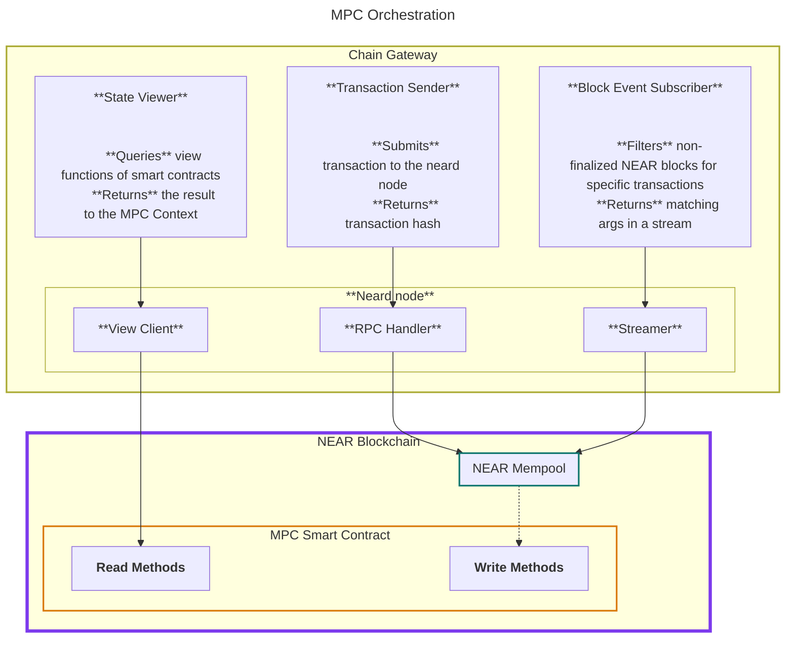

# Chain Gateway

This crate spawns and interacts with an in-process neard node. It provides three subsystems for blockchain interaction:

- **State Viewer:** query and subscribe to arbitrary view methods on NEAR smart contracts.
- **Block Events:** filter finalized blocks for matching transactions/receipts and receive them as a stream. *(planned — not yet implemented)*
- **Transaction Sender:** submit signed transactions to the NEAR blockchain.

```rust
use chain_gateway::start_with_streamer;

let (chain_gateway, stream) = start_with_streamer(near_indexer_config).await?;

// ChainGateway implements ContractViewer, MethodViewer,
// ContractStateSubscriber, and FunctionCallSubmitter directly.
// Use it as the viewer and transaction sender without any accessor methods.
```


```mermaid
---
title: MPC Orchestration
---
flowchart TB

subgraph CHAIN[Chain Gateway]
    direction TB
    TX_SUBSCRIBER[**Block Event Subscriber**<br/><br/>
        **Filters** non-finalized NEAR blocks for specific transactions
        **Returns** matching args in a stream
    ]

    CONTRACT_STATE_VIEWER[**State Viewer**<br/><br/>
        **Queries** view functions of smart contracts
        **Returns** the result to the MPC Context
    ]

    TX_SENDER[**Transaction Sender**<br/><br/>
        **Submits** transaction to the neard node
        **Returns** transaction hash
    ]

    subgraph NEARD[**Neard node**]
        direction TB
        BLOCK_STREAMER[**Streamer**]

        VIEW_CLIENT[**View Client**]

        RPC_HANDLER[**RPC Handler**]

    end
end

subgraph NEAR[NEAR Blockchain]
    direction TB

    subgraph MEMPOOL[NEAR Mempool]
    end

    subgraph CONTRACT[MPC Smart Contract]
        direction TB
        CONTRACT_VIEW[
        <b>Read Methods</b>
        ]

        CONTRACT_WRITE[
        <b>Write Methods</b>
        ]


    end

end


%% Chain Gateway --> Neard Node
TX_SUBSCRIBER --> BLOCK_STREAMER
CONTRACT_STATE_VIEWER --> VIEW_CLIENT
TX_SENDER --> RPC_HANDLER

%% Neard --> Smart Contract
RPC_HANDLER --> MEMPOOL
MEMPOOL -.-> CONTRACT_WRITE
VIEW_CLIENT --> CONTRACT_VIEW
BLOCK_STREAMER --> MEMPOOL

%% ------------------------
%% Styling
%% ------------------------

classDef core stroke:#1b5e20,stroke-width:4px;
classDef indexer stroke:#2563eb,stroke-width:4px;
classDef near stroke:#7c3aed,stroke-width:4px;
classDef contract stroke:#d97706,stroke-width:2px;
classDef mempool stroke:#0f766e,stroke-width:2px;
classDef chain stroke-width:2px;

class NEAR near;
class CONTRACT contract;
class MEMPOOL mempool;
class CHAIN chain;
```

## API

### State Viewer

The state viewer uses a trait hierarchy with blanket impls. Implement the low-level
`SyncChecker` + `ViewFunctionQuerier` primitives on your type, then add empty impls for
`ContractViewer`, `MethodViewer` (one-shot typed view calls), and `ContractStateSubscriber`
(polling subscriptions) to get the default behaviour. `ChainGateway` is the production
implementation (backed by the real nearcore actor system); unit tests use `MockChainState`
(see `src/mock.rs`).

```rust
/// Waits for sync then delegates to ViewFunctionQuerier.
/// Supertraits provide the raw RPC plumbing.
pub trait ContractViewer: SyncChecker + ViewFunctionQuerier {
    async fn view_raw(
        &self,
        contract_id: &AccountId,
        method_name: &str,
        args: &[u8],
    ) -> Result<ObservedState, ChainGatewayError>;
}

/// One-shot typed view call with JSON ser/de.
pub trait MethodViewer: ContractViewer {
    async fn view<Arg: Serialize + Sync, Res: DeserializeOwned + Send + Clone>(
        &self, contract_id: AccountId, method_name: &str, args: &Arg,
    ) -> Result<ObservedState<Res>, ChainGatewayError>;
}

/// Polls every 200ms; emits change only when returned bytes differ.
pub trait ContractStateSubscriber: ContractViewer + Clone {
    async fn subscribe<T: DeserializeOwned + Send + Clone>(
        &self, contract: AccountId, view_method: &str,
    ) -> impl ContractStateStream<T> + Send;
}
```

The `ContractStateStream` trait provides a watch-like interface for observing contract state changes:

```rust
#[async_trait]
pub trait ContractStateStream<Res> {
    /// Returns the last value observed on chain and the block height at which it was observed.
    fn latest(&mut self) -> Result<ObservedState<Res>, ChainGatewayError>;

    /// Waits until the observed value changes.
    async fn changed(&mut self) -> Result<(), ChainGatewayError>;
}
```

Key types in `types.rs`:

```rust
pub struct ObservedState<T = Vec<u8>> {
    pub observed_at: BlockHeight,
    pub value: T,
}
pub type RawObservedState = ObservedState<Vec<u8>>;

pub struct NoArgs {}   // empty args for view calls with no parameters
pub struct BlockHeight(u64);
```


### Block Event Subscriber

> **Status: not yet implemented.** Block event handling currently lives in
> `node::indexer::handler::listen_blocks()`, which consumes the raw `StreamerMessage` channel
> returned by `start_with_streamer()`. The API below is the planned design for when this
> functionality is moved into chain-gateway.

```rust
impl BlockEventSubscriber {
    pub fn new(subscription_replay: SubscriptionReplay) -> Self;

    /// Configure queue size between producer and consumer.
    /// we can define overflow behavior later, by default we could just stop producing (neard indexer will consume unlimited amount of memory).
    pub fn buffer_size(&mut self, n: usize) -> Self;

    /// Add a subscription and get a unique identifier for it.
    /// Can be called multiple times before build().
    /// the identifier can be used to match a return value to the given subscription id.
    pub fn add_subscription(&mut self, filter: SubscriptionFilter) -> SubscriptionId;

    /// Finalise and start streaming.
    pub async fn start(&mut self) -> Result<tokio::sync::mpsc::Receiver<BlockUpdate>, BuilderError>;
}

/// an identifier for a subscription
pub struct SubscriptionId(pub u64);

/// Filter - can be easily extended later
pub enum SubscriptionFilter {
    /// Filter for events where a receipt outcome was executed by `transaction_outcome_executor_id` and called `method_name`.
    ExecutorFunctionCall {
        transaction_outcome_executor_id: AccountId,
        method_name: String,
    },
    /// Filter for events where a receipt was addressed to `receipt_receiver_id` and called `method_name`.
    ReceiverFunctionCall {
        receipt_receiver_id: AccountId,
        method_name: String,
    },
}

/// we want to offer the possibility to re-play blocks if necessary (c.f. [#236](https://github.com/near/mpc/issues/236))
pub enum SubscriptionReplay {
    /// no replay, start once indexer has caught up to the current block height
    None,
    /// Start at a specific height
    BlockHeight(u64),
}

```

Example usage:
```rust

let mut subscriber = BlockEventSubscriber::new(SubscriptionReplay::None);

let signature_requests_id = subscriber.add_subscription(
    SubscriptionFilter::ExecutorFunctionCall {
        transaction_outcome_executor_id: "v1.signer".parse()?,
        method_name: "sign".to_string(),
    }
);

let ckd_request_id = subscriber.add_subscription(
    SubscriptionFilter::ExecutorFunctionCall {
        transaction_outcome_executor_id: "v1.signer".parse()?,
        method_name: "request_app_private_key".to_string(),
    }
);

let mut block_stream_receiver : tokio::sync::mpsc::Receiver<BlockUpdate> = subscriber.start().await?;

while let Some(update) = block_stream_receiver.recv().await {
    for matched in update.events {
        match matched.id {
            id if id == signature_requests_id => { /* handle signature request */ }
            id if id == ckd_request_id => { /* handle ckd request */ }
            _ => {}
        }
    }
}

```

Specific types (c.f. [Appendix](#current-block-update) and `indexer/handler.rs` for justification).
```rust
/// The BlockUpdate returned by the Chain indexer. Similar to the current `BlockUpdate`
pub struct BlockUpdate {
    pub ctx: BlockContext,
    pub events: Vec<MatchedEvent>,
}

/// Context for a single block
pub struct BlockContext {
    pub hash: CryptoHash,
    pub height: u64,
    pub prev_hash: CryptoHash,
    pub last_final_block: CryptoHash,
    pub block_entropy: [u8; 32],
    pub block_timestamp_nanosec: u64,
}

pub struct MatchedEvent {
    /// this is needed such that the caller can identify the filter
    pub id: SubscriptionId,
    /// any data associated with that event
    pub event_data: EventData,
}

/// this can be extended if required
pub enum EventData {
    ExecutorFunctionCall(ExecutorFunctionCallEventData),
    ReceiverFunctionCall(ReceiverFunctionCallEventData),
}

/// This event is associated to a transaction that matched a specific (transaction_outcome_executor_id: AccountId, method_name: String) pattern.
struct ExecutorFunctionCallEventData {
    /// the receipt_id of the receipt this event came from
    receipt_id: CryptoHash,
    /// predecessor_id who signed the transaction
    predecessor_id : AccountId,
    /// the receipt that will hold the outcome of this receipt
    next_receipt_id: CryptoHash,
    /// raw bytes used for function call. Could probably also be a String.
    args_raw: Vec<u8>,
}

/// This event is associated to a transaction that matched a specific SubscriptionFilter
struct ReceiverFunctionCallEventData {
    // the receipt id for the matched transaction
    receipt_id: CrpytoHash,
}
```


### Transaction Sender

The transaction sender uses a trait hierarchy similar to the state viewer. `FunctionCallSubmitter`
is the public trait for submitting function-call transactions. Implement the low-level
`LatestFinalBlockInfoFetcher` + `SignedTransactionSubmitter` primitives and add an empty
`FunctionCallSubmitter` impl to get the default behaviour. `ChainGateway` is the production
implementation; unit tests use `MockChainState`.

```rust
/// Public trait for submitting function-call transactions.
/// Default impl fetches the latest final block, signs, and submits.
#[async_trait]
pub trait FunctionCallSubmitter:
    LatestFinalBlockInfoFetcher + SignedTransactionSubmitter + Send + Sync + Clone + 'static
{
    async fn submit_function_call_tx(
        &self,
        signer: Arc<TransactionSigner>,
        receiver_id: AccountId,
        method_name: String,
        args: Vec<u8>,
        gas: Gas,
    ) -> Result<CryptoHash, ChainGatewayError>;
}
```

`TransactionSigner` handles nonce management and ED25519 signing:

```rust
pub struct TransactionSigner { /* ... */ }

impl TransactionSigner {
    pub fn from_key(account_id: AccountId, signing_key: SigningKey) -> Self;
    pub fn public_key(&self) -> VerifyingKey;
}
```

## Testing

- **State viewer unit tests** use `MockChainState` (see `src/mock.rs`) implementing all required
  traits to test monitoring, subscription caching, and view-call logic without a real NEAR node
  (see `src/state_viewer/monitoring.rs` and `src/state_viewer/subscription.rs`).
- **Transaction sender unit tests** use `MockChainState` to verify the `FunctionCallSubmitter`
  default impl (signing, nonce, error propagation). Downstream crates can implement
  `FunctionCallSubmitter` directly for their own mocks.
- **Integration tests** start a full in-process NEAR node with a WAT contract embedded in genesis,
  exercising the complete path through the actor system (see `tests/state_viewer_integration.rs`).
