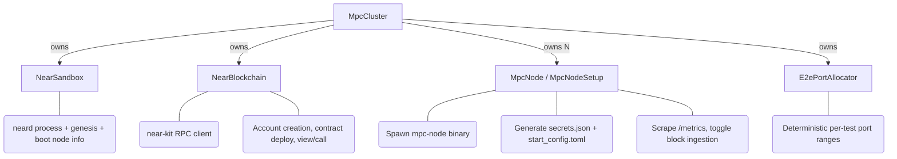

# Rust E2E Test Infrastructure

## Purpose

This is a mostly Claude-generated document describing the Rust end-to-end test
framework. It reflects the implementation that lives in `crates/e2e-tests/`
and is intended as a reference for engineers writing new tests.

This is a living document — the earlier draft ([#2446]) set the direction; the
sections below have been revised to match what was actually built.

[#2446]: https://github.com/near/mpc/pull/2446

---

## Architecture Overview

An E2E test runs real `mpc-node` OS processes against a real `neard` sandbox
with a freshly deployed MPC contract. The crate exposes four components that
cooperate:



### Key design decisions

1. **Real `neard` sandbox, real `mpc-node` binaries.** Each test starts a
   `near-sandbox` process (via the `near-sandbox` crate, which downloads a real
   neard binary) and spawns `N` real `mpc-node` processes built from this repo.
   The mpc-node binary uses its built-in NEAR indexer, which in turn runs its
   own small `neard` peered with the sandbox over P2P — i.e. we exercise the
   production code path end-to-end, including config parsing, P2P networking,
   the indexer, and Prometheus metrics.

2. **RPC-only contract interaction.** Tests never touch the sandbox process
   directly; everything happens through a `near-kit` RPC client. The
   `NearBlockchain` and `DeployedContract` wrappers accept any RPC URL, so
   the same test code could in principle run against a deployed testnet
   (though this isn't exercised in CI yet).

3. **Deterministic ports per test.** `cargo nextest` runs each test in its own
   process, so tests execute concurrently by default. Each test declares a
   unique `port_seed`; `E2ePortAllocator` maps that seed to a non-overlapping
   range of ports for the sandbox, the mpc-node web/P2P/pprof endpoints, and
   the per-node neard instances. Seeds are centralised as constants in
   `tests/common.rs` to avoid collisions.

4. **Support for mixed node versions.** `MpcClusterConfig::binary_paths` takes a
   vec of paths; if it has a single entry, all nodes use it, otherwise each
   node uses the corresponding entry. This enables compatibility tests across
   `mpc-node` versions (not yet in routine use, but wired up).

5. **Separate "operator" keys.** Each node account has two full-access keys on
   chain: one used by the mpc-node process itself for its NEAR transactions
   (`node_keys`) and a second key held by the test harness (`operator_keys`)
   for casting votes. Disjoint key sets keep the node's nonce sequence clean
   and let the harness issue contract calls without racing the node.

6. **Crate location.** The framework lives at `crates/e2e-tests/`. Its `src/`
   exposes the components as library APIs; actual tests live in `tests/` and
   are declared via the `[[test]] name = "e2e"` entry in `Cargo.toml`, which
   compiles them as submodules of `tests/e2e.rs` (one binary, one neard
   download, parallel test execution via nextest).

---

## Components

> **Note:** The snippets below capture the shape of each component, not
> exhaustive signatures. Read the source for the authoritative API.

### 1. `NearSandbox` — neard process wrapper

Starts a `near-sandbox` binary at a configurable version, on ports assigned by
`E2ePortAllocator`. Exposes everything an `mpc-node` indexer needs to peer with
it: genesis path, boot-node string (`<pubkey>@127.0.0.1:<port>`), and chain ID.

```rust
pub struct NearSandbox { /* wraps near_sandbox::Sandbox */ }

impl NearSandbox {
    pub async fn start(ports: &E2ePortAllocator, version: &str) -> anyhow::Result<Self>;
    pub fn rpc_url(&self) -> String;
    pub fn genesis_path(&self) -> PathBuf;
    pub fn boot_nodes(&self) -> anyhow::Result<String>;
    pub fn chain_id(&self) -> anyhow::Result<String>;
}
```

The inner `Sandbox` kills the process and deletes its temp directory on drop.

### 2. `NearBlockchain` — RPC client

Wraps a `near_kit::Near` client signed as the sandbox root account. All
contract interaction, account creation, and WASM deployment goes through it.

```rust
pub struct NearBlockchain { /* root_client + rpc_url */ }

impl NearBlockchain {
    pub fn new(rpc_url: &str, root_account: &str, root_secret: near_kit::SecretKey)
        -> anyhow::Result<Self>;
    pub async fn create_account_with_keys(&self, name: &str, balance_near: u128,
        keys: &[SigningKey]) -> anyhow::Result<()>;
    pub async fn create_account_and_deploy(&self, name: &str, balance_near: u128,
        key: &SigningKey, wasm: &[u8]) -> anyhow::Result<DeployedContract>;
    pub fn client_for(&self, account_id: &str, key: &SigningKey)
        -> anyhow::Result<ClientHandle>;
}
```

`DeployedContract` wraps the contract's account ID plus its own `near-kit`
client. It exposes `call` (from the contract account), `call_from`/
`call_from_with_deposit` (from an arbitrary `ClientHandle`), `view`, and
`state()` (parsed `ProtocolContractState`).

`ClientHandle` exists so tests can re-use a signer for a non-contract account
(nodes voting, users submitting sign requests) without leaking `near_kit`
types into the public API.

### 3. `MpcNode` / `MpcNodeSetup` — node process manager

`MpcNodeSetup` owns everything needed to start a node (binary path, home dir,
signing keys, ports, contract account, sandbox chain info, foreign-chain
config). It writes `secrets.json` and `start_config.toml` on creation and
exposes `start()` to spawn the process, returning an `MpcNode`.

`MpcNode` owns a running child process via a `ProcessGuard` that SIGKILLs on
drop. It exposes:

- `kill() -> MpcNodeSetup` and `restart() -> MpcNode` — lifecycle.
- `has_exited()` — sanity check to surface early crashes.
- `get_metric(name)` — scrape `/metrics` and parse an `i64`.
- `set_block_ingestion(active)` — writes a flag file that pauses block ingest
  (requires the `network-hardship-simulation` feature, which CI builds with).
- `web_address()`, `pprof_address()`, `setup()` for accessors.

`MpcNodeSetup` also offers `wipe_db()` (targeted SST/MANIFEST cleanup) and
`reset_mpc_state()` (nuke the entire home dir — used after SIGKILL where the
indexer state may be corrupt).

### 4. `MpcCluster` — orchestration

The entry point for tests. `MpcCluster::start(config)` does everything:

1. Create `E2ePortAllocator` from `config.port_seed`.
2. Create a per-test temp directory.
3. Start the `NearSandbox`.
4. Build a `NearBlockchain` signed as the sandbox root.
5. Generate deterministic signing keys for each node (near signer, p2p, operator,
   plus a separate contract deployer key).
6. Deploy the compiled MPC contract WASM to `mpc.sandbox`.
7. Create `nodeN.sandbox` accounts, each with a `near_signer_key` and a
   disjoint `operator_key` as full-access keys.
8. Call `init()` on the contract with the initial participants.
9. Call `submit_participant_info` for each initial participant (with a
   `{"Mock": "Valid"}` attestation — enough to satisfy the contract in tests).
10. Spawn the `mpc-node` binaries (start *before* adding domains so key
    generation has running nodes to talk to).
11. Sleep briefly and assert no node exited early.
12. If `config.domains` is non-empty, vote `add_domains` from each participant
    and wait for `Running` state.
13. Create user accounts for signing/CKD/verify requests.

The returned cluster exposes:

- **Node lifecycle:** `kill_nodes`, `start_nodes`, `reset_and_start_nodes`
  (wipe + start + wait for health), `kill_all`.
- **Contract state:** `get_contract_state`, `wait_for_state`,
  `wait_for_node_healthy`, `get_tee_accounts`.
- **Resharing:** `start_resharing`, `start_resharing_and_wait`,
  `vote_cancel_resharing_from`, `add_domains`.
- **Metrics:** `get_metric_all_nodes`, `wait_for_metric_all_nodes`.
- **Data management:** `wipe_db`, `set_block_ingestion`.
- **Request submission:** `send_sign_request`, `send_ckd_request`,
  `send_verify_foreign_transaction`.
- **Foreign chain policy:** `view_foreign_chain_policy`,
  `view_foreign_chain_policy_proposals`, `vote_foreign_chain_policy`.
- **User accounts:** `user_client`, `default_user_account`.

`Drop` kills all running nodes; the temp directory is held via `test_dir` and
removed when the cluster is dropped.

```rust
pub struct MpcClusterConfig {
    pub num_nodes: usize,
    pub threshold: usize,
    pub domains: Vec<DomainConfig>,
    pub binary_paths: Vec<PathBuf>,             // one or num_nodes
    pub contract_wasm: Vec<u8>,                 // pre-compiled by the test
    pub port_seed: u16,
    pub triples_to_buffer: usize,
    pub presignatures_to_buffer: usize,
    pub sandbox_version: String,
    pub home_base: Option<PathBuf>,
    pub initial_participant_indices: Vec<usize>,
    pub node_foreign_chains_configs: Vec<ForeignChainsConfig>,
}

impl MpcClusterConfig {
    pub fn default_for_test(port_seed: u16, contract_wasm: Vec<u8>) -> Self;
    pub fn participant_indices(&self) -> Vec<usize>;
}
```

### 5. `E2ePortAllocator` — deterministic port layout

Each test declares a `port_seed: u16`. Ports are computed as:

```
BASE_PORT (20000) + test_id * PORTS_PER_TEST + offset
```

with `PORTS_PER_TEST = 2 + 10 * 8` (2 cluster ports + 8 per-node ports × 10
maximum nodes). Cluster-level ports cover the sandbox RPC and network; per-node
ports cover p2p, web UI, migration web UI, pprof, and the node's internal
neard RPC/network.

Centralising seeds in `tests/common.rs` (e.g. `CKD_VERIFICATION_PORT_SEED = 9`)
keeps parallel tests from colliding. If a test crashes and leaves an orphan
`mpc-node` holding its ports, the next run will fail to bind — clean up with
`cargo make kill-orphan-mpc-nodes`.

### 6. Foreign chain mocks

`foreign_chain_mock.rs` exposes `setup_bitcoin_mock`, `setup_evm_mock`, and
`setup_starknet_mock`. Each takes an `httpmock::MockServer` and attaches a
POST `/` handler that returns hardcoded JSON-RPC responses for the methods
the MPC nodes call during `verify_foreign_transaction`. Tests own the
`MockServer`s directly (rather than a wrapping struct) so they can wire the
URLs into the per-node `ForeignChainsConfig` via `MpcClusterConfig`.

---

## Writing a test

Tests live under `crates/e2e-tests/tests/<feature>.rs` and must be declared as
a module from `tests/e2e.rs`. `tests/common.rs` provides helpers used by most
tests (`must_setup_cluster`, `wait_for_presignatures`, `must_load_contract_wasm`,
`send_sign_request`, etc.).

```rust
// tests/request_lifecycle.rs
use crate::common;

#[tokio::test]
async fn request_lifecycle__signature_request_succeeds() {
    let (cluster, running) =
        common::must_setup_cluster(common::SIGN_REQUEST_PER_SCHEME_PORT_SEED, |_| {}).await;

    let mut rng = rand::thread_rng();
    let user = cluster.default_user_account().clone();
    common::send_sign_request(&cluster, &running, &mut rng, &user).await;
}
```

`must_setup_cluster` builds the default 3-node / 2-of-3 / 3-domain cluster, waits
for `Running`, and blocks until presignatures are buffered. Pass a closure to
override fields on `MpcClusterConfig`.

---

## Prerequisites

### `neard` sandbox binary

`NearSandbox` uses the [`near-sandbox`](https://crates.io/crates/near-sandbox)
crate, which downloads a precompiled `neard` binary on first run. That binary
is linked against a specific glibc and will crash on systems whose glibc is
incompatible (common on older/minimal Linux distributions and some CI
images).

If you hit a crash or "GLIBC not found" error from the sandbox, point the
tests at a locally built `neard` via `NEAR_SANDBOX_BIN_PATH`:

```bash
export NEAR_SANDBOX_BIN_PATH=/path/to/neard   # e.g. a neard built from nearcore
cargo make e2e-tests
```

---

## Running the tests

```bash
cargo make e2e-tests                       # Build required binaries and run all tests
cargo make e2e-tests-skip-build            # Reuse binaries from a previous run
cargo make e2e-tests-skip-build -- <name>  # Run a single test (filter passed to nextest)
cargo make kill-orphan-mpc-nodes           # Recover from ports held by crashed runs
```

The task runner builds three things before tests run: the mpc-node binary
with the `network-hardship-simulation` feature, the MPC contract WASM, and
the test parallel contract WASM. Paths are passed to tests via the
`MPC_CONTRACT_WASM` and `MPC_PARALLEL_CONTRACT_WASM` environment variables
read by `must_load_contract_wasm` / `must_load_parallel_contract_wasm` in
`tests/common.rs`; if the env var is unset and no pre-built WASM is found,
`test-utils::contract_build::ContractBuilder` builds it on the fly (useful for
local iteration).

CI runs the same task via the `mpc-e2e-tests` job.

---

## Test layout conventions

- Follow the `<subject>__should_<assertion>` or `<subject>__<scenario>` naming
  from `docs/engineering-standards.md`.
- Reserve a unique `port_seed` constant in `tests/common.rs` before adding a
  new test. Don't reuse someone else's seed, even if the test is short.
- Prefer `common::must_setup_cluster` over calling `MpcCluster::start` directly;
  it initialises `tracing_subscriber` and waits for presignatures.
- Tests must be deterministic across parallel execution. Use the port
  allocator, the per-cluster temp directory, and the deterministic key
  generation rather than creating state outside the cluster.
- Arithmetic in tests uses raw `+`/`-`/`*`/`/`; overflow panics are the
  desired failure mode (see `CLAUDE.md`).

---

## Related documents

- [`docs/engineering-standards.md`](../../docs/engineering-standards.md) —
  test naming, panic policy, I/O separation.
- [Issue #2440](https://github.com/near/mpc/issues/2440) — `MpcNode` design.
- [Issue #2441](https://github.com/near/mpc/issues/2441) — `MpcCluster`
  design.
- [PR #2446](https://github.com/near/mpc/pull/2446) — original design
  proposal.
