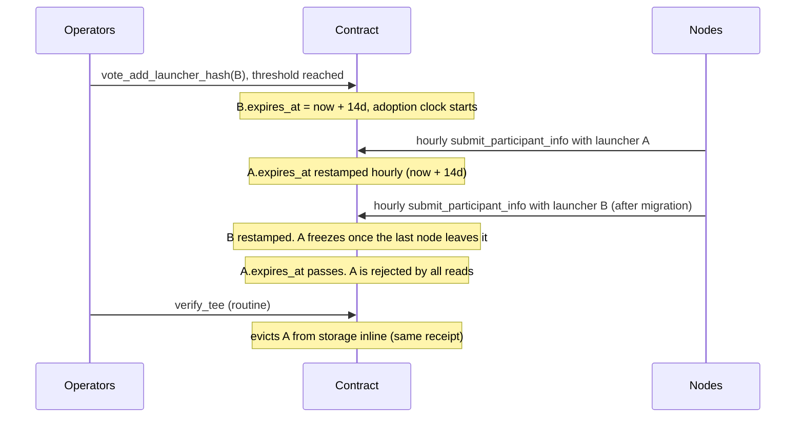

# Auto-Removal of Unused Launcher Image Hashes

**Status:** ARCHIVED
**Implemented:** [#3564](https://github.com/near/mpc/pull/3564)
**Issue:** [#3381](https://github.com/near/mpc/issues/3381)
**Related:** [Securing MPC with TEE](../../design/securing-mpc-with-tee-design-doc.md), [TEE Lifecycle](../../design/tee-lifecycle.md)

## Problem

`allowed_launcher_image_hashes` accumulates entries forever; removal requires a
**unanimous** vote (`vote_remove_launcher_hash`). MPC Docker image hashes, by
contrast, auto-expire 7 days after a newer image lands. In practice launcher
hashes pile up — only the newest is typically in use — with no way to shed the
old ones short of coordinating a unanimous vote.

The insight: **not using a launcher is itself a vote.** Every node already
resubmits an attestation hourly (`submit_participant_info`), proving which
launcher it runs. The contract can observe disuse and evict stale hashes
without any vote.

## Proposal

```rust
pub struct AllowedLauncherImage {
    launcher_hash: LauncherImageHash,
    compose_hashes: Vec<LauncherDockerComposeHash>,
    expires_at: Timestamp,  // NEW: stamped `now + TTL` when voted in / re-voted, and
                            // restamped on each attestation by a *current participant*.
}
```

An entry is **expired** when `expires_at < now`. The expiry is computed once at write
time (`expires_at = now + TTL`, saturating on overflow) — mirroring how attestations store
their own expiry — so reads are a plain `expires_at < now` comparison and the TTL is only
needed at the write sites (vote-in, refresh, migration), not threaded through every read.
A consequence: changing the TTL config applies to an entry on its *next* stamp (a node
resubmits hourly), not retroactively.
TTL is a new config field `launcher_hash_unused_ttl_seconds`, default **14 days**.
Config validation enforces `launcher_hash_unused_ttl_seconds >=
mpc_attestation::attestation::DEFAULT_EXPIRATION_DURATION_SECONDS` (the
attestation validity window, currently 7 days) — see Safety invariants. Note
this is the *attestation validity* constant, not
`DEFAULT_TEE_UPGRADE_DEADLINE_DURATION_SECONDS` (the MPC docker-image grace
period, 7 days).

Three parts:

1. **Refresh on use** — after a successful verify in `submit_participant_info`
   (hourly per node), the contract restamps `expires_at = now + TTL` on the entry
   owning the validated compose hash. No node-side changes.
   **Only a current participant's submission refreshes the timestamp.**
   `submit_participant_info` is also callable by prospective (non-participant)
   nodes; letting them refresh would let any outside node keep a stale launcher
   alive indefinitely, so the refresh is gated on the caller being a current
   participant.
2. **Read-time filtering** — all reads of the allowed set (verify, re-verify,
   views) skip expired entries, so an expired hash is rejected the moment its
   TTL lapses. If *all* entries are expired, the newest is still returned
   (disaster-recovery fallback, mirrors `AllowedDockerImageHashes`).
3. **Inline eviction** — `reverify_and_cleanup_participants` (the body of
   `verify_tee`) deletes expired entries right after the analogous eviction of
   the MPC docker-image hashes. The allowed set is a small, operator-curated
   in-memory `Vec`, so eviction is a plain `retain` (no extra storage reads, no
   separate receipt) that always keeps at least the newest entry. **No new
   public API and no extra config.**

Stamping `expires_at = now + TTL` at vote-in means a hash voted in but **never adopted**
(e.g. a newly voted launcher image no node ever migrated to) also expires after
one TTL window. Recovery: `vote_add_launcher_hash` for an already-present entry
restamps its `expires_at` (threshold vote, not unanimity).

### Safety invariants

- A hash backing a **valid participant attestation is never expired**: a
  current participant resubmits hourly, so its valid attestation (at most
  `DEFAULT_EXPIRATION_DURATION_SECONDS`, currently 7 days, old) restamped the
  entry's `expires_at = now + TTL` that recently, so `expires_at >= now` holds
  whenever `TTL >= DEFAULT_EXPIRATION_DURATION_SECONDS` — regardless of the
  constant's exact value. Enforced by config validation
  (`launcher_hash_unused_ttl_seconds >= DEFAULT_EXPIRATION_DURATION_SECONDS`);
  the 14-day default is `>= DEFAULT_EXPIRATION_DURATION_SECONDS` (the
  attestation window, currently 7 days), leaving ample margin.
- The list is **never empty / never fully rejected** (sweep keeps newest,
  read fallback returns newest).

### Out of scope / unchanged

- `vote_remove_launcher_hash` (unanimous) stays — manual override for removing
  a compromised launcher before its TTL lapses.
- OS measurements keep explicit voting (multiple sets must coexist long-term).
- MPC Docker image hash expiry, node, and launcher code: unchanged.

## Lifecycle



### Operator scenarios

| Scenario | Behavior |
|---|---|
| **Normal rotation** | Vote in `B`, migrate nodes. 14 days after the last node leaves `A`, it is auto-evicted. No removal vote. |
| **Rollback** | `B` broken; revert to `A` within 14 days — still valid, refreshes resume. `B` ages out. |
| **Slow rollout** (vote → migration > 14d) | `B` expires unused; re-vote it (threshold) to reset the clock. Rule of thumb: vote within 14 days of migrating. |
| **Node offline > 14d on an old launcher** | Its hash may age out (its attestation already lapsed at the attestation validity window). Recover by upgrading or re-voting the hash. |
| **Network outage > 14d** | All entries expire; newest still honored via fallback, others re-votable. |
| **Compromised launcher** | Unanimous `vote_remove_launcher_hash`, as today. |

## Migration

New borsh field ⇒ state migration: existing entries get
`expires_at = migration time + TTL` — every current hash starts a fresh 14-day
clock; stale testnet hashes age out with no further action. The 3.13.0 migration
also stamps an expiry on legacy `MockAttestation::Valid` entries (from #3785) so
they become cleanable; the two steps run together.

## Alternatives considered

- **Instant eviction when no participant references a hash** — no rollback
  window; a broken new launcher would need a re-vote under incident pressure.
- **Exempting never-used hashes** — a forgotten/mistaken vote would linger
  forever, the very problem being solved.
- **Detached-promise sweep** — evict in a `#[private]` self-call spawned by
  `verify_tee` (gas via a dedicated config field), so a failed/out-of-gas sweep
  can't fail the host transaction, matching the post-resharing cleanups in
  `vote_reshared`. Rejected: the allowed set is a tiny in-memory `Vec` with no
  real failure mode, and the MPC docker-image hashes are already evicted inline
  in the same method — inline (chosen above) is simpler, consistent, and drops
  a `#[private]` method plus a gas config field.
- **Public cleanup method** (the issue AC also suggests this) — rejected to
  avoid growing the already-large public API; inline eviction covers the same
  need with no new API.

## Decisions

- **TTL = 14 days** (`launcher_hash_unused_ttl_seconds`, operator-configurable).
  This implies *vote a launcher in at most 14 days before migrating to it*;
  if a hash expires unused, re-voting it (threshold) resets the clock.
