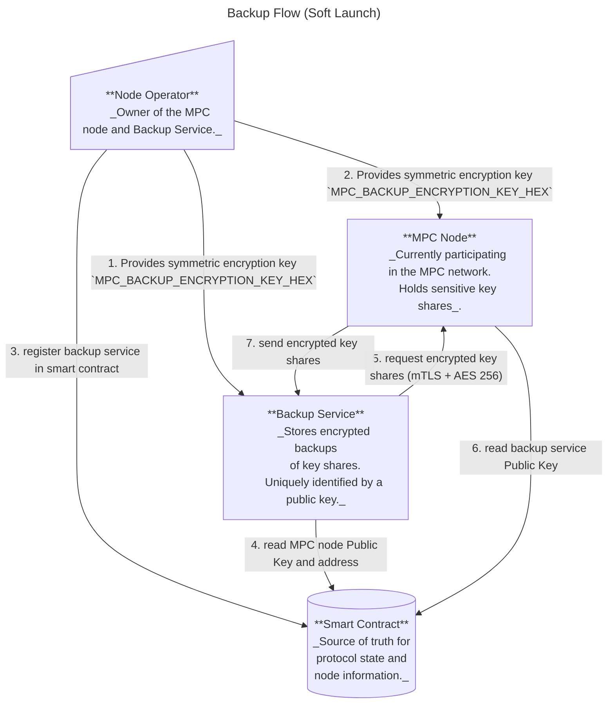
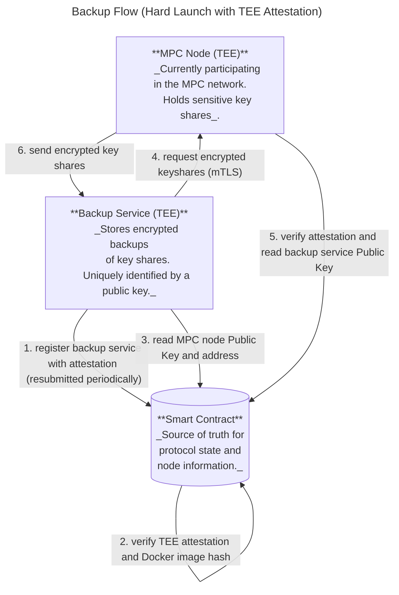
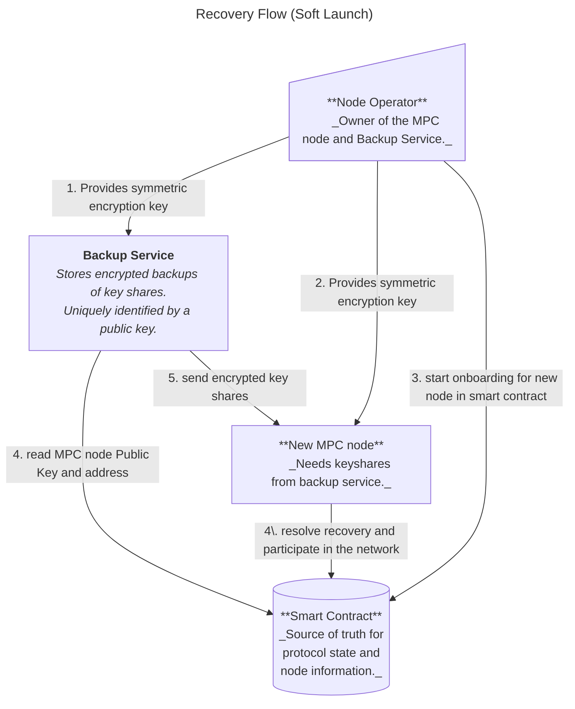
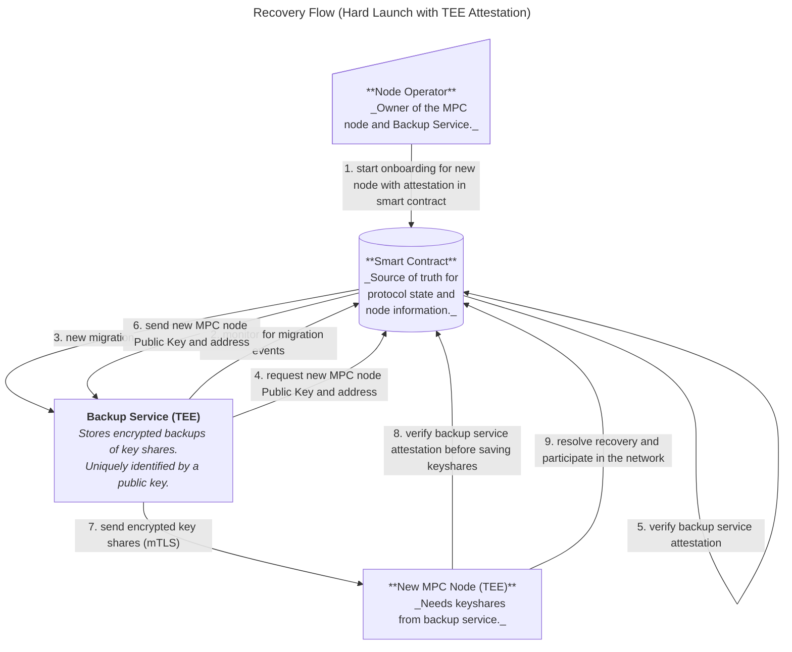

# Backup and Migration Service

**Status:** ARCHIVED

## Overview

Near One is currently in the process of migrating the MPC nodes into **Trusted Execution Environment (TEEs)** (c.f. [TEE doc](../../securing-mpc-with-tee-design-doc.md) for an introduction to TEEs and their benefits).

Running MPC nodes inside TEEs significantly increases the security of the network, but poses additional operational challenges:

- **Node migrations become more difficult:** Once an MPC node operates inside a TEE, extracting or transferring its secret key shares is infeasible. Migrating a node would normally require a full resharing, involving the entire MPC network.
- **Recovery from catastrophic failures is harder:** If multiple MPC nodes fails irrecoverably and simultaneously, the network risks losing its signing quorum, which could halt protocol operations.

This document outlines the design and implementation of a **Migration Service**, a service aimed at addressing those issues by solving the above problems:

1. **Operational resilience** — the migration service enables secure recovery of nodes in the event of hardware or system failure.
2. **Node migration** — the migration service allows node operators to move their MPC nodes into or between TEEs without resharing.

Near-One will roll-out its TEE implementation in two phases:
- **Soft Launch:**
    - Some MPC nodes are running within TEEs.
    - Their key shares are backed-up outside of the TEE through the migration service.
    - The MPC contract does not formally enforce nodes to run inside a TEE.
    - The migration service is used to move nodes into TEEs.
- **Hard Launch:**
    - All MPC nodes are running within TEEs.
    - Their key shares are backed-up inside another TEE through the Migration Service.
    - The MPC contract kicks out any nodes that are not running inside a TEE.
    - The migration service is used to move nodes between different TEEs (if required).

## Migration Service Design

### System Components

The Migration Service enables secure backup and recovery of MPC node key shares. It involves four main components:
- **MPC Node**
  Runs the Multi-Party Computation protocol and holds the node’s secret key shares.
- **Node Operator**
  A person or entity responsible for an MPC node.
- **Backup Service**
  A separate process, running on a different machine than the MPC node. The backup service stores the encrypted key shares from the MPC node.
  During the *soft launch*, this service is a CLI: one-shot commands the node
  operator triggers by hand, plus `backup-cli run`, which watches the contract
  over a third-party JSON-RPC endpoint and backs up new keysets unattended.
  For the *hard launch*, it will be a long-running program inside its own TEE
  that attests itself, submits its own transactions, and handles recovery as
  well as back-up in an automated manner. Each node operator must run their own
  back-up service.
- **MPC Smart Contract**
  Serves as the source of truth for protocol state and node information.
  It stores metadata about registered backup services and information about node migrations.

Communication between the backup service and the MPC node takes place over **mutual TLS**. The MPC smart-contract, (i.e. the NEAR blockchain) is used as a public key infrastructure, that is, the MPC node and the backup service fetch the expected public key from the smart contract and authenticate their peer against the expected value.
To protect against spoofing attacks, sensitive data is additonally encrypted via AES 256.

### Workflows

On a high-level, the migration service allows two workflows:
- _Back-up_: securely back-up and store their secret shares in an external environment;
- _Recovery/Migration_: securely request the backed-up secret shares from the external environment and import them into a new node.

Note that the migration service does not enable a _"Recovery"_ of the _entire_
node, but only of the secret shares. The MPC node generates a few secrets that would still be unrecoverable, since no back-up exists (such as TLS keys or access keys for NEAR accounts). As such, _Recovery_ is just a special case of _Migration_, where the target host machine stays the same. TLS Key and access key of the node are still expected to change.

#### Backup

##### Soft Launch

1. The node operator calls the contract method `register_backup_service()` to register the backup service's public key in the smart contract. The node, running a NEAR client, has access to this information and uses it for the authentication in the following step.
2. The node operator manually runs `backup-cli get-keyshares` with the MPC node's URL, public key and the symmetric AES-256 key (matching `MPC_BACKUP_ENCRYPTION_KEY_HEX` below) as input. This triggers the following:
    1. The `backup-cli` and MPC node establish a mutually authenticated TLS connection using their P2P keys.
    2. The `backup-cli` requests the keyshares from the MPC node's `GET /get_keyshares` endpoint
    3. The MPC node returns the AES-256 encrypted keyshares. The MPC node uses the node-operator provided symmetric key `MPC_BACKUP_ENCRYPTION_KEY_HEX` for encryption.
    4. The `backup-cli` saves the encrypted keyshares to local storage

> **Note**: `backup-cli get-keyshares` is a one-shot backup that the operator
> triggers manually. For unattended operation, run `backup-cli run` instead (see
> [Automatic backups](#automatic-backups-backup-cli-run) below), which performs
> the same exchange on every new epoch.

Each keyshare set the node hands out is recorded in its `mpc_last_backup_served_epoch` and
`mpc_last_backup_served_timestamp_seconds` metrics, which let an operator alert on backups
that stopped happening (see [node-operator-metrics.md](../../guide/node-operator-metrics.md)).



##### Automatic backups (`backup-cli run`)

`backup-cli run` is a long-running variant of the soft-launch backup that
removes the need to trigger backups by hand. It watches the MPC contract's state
and performs the same fetch-and-store exchange as `get-keyshares` whenever the
contract keyset is not covered by what is already stored locally.

What is stored locally is read back from disk, so a restart re-uses the existing
backup instead of re-fetching it. A keyset counts as covered when the stored
keyshares are from the same (or a later) epoch and include every domain the
contract lists, which means an already backed-up keyset is left untouched, never
overwritten, while a keyset that gained a domain within the same epoch
(`vote_add_domains`) is still backed up. State changes that back up nothing stay
silent; a successful backup logs at `info` with the epoch and domain count, and a
failed backup at `warn`. A failed contract read is reported at `warn` when it
starts failing and whenever the failure changes, and the next readable state at
`info`, so a recovery is visible; neither is repeated on every poll. A failed
backup is re-attempted after
`--poll-interval-seconds`, or sooner if the contract state changes, since the
state it failed on may not change again for a long time. Logs default to `info`,
overridable with `RUST_LOG`.

The RPC endpoint has to be live, and it is trusted for the identity of the keyset
to back up. A lying endpoint cannot make the node hand out keyshares it does not
hold, and it cannot downgrade an existing backup:
[`PermanentKeyStorage::store`](../../../crates/node/src/keyshare/permanent.rs) rejects
an older epoch, a keyset that drops a domain, and a public-key mismatch. It can,
however, name a **superseded key event** and so waste an epoch's backup. Attempt
ids are public on-chain, the node keeps the keyshares of failed attempts until a
later epoch concludes, and all attempts of a domain share one public key, so a
keyset pairing the real epoch and public key with an attempt the network never
adopted passes every check. Those shares lie on a different polynomial than the
ones the participants hold, so the resulting backup cannot reconstruct the live
key, and it occupies the epoch: `store` then refuses the real keyset, which has
the same epoch and domain count, and coverage is decided on epoch and domains
only, so the service reports the epoch as already backed up and stays quiet.
Recovering means stopping the service, which reads local storage only at startup,
then moving both `$BACKUP_HOME_DIR/permanent_keys/epoch_<N>_with_<M>_domains` and
`$BACKUP_HOME_DIR/key` aside before restarting it. Those two entries are hard
links to the same file, so moving one is not enough: dropping only the link makes
every later backup fail on the leftover epoch file, and dropping only the epoch
file leaves the bad keyset loaded and still reported as covered. Use an endpoint
you run or trust, and compare the stored `epoch_<N>_with_<M>_domains` file against
the contract's keyset after a resharing.

Prerequisites are the same as for the one-shot command: keys from
`backup-cli generate-keys`, plus a `register_backup_service` registration (see
`backup-cli register`). Pass the encryption key through the environment
(`BACKUP_ENCRYPTION_KEY_HEX`) rather than on the command line, and the endpoint
through `BACKUP_RPC_URL` when it carries a provider api key; only the scheme and
host of that url are ever logged. The contract account comes from
`--mpc-contract-account-id`, the poll cadence from `--poll-interval-seconds`
(default 60). Each contract read and each request to the MPC node is bounded by
`--request-timeout-seconds` (default 30).

This mode still runs outside a TEE and persists to disk, and it never signs or
submits transactions. Verification is observed on the MPC node: every keyshare
set served updates `mpc_last_backup_served_epoch` and
`mpc_last_backup_served_timestamp_seconds`.

##### Hard Launch

For the hard launch, the above steps will not be run manually, but automatically:
- The backup service runs a NEAR node and monitors the MPC smart contract;
- The backup service compares the keyshares it has in its possession with the keyshares it is supposed to have (the contract [keeps track](https://github.com/near/mpc/blob/2d833aee6eab1e7a796348787028f3392cafe1bd/crates/contract/src/state/running.rs#L27-L29) of what keys are currently used);
- If the backup service is missing keyshares, it requests them from the MPC node (similar to steps 2.1-2.4 in the [Soft Launch](#soft-launch) section).
Additionally, the MPC node will have to verify the attestation submitted by the backup service.




#### Recovery/Migration

##### Soft Launch

1. The node operator calls `start_node_migration()` with the new node's `ParticipantInfo` in the smart contract
2. The node operator manually runs `backup-cli put-keyshares` with the MPC node's URL, public key and the symmetric AES-256 key (matching `MPC_BACKUP_ENCRYPTION_KEY_HEX` below) as input. This triggers the following:
    - The `backup-cli` and MPC node establish a mutually authenticated TLS connection using their P2P keys.
    - The `backup-cli` submits the AES-256 encrypted keyshares over the TLS connection to the nodes `PUT /set_keyshares` endpoint.
    - The node decrypts the received encrypted keyshares using the symmetric key (`MPC_BACKUP_ENCRYPTION_KEY_HEX`)
    - The new node calls `conclude_node_migration(keyset)` to finalize the migration

> **Note**: For soft launch, recovery stays manual: the operator triggers the
> keyshare transfer with the `backup-cli` tool, and nothing watches the contract
> for migrations. Only the backup direction is automated, by `backup-cli run`.



##### Hard Launch

For the hard launch, the recovery flow is the same as in the soft launch, but more automated: the backup service monitors the contract state and initiates migrations automatically (e.g., by calling `conclude_node_migration(keyset)`). The operator only needs to initiate the process by calling `start_node_migration`.

There's also an additional TEE-attestation step: the new node must verify that the smart contract successfully verified the backup service's attestation before saving the received keyshares, and the contract must verify the backup service's attestation before handing over the public key and address of the new MPC node.



### Operational Details and Constraints

For security reasons and to avoid edge cases and race conditions, the MPC network allows migration of nodes only while the protocol is in a `Running` state (as opposed to `Resharing` or `Initializing`, which are the two other well-defined states).

Note that starting a migration workflow does not require a signing quorum. Instead, each participant can migrate their node at their own discretion. However, to avoid making the migration process a DoS attack vector, protocol state changes must have priority over any ongoing migrations.
If the protocol state changes into a `Resharing` or `Initializing` state, the pending `OngoingNodeMigration` record itself is **not** cleared by the transition and remains unless the operator explicitly withdraws it with `cancel_node_migration` or starts a new migration which will replace it.

## Implementation Details

### Contract

For the soft launch, the structures backing the migration service look as follows:

```rust
/// Manages backup service registration and ongoing node migrations
pub struct NodeMigrations {
    /// Maps AccountId to backup service info (public key for TLS authentication)
    backup_services_info: IterableMap<AccountId, BackupServiceInfo>,

    /// Maps AccountId to destination node info for in-progress migrations
    ongoing_migrations: IterableMap<AccountId, DestinationNodeInfo>,
}

/// Backup service authentication information
pub struct BackupServiceInfo {
    /// Ed25519 public key for mutual TLS authentication
    pub public_key: Ed25519PublicKey,
}

/// Destination node information during migration
pub struct DestinationNodeInfo {
    /// NEAR account public key (for verifying contract transaction signatures)
    pub signer_account_pk: near_sdk::PublicKey,

    /// New node's participant info (TLS key, cipher key, URL, etc.)
    pub destination_node_info: ParticipantInfo,
}
```


**Hard Launch Extensions:**

For hard launch, `NodeMigrations` will be extended with the existing `TeeState` struct, which contains attestation, timestamp, and all TEE-related verification data. The global `TeeState` maintains allowed Docker image and launcher hash lists for backup services (separate from MPC node images), managed through existing voting mechanisms.

```
/// Manages backup service registration and ongoing node migrations
pub struct NodeMigrations {
    /// Maps AccountId to backup service info (public key for TLS authentication)
    backup_services_info: IterableMap<AccountId, BackupServiceInfo>,

    /// Maps AccountId to destination node info for in-progress migrations
    ongoing_migrations: IterableMap<AccountId, DestinationNodeInfo>,

    /// Global TEE state for backup services (for hard launch)
    /// Contains shared allowed Docker image hashes, launcher hashes, and voting state
    pub backup_service_tee_state: TeeState,
}
```

Additionally, the backup service will need to provide a TEE attestation similar to MPC nodes, which requires extending the contract to support attestation verification for backup services. See [backup-service-attestation-data.md](../../design/backup-service-attestation-data.md) for details.

#### Backup Service Registration

The backup service attestation registreation and verification would follow the same process as MPC node attestations:
1. Backup service generates TLS keypair inside TEE
2. Backup service generates account keypair inside TEE for signing contract transactions (required to submit the attestation to the contract)
3. Creates `ReportData` V1: `[version(2 bytes big endian) || sha3-384(TLS pub key || account_pubkey) || zero padding]`
4. Obtains TEE quote embedding the `ReportData`
5. Submits attestation via `register_backup_service(tls_public_key, account_public_key, attestation)`
6. Contract verifies (using existing `TeeState` verification logic):
   - Quote validity via attestation provider
   - Docker image hash against allowed list
   - Launcher compose hash (if applicable)
   - Timestamp within deadline
   - `ReportData` matches SHA3-384 hash of `SHA3-384(tls_public_key || account_public_key)`
   - Transaction signer's public key matches `account_public_key` via `env::signer_account_pk()`
7. Contract stores `TeeState` (containing attestation and all verification data)

> **Note**: Unlike MPC nodes which may need multiple attestations per operator, backup services use a simpler one-per-operator model. The `AccountId` remains the unique identifier, consistent with soft launch.

#### Backup Service TEE methods

The contract provides separate voting endpoints for backup service Docker image hashes. These are intentionally separate from MPC node voting to maintain backwards compatibility:

- **`vote_backup_service_code_hash(code_hash: BackupServiceDockerImageHash)`** - Votes to add a backup service Docker image hash to the whitelist:
    - Called by MPC node operators (must be a current participant)
    - Similar to `vote_code_hash()` but for backup service images
    - When threshold is reached, the hash is added to the allowed backup service images list
    - Can only be called when protocol is in `Running` state
    - Separate from MPC node image voting for backwards compatibility
    - Automatically generates and whitelists the corresponding launcher compose hash

- **`allowed_backup_service_code_hashes()`** - Returns all currently allowed backup service Docker image hashes:
    - Read-only view method
    - Returns hashes that are still within their validity period
    - Separate list from MPC node allowed hashes

- **`allowed_backup_service_launcher_compose_hashes()`** - Returns all allowed backup service launcher compose hashes:
    - Read-only view method
    - Launcher compose hashes are automatically generated from voted Docker image hashes
    - Used by backup service launchers to verify the correct compose file is being used
    - Separate list from MPC node launcher hashes

> **Note on Launcher Compose Hashes**: Launcher compose hashes are **not voted on directly**. When operators vote for a backup service Docker image hash via `vote_backup_service_code_hash()` and the voting threshold is reached, the contract automatically:
> 1. Computes the launcher compose hash by filling the template with the Docker image hash
> 2. Adds both the Docker image hash and launcher compose hash to their respective allowed lists
>
> This deterministic derivation ensures the launcher configuration always matches the voted Docker image, eliminating the need for separate voting. The same pattern is used for MPC nodes with `vote_code_hash()`.

#### Migration Methods

The contract provides the following methods:

- **`start_node_migration(destination_node_info: ParticipantInfo)`** - Initiates a node migration:
    - Called by the node operator
    - Creates an `OngoingNodeMigration` record for the node operator's account.
    - Stores the destination node's `ParticipantInfo` (new TLS keys, etc.)
    - Can be called multiple times to update the destination node info (only the last value is retained)
    - Returns an error if the protocol is not in `Running` state
    - Returns an error if caller is not a current participant

- **`cancel_node_migration()`** - Cancels an ongoing node migration:
    - Called by the node operator
    - Removes the `OngoingNodeMigration` record for the node operator's account.
    - Useful if the new node is not functioning correctly or wrong information was provided

- **`conclude_node_migration(keyset: Keyset)`** - Finalizes a node migration:
    - Called by the new node after receiving keyshares from backup service
    - Verifies the provided `keyset` matches the expected key event IDs for this epoch
    - Replaces the old node's `ParticipantInfo` with the new node's info in the current participant set
    - Removes the `OngoingNodeMigration` record
    - Returns an error if the protocol is not in `Running` state
    - Returns an error if no ongoing migration exists for the caller

- **`register_backup_service(backup_service_info: BackupServiceInfo)`** - Registers or updates backup service:
    - Called by the node operator
    - Stores the backup service's public key and URL for the node operator's account
    - Defines or overrides the `BackupServiceInfo` for the node operator
    - Can be called in any protocol state (`Running`, `Initializing`, or `Resharing`)
    - Returns an error if caller is not a current participant

> **Hard Launch Extension (Planned):** For hard launch, `register_backup_service()` will require an `attestation` and `operator_account_pk` parameter. The contract will verify the attestation validity, Docker image hash, and that the `ReportData` includes both the TLS public key and operator's account public key (`SHA3-384(tls_public_key || operator_account_pk)`). This cryptographically binds the backup service TEE to the specific operator, preventing a malicious backup service from registering under a different operator's account. Backup services will need to refresh attestations before expiration.

#### Migration Related Behavior

- The `OngoingNodeMigration` records are **not** automatically cleared when the protocol transitions from `Running` state to `Resharing` or `Initializing` state.
- **Future Enhancement**: It may be desirable for the contract to verify that calls to `conclude_node_migration(keyset)` come from the actual onboarding node by checking the transaction signer's public key _(see [(#1086)](https://github.com/near/mpc/issues/1086))_. This would prevent ill-behaved decommissioned nodes from making spurious migration calls. This would require:
    - Comparing `env::signer_account_pk()` with the public key associated with the participant (note: this is different from the TLS key currently stored as [`signer_pk`](https://github.com/near/mpc/blob/b5a9d1b2eef4de47d19b66cb25b577da2b897560/crates/contract/src/tee/tee_state.rs#L32) in TEEState)
    - Including this public key in the TEE attestation

### Backup Service Components

Both soft launch and hard launch implementations share common core components, with hard launch adding TEE-specific features and automation.

#### Common Components (Both Soft and Hard Launch)

1. **mTLS Client**: Establishes authenticated connections to MPC nodes using P2P keys
   - Performs mutual TLS handshake using keys registered in the contract
   - Validates peer identity against expected public key from contract

2. **Symmetric Encryption**: Uses an operator-provided environment variable for an additional encryption layer
   - Operator manually provides the same key to both MPC node and backup service: `MPC_BACKUP_ENCRYPTION_KEY_HEX` (soft launch) or `BS_BACKUP_ENCRYPTION_KEY_HEX` (hard launch)
   - Adds second layer of encryption beyond mTLS transport security
   - Extra protection if contract state becomes inconsistent or manipulated

#### Soft Launch-Specific Components

3. **Local Storage**: Saves encrypted keyshares to disk
   - Persists backed-up keyshares to local filesystem
   - Enables recovery after process restart

> The soft launch implementation is intentionally simple:
> - **No TEE**: Runs on operator's standard infrastructure without hardware attestation
> - **No blockchain interaction**: Does not query or submit transactions to the contract
> - **No automatic monitoring**: Operator manually triggers backup/restore operations via CLI commands
> - **Disk-based storage**: Encrypted keyshares persisted to local filesystem
> - **Operator provides all context**: Node URL, public keys, and encryption keys passed as CLI arguments

#### Hard Launch-Specific Components

3. **Contract Transaction Interface**: Signs and submits transactions automatically
   - Calls `register_backup_service()` with attestation periodically
   - Uses account private key generated in TEE

4. **TEE Runtime**: TDX-enabled environment backed by [dstack](https://github.com/Dstack-TEE/dstack)
   - Generates hardware attestations proving execution in genuine TEE
   - Protects cryptographic keys in hardware-encrypted memory
   - Uses `BS_BACKUP_ENCRYPTION_KEY_HEX` for symmetric encryption of keyshares
   - Runs continuously (24/7) to maintain keyshares in memory
   - Keeps keyshares in memory only: does not persist to disk as encryption key would be lost on restart, and operator must not access it
   - Must re-fetch keyshares from MPC nodes after restart or power loss

5. **Blockchain Monitor**: Maintains current view of MPC contract state
   - Embedded NEAR light client to track contract state
   - Automatically detects events, e.g., migration initiations
   - Enables autonomous operation without operator intervention

6. **HTTP Server** (Optional): Operational monitoring and observability
   - Health checks for liveness/readiness probes
   - Prometheus-style metrics (keyshare freshness, backup success/failure rates)
   - Operator dashboards for status visibility

### Remaining Work

See [(#949)](https://github.com/near/mpc/issues/949)
- It is advised that the node operator grants access only to specific contract methods for the backup service and the node: [(#946)](https://github.com/near/mpc/issues/946)
- Consider making `TeeState` generic over the identifier type (e.g., `TeeState<T>` where `T` can be `NodeId` or `AccountId`). Currently, `TeeState` uses `NodeId` for MPC nodes (allowing multiple nodes per operator), but backup services need `AccountId` as the identifier (one per operator). A generic implementation would avoid code duplication while supporting both use cases.

**Hard Launch Implementation Tasks:**

*Phase 1: Standalone Application with Mocked Attestations*
- [ ] Create `BackupServiceDockerImageHash` type in primitives (separate from `NodeImageHash`)
- [ ] Implement voting structures for backup service images (`BackupServiceCodeHashesVotes`, `AllowedBackupServiceDockerImageHashes`)
- [ ] Implement `allowed_backup_service_code_hashes()` and `allowed_backup_service_launcher_compose_hashes()` view methods
- [ ] Update `register_backup_service()` to accept and verify attestations using `TeeState` verification logic
- [ ] Develop backup service as standalone long-running application
- [ ] Implement contract monitoring and event detection in backup service
- [ ] Add backup service attestation refresh mechanism (before expiration)
- [ ] Implement automatic backup/recovery flows based on contract events
- [ ] Add comprehensive integration tests with mocked attestations

*Phase 2: TEE Migration*
- [ ] Port backup service to TEE runtime (TDX with dstack)
- [ ] Replace mocked attestations with real TEE attestations
- [ ] Add attestation validity check to the contract
- [ ] Implement Docker image hash validation for backup services
- [ ] Update contract to reject mocked attestations (enforce real TEE attestations)
- [ ] Add automatic cleanup of expired backup service attestations
- [ ] Add comprehensive integration tests for full TEE attestation flow
- [ ] Create monitoring dashboards for backup service health
- [ ] Document TEE deployment procedures
- [ ] Document backup service upgrade procedure (voting for new images)

> **Implementation Strategy**: Similar to MPC nodes, the backup service will first be developed as a standalone application that uses mocked attestations. This allows development and testing of the blockchain interface, contract monitoring, and automatic backup/recovery flows in a controlled environment. Once the core functionality is stable, the service can be migrated into a TEE with real attestations.

## Materials

https://nearone.slack.com/archives/C07UW93JVQ8/p1753830474083739
NIST SP 800-56A https://csrc.nist.gov/pubs/sp/800/56/a/r3/final
https://nvlpubs.nist.gov/nistpubs/SpecialPublications/NIST.SP.800-56Ar3.pdf - page 105 - 106

## Known Limitations

The current back-migration flow (a node returning to the participant set after being migrated out, i.e. A → B → A) has two known limitations:

1. **The returning node must be restarted between the forward and back migrations.** The migration service is designed for a single onboarding cycle and does not re-initialize for a subsequent migration without a restart. The restart also forces a fresh on-chain attestation submission, which resolves the second limitation outlined below.

2. **The returning node's on-chain attestation must be current.** Before the contract finalizes a back-migration, it validates the destination node's TEE attestation. If the attestation has expired or been revoked while the node was out of the participant set, the contract will reject the migration. The restart in limitation 1 satisfies this in most cases; otherwise the node's periodic resubmission keeps the attestation current.

