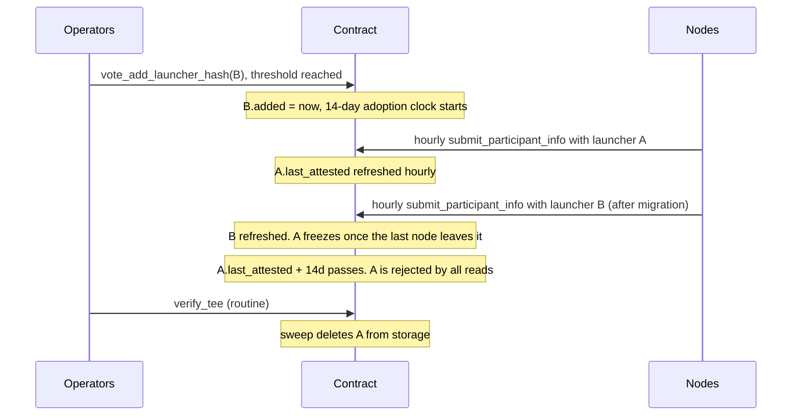

# Auto-Removal of Unused Launcher Image Hashes

**Status:** Draft — for team review
**Issue:** [#3381](https://github.com/near/mpc/issues/3381)
**Related:** [Securing MPC with TEE](securing-mpc-with-tee-design-doc.md), [TEE Lifecycle](tee-lifecycle.md)

## Problem

`allowed_launcher_image_hashes` accumulates entries forever; removal requires a
**unanimous** vote (`vote_remove_launcher_hash`). MPC Docker image hashes, by
contrast, auto-expire 7 days after a newer image lands. Testnet carries 3
launcher hashes with only the newest in use.

The insight: **not using a launcher is itself a vote.** Every node already
resubmits an attestation hourly (`submit_participant_info`), proving which
launcher it runs. The contract can observe disuse and evict stale hashes
without any vote.

## Proposal

```rust
pub struct AllowedLauncherImage {
    launcher_hash: LauncherImageHash,
    compose_hashes: Vec<LauncherDockerComposeHash>,
    added: Timestamp,          // NEW: when (last) voted in
    last_attested: Timestamp,  // NEW: last successful attestation using this launcher
}
```

An entry is **expired** when `max(added, last_attested) + TTL < now`.
TTL is a new config field `launcher_hash_unused_ttl_seconds`, default **14 days**.

Three parts:

1. **Refresh on use** — after a successful verify in `submit_participant_info`
   (hourly per node), the contract sets `last_attested = now` on the entry
   owning the validated compose hash. No node-side changes.
2. **Read-time filtering** — all reads of the allowed set (verify, re-verify,
   views) skip expired entries, so an expired hash is rejected the moment its
   TTL lapses. If *all* entries are expired, the newest is still returned
   (disaster-recovery fallback, mirrors `AllowedDockerImageHashes`).
3. **Lazy sweep** — `verify_tee` deletes expired entries from storage
   (keeping at least the newest). Housekeeping only; expiry is already
   enforced by (2).

Counting from `added` means a hash voted in but **never adopted** (e.g. a
newly voted launcher image no node ever migrated to) also expires after one
TTL window. Recovery: `vote_add_launcher_hash` for an already-present entry
resets its `added` timestamp (threshold vote, not unanimity).

### Safety invariants

- A hash backing a **valid attestation is never expired**: TTL (14d) >
  attestation validity (7d), so any valid attestation refreshed its entry
  within 7 days. Enforced as a config validation (`TTL > 7d`).
- The list is **never empty / never fully rejected** (sweep keeps newest,
  read fallback returns newest).

### Out of scope / unchanged

- `vote_remove_launcher_hash` (unanimous) stays — manual override for removing
  a compromised launcher before its TTL lapses.
- OS measurements keep explicit voting (multiple sets must coexist long-term).
- MPC Docker image hash expiry, node, and launcher code: unchanged.

## Lifecycle



### Operator scenarios

| Scenario | Behavior |
|---|---|
| **Normal rotation** | Vote in `B`, migrate nodes. 14 days after the last node leaves `A`, it is auto-evicted. No removal vote. |
| **Rollback** | `B` broken; revert to `A` within 14 days — still valid, refreshes resume. `B` ages out. |
| **Slow rollout** (vote → migration > 14d) | `B` expires unused; re-vote it (threshold) to reset the clock. Rule of thumb: vote within 14 days of migrating. |
| **Node offline > 14d on an old launcher** | Its hash may age out (its attestation already expired at day 7). Recover by upgrading or re-voting the hash. |
| **Network outage > 14d** | All entries expire; newest still honored via fallback, others re-votable. |
| **Compromised launcher** | Unanimous `vote_remove_launcher_hash`, as today. |

## Migration

New borsh fields ⇒ state migration: existing entries get
`added = last_attested = migration time` — every current hash starts a fresh
14-day clock; stale testnet hashes age out with no further action.

## Alternatives considered

- **Instant eviction when no participant references a hash** — no rollback
  window; a broken new launcher would need a re-vote under incident pressure.
- **Exempting never-used hashes** — a forgotten/mistaken vote would linger
  forever, the very problem being solved.
- **Detached-promise cleanup** (per issue AC) — only needed for unbounded
  collections; this one is operator-curated, a handful of entries.

## Open questions

1. **TTL = 14 days** implies *vote a launcher in at most 14 days before
   migrating to it*. Acceptable, or prefer 30 days?
2. **Inline sweep vs. detached promise** — the issue's acceptance criteria
   suggest running cleanup in a detached promise, so that a mass-expiry can
   never consume enough gas to fail the transaction it piggybacks on. This doc
   instead sweeps inline in `verify_tee`, betting that
   `allowed_launcher_images` stays tiny forever (entries only enter via rare
   operator votes; sweeping ~4 entries is negligible gas). Does anyone see a
   future where this list grows to many entries? If not, inline stands.
