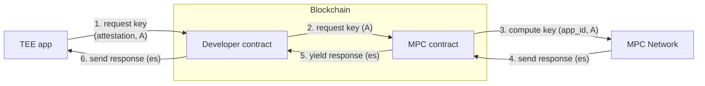

# Confidential Key Derivation - Feature Description and Algorithm Design

The purpose of this document is to explain the idea behind the confidential keys
feature, and outline the details of the algorithm we're implementing to support
this feature. The feature is a work in progress, and this document is to serve
as a reference when we develop the different parts of it.

## What is the confidential key derivation feature?

The confidential key derivation feature is an extension of the current MPC
system with a custom scheme that provides applications with
deterministic secrets. Deterministic means that the same
application may request the same secret at different points in time. Private
means that the secret itself is never revealed to any entity other than the
application itself, not even to individual MPC nodes.

## Background & Motivation

Confidential Key Derivation (CKD) is a primitive that allows any app running
inside a TEE (Intel TDX) to have a deterministically derived key that is unique
to the app and not specific to the TEE. The app can derive the same key multiple
times even if it runs on a different TEE. To obtain the key, the app can send a
request to the MPC contract on-chain, by submitting proof that it is running
inside a TEE. Currently, we are not aware of other systems supporting this
feature.

## Overview

We support deterministic secret extraction for applications running in Intel TDX
servers. Although we mainly support applications running on
[Dstack](https://github.com/Dstack-TEE/dstack), it should also be possible to
run apps on other platforms as long as the requirements for remote attestation
are fulfilled. An application can request a deterministic secret by calling
the request CKD method on the MPC smart contract. This method takes
a fresh public key $A$ and uses the account id of the caller (which we call
$`\texttt{app\_id}`$), and causes the MPC network to compute a secret as
described in the "Algorithm Steps" [below](#algorithm-steps).

Notice the MPC contract does not verify remote attestation, nor does it impose
how the authentication of the TEE app is enforced. The developer must control
the contract which calls the CKD functionality, and make the required
verifications within that contract. In this document, for completeness we
provide an example workflow for the developer. This workflow can be modified if
required.

## Naming conventions

- *app*: TEE app calling the CKD functionality
- $`\texttt{app\_id}`$: unique and authenticated identifier for the *app*. It
  coincides with the account id of the *Developer contract*. The MPC contract
  authenticates $`\texttt{app\_id}`$ when it receives the request from the
  *Developer contract*. Because of how the blockchain works, no other contract
  or account can make a request with the same $`\texttt{app\_id}`$
- $`\texttt{attestation}`$: the remote attestation report, which is a
  cryptographic proof that *app* is running inside a genuine TEE. It includes
  $\texttt{quote}$, $\texttt{MRTD}$, $\texttt{RTMR0}$, $\texttt{RTMR1}$,
  $\texttt{RTMR2}$, $\texttt{RTMR3}$, *event_log* and *report_data*
- $`\mathbb{G_1}, \mathbb{G_2}`$ are the groups of the pairing friendly elliptic
  curves [BLS12_381](https://electriccoin.co/blog/new-snark-curve/), with
  generators $`G_1, G_2`$ respectively
- $`(a,A[=a \cdot G_1])`$: fresh key pair in $`\mathbb{G_1}`$ generated by *app*
- *operator*: entity owning the TEE-enabled hardware executing *app*
- *developer*: the developer of the *app*
- *Developer contract*: a contract that guarantees the integrity of *app*,
  and verifies that is running inside a valid TEE. On receiving a request, it validates
  the *app* through remote attestation, and calls the CKD functionality in the
  MPC contract.
- $`\texttt{gen\_app\_private\_key}(A)`$: function inside MPC smart contract to
  generate a deterministic secret to be used by an application running inside a
  TEE
- *MPC network*: the set of MPC nodes currently running
- $n$: the number of nodes in the *MPC network*
- *MPC contract*: a contract used to interact with *MPC network*
- $`(x_1, x_2, \ldots, x_n)`$: private secret key shares of the MPC nodes, which
  are generated during the Distributed Key Generation (DKG)
- $`\texttt{msk}`$: master secret key of the *MPC network*, which does not
  change over time, and is generated during the DKG on $`\mathbb{G_2}`$.
   As a result, $`\texttt{msk}
  = x_1 \cdot λ_1 + \ldots + x_n \cdot λ_n`$, where $λ_i$ are the coefficients
  of the
  [Lagrange polynomial](https://en.wikipedia.org/wiki/Lagrange_polynomial). Let
  $`\texttt{pk} \in \mathbb{G_2}`$ the corresponding public key.
- $`s`$: the key obtained by *app* as a result of the CKD, will depend
  on the [BLS signature](https://en.wikipedia.org/wiki/BLS_digital_signature) over
  the hash of $`\texttt{app\_id}`$

## Requirements

- $`s`$ must be deterministic as a function of $`\texttt{app\_id}`$ and only
  known by *app*
- No single node in the *MPC network* should be capable of computing $`s`$. This
avoids key leakage in the case a single TEE is compromised
- $`\texttt{app\_id}`$ must be a unique deterministic value tied to *app* and
the attestation runtime measurements. It should not be forgeable by any other
app
- The DKG has been executed, and each node is in possession of a secret key
  share $x_i$

## Security Assumptions

- The *operator* is not trusted, but its TEE-enabled hardware is considered
  secure
- MPC nodes running in TEE: All are trusted and execute the protocol honestly.
  Liveness and correctness depend on this assumption, while the secrecy does
  not. Example values that should not be leaked even if a node is malicious of
  are $`s`$, $`\texttt{msk}`$ and private shares of other nodes
- The *developer* guarantee's the *app* security, and that the intended
attestation measurements ensure the chain of trust inside the TEE is not broken

## Algorithm Steps

### On the developer side

- The *app* generates EC ElGammal key pair $`(a, A)`$ and creates a transaction
  on-chain that calls $`\texttt{get\_key}(\texttt{attestation},A)`$ on the
  *Developer contract*
- $`\texttt{get\_key}`$ verifies *app* is correctly being executed inside a TEE:
  - verify that $`\texttt{attestation}`$ is valid. This process may follow the one described in [dstack
  doc](https://github.com/Dstack-TEE/dstack/blob/6b77340cf530b4532c5815039a74bb3a60302378/attestation.md)
  - verify the *event_log* contains the *app* docker image digest
    $`\texttt{app\_image\_hash}`$
  - (optional) verify the value of $`\texttt{MRTD}`$ is inside a set of safe
    values
  - (optional) verify the near account caller is inside a set of allowed values,
    which can be updated when more operators gain access to the TEE app
  - verify that $`A`$ is part of *report_data*
  - call $`\texttt{gen\_app\_private\_key}(A)`$

The exact steps executed in $`\texttt{get\_key}`$ are totally in control of the
developer. To help in adoption we will provide an example TEE app and its
contract.

### On the MPC side

- $`\texttt{gen\_app\_private\_key}`$ sets $`\texttt{app\_id}`$ equal to the
  account id of the caller and creates a transaction on-chain with a CKD
  request with parameters $`(\texttt{app\_id},A)`$
- When the *MPC Network* receives a new CKD request with parameters
  $`\texttt{app\_id}`$ and $`A`$, this request is sent to all nodes and the key
  generation process starts. Let $`H`$ be a suitable cryptographically secure
  hash to curve function from
  [rfc9380](https://datatracker.ietf.org/doc/rfc9380/), with target curve
  $`\mathbb{G_1}`$. The steps of the generation process follow:
  - Node $`i\in \{1, \ldots n\}`$ receives $`(\texttt{app\_id}, A)`$ and
    computes:
    - $`y_i  \gets^{\$} \mathbb{Z}_q`$
    - $`Y_i \gets y_i \cdot G_1`$
    - $`S_i = x_i \cdot H(\texttt{app\_id})`$
    - $`C_i =  S_i + y_i \cdot A`$
  - Node $`i`$ sends $`(λ_i \cdot Y_i, λ_i \cdot C_i)`$ to the *MPC network*
    coordinator
  - The coordinator adds the received pairs together:
    - $`Y \gets λ_1 \cdot Y_1 + \ldots + λ_n \cdot Y_n`$
    - $`C \gets λ_1 \cdot C_1 + \ldots + λ_n \cdot C_n = λ_1 \cdot S_1 + \ldots +
    λ_n \cdot S_n + ({y_1 \cdot λ_1 + \ldots + y_n \cdot λ_n }) \cdot A =
    \texttt{msk} \cdot H(\texttt{app\_id}) + a \cdot Y`$
    - $`\texttt{es} \gets (Y, C) `$
  - Coordinator sends $`\texttt{es}`$ to *app* on-chain
- *app* obtains $`\texttt{es} = (Y, C)`$ and computes the BLS signature
  $`\texttt{sig} \gets C + (- a) \cdot  Y`$ and checks its correctness with
  respect to the MPC network public key $`\texttt{pk}`$. If correct, the app can
  use the computed $`\texttt{sig} = \texttt{msk} \cdot H(\texttt{app\_id})`$ to
  compute the key $`s = \texttt{HKDF}(\texttt{sig})`$, using a
  [HKDF](https://en.wikipedia.org/wiki/HKDF) function.
