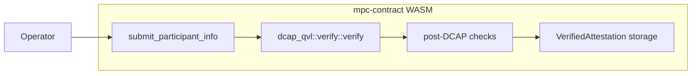
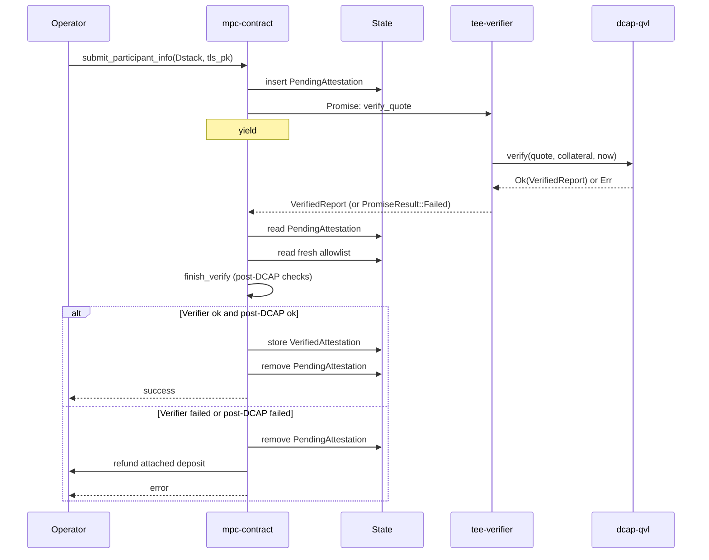
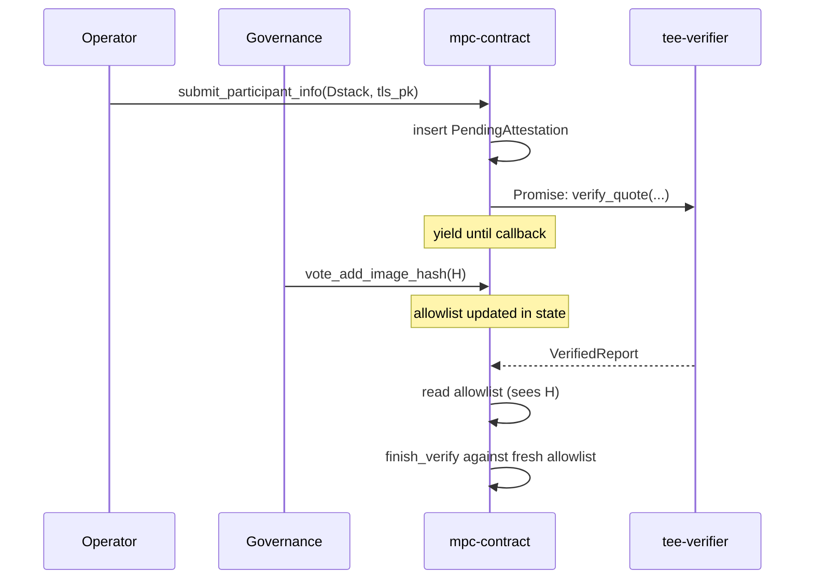
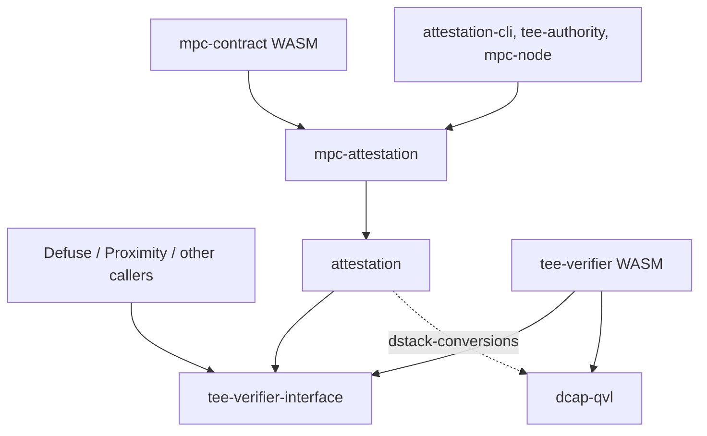

# Attestation Verifier Contract Breakout

This document outlines the design for moving on-chain TDX quote verification out of `mpc-contract`'s WASM into a standalone verifier contract.

It supersedes [#3160](https://github.com/near/mpc/pull/3160), which sketched a three-contract architecture (shared verifier + per-team policy contract + TEE-agnostic application contract) for Defuse, Proximity, and other teams. That direction was deferred: a shared policy contract presumes shared lifecycle conventions (the launcher pattern `mpc-contract` uses), and aligning the other teams on them is a separate, longer [conversation][slack-launcher-discussion].

This document narrows the scope to the one piece that benefits every team — extracting the stateless DCAP verification primitive — and leaves policy in `mpc-contract`.

## Background

### Current State

[`mpc-contract`](../../crates/contract) accepts TEE attestations from participant nodes through [`submit_participant_info`](../../crates/contract/src/lib.rs). The method runs cryptographic Intel TDX quote verification synchronously inside the contract by calling `dcap_qvl::verify::verify`, which links `dcap-qvl` and its `ring` / `webpki` / `x509-cert` transitive dependencies into the contract's WASM.

The current flow, in one diagram:



### Issues with the current design

1. **WASM size pressure.** `dcap-qvl` and its transitive dependencies account for ~310 KB of the compiled `mpc-contract` WASM — none of which is MPC logic, and none of which can be trimmed without rerouting the verification path. The current WASM sits close to NEP-509's 1,490,000-byte hard limit, leaving little headroom for the contract's own evolution: every state-migration change inflates the WASM at deploy time, and a single new dependency or `cargo` upgrade can push it over the limit.

   |                   | Bytes      | Delta from current `main` |
   |-------------------|------------|---------------------------|
   | `main` baseline   | 1,459,158  | —                         |
   | After this design | ~1,149,708 | **−309,450 (−21.2%)**     |

   Sizes after this design are measured on the PoC branch in [#3247](https://github.com/near/mpc/pull/3247), which strips `dcap-qvl` out of `mpc-contract`'s dependency graph.

2. **Non-reusable verification primitive.** Other NEAR teams (Proximity, Defuse, anyone building on Intel TDX) cannot call `dcap_qvl::verify` on-chain without re-linking the entire dependency tree into their own contract.

## Design goal

The primary goal is to bring the `mpc-contract` WASM safely under NEP-509's 1,490,000-byte limit by extracting `dcap_qvl::verify` into a standalone, stateless `tee-verifier` contract.

A natural side effect: once the verifier is its own contract, other NEAR teams building on Intel TDX can call it without re-linking `dcap-qvl` themselves.

Looking further out, the same contract can be extended to cover other TEE flavors (Intel SGX, AMD SEV-SNP) behind the same interface, and — if and when other teams adopt the launcher pattern — broadened to host shared post-verification policy. For now its scope is deliberately narrow: it wraps `dcap_qvl::verify` and nothing else.

## Architecture Overview

DCAP quote verification moves into a standalone contract called `tee-verifier`. The wire format — a DTO-only crate carrying Borsh-serializable mirrors of the relevant `dcap-qvl` types and nothing else — lives in a dedicated crate called `tee-verifier-interface`. `mpc-contract` no longer links `dcap-qvl`; the verifier links it instead.


### Submission flow

`mpc-contract`'s [`submit_participant_info`][submit-participant-info] becomes asynchronous for Dstack attestations. The method extracts the quote bytes and collateral from the submitted `Attestation::Dstack`, schedules a Promise to `tee-verifier::verify_quote`, and chains a private callback (`on_attestation_verified`) onto the Promise. The Promise yields control; the receipt executes in a later block; the callback runs after the verifier returns. The post-DCAP checks (RTMR3 replay, app-compose validation, measurement allowlist matching, report-data binding) all run in the callback against the `VerifiedReport` the verifier returns, and against state held by `mpc-contract`.

The post-DCAP policy inputs are the same fields `mpc-contract` already holds today — the allowed-image-hash list, the per-account TLS / account public-key binding, and the stored-attestation map. No new policy state is introduced; the only state addition is the `pending_attestations` map described below, which is bookkeeping for the in-flight Promise, not policy.

`Mock` attestations stay on the synchronous path; only `Dstack` attestations take the Promise path.



#### Caller-side impact

The only caller of `submit_participant_info` in production is `mpc-node`, which submits attestations from a background task (`periodic_attestation_submission`) on a 1-hour cadence and on attestation-removal events. That task already:

- Polls contract state to determine outcome (`tx_sender::wait_for_executed_status` reads the stored attestation back, with a 10-second post-tx delay) rather than treating the initial-transaction status as the final answer.
- Retries with exponential backoff (100 ms → 60 s, capped at 12 h total) until the on-chain state reflects a stored attestation.

The Promise + callback split is transparent to that loop: the initial `submit_participant_info` transaction now lands as `SuccessReceiptId` (the scheduled Promise) rather than `SuccessValue`, but the node's success criterion has always been "is the attestation actually stored on-chain?", which is unaffected. The 10-second post-tx delay before reading state may need to grow slightly to cover one extra block (verifier execution + callback), but the retry loop tolerates that without code change.

What does change is the latency from `submit_participant_info` call to "attestation visible in state": today it's one block; with the Promise + callback it's typically three (submit, verifier, callback). On-chain `wait` semantics in NEAR mean the node's RPC layer already blocks on the full receipt chain when configured to do so, so there is no new error path. Operator-facing tooling (CLI invocations of `submit_participant_info`) sees the same change in shape and should likewise wait for the receipt chain rather than the immediate transaction status.

#### Failure-mode invariants

1. **Verifier panic** (bad quote, expired collateral, malformed input). `PromiseResult::Failed` reaches the callback. The pending entry is cleared, the deposit is refunded, an error is returned. Contract state is otherwise unchanged.
2. **Post-DCAP check failure** (allowlist miss, RTMR3 mismatch, app-compose mismatch, binding mismatch). Pending entry cleared, deposit refunded, specific reason logged. No permanent state change.
3. **Out-of-gas in the callback.** The callback receipt runs out of gas before completing, so the entry is *not* cleared and the deposit is *not* refunded — the `PendingAttestation` becomes orphaned. This is undesirable but bounded: the same `AccountId` cannot submit again until the orphan is cleared (the guard at the top of `submit_participant_info` rejects with `"verification already pending"`), so a stuck account stays stuck on its own deposit until manually unblocked.

   The mitigation is to make this case unreachable in practice: `with_static_gas` on the callback is sized so that the worst-case post-DCAP check path — full allowlist scan, RTMR3 replay over a maximum-sized event log, app-compose validation — fits comfortably with a margin. The callback contains no unbounded loops or I/O. The gas budget will be exercised by a dedicated stress test (large allowlist + large event log) as part of integration testing. A separate `release_pending_attestation` admin method, callable only by governance (`vote_update`), is the escape hatch for the residual case in which an unforeseen condition wedges an entry; it removes the entry and refunds the deposit, but doesn't otherwise touch state.

### Contract state changes

Verification now spans two blocks: the block that executes `submit_participant_info` schedules the `Promise` to the verifier, and the block in which the callback runs reads the verifier's result and finishes the post-DCAP checks. Between those two blocks, `mpc-contract` holds no synchronous call stack — the call has returned to the runtime — so every piece of context the callback needs has to be persisted to contract state.

That context lives in a new field:

```rust
pending_attestations: IterableMap<AccountId, PendingAttestation>
```

The map is keyed by the submitting account, so each entry represents one attestation submission awaiting its callback. An entry holds:

- **The submitter's `Attestation::Dstack` payload.** The verifier only checks the cryptographic quote; the surrounding Dstack fields (RTMR3 event log, app-compose document, report-data) are exactly what the post-DCAP checks consume, and they have to survive the `Promise` boundary to be available in the callback.
- **The submitter's TLS public key.** The report-data binding check in the callback compares the value embedded in the quote against `(tls_pk, account_pk)`. That `tls_pk` was an argument to `submit_participant_info` and is not recoverable elsewhere.
- **The attached deposit.** `submit_participant_info` is payable today: callers attach a deposit to cover storage staking for the `VerifiedAttestation` that gets written on success. In the async flow there are three outcomes for that deposit:
  - On success, it stays as storage staking against the new `VerifiedAttestation` entry.
  - On verifier failure (`PromiseResult::Failed`) or post-DCAP failure, no attestation gets stored, so the deposit must be refunded to the caller — and the callback is the only place that knows whether to refund. The original `env::attached_deposit()` is not visible from inside the callback (the callback is a separate receipt), so it has to be persisted in the `PendingAttestation` entry to be refundable from there.

  The same `AccountId` keying that allows safe retries (see below) also forces a single in-flight submission per account, which means the deposit-tracking story is simple: there is at most one outstanding deposit per account at any time.

Entries are removed in the callback regardless of outcome. The one case in which an entry can outlive its callback is an out-of-gas callback panic, addressed in the failure-mode section below.

### Verifier Account IDs

`mpc-contract` calls the attestation verifier by a hard-coded account ID, selected at compile time:

- `tee-verifier.near` on mainnet
- `tee-verifier.testnet` on testnet

Selection follows the same `cfg(feature = ...)` pattern `mpc-contract` already uses for other compile-time network constants. There is no runtime config knob.

The verifier address is a security-critical input: it dictates which contract's reply `mpc-contract` is willing to accept as a "verified" DCAP quote. A misconfigured or attacker-controlled address would let a malicious or stub verifier rubber-stamp any attestation, and the post-DCAP checks alone cannot recover from that — they assume the `VerifiedReport` they're handed actually came from `dcap_qvl::verify`. Compiling the address into the WASM keeps this decision under the same governance gate as every other line of `mpc-contract` code: changing the verifier requires a `vote_update` of the contract itself, not a config push.

For tests, a `cfg(feature = "...")`-gated stub address is appropriate — `mpc-contract` already exposes test-only methods behind `sandbox-test-methods` and `dev-utils` features ([crates/contract/src/lib.rs](https://github.com/near/mpc/blob/efe49230bb66854c55bba080e7610e42f9221506/crates/contract/src/lib.rs)). The verifier address selector will follow the same convention: a `sandbox` variant points the constant at a sandbox-deployed stub verifier so integration tests can exercise the full Promise + callback path without requiring real Intel collateral. The sandbox feature is never enabled on `mainnet` or `testnet` builds.

### Allowlist freshness across the Promise boundary

A governance vote that adds or removes an allowed measurement can land between `submit_participant_info` scheduling the verifier `Promise` and the callback running. The callback re-reads the allowlist from contract state at callback time rather than snapshotting it at request time, so any vote that finalizes mid-flight applies to the verification it overlaps.



The alternative — snapshotting the allowlist into the `PendingAttestation` entry at request time — would freeze each submission against the policy that existed when it started, which is the wrong default for a security control: a removal of a compromised image hash should take effect immediately, including on submissions that are mid-Promise.

## Crate layout

The split follows two principles. First, the verifier should be **reusable by teams that don't care about MPC** — that means the crate that carries wire DTOs across the Promise boundary must not depend on either `dcap-qvl` (otherwise callers pay the WASM cost they're trying to avoid) or on any MPC-specific framing. Second, the line between **DCAP verification** and **post-DCAP policy** has to land at the same boundary as the Promise: cryptographic checks on the quote run in the verifier; everything else — RTMR3 replay, app-compose validation, measurement allowlist matching, `(tls_pk, account_pk)` binding — stays in `mpc-contract`'s callback. Keeping that line stable is what makes the verifier reusable across products that have different policies on top of the same TDX primitives.

The result is two new crates plus an existing one that picks up one new dependency:

- **`tee-verifier-interface`** (new). Wire DTOs only — `QuoteBytes`, `Collateral`, `VerifiedReport`, and the nested report / TCB-status types — as Borsh-serializable mirrors of the corresponding `dcap-qvl` types. No `dcap-qvl` dependency, no MPC-specific types. This is what every caller of the verifier links against.
- **`tee-verifier`** (new). The verifier contract WASM. Wraps `dcap_qvl::verify::verify` and exposes one method. The only place in this design that links `dcap-qvl` for on-chain use.
- **`attestation`** (existing). TDX domain types and the post-DCAP verification logic. Picks up `tee-verifier-interface` as a new dependency to re-export `Collateral` and `QuoteBytes` instead of duplicating them. Keeps its existing `dstack-conversions` feature flag, which gates an off-chain `dcap-qvl` link path used by `tee-authority`, `attestation-cli`, and `mpc-node` to verify quotes locally before submitting them on-chain. When that feature is off (the default, and what `mpc-contract`'s WASM build uses), the crate has no `dcap-qvl` dependency.
- **`mpc-attestation`** (existing, unchanged). MPC-specific framing on top of `attestation`: the `Attestation { Dstack, Mock }` enum, the `(tls_pk, account_pk)` binding, mock attestation verification. A team that wants TDX domain logic without MPC framing depends on `tee-verifier-interface` + `attestation` and skips this crate.

### Crate dependency graph

Arrows are Cargo `[dependencies]` edges. The dashed edge from `attestation` to `dcap-qvl` is gated on the `dstack-conversions` feature — off-chain tooling turns it on, the `mpc-contract` WASM build leaves it off.



The cross-contract calls (`mpc-contract` → `tee-verifier`, and any external caller → `tee-verifier`) are not Cargo edges and don't appear here; they're shown in the architecture diagram at the top of this section. The point of this graph is to make clear that the only Cargo path into `dcap-qvl` from on-chain code goes through `tee-verifier`.

## Governance and upgrades

Two questions to settle: **who controls the verifier code**, and **what deployment shape does the contract take**.

### Who upgrades the verifier

The verifier inherits `mpc-contract`'s governance model: `propose_update` / `vote_update`, with the active MPC participants (the operators currently running attested nodes) as the voter set. No NEAR Foundation account, no separate DAO. This is the lightest-touch option and matches how `mpc-contract` itself is upgraded today.

That choice has a known limitation: external teams that call the verifier (Defuse, Proximity, anyone else) have no vote in those upgrades. They are coupled to the MPC participant set's release cadence. The trade-off is acceptable while MPC is the only mainnet caller; revisiting governance is a natural part of any conversation in which a second team commits to depending on the verifier in production.

A verifier upgrade is observable to callers: a `dcap-qvl` bump may start accepting new Intel collateral or rejecting expired collateral. Callers should monitor verifier upgrades and rerun integration tests against a sandbox-deployed verifier with the matching code hash before treating an upgrade as a no-op.

### Why not a NEAR global contract

NEP-591 ([global contracts](https://github.com/near/NEPs/blob/master/neps/nep-0591.md), final in protocol v77) is worth considering for a stateless shared-library contract like this one — and after working through the mechanics, the answer is **not now**. The reasoning is worth recording, since the option will keep coming up:

- **Global contracts are not addressed by hash at the call site.** A global contract is deployed once and replicated across shards by its code hash, but it is not callable directly by that hash. Each account that wants to expose the code has to submit a `UseGlobalContractAction` linking its account to the global code; callers then invoke that account with a normal `Promise::new(account_id).function_call(...)`. The hash gives you cross-shard code dedup and immutability — not a new addressing primitive. `mpc-contract` would still have to hardcode an `AccountId`.
- **Hash-addressed globals are immutable; AccountId-addressed globals work like regular owners.** NEP-591 supports both `GlobalContractIdentifier::CodeHash` (immutable per hash; upgrade = deploy a new global and migrate every linked account) and `GlobalContractIdentifier::AccountId` (owner can redeploy; all linked accounts pick up the new code automatically). Neither buys us anything that a regular contract with `propose_update` / `vote_update` doesn't already give us.
- **Stateless is the verifier's property, not the deployment's.** Global contracts don't have "shared" state — each linked account has its own state slot. So statelessness doesn't unlock anything global-specific; we already have it via the code we write.
- **Cost is a small win, not a load-bearing one.** Global deploy is 10× the regular per-byte storage cost but is burned (not staked), and per-call gas is unchanged. The verifier is ~310 KB; deploying it as a global contract trades a one-time higher deploy fee for cross-shard dedup. That's nice if many independent contracts attach to it, but for one mainnet caller it doesn't pay back.
- **No mainnet precedent yet.** Global contracts went live in May 2025 and the use cases cited in NEP-591 are smart-contract wallets, not shared verification libraries. Being the first stateless-library global contract on mainnet is operational risk we don't need to take to ship binary-size relief.

The verifier ships as a regular NEAR contract deployed at the hardcoded `tee-verifier.{near,testnet}` address described above. If a future world has multiple unrelated teams calling the verifier from different shards and we want to dedup the code on-chain, redeploying it as a global contract (hash-addressed for immutability, or owner-addressed for upgradability) is a forward migration — not a decision we have to make now.

### Configuration surface

The verifier has no admin methods, no setters, and no on-chain configuration. Everything that determines behavior — the bundled `dcap-qvl` version, the TCB acceptance rules — is part of the deployed code. Policy changes happen by deploying new code, which `propose_update` / `vote_update` makes the only entry point.

## API Proposal

### The Verifier Contract

The verifier exposes exactly one method:

```rust
#[near]
impl TeeVerifier {
    /// Verify a TDX quote against Intel collateral.
    ///
    /// Calls `dcap_qvl::verify::verify` with the current block timestamp
    /// and returns the parsed `VerifiedReport` on success.
    ///
    /// On verification failure, panics with the upstream error rendered as
    /// a string. Callers observe this as `PromiseResult::Failed` in the
    /// callback.
    #[result_serializer(borsh)]
    pub fn verify_quote(
        &self,
        #[serializer(borsh)] quote: QuoteBytes,
        #[serializer(borsh)] collateral: Collateral,
    ) -> VerifiedReport;
}
```

The contract is stateless. The wire DTOs (`QuoteBytes`, `Collateral`, `VerifiedReport`, and the nested report types) are field-for-field Borsh mirrors of the corresponding `dcap_qvl` types, defined in `tee-verifier-interface`.

The `#[serializer(borsh)]` / `#[result_serializer(borsh)]` annotations are deliberate: `near-sdk`'s default serializer is JSON, which would force every byte buffer in `Collateral` (a TCB info blob plus its signature, a QE identity blob plus its signature, and a PCK certificate chain) through base64 wrapping at both ends. Borsh keeps the payload as raw bytes, halves the over-the-wire size on the dominant fields, and matches what `dcap-qvl`'s own types are serialized as anyway. The verifier has no human-driven callers (no CLI invocations, no view methods from a wallet UI), so the usual JSON-for-ergonomics argument doesn't apply.

### `mpc-contract::submit_participant_info`

The method splits into two halves with a Promise between them — see [§Submission flow](#submission-flow) above for the architecture, sequence diagram, caller-side impact, and failure-mode invariants. The full implementation:

```rust
impl MpcContract {
    pub fn submit_participant_info(
        &mut self,
        attestation: Attestation,
        tls_pk: PublicKey,
    ) -> PromiseOrValue<()> {
        match attestation {
            // Unchanged from today.
            Attestation::Mock(mock) => {
                self.verify_mock_synchronously(mock, tls_pk);
                PromiseOrValue::Value(())
            }
            // New: Promise + callback.
            Attestation::Dstack(dstack) => {
                let (quote, collateral) = extract_dcap_inputs(&dstack);
                let account_id = env::predecessor_account_id();
                self.pending_attestations.insert(
                    account_id.clone(),
                    PendingAttestation { dstack, tls_pk, attached_deposit: env::attached_deposit() },
                );
                let promise = Promise::new(TEE_VERIFIER_ACCOUNT_ID.parse().unwrap())
                    .function_call(
                        "verify_quote".into(),
                        borsh::to_vec(&(quote, collateral)).unwrap(),
                        NearToken::from_yoctonear(0),
                        Gas::from_tgas(VERIFIER_GAS_TGAS),
                    )
                    .then(
                        Self::ext(env::current_account_id())
                            .with_static_gas(Gas::from_tgas(CALLBACK_GAS_TGAS))
                            .on_attestation_verified(account_id),
                    );
                PromiseOrValue::Promise(promise)
            }
        }
    }

    #[private]
    pub fn on_attestation_verified(
        &mut self,
        account_id: AccountId,
        #[callback_result] result: Result<VerifiedReport, PromiseError>,
    ) {
        let Some(pending) = self.pending_attestations.remove(&account_id) else {
            env::panic_str("no pending attestation for this account");
        };

        let verified_report = match result {
            Ok(report) => report,
            Err(_) => {
                refund_deposit(&account_id, pending.attached_deposit);
                env::panic_str("dcap verification failed");
            }
        };

        // Post-DCAP checks operate on the verified report plus state held here.
        // The allowlist is read fresh — governance votes mid-flight take effect.
        if let Err(reason) = finish_verify(&pending, &verified_report, self.allowlist_fresh()) {
            refund_deposit(&account_id, pending.attached_deposit);
            env::panic_str(&format!("post-DCAP check failed: {reason}"));
        }

        self.tee_accounts.insert(account_id, VerifiedAttestation::from((pending, verified_report)));
    }
}
```

The contract gains one new state field:

```rust
pub struct MpcContract {
    // ... existing fields ...
    pending_attestations: IterableMap<AccountId, PendingAttestation>,
}

pub struct PendingAttestation {
    pub dstack: DstackAttestation,
    pub tls_pk: PublicKey,
    pub attached_deposit: NearToken,
}
```

State is keyed by `AccountId`. A second `submit_participant_info` from the same account before the first completes is rejected with `"verification already pending"` — no overwrite, no second Promise scheduled.

## Testing

The new test surface is the Promise + callback split — the verifier panic / post-DCAP-fail / success branches in `on_attestation_verified` that the synchronous version never had to exercise. The strategy that covers it cleanly is a **stub `tee-verifier`** crate: same `tee-verifier-interface` DTOs, but `verify_quote` returns a `VerifiedReport` constructed from test fixtures (or panics on demand). Sandbox tests deploy that stub instead of the real verifier by building `mpc-contract` with the `sandbox` feature flag described in the verifier-address section, which points the compile-time constant at the stub's account.

Two test patterns become reachable that weren't before:

- **The Promise + callback path runs on every test.** Today, tests that submit `Attestation::Dstack` need real `dcap-qvl` running on real Intel collateral; tests that don't want that overhead use `Attestation::Mock` to bypass the verification path entirely. With a stub verifier, the Promise path is always live — the stub just decides what report comes back.
- **Post-DCAP checks can be exercised directly.** The four post-DCAP checks (RTMR3 replay, app-compose validation, allowlist matching, binding) now run in the callback against the verifier's `VerifiedReport`. The stub can return reports that pass DCAP but fail any one of these, exercising each branch without crafting full Dstack quotes.

In-process unit tests are still the right place for callback edge cases (out-of-gas, missing pending entry, refund routing): construct a `VerifiedReport` from `tee-verifier-interface`'s public types, invoke `on_attestation_verified` directly, assert state. Faster than sandbox tests and doesn't require a near-sandbox process.

The existing E2E setup (the `near-sandbox`-backed tests in `crates/e2e-tests`) gets one new deployment step: alongside `mpc-contract`, the test harness deploys either the real `tee-verifier` (for tests that want to exercise real `dcap-qvl` against a fixture quote) or the stub verifier (for everything else). No new test framework — same crate, one extra `deploy` call in the setup helper.

Once the stub exists, `Attestation::Mock`'s role in tests is largely superseded: the stub covers skipping `dcap-qvl`, running on non-TDX machines, and exercising post-DCAP policy in isolation. The first iteration of this design keeps `Attestation::Mock`; a later iteration can remove it once the stub is the established path.

[submit-participant-info]: https://github.com/near/mpc/blob/efe49230bb66854c55bba080e7610e42f9221506/crates/contract/src/lib.rs#L754-L782
[slack-launcher-discussion]: https://nearone.slack.com/archives/C0B12RKBSAV/p1777897902903889
