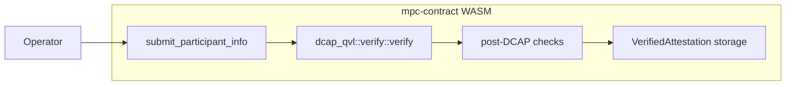
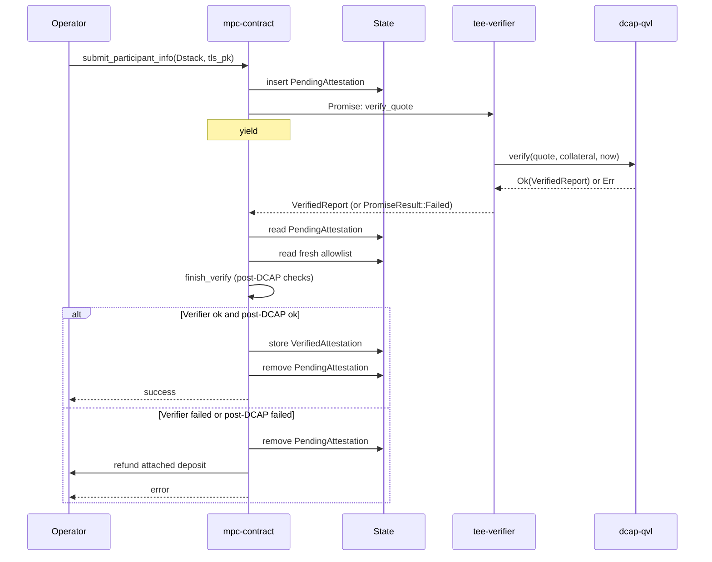
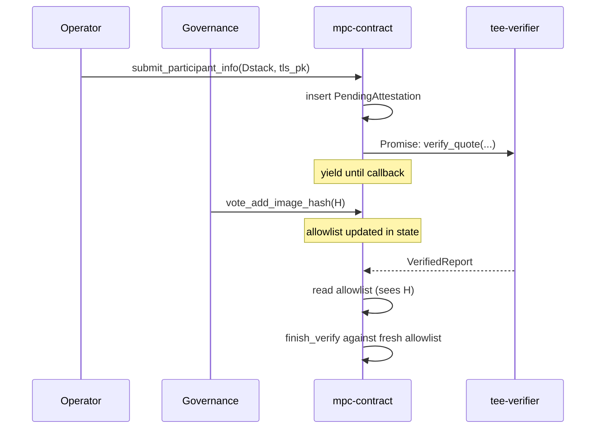
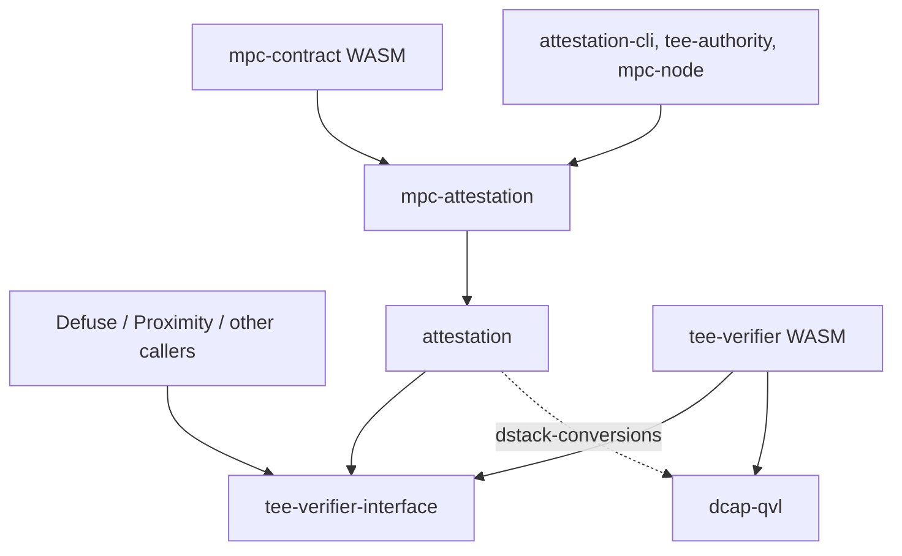

# Attestation Verifier Contract Breakout

This document outlines the design for moving on-chain TDX quote verification out of `mpc-contract`'s WASM into a standalone verifier contract.

It supersedes [#3160](https://github.com/near/mpc/pull/3160), which sketched a three-contract architecture (shared verifier + per-team policy contract + TEE-agnostic application contract) for Defuse, Proximity, and other teams. That direction was deferred: a shared policy contract presumes shared lifecycle conventions (the [launcher pattern][launcher-pattern] `mpc-contract` uses), and aligning the other teams on them is a separate, longer [conversation][slack-launcher-discussion].

This document narrows the scope to the one piece that benefits every team — extracting the stateless DCAP verification primitive — and leaves policy in `mpc-contract`.

## Background

### Current State

[`mpc-contract`](../../crates/contract) accepts TEE attestations from participant nodes through [`submit_participant_info`](../../crates/contract/src/lib.rs). The method runs cryptographic Intel TDX quote verification synchronously inside the contract by calling `dcap_qvl::verify::verify`, which links `dcap-qvl` and its `ring` / `webpki` / `x509-cert` transitive dependencies into the contract's WASM.

The current flow, in one diagram:



### Issues with the current design

1. **MPC contract size pressure.** `dcap-qvl` and its transitive dependencies account for ~310 KB of the compiled `mpc-contract` WASM — none of which is MPC logic, and none of which can be trimmed without rerouting the verification path. The current WASM sits close to NEP-509's 1,490,000-byte hard limit, leaving little headroom for the contract's own evolution.

   |                   | Bytes      | Delta from current `main` |
   |-------------------|------------|---------------------------|
   | `main` baseline   | 1,459,158  | —                         |
   | After this design | ~1,149,708 | **−309,450 (−21.2%)**     |

   Sizes after this design are measured on the PoC branch in [#3247](https://github.com/near/mpc/pull/3247), which strips `dcap-qvl` out of `mpc-contract`'s dependency graph.

2. **Non-reusable verification primitive.** Other NEAR teams (Proximity, Defuse, anyone building on Intel TDX) cannot call `dcap_qvl::verify` on-chain without re-linking the entire dependency tree into their own contract.

## Design goal

The primary goal is to bring the `mpc-contract` WASM safely under NEP-509's 1,490,000-byte limit by extracting `dcap_qvl::verify` into a standalone, stateless `tee-verifier` contract.

A natural side effect: once the verifier is its own contract, other NEAR teams building on Intel TDX can call it without re-linking `dcap-qvl` themselves.

Looking further out, the same contract can be extended to cover other TEE flavors (Intel SGX, AMD SEV-SNP) behind the same interface, and — if and when other teams adopt the launcher pattern — broadened to host shared post-verification policy. For now its scope is deliberately narrow: it wraps `dcap_qvl::verify` and nothing else.

## Architecture Overview

DCAP quote verification moves into a standalone contract called `tee-verifier`. The wire format — a DTO-only crate carrying Borsh-serializable mirrors of the relevant `dcap-qvl` types and nothing else — lives in a dedicated crate called `tee-verifier-interface`. `mpc-contract` no longer links `dcap-qvl`; the verifier links it instead.


### Submission flow

`mpc-contract`'s [`submit_participant_info`][submit-participant-info] becomes asynchronous for Dstack attestations. The method extracts the quote bytes and collateral from the submitted `Attestation::Dstack`, schedules a Promise to `tee-verifier::verify_quote`, and chains a private callback (`on_attestation_verified`) onto the Promise. The Promise yields control; the receipt executes in a later block; the callback runs after the verifier returns. The post-DCAP checks (RTMR3 replay, app-compose validation, measurement allowlist matching, report-data binding) all run in the callback against the `VerifiedReport` the verifier returns, and against state held by `mpc-contract`.

The post-DCAP policy inputs are the same fields `mpc-contract` already holds today — the allowed-image-hash list, the per-account TLS / account public-key binding, and the stored-attestation map. No new policy state is introduced; the only state addition is the `pending_attestations` map described below, which is bookkeeping for the in-flight Promise.



#### Caller-side impact

The only caller of `submit_participant_info` in production is `mpc-node`'s `periodic_attestation_submission` task, which resubmits on a 1-hour cadence and on attestation-removal events. It already polls contract state to confirm the attestation is actually stored, with exponential backoff (100 ms → 60 s, capped at 12 h). That polling-based success criterion is what makes the sync→async change transparent.

The one observable difference is latency — one block today, ~3 blocks with the Promise + callback (submit, verifier, callback). The 10-second post-submission delay before the node reads state has enough margin to absorb that without tuning.

#### Handling failures

1. **Verifier panic** (bad quote, expired collateral, malformed input). `PromiseResult::Failed` reaches the callback. The pending entry is cleared, the deposit is refunded, an error is returned. Contract state is otherwise unchanged.
2. **Post-DCAP check failure** (allowlist miss, RTMR3 mismatch, app-compose mismatch, binding mismatch). Pending entry cleared, deposit refunded, specific reason logged. No permanent state change.
3. **Out-of-gas in the callback.** The callback receipt runs out of gas before completing, so the entry is *not* cleared and the deposit is *not* refunded — the `PendingAttestation` becomes orphaned. This is undesirable but bounded: the same `AccountId` cannot submit again until the orphan is cleared.

### Contract state changes

The callback runs in a later block than `submit_participant_info`, as an independent contract invocation. Anything the callback still needs must be stashed in contract storage, in a new field:

```rust
pending_attestations: IterableMap<AccountId, PendingAttestation>
```

Each `PendingAttestation` holds:

- **The submitter's `Attestation::Dstack` payload** — the RTMR3 event log, app-compose, and report-data the post-DCAP checks consume.
- **The submitter's TLS public key** — needed for the `(tls_pk, account_pk)` binding check; passed as an argument and not recoverable elsewhere.
- **The attached deposit** — covers storage staking on success, must be refunded on failure. `env::attached_deposit()` is not visible from the callback receipt.

Entries are removed by the callback regardless of outcome; the only way one outlives its callback is the out-of-gas case in [§Handling failures](#handling-failures).

Notably absent from `PendingAttestation`: the **allowed-image-hash list**. The callback re-reads it from contract state, so any governance vote that adds or removes an entry mid-Promise applies to verifications it overlaps. Snapshotting at request time would freeze each submission against stale policy — wrong default for a security control, where removing a compromised hash should take effect immediately.



## Crate layout

Two new crates, plus an existing one that picks up a new dependency:

- **`tee-verifier-interface`** (new). Wire DTOs only — `QuoteBytes`, `Collateral`, `VerifiedReport`, and the nested report / TCB-status types — as Borsh-serializable mirrors of the corresponding `dcap-qvl` types. No `dcap-qvl` dependency, no MPC-specific types. This is what every caller of the verifier links against.
- **`tee-verifier`** (new). The verifier contract WASM. Wraps `dcap_qvl::verify::verify` and exposes one method. The only place in this design that links `dcap-qvl` for on-chain use.
- **`attestation`** (existing). TDX domain types and the post-DCAP verification logic. Picks up `tee-verifier-interface` as a new dependency to re-export `Collateral` and `QuoteBytes` instead of duplicating them. Keeps its existing `dstack-conversions` feature flag, which gates an off-chain `dcap-qvl` link path used by `tee-authority`, `attestation-cli`, and `mpc-node` to verify quotes locally before submitting them on-chain. When the feature is off (the default, and what `mpc-contract`'s WASM build uses), the crate has no `dcap-qvl` dependency.
- **`mpc-attestation`** (existing, unchanged). MPC-specific framing on top of `attestation`: the `Attestation { Dstack, Mock }` enum, the `(tls_pk, account_pk)` binding, mock attestation verification. A team that wants TDX domain logic without MPC framing depends on `tee-verifier-interface` + `attestation` and skips this crate.

The resulting Cargo dependency graph — solid edges are unconditional, the dashed edge is gated on `dstack-conversions`:



Cross-contract calls (`mpc-contract` → `tee-verifier`, and any external caller → `tee-verifier`) are not Cargo edges and don't appear here — they're shown in the architecture diagram at the top of this document. The only Cargo path into `dcap-qvl` from on-chain code goes through `tee-verifier`.

## Governance and upgrades

The verifier has no admin methods, no setters, no on-chain configuration. Everything that determines its behavior — the bundled `dcap-qvl` version, the TCB acceptance rules — is part of the deployed bytes, and therefore part of the code hash. The only governance surface lives on `mpc-contract`, choosing which instance to trust.

### How verifier instances exist on-chain

This design uses NEP-591 **global contracts**. The short version: instead of deploying contract bytes to one specific account, the bytes are published to the protocol once, identified by their hash (`CodeHash(H)`). Any number of regular accounts can then point at that code by running `UseGlobalContractAction(CodeHash(H))`. The binding `account_id → CodeHash(H)` is published on-chain in protocol state; calls still target the regular `AccountId` (globals are *not* callable by hash — the hash identifies code, not a callable address).

A deployed verifier comes together in three steps:

1. Someone publishes the verifier bytes as a global. Anyone can; two parties uploading identical bytes share the same `CodeHash` registration. The publication is immutable per hash.
2. Someone creates a NEAR account, attaches that global via `UseGlobalContractAction`, then removes every full-access key — "locks" the account. The account is now permanently bound to that `CodeHash`.
3. `mpc-contract` calls the verifier through that locked account's ID, read from `self.tee_verifier_account_id` at call time.

`tee_verifier_account_id` is security-critical: a compromised value lets a malicious verifier rubber-stamp anything. The locked-account binding makes each instance immutable; the operator vote chooses which immutable instance is trusted.

#### Operator audit, before voting yes

A candidate verifier passes four checks:

1. Reproducibly build the verifier source ([NEP-330](https://github.com/near/NEPs/blob/master/neps/nep-0330.md) / `cargo-near`) → `H_source`.
2. RPC `view_account(candidate_account_id)` → the `contract` field is `CodeHash(H_deployed)`, published directly by the protocol.
3. RPC `view_access_key_list(candidate_account_id)` → empty (locked).
4. `H_source == H_deployed`.

The win over a plain locked contract is step 2: with a plain contract the operator would have to `view_code` and hash the bytes themselves, hoping they used the same conventions the protocol does (Wasm-section stripping, `wasm-opt` post-processing, hash function — all real sources of audit mistakes). NEP-591 publishes the hash the protocol uses internally, so operator and protocol agree by construction.

Account names are free-form: whoever deploys an instance picks the `AccountId`, and the vote proposal carries the (`AccountId`, expected `CodeHash`) pair — the hash is the credential, the name is a label. Sandbox / E2E tests use the same scheme: deploy a stub, lock it, vote it in.

### Who chooses the trusted verifier

The same voter set that governs `mpc-contract` — the active MPC participants — through a new dedicated method pair, `propose_tee_verifier_change` / `vote_tee_verifier_change` (signatures in [§Voting on the trusted verifier](#voting-on-the-trusted-verifier)).

External teams calling the verifier from their own contracts (Defuse, Proximity, anyone else) run their own equivalent vote on their own contract. They can point at the same instance MPC trusts, a different one, or an older hash. Each team's decision is independent — there is no shared governance surface to fight over.

### Why a NEP-591 global contract

Five concrete grounds for picking NEP-591 globals over a plain locked contract:

- **Caller-side immutability is protocol-enforced.** The `account_id → CodeHash(H)` binding is recorded in protocol state and, given a locked account, cannot change. "The verifier at this account" has fixed behavior for all time.
- **Auditable upgrade history.** Every `vote_tee_verifier_change` is on-chain, with the (`AccountId`, expected `CodeHash`) pair in the proposal text. Operators get a permanent record of which hashes MPC has trusted.
- **Atomic rollback.** Reverting an upgrade is a single vote pointing back at a previously trusted `AccountId`. The old instance is still locked and callable.
- **Cross-shard code dedup.** If Defuse, Proximity, or others adopt the same global, the protocol caches the WASM once globally instead of paging it per shard. Marginal today, real if multi-team adoption happens.
- **Multi-version coexistence.** Multiple locked instances at different `AccountId`s can coexist indefinitely. MPC can A/B-test a new verifier by voting it in, observing, and voting back if needed.

The trade-off is one extra step on upgrades: deploying a new global and locking it onto a fresh account before the vote can even open. Those two actions are performable by anyone, not just operators — for a security-critical primitive that friction is a feature, not a tax.

## API Proposal

### The Verifier Contract

The verifier exposes exactly one method:

```rust
#[near]
impl TeeVerifier {
    /// Verify a TDX quote against Intel collateral.
    ///
    /// Calls `dcap_qvl::verify::verify` with the current block timestamp
    /// and returns the parsed `VerifiedReport` on success.
    ///
    /// On verification failure, panics with the upstream error rendered as
    /// a string. Callers observe this as `PromiseResult::Failed` in the
    /// callback.
    #[result_serializer(borsh)]
    pub fn verify_quote(
        &self,
        #[serializer(borsh)] quote: QuoteBytes,
        #[serializer(borsh)] collateral: Collateral,
    ) -> VerifiedReport;
}
```

The contract is stateless. The wire DTOs (`QuoteBytes`, `Collateral`, `VerifiedReport`, and the nested report types) are field-for-field Borsh mirrors of the corresponding `dcap_qvl` types, defined in `tee-verifier-interface`.

The `#[serializer(borsh)]` / `#[result_serializer(borsh)]` annotations are deliberate: `near-sdk`'s default serializer is JSON, which would force every byte buffer in `Collateral` (a TCB info blob plus its signature, a QE identity blob plus its signature, and a PCK certificate chain) through base64 wrapping at both ends. Borsh keeps the payload as raw bytes, halves the over-the-wire size on the dominant fields, and matches what `dcap-qvl`'s own types are serialized as anyway. The verifier has no human-driven callers (no CLI invocations, no view methods from a wallet UI), so the usual JSON-for-ergonomics argument doesn't apply.

### Voting on the trusted verifier

`mpc-contract` exposes a dedicated method pair for changing which immutable verifier instance it trusts. The pair mirrors the existing `propose_update` / `vote_update` shape, with the same `voter_account()` gate (active MPC participants) and threshold:

```rust
impl MpcContract {
    /// Propose a new trusted verifier `AccountId`. The candidate is expected
    /// to be a locked NEAR account attached (via `UseGlobalContractAction`)
    /// to a NEP-591 global contract whose `CodeHash` matches the source the
    /// proposer commits to in `description`.
    ///
    /// `expected_code_hash` is recorded in the proposal text only — it is
    /// not persisted to state. Wasm cannot read another account's code hash
    /// on-chain, so the hash check happens off-chain at vote time
    /// (see §Operator audit workflow).
    pub fn propose_tee_verifier_change(
        &mut self,
        candidate_account_id: AccountId,
        expected_code_hash: CryptoHash,
        description: String,
    ) -> ProposalId;

    /// Cast a vote for a pending `propose_tee_verifier_change`. When the
    /// threshold is reached, `tee_verifier_account_id` is updated to
    /// `candidate_account_id` and the proposal is cleared.
    pub fn vote_tee_verifier_change(
        &mut self,
        proposal_id: ProposalId,
    );
}
```

The contract gains one additional state field to support the vote:

```rust
pub struct MpcContract {
    // ... existing fields, including tee_verifier_account_id ...
    pending_tee_verifier_changes: IterableMap<ProposalId, PendingVerifierChange>,
}

pub struct PendingVerifierChange {
    pub candidate_account_id: AccountId,
    pub expected_code_hash: CryptoHash,
    pub description: String,
    pub votes: HashSet<AccountId>,
}
```

On a vote that crosses the threshold, the callback writes `self.tee_verifier_account_id = candidate_account_id` and removes the proposal. `expected_code_hash` is *not* persisted: it lives in the proposal text as a permanent audit-trail record of which hash operators agreed they were endorsing, but it can never be checked on-chain at call time, so persisting it would imply a guarantee `mpc-contract` cannot actually enforce.

Any subsequent `submit_participant_info` call uses the new `tee_verifier_account_id` automatically. There is no `cfg(feature = ...)` selector and no recompile.

### `mpc-contract::submit_participant_info`

The method splits into two halves with a Promise between them — see [§Submission flow](#submission-flow) above for the architecture, sequence diagram, caller-side impact, and failure handling. The full implementation:

```rust
impl MpcContract {
    pub fn submit_participant_info(
        &mut self,
        attestation: Attestation,
        tls_pk: PublicKey,
    ) -> PromiseOrValue<()> {
        match attestation {
            // Unchanged from today.
            Attestation::Mock(mock) => {
                self.verify_mock_synchronously(mock, tls_pk);
                PromiseOrValue::Value(())
            }
            // New: Promise + callback.
            Attestation::Dstack(dstack) => {
                let (quote, collateral) = extract_dcap_inputs(&dstack);
                let account_id = env::predecessor_account_id();
                self.pending_attestations.insert(
                    account_id.clone(),
                    PendingAttestation { dstack, tls_pk, attached_deposit: env::attached_deposit() },
                );
                let promise = Promise::new(self.tee_verifier_account_id.clone())
                    .function_call(
                        "verify_quote".into(),
                        borsh::to_vec(&(quote, collateral)).unwrap(),
                        NearToken::from_yoctonear(0),
                        Gas::from_tgas(VERIFIER_GAS_TGAS),
                    )
                    .then(
                        Self::ext(env::current_account_id())
                            .with_static_gas(Gas::from_tgas(CALLBACK_GAS_TGAS))
                            .on_attestation_verified(account_id),
                    );
                PromiseOrValue::Promise(promise)
            }
        }
    }

    #[private]
    pub fn on_attestation_verified(
        &mut self,
        account_id: AccountId,
        #[callback_result] result: Result<VerifiedReport, PromiseError>,
    ) {
        let Some(pending) = self.pending_attestations.remove(&account_id) else {
            env::panic_str("no pending attestation for this account");
        };

        let verified_report = match result {
            Ok(report) => report,
            Err(_) => {
                refund_deposit(&account_id, pending.attached_deposit);
                env::panic_str("dcap verification failed");
            }
        };

        // Post-DCAP checks operate on the verified report plus state held here.
        // The allowlist is read fresh — governance votes mid-flight take effect.
        if let Err(reason) = finish_verify(&pending, &verified_report, self.allowlist_fresh()) {
            refund_deposit(&account_id, pending.attached_deposit);
            env::panic_str(&format!("post-DCAP check failed: {reason}"));
        }

        self.tee_accounts.insert(account_id, VerifiedAttestation::from((pending, verified_report)));
    }
}
```

The contract gains the following state fields:

```rust
pub struct MpcContract {
    // ... existing fields ...
    pending_attestations: IterableMap<AccountId, PendingAttestation>,
    tee_verifier_account_id: AccountId,
    // pending_tee_verifier_changes is described in §Voting on the trusted verifier
}

pub struct PendingAttestation {
    pub dstack: DstackAttestation,
    pub tls_pk: PublicKey,
    pub attached_deposit: NearToken,
}
```

`pending_attestations` is keyed by `AccountId`. A second `submit_participant_info` from the same account before the first completes is rejected with `"verification already pending"` — no overwrite, no second Promise scheduled.

`tee_verifier_account_id` is the locked, NEP-591-attached account `mpc-contract` currently trusts as the verifier ([§How verifier instances exist on-chain](#how-verifier-instances-exist-on-chain)). It is read at every `submit_participant_info` call site to construct the Promise target, and mutated only by the operator-voted method pair described in [§Voting on the trusted verifier](#voting-on-the-trusted-verifier).

## Testing

The new test surface is the Promise + callback split — the verifier panic / post-DCAP-fail / success branches in `on_attestation_verified` that the synchronous version never had to exercise. The strategy that covers it cleanly is a **stub `tee-verifier`** crate: same `tee-verifier-interface` DTOs, but `verify_quote` returns a `VerifiedReport` constructed from test fixtures (or panics on demand). Sandbox tests deploy that stub like any other verifier candidate — lock the account it lives at, then call `propose_tee_verifier_change` + `vote_tee_verifier_change` from the test setup to point `mpc-contract` at the stub. Same code path as production; no compile-time switches.

Two test patterns become reachable that weren't before:

- **The Promise + callback path runs on every test.** Today, tests that submit `Attestation::Dstack` need real `dcap-qvl` running on real Intel collateral; tests that don't want that overhead use `Attestation::Mock` to bypass the verification path entirely. With a stub verifier, the Promise path is always live — the stub just decides what report comes back.
- **Post-DCAP checks can be exercised directly.** The four post-DCAP checks (RTMR3 replay, app-compose validation, allowlist matching, binding) now run in the callback against the verifier's `VerifiedReport`. The stub can return reports that pass DCAP but fail any one of these, exercising each branch without crafting full Dstack quotes.

In-process unit tests are still the right place for callback edge cases (out-of-gas, missing pending entry, refund routing): construct a `VerifiedReport` from `tee-verifier-interface`'s public types, invoke `on_attestation_verified` directly, assert state. Faster than sandbox tests and doesn't require a near-sandbox process.

The existing E2E setup (the `near-sandbox`-backed tests in `crates/e2e-tests`) gets one new deployment step: alongside `mpc-contract`, the test harness deploys either the real `tee-verifier` (for tests that want to exercise real `dcap-qvl` against a fixture quote) or the stub verifier (for everything else). No new test framework — same crate, one extra `deploy` call in the setup helper.

Once the stub exists, `Attestation::Mock`'s role in tests is largely superseded: the stub covers skipping `dcap-qvl`, running on non-TDX machines, and exercising post-DCAP policy in isolation. The first iteration of this design keeps `Attestation::Mock`; a later iteration can remove it once the stub is the established path.

[submit-participant-info]: https://github.com/near/mpc/blob/efe49230bb66854c55bba080e7610e42f9221506/crates/contract/src/lib.rs#L754-L782
[launcher-pattern]: https://github.com/near/mpc/blob/efe49230bb66854c55bba080e7610e42f9221506/docs/tee-lifecycle.md#upgrade
[slack-launcher-discussion]: https://nearone.slack.com/archives/C0B12RKBSAV/p1777897902903889
