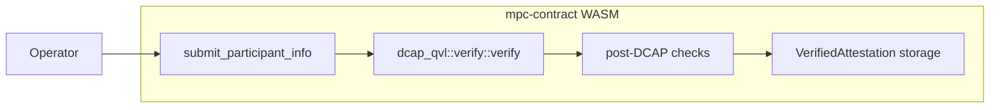
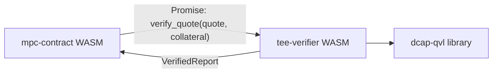
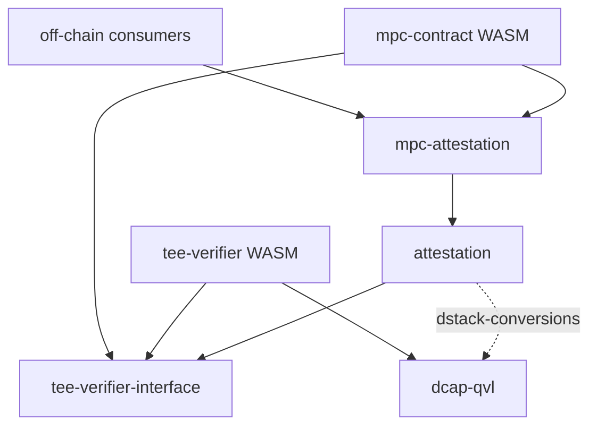
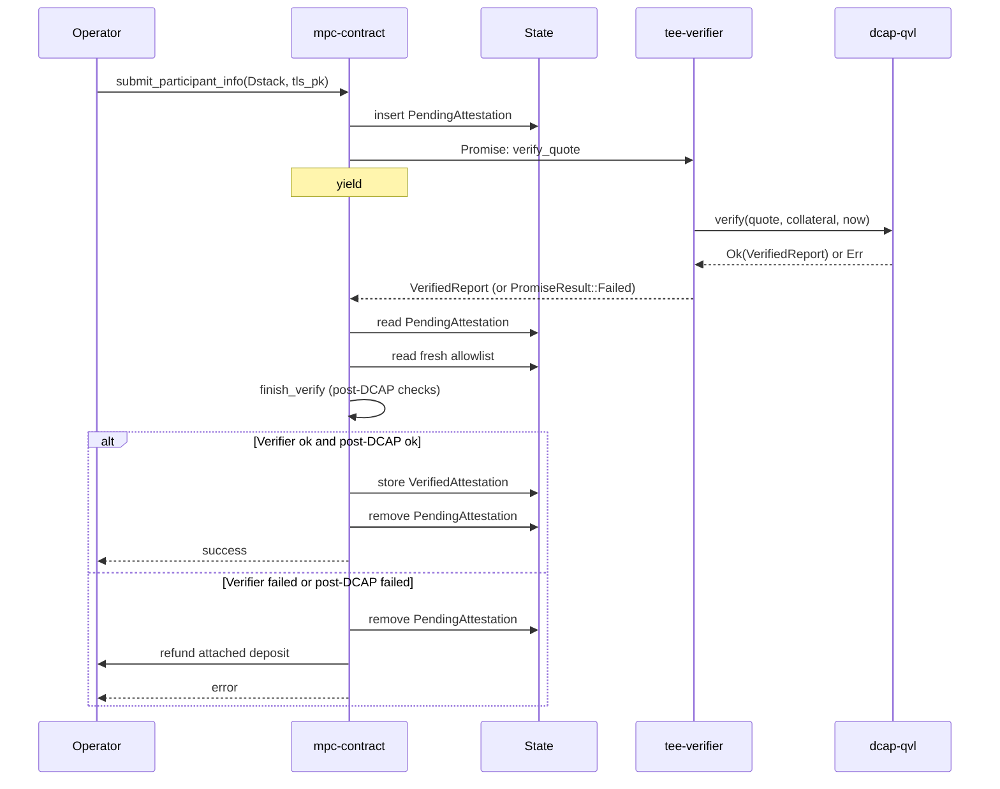

# Attestation Verifier Contract Breakout

This document outlines the design for moving on-chain TDX quote verification out of `mpc-contract`'s WASM into a standalone verifier contract.

## Background

### Current State

[`mpc-contract`](../../crates/contract) accepts TEE attestations from participant nodes through [`submit_participant_info`](../../crates/contract/src/lib.rs). The method runs cryptographic Intel TDX quote verification synchronously inside the contract by calling `dcap_qvl::verify::verify`, which links `dcap-qvl` and its `ring` / `webpki` / `x509-cert` closure into the contract's WASM.

The current flow, in one diagram:



The `dcap-qvl` dependency closure dominates `mpc-contract`'s WASM binary size:

| | Bytes | Delta from current `main` |
|---|---|---|
| `main` baseline | 1,459,158 | — |
| After this design | ~1,149,708 | **−309,450 (−21.2%)** |

The current size is close to NEP-509's 1,490,000-byte hard limit. Future state-migration changes (which inflate the WASM at deploy time) have little headroom.

The attestation crates that participate in this today:

- [`attestation`](../../crates/attestation) — TDX domain types, post-DCAP verification logic, and the off-chain `dcap_qvl::verify::verify` call site behind a `dstack-conversions` feature.
- [`mpc-attestation`](../../crates/mpc-attestation) — MPC-specific wrapping: the `Attestation { Dstack, Mock }` enum, the `(tls_pk, account_pk)` binding, Mock attestation verification.

### Issues with the Current Design

1. **WASM size pressure.** The `dcap-qvl` closure consumes ~310 KB of binary space inside `mpc-contract`. This space is unrelated to MPC product logic but cannot be removed without restructuring the verification path.

2. **Non-reusable verification primitive.** Other NEAR teams (Proximity, Defuse, anyone building on Intel TDX) cannot call `dcap_qvl::verify` on-chain without re-linking the entire closure into their own contract. Each team would pay the same ~310 KB cost.

## Design Goal

Shrink the `mpc-contract` WASM below the NEP-509 1,490,000-byte hard limit by moving `dcap_qvl::verify` out of its dependency graph. We do this by breaking the verification logic out into a stateless `tee-verifier` contract, which can be extended in the future to cover other TEE flavors (e.g. Intel SGX, AMD SEV-SNP) behind the same interface.

## Architecture Overview

We split DCAP quote verification into a standalone contract called **`tee-verifier`** reachable over a NEAR Promise. The wire format lives in a dedicated crate called **`tee-verifier-interface`**. `mpc-contract` no longer links `dcap-qvl`; the verifier links it instead.



After this design, `dcap-qvl` is a dependency of `tee-verifier` only.

### Promise + Callback Flow

`mpc-contract`'s `submit_participant_info` becomes asynchronous for Dstack attestations. The method extracts the quote bytes and collateral from the submitted `Attestation::Dstack`, schedules a Promise to `tee-verifier::verify_quote`, and chains a private callback (`on_attestation_verified`) onto the Promise. The Promise yields control; the receipt executes in a later block; the callback runs after the verifier returns. The post-DCAP checks (RTMR3 replay, app-compose validation, measurement allowlist matching, report-data binding) all run in the callback against the `VerifiedReport` the verifier returns, and against state held by `mpc-contract`.

### New `pending_attestations` State Field

Because verification spans two receipts, `mpc-contract` needs to remember which attestation is in flight while the Promise is outstanding. It does so in a new state field `pending_attestations: IterableMap<AccountId, PendingAttestation>`. The entry carries the Dstack-specific bits the callback needs (the parts of the report that didn't get verified by `dcap-qvl`), the submitter's TLS public key, and the attached deposit for refund routing on failure. State is keyed by `AccountId`; a second `submit_participant_info` from the same account before the first completes is rejected outright, so the pending entry is never overwritten and no second Promise is scheduled.

### Mock vs Dstack Branching

`Attestation::Mock` (used in unit tests, integration tests, and dev networks) stays synchronous and entirely inside `mpc-contract`. The new Promise path applies only to `Attestation::Dstack`. The branch happens at the top of `submit_participant_info`: Mock returns immediately after in-contract validation; Dstack returns a `PromiseOrValue::Promise(...)` that completes asynchronously. Mock attestations therefore impose no new Promise overhead in tests.

### Mainnet / Testnet Verifier Account IDs

`mpc-contract` calls the verifier by a hard-coded account ID, selected at compile time:

- `tee-verifier.near` on mainnet
- `tee-verifier.testnet` on testnet

Selection follows the same `cfg(feature = "mainnet")` pattern `mpc-contract` already uses for other compile-time network constants. There is no runtime config knob — operators do not pass the verifier address to nodes, and node behavior is unchanged from today.

### Allowlist Read Fresh in Callback

A governance vote that adds or removes an allowed measurement may land between the Promise being scheduled and the callback executing. The callback re-reads the allowlist from contract state at callback time rather than snapshotting it at request time. This means a mid-flight governance vote applies to any verification still in flight. The verifier's `VerifiedReport` alone is therefore not sufficient to authorize a participant — the callback's post-DCAP checks against the fresh allowlist are the actual gating step.

## Crate Layout

The work touches four library crates and adds one contract crate. Two of the four are new; the existing two carry forward from `origin/main` with their roles intact and their dependency graphs simplified.

### Per-Crate Roles (and Deltas from `origin/main`)

- **`tee-verifier-interface`** (new). Defines the Borsh wire DTOs that cross the Promise boundary: `QuoteBytes`, `Collateral`, `VerifiedReport`, and the nested report / TCB-status types. No `dcap-qvl` dependency. No MPC-specific types. Workspace-internal deps are only `borsh` and `thiserror`, so a non-MPC team integrating the verifier from their own NEAR contract picks up this one crate and nothing else. The shape of these DTOs may evolve as we learn from production traffic; the invariant we hold steady is that they stay `dcap-qvl`-free Borsh types.

- **`tee-verifier`** (new). The verifier contract WASM. Stateless wrapper around `dcap_qvl::verify::verify`. Depends on `tee-verifier-interface` and on `dcap-qvl` (the only crate other than off-chain consumers that links it). Built reproducibly via `cargo near build`, same convention as `mpc-contract`.

- **`attestation`** (carries forward from `origin/main`, same role). TDX/TCB domain types (`DstackAttestation`, `Measurements`, `TcbInfo`, etc.) and the post-DCAP verification logic (`verify_post_dcap::*`). The off-chain `dcap_qvl::verify` call site stays here behind the pre-existing `dstack-conversions` feature flag (no new flags introduced). The crate also gains a dependency on `tee-verifier-interface` so it can re-export `Collateral` and `QuoteBytes` instead of duplicating them.

- **`mpc-attestation`** (carries forward from `origin/main`, unchanged role). MPC-specific framing on top of `attestation`: the `Attestation { Dstack, Mock }` enum, the `(tls_pk, account_pk)` report-data binding, Mock attestation verification. Depends on `attestation`. Linked into `mpc-contract`'s WASM.

The boundary that matters for reusability is the line between `attestation` and `mpc-attestation`. `attestation` knows what a TDX attestation is and how to verify its post-DCAP invariants; that knowledge has nothing to do with MPC. `mpc-attestation` knows what MPC does with one, including the Mock variant we use in tests. A non-MPC team that wants TDX domain logic but not MPC-specific framing can depend on `tee-verifier-interface` + `attestation` and skip `mpc-attestation`.

### Crate Dependency Graph

The diagram below shows how each consumer reaches the attestation crates and `dcap-qvl`. Arrows are Cargo `[dependencies]` edges. Two arrows reach `dcap-qvl`: from `tee-verifier`, and from `attestation` only when its `dstack-conversions` feature is enabled (dashed).



The split achieves three things at once:

- `mpc-contract`'s WASM dependency graph contains no path to `dcap-qvl` (the size-reduction goal). The `dstack-conversions` feature is *off* in the WASM build, so the dashed edge from `attestation` to `dcap-qvl` is inactive for the contract.
- `tee-verifier`'s WASM dependency graph is the only contract path that reaches `dcap-qvl`.
- Off-chain consumers (`tee-authority`, `attestation-cli`, `mpc-node`) enable `dstack-conversions` on `attestation` for local verification — the dashed edge activates only in those builds.

## Design Properties

Before getting into the API surface, two design statements are worth stating explicitly because they determine the shape of everything that follows.

### Post-DCAP Policy Stays in `mpc-contract`

Cryptographic verification of the quote is the verifier contract's job. Everything else — RTMR3 replay, app-compose validation, measurement allowlist matching, `(tls_pk, account_pk)` binding — stays in `mpc-contract`'s callback. All four checks operate on the `VerifiedReport` returned by the verifier plus state held in `mpc-contract`. None of them need `dcap-qvl`.

This is the line that lets the verifier remain product-neutral: it knows nothing about MPC, knows nothing about measurements, and would not need to change if a different team integrated it for a non-MPC purpose.

### Governance

`tee-verifier` is owned by the same governance set as `mpc-contract` (NEAR Foundation accounts). Upgrades follow the same DAO-vote pattern used today.

A verifier upgrade is significant for callers because it changes the set of TDX collateral that verifies — a `dcap-qvl` bump may accept new Intel collateral or reject expired collateral. Callers should monitor verifier upgrades and rerun integration tests against a sandbox-deployed verifier with the matching code hash before treating the upgrade as a no-op.

The verifier has no admin / setter / config methods. There is no on-chain parameter to tune. Policy changes happen by deploying new code.

## API Proposal

In this section we propose the on-chain interface for `tee-verifier`, the wire DTOs, and the changes to `mpc-contract`'s `submit_participant_info`.

### The Verifier Contract

The verifier exposes exactly one method:

```rust
#[near]
impl TeeVerifier {
    /// Verify a TDX / SGX quote against Intel collateral.
    ///
    /// Calls `dcap_qvl::verify::verify` with the current block timestamp
    /// and returns the parsed `VerifiedReport` on success.
    ///
    /// On verification failure, panics with the upstream error rendered as
    /// a string. Callers observe this as `PromiseResult::Failed` in the
    /// callback.
    ///
    /// Borsh I/O on both arguments and return value.
    #[result_serializer(borsh)]
    pub fn verify_quote(
        &self,
        #[serializer(borsh)] quote: QuoteBytes,
        #[serializer(borsh)] collateral: Collateral,
    ) -> VerifiedReport;
}
```

The contract is stateless and has no admin or config methods. The wire DTOs (`QuoteBytes`, `Collateral`, `VerifiedReport`, and the nested report types) are field-for-field Borsh mirrors of the corresponding `dcap_qvl` types, defined in `tee-verifier-interface`. See the crate source for the field-by-field layout.

### Changes to `mpc-contract::submit_participant_info`

The method splits into two halves with a Promise between them. `Mock` attestations stay on the synchronous path; `Dstack` attestations take the Promise path. The diagram below shows the full Dstack flow; the code block that follows implements it.



Failure-mode invariants implied by the diagram:

1. **Verifier panic.** `PromiseResult::Failed` reaches the callback. The pending entry is cleared, the deposit is refunded, an error is returned. Contract state is otherwise unchanged.
2. **Post-DCAP check failure** (allowlist miss, RTMR3 mismatch, app-compose mismatch, binding mismatch). Pending entry cleared, deposit refunded, specific reason logged. No permanent state change.
3. **Out-of-gas in the callback.** The callback panics; the pending entry stays. Caller can retry by submitting again — `AccountId`-keyed state means the resubmit overwrites the stale entry on next success.
4. **Concurrent allowlist vote.** The callback re-reads the allowlist from state, so a governance vote landing between the Promise and the callback takes effect on the verification in flight. No request-time snapshot.

The implementation, in full:

```rust
impl MpcContract {
    pub fn submit_participant_info(
        &mut self,
        attestation: Attestation,
        tls_pk: PublicKey,
    ) -> PromiseOrValue<()> {
        match attestation {
            // Unchanged from today.
            Attestation::Mock(mock) => {
                self.verify_mock_synchronously(mock, tls_pk);
                PromiseOrValue::Value(())
            }
            // New: Promise + callback.
            Attestation::Dstack(dstack) => {
                let (quote, collateral) = extract_dcap_inputs(&dstack);
                let account_id = env::predecessor_account_id();
                self.pending_attestations.insert(
                    account_id.clone(),
                    PendingAttestation { dstack, tls_pk, attached_deposit: env::attached_deposit() },
                );
                let promise = Promise::new(TEE_VERIFIER_ACCOUNT_ID.parse().unwrap())
                    .function_call(
                        "verify_quote".into(),
                        borsh::to_vec(&(quote, collateral)).unwrap(),
                        NearToken::from_yoctonear(0),
                        Gas::from_tgas(VERIFIER_GAS_TGAS),
                    )
                    .then(
                        Self::ext(env::current_account_id())
                            .with_static_gas(Gas::from_tgas(CALLBACK_GAS_TGAS))
                            .on_attestation_verified(account_id),
                    );
                PromiseOrValue::Promise(promise)
            }
        }
    }

    #[private]
    pub fn on_attestation_verified(
        &mut self,
        account_id: AccountId,
        #[callback_result] result: Result<VerifiedReport, PromiseError>,
    ) {
        let Some(pending) = self.pending_attestations.remove(&account_id) else {
            env::panic_str("no pending attestation for this account");
        };

        let verified_report = match result {
            Ok(report) => report,
            Err(_) => {
                refund_deposit(&account_id, pending.attached_deposit);
                env::panic_str("dcap verification failed");
            }
        };

        // Post-DCAP checks operate on the verified report plus state held here.
        // The allowlist is read fresh — governance votes mid-flight take effect.
        if let Err(reason) = finish_verify(&pending, &verified_report, self.allowlist_fresh()) {
            refund_deposit(&account_id, pending.attached_deposit);
            env::panic_str(&format!("post-DCAP check failed: {reason}"));
        }

        self.tee_accounts.insert(account_id, VerifiedAttestation::from((pending, verified_report)));
    }
}
```

The contract gains one new state field:

```rust
pub struct MpcContract {
    // ... existing fields ...
    pending_attestations: IterableMap<AccountId, PendingAttestation>,
}

pub struct PendingAttestation {
    pub dstack: DstackAttestation,
    pub tls_pk: PublicKey,
    pub attached_deposit: NearToken,
}
```

State is keyed by `AccountId`. A second `submit_participant_info` from the same account before the first completes is rejected with `"verification already pending"` — no overwrite, no second Promise scheduled.

## Deployment

### Two Contracts on Chain

| Account | Owner | Code source |
|---|---|---|
| `v1.signer.near` / `v1.signer-prod.testnet` | NEAR Foundation DAO | [crates/contract](../../crates/contract) |
| `tee-verifier.near` / `tee-verifier.testnet` | Same DAO | `crates/tee-verifier` |

The verifier account IDs are compile-time constants on `mpc-contract`, selected via `cfg(feature = "mainnet")` — matching the pattern used today for the signer account ID. Operators do not configure the verifier address; the contract calls a known account by name.

Once the governance-approved verifier code is deployed, the verifier account is locked — all full-access keys are removed. This is what binds the verifier's behavior to the deployed code hash: without locking, a privileged actor could swap in arbitrary code after the audit. The lock step is part of the deployment runbook (see [Deployment Ordering](#deployment-ordering)).

### Deployment Ordering

The verifier must exist before `mpc-contract` is upgraded to the version that calls it. The deployment runbook becomes:

1. Reproducibly build both contracts with `cargo near build`. Verify hashes match the artifact the governance vote approved.
2. Deploy `tee-verifier` to its target account. Fund the account for storage (verifier holds no state, so storage cost is just the code; covered once per deploy and once per upgrade).
3. Smoke-test the deployed verifier by calling `verify_quote` directly with a known-valid fixture quote. This test does not touch `mpc-contract`.
4. Lock the verifier account by removing all full-access keys. After this step, the deployed code cannot be replaced; an upgrade requires a new governance vote that re-keys, redeploys, and re-locks.
5. Upgrade `mpc-contract` to the new version that uses Promises.

If the verifier deploy steps and the `mpc-contract` upgrade are reversed, every `Dstack` attestation submitted to `mpc-contract` fails with `AccountDoesNotExist` until the verifier lands. The runbook makes the ordering explicit.

### Reproducible Builds

Both contracts use the existing `[package.metadata.near.reproducible_build]` pattern in their `Cargo.toml`. CI validates the deployed `tee-verifier` hash matches `cargo near build`'s output the same way it validates `mpc-contract` today.

### Upgrades

Verifier upgrades and `mpc-contract` upgrades are independent. Expected long-run cadence:

- `tee-verifier` upgrades when `dcap-qvl` upgrades (rare). The address stays the same; the DTOs in `tee-verifier-interface` are version-pinned, so the wire format does not change.
- `mpc-contract` upgrades when MPC product features change (often). No verifier work needed unless the verifier's behavior also needs to change in lockstep.

Decoupling the upgrade cadences is half the motivation for the design.

### Operator Impact

None. Operators do not deploy contracts, do not configure the verifier address, and do not change their config. Node behavior is unchanged: nodes call `submit_participant_info` with the same `Attestation { Dstack, Mock }` shape. The Promise+callback split is internal to the contract.

## Testing

The contract's test surface grows because there is now a second contract to deploy. We address this at three levels.

### Unit Tests (in-crate)

- `mpc-contract`'s Mock attestation tests are unchanged. Mock stays synchronous.
- The new Dstack path is unit-tested by feeding `on_attestation_verified` a synthetic `VerifiedReport` constructed via `tee-verifier-interface`'s public types. Promise dispatch itself is not exercised here — it requires the integration layer.
- `tee-verifier`'s unit/integration tests live under `crates/tee-verifier/tests/` and call `verify_quote` directly against fixture quotes from `test-utils`. These are independent of `mpc-contract`.

### Integration Tests (`near-workspaces`)

Integration tests deploy both contracts to a sandbox NEAR node:

1. Build both WASMs via `cargo near build`.
2. Deploy `tee-verifier` to a sandbox account.
3. Deploy `mpc-contract` to a separate sandbox account.
4. Override `mpc-contract`'s compile-time verifier-address constant so it points at the sandbox-deployed verifier. (Implementation choice — either a `cfg(feature = "test-deploy")` build that reads from env, or a test-only static-mut. To be settled during implementation.)

The first integration test asserts the happy path: a Dstack attestation arrives at `mpc-contract`, the Promise to `tee-verifier` succeeds, the callback completes, and the participant ends up in the attested set. Subsequent tests cover the failure-mode invariants from the previous section.

### E2E Tests (`crates/e2e-tests`)

E2E tests today start a `near-sandbox` process and deploy `mpc-contract`. After this design, the sandbox setup also deploys `tee-verifier`. The `MpcCluster` builder gains a `deploy_verifier()` step that runs once per sandbox; the verifier's account ID is configured via the same compile-time-constant override used in integration tests.

The existing [`test_submit_participant_info`](../../crates/e2e-tests/tests/submit_participant_info.rs) uses Mock attestation and is unchanged. A new E2E test covers the Dstack path explicitly: nodes are configured to send real Dstack quotes (fixture data from `test-utils`), and the test asserts the full Promise+callback round-trip completes and the contract's attested set is populated. This is the canonical pre-deploy validation.
