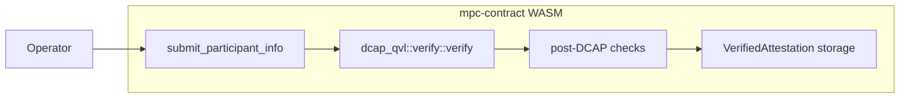
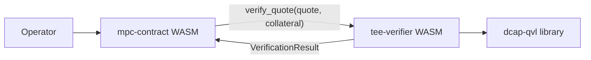
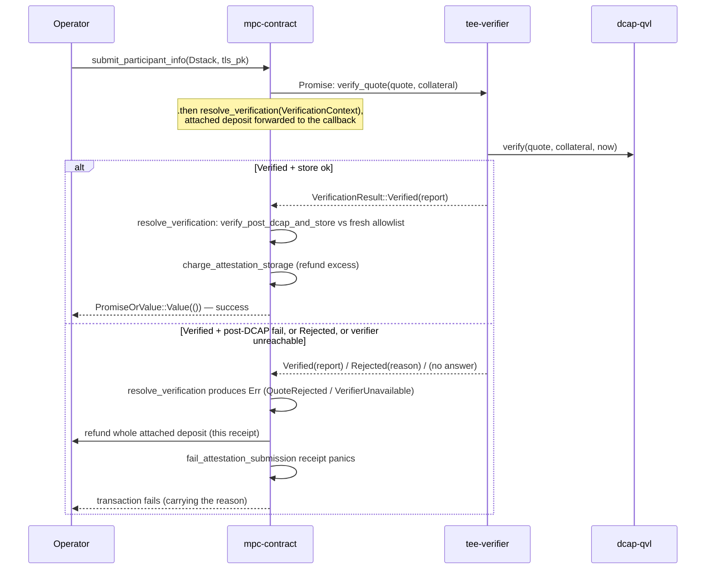
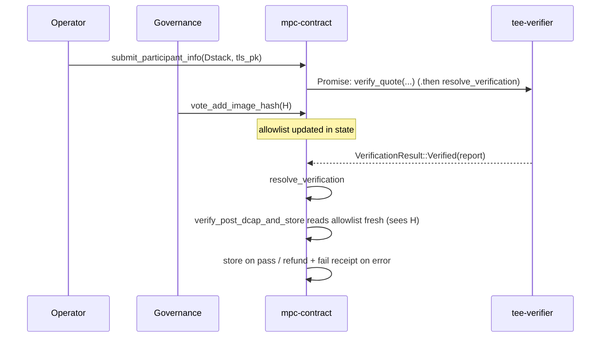
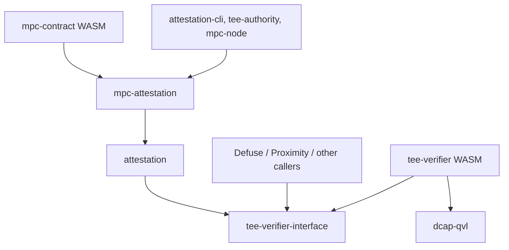
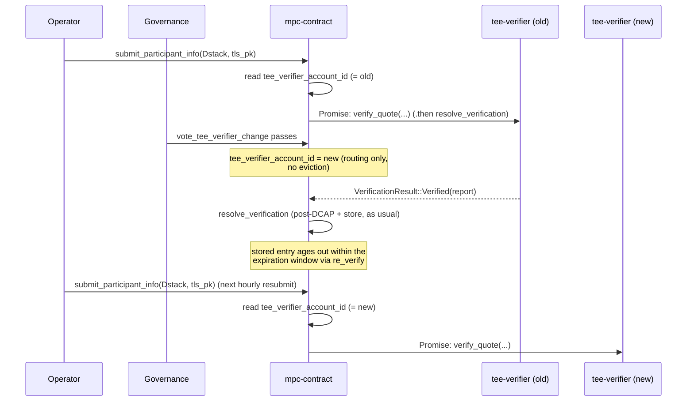

# Attestation Verifier Contract Breakout

This document outlines the design for moving on-chain TDX quote verification out of `mpc-contract`'s WASM into a standalone verifier contract.

It supersedes [#3160](https://github.com/near/mpc/pull/3160), which sketched a three-contract architecture (shared verifier + per-team policy contract + TEE-agnostic application contract) for Defuse, Proximity, and other teams. That direction was deferred: a shared policy contract presumes shared lifecycle conventions (the [launcher pattern][launcher-pattern] `mpc-contract` uses), and aligning the other teams on those conventions is a separate, longer [conversation][slack-launcher-discussion] that has not yet converged.

This document narrows the scope to the one piece that benefits every team — the DCAP verification primitive — and leaves policy in `mpc-contract`.

## Background

### Current State

[`mpc-contract`](../../crates/contract) accepts TEE attestations from participant nodes through [`submit_participant_info`](../../crates/contract/src/lib.rs). The method runs cryptographic Intel TDX quote verification synchronously inside the contract by calling `dcap_qvl::verify::verify`, which links `dcap-qvl` and its `ring` / `webpki` / `x509-cert` transitive dependencies into the contract's WASM.

The current flow, in one diagram:



### Issues with the current design

1. **MPC contract size pressure.** `dcap-qvl` and its transitive dependencies account for ~310 KB of the compiled `mpc-contract` WASM — none of which is MPC logic. The current WASM sits close to [NEP-509][nep-509]'s `max_transaction_size` of 1.5 MiB (1,572,864 bytes), the cap that gates contract deployment, leaving little headroom for the contract's own evolution.

   |                   | Bytes      | Delta from current `main` |
   |-------------------|------------|---------------------------|
   | `main` baseline   | 1,459,158  | —                         |
   | After this design | ~1,149,708 | **−309,450 (−21.2%)**     |

   Sizes after this design are measured on the PoC branch in [#3247](https://github.com/near/mpc/pull/3247), which strips `dcap-qvl` out of `mpc-contract`'s dependency graph.

2. **Non-reusable verification primitive.** Other NEAR teams (Proximity, Defuse, anyone building on Intel TDX) cannot call `dcap_qvl::verify` on-chain without re-linking the entire dependency tree into their own contract.

## Design goal

The primary goal is to bring the `mpc-contract` WASM safely under [NEP-509][nep-509]'s 1.5 MiB transaction size limit by extracting `dcap_qvl::verify` into a standalone, stateless `tee-verifier` contract.

A natural side effect: once the verifier is its own contract, other NEAR teams building on Intel TDX can call it without re-linking `dcap-qvl` themselves.

Looking further out, the same contract can be extended to cover other TEE flavors (Intel SGX, AMD SEV-SNP) behind the same interface, and — if and when other teams adopt the launcher pattern — broadened to host shared post-verification policy. For now its scope is deliberately narrow.

## Architecture Overview

DCAP quote verification moves into a standalone contract called `tee-verifier`. The wire format — a DTO-only crate carrying Borsh-serializable mirrors of the relevant `dcap-qvl` types and nothing else — lives in a dedicated crate called `tee-verifier-interface`. `mpc-contract` no longer links `dcap-qvl`; the verifier links it instead.



### Submission flow

`mpc-contract`'s [`submit_participant_info`][submit-participant-info] becomes asynchronous for Dstack attestations, but without yield-resume: it settles the submission entirely inside a single cross-contract promise chain. The method returns `Result<PromiseOrValue<()>, Error>`. A `Mock` attestation is verified and stored synchronously and returns `Ok(PromiseOrValue::Value(()))`. A `Dstack` attestation is handed to `submit_dstack_attestation`, which builds a `Promise` that calls `tee-verifier::verify_quote` and chains `resolve_verification` as its `.then` callback; the method returns `Ok(PromiseOrValue::Promise(...))`. The attached deposit is forwarded onto the callback via `.with_attached_deposit(env::attached_deposit())` rather than stashed in contract state, so `resolve_verification` can charge storage or refund from it directly.

Because `verify_quote` returns a `VerificationResult` value rather than failing the receipt (see [§Why a rejection is a value](#why-a-rejection-is-a-value-not-a-failed-receipt)), `resolve_verification`'s `#[callback_result]` distinguishes three outcomes: `Ok(Verified)` runs the post-DCAP checks (RTMR3 replay, app-compose validation, measurement allowlist matching, report-data binding) and, on success, stores the attestation and charges storage; `Ok(Rejected)` returns a `QuoteRejected` error carrying the reason; and `Err(PromiseError::Failed)` — the verifier unreachable, panicked, or out of gas — returns `VerifierUnavailable`. On any error branch `resolve_verification` refunds the whole attached deposit and fires a *separate* `fail_attestation_submission` receipt whose panic fails the submitter's transaction. There is no yield, no `data_id`, no `pending_attestations` entry, and no ~200-block timeout: a failure settles immediately within the same promise chain. The exact branch-by-branch behavior is in [§Handling failures](#handling-failures) below.

The post-DCAP policy inputs are the same fields `mpc-contract` already holds today — the allowed-image-hash list, the per-account TLS / account public-key binding, and the stored-attestation map. No new policy state is introduced, and the chain carries no bookkeeping map: everything `resolve_verification` needs travels as a `VerificationContext` borsh argument on the callback.

The periodic re-validation path ([`re_verify`](../../crates/mpc-attestation/src/attestation.rs)) does not call `dcap_qvl::verify` — it re-checks post-DCAP allowlist invariants against already-stored attestations — and is therefore unaffected by this design. It stays synchronous.



#### Caller-side impact

The only caller of `submit_participant_info` in production is `mpc-node`'s `periodic_attestation_submission` task, which resubmits on a 1-hour cadence and on attestation-removal events. It already polls contract state to confirm the attestation is actually stored, with exponential backoff (100 ms → 60 s, capped at 12 h). That polling-based success criterion is what makes the sync→async change transparent. The returned `Promise` now resolves through the chain with the actual outcome — success, a verifier-rejection error, a post-DCAP-failure error, or a `VerifierUnavailable` error if the verifier never answers — so any future caller that wants to await the result synchronously can, without changing the contract. There is no ~200-block timeout error to account for: every path settles as soon as the verifier's receipt finishes.

#### Handling failures

The submission produces no in-flight state to clean up: nothing is inserted into contract storage at submit time, so there is no pending entry that a failure could leave wedged and no "already pending" guard to trip on a resubmit. What a failure must still get right is the money — the attached deposit — and the caller-facing outcome. Both are handled in the single `.then` callback, `resolve_verification`.

`resolve_verification` is a `#[private]` `#[payable]` method. It is `#[payable]` because the deposit rides forward onto it via `.with_attached_deposit`, so `env::attached_deposit()` inside the callback returns the amount the submitter attached. It observes the verifier's answer through `#[callback_result]` and reduces it to a `Result<(), Error>`:

- `Ok(VerificationResult::Verified(report))` → `verify_post_dcap_and_store(&context, &report)`, which returns `Ok(())` on a clean store or an `Err` if a post-DCAP check or the storage charge fails.
- `Ok(VerificationResult::Rejected(reason))` → `Err(QuoteRejected { reason })`.
- `Err(promise_err)` → `Err(VerifierUnavailable)` — the verifier was unreachable, panicked, or ran out of gas.

On `Ok(())` the callback returns `PromiseOrValue::Value(())`; the attestation is stored and storage has been charged, with any excess deposit refunded inside `charge_attestation_storage`.

On `Err(err)` the callback does two things, in order, and the order is the whole point:

1. `refund_to(&account_id, env::attached_deposit())` — refund the *entire* attached deposit in this receipt.
2. Schedule a *separate* `fail_attestation_submission` receipt via `Promise::new(current_account).function_call(...).as_return()`, and return it as `PromiseOrValue::Promise`.

The refund and the failure live in different receipts deliberately. `fail_attestation_submission` is a tiny `#[private]` method that logs the reason and then `env::panic_str(&reason)` — its panic is what fails the submitter's transaction and surfaces the error. If that panic instead happened inside `resolve_verification` (the `#[handle_result]`-return-an-`Err` shape), it would roll back the whole callback receipt, discarding the refund transfer and any created promises along with it. Splitting them lets the refund commit in the first receipt while the second receipt fails the caller's transaction afterward.

`verify_post_dcap_and_store` has its own commit-order subtlety. Unlike the synchronous `Mock` path — where returning an `Err` rolls back the entire method receipt and un-does any partial store — this callback receipt *commits regardless* of the `Err` it hands back to `resolve_verification`. So the store cannot be left to implicit rollback. `verify_post_dcap_and_store` snapshots `env::storage_usage()`, calls `verify_and_store_dstack`, then `charge_attestation_storage`; if the charge fails (`InsufficientDeposit`), it explicitly calls `tee_state.revert_dstack_store(tls_pk, insertion)` before returning the error, so the caller never gets storage for free plus a full refund.

Walking every path the system can take:

- Verifier returned `Verified`, post-DCAP checks pass, storage charge succeeds → attestation stored, excess refunded, `Value(())`. Caller polls and sees the entry.
- Verifier returned `Verified` but a post-DCAP check fails → `verify_and_store_dstack` errors (nothing was stored), `resolve_verification` refunds and fires the fail receipt.
- Verifier returned `Verified`, post-DCAP passes, but the storage charge fails → `verify_post_dcap_and_store` reverts the store explicitly, returns the error, `resolve_verification` refunds and fires the fail receipt.
- Verifier returned `Rejected` → `QuoteRejected`, refund + fail receipt.
- Verifier unreachable / panicked / out of gas (`Err(PromiseError::Failed)`) → `VerifierUnavailable`, refund + fail receipt. This is handled right here, immediately; it is not deferred to any timeout.
- `resolve_verification` itself runs out of gas or panics mid-receipt → the whole callback receipt rolls back atomically, no partial commits, and the submitter's transaction fails. Because nothing was inserted at submit time, there is no orphaned state to reclaim.

The verifier still returns its verdict as a *value* rather than a failed receipt, so `#[callback_result]` can tell a definitive `Rejected` apart from `Err(PromiseError::Failed)` (no answer). Under the no-yield design both still lead to an immediate fail-and-refund in `resolve_verification`; the distinction only changes the error type and message the caller sees (`QuoteRejected` with the reason vs `VerifierUnavailable`), not whether cleanup is immediate.

### Contract state changes

`resolve_verification` runs in a later block than `submit_participant_info`, as an independent contract invocation, so anything it needs from the original call must travel with it. That is done not through contract storage but through a borsh callback argument:

```rust
pub struct VerificationContext {
    pub(crate) node_id: NodeId,
    pub(crate) attestation: DstackAttestation,
}
```

`VerificationContext` carries the submitter's `NodeId` (account id, TLS public key, and account public key — the binding the post-DCAP report-data check reproves) and the full `DstackAttestation` payload (RTMR3 event log, app-compose, report-data) that the post-DCAP checks consume. It is passed to `resolve_verification` as a `#[serializer(borsh)]` argument and is never written to contract state. The attached deposit is *not* part of it — it rides forward on the promise via `.with_attached_deposit`, so `env::attached_deposit()` in the callback yields the submitter's deposit directly.

This design adds **no** new attestation-related state. There is no `pending_attestations` map, no `PendingAttestation` struct, no `AttestationResult` enum, and no stashed `data_id` or deposit. The only new fields on the contract are `tee_verifier_account_id` and `tee_verifier_votes`, both from [§Voting on the trusted verifier](#voting-on-the-trusted-verifier-in-mpc-contract).

Notably, the **post-DCAP policy state** — allowed MPC image hashes, allowed launcher compose hashes, and accepted measurements — is not snapshotted either. `verify_post_dcap_and_store` reads all of it fresh from contract state when the callback runs, so any governance vote that adds or removes an entry mid-flight applies to verifications it overlaps. Snapshotting at request time would freeze each submission against stale policy — wrong default for a security control, where removing a compromised hash should take effect immediately.



## Crate layout

Two new crates, plus an existing one that picks up a new dependency:

- **`tee-verifier-interface`** (new). Wire DTOs only — `QuoteBytes`, `Collateral`, `VerifiedReport`, and the nested report / TCB-status types as Borsh-serializable mirrors of the corresponding `dcap-qvl` types, plus the two verifier-outcome types `VerifierError` and `VerificationResult` (`Verified` / `Rejected`) that `verify_quote` returns. No `dcap-qvl` dependency, no MPC-specific types. This is what every caller of the verifier links against.
- **`tee-verifier`** (new). The verifier contract WASM. Exposes a single method, `verify_quote`, which wraps `dcap_qvl::verify::verify`.
- **`attestation`** (existing). TDX domain types and the post-DCAP verification logic. This is the crate that currently holds the `dcap-qvl` dependency on `main` — `Collateral` is a re-export of `dcap_qvl::QuoteCollateralV3`, the post-DCAP helpers take `dcap_qvl::verify::VerifiedReport` and `dcap_qvl::quote::TDReport10` as arguments, and `Attestation::verify` calls `dcap_qvl::verify::verify`. Under this design those references are replaced with the Borsh-mirror equivalents from `tee-verifier-interface`, `Collateral` becomes a real DTO, and `Attestation::verify` moves out to an off-chain helper. After that `attestation/Cargo.toml` no longer lists `dcap-qvl`.
- **`mpc-attestation`** (existing). MPC-specific framing on top of `attestation`: the `Attestation { Dstack, Mock }` enum, the `(tls_pk, account_pk)` binding, mock attestation verification. On `main` this crate has no `dcap-qvl` in its `[dependencies]` — it inherits the dep transitively through `attestation`, so once `attestation` is cleaned up `mpc-attestation` is dcap-qvl-free without any of its own code changing. `mpc-contract` and `mpc-node` keep depending on it exactly as they do today.

The resulting Cargo dependency graph (arrows are `[dependencies]` edges — `tee-verifier` implements the wire format defined in `tee-verifier-interface`, see the bullet above):



## Governance and upgrades

The verifier contract is stateless and has no admin methods or on-chain configuration. For security, every verifier instance is deployed to a locked account — a NEAR account with no full-access keys, so the protocol refuses any future redeploy. The deployed bytes are frozen for the lifetime of the account; there is no in-place upgrade path. Changing the verifier means voting in a different, separately-deployed instance at a new locked account. The only governance decision is on `mpc-contract`, choosing which instance to trust through a vote of active MPC participants. External callers (Defuse, Proximity) run their own equivalent vote on their own contract.

The expected trigger for a verifier rotation is a discovered bug in the existing verifier — for example, a DCAP signature-chain flaw that let a non-genuine TEE submit an attestation the contract then stored. A rotation vote re-points `tee_verifier_account_id` at a patched, separately-deployed instance, so every subsequent `submit_participant_info` is verified by the new verifier. It does *not* reach back and delete the entries the broken verifier already accepted: the contract keeps neither the original quote nor the collateral, and [`re_verify`][re-verify] re-checks only post-DCAP allowlist invariants, never DCAP itself.

Instead, those entries **age out on their own**. Every stored `VerifiedAttestation` carries an `expiry_timestamp_seconds` and [`re_verify`][re-verify] already rejects any entry once it is past — the same check that bounds a legitimate attestation's lifetime also bounds a wrongly-accepted one's. The lever is the expiration duration, today a hardcoded `DEFAULT_EXPIRATION_DURATION_SECONDS` of 7 days, stamped off-chain at attestation time and carried through the DTO into the stored entry (the contract enforces it, it doesn't compute it). This design lowers that constant to a shorter value — 1 day is a reasonable starting point — shipped as a normal contract/node upgrade, not an on-chain votable parameter. A wrongly-accepted entry then rides out for at most ~1 day after the rotation instead of 7, uniformly and with no sweep, flag, or per-entry bookkeeping.

The window must stay well above the honest-node resubmit cadence so nobody is evicted for timing: `mpc-node`'s [`periodic_attestation_submission`][periodic-attestation-submission] resubmits every hour, and [`monitor_attestation_removal`][monitor-attestation-removal] resubmits the moment a node's entry disappears. Honest nodes therefore refresh with comfortable margin while a stale entry nobody refreshes simply lapses. This is deliberately gentler than purging old-verifier entries the instant a rotation lands: an immediate purge down to threshold is effectively expiration zero, where a transient PCCS or connectivity hiccup can knock honest nodes out before they re-attest, threatening liveness. The short window contains the bad entry without that cliff.

Note what this does *not* do: it bounds future trust in entries the old verifier produced, but does not undo whatever MPC operations a node holding such an entry already participated in. This is containment of future trust, not remediation of past damage, which is out of scope here.

Verifier rotation is also not the right response when the fault is not in the verifier. If the bad behavior can be pinned to a specific image or launcher hash, operators can leave the verifier alone and drop the affected hash from the post-DCAP allowlist; any subsequent [`verify_tee`][verify-tee] or [`clean_invalid_attestations`][clean-invalid-attestations] sweep then evicts the matching entries through the existing allowlist-mismatch path. That path is unchanged by this design and remains available as a faster, targeted response when the offending measurement is known.

### Requirements on the verifier account

A trusted verifier account must not be replaceable by a malicious stub that returns `VerificationResult::Verified` for any input. Two checkable conditions prevent it:

1. **The right code is deployed.** The hash of the contract code currently deployed at the account matches the expected hash for that verifier release.
2. **That code can never be replaced.** The account has no full-access keys.

The verifier can be a regular contract or a NEP-591 global contract — both satisfy the requirements once locked. Globals have one small audit win — `view_account(account_id).contract` returns the protocol's own `CodeHash` directly, no client-side hashing — and enable cross-shard WASM dedup if other teams adopt the same hash.

### Auditing a candidate verifier

Before any operator votes yes on a candidate `account_id`, they need to confirm that the right code is deployed there and that the code can never be replaced. `mpc-contract` cannot verify either claim itself — a NEAR contract has no way to read another account's code hash or access-key list — so the audit is the voter's responsibility, not the contract's. The same four checks apply whether the candidate is a regular contract or a NEP-591 global:

1. Reproducibly build the verifier source → `H_source`.
2. Fetch `H_deployed`: `view_account(account_id).contract` for a global (returns `CodeHash` directly), or `view_code(account_id)` + local hash for a plain contract.
3. `view_access_key_list(account_id)` → empty.
4. `H_source == H_deployed`.

In practice the MPC team publishes `H_source` alongside the on-chain vote to change the trusted verifier. Operators are free to rebuild from source and verify the hash themselves, but the common path is "trust the published hash".

A CLI helper that runs all four deterministically (for example `attestation-cli audit-verifier <account-id>`) is a potential follow-up.

## API Proposal

### The Verifier Contract

The verifier exposes exactly one method:

```rust
#[near]
impl TeeVerifier {
    /// Verify a TDX quote against Intel collateral.
    ///
    /// Calls `dcap_qvl::verify::verify` with the current block timestamp and
    /// returns a `VerificationResult` — `Verified(report)` on success,
    /// `Rejected(VerifierError)` when DCAP rejects the quote. Both are the
    /// *value* of a successful receipt (note: no `#[handle_result]`), so the
    /// caller's `#[callback_result]` can tell a rejection apart from the
    /// verifier being unreachable. See [§Why a rejection is a value, not a
    /// failed receipt](#why-a-rejection-is-a-value-not-a-failed-receipt).
    #[result_serializer(borsh)]
    pub fn verify_quote(
        &self,
        #[serializer(borsh)] quote: QuoteBytes,
        #[serializer(borsh)] collateral: Collateral,
    ) -> VerificationResult;
}
```

The wire DTOs (`QuoteBytes`, `Collateral`, `VerifiedReport`, `VerifierError`, `VerificationResult`, and the nested report types) live in the DTO-only `tee-verifier-interface` crate so callers depend on the same definitions. Most are field-for-field Borsh mirrors of the corresponding `dcap_qvl` types; the two verifier-outcome types are:

```rust
pub enum VerifierError {
    DcapVerification(String),
}

pub enum VerificationResult {
    Verified(VerifiedReport),
    Rejected(VerifierError),
}
```

#### Why a rejection is a value, not a failed receipt

Encoding the rejection the obvious way — `Result<VerifiedReport, VerifierError>` via `#[handle_result]`, so a rejection fails the receipt — loses the reason. NEAR's promise result is either `Successful(bytes)` or `Failed`, and **`Failed` carries no payload**: the caller's `#[callback_result]` sees a bare `Err(PromiseError::Failed)`, *identical* to the verifier being unreachable or out of gas. `mpc-contract` still wants to tell "the verifier rejected this quote" apart from "the verifier did not answer", so it can report the right error to the caller. Returning the outcome as a *value* keeps them distinct, so `#[callback_result]` observes:

- `Ok(VerificationResult::Verified(report))` — quote valid; run post-DCAP checks.
- `Ok(VerificationResult::Rejected(reason))` — rejected; `resolve_verification` returns `QuoteRejected { reason }`.
- `Err(PromiseError::Failed)` — unreachable / panicked / out of gas; `resolve_verification` returns `VerifierUnavailable`.

This is the NEP-141 / NEP-171 shape — the meaningful outcome rides in the success payload, a failed receipt is reserved for "something broke". Under the no-yield design both error branches lead to the same immediate refund-and-fail; keeping them distinct only changes the error type and message the caller receives. (near-sdk also refuses to serialize a bare `Result` return, so `VerificationResult` is a dedicated sum type.)

### Voting on the trusted verifier in `mpc-contract`

The voting flow lives on `mpc-contract`, not on the verifier itself. It reuses `mpc-contract`'s existing generic [`Votes<V>`](../../crates/contract/src/primitives/votes.rs) primitive.

The proposal payload is the pair `(candidate_account_id, expected_code_hash)`. `candidate_account_id` is the address whose `verify_quote` method `mpc-contract` will invoke on every subsequent `submit_participant_info` call once the vote passes; that's all the contract actually consumes from the payload. `expected_code_hash` is included to make every voter explicitly commit to the hash they checked off-chain: without it, two voters could converge on the same `account_id` while disagreeing about what code that account runs. Both fields feed `ProposalHashEncoding`, so two voters submitting the same `account_id` with different hashes land in different vote buckets and neither reaches threshold on its own — that's how the contract enforces "everyone who voted yes endorsed the same code," without needing a separate validation step. When the winning bucket crosses threshold the contract clears *all* pending proposals for that `candidate_account_id` (including losing-hash buckets).

```rust
/// Proposal payload. Two voters arrive at the same `ProposalHash` iff they
/// borsh-serialize the same `(candidate_account_id, expected_code_hash)`.
#[near(serializers = [borsh])]
pub struct VerifierChangeProposal {
    pub candidate_account_id: AccountId,
    pub expected_code_hash: TeeVerifierCodeHash,
}

impl ProposalHashEncoding for VerifierChangeProposal {
    fn bytes_for_hash(&self) -> Vec<u8> {
        borsh::to_vec(self).expect("borsh serialization must succeed")
    }
}

impl MpcContract {
    /// Vote for `(candidate_account_id, expected_code_hash)`. Re-voting from
    /// the same caller replaces the previous vote; see
    /// `withdraw_tee_verifier_vote` to withdraw without replacing. When the
    /// threshold is reached, `tee_verifier_account_id` is updated and the
    /// proposal is cleared. Every subsequent `submit_participant_info` is
    /// then verified by the new verifier; entries the previous verifier
    /// produced are not purged — they age out via the attestation
    /// expiration window enforced in `re_verify`.
    pub fn vote_tee_verifier_change(
        &mut self,
        candidate_account_id: AccountId,
        expected_code_hash: TeeVerifierCodeHash,
    );

    /// Withdraw the caller's current vote on any pending verifier-change
    /// proposal, if they have one. No-op if the caller has not voted.
    pub fn withdraw_tee_verifier_vote(&mut self);
}
```

The contract gains two new state fields:

```rust
pub struct MpcContract {
    // ... existing fields ...

    /// The locked account `mpc-contract` currently trusts as the verifier, or
    /// `None` until participants vote one in (a `Dstack` `submit_participant_info`
    /// is then rejected with `VerifierNotConfigured`). `submit_participant_info`
    /// calls `verify_quote` on this account. Mutated only by the threshold-crossing
    /// vote above; the mutation re-routes future submissions and does not touch
    /// already-stored attestations. (Making this non-`Option` once a verifier is
    /// voted in is the follow-up #3639.)
    tee_verifier_account_id: Option<AccountId>,

    /// Pending votes for changing `tee_verifier_account_id`. Each voter is an
    /// active MPC participant; each proposal is hashed from
    /// `(candidate_account_id, expected_code_hash)`. `TeeVerifierVotes` is a thin
    /// newtype wrapping the generic `Votes<AuthenticatedParticipantId>`.
    tee_verifier_votes: TeeVerifierVotes,
}
```

After a resharing changes the participant set, votes from accounts that lost participant status are swept by calling `tee_verifier_votes.retain(new_participants)`. This is invoked by a `#[private]` cleanup method the contract schedules as a self-Promise once resharing completes — same mechanism as the existing [`clean_foreign_chain_data`](../../crates/contract/src/lib.rs) does for `ProviderVotes`.

There's a small race worth naming, and it is benign. A `submit_participant_info` call schedules its cross-contract call to the current verifier, and then — before that call executes — a `vote_tee_verifier_change` passes and updates `tee_verifier_account_id` to a different address. The in-flight verification does not redirect to the new verifier: the target account of a cross-contract call is fixed when the call is scheduled, not re-read when it executes. So the in-flight call still goes to the old verifier, completes normally, and `resolve_verification` stores the entry exactly as it would have without the rotation. Nothing special happens to that entry — it is a normal stored attestation that ages out within the expiration window like any other old-verifier entry, and the submitting node's next hourly `periodic_attestation_submission` re-attests through the new verifier well before the window closes. There is no sweep to race and no per-entry verifier bookkeeping to get right.



### `mpc-contract::submit_participant_info`

The method resolves a Dstack submission through a two-receipt promise chain: `verify_quote` on the verifier, then `resolve_verification` as its callback — see [§Submission flow](#submission-flow) above for the architecture. It returns `Result<PromiseOrValue<()>, Error>`. A `Mock` attestation is verified and stored synchronously and returns `Ok(PromiseOrValue::Value(()))`. A `Dstack` attestation is delegated to `submit_dstack_attestation`, which builds the chain and returns `Ok(PromiseOrValue::Promise(...))`. The attached deposit is forwarded onto `resolve_verification` via `.with_attached_deposit`, so the callback can charge storage or refund without any state being stashed at submit time. There is no `pending_attestations` insert and no "one in-flight per account" guard. Draft implementation:

```rust
impl MpcContract {
    #[payable]
    #[handle_result]
    pub fn submit_participant_info(
        &mut self,
        attestation: Attestation,
        tls_public_key: Ed25519PublicKey,
    ) -> Result<PromiseOrValue<()>, Error> {
        // Existing convention: caller must be the signer of this transaction,
        // not a relayer or proxy.
        let account_id = Self::assert_caller_is_signer();
        let node_id = NodeId { account_id, tls_public_key, /* account_public_key */ };

        match attestation {
            // Synchronous: no DCAP, verified and stored in this call. A
            // returned Err here rolls back the whole receipt.
            Attestation::Mock(mock) => {
                let initial_storage = env::storage_usage();
                self.tee_state.verify_and_store_mock(node_id, mock, ...)?;
                self.charge_attestation_storage(&node_id.account_id, initial_storage)?;
                Ok(PromiseOrValue::Value(()))
            }
            // Dstack: async via the verifier promise chain.
            Attestation::Dstack(attestation) => Ok(PromiseOrValue::Promise(
                self.submit_dstack_attestation(node_id, attestation)?,
            )),
        }
    }

    /// Builds the verifier promise chain. Fails the submit transaction
    /// synchronously with `VerifierNotConfigured` if no verifier has been
    /// voted in — there is no account to call `verify_quote` on. Otherwise it
    /// calls `verify_quote` on the trusted verifier and chains
    /// `resolve_verification` as its `.then` callback, forwarding the attached
    /// deposit onto that callback. Quote/collateral are serialized by
    /// reference so `attestation` can move into the `VerificationContext`.
    fn submit_dstack_attestation(
        &mut self,
        node_id: NodeId,
        attestation: DstackAttestation,
    ) -> Result<Promise, Error> {
        let Some(verifier_account_id) = self.tee_verifier_account_id.clone() else {
            return Err(TeeError::VerifierNotConfigured.into());
        };

        Ok(Promise::new(verifier_account_id)
            .function_call(
                "verify_quote".into(),
                borsh::to_vec(&(&attestation.quote, &attestation.collateral)).unwrap(),
                NearToken::from_yoctonear(0),
                Gas::from_tgas(self.config.verifier_tera_gas),
            )
            .then(
                Self::ext(env::current_account_id())
                    .with_static_gas(Gas::from_tgas(self.config.resolve_verification_tera_gas))
                    .with_attached_deposit(env::attached_deposit())
                    .resolve_verification(VerificationContext { node_id, attestation }),
            ))
    }

    /// Verify-quote callback. `#[payable]` because the submitter's deposit
    /// rides forward via `.with_attached_deposit`, so `env::attached_deposit()`
    /// here is the amount they attached. `#[callback_result]` distinguishes the
    /// three verifier outcomes:
    ///
    /// - `Ok(Verified)`  → run post-DCAP checks and store.
    /// - `Ok(Rejected)`  → `QuoteRejected { reason }`.
    /// - `Err(_)`        → `VerifierUnavailable` (unreachable / panicked / OOG).
    ///
    /// On success returns `Value(())` (attestation stored, storage charged,
    /// excess refunded). On any error it refunds the WHOLE attached deposit in
    /// this receipt, then fires a SEPARATE `fail_attestation_submission`
    /// receipt whose panic fails the caller's transaction — the split is what
    /// lets the refund commit, since a panic in this receipt would roll it back
    /// (and drop the created promises) along with the refund.
    #[private]
    #[payable]
    pub fn resolve_verification(
        &mut self,
        #[serializer(borsh)] context: VerificationContext,
        #[serializer(borsh)]
        #[callback_result]
        result: Result<VerificationResult, PromiseError>,
    ) -> PromiseOrValue<()> {
        let account_id = context.node_id.account_id.clone();

        let attestation_result = match result {
            Ok(VerificationResult::Verified(report)) => {
                self.verify_post_dcap_and_store(&context, &report)
            }
            Ok(VerificationResult::Rejected(reason)) => {
                log!("verifier rejected quote for {account_id}: {reason}");
                Err(TeeError::QuoteRejected { reason: reason.to_string() }.into())
            }
            Err(promise_err) => {
                log!("verifier did not answer for {account_id}: {promise_err:?}");
                Err(TeeError::VerifierUnavailable.into())
            }
        };

        match attestation_result {
            Ok(()) => PromiseOrValue::Value(()),
            Err(err) => {
                refund_to(&account_id, env::attached_deposit());
                let promise = Promise::new(env::current_account_id()).function_call(
                    "fail_attestation_submission".into(),
                    borsh::to_vec(&err.to_string()).unwrap(),
                    NearToken::from_yoctonear(0),
                    Gas::from_tgas(self.config.fail_attestation_submission_tera_gas),
                );
                PromiseOrValue::Promise(promise.as_return())
            }
        }
    }

    /// Runs the post-DCAP checks and stores the attestation for a `Verified`
    /// response. The callback receipt commits regardless of the `Err` returned,
    /// so a failed storage charge cannot rely on implicit rollback: it reverts
    /// the store explicitly, or the caller would get storage for free plus a
    /// full refund.
    fn verify_post_dcap_and_store(
        &mut self,
        context: &VerificationContext,
        report: &VerifiedReport,
    ) -> Result<(), Error> {
        let account_id = &context.node_id.account_id;
        let initial_storage = env::storage_usage();
        let insertion = self.tee_state.verify_and_store_dstack(
            context.node_id.clone(),
            &context.attestation,
            report,
            /* tee_upgrade_deadline_duration */
        )?;

        match self.charge_attestation_storage(account_id, initial_storage) {
            Ok(()) => Ok(()),
            Err(err) => {
                self.tee_state
                    .revert_dstack_store(&context.node_id.tls_public_key, insertion);
                Err(err)
            }
        }
    }

    /// Separate receipt whose panic fails the caller's transaction after the
    /// refund in `resolve_verification` has committed.
    #[private]
    pub fn fail_attestation_submission(#[serializer(borsh)] reason: String) {
        log!("fail_attestation_submission: {reason}");
        env::panic_str(&reason);
    }
}
```

`charge_attestation_storage` reads `env::attached_deposit()` itself: if the attached amount is less than the measured storage cost it returns `InsufficientDeposit`; otherwise it refunds the excess to the account via `refund_to`. `refund_to` is the generic refund helper (a detached `transfer` promise, no-op on zero).

`verifier_tera_gas`, `resolve_verification_tera_gas`, and `fail_attestation_submission_tera_gas` are unbenchmarked estimates until measured. The verifier-side cost (`verifier_tera_gas`) is dominated by ECDSA verifications and X.509-chain walking inside `dcap_qvl::verify::verify`, so it gets the largest budget. `resolve_verification_tera_gas` covers the contract-side post-DCAP work — RTMR3 replay, app-compose validation, allowlist matching, report-data binding — plus the `verify_and_store_dstack` insert and the storage charge. `fail_attestation_submission_tera_gas` can be tiny (a couple of TGas): the method only logs and panics.

### Contract state changes summary

No new attestation state fields. The chain carries a `VerificationContext { node_id, attestation }` as a borsh callback argument; nothing new is written to storage. The only new fields on the contract are `tee_verifier_account_id` and `tee_verifier_votes` from [§Voting on the trusted verifier](#voting-on-the-trusted-verifier-in-mpc-contract).

## Testing

The no-yield chain adds a handful of resolution branches the synchronous version never had, all inside `resolve_verification` and the helper it delegates to:

- **Verifier not configured** — `Dstack` submit while `tee_verifier_account_id` is `None` fails *synchronously* with `VerifierNotConfigured`; the submit transaction itself errors, no promise is scheduled.
- **Verified + store happy path** — `verify_quote` returns `Verified`, post-DCAP passes, storage charged, excess refunded, `Value(())`. The attestation is present in state afterward.
- **Verified + post-DCAP fail** — `verify_and_store_dstack` errors; `resolve_verification` refunds the whole deposit and fires the `fail_attestation_submission` receipt; nothing is stored.
- **Verified + insufficient deposit** — post-DCAP passes but `charge_attestation_storage` returns `InsufficientDeposit`; `verify_post_dcap_and_store` reverts the store explicitly, so state is unchanged; refund + fail receipt.
- **Rejected → fail + refund** — `verify_quote` returns `Rejected`; `resolve_verification` returns `QuoteRejected` carrying the reason; refund + fail receipt.
- **Verifier unreachable → `VerifierUnavailable`** — the callback observes `Err(PromiseError::Failed)`; refund + fail receipt.
- **OOG in `resolve_verification` rolls back atomically** — an out-of-gas or panic mid-callback rolls back the whole receipt (no partial store, no partial refund) and fails the caller's transaction; because nothing was inserted at submit time, there is no orphaned state to reclaim.

The verifier-rotation design changes the test surface in three ways. First, the expiration window itself: an entry whose `expiry_timestamp_seconds` is in the past must be rejected by `re_verify` even when every post-DCAP allowlist invariant still holds, and an entry within the (shortened) window must still pass — this is the existing expiry check, now exercised against the lowered `DEFAULT_EXPIRATION_DURATION_SECONDS`. Second, rotation routing: after `vote_tee_verifier_change` crosses threshold, the next `submit_participant_info` must call `verify_quote` on the new `tee_verifier_account_id`, and existing stored entries must remain present (no purge) until they expire. Third, the in-flight case: a verification scheduled against the old verifier that resolves after the vote crosses threshold must still be stored as a normal entry — it is not treated specially and ages out via the same expiration window as any other entry.

To make that practical, we introduce a stub `tee-verifier` crate: same `tee-verifier-interface` DTOs as the real verifier, but `verify_quote` returns whatever `VerificationResult` (`Verified` or `Rejected`) the test asks for — and a stub that panics, or an undeployed account, covers the `VerifierUnavailable` path. Sandbox tests deploy the stub like any other verifier candidate — lock its account, then call `vote_tee_verifier_change` from the test setup to point `mpc-contract` at the stub. This runs the same code path as production; nothing in `mpc-contract` knows or cares whether it's talking to the real verifier or the stub.

E2E tests in `crates/e2e-tests` deploy either the real `tee-verifier` (when the test wants real `dcap-qvl` against a fixture quote) or the stub (for everything else). The change is one extra `deploy` call in the setup helper.

`Attestation::Mock` stays in this iteration. The stub eventually supersedes it — both let tests bypass real `dcap-qvl` — but removing `Mock` is a separate cleanup, not in scope here.

[nep-509]: https://github.com/near/NEPs/blob/master/neps/nep-0509.md
[re-verify]: https://github.com/near/mpc/blob/5e47bfe93b398cb2343681fa2c0f2691d02c7285/crates/mpc-attestation/src/attestation.rs#L93
[periodic-attestation-submission]: https://github.com/near/mpc/blob/5e47bfe93b398cb2343681fa2c0f2691d02c7285/crates/node/src/tee/remote_attestation.rs#L140
[verify-tee]: https://github.com/near/mpc/blob/5e47bfe93b398cb2343681fa2c0f2691d02c7285/crates/contract/src/lib.rs#L1543
[clean-invalid-attestations]: https://github.com/near/mpc/blob/5e47bfe93b398cb2343681fa2c0f2691d02c7285/crates/contract/src/lib.rs#L1646
[monitor-attestation-removal]: https://github.com/near/mpc/blob/5e47bfe93b398cb2343681fa2c0f2691d02c7285/crates/node/src/tee/remote_attestation.rs#L209
[submit-participant-info]: https://github.com/near/mpc/blob/efe49230bb66854c55bba080e7610e42f9221506/crates/contract/src/lib.rs#L754-L782
[launcher-pattern]: https://github.com/near/mpc/blob/efe49230bb66854c55bba080e7610e42f9221506/docs/tee-lifecycle.md#upgrade
[slack-launcher-discussion]: https://nearone.slack.com/archives/C0B12RKBSAV/p1777897902903889