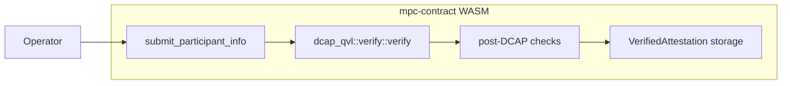
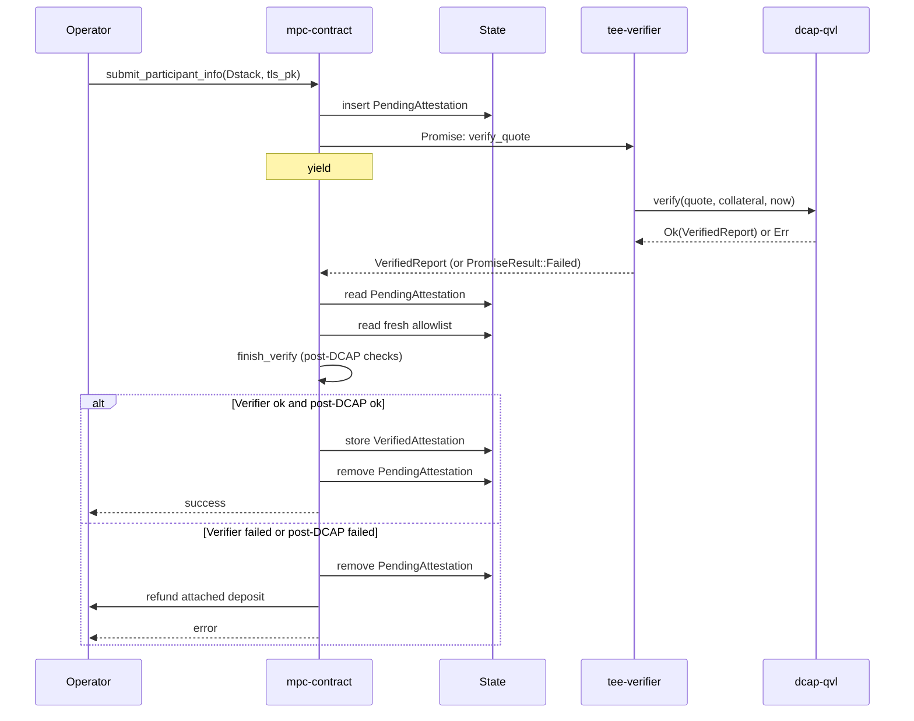
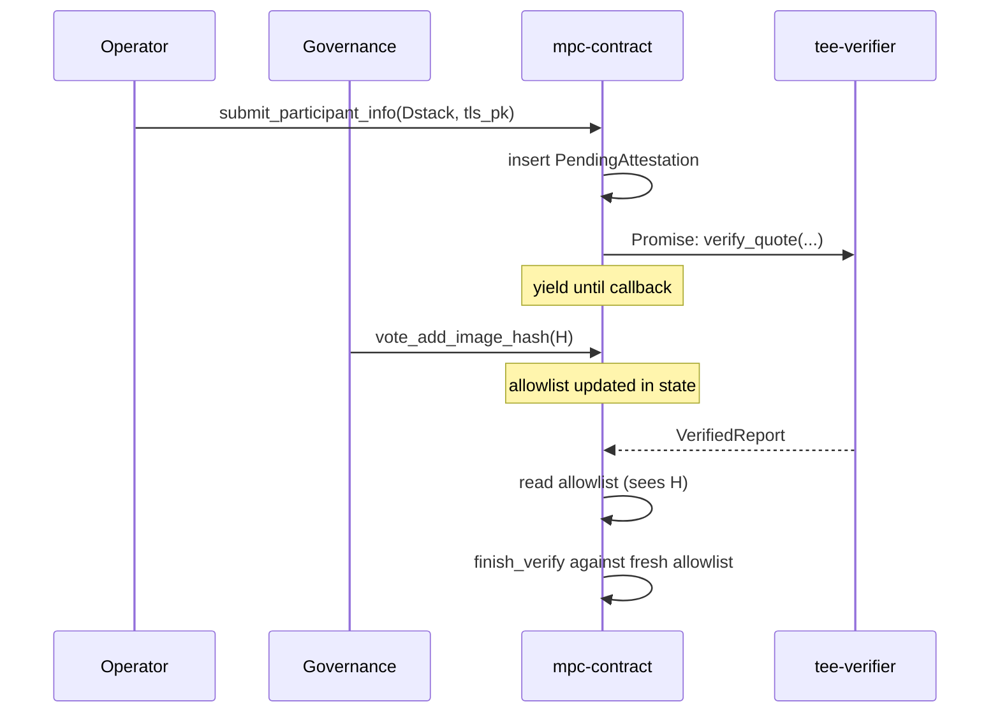
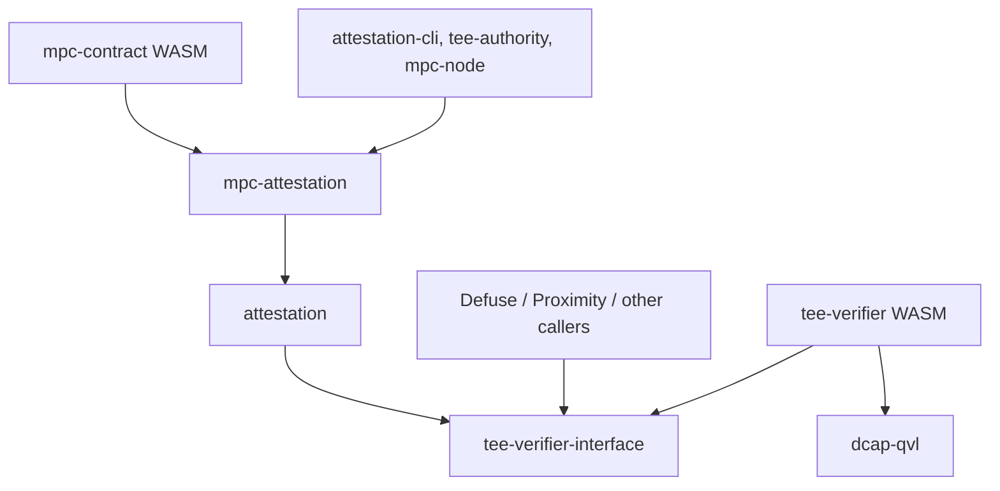

# Attestation Verifier Contract Breakout

This document outlines the design for moving on-chain TDX quote verification out of `mpc-contract`'s WASM into a standalone verifier contract.

It supersedes [#3160](https://github.com/near/mpc/pull/3160), which sketched a three-contract architecture (shared verifier + per-team policy contract + TEE-agnostic application contract) for Defuse, Proximity, and other teams. That direction was deferred: a shared policy contract presumes shared lifecycle conventions (the [launcher pattern][launcher-pattern] `mpc-contract` uses), and aligning the other teams on those conventions is a separate, longer [conversation][slack-launcher-discussion] that has not yet converged.

This document narrows the scope to the one piece that benefits every team — the DCAP verification primitive — and leaves policy in `mpc-contract`.

## Background

### Current State

[`mpc-contract`](../../crates/contract) accepts TEE attestations from participant nodes through [`submit_participant_info`](../../crates/contract/src/lib.rs). The method runs cryptographic Intel TDX quote verification synchronously inside the contract by calling `dcap_qvl::verify::verify`, which links `dcap-qvl` and its `ring` / `webpki` / `x509-cert` transitive dependencies into the contract's WASM.

The current flow, in one diagram:



### Issues with the current design

1. **MPC contract size pressure.** `dcap-qvl` and its transitive dependencies account for ~310 KB of the compiled `mpc-contract` WASM — none of which is MPC logic. The current WASM sits close to NEP-509's 1,490,000-byte hard limit, leaving little headroom for the contract's own evolution.

   |                   | Bytes      | Delta from current `main` |
   |-------------------|------------|---------------------------|
   | `main` baseline   | 1,459,158  | —                         |
   | After this design | ~1,149,708 | **−309,450 (−21.2%)**     |

   Sizes after this design are measured on the PoC branch in [#3247](https://github.com/near/mpc/pull/3247), which strips `dcap-qvl` out of `mpc-contract`'s dependency graph.

2. **Non-reusable verification primitive.** Other NEAR teams (Proximity, Defuse, anyone building on Intel TDX) cannot call `dcap_qvl::verify` on-chain without re-linking the entire dependency tree into their own contract.

## Design goal

The primary goal is to bring the `mpc-contract` WASM safely under NEP-509's 1,490,000-byte limit by extracting `dcap_qvl::verify` into a standalone, stateless `tee-verifier` contract.

A natural side effect: once the verifier is its own contract, other NEAR teams building on Intel TDX can call it without re-linking `dcap-qvl` themselves.

Looking further out, the same contract can be extended to cover other TEE flavors (Intel SGX, AMD SEV-SNP) behind the same interface, and — if and when other teams adopt the launcher pattern — broadened to host shared post-verification policy. For now its scope is deliberately narrow.

## Architecture Overview

DCAP quote verification moves into a standalone contract called `tee-verifier`. The wire format — a DTO-only crate carrying Borsh-serializable mirrors of the relevant `dcap-qvl` types and nothing else — lives in a dedicated crate called `tee-verifier-interface`. `mpc-contract` no longer links `dcap-qvl`; the verifier links it instead.


### Submission flow

`mpc-contract`'s [`submit_participant_info`][submit-participant-info] becomes asynchronous for Dstack attestations. The method extracts the quote bytes and collateral from the submitted `Attestation::Dstack`, schedules a Promise to `tee-verifier::verify_quote`, and chains a private callback (`on_attestation_verified`) onto the Promise. The Promise yields control; the receipt executes in a later block; the callback runs after the verifier returns. The post-DCAP checks (RTMR3 replay, app-compose validation, measurement allowlist matching, report-data binding) all run in the callback against the `VerifiedReport` the verifier returns, and against state held by `mpc-contract`.

The post-DCAP policy inputs are the same fields `mpc-contract` already holds today — the allowed-image-hash list, the per-account TLS / account public-key binding, and the stored-attestation map. No new policy state is introduced; the only state addition is the `pending_attestations` map described below, which is bookkeeping for the in-flight Promise.

The periodic re-validation path ([`re_verify`](../../crates/contract/src/tee/tee_state.rs)) does not call `dcap_qvl::verify` — it re-checks post-DCAP allowlist invariants against already-stored attestations — and is therefore unaffected by this design. It stays synchronous.



#### Caller-side impact

The only caller of `submit_participant_info` in production is `mpc-node`'s `periodic_attestation_submission` task, which resubmits on a 1-hour cadence and on attestation-removal events. It already polls contract state to confirm the attestation is actually stored, with exponential backoff (100 ms → 60 s, capped at 12 h). That polling-based success criterion is what makes the sync→async change transparent.

#### Handling failures

The callback never panics: that would roll back the pending-entry cleanup and the refund Promise. Each failure branch instead clears the pending entry, schedules a deposit refund, logs a structured reason, and returns normally.

1. **Verifier rejected the quote** — `Err(VerifierError)`. Bad quote, expired collateral, malformed input.
2. **Verifier infrastructure failure** — `Err(PromiseError)`. Verifier account gone, OOM, etc.
3. **Post-DCAP check failed** — any of the four checks listed in [§Submission flow](#submission-flow) (RTMR3 replay, app-compose validation, allowlist matching, report-data binding).
4. **Callback ran out of gas.** The pending entry isn't cleared and the deposit isn't refunded — the `PendingAttestation` is orphaned until its TTL elapses. Each entry stamps `expires_on = env::block_height() + PENDING_ATTESTATION_TIMEOUT_BLOCKS` at submit time; a resubmit from the same `AccountId` is rejected while `block_height() < expires_on` and overwrites the orphan after. This is the same timeout-on-read pattern [`KeyEventInstance`](../../crates/contract/src/state/key_event.rs) uses for stalled key events.

### Contract state changes

The callback runs in a later block than `submit_participant_info`, as an independent contract invocation. Anything the callback still needs must be stashed in contract storage, in a new field:

```rust
pending_attestations: LookupMap<AccountId, PendingAttestation>
```

Each `PendingAttestation` holds:

- **The submitter's `Attestation::Dstack` payload** — the RTMR3 event log, app-compose, and report-data the post-DCAP checks consume.
- **The submitter's TLS public key** — the callback hashes it with the submitter's account public key and compares to the quote's `report_data` field, proving the enclave produced the quote for this specific submitter.
- **The attached deposit** — covers storage staking on success, must be refunded on failure. `env::attached_deposit()` is not visible from the callback receipt.
- **`expires_on: BlockHeight`** — TTL for orphan recovery; see [§Handling failures](#handling-failures).

Entries are removed by the callback regardless of outcome; the only way one outlives its callback is the out-of-gas case in [§Handling failures](#handling-failures), where the TTL guarantees the orphan is bounded.

Notably absent from `PendingAttestation`: the **allowed-image-hash list**. The callback re-reads it from contract state, so any governance vote that adds or removes an entry mid-Promise applies to verifications it overlaps. Snapshotting at request time would freeze each submission against stale policy — wrong default for a security control, where removing a compromised hash should take effect immediately.



## Crate layout

Two new crates, plus an existing one that picks up a new dependency:

- **`tee-verifier-interface`** (new). Wire DTOs only — `QuoteBytes`, `Collateral`, `VerifiedReport`, and the nested report / TCB-status types — as Borsh-serializable mirrors of the corresponding `dcap-qvl` types. No `dcap-qvl` dependency, no MPC-specific types. This is what every caller of the verifier links against.
- **`tee-verifier`** (new). The verifier contract WASM. Exposes a single method, `verify_quote`, which wraps `dcap_qvl::verify::verify`.
- **`attestation`** (existing). TDX domain types and the post-DCAP verification logic. Picks up `tee-verifier-interface` to re-export `Collateral` and `QuoteBytes` instead of duplicating them.
- **`mpc-attestation`** (existing). MPC-specific framing on top of `attestation`: the `Attestation { Dstack, Mock }` enum, the `(tls_pk, account_pk)` binding, mock attestation verification.

The resulting Cargo dependency graph:



## Governance and upgrades

The verifier has no admin methods or on-chain configuration — its behavior is fully determined by its deployed bytes, hence by its code hash. The only governance surface is on `mpc-contract`, choosing which deployed instance to trust.

### Verifier instances on-chain

Each verifier is a NEP-591 **global contract** attached to a locked NEAR account: the bytes are published to the protocol once (keyed by `CodeHash(H)`), an account points at them via `UseGlobalContractAction`, and that account's full-access keys are removed. From that moment on, the protocol's own `account_id → CodeHash(H)` binding is immutable, and the verifier's behavior at that account is fixed forever. `mpc-contract` calls the verifier through `self.tee_verifier_account_id` at call time.

Before voting yes on a candidate, operators run four checks:

1. Reproducibly build the verifier source ([NEP-330](https://github.com/near/NEPs/blob/master/neps/nep-0330.md) / `cargo-near`) → `H_source`.
2. RPC `view_account(candidate_account_id).contract` → `CodeHash(H_deployed)`.
3. RPC `view_access_key_list(candidate_account_id)` → empty (locked).
4. `H_source == H_deployed`.


### Who chooses, and why NEP-591

Active MPC participants vote, through `vote_tee_verifier_change` (see [§Voting on the trusted verifier](#voting-on-the-trusted-verifier)). External callers (Defuse, Proximity) run their own equivalent vote on their own contract — independent decisions, no shared governance surface.

The reasons to prefer NEP-591 globals over a plain locked contract:

- **Caller-side immutability is protocol-enforced.** The `account_id → CodeHash` binding lives in protocol state and cannot change once the account is locked.
- **Atomic rollback.** Reverting an upgrade is one vote pointing back at a previously trusted `AccountId`; the old instance is still locked and callable.
- **Multi-version coexistence and A/B-testing.** Several locked instances can coexist at different account IDs.
- **Cross-shard code dedup.** If other teams adopt the same global, the protocol caches the WASM once. Marginal today, real with multi-team adoption.

The cost is one extra deploy step: publishing the global and locking it onto a fresh account before the vote can open. Both are open to anyone, not just operators — useful friction for a security-critical primitive.

### Trust model

`expected_code_hash` carried by `vote_tee_verifier_change` is a voter commitment, not a contract-enforceable claim — Wasm can't read another account's `code_hash` on-chain. So the security of `tee_verifier_account_id` rests on every voter running the audit above before voting yes. The threshold raises "one careless voter" to "a majority of careless voters"; the CLI helper, social conventions, and an audit log of every vote are the only other mitigations. This is the same trust shape as `propose_update` / `vote_update` for `mpc-contract`'s own code, restated here because the verifier is a separate account that voters might not associate with the same discipline.

## API Proposal

### The Verifier Contract

The verifier exposes exactly one method:

```rust
#[near]
impl TeeVerifier {
    /// Verify a TDX quote against Intel collateral.
    ///
    /// Calls `dcap_qvl::verify::verify` with the current block timestamp and
    /// returns the parsed `VerifiedReport` on success, or a structured
    /// `VerifierError` on failure. The method does not panic on
    /// caller-controlled input — a malformed quote or expired collateral comes
    /// back as `Err(...)`, not as a `PromiseError::Failed` on the caller side.
    #[result_serializer(borsh)]
    pub fn verify_quote(
        &self,
        #[serializer(borsh)] quote: QuoteBytes,
        #[serializer(borsh)] collateral: Collateral,
    ) -> Result<VerifiedReport, VerifierError>;
}
```

`VerifierError` lives in `tee-verifier-interface` so callers depend on the same enum. One variant per `dcap_qvl::verify::verify` failure category (quote-malformed, collateral-expired, tcb-revoked, signature-mismatch, etc.), plus a fallback `Other(String)` for upstream errors that don't fit cleanly. Returning a `Result` instead of panicking matters because `PromiseError` carried back to the caller is opaque — it would tell the caller *that* the receipt failed, not *why*. With the explicit `Err`, the callback in [`mpc-contract`](#mpc-contractsubmit_participant_info) can branch on the actual reason, log it, and refund the deposit, all in a single non-aborting receipt.

The contract is stateless. The wire DTOs (`QuoteBytes`, `Collateral`, `VerifiedReport`, `VerifierError`, and the nested report types) are field-for-field Borsh mirrors of the corresponding `dcap_qvl` types, defined in `tee-verifier-interface`.

The method is named `verify_quote`, not `verify`: even on a single-method contract, an unqualified `verify` reads ambiguously in caller code (`tee_verifier.verify(...)` vs `tee_verifier.verify_quote(...)`), and leaves no room for future siblings (e.g. a batched `verify_quote_batch`).

The `#[serializer(borsh)]` / `#[result_serializer(borsh)]` annotations are deliberate: `near-sdk`'s default serializer is JSON, which would force every byte buffer in `Collateral` (a TCB info blob plus its signature, a QE identity blob plus its signature, and a PCK certificate chain) through base64 wrapping at both ends. Borsh keeps the payload as raw bytes, halves the over-the-wire size on the dominant fields, and matches what `dcap-qvl`'s own types are serialized as anyway. The verifier has no human-driven callers (no CLI invocations, no view methods from a wallet UI), so the usual JSON-for-ergonomics argument doesn't apply.

### Voting on the trusted verifier

Voting reuses the contract's generic [`Votes<V>`](../../crates/contract/src/primitives/votes.rs) primitive — the same one [`ProviderVotes`](../../crates/contract/src/foreign_chain_rpc.rs) uses for the foreign-chain-RPC whitelist. `Votes<V>` already implements per-voter bookkeeping, `vote` / `remove_vote`, and `voters_for(proposal_hash)`; we just provide the proposal payload and a `ProposalHashEncoding` impl so it can be addressed by hash. Rolling a bespoke `PendingVerifierChange { … votes: HashSet }` struct would re-implement what's already in-tree and grow the contract WASM for no gain.

```rust
/// Proposal payload. Two voters arrive at the same `ProposalHash` iff they
/// borsh-serialize the same `(candidate_account_id, expected_code_hash)` —
/// description is excluded from the hash so cosmetic differences don't fork
/// the vote.
#[near(serializers = [borsh])]
pub struct VerifierChangeProposal {
    pub candidate_account_id: AccountId,
    pub expected_code_hash: CryptoHash,
}

impl ProposalHashEncoding for VerifierChangeProposal {
    fn bytes_for_hash(&self) -> Vec<u8> {
        borsh::to_vec(self).expect("borsh serialization must succeed")
    }
}

impl MpcContract {
    /// Cast a vote for changing the trusted verifier to the given proposal.
    /// The vote target is `(candidate_account_id, expected_code_hash)`, hashed
    /// to a `ProposalHash`; voters who submit identical pairs converge on the
    /// same hash. `description` is a free-form audit-trail string emitted in
    /// the vote-event log but not used for hashing or equality.
    ///
    /// Calling this method a second time from the same voter replaces their
    /// previous vote (delegated to `Votes::vote`). To withdraw a vote without
    /// replacing it, use `withdraw_tee_verifier_vote`.
    ///
    /// When the threshold is reached, the contract writes
    /// `self.tee_verifier_account_id = candidate_account_id`, emits an event
    /// carrying `(candidate_account_id, expected_code_hash, description)`,
    /// and clears the proposal.
    pub fn vote_tee_verifier_change(
        &mut self,
        candidate_account_id: AccountId,
        expected_code_hash: CryptoHash,
        description: String,
    );

    /// Withdraw the caller's current vote on any pending verifier-change
    /// proposal, if they have one. No-op if the caller has not voted.
    pub fn withdraw_tee_verifier_vote(&mut self);
}
```

The contract gains one additional state field:

```rust
pub struct MpcContract {
    // ... existing fields, including tee_verifier_account_id ...
    tee_verifier_votes: Votes<AuthenticatedParticipantId>,
}
```

The proposal payload itself is *not* stored under a separate map: voters supply `(candidate_account_id, expected_code_hash)` on every call to `vote_tee_verifier_change`, the hash is computed at vote time, and `Votes<V>` only persists `(voter → proposal_hash)` and `(proposal_hash → voter_set)`. The audit-trail record of which hash a majority endorsed lives in the threshold-reached event, not in long-lived contract state. This matches `ProviderVotes`' encoding.

**`expected_code_hash` is now structured state**, not stuffed into `description: String` as before. The contract still cannot verify on-chain that the candidate account's deployed code actually has that hash (Wasm cannot read another account's `code_hash`; see [§Trust model](#trust-model) below) — but every vote now carries the hash as a typed `CryptoHash`, and any voter calling with a different hash for the same candidate produces a different `ProposalHash` and lands in a different vote bucket. A proposer who submits the wrong hash splits the vote rather than poisoning it.

**Proposal lifecycle.** A proposal that never reaches threshold has no garbage to collect: `Votes<V>` cleans up the per-proposal voter set when its last voter calls `withdraw_tee_verifier_vote`, and voters whose participant status changes (e.g. resharing dropped them from the active set) get their stale votes purged by the existing `Votes::retain` sweep on the next state transition — same as `ProviderVotes`. There is no separate `cancel_proposal` method because a proposal "exists" only as the union of live voters pointing at the same `ProposalHash`.

Any subsequent `submit_participant_info` call uses the new `tee_verifier_account_id` automatically. There is no `cfg(feature = ...)` selector and no recompile.

Outstanding `PendingAttestation` Promises remain bound to whatever `tee_verifier_account_id` was at submit time; a vote that changes the address takes effect on the next `submit_participant_info`, not on in-flight verifications.

### `mpc-contract::submit_participant_info`

The method splits into two halves with a Promise between them — see [§Submission flow](#submission-flow) above for the architecture, sequence diagram, caller-side impact, and failure handling. The full implementation:

```rust
impl MpcContract {
    pub fn submit_participant_info(
        &mut self,
        attestation: Attestation,
        tls_pk: PublicKey,
    ) -> PromiseOrValue<()> {
        // Existing convention: caller must be the signer of this transaction,
        // not a relayer or proxy. Preserved from today's contract for both
        // Mock and Dstack paths so the Dstack-arm change below doesn't
        // silently relax it on the Mock branch.
        let account_id = Self::assert_caller_is_signer();
        match attestation {
            // Unchanged from today.
            Attestation::Mock(mock) => {
                self.verify_mock_synchronously(mock, tls_pk);
                PromiseOrValue::Value(())
            }
            // New: Promise + callback.
            Attestation::Dstack(dstack) => {
                // Reject if a fresh pending entry already exists; stale entries
                // (older than PENDING_ATTESTATION_TIMEOUT_BLOCKS) self-heal — see
                // §Handling failures.
                if let Some(existing) = self.pending_attestations.get(&account_id) {
                    if env::block_height() < existing.expires_on {
                        env::panic_str("verification already pending");
                    }
                }
                let (quote, collateral) = extract_dcap_inputs(&dstack);
                self.pending_attestations.insert(
                    account_id.clone(),
                    PendingAttestation {
                        dstack,
                        tls_pk,
                        attached_deposit: env::attached_deposit(),
                        expires_on: env::block_height() + PENDING_ATTESTATION_TIMEOUT_BLOCKS,
                    },
                );
                let promise = Promise::new(self.tee_verifier_account_id.clone())
                    .function_call(
                        "verify_quote".into(),
                        borsh::to_vec(&(quote, collateral)).unwrap(),
                        NearToken::from_yoctonear(0),
                        Gas::from_tgas(VERIFIER_GAS_TGAS),
                    )
                    .then(
                        Self::ext(env::current_account_id())
                            .with_static_gas(Gas::from_tgas(CALLBACK_GAS_TGAS))
                            .on_attestation_verified(account_id),
                    );
                PromiseOrValue::Promise(promise)
            }
        }
    }

    /// The callback never panics on a verifier or post-DCAP failure: panicking
    /// would abort the receipt and roll back the `pending_attestations.remove`
    /// plus the refund Promise, defeating both invariants we care about. All
    /// failure branches do their state mutation and schedule the refund before
    /// returning normally; the caller learns the outcome from the logged
    /// reason and from contract-state reads.
    #[private]
    pub fn on_attestation_verified(
        &mut self,
        account_id: AccountId,
        #[callback_result] result: Result<Result<VerifiedReport, VerifierError>, PromiseError>,
    ) {
        let Some(pending) = self.pending_attestations.remove(&account_id) else {
            // The pending entry was already cleared (e.g. overwritten by a
            // later submit after the TTL elapsed). Nothing to do.
            log!("on_attestation_verified: no pending entry for {account_id}");
            return;
        };

        let verified_report = match result {
            // Verifier returned a structured error — refund and log.
            Ok(Err(verifier_err)) => {
                refund_deposit(&account_id, pending.attached_deposit);
                log!("verifier rejected quote for {account_id}: {verifier_err:?}");
                return;
            }
            // Infrastructure failure (verifier OOM, account gone, etc.) — refund and log.
            Err(promise_err) => {
                refund_deposit(&account_id, pending.attached_deposit);
                log!("verifier promise failed for {account_id}: {promise_err:?}");
                return;
            }
            Ok(Ok(report)) => report,
        };

        // Post-DCAP checks operate on the verified report plus state held here.
        // The allowlist is read fresh — governance votes mid-flight take effect.
        if let Err(reason) = finish_verify(&pending, &verified_report, self.allowlist_fresh()) {
            refund_deposit(&account_id, pending.attached_deposit);
            log!("post-DCAP check failed for {account_id}: {reason}");
            return;
        }

        self.tee_state.stored_attestations.insert(
            pending.tls_pk.clone(),
            VerifiedAttestation::from((pending, verified_report)),
        );
    }
}
```

`VERIFIER_GAS_TGAS` and `CALLBACK_GAS_TGAS` are placeholders until benchmarked against the PoC in [#3247](https://github.com/near/mpc/pull/3247). The verifier-side cost is dominated by ECDSA verifications and X.509-chain walking inside `dcap_qvl::verify::verify`; the callback-side cost is dominated by RTMR3 replay and the four post-DCAP checks. Both need measurement, not estimation.

The contract gains the following state fields:

```rust
pub struct MpcContract {
    // ... existing fields ...
    pending_attestations: LookupMap<AccountId, PendingAttestation>,
    tee_verifier_account_id: AccountId,
    // pending_tee_verifier_changes is described in §Voting on the trusted verifier
}

pub struct PendingAttestation {
    pub dstack: DstackAttestation,
    pub tls_pk: PublicKey,
    pub attached_deposit: NearToken,
    pub expires_on: BlockHeight,
}
```

`pending_attestations` is keyed by `AccountId`; `stored_attestations` (the existing verified-attestation map) stays keyed by `tls_public_key`. The asymmetry is intentional: the pending entry is keyed by who pays and gets refunded, the verified entry is keyed by what identifies the node. See [§Handling failures](#handling-failures) for how `expires_on` recovers an orphan and rejects concurrent submits.

`tee_verifier_account_id` is the locked account `mpc-contract` currently trusts as the verifier (see [§How verifier instances exist on-chain](#how-verifier-instances-exist-on-chain) for selection, [§Voting on the trusted verifier](#voting-on-the-trusted-verifier) for changes).

## Testing

The new test surface is the Promise + callback split — the verifier-rejection / verifier-infra-failure / post-DCAP-fail / success branches in `on_attestation_verified` that the synchronous version never had to exercise. The strategy that covers it cleanly is a **stub `tee-verifier`** crate: same `tee-verifier-interface` DTOs, but `verify_quote` returns `Ok(VerifiedReport)` or `Err(VerifierError)` on demand. Sandbox tests deploy that stub like any other verifier candidate — lock the account it lives at, then call `propose_tee_verifier_change` + `vote_tee_verifier_change` from the test setup to point `mpc-contract` at the stub. Same code path as production; no compile-time switches.

Two test patterns become reachable that weren't before:

- **The Promise + callback path runs on every test.** Today, tests that submit `Attestation::Dstack` need real `dcap-qvl` running on real Intel collateral; tests that don't want that overhead use `Attestation::Mock` to bypass the verification path entirely. With a stub verifier, the Promise path is always live — the stub just decides what report comes back.
- **Post-DCAP checks can be exercised directly.** The four post-DCAP checks now run in the callback against the verifier's `VerifiedReport`. The stub can return reports that pass DCAP but fail any one of them, exercising each branch without crafting full Dstack quotes.

In-process unit tests are still the right place for callback edge cases (out-of-gas, missing pending entry, refund routing): construct a `VerifiedReport` from `tee-verifier-interface`'s public types, invoke `on_attestation_verified` directly, assert state. Faster than sandbox tests and doesn't require a near-sandbox process.

The existing E2E setup (the `near-sandbox`-backed tests in `crates/e2e-tests`) gets one new deployment step: alongside `mpc-contract`, the test harness deploys either the real `tee-verifier` (for tests that want to exercise real `dcap-qvl` against a fixture quote) or the stub verifier (for everything else). No new test framework — same crate, one extra `deploy` call in the setup helper.

Once the stub exists, `Attestation::Mock`'s role in tests is largely superseded: the stub covers skipping `dcap-qvl`, running on non-TDX machines, and exercising post-DCAP policy in isolation. The first iteration of this design keeps `Attestation::Mock`; a later iteration can remove it once the stub is the established path.

[submit-participant-info]: https://github.com/near/mpc/blob/efe49230bb66854c55bba080e7610e42f9221506/crates/contract/src/lib.rs#L754-L782
[launcher-pattern]: https://github.com/near/mpc/blob/efe49230bb66854c55bba080e7610e42f9221506/docs/tee-lifecycle.md#upgrade
[slack-launcher-discussion]: https://nearone.slack.com/archives/C0B12RKBSAV/p1777897902903889
