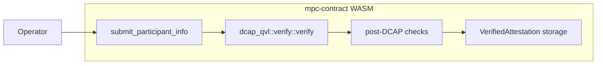
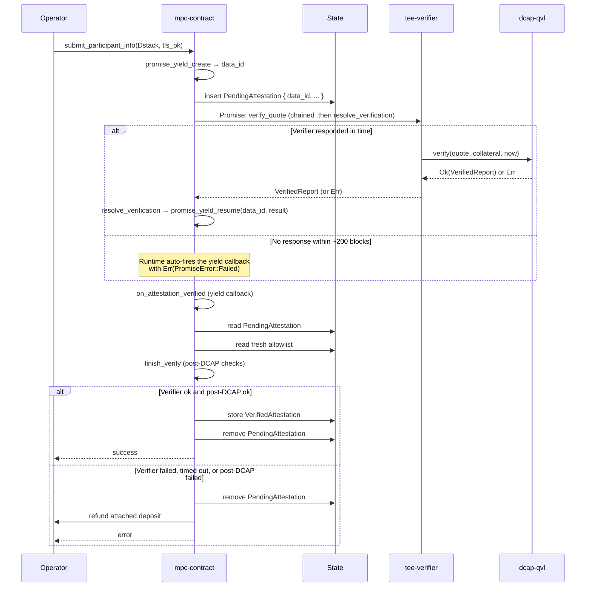
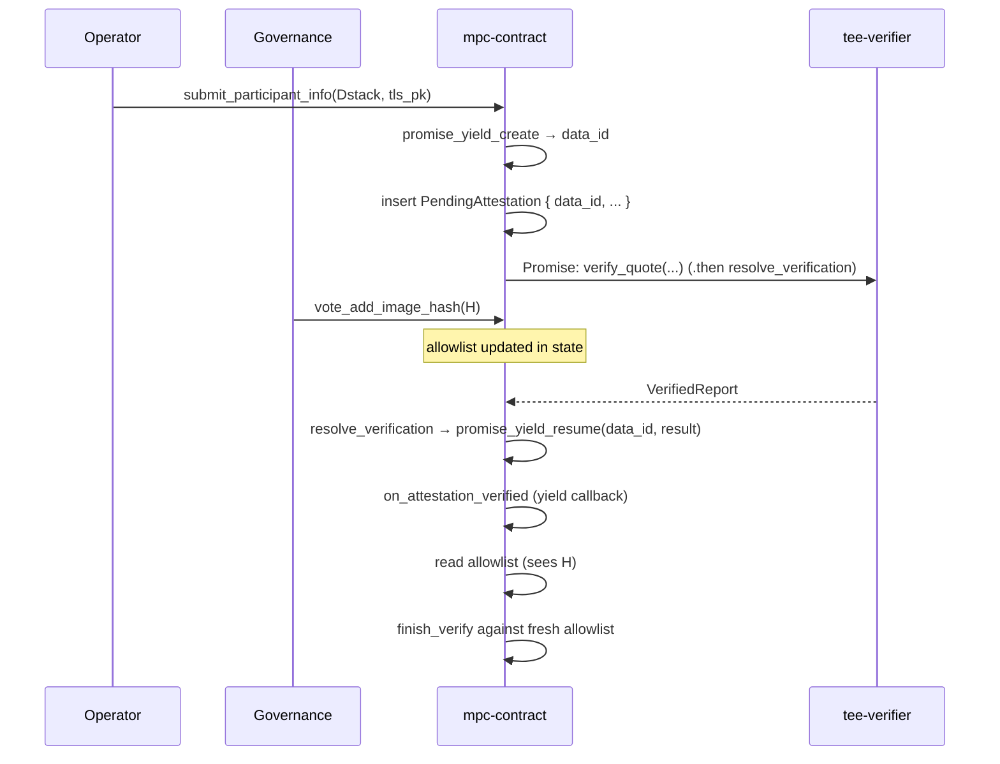
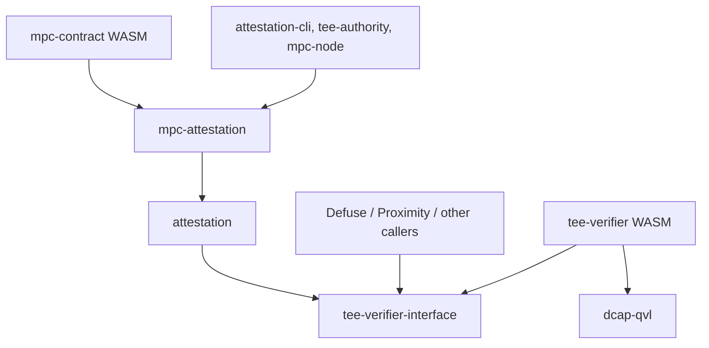
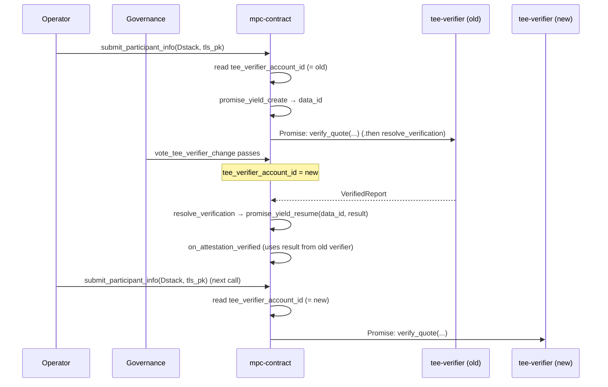

# Attestation Verifier Contract Breakout

This document outlines the design for moving on-chain TDX quote verification out of `mpc-contract`'s WASM into a standalone verifier contract.

It supersedes [#3160](https://github.com/near/mpc/pull/3160), which sketched a three-contract architecture (shared verifier + per-team policy contract + TEE-agnostic application contract) for Defuse, Proximity, and other teams. That direction was deferred: a shared policy contract presumes shared lifecycle conventions (the [launcher pattern][launcher-pattern] `mpc-contract` uses), and aligning the other teams on those conventions is a separate, longer [conversation][slack-launcher-discussion] that has not yet converged.

This document narrows the scope to the one piece that benefits every team — the DCAP verification primitive — and leaves policy in `mpc-contract`.

## Background

### Current State

[`mpc-contract`](../../crates/contract) accepts TEE attestations from participant nodes through [`submit_participant_info`](../../crates/contract/src/lib.rs). The method runs cryptographic Intel TDX quote verification synchronously inside the contract by calling `dcap_qvl::verify::verify`, which links `dcap-qvl` and its `ring` / `webpki` / `x509-cert` transitive dependencies into the contract's WASM.

The current flow, in one diagram:



### Issues with the current design

1. **MPC contract size pressure.** `dcap-qvl` and its transitive dependencies account for ~310 KB of the compiled `mpc-contract` WASM — none of which is MPC logic. The current WASM sits close to [NEP-509][nep-509]'s `max_transaction_size` of 1.5 MiB (1,572,864 bytes), the cap that gates contract deployment, leaving little headroom for the contract's own evolution.

   |                   | Bytes      | Delta from current `main` |
   |-------------------|------------|---------------------------|
   | `main` baseline   | 1,459,158  | —                         |
   | After this design | ~1,149,708 | **−309,450 (−21.2%)**     |

   Sizes after this design are measured on the PoC branch in [#3247](https://github.com/near/mpc/pull/3247), which strips `dcap-qvl` out of `mpc-contract`'s dependency graph.

2. **Non-reusable verification primitive.** Other NEAR teams (Proximity, Defuse, anyone building on Intel TDX) cannot call `dcap_qvl::verify` on-chain without re-linking the entire dependency tree into their own contract.

## Design goal

The primary goal is to bring the `mpc-contract` WASM safely under [NEP-509][nep-509]'s 1.5 MiB transaction size limit by extracting `dcap_qvl::verify` into a standalone, stateless `tee-verifier` contract.

A natural side effect: once the verifier is its own contract, other NEAR teams building on Intel TDX can call it without re-linking `dcap-qvl` themselves.

Looking further out, the same contract can be extended to cover other TEE flavors (Intel SGX, AMD SEV-SNP) behind the same interface, and — if and when other teams adopt the launcher pattern — broadened to host shared post-verification policy. For now its scope is deliberately narrow.

## Architecture Overview

DCAP quote verification moves into a standalone contract called `tee-verifier`. The wire format — a DTO-only crate carrying Borsh-serializable mirrors of the relevant `dcap-qvl` types and nothing else — lives in a dedicated crate called `tee-verifier-interface`. `mpc-contract` no longer links `dcap-qvl`; the verifier links it instead.


### Submission flow

`mpc-contract`'s [`submit_participant_info`][submit-participant-info] becomes asynchronous for Dstack attestations and uses the same yield-resume pattern already in place for `sign`, `request_app_private_key`, and `request_verify_foreign_tx`. The method registers a yielded promise via [`env::promise_yield_create`][promise-yield-create] (going through the contract's existing [`enqueue_yield_request`][enqueue-yield-request] helper), stashes the resulting `data_id` in `pending_attestations`, and fires a cross-contract call to `tee-verifier::verify_quote` whose own `.then` callback invokes [`env::promise_yield_resume`][promise-yield-resume] with the verifier's response. The yield-callback (`on_attestation_verified`) runs the post-DCAP checks (RTMR3 replay, app-compose validation, measurement allowlist matching, report-data binding) against the `VerifiedReport` the verifier returns and against state held by `mpc-contract`. If the verifier never responds within the protocol-level yield-resume window (~200 blocks ≈ 3 min), the runtime fires the same callback with `Err(PromiseError::Failed)` so cleanup runs anyway.

The post-DCAP policy inputs are the same fields `mpc-contract` already holds today — the allowed-image-hash list, the per-account TLS / account public-key binding, and the stored-attestation map. No new policy state is introduced; the only state addition is the `pending_attestations` map described below, which is bookkeeping for the in-flight yield.

The periodic re-validation path ([`re_verify`](../../crates/contract/src/tee/tee_state.rs)) does not call `dcap_qvl::verify` — it re-checks post-DCAP allowlist invariants against already-stored attestations — and is therefore unaffected by this design. It stays synchronous.



#### Caller-side impact

The only caller of `submit_participant_info` in production is `mpc-node`'s `periodic_attestation_submission` task, which resubmits on a 1-hour cadence and on attestation-removal events. It already polls contract state to confirm the attestation is actually stored, with exponential backoff (100 ms → 60 s, capped at 12 h). That polling-based success criterion is what makes the sync→async change transparent. Under yield-resume the returned `Promise` also resolves with the actual outcome (success or timeout-error) within ~200 blocks, so any future caller that wants to await the result synchronously can — without changing the contract.

#### Handling failures

The yield-callback never panics: that would roll back the pending-entry cleanup and the refund Promise. Each failure branch instead clears the pending entry, schedules a deposit refund, logs a structured reason, and returns normally. Yield-resume gives the runtime, not the contract, ownership of the timeout — `env::promise_yield_resume(data_id, ...)` is guaranteed to fire the callback exactly once, either with the verifier's response or, after ~200 blocks of silence, with `Err(PromiseError::Failed)`. There is no orphan-entry case to clean up out-of-band.

1. **Verifier rejected the quote** — `Err(VerifierError)`. Bad quote, expired collateral, malformed input.
2. **Verifier infrastructure or runtime timeout** — `Err(PromiseError::Failed)`. Verifier account gone, OOM, or no response in ~200 blocks. The branch is the same either way: read `PendingAttestation`, refund the deposit, remove the entry, log. This is the same shape as [`return_signature_and_clean_state_on_success`][sign-yield-callback] in `mpc-contract`'s sign-request callback.
3. **Post-DCAP check failed** — any of the four checks listed in [§Submission flow](#submission-flow) (RTMR3 replay, app-compose validation, allowlist matching, report-data binding).

### Contract state changes

The callback runs in a later block than `submit_participant_info`, as an independent contract invocation. Anything the callback still needs must be stashed in contract storage, in a new field:

```rust
pending_attestations: LookupMap<AccountId, PendingAttestation>
```

This map mirrors the other pending-request maps in `mpc-contract` ([`pending_signature_requests`][pending-requests-mod], `pending_ckd_requests`, `pending_verify_foreign_tx_requests`), but stores a single `PendingAttestation` per `AccountId` rather than a `Vec<YieldIndex>`: attestation submissions are 1-per-account.

Each [`PendingAttestation`](#mpc-contractsubmit_participant_info) holds:

- **The submitter's `Attestation::Dstack` payload** — the RTMR3 event log, app-compose, and report-data the post-DCAP checks consume.
- **The submitter's TLS public key** — the callback hashes it with the submitter's account public key and compares to the quote's `report_data` field, proving the enclave produced the quote for this specific submitter.
- **The attached deposit** — covers storage staking on success, refunded to the signer of the original `submit_participant_info` transaction on failure. `env::attached_deposit()` is not visible from the callback receipt, so the value is stashed at submit time and the recipient `AccountId` is the same one used to key the entry (set by `Self::assert_caller_is_signer()`).
- **`data_id: CryptoHash`** — the yield handle returned by [`env::promise_yield_create`][promise-yield-create]. The intermediate `.then` callback (`resolve_verification`) reads this back to call [`env::promise_yield_resume`][promise-yield-resume] with the verifier's response.

Entries are removed by the yield-callback on every branch, success or failure. Because the runtime guarantees exactly one yield-callback invocation per `data_id` (the verifier's response if it arrives, `Err(PromiseError::Failed)` otherwise), no entry can outlive its callback.

Notably absent from `PendingAttestation`: the **post-DCAP policy state** — allowed MPC image hashes, allowed launcher compose hashes, and accepted measurements. The callback re-reads all of them from contract state, so any governance vote that adds or removes an entry mid-Promise applies to verifications it overlaps. Snapshotting at request time would freeze each submission against stale policy — wrong default for a security control, where removing a compromised hash should take effect immediately.



## Crate layout

Two new crates, plus an existing one that picks up a new dependency:

- **`tee-verifier-interface`** (new). Wire DTOs only — `QuoteBytes`, `Collateral`, `VerifiedReport`, and the nested report / TCB-status types — as Borsh-serializable mirrors of the corresponding `dcap-qvl` types. No `dcap-qvl` dependency, no MPC-specific types. This is what every caller of the verifier links against.
- **`tee-verifier`** (new). The verifier contract WASM. Exposes a single method, `verify_quote`, which wraps `dcap_qvl::verify::verify`.
- **`attestation`** (existing). TDX domain types and the post-DCAP verification logic. This is the crate that currently holds the `dcap-qvl` dependency on `main` — `Collateral` is a re-export of `dcap_qvl::QuoteCollateralV3`, the post-DCAP helpers take `dcap_qvl::verify::VerifiedReport` and `dcap_qvl::quote::TDReport10` as arguments, and `Attestation::verify` calls `dcap_qvl::verify::verify`. Under this design those references are replaced with the Borsh-mirror equivalents from `tee-verifier-interface`, `Collateral` becomes a real DTO, and `Attestation::verify` moves out to an off-chain helper. After that `attestation/Cargo.toml` no longer lists `dcap-qvl`.
- **`mpc-attestation`** (existing). MPC-specific framing on top of `attestation`: the `Attestation { Dstack, Mock }` enum, the `(tls_pk, account_pk)` binding, mock attestation verification. On `main` this crate has no `dcap-qvl` in its `[dependencies]` — it inherits the dep transitively through `attestation`, so once `attestation` is cleaned up `mpc-attestation` is dcap-qvl-free without any of its own code changing. `mpc-contract` and `mpc-node` keep depending on it exactly as they do today.

The resulting Cargo dependency graph (arrows are `[dependencies]` edges — `tee-verifier` implements the wire format defined in `tee-verifier-interface`, see the bullet above):



## Governance and upgrades

The verifier contract is stateless and has no admin methods or on-chain configuration. For security, every verifier instance is deployed to a locked account — a NEAR account with no full-access keys, so the protocol refuses any future redeploy. The deployed bytes are frozen for the lifetime of the account; there is no in-place upgrade path. Changing the verifier means voting in a different, separately-deployed instance at a new locked account. The only governance decision is on `mpc-contract`, choosing which instance to trust through a vote of active MPC participants. External callers (Defuse, Proximity) run their own equivalent vote on their own contract.

On a verifier change, stored attestations keep the DCAP verdict from whichever verifier validated them at submit time — the contract does not re-run DCAP under the new verifier. [`re_verify`][re-verify] re-checks the post-DCAP allowlist invariants (image hash, launcher hash, measurements, expiry) but doesn't re-verify the DCAP signature chain. Convergence to the new verifier happens naturally via `mpc-node`'s [`periodic_attestation_submission`][periodic-attestation-submission] task (1-hour cadence), with a 7-day hard ceiling from the attestation TTL. If the verifier change is in response to a discovered compromise rather than a routine `dcap-qvl` bump, operators don't wait for the resubmit cycle — they update the post-DCAP allowlist to drop the affected image / launcher hash, and any subsequent [`verify_tee`][verify-tee] or [`clean_invalid_attestations`][clean-invalid-attestations] sweep evicts the stale entries immediately.

### Requirements on the verifier account

A trusted verifier account must not be replaceable by a malicious stub that returns `Ok(VerifiedReport)` for any input. Two checkable conditions prevent it:

1. **The right code is deployed.** The hash of the contract code currently deployed at the account matches the expected hash for that verifier release.
2. **That code can never be replaced.** The account has no full-access keys.

The verifier can be a regular contract or a NEP-591 global contract — both satisfy the requirements once locked. Globals have one small audit win — `view_account(account_id).contract` returns the protocol's own `CodeHash` directly, no client-side hashing — and enable cross-shard WASM dedup if other teams adopt the same hash.

### Auditing a candidate verifier

Before any operator votes yes on a candidate `account_id`, they need to confirm that the right code is deployed there and that the code can never be replaced. `mpc-contract` cannot verify either claim itself — a NEAR contract has no way to read another account's code hash or access-key list — so the audit is the voter's responsibility, not the contract's. The same four checks apply whether the candidate is a regular contract or a NEP-591 global:

1. Reproducibly build the verifier source → `H_source`.
2. Fetch `H_deployed`: `view_account(account_id).contract` for a global (returns `CodeHash` directly), or `view_code(account_id)` + local hash for a plain contract.
3. `view_access_key_list(account_id)` → empty.
4. `H_source == H_deployed`.

In practice the MPC team publishes `H_source` alongside the on-chain vote to change the trusted verifier. Operators are free to rebuild from source and verify the hash themselves, but the common path is "trust the published hash".

A CLI helper that runs all four deterministically (for example `attestation-cli audit-verifier <account-id>`) is a potential follow-up.

## API Proposal

### The Verifier Contract

The verifier exposes exactly one method:

```rust
#[near]
impl TeeVerifier {
    /// Verify a TDX quote against Intel collateral.
    ///
    /// Calls `dcap_qvl::verify::verify` with the current block timestamp and
    /// returns the parsed `VerifiedReport` on success, or a structured
    /// `VerifierError` on failure.
    pub fn verify_quote(
        &self,
        quote: QuoteBytes,
        collateral: Collateral,
    ) -> Result<VerifiedReport, VerifierError>;
}
```

The wire DTOs (`QuoteBytes`, `Collateral`, `VerifiedReport`, `VerifierError`, and the nested report types) live in the DTO-only `tee-verifier-interface` crate so callers depend on the same definitions. They are field-for-field Borsh mirrors of the corresponding `dcap_qvl` types. `VerifierError` has one variant per `dcap_qvl::verify::verify` failure category (quote-malformed, collateral-expired, tcb-revoked, signature-mismatch, etc.), plus a fallback `Other(String)` for upstream errors that don't fit cleanly.

### Voting on the trusted verifier in `mpc-contract`

The voting flow lives on `mpc-contract`, not on the verifier itself. It reuses `mpc-contract`'s existing generic [`Votes<V>`](../../crates/contract/src/primitives/votes.rs) primitive.

The proposal payload is the pair `(candidate_account_id, expected_code_hash)`. `candidate_account_id` is the address whose `verify_quote` method `mpc-contract` will invoke on every subsequent `submit_participant_info` call once the vote passes; that's all the contract actually consumes from the payload. `expected_code_hash` is included to make every voter explicitly commit to the hash they checked off-chain: without it, two voters could converge on the same `account_id` while disagreeing about what code that account runs. Both fields feed `ProposalHashEncoding`, so two voters submitting the same `account_id` with different hashes land in different vote buckets and neither reaches threshold on its own — that's how the contract enforces "everyone who voted yes endorsed the same code," without needing a separate validation step. When the winning bucket crosses threshold the contract clears *all* pending proposals for that `candidate_account_id` (including losing-hash buckets).

```rust
/// Proposal payload. Two voters arrive at the same `ProposalHash` iff they
/// borsh-serialize the same `(candidate_account_id, expected_code_hash)`.
#[near(serializers = [borsh])]
pub struct VerifierChangeProposal {
    pub candidate_account_id: AccountId,
    pub expected_code_hash: CryptoHash,
}

impl ProposalHashEncoding for VerifierChangeProposal {
    fn bytes_for_hash(&self) -> Vec<u8> {
        borsh::to_vec(self).expect("borsh serialization must succeed")
    }
}

impl MpcContract {
    /// Vote for `(candidate_account_id, expected_code_hash)`. Re-voting from
    /// the same caller replaces the previous vote; see
    /// `withdraw_tee_verifier_vote` to withdraw without replacing. When the
    /// threshold is reached, `tee_verifier_account_id` is updated and the
    /// proposal is cleared.
    pub fn vote_tee_verifier_change(
        &mut self,
        candidate_account_id: AccountId,
        expected_code_hash: CryptoHash,
    );

    /// Withdraw the caller's current vote on any pending verifier-change
    /// proposal, if they have one. No-op if the caller has not voted.
    pub fn withdraw_tee_verifier_vote(&mut self);
}
```

The contract gains two new state fields:

```rust
pub struct MpcContract {
    // ... existing fields ...

    /// The locked account `mpc-contract` currently trusts as the verifier.
    /// `submit_participant_info` calls `verify_quote` on this account;
    /// mutated only by the threshold-crossing vote above.
    tee_verifier_account_id: AccountId,

    /// Pending votes for changing `tee_verifier_account_id`. Each voter is an
    /// active MPC participant; each proposal is hashed from
    /// `(candidate_account_id, expected_code_hash)`.
    tee_verifier_votes: Votes<AuthenticatedParticipantId>,
}
```

After a resharing changes the participant set, votes from accounts that lost participant status are swept by calling `tee_verifier_votes.retain(new_participants)`. This is invoked by a `#[private]` cleanup method the contract schedules as a self-Promise once resharing completes — same mechanism as the existing [`clean_foreign_chain_data`](../../crates/contract/src/lib.rs) does for `ProviderVotes`.

There's a race worth thinking through, and the behavior is intentional and safe: a `submit_participant_info` call schedules its cross-contract call to the current verifier, and then — before that call executes — a `vote_tee_verifier_change` passes and updates `tee_verifier_account_id` to a different address. The in-flight verification doesn't suddenly redirect to the new verifier, because the target account of a cross-contract call is fixed when the call is scheduled, not re-read when it executes. The in-flight call still goes to the old verifier, completes normally, and the yield-callback in `mpc-contract` handles the result as usual; only the next `submit_participant_info` call, which re-reads `tee_verifier_account_id` from state, sees the new address. Letting the old verifier finish doesn't trust anything operators didn't previously audit and approve — they voted it in earlier; the new policy applies prospectively.



### `mpc-contract::submit_participant_info`

The method splits across three receipts joined by yield-resume — see [§Submission flow](#submission-flow) above for the architecture. The return type is [`PromiseOrValue<()>`](https://docs.rs/near-sdk/5.26.1/near_sdk/enum.PromiseOrValue.html), `near-sdk`'s "sometimes synchronous, sometimes a Promise chain" type: `Mock` attestations return `Value(())` immediately, and `Dstack` attestations return the yielded `Promise` from [`env::promise_yield_create`][promise-yield-create], which the runtime resolves either when `resolve_verification` calls [`env::promise_yield_resume`][promise-yield-resume] or after ~200 blocks of silence. Draft implementation:

```rust
impl MpcContract {
    pub fn submit_participant_info(
        &mut self,
        attestation: Attestation,
        tls_pk: Ed25519PublicKey,
    ) -> PromiseOrValue<()> {
        // Existing convention: caller must be the signer of this transaction,
        // not a relayer or proxy.
        let account_id = Self::assert_caller_is_signer();
        match attestation {
            // Unchanged from today.
            Attestation::Mock(mock) => {
                self.verify_mock_synchronously(mock, tls_pk);
                PromiseOrValue::Value(())
            }
            // Dstack: yield-resume.
            Attestation::Dstack(dstack) => {
                // One in-flight verification per AccountId. A duplicate submit
                // before the previous one finishes (verifier response or
                // runtime timeout) is rejected outright — same shape as
                // duplicate sign requests.
                if self.pending_attestations.contains_key(&account_id) {
                    env::panic_str("verification already pending");
                }

                let (quote, collateral) = extract_dcap_inputs(&dstack);
                let attached_deposit = env::attached_deposit();

                // Reuses the existing `enqueue_yield_request` helper that
                // wraps `env::promise_yield_create`. The helper allocates
                // `data_id`, registers `on_attestation_verified` as the
                // yield-callback, and surfaces `data_id` via the `insert`
                // closure so we can stash it together with the rest of the
                // `PendingAttestation` fields.
                self.enqueue_yield_request(
                    "on_attestation_verified",
                    borsh::to_vec(&account_id).unwrap(),
                    Gas::from_tgas(YIELD_CALLBACK_GAS_TGAS),
                    |this, data_id| {
                        this.pending_attestations.insert(
                            account_id.clone(),
                            PendingAttestation {
                                dstack,
                                tls_pk,
                                attached_deposit,
                                data_id,
                            },
                        );
                    },
                );

                // Cross-contract call to the verifier. Its `.then` callback
                // (`resolve_verification`) is the bridge that turns the
                // verifier's response into a `promise_yield_resume` on the
                // yield this method registered above.
                Promise::new(self.tee_verifier_account_id.clone())
                    .function_call(
                        "verify_quote".into(),
                        borsh::to_vec(&(quote, collateral)).unwrap(),
                        NearToken::from_yoctonear(0),
                        Gas::from_tgas(VERIFIER_GAS_TGAS),
                    )
                    .then(
                        Self::ext(env::current_account_id())
                            .with_static_gas(Gas::from_tgas(RESOLVE_GAS_TGAS))
                            .resolve_verification(account_id),
                    );

                // The yield handle was returned by `enqueue_yield_request`
                // via `env::promise_return`, so the caller's `Promise`
                // resolves with whatever the yield-callback returns.
                PromiseOrValue::Value(())
            }
        }
    }

    /// `.then` bridge between the verifier's cross-contract call and the
    /// yield this submission registered. On any input — verifier `Ok`,
    /// verifier `Err`, or a `PromiseError` (verifier account gone, OOM,
    /// etc.) — it serializes the result and resumes the yield with it.
    /// If the runtime's yield-timeout has already fired (~200 blocks),
    /// `promise_yield_resume` is a no-op and the timeout-callback path
    /// has already cleaned up the pending entry.
    #[private]
    pub fn resolve_verification(
        &mut self,
        account_id: AccountId,
        #[callback_result] result: Result<Result<VerifiedReport, VerifierError>, PromiseError>,
    ) {
        let Some(pending) = self.pending_attestations.get(&account_id) else {
            return;
        };
        env::promise_yield_resume(&pending.data_id, borsh::to_vec(&result).unwrap());
    }

    /// The yield-callback never panics on a verifier or post-DCAP failure:
    /// panicking would abort the receipt and roll back both the
    /// `pending_attestations` entry removal and the refund Promise. All
    /// failure branches do their state mutation and schedule the refund
    /// before returning normally. `account_id` is the signer (bound by
    /// `assert_caller_is_signer` at submit time and captured into this
    /// callback), which is also the recipient passed to `refund_deposit`.
    ///
    /// The runtime guarantees exactly one invocation per `data_id`. On
    /// runtime timeout (~200 blocks without a `promise_yield_resume`),
    /// `result` is `Err(PromiseError::Failed)` — same branch as a
    /// verifier infrastructure failure.
    #[private]
    pub fn on_attestation_verified(
        &mut self,
        account_id: AccountId,
        #[callback_result] result: Result<Result<VerifiedReport, VerifierError>, PromiseError>,
    ) {
        let Some(pending) = self.pending_attestations.remove(&account_id) else {
            log!("on_attestation_verified: no pending entry for {account_id}");
            return;
        };

        let verified_report = match result {
            Ok(Err(verifier_err)) => {
                refund_deposit(&account_id, pending.attached_deposit);
                log!("verifier rejected quote for {account_id}: {verifier_err:?}");
                return;
            }
            Err(promise_err) => {
                refund_deposit(&account_id, pending.attached_deposit);
                log!("verifier promise failed or timed out for {account_id}: {promise_err:?}");
                return;
            }
            Ok(Ok(report)) => report,
        };

        // Post-DCAP checks operate on the verified report plus state held here.
        // The allowlist is read fresh — governance votes mid-flight take effect.
        if let Err(reason) = finish_verify(&pending, &verified_report, self.allowlist_fresh()) {
            refund_deposit(&account_id, pending.attached_deposit);
            log!("post-DCAP check failed for {account_id}: {reason}");
            return;
        }

        self.tee_state.stored_attestations.insert(
            pending.tls_pk.clone(),
            VerifiedAttestation::from((pending, verified_report)),
        );
    }
}
```

`VERIFIER_GAS_TGAS`, `RESOLVE_GAS_TGAS`, and `YIELD_CALLBACK_GAS_TGAS` are placeholders until benchmarked. The verifier-side cost is dominated by ECDSA verifications and X.509-chain walking inside `dcap_qvl::verify::verify`; the yield-callback cost is dominated by RTMR3 replay and the four post-DCAP checks; the resolve-bridge cost is just one Borsh round-trip plus the `promise_yield_resume` host call.

The contract gains the following state fields:

```rust
pub struct MpcContract {
    // ... existing fields, including tee_verifier_account_id and
    // tee_verifier_votes from §Voting on the trusted verifier ...
    pending_attestations: LookupMap<AccountId, PendingAttestation>,
}

pub struct PendingAttestation {
    pub dstack: DstackAttestation,
    pub tls_pk: Ed25519PublicKey,
    pub attached_deposit: NearToken,
    pub data_id: CryptoHash,
}
```

## Testing

The yield-resume split adds four branches in `on_attestation_verified` that the synchronous version never had: verifier returned `Err`, verifier infrastructure failed or the yield-resume timeout fired (both surface as `Err(PromiseError::Failed)`), post-DCAP check failed, and success. Each one needs test coverage, and exercising the failure branches requires the verifier to return specific responses on demand — or, for the timeout branch, the test driver to advance the chain past the yield-resume window without resuming.

To make that practical, we introduce a stub `tee-verifier` crate: same `tee-verifier-interface` DTOs as the real verifier, but `verify_quote` returns whatever `Ok(VerifiedReport)` or `Err(VerifierError)` the test asks for. Sandbox tests deploy the stub like any other verifier candidate — lock its account, then call `propose_tee_verifier_change` + `vote_tee_verifier_change` from the test setup to point `mpc-contract` at the stub. This runs the same code path as production; nothing in `mpc-contract` knows or cares whether it's talking to the real verifier or the stub.

E2E tests in `crates/e2e-tests` deploy either the real `tee-verifier` (when the test wants real `dcap-qvl` against a fixture quote) or the stub (for everything else). The change is one extra `deploy` call in the setup helper.

`Attestation::Mock` stays in this iteration. The stub eventually supersedes it — both let tests bypass real `dcap-qvl` — but removing `Mock` is a separate cleanup, not in scope here.

[nep-509]: https://github.com/near/NEPs/blob/master/neps/nep-0509.md
[re-verify]: https://github.com/near/mpc/blob/5e47bfe93b398cb2343681fa2c0f2691d02c7285/crates/mpc-attestation/src/attestation.rs#L93
[periodic-attestation-submission]: https://github.com/near/mpc/blob/5e47bfe93b398cb2343681fa2c0f2691d02c7285/crates/node/src/tee/remote_attestation.rs#L140
[verify-tee]: https://github.com/near/mpc/blob/5e47bfe93b398cb2343681fa2c0f2691d02c7285/crates/contract/src/lib.rs#L1543
[clean-invalid-attestations]: https://github.com/near/mpc/blob/5e47bfe93b398cb2343681fa2c0f2691d02c7285/crates/contract/src/lib.rs#L1646
[submit-participant-info]: https://github.com/near/mpc/blob/efe49230bb66854c55bba080e7610e42f9221506/crates/contract/src/lib.rs#L754-L782
[launcher-pattern]: https://github.com/near/mpc/blob/efe49230bb66854c55bba080e7610e42f9221506/docs/tee-lifecycle.md#upgrade
[slack-launcher-discussion]: https://nearone.slack.com/archives/C0B12RKBSAV/p1777897902903889
[promise-yield-create]: https://docs.rs/near-sdk/5.26.1/near_sdk/env/fn.promise_yield_create.html
[promise-yield-resume]: https://docs.rs/near-sdk/5.26.1/near_sdk/env/fn.promise_yield_resume.html
[enqueue-yield-request]: https://github.com/near/mpc/blob/5e47bfe93b398cb2343681fa2c0f2691d02c7285/crates/contract/src/lib.rs#L301-L323
[pending-requests-mod]: https://github.com/near/mpc/blob/5e47bfe93b398cb2343681fa2c0f2691d02c7285/crates/contract/src/pending_requests.rs
[sign-yield-callback]: https://github.com/near/mpc/blob/5e47bfe93b398cb2343681fa2c0f2691d02c7285/crates/contract/src/lib.rs#L1999-L2023
