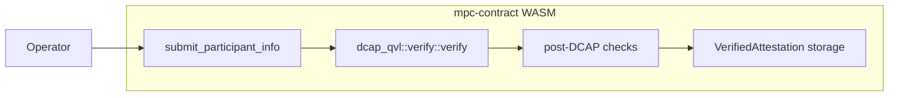
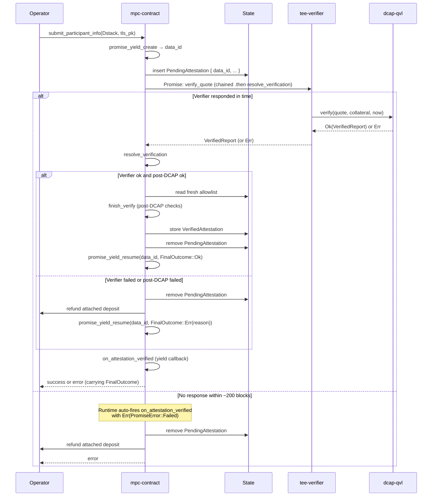
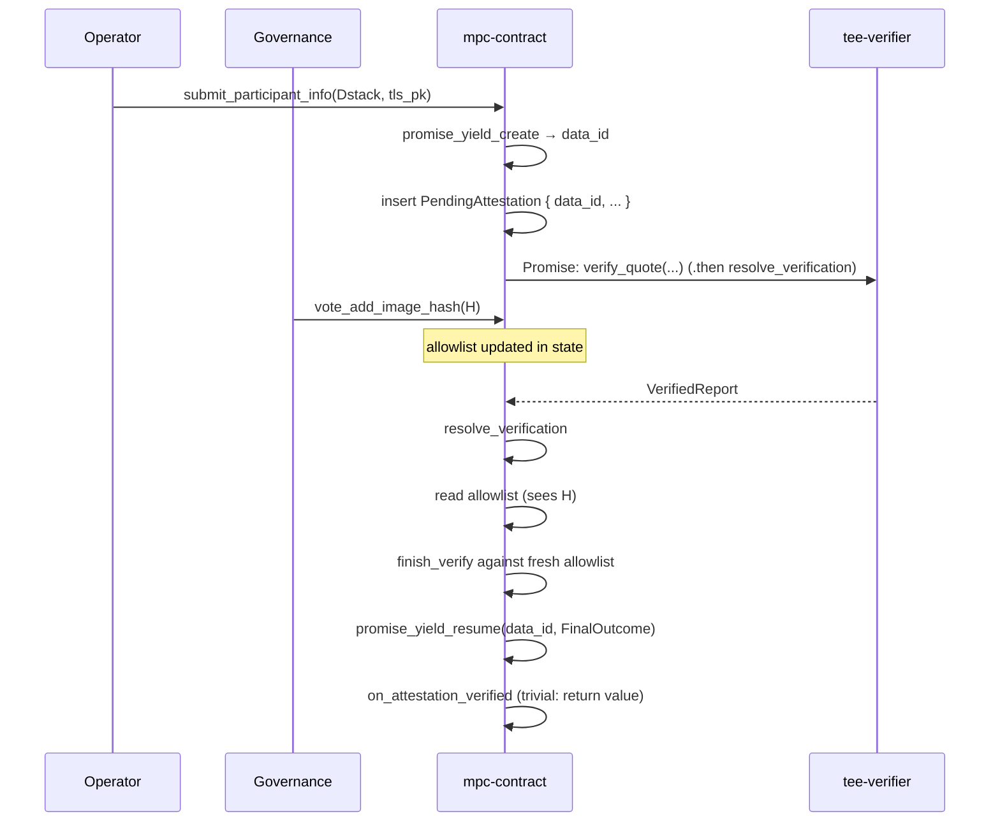
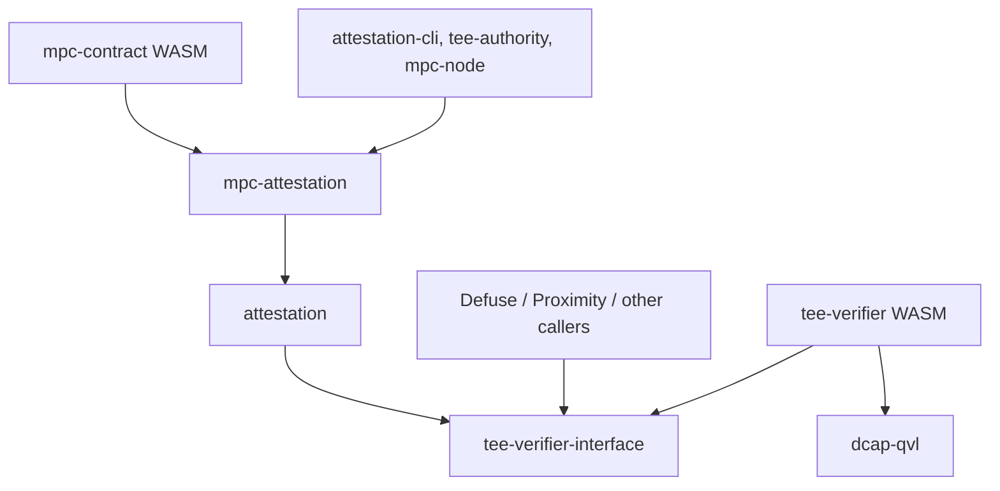
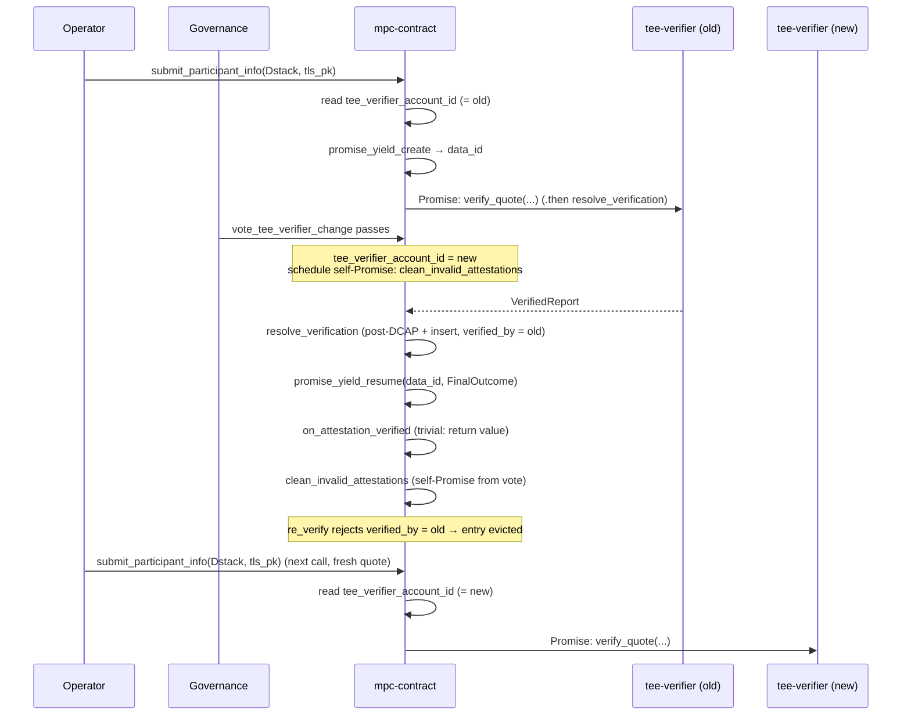

# Attestation Verifier Contract Breakout

This document outlines the design for moving on-chain TDX quote verification out of `mpc-contract`'s WASM into a standalone verifier contract.

It supersedes [#3160](https://github.com/near/mpc/pull/3160), which sketched a three-contract architecture (shared verifier + per-team policy contract + TEE-agnostic application contract) for Defuse, Proximity, and other teams. That direction was deferred: a shared policy contract presumes shared lifecycle conventions (the [launcher pattern][launcher-pattern] `mpc-contract` uses), and aligning the other teams on those conventions is a separate, longer [conversation][slack-launcher-discussion] that has not yet converged.

This document narrows the scope to the one piece that benefits every team — the DCAP verification primitive — and leaves policy in `mpc-contract`.

## Background

### Current State

[`mpc-contract`](../../crates/contract) accepts TEE attestations from participant nodes through [`submit_participant_info`](../../crates/contract/src/lib.rs). The method runs cryptographic Intel TDX quote verification synchronously inside the contract by calling `dcap_qvl::verify::verify`, which links `dcap-qvl` and its `ring` / `webpki` / `x509-cert` transitive dependencies into the contract's WASM.

The current flow, in one diagram:



### Issues with the current design

1. **MPC contract size pressure.** `dcap-qvl` and its transitive dependencies account for ~310 KB of the compiled `mpc-contract` WASM — none of which is MPC logic. The current WASM sits close to [NEP-509][nep-509]'s `max_transaction_size` of 1.5 MiB (1,572,864 bytes), the cap that gates contract deployment, leaving little headroom for the contract's own evolution.

   |                   | Bytes      | Delta from current `main` |
   |-------------------|------------|---------------------------|
   | `main` baseline   | 1,459,158  | —                         |
   | After this design | ~1,149,708 | **−309,450 (−21.2%)**     |

   Sizes after this design are measured on the PoC branch in [#3247](https://github.com/near/mpc/pull/3247), which strips `dcap-qvl` out of `mpc-contract`'s dependency graph.

2. **Non-reusable verification primitive.** Other NEAR teams (Proximity, Defuse, anyone building on Intel TDX) cannot call `dcap_qvl::verify` on-chain without re-linking the entire dependency tree into their own contract.

## Design goal

The primary goal is to bring the `mpc-contract` WASM safely under [NEP-509][nep-509]'s 1.5 MiB transaction size limit by extracting `dcap_qvl::verify` into a standalone, stateless `tee-verifier` contract.

A natural side effect: once the verifier is its own contract, other NEAR teams building on Intel TDX can call it without re-linking `dcap-qvl` themselves.

Looking further out, the same contract can be extended to cover other TEE flavors (Intel SGX, AMD SEV-SNP) behind the same interface, and — if and when other teams adopt the launcher pattern — broadened to host shared post-verification policy. For now its scope is deliberately narrow.

## Architecture Overview

DCAP quote verification moves into a standalone contract called `tee-verifier`. The wire format — a DTO-only crate carrying Borsh-serializable mirrors of the relevant `dcap-qvl` types and nothing else — lives in a dedicated crate called `tee-verifier-interface`. `mpc-contract` no longer links `dcap-qvl`; the verifier links it instead.


### Submission flow

`mpc-contract`'s [`submit_participant_info`][submit-participant-info] becomes asynchronous for Dstack attestations and uses the same yield-resume pattern already in place for `sign`, `request_app_private_key`, and `request_verify_foreign_tx`. The method registers a yielded promise via [`env::promise_yield_create`][promise-yield-create] (going through the contract's existing [`enqueue_yield_request`][enqueue-yield-request] helper), stashes the resulting `data_id` in `pending_attestations`, and fires a cross-contract call to `tee-verifier::verify_quote` whose own `.then` callback (`resolve_verification`) runs the post-DCAP checks (RTMR3 replay, app-compose validation, measurement allowlist matching, report-data binding) against the `VerifiedReport`, inserts into `stored_attestations` on success, schedules a deposit refund on failure, and calls [`env::promise_yield_resume`][promise-yield-resume] with a compact `FinalOutcome` (`Ok` / `Err(reason)`). The yield-callback (`on_attestation_verified`) shrinks to the same shape as the sign-request callback [`return_signature_and_clean_state_on_success`][sign-yield-callback]: on the `Ok(FinalOutcome)` branch it just returns the value to the caller (`resolve_verification` already cleared the pending entry), and on `Err(PromiseError::Failed)` — fired by the runtime ~200 blocks after submit if no resume has landed — it removes the pending entry and schedules a refund. Moving the heavy work into `resolve_verification` keeps the yield-callback trivial enough that an OOG inside it is implausible by gas budgeting, and an OOG inside `resolve_verification` rolls back its entire receipt atomically: no partial state commits, and the runtime's yield-timeout still fires the trivial callback for cleanup.

The post-DCAP policy inputs are the same fields `mpc-contract` already holds today — the allowed-image-hash list, the per-account TLS / account public-key binding, and the stored-attestation map. No new policy state is introduced; the only state addition is the `pending_attestations` map described below, which is bookkeeping for the in-flight yield.

The periodic re-validation path ([`re_verify`](../../crates/contract/src/tee/tee_state.rs)) does not call `dcap_qvl::verify` — it re-checks post-DCAP allowlist invariants against already-stored attestations — and is therefore unaffected by this design. It stays synchronous.



#### Caller-side impact

The only caller of `submit_participant_info` in production is `mpc-node`'s `periodic_attestation_submission` task, which resubmits on a 1-hour cadence and on attestation-removal events. It already polls contract state to confirm the attestation is actually stored, with exponential backoff (100 ms → 60 s, capped at 12 h). That polling-based success criterion is what makes the sync→async change transparent. Under yield-resume the returned `Promise` also resolves with the actual outcome (success or timeout-error) within ~200 blocks, so any future caller that wants to await the result synchronously can — without changing the contract.

#### Handling failures

The first thing `submit_participant_info` does is insert a `PendingAttestation` entry, and that entry has to come back out once verification finishes — successfully or not. If a failure leaves the entry behind, the submitter's account is wedged: every future `submit_participant_info` call panics on the "already pending" guard, and the deposit stays locked because the refund is part of the cleanup the contract never got around to.

That makes *where* the cleanup runs the central question, because NEAR offers two natural homes for "do something when the verifier responds" and they have very different failure modes.

A **`.then` callback** is a normal cross-contract callback chained onto the verifier's promise. The runtime runs it in a fresh receipt once the verifier's receipt finishes; if it panics or runs out of gas, that receipt rolls back atomically and the chain ends. Because the receipt is independent of whatever yield is parked in parallel, its failure has no special effect on the submitter's call — the submitter just keeps waiting on the yield.

A **yield-callback** is different. When `submit_participant_info` calls `promise_yield_create`, it asks the runtime to *park* the submitter's call so the contract can return its result later. The runtime fires the named callback exactly once per `data_id` — either when something calls `promise_yield_resume(data_id, payload)`, or after ~200 blocks of silence with `Err(PromiseError::Failed)`. That single firing's return value is what the submitter eventually receives. There is no second invocation: an OOG inside the yield-callback rolls back its whole receipt and drops whatever cleanup it was meant to do, with no automatic retry.

The asymmetry decides the design. The expensive work — post-DCAP checks, the `stored_attestations` insert, the refund-on-failure, the pending-entry removal, the `promise_yield_resume` call — lives in the `.then` bridge `resolve_verification`. If it aborts mid-flight, the entire receipt rolls back atomically (including the resume), so the yield stays parked and the runtime's 200-block timeout still fires the yield-callback for cleanup — same recovery as "verifier never responded." The yield-callback `on_attestation_verified` is intentionally tiny: on resume, return the value to the caller; on timeout, remove the pending entry and schedule a refund.

Walking every path the system can take:

- `resolve_verification` finishes normally → it cleaned up before resuming, caller receives the outcome.
- `resolve_verification` aborts → timeout fires, yield-callback cleans up.
- `resolve_verification` never runs (verifier silent) → timeout fires, yield-callback cleans up.
- Yield-callback itself OOGs → genuine orphan. Its body is one `LookupMap::remove` plus one Promise schedule, small enough that an out-of-gas failure is implausible with a sensible gas budget.

This isn't a novel pattern in this codebase: `sign`, `request_app_private_key`, and `request_verify_foreign_tx` already use the same split. The heavy work and the `promise_yield_resume` call live in [`pending_requests::resolve_yields_for`][pending-requests-mod] (invoked from `respond`, `respond_ckd`, and `respond_verify_foreign_tx`), and [`return_signature_and_clean_state_on_success`][sign-yield-callback] is a tiny yield-callback that just routes the outcome back to the caller and handles the no-response timeout. The attestation flow inherits the same orphan-proof argument: heavy work in a safely-recoverable receipt, cleanup in a callback small enough that gas budgeting makes its failure implausible.

### Contract state changes

The callback runs in a later block than `submit_participant_info`, as an independent contract invocation. Anything the callback still needs must be stashed in contract storage, in a new field:

```rust
pending_attestations: LookupMap<AccountId, PendingAttestation>
```

This map mirrors the other pending-request maps in `mpc-contract` ([`pending_signature_requests`][pending-requests-mod], `pending_ckd_requests`, `pending_verify_foreign_tx_requests`), but stores a single `PendingAttestation` per `AccountId` rather than a `Vec<YieldIndex>`: attestation submissions are 1-per-account.

Each [`PendingAttestation`](#mpc-contractsubmit_participant_info) holds:

- **The submitter's `Attestation::Dstack` payload** — the RTMR3 event log, app-compose, and report-data the post-DCAP checks consume.
- **The submitter's TLS public key** — the callback hashes it with the submitter's account public key and compares to the quote's `report_data` field, proving the enclave produced the quote for this specific submitter.
- **The attached deposit** — covers storage staking on success, refunded to the signer of the original `submit_participant_info` transaction on failure. `env::attached_deposit()` is not visible from the callback receipt, so the value is stashed at submit time and the recipient `AccountId` is the same one used to key the entry (set by `Self::assert_caller_is_signer()`).
- **`data_id: CryptoHash`** — the yield handle returned by [`env::promise_yield_create`][promise-yield-create]. The intermediate `.then` callback (`resolve_verification`) reads this back to call [`env::promise_yield_resume`][promise-yield-resume] with a `FinalOutcome` after the post-DCAP checks have run.

Entries are removed by `resolve_verification` on every "verifier responded" branch (success, verifier err, post-DCAP err), and by `on_attestation_verified` on the timeout branch only.

Notably absent from `PendingAttestation`: the **post-DCAP policy state** — allowed MPC image hashes, allowed launcher compose hashes, and accepted measurements. `resolve_verification` re-reads all of them from contract state, so any governance vote that adds or removes an entry mid-flight applies to verifications it overlaps. Snapshotting at request time would freeze each submission against stale policy — wrong default for a security control, where removing a compromised hash should take effect immediately.



## Crate layout

Two new crates, plus an existing one that picks up a new dependency:

- **`tee-verifier-interface`** (new). Wire DTOs only — `QuoteBytes`, `Collateral`, `VerifiedReport`, and the nested report / TCB-status types — as Borsh-serializable mirrors of the corresponding `dcap-qvl` types. No `dcap-qvl` dependency, no MPC-specific types. This is what every caller of the verifier links against.
- **`tee-verifier`** (new). The verifier contract WASM. Exposes a single method, `verify_quote`, which wraps `dcap_qvl::verify::verify`.
- **`attestation`** (existing). TDX domain types and the post-DCAP verification logic. This is the crate that currently holds the `dcap-qvl` dependency on `main` — `Collateral` is a re-export of `dcap_qvl::QuoteCollateralV3`, the post-DCAP helpers take `dcap_qvl::verify::VerifiedReport` and `dcap_qvl::quote::TDReport10` as arguments, and `Attestation::verify` calls `dcap_qvl::verify::verify`. Under this design those references are replaced with the Borsh-mirror equivalents from `tee-verifier-interface`, `Collateral` becomes a real DTO, and `Attestation::verify` moves out to an off-chain helper. After that `attestation/Cargo.toml` no longer lists `dcap-qvl`.
- **`mpc-attestation`** (existing). MPC-specific framing on top of `attestation`: the `Attestation { Dstack, Mock }` enum, the `(tls_pk, account_pk)` binding, mock attestation verification. On `main` this crate has no `dcap-qvl` in its `[dependencies]` — it inherits the dep transitively through `attestation`, so once `attestation` is cleaned up `mpc-attestation` is dcap-qvl-free without any of its own code changing. `mpc-contract` and `mpc-node` keep depending on it exactly as they do today.

The resulting Cargo dependency graph (arrows are `[dependencies]` edges — `tee-verifier` implements the wire format defined in `tee-verifier-interface`, see the bullet above):



## Governance and upgrades

The verifier contract is stateless and has no admin methods or on-chain configuration. For security, every verifier instance is deployed to a locked account — a NEAR account with no full-access keys, so the protocol refuses any future redeploy. The deployed bytes are frozen for the lifetime of the account; there is no in-place upgrade path. Changing the verifier means voting in a different, separately-deployed instance at a new locked account. The only governance decision is on `mpc-contract`, choosing which instance to trust through a vote of active MPC participants. External callers (Defuse, Proximity) run their own equivalent vote on their own contract.

The expected trigger for a verifier rotation is a discovered bug in the existing verifier — for example, a DCAP signature-chain flaw that let a non-genuine TEE submit an attestation the contract then stored. Voting for a patched verifier has to do more than route future submissions in that case: it has to invalidate the attestations the broken verifier already accepted. Without that, an attacker holding a wrongly-accepted entry has no reason to act — they skip `mpc-node`'s [`periodic_attestation_submission`][periodic-attestation-submission] 1-hour resubmit cadence and ride the entry out for up to 7 days, since [`re_verify`][re-verify] only re-checks post-DCAP allowlist invariants and never re-runs DCAP. The original quote and collateral aren't kept either, so a patched verifier has nothing to re-check against. The same property exists on `main` today (a `dcap-qvl` upgrade is the same shape, just as a redeploy rather than a vote), but once rotation is a governance event rather than a redeploy, the gap might be more visible.

The fix has two parts. First, every `VerifiedAttestation` records which verifier produced its verdict, in a new `verified_by: AccountId` field. `resolve_verification` stamps it from [`env::predecessor_account_id()`][predecessor-account-id] — the verifier that actually returned the `VerifiedReport` — rather than from `tee_verifier_account_id` in state. That choice is what makes the in-flight-rotation race come out correctly: a verification scheduled against the old verifier that resolves *after* the rotation vote crosses threshold gets stamped as belonging to the old verifier, as it should. `re_verify` then adds one check at the top: `verified_by` must equal the contract's current `tee_verifier_account_id`. After a rotation, every entry the old verifier produced fails this predicate.

The predicate alone isn't enough: stored entries are only re-checked when something explicitly runs `re_verify`, and the signing-path gate [`is_caller_an_attested_participant`][is-caller-attested] is a presence check (`stored_attestations.get(&tls_pk)`), not a re-verification. So `vote_tee_verifier_change`'s threshold-crossing handler also schedules a self-`Promise` calling [`clean_invalid_attestations`][clean-invalid-attestations] in a subsequent receipt — the same mechanism used today to schedule [`clean_foreign_chain_data`][clean-foreign-chain-data] after a resharing. Stale entries are gone within a block or two of the vote landing, and honest nodes pick up the removal via `mpc-node`'s [`monitor_attestation_removal`][monitor-attestation-removal] task — which watches the contract's TEE-accounts list and resubmits the moment its own entry disappears — so honest recovery happens within seconds. The 1-hour periodic resubmission becomes a worst-case fallback, not the primary recovery path.

The cost is a brief service-availability gap: right after the sweep, `verify_tee` flips [`accept_requests = false`][accept-requests-flag] until enough honest nodes have re-attested through the new verifier. The contract should refuse new requests until it has fresh verdicts from a verifier the protocol still trusts. Note also what this mechanism does *not* do: it stops future trust in entries the old verifier produced, but does not undo whatever MPC operations a node holding such an entry already participated in. Recovering from past damage is out of scope for this document.

Verifier rotation is also not the only response to a compromise. If the bad behavior can be pinned to a specific image or launcher hash rather than the verifier itself, operators can leave the verifier alone and drop the affected hash from the post-DCAP allowlist; any subsequent [`verify_tee`][verify-tee] or [`clean_invalid_attestations`][clean-invalid-attestations] sweep evicts the matching entries through the existing allowlist-mismatch path. This route predates the design and remains available.

### Requirements on the verifier account

A trusted verifier account must not be replaceable by a malicious stub that returns `Ok(VerifiedReport)` for any input. Two checkable conditions prevent it:

1. **The right code is deployed.** The hash of the contract code currently deployed at the account matches the expected hash for that verifier release.
2. **That code can never be replaced.** The account has no full-access keys.

The verifier can be a regular contract or a NEP-591 global contract — both satisfy the requirements once locked. Globals have one small audit win — `view_account(account_id).contract` returns the protocol's own `CodeHash` directly, no client-side hashing — and enable cross-shard WASM dedup if other teams adopt the same hash.

### Auditing a candidate verifier

Before any operator votes yes on a candidate `account_id`, they need to confirm that the right code is deployed there and that the code can never be replaced. `mpc-contract` cannot verify either claim itself — a NEAR contract has no way to read another account's code hash or access-key list — so the audit is the voter's responsibility, not the contract's. The same four checks apply whether the candidate is a regular contract or a NEP-591 global:

1. Reproducibly build the verifier source → `H_source`.
2. Fetch `H_deployed`: `view_account(account_id).contract` for a global (returns `CodeHash` directly), or `view_code(account_id)` + local hash for a plain contract.
3. `view_access_key_list(account_id)` → empty.
4. `H_source == H_deployed`.

In practice the MPC team publishes `H_source` alongside the on-chain vote to change the trusted verifier. Operators are free to rebuild from source and verify the hash themselves, but the common path is "trust the published hash".

A CLI helper that runs all four deterministically (for example `attestation-cli audit-verifier <account-id>`) is a potential follow-up.

## API Proposal

### The Verifier Contract

The verifier exposes exactly one method:

```rust
#[near]
impl TeeVerifier {
    /// Verify a TDX quote against Intel collateral.
    ///
    /// Calls `dcap_qvl::verify::verify` with the current block timestamp and
    /// returns the parsed `VerifiedReport` on success, or a structured
    /// `VerifierError` on failure.
    pub fn verify_quote(
        &self,
        quote: QuoteBytes,
        collateral: Collateral,
    ) -> Result<VerifiedReport, VerifierError>;
}
```

The wire DTOs (`QuoteBytes`, `Collateral`, `VerifiedReport`, `VerifierError`, and the nested report types) live in the DTO-only `tee-verifier-interface` crate so callers depend on the same definitions. They are field-for-field Borsh mirrors of the corresponding `dcap_qvl` types. `VerifierError` has one variant per `dcap_qvl::verify::verify` failure category (quote-malformed, collateral-expired, tcb-revoked, signature-mismatch, etc.), plus a fallback `Other(String)` for upstream errors that don't fit cleanly.

### Voting on the trusted verifier in `mpc-contract`

The voting flow lives on `mpc-contract`, not on the verifier itself. It reuses `mpc-contract`'s existing generic [`Votes<V>`](../../crates/contract/src/primitives/votes.rs) primitive.

The proposal payload is the pair `(candidate_account_id, expected_code_hash)`. `candidate_account_id` is the address whose `verify_quote` method `mpc-contract` will invoke on every subsequent `submit_participant_info` call once the vote passes; that's all the contract actually consumes from the payload. `expected_code_hash` is included to make every voter explicitly commit to the hash they checked off-chain: without it, two voters could converge on the same `account_id` while disagreeing about what code that account runs. Both fields feed `ProposalHashEncoding`, so two voters submitting the same `account_id` with different hashes land in different vote buckets and neither reaches threshold on its own — that's how the contract enforces "everyone who voted yes endorsed the same code," without needing a separate validation step. When the winning bucket crosses threshold the contract clears *all* pending proposals for that `candidate_account_id` (including losing-hash buckets).

```rust
/// Proposal payload. Two voters arrive at the same `ProposalHash` iff they
/// borsh-serialize the same `(candidate_account_id, expected_code_hash)`.
#[near(serializers = [borsh])]
pub struct VerifierChangeProposal {
    pub candidate_account_id: AccountId,
    pub expected_code_hash: CryptoHash,
}

impl ProposalHashEncoding for VerifierChangeProposal {
    fn bytes_for_hash(&self) -> Vec<u8> {
        borsh::to_vec(self).expect("borsh serialization must succeed")
    }
}

impl MpcContract {
    /// Vote for `(candidate_account_id, expected_code_hash)`. Re-voting from
    /// the same caller replaces the previous vote; see
    /// `withdraw_tee_verifier_vote` to withdraw without replacing. When the
    /// threshold is reached, `tee_verifier_account_id` is updated, the
    /// proposal is cleared, and a self-`Promise` is scheduled to call
    /// `clean_invalid_attestations` so every entry stamped with the old
    /// verifier's `AccountId` is evicted in a subsequent receipt. Honest
    /// nodes detect the removal via `monitor_attestation_removal` and
    /// resubmit through the new verifier without waiting for the 1-hour
    /// periodic cycle.
    pub fn vote_tee_verifier_change(
        &mut self,
        candidate_account_id: AccountId,
        expected_code_hash: CryptoHash,
    );

    /// Withdraw the caller's current vote on any pending verifier-change
    /// proposal, if they have one. No-op if the caller has not voted.
    pub fn withdraw_tee_verifier_vote(&mut self);
}
```

The contract gains two new state fields:

```rust
pub struct MpcContract {
    // ... existing fields ...

    /// The locked account `mpc-contract` currently trusts as the verifier.
    /// `submit_participant_info` calls `verify_quote` on this account.
    /// Mutated only by the threshold-crossing vote above, which also
    /// schedules a self-`Promise` calling `clean_invalid_attestations`
    /// to evict every entry whose `verified_by` no longer matches.
    tee_verifier_account_id: AccountId,

    /// Pending votes for changing `tee_verifier_account_id`. Each voter is an
    /// active MPC participant; each proposal is hashed from
    /// `(candidate_account_id, expected_code_hash)`.
    tee_verifier_votes: Votes<AuthenticatedParticipantId>,
}
```

After a resharing changes the participant set, votes from accounts that lost participant status are swept by calling `tee_verifier_votes.retain(new_participants)`. This is invoked by a `#[private]` cleanup method the contract schedules as a self-Promise once resharing completes — same mechanism as the existing [`clean_foreign_chain_data`](../../crates/contract/src/lib.rs) does for `ProviderVotes`.

There's a race worth thinking through, and the behavior is intentional and safe: a `submit_participant_info` call schedules its cross-contract call to the current verifier, and then — before that call executes — a `vote_tee_verifier_change` passes and updates `tee_verifier_account_id` to a different address. The in-flight verification doesn't suddenly redirect to the new verifier, because the target account of a cross-contract call is fixed when the call is scheduled, not re-read when it executes. The in-flight call still goes to the old verifier, completes normally, and `resolve_verification` in `mpc-contract` runs the post-DCAP checks and inserts the entry as usual — but it stamps `verified_by` with the predecessor (the *old* verifier), so the rotation-handler's self-scheduled sweep evicts the entry along with every other old-verifier verdict. The submitter's node then sees its entry disappear via `monitor_attestation_removal` and resubmits through the new verifier within seconds. Letting the old verifier finish therefore costs nothing security-wise: the entry it produced is gone before the next signing operation that would consult it, and the submitter recovers automatically.



### `mpc-contract::submit_participant_info`

The method splits across three receipts joined by yield-resume — see [§Submission flow](#submission-flow) above for the architecture. The return type is [`PromiseOrValue<()>`](https://docs.rs/near-sdk/5.26.1/near_sdk/enum.PromiseOrValue.html), `near-sdk`'s "sometimes synchronous, sometimes a Promise chain" type: `Mock` attestations return `Value(())` immediately, and `Dstack` attestations return the yielded `Promise` from [`env::promise_yield_create`][promise-yield-create], which the runtime resolves either when `resolve_verification` calls [`env::promise_yield_resume`][promise-yield-resume] or after ~200 blocks of silence. The post-DCAP checks and the `stored_attestations` insert live in `resolve_verification`, not in the yield-callback — that's what keeps `on_attestation_verified` trivial enough to match the sign-request callback [`return_signature_and_clean_state_on_success`][sign-yield-callback]. Draft implementation:

```rust
impl MpcContract {
    pub fn submit_participant_info(
        &mut self,
        attestation: Attestation,
        tls_pk: Ed25519PublicKey,
    ) -> PromiseOrValue<()> {
        // Existing convention: caller must be the signer of this transaction,
        // not a relayer or proxy.
        let account_id = Self::assert_caller_is_signer();
        match attestation {
            // Unchanged from today.
            Attestation::Mock(mock) => {
                self.verify_mock_synchronously(mock, tls_pk);
                PromiseOrValue::Value(())
            }
            // Dstack: yield-resume.
            Attestation::Dstack(dstack) => {
                // One in-flight verification per AccountId. A duplicate submit
                // before the previous one finishes (verifier response or
                // runtime timeout) is rejected outright — same shape as
                // duplicate sign requests.
                if self.pending_attestations.contains_key(&account_id) {
                    env::panic_str("verification already pending");
                }

                let (quote, collateral) = extract_dcap_inputs(&dstack);
                let attached_deposit = env::attached_deposit();

                // Reuses the existing `enqueue_yield_request` helper that
                // wraps `env::promise_yield_create`. The helper allocates
                // `data_id`, registers `on_attestation_verified` as the
                // yield-callback, and surfaces `data_id` via the `insert`
                // closure so we can stash it together with the rest of the
                // `PendingAttestation` fields.
                self.enqueue_yield_request(
                    "on_attestation_verified",
                    borsh::to_vec(&account_id).unwrap(),
                    Gas::from_tgas(YIELD_CALLBACK_GAS_TGAS),
                    |this, data_id| {
                        this.pending_attestations.insert(
                            account_id.clone(),
                            PendingAttestation {
                                dstack,
                                tls_pk,
                                attached_deposit,
                                data_id,
                            },
                        );
                    },
                );

                // Cross-contract call to the verifier. Its `.then` callback
                // (`resolve_verification`) is the bridge that turns the
                // verifier's response into a `promise_yield_resume` on the
                // yield this method registered above.
                Promise::new(self.tee_verifier_account_id.clone())
                    .function_call(
                        "verify_quote".into(),
                        borsh::to_vec(&(quote, collateral)).unwrap(),
                        NearToken::from_yoctonear(0),
                        Gas::from_tgas(VERIFIER_GAS_TGAS),
                    )
                    .then(
                        Self::ext(env::current_account_id())
                            .with_static_gas(Gas::from_tgas(RESOLVE_GAS_TGAS))
                            .resolve_verification(account_id),
                    );

                // The yield handle was returned by `enqueue_yield_request`
                // via `env::promise_return`, so the caller's `Promise`
                // resolves with whatever the yield-callback returns.
                PromiseOrValue::Value(())
            }
        }
    }

    /// `.then` bridge between the verifier's cross-contract call and the
    /// yield this submission registered. Owns all "verifier responded"
    /// outcomes: runs the post-DCAP checks against fresh policy state,
    /// inserts into `stored_attestations` on success, schedules a deposit
    /// refund on failure, removes the pending entry, and calls
    /// `promise_yield_resume(data_id, FinalOutcome)` as the LAST step of
    /// the receipt. State mutations in this receipt are visible to the
    /// yield-callback that fires next; if any line below `promise_yield_resume`
    /// panicked or OOG'd, the entire receipt would roll back atomically
    /// (no partial state commits) and the runtime's ~200-block yield-timeout
    /// would still fire `on_attestation_verified` with
    /// `Err(PromiseError::Failed)` for cleanup.
    ///
    /// Same architectural shape as [`pending_requests::resolve_yields_for`][pending-requests-mod]
    /// in the sign-request flow: the response-side function owns the state
    /// mutation and the `promise_yield_resume` call; the yield-callback is
    /// kept trivial.
    #[private]
    pub fn resolve_verification(
        &mut self,
        account_id: AccountId,
        #[callback_result] result: Result<Result<VerifiedReport, VerifierError>, PromiseError>,
    ) {
        // Verifier-account-gone case: do nothing. The runtime's yield-timeout
        // will fire `on_attestation_verified` with `Err(PromiseError::Failed)`
        // and clean up the pending entry there. We must not call
        // `promise_yield_resume` here, or we'd race the timeout for ownership
        // of the cleanup path.
        let final_outcome = match result {
            Err(promise_err) => {
                log!("verifier promise failed for {account_id}: {promise_err:?}");
                return;
            }
            Ok(Err(verifier_err)) => {
                log!("verifier rejected quote for {account_id}: {verifier_err:?}");
                FinalOutcome::Err(format!("verifier rejected: {verifier_err:?}"))
            }
            Ok(Ok(report)) => {
                let pending = self.pending_attestations.get(&account_id).expect(
                    "PendingAttestation must exist while resolve_verification holds the yield",
                );
                // Post-DCAP checks operate on the verified report plus state held
                // here. The allowlist is read fresh — governance votes mid-flight
                // take effect.
                match finish_verify(pending, &report, self.allowlist_fresh()) {
                    Ok(()) => {
                        // Stamp the entry with the verifier that actually produced
                        // the verdict — i.e. the predecessor of this `.then`
                        // receipt, NOT `self.tee_verifier_account_id`. If a vote
                        // rotated the trusted verifier mid-flight, the entry must
                        // record the *old* address so the next sweep (scheduled by
                        // the rotation handler) evicts it.
                        let verified_by = env::predecessor_account_id();
                        self.tee_state.stored_attestations.insert(
                            pending.tls_pk.clone(),
                            VerifiedAttestation::from((pending.clone(), report, verified_by)),
                        );
                        FinalOutcome::Ok
                    }
                    Err(reason) => {
                        log!("post-DCAP check failed for {account_id}: {reason}");
                        FinalOutcome::Err(format!("post-DCAP: {reason}"))
                    }
                }
            }
        };

        let pending = self
            .pending_attestations
            .remove(&account_id)
            .expect("PendingAttestation must exist while resolve_verification holds the yield");
        if matches!(final_outcome, FinalOutcome::Err(_)) {
            refund_deposit(&account_id, pending.attached_deposit);
        }
        // `promise_yield_resume` must be the LAST host call in this receipt:
        // anything after it could panic and roll back the state mutations above.
        env::promise_yield_resume(&pending.data_id, borsh::to_vec(&final_outcome).unwrap());
    }

    /// Yield-callback. Same shape as the sign-request callback
    /// [`return_signature_and_clean_state_on_success`][sign-yield-callback]: the
    /// success and verifier-responded-error branches were already finalized by
    /// `resolve_verification` (which removed the pending entry and scheduled any
    /// refund before calling `promise_yield_resume`), so this body just returns
    /// the outcome to the caller.
    ///
    /// The only branch that does real work is `Err(PromiseError::Failed)`, fired
    /// by the runtime ~200 blocks after submit if no `promise_yield_resume` has
    /// landed (verifier account gone, OOM, never responded, or `resolve_verification`
    /// itself rolled back). On that branch the pending entry is still present, so
    /// it removes the entry and schedules a deposit refund.
    #[private]
    pub fn on_attestation_verified(
        &mut self,
        account_id: AccountId,
        #[callback_result] result: Result<FinalOutcome, PromiseError>,
    ) -> Result<(), String> {
        match result {
            Ok(FinalOutcome::Ok) => Ok(()),
            Ok(FinalOutcome::Err(reason)) => Err(reason),
            Err(_promise_err) => {
                if let Some(pending) = self.pending_attestations.remove(&account_id) {
                    refund_deposit(&account_id, pending.attached_deposit);
                    log!("yield timeout for {account_id}: refunded and cleaned up");
                }
                Err("verifier did not respond within yield-resume window".to_string())
            }
        }
    }
}

#[derive(BorshSerialize, BorshDeserialize)]
pub enum FinalOutcome {
    Ok,
    Err(String),
}
```

`VERIFIER_GAS_TGAS`, `RESOLVE_GAS_TGAS`, and `YIELD_CALLBACK_GAS_TGAS` are placeholders until benchmarked. The verifier-side cost is dominated by ECDSA verifications and X.509-chain walking inside `dcap_qvl::verify::verify`. The bulk of the contract-side post-DCAP work — RTMR3 replay, app-compose validation, allowlist matching, report-data binding, plus the `stored_attestations.insert` — runs inside `resolve_verification`, so `RESOLVE_GAS_TGAS` gets the largest budget. `YIELD_CALLBACK_GAS_TGAS` can be conservatively small (on the order of 10 TGas with comfortable headroom): the yield-callback only does a `LookupMap::remove` and schedules a `Promise` on the timeout branch, and just returns a value on the resume branch.

The contract gains the following state fields:

```rust
pub struct MpcContract {
    // ... existing fields, including tee_verifier_account_id and
    // tee_verifier_votes from §Voting on the trusted verifier ...
    pending_attestations: LookupMap<AccountId, PendingAttestation>,
}

pub struct PendingAttestation {
    pub dstack: DstackAttestation,
    pub tls_pk: Ed25519PublicKey,
    pub attached_deposit: NearToken,
    pub data_id: CryptoHash,
}
```

## Testing

The yield-resume split adds four branches the synchronous version never had: three of them live in `resolve_verification` (verifier returned `Err`, verifier returned `Ok` but post-DCAP failed, verifier returned `Ok` and post-DCAP passed) and one lives in `on_attestation_verified` (the yield-resume timeout fired with `Err(PromiseError::Failed)` — covering both verifier infrastructure failure and a `resolve_verification` receipt that rolled back). Each one needs test coverage, and exercising the failure branches requires the verifier to return specific responses on demand — or, for the timeout branch, the test driver to advance the chain past the yield-resume window without resuming.

The verifier-rotation eviction path adds three more cases. First, `re_verify` must reject an entry whose `verified_by` does not equal the current `tee_verifier_account_id` even when every post-DCAP allowlist invariant still holds. Second, `vote_tee_verifier_change` crossing threshold must schedule the `clean_invalid_attestations` self-`Promise` and that sweep must evict every entry stamped with the old verifier. Third, the in-flight-rotation race: a verification scheduled against the old verifier that resolves *after* the vote crosses threshold must end up stamped with the old verifier (from `env::predecessor_account_id()`) and be evicted by the scheduled sweep.

To make that practical, we introduce a stub `tee-verifier` crate: same `tee-verifier-interface` DTOs as the real verifier, but `verify_quote` returns whatever `Ok(VerifiedReport)` or `Err(VerifierError)` the test asks for. Sandbox tests deploy the stub like any other verifier candidate — lock its account, then call `propose_tee_verifier_change` + `vote_tee_verifier_change` from the test setup to point `mpc-contract` at the stub. This runs the same code path as production; nothing in `mpc-contract` knows or cares whether it's talking to the real verifier or the stub.

E2E tests in `crates/e2e-tests` deploy either the real `tee-verifier` (when the test wants real `dcap-qvl` against a fixture quote) or the stub (for everything else). The change is one extra `deploy` call in the setup helper.

`Attestation::Mock` stays in this iteration. The stub eventually supersedes it — both let tests bypass real `dcap-qvl` — but removing `Mock` is a separate cleanup, not in scope here.

[nep-509]: https://github.com/near/NEPs/blob/master/neps/nep-0509.md
[re-verify]: https://github.com/near/mpc/blob/5e47bfe93b398cb2343681fa2c0f2691d02c7285/crates/mpc-attestation/src/attestation.rs#L93
[periodic-attestation-submission]: https://github.com/near/mpc/blob/5e47bfe93b398cb2343681fa2c0f2691d02c7285/crates/node/src/tee/remote_attestation.rs#L140
[attestation-resubmission-interval]: https://github.com/near/mpc/blob/5e47bfe93b398cb2343681fa2c0f2691d02c7285/crates/node/src/run.rs#L43
[attestation-attempts-metric]: https://github.com/near/mpc/blob/5e47bfe93b398cb2343681fa2c0f2691d02c7285/crates/node/src/metrics.rs#L364
[verify-tee]: https://github.com/near/mpc/blob/5e47bfe93b398cb2343681fa2c0f2691d02c7285/crates/contract/src/lib.rs#L1543
[clean-invalid-attestations]: https://github.com/near/mpc/blob/5e47bfe93b398cb2343681fa2c0f2691d02c7285/crates/contract/src/lib.rs#L1646
[clean-foreign-chain-data]: https://github.com/near/mpc/blob/5e47bfe93b398cb2343681fa2c0f2691d02c7285/crates/contract/src/lib.rs#L1669
[accept-requests-flag]: https://github.com/near/mpc/blob/5e47bfe93b398cb2343681fa2c0f2691d02c7285/crates/contract/src/lib.rs#L1573
[is-caller-attested]: https://github.com/near/mpc/blob/5e47bfe93b398cb2343681fa2c0f2691d02c7285/crates/contract/src/tee/tee_state.rs#L449
[monitor-attestation-removal]: https://github.com/near/mpc/blob/5e47bfe93b398cb2343681fa2c0f2691d02c7285/crates/node/src/tee/remote_attestation.rs#L209
[predecessor-account-id]: https://docs.rs/near-sdk/5.26.1/near_sdk/env/fn.predecessor_account_id.html
[submit-participant-info]: https://github.com/near/mpc/blob/efe49230bb66854c55bba080e7610e42f9221506/crates/contract/src/lib.rs#L754-L782
[launcher-pattern]: https://github.com/near/mpc/blob/efe49230bb66854c55bba080e7610e42f9221506/docs/tee-lifecycle.md#upgrade
[slack-launcher-discussion]: https://nearone.slack.com/archives/C0B12RKBSAV/p1777897902903889
[promise-yield-create]: https://docs.rs/near-sdk/5.26.1/near_sdk/env/fn.promise_yield_create.html
[promise-yield-resume]: https://docs.rs/near-sdk/5.26.1/near_sdk/env/fn.promise_yield_resume.html
[enqueue-yield-request]: https://github.com/near/mpc/blob/5e47bfe93b398cb2343681fa2c0f2691d02c7285/crates/contract/src/lib.rs#L301-L323
[pending-requests-mod]: https://github.com/near/mpc/blob/5e47bfe93b398cb2343681fa2c0f2691d02c7285/crates/contract/src/pending_requests.rs
[sign-yield-callback]: https://github.com/near/mpc/blob/5e47bfe93b398cb2343681fa2c0f2691d02c7285/crates/contract/src/lib.rs#L1999-L2023
