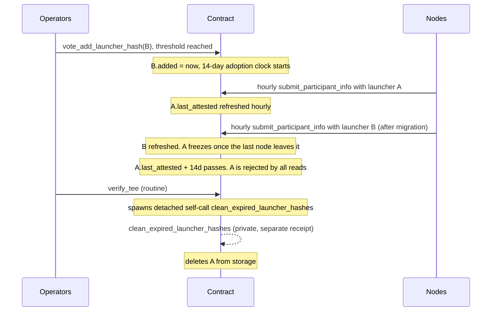

# Auto-Removal of Unused Launcher Image Hashes

**Status:** Implemented — see [#3564](https://github.com/near/mpc/pull/3564)
**Issue:** [#3381](https://github.com/near/mpc/issues/3381)
**Related:** [Securing MPC with TEE](../securing-mpc-with-tee-design-doc.md), [TEE Lifecycle](../tee-lifecycle.md)

## Problem

`allowed_launcher_image_hashes` accumulates entries forever; removal requires a
**unanimous** vote (`vote_remove_launcher_hash`). MPC Docker image hashes, by
contrast, auto-expire 7 days after a newer image lands. In practice launcher
hashes pile up — only the newest is typically in use — with no way to shed the
old ones short of coordinating a unanimous vote.

The insight: **not using a launcher is itself a vote.** Every node already
resubmits an attestation hourly (`submit_participant_info`), proving which
launcher it runs. The contract can observe disuse and evict stale hashes
without any vote.

## Proposal

```rust
pub struct AllowedLauncherImage {
    launcher_hash: LauncherImageHash,
    compose_hashes: Vec<LauncherDockerComposeHash>,
    added: Timestamp,          // NEW: when (last) voted in
    last_attested: Timestamp,  // NEW: last attestation by a *current participant* using this launcher
}
```

An entry is **expired** when `max(added, last_attested) + TTL < now`.
TTL is a new config field `launcher_hash_unused_ttl_seconds`, default **14 days**.
Config validation enforces `launcher_hash_unused_ttl_seconds >=
mpc_attestation::attestation::DEFAULT_EXPIRATION_DURATION_SECONDS` (the
attestation validity window, currently 1 day) — see Safety invariants. Note
this is the *attestation validity* constant, not
`DEFAULT_TEE_UPGRADE_DEADLINE_DURATION_SECONDS` (the MPC docker-image grace
period, 7 days).

Three parts:

1. **Refresh on use** — after a successful verify in `submit_participant_info`
   (hourly per node), the contract sets `last_attested = now` on the entry
   owning the validated compose hash. No node-side changes.
   **Only a current participant's submission refreshes the timestamp.**
   `submit_participant_info` is also callable by prospective (non-participant)
   nodes; letting them refresh would let any outside node keep a stale launcher
   alive indefinitely, so the refresh is gated on the caller being a current
   participant.
2. **Read-time filtering** — all reads of the allowed set (verify, re-verify,
   views) skip expired entries, so an expired hash is rejected the moment its
   TTL lapses. If *all* entries are expired, the newest is still returned
   (disaster-recovery fallback, mirrors `AllowedDockerImageHashes`).
3. **Deferred sweep** — `verify_tee` spawns a detached self-call
   (`Promise::new(env::current_account_id()).function_call(CLEAN_EXPIRED_LAUNCHER_HASHES, ...).detach()`)
   to a new `#[private]` `clean_expired_launcher_hashes` method, which deletes
   expired entries from storage (keeping at least the newest). The method is
   `#[private]`, so only the contract's own self-call can invoke it — **no new
   public API**. Running it in a detached promise means a failed or
   out-of-gas sweep can never fail the host `verify_tee` transaction; expiry is
   already enforced by (2), so the sweep is pure housekeeping and is safe to
   fail (it simply retries on the next `verify_tee`). Gas is reserved via a new
   config field `clean_expired_launcher_hashes_tera_gas`, mirroring the existing
   `clean_tee_status_tera_gas` etc. used by the post-resharing cleanups in
   `vote_reshared`.

Counting from `added` means a hash voted in but **never adopted** (e.g. a
newly voted launcher image no node ever migrated to) also expires after one
TTL window. Recovery: `vote_add_launcher_hash` for an already-present entry
resets its `added` timestamp (threshold vote, not unanimity).

### Safety invariants

- A hash backing a **valid participant attestation is never expired**: a
  current participant resubmits hourly, so its valid attestation (at most
  `DEFAULT_EXPIRATION_DURATION_SECONDS`, currently 1 day, old) refreshed the
  entry that recently, and `last_attested + TTL >= now` holds whenever
  `TTL >= DEFAULT_EXPIRATION_DURATION_SECONDS` — regardless of the constant's
  exact value. Enforced by config validation
  (`launcher_hash_unused_ttl_seconds >= DEFAULT_EXPIRATION_DURATION_SECONDS`);
  the 14-day default leaves ample margin.
- The list is **never empty / never fully rejected** (sweep keeps newest,
  read fallback returns newest).

### Out of scope / unchanged

- `vote_remove_launcher_hash` (unanimous) stays — manual override for removing
  a compromised launcher before its TTL lapses.
- OS measurements keep explicit voting (multiple sets must coexist long-term).
- MPC Docker image hash expiry, node, and launcher code: unchanged.

## Lifecycle



### Operator scenarios

| Scenario | Behavior |
|---|---|
| **Normal rotation** | Vote in `B`, migrate nodes. 14 days after the last node leaves `A`, it is auto-evicted. No removal vote. |
| **Rollback** | `B` broken; revert to `A` within 14 days — still valid, refreshes resume. `B` ages out. |
| **Slow rollout** (vote → migration > 14d) | `B` expires unused; re-vote it (threshold) to reset the clock. Rule of thumb: vote within 14 days of migrating. |
| **Node offline > 14d on an old launcher** | Its hash may age out (its attestation already expired at day 7). Recover by upgrading or re-voting the hash. |
| **Network outage > 14d** | All entries expire; newest still honored via fallback, others re-votable. |
| **Compromised launcher** | Unanimous `vote_remove_launcher_hash`, as today. |

## Migration

New borsh fields ⇒ state migration: existing entries get
`added = last_attested = migration time` — every current hash starts a fresh
14-day clock; stale testnet hashes age out with no further action.

## Alternatives considered

- **Instant eviction when no participant references a hash** — no rollback
  window; a broken new launcher would need a re-vote under incident pressure.
- **Exempting never-used hashes** — a forgotten/mistaken vote would linger
  forever, the very problem being solved.
- **Inline sweep in `verify_tee`** — simplest, and gas is trivial for this
  tiny operator-curated list. Rejected in favor of the detached-promise sweep
  (chosen above) to keep housekeeping from ever endangering the host
  transaction, matching the post-resharing cleanup convention in
  `vote_reshared`.
- **Public cleanup method** (the issue AC also suggests this) — rejected to
  avoid growing the already-large public API; the `#[private]` self-call
  covers the same need.

## Decisions

- **TTL = 14 days** (`launcher_hash_unused_ttl_seconds`, operator-configurable).
  This implies *vote a launcher in at most 14 days before migrating to it*;
  if a hash expires unused, re-voting it (threshold) resets the clock.
