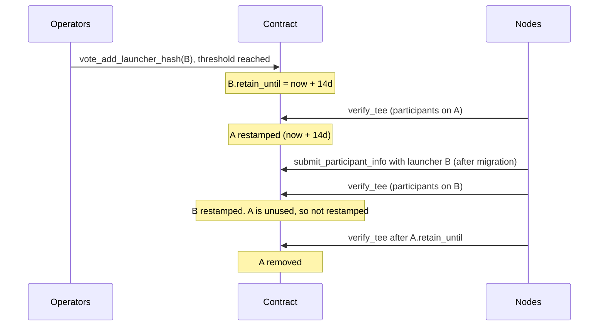

# Auto-Removal of Unused Launcher Image Hashes

**Implemented:** [#3564](https://github.com/near/mpc/pull/3564), reworked in [#4527](https://github.com/near/mpc/pull/4527) and [#4572](https://github.com/near/mpc/pull/4572)
**Issue:** [#3381](https://github.com/near/mpc/issues/3381)
**Related:** [Securing MPC with TEE](securing-mpc-with-tee/securing-mpc-with-tee.md), [TEE Lifecycle](tee-lifecycle.md), [Certificate-Derived Attestation Expiry](certificate-derived-attestation-expiry.md)

## Problem

Removing a hash from `allowed_launcher_image_hashes` takes a **unanimous** vote
(`vote_remove_launcher_hash`). Usually only the newest launcher is in use, so without automatic
removal the old ones pile up.

The insight: **not using a launcher is itself a vote.** Every participant's stored attestation
records which launcher it runs, so the contract can see which hashes are unused and retire them
without a vote.

## Design

`verify_tee` scans the launcher hashes and removes those no current participant has used for
roughly 14 days (the TTL) since they were voted in or last seen in use.

```rust
pub struct AllowedLauncherImage {
    launcher_hash: LauncherImageHash,
    compose_hashes: Vec<LauncherDockerComposeHash>,
    retain_until: Timestamp, // `now + TTL` at the last vote, or at the last
                             // `verify_tee` that found it in use.
}
```

The TTL is the config field `launcher_hash_unused_ttl_seconds`, default **14 days**.

1. **Stamp on vote.** When `vote_add_launcher_hash` reaches the threshold, it sets
   `retain_until = now + TTL`. Re-voting a hash already in the list restamps it.
2. **Remove in `verify_tee`.** Before re-verifying participants, `verify_tee` restamps every entry
   used by a current participant's stored attestation, then drops the entries whose
   `retain_until` has passed. The most recently stamped entry is always kept.
3. **Reads are plain membership.** Every entry in the list is accepted; nothing filters by time.
   Submissions (`submit_participant_info`) do not touch launcher state.

Only current participants count. A joining node or a migration destination is not yet a
participant, so a hash used only by such a node is protected by its vote stamp alone; a threshold
re-vote restamps it.

### Safety invariants

- **A hash in use by a current participant is never removed automatically.** `verify_tee`
  restamps before it removes, so neither the TTL nor the attestation's lifetime matters.
- **The list never empties.** `verify_tee` keeps the latest stamp, and `vote_remove_launcher_hash`
  refuses to remove the last entry.

### Housekeeping, not a security control

Removing a launcher immediately, for example a compromised one, is the unanimous
`vote_remove_launcher_hash`. Automatic removal only keeps the list short, so it may lag the TTL:

- An unused hash past its stamp stays accepted until the next `verify_tee`. A current participant
  that submits with it in that window makes it in use again.
- Entries tied at the latest stamp are all kept.
- After the TTL is lowered, a re-vote can move a stamp earlier.

### Out of scope

- OS measurements keep explicit voting (several sets must coexist long-term).
- MPC Docker image hash expiry, node and launcher code: unchanged.

## Lifecycle


```mermaid
sequenceDiagram
    participant Ops as Operators
    participant C as Contract
    participant N as Nodes

    Ops->>C: vote_add_launcher_hash(B), threshold reached
    Note over C: B.retain_until = now + 14d
    N->>C: verify_tee (participants on A)
    Note over C: A restamped (now + 14d)
    N->>C: submit_participant_info with launcher B (after migration)
    N->>C: verify_tee (participants on B)
    Note over C: B restamped. A is unused, so not restamped
    N->>C: verify_tee after A.retain_until
    Note over C: A removed
```

### Operator scenarios

| Scenario | Behavior |
|---|---|
| **Normal rotation** | Vote in `B`, migrate nodes. `A` is removed at the first `verify_tee` after its `retain_until` (the last `verify_tee` that saw a participant on it, plus the TTL). No removal vote. |
| **Rollback** | `B` broken; revert to `A` while it is still in the list. `B` is then removed like any unused hash. |
| **Slow rollout** (vote → migration > 14d) | `B` may be removed before anyone uses it, unless it holds the latest stamp. Re-vote it (threshold) to restamp. |
| **Participant offline on an old launcher** | Its stored attestation counts while it is a participant, so its hash stays. |
| **No `verify_tee` for a long time** | Nothing is removed; every hash stays accepted. |
| **Compromised launcher** | Unanimous `vote_remove_launcher_hash`. |

## Alternatives considered

- **Refresh on submission, filter on read**, the original design ([#3564](https://github.com/near/mpc/pull/3564)),
  later extended to the attestation's expiry ([#4527](https://github.com/near/mpc/pull/4527)). Each
  current participant's submission restamped its launcher, and every read skipped entries past their
  stamp. It works, but the stamp carries two meanings, every read has to filter, and the refresh
  has to be wired into each submission path. Without the extension, certificate-derived expiry
  ([#1639](https://github.com/near/mpc/issues/1639)) would also let a 14-day stamp kick a node whose
  attestation is still valid.
- **Instant removal when no participant uses a hash.** No rollback window; a broken new launcher
  would need a re-vote under incident pressure.
- **Exempting never-used hashes.** A forgotten or mistaken vote would linger forever, the very
  problem being solved.
- **Detached-promise sweep** in a `#[private]` self-call. The list is a tiny in-memory `Vec` with no
  real failure mode, so inline removal is simpler and needs no gas config.
- **Public cleanup method.** Grows the public API; `verify_tee` already runs routinely.
