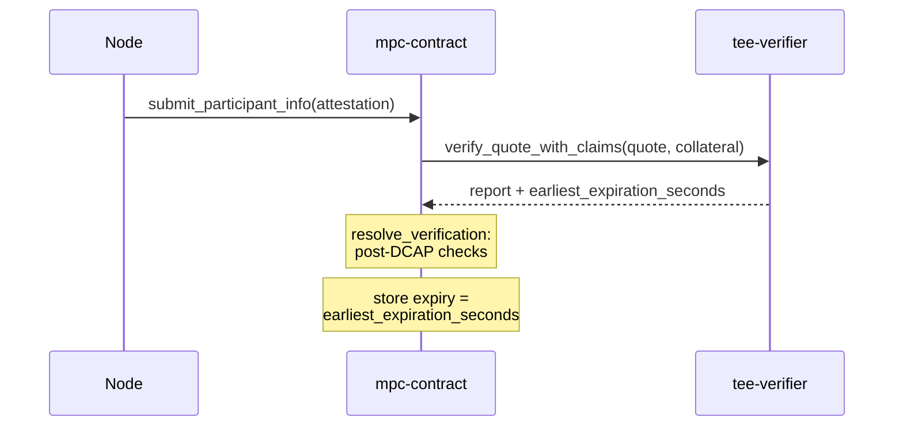

# Certificate-Derived Attestation Expiry

Design for [#1639](https://github.com/near/mpc/issues/1639). The contract stops inventing its own
attestation expiry and stores the one Intel already publishes.

```text
expiry = earliest_collateral_expiration
```

`DEFAULT_EXPIRATION_DURATION_SECONDS` is deleted.

| | Today | This design |
|---|---|---|
| Expiry stored | `now + 7 days` | the collateral's own expiry |
| Chosen by | a contract constant | Intel |
| Typical value | 7 days from submission | ~30 days, minus the age of the collateral |

## Why change it

### Why a constant was chosen

The 7-day constant was a deliberate stop-gap, and a sound one at the time:

1. A constant avoided parsing certificates and CRLs on chain, which is the expensive part.
2. It was *shorter* than Intel's 30-day windows, so on its own it tightened rather than loosened.
3. The node refused collateral older than 7 days (`MAX_COLLATERAL_AGE`), so any collateral presented
   still had roughly 23 days of validity left. A 7-day expiry fitted inside Intel's window with room
   to spare.

### Why that no longer holds

**Intel's own value removes the guesswork.** Any constant we pick instead either loosens security or
assumes a refresh cadence Intel may not keep, and that assumption has already failed once.

**The third leg has also gone.** `MAX_COLLATERAL_AGE` is now 31 days rather than 7
([#3946](https://github.com/near/mpc/issues/3946)), so collateral can be presented right up to its
`nextUpdate` and `now + 7 days` outlasts it. The submitter picks when to submit, so it picks the
overhang.

That overhang is a revocation window. The contract never re-checks a stored attestation against
fresher collateral, so a platform Intel revokes in the next PCK CRL stays trusted for up to 7 more
days. Until on-chain CRL updates exist ([#1050](https://github.com/near/mpc/issues/1050)), this
expiry is the only bound on that.

Using Intel's value is also more generous in the normal case: a node with fresh collateral gets
about 30 days rather than 7.

*Considered: a contract-side cap on top of the certificate value. Dropped — it leaves two expiries
to keep in sync, it does not help the fleet convergence described in item 4, and
[#3734](https://github.com/near/mpc/issues/3734) turned out not to need it.*

## The expiry value

`dcap-qvl` (0.6.3, our pin) computes it as `QuoteClaims::earliest_expiration_date`: the earliest of
eight dates, matching Intel's own `qve_get_collateral_dates()`. The claims are built by
`QuoteVerificationResult::claims()`, reached through `verify_with_policy`. The rest of this document
calls that `claims()`.

| Source | Field | Typical window |
|---|---|---|
| TCB Info JSON | `nextUpdate` | 30 days |
| QE Identity JSON | `nextUpdate` | 30 days |
| PCK CRL | `nextUpdate` | 30 days |
| Root CA CRL | `nextUpdate` | 1 year |
| PCK certificate chain | `notAfter` | 7–30 years |
| PCK CRL issuer chain | `notAfter` | 7–30 years |
| TCB Info issuer chain | `notAfter` | 7–30 years |
| QE Identity issuer chain | `notAfter` | 7–30 years |

One of the three 30-day rows always wins in practice, so the stored expiry is roughly 30 days minus
the age of the collateral the node presented.

## Getting it on chain



`tee-verifier` gains one method, `verify_quote_with_claims`. `verify_quote` is untouched.

```rust
#[result_serializer(borsh)]
pub fn verify_quote_with_claims(
    &self,
    #[serializer(borsh)] quote: QuoteBytes,
    #[serializer(borsh)] collateral: Collateral,
) -> VerificationResultWithClaims;

pub enum VerificationResultWithClaims {
    Verified {
        report: VerifiedReport,
        earliest_expiration_seconds: u64,
    },
    Rejected(VerifierError),
}
```

This keeps the verifier 1:1 with `dcap-qvl`. `QuoteClaims` is `dcap-qvl`'s own type, so the new
method exposes more of the upstream API rather than a shape of our own.

A second method, rather than a new field on `verify_quote`, is for the upgrade path. The verifier
account is key-locked, so changing the return type means a new account and a
`vote_tee_verifier_change`. During that rotation an old verifier may answer a new contract, or the
reverse. A new method name fails closed; a changed field would mis-decode.

Off chain, `verify_locally` reads the same number, so the node, the CLI and `tee-authority` agree
with the chain.

A re-submission always overwrites the stored expiry, even when the new value is earlier. The stored
expiry should describe the collateral actually presented; keeping the longer of the two would let a
node hold on to trust from collateral it no longer has.

*Considered: deriving the expiry inside `mpc-contract`, from the collateral it already forwards. No
verifier change needed, but it puts DER/X.509 parsing back into the contract wasm and undoes
[#3264](https://github.com/near/mpc/issues/3264).*

## What else has to change

Six things depend on the expiry being `now + constant`. Five have to change with it; item 3 is
future work this design only has to keep possible. Each is listed as the problem, then the fix.

**1. Confirming a submission landed.** The node checks whether the stored expiry went up
([`tx_sender.rs`](../../crates/node/src/indexer/tx_sender.rs)). That stops working when the value is
a calendar date that repeats for weeks.

Fix: store `attested_at_seconds` on
[`NodeAttestation`](../../crates/contract/src/tee/tee_state.rs). It wraps both the Dstack and Mock
variants, so one field covers both. This restores today's semantics exactly, and gives operators a
better health signal than expiry. Costs 8 bytes per entry (599 → 607, so `WORST_CASE_ENTRY_BYTES`
moves off 604 and the fee floor needs re-checking) and a state migration.

*Considered: reading the receipt execution outcome. It works, and needs no extra tracked shard, but
it is far more machinery. [#4301](https://github.com/near/mpc/issues/4301) now tracks the timestamp
approach instead.*

**2. Launcher-image eviction.** A launcher hash is evicted after `launcher_hash_unused_ttl_seconds`
(14 days) without use, where "used" means an accepted attestation from a current participant
refreshed it. `re_verify` re-checks a stored attestation's launcher hash against the current allowed
set, so evicting a hash kicks a node whose attestation is still valid. Today `Config::validate`
prevents this by requiring the TTL to exceed the 7-day constant, which is going away.

Without that rule, a node that attests once with 30 days of validity and then stops loses its hash
on day 14 and is kicked with 16 days left. Effective validity becomes `min(certificate expiry, 14
days since the last attestation)`, which turns launcher cleanup into a second attestation deadline.

Fix: keep the TTL, but never evict a hash that a current participant's non-expired attestation still
references. The TTL is then left retiring only hashes nobody adopted. This matches the existing
refresh gate (`refresh_launcher_usage` requires `AuthenticatedParticipantId`) and is cheap, because
`cleanup_expired()` already runs where the stored attestations are iterated. The rule that the list
never empties stays.

*Considered: dropping the TTL and evicting purely on references. Simpler config, but a newly
voted-in hash has no references until nodes adopt it, so it would need its own grace period.*

**3. Shortening after a verifier rotation — future work.** Nothing to build here. This design just
has to leave it possible. [#3734](https://github.com/near/mpc/issues/3734) wants a short window
after a rotation, so entries a rotated-away verifier may have wrongly accepted age out quickly. It
was written as "lower the constant", and the constant is going away.

It stays possible, and gets cheaper, via the timestamp from item 1: record `verifier_rotated_at`
when `vote_tee_verifier_change` passes, and in `re_verify` let any entry with
`attested_at < verifier_rotated_at` expire at `min(expiry, verifier_rotated_at + 1 day)`. Entries
submitted after the rotation are untouched, every node gets a full day to re-attest, and there is no
sweep or per-entry write.

**4. Near-expiry collateral.** A node presenting nearly stale collateral now gets a nearly worthless
attestation. And because `nextUpdate` is shared across the fleet, every node's expiry converges on
the same instant.

Fix, on the node side only: refuse to submit, and refresh early, once collateral has less than a few
days left. Today `MAX_COLLATERAL_AGE` allows 31 days, which permits collateral right up to its
expiry.

**5. Sandbox fixture.** The checked-in quote is dated 2026-08-13 and is already past Intel's 30-day
window. A certificate-derived expiry therefore lands in the past relative to sandbox block time, and
recedes further every day. Submission still succeeds, but anything that re-verifies afterwards sees
an expired entry.

Fix: extend the pinned-clock trick to the contract side, mirroring
`tee_verifier_contract_with_pinned_clock`.

*Considered: regenerating the fixture. Not a fix — a fresh one would have a 30-day shelf life.*

**6. Gas budget.** See the next section. The config change is a governance vote of its own.

## Gas

Measured on mainnet (`v1.signer` → `tee-verifier-2026-08-04.near`). Gas limit is the ceiling a
receipt may spend; the unburnt remainder is refunded.

| Receipt | Burnt | Gas limit | Set by |
|---|---|---|---|
| `submit_participant_info` | 16.28 | 300 | node's prepaid gas — protocol max, covers the whole chain |
| `verify_quote` | **175.81** | 200 | `verifier_tera_gas` |
| `resolve_verification` | 4.60 | 60 | `resolve_verification_tera_gas` |
| Total burnt, incl. tx and refunds | 199.73 | | |

The 300 is the chain's budget, not the verifier's. The submit receipt spends 16.3 itself and commits
200 + 60 to its two promises, leaving about 20 TGas unallocated. So `verifier_tera_gas` can reach
roughly 220 as things stand, or roughly 270 if `resolve_verification`'s 60 is trimmed toward its
4.6. Not 300.

`claims()` parses the two JSON documents again and walks the certificate chains, so its cost has to
be measured before the split is chosen.

*Fallback if it does not fit: read `nextUpdate` from the two CRLs and the two JSON documents only.
That drops the four certificate chains from the minimum, which is safe given their 7–30 year
lifetimes, but it should be a deliberate choice rather than an accident.*

## Rollout

1. **Land item 1**, the stored submission timestamp, so confirmation keeps working.
2. **Measure `claims()`, then propose and vote the gas config.** This document does not propose
   numbers; they come from the measurement. The vote is `propose_update` / `vote_update`, which is
   separate governance from the contract upgrade, and it has to land before step 4 — otherwise the
   heavier method runs under the old budget and every submission runs out of gas.
3. **Deploy the new verifier and vote it in**, per
   [`deploy-tee-verifier.md`](../development/deploy-tee-verifier.md). It still serves `verify_quote`,
   so nothing changes on chain yet. Reversible by voting back.
4. **Upgrade `mpc-contract`** to call `verify_quote_with_claims`. Certificate-derived expiry takes
   effect here, and from this point voting back to the old verifier no longer works.
5. **Release the node** with the near-expiry refresh rule from item 4.

Both verifiers are already live (`tee-verifier-2026-08-04.near`, `tee-verifier-2026-07-22.testnet`),
so step 3 is a rotation, not a first deployment.

Operators will see a healthy node's `expiry_timestamp_seconds` sit further out than today, but stop
advancing hourly: it moves only when the node picks up refreshed collateral, roughly monthly.
`attested_at_seconds` is the replacement health signal.
[`tdx-tcb-status.md`](../guide/tdx-tcb-status.md) sells the old behaviour as the cheapest health check and
needs rewriting, as does the `mpc_attestation_expiry_timestamp_seconds` description from
[#4236](https://github.com/near/mpc/pull/4236).

## Open questions

- **How much gas does `claims()` add?** Measure, then choose between re-balancing against
  `resolve_verification` and the lean fallback.
- **How early should a node refuse to submit collateral** (item 4)? Needs a number.
- **Whose attestation protects a launcher hash** (item 2)? Current participants only, matching the
  existing refresh gate, leaves a joining node's hash unprotected during resharing.
