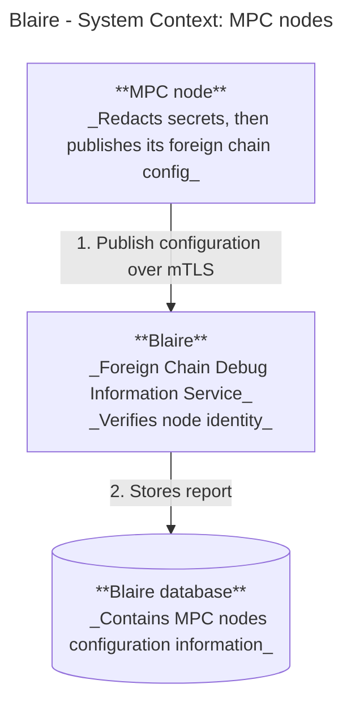
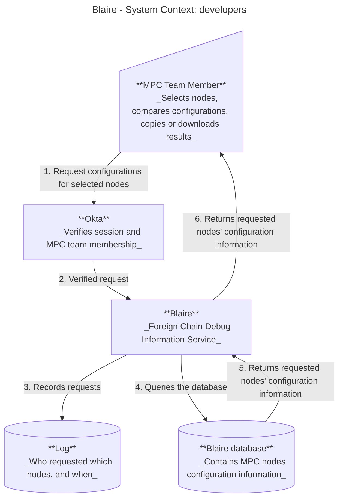

# Blaire - A debug information service for Foreign chain configurations

Status: Draft
Issue: [Add design doc for new debug information service 4077](https://github.com/near/mpc/issues/4077)

## Purpose

This document defines goals and outlines the design of the Foreign chain configurations debug information webservice named Blaire. Blaire will enable the MPC team to easily inspect Foreign chain configuration information.

## Background

Nodes have Foreign chain RPC configurations that used to be published on-chain, but this was identified as a potential attack vector. So, a decision was made to remove their visibility in debug endpoints (only leaving `ForeignChainsProviderCounts` exposed), but the MPC team would still like to easily access and inspect this information to spot potential configuration bugs.

## Proposed solution

Blaire will work as a standalone web application that serves Foreign chain RPC configuration debug information (e.g. foreign chain configuration, certain logs etc.) to authenticated users. The current workflow is to ping each node operator manually and separately for the configurations. Through Blaire, the MPC team members will save time and effort by simply requesting the webservice for information relevant to debugging.

## High level design

The webservice will be accessible to authenticated MPC team members.

### Work flow

Nodes:
1. MPC nodes will publish their configurations to Blaire at startup (a configuration change requires a node restart).
2. Blaire will authenticate, validate and then store the configuration information in a database.



Users:
1. Users authenticate themselves to access the webpage.
2. The user will be able to request Blaire for node configurations.
3. Blaire reads its database to serve the information to users.
4. The requests are recorded in an audit log.
5. (Potentially) The user will be able to save/copy/compare the information.



See [the Foreign chain configurations documentation](https://github.com/near/mpc/blob/0185bf46611aece50a9e876ed8ec0ef96133e421/docs/foreign-chain-transactions.md?plain=1#L631) for a configuration example snippet. [Here is also the Foreign chain config struct in the MPC repo.](https://github.com/near/mpc/blob/b647bcd117ee8fcd09e17ad3a963dbf6078403fa/crates/node-config/src/foreign_chains.rs#L46)

API keys for authentication will still need to be redacted for security reasons and the nodes will redact these secrets before they are published to Blaire. Therefore, the server never sees the secrets. See redactions table below for details on what will be published.

#### Redaction table

The payload published by nodes is `RedactedForeignChainsConfig`, constructed
field-by-field from `ForeignChainsConfig`. It is an allowlist: any field added
upstream and not listed in the table below is **not** published.

| Upstream field | Published as | Rationale |
| --- | --- | --- |
| `ForeignChainsConfig` map keys (chain identifiers) | verbatim | Identifies which chains the node is configured for; not sensitive. |
| `ForeignChainConfig::timeout_sec` | verbatim | Operational tuning value, the main thing we want to compare across nodes. |
| `ForeignChainConfig::max_retries` | verbatim | As above. |
| `ForeignChainConfig::expected_network_fingerprint` | verbatim | A mismatch here is a bug we want to detect; not a credential. |
| `ForeignChainConfig::providers` map keys (`RpcProviderName`) | verbatim | Identifies the provider; carries no credential. |
| `ForeignChainProviderConfig::rpc_url` | scheme and host only, path/query/userinfo dropped (`https://eth-mainnet.g.alchemy.com/v2/<key>` → `https://eth-mainnet.g.alchemy.com`) | Provider URLs frequently carry an API key in the path, and `AuthConfig::Path` places a token inside the URL by design. Host alone is enough to tell which provider a node uses. |
| `ForeignChainProviderConfig::auth` | variant name only (`"none"` / `"header"` / `"path"`) | Knowing *how* a provider authenticates is useful for debugging; the credential never is. |
| `TokenConfig::Val { val }` | **dropped entirely** | Literal secret. |
| `TokenConfig` environment-variable / file-path variants | **dropped entirely** | The name or path is not itself a secret, but publishing it gives an attacker a map of where credentials live for no debugging benefit. |

### Requirements

Required functions:
- Nodes publish redacted Foreign chain configurations
- SSO authentication of users (only team members) before site can be accessed
- Store MPC nodes' Foreign chain configurations
- Users able to request the database for configurations
- Users can see the audit log request history

Potential functionalities:
- Download the information as a file/JSON
- The ability to easily copy the information to clip board (button)
- Hand-select several nodes of interest and get all of their configuration information at the same time
- Compare different nodes' configurations
- The MPC node operators having access to Blaire

## Wire formats/service API

### Overview

For the service there are two main wiring groups: the connections between the nodes and the service, and between the user and service. They have different requirements and will fulfill different objectives. The next section will include more details on the individual endpoints.

Server endpoint/API root path:
https://URL (TBD)

Summary:
POST /api/v1/reports                        publish config info                         config:write
POST /api/login                             log in authenticated users
POST /api/logout                            log out authenticated users
GET /api/v1/nodes                           list currently participating nodes          nodes:read
GET /api/v1/nodes/{node_id}/config          fetch latest reported config from a node    config:read
GET /api/v1/nodes/{node_id}/history         fetch a node's config history               config:read
GET /api/v1/configs?node_id=X&node_id=Y     compare different node configs              config:read
GET /api/v1/activity                        list all users actions/requests             audit:read


### MPC nodes --> Blaire

POST /api/v1/reports     publish config info     config:write

The reports will be posted through the Blaire API, where the configs are recorded at a node's startup. The configurations will have a historic record, so that previous configurations could be compared to newer ones. The Blaire IP/web-address can be passed to the nodes via config-files where the address won't be public. Publishing should also be best-effort, as a Blaire outage or a rejected report must never block or fail MPC node startup.

```rust
async fn publish_node_config_report(
    State(state): State<AppState>,
    node: AuthenticatedNode,
    Json(report): Json<RedactedForeignChainsConfig>
) -> Result<StatusCode,ApiError> {}
```

### Blaire <--> Users

#### Authentication and access

The login/logout endpoints will connect to the Okta SSO service once it is in place.

POST /api/login                             log in authenticated users
POST /api/logout                            log out authenticated users

#### Configuration information

The endpoints will mainly depend on fetching the nodes' configurations from the database and then serve the information in different formats, depending on what the user has requested. First, having an endpoint that serves information on the current participating nodes enables the team to check if there are any nodes that are no longer active and remove their configs from the database tables. One endpoint will serve individual node configurations, so users can inspect for possible problems. There will also be a history endpoint, where users can view older versions of individual node configs.

GET /api/v1/nodes                           list currently participating nodes          nodes:read
GET /api/v1/nodes/{node_id}/config          fetch latest reported config from a node    config:read
GET /api/v1/nodes/{node_id}/history         fetch a node's config history               config:read

Among potential functions users will be able to compare different node configs side-by-side in another endpoint. This could be done client-side and is not a priority.

GET /api/v1/configs?node_id=X&node_id=Y  compare different node configs              config:read

```rust
async fn get_node_config(
    State(state): State<AppState>,
    user: AuthenticatedUser,
    Path(node_id): Path<NodeId>
) -> Result<Json<NodeRedactedConfigReport>,ApiError> {}
```

#### Audit log

There will be an endpoint that serves the audit log, so that users can track possible suspicious activity from someone's account. This will connect to a separate audit log table in the database.

GET /api/v1/activity                      list all users actions/requests               audit:read

```rust
async fn list_audit_log(
    State(state): State<AppState>,
    user: AuthenticatedUser,
) -> Result<Json<Vec<AuditEvent>>,ApiError> {}
```

## Data model

### Structs

```rust
pub struct AuthenticatedUser {
    pub username: String,       //username or email, depending on future authentication
}
```

A stored report: one row of node_config_reports.
```rust
pub struct NodeRedactedConfigReport {
    pub id: i64,
    pub node_id: NodeId,
    pub tls_public_key: Ed25519PublicKey,
    pub created_at: String,
    pub redacted_config: String, //JSON
}
```

#### Node identity

Blaire keys nodes on the operator's NEAR account id, since it is stable across TLS key
rotation.

```rust
/// The `node_id` used in URLs and as the key in every Blaire table.
/// Corresponds to `NodeId::account_id` in the MPC repository.
pub struct NodeId(AccountId);
```

The MPC repository's [`NodeId`](https://github.com/near/mpc/blob/fb32ae3787e0e445168260591e3e00213b786adc/crates/near-mpc-contract-interface/src/types/tee.rs#L24) is the full on-chain identity of a node:

| Field                | Used by Blaire |
| ---------            | ---------      |
| `account_id`         | Yes, this is Blaire's `node_id` |
| `tls_public_key`     | Recorded per report and in `node_tls_keys` table (not used as identity, since it changes on rotation) |
| `account_public_key` | Not used       |

### Database

The back-end will connect to a database `blaire.sqlite3` containing some of the following tables. The foreign chain table will contain the configurations of the individual MPC nodes. There will also be a node and operator mapping table, which connects which operator controls which node. Another table will be an audit log, which will record all user events. The audit log is essential for visibility, error handling and security.

Blaire uses SQLite, but if retention or query volume outgrows its capabilities the schema can be ported to Postgres.

#### Foreign chain configuration table

| Node ID             | TLS public key   | Created at    | Foreign chain config |
| -------------       | -------------    | ------------- | -------------        |
| node0.near          | Key #1           | date, time    | JSON(config)         |
| everstake.pool.near | Key #2           | date, time    | JSON(config)         |
| ....                | ....             | date, time    | JSON(config)         |

```sql
CREATE TABLE node_readcted_config_reports (
    id INTEGER PRIMARY KEY AUTOINCREMENT,
    node_id TEXT NOT NULL,
    tls_public_key TEXT NOT NULL,
    created_at TEXT NOT NULL DEFAULT (datetime('now')),
    redacted_config TEXT NOT NULL
);

CREATE INDEX index_node_reports
    ON node_redacted_config_reports (node_id, created_at DESC);
```
#### Node TLS keys

To ensure that a node's configuration history is complete, even if it rotates TLS keys, we need to map which TLS key belongs to which node.

| TLS public key | Node ID              | First seen  | Last seen   |
| ----------     | ----------           | ----------  | ----------  |
| Key #1         | node0.near           | date, time  | date, time  |
| Key #2         | everstake.pool.near  | date, time  | date, time  |
| ....           | ....                 | date, time  | date, time  |

```sql
CREATE TABLE node_tls_keys (
    tls_public_key TEXT PRIMARY KEY,
    node_id TEXT NOT NULL,
    first_seen TEXT NOT NULL DEFAULT (datetime('now')),
    last_seen TEXT NOT NULL DEFAULT (datetime('now'))
);

CREATE INDEX index_tls_keys_node
    ON node_tls_keys (node_id);
```
Blaire resolves a client's key to a node ID from contract state and updates node_tls_keys. Contract state only holds current keys, so this table will keep historical records correct across a rotation of keys.

#### Node - operator mapping

| Node ID             | Operator ID   |
| -------------       | ------------- |
| node0.near          | .....         |
| everstake.pool.near | .....         |
| ....                | .....         |

```sql
CREATE TABLE node_operator (
    node_id TEXT PRIMARY KEY,
    operator_id TEXT NOT NULL
);
```

#### Audit log

| User ID       | Timestamp     | Event                    |
| ------------- | ------------- | -------------            |
| User #1       | date, time    | Logged in                |
| User #1       | date, time    | Request node0.near config|
| ....          | date, time    | .....                    |

```sql
CREATE TABLE audit_log (
    id INTEGER PRIMARY KEY AUTOINCREMENT,
    user_id TEXT NOT NULL,
    event_timestamp TEXT NOT NULL DEFAULT (datetime('now')),
    target_node_id TEXT NULL,
    event_type TEXT NOT NULL,
    details TEXT NULL
);

CREATE INDEX idx_audit_user_time
    ON audit_log (user_id, event_timestamp DESC);
CREATE INDEX idx_audit_target_time
    ON audit_log (target_node_id, event_timestamp DESC);

```

## Authentication/security

Initially, while in development, the webpage will have an authentication system between the user and service where there will only be one single user, with a username and password configured in environment variables. Once the webpage is ready for deployment, there will be a stronger authentication system in place. For these purposes we will use the SSO service provided by Okta, making it easy to maintain access to only current team members by using group permissions within the organisation.

[For reference, the Okta integration docs can be found here.](https://developer.okta.com/docs/guides/sign-in-overview/main/)

There also needs to be some type of authentication for the nodes to access Blaire and report their configs. Here we could use mTLS and re-use code from the [backup-cli](https://github.com/near/mpc/tree/main/crates/backup-cli). This would require Blaire to have access to the MPC contract state, which can be fetched via the RPC nodes.

### Risks

The configuration information used to be public but was withdrawn as an extra precaution. If the debug service were to be hacked and this information is leaked, we heighten the risk to our node system. Therefore, security should still be strong and accessibility limited to only MPC team members.

Since the service aggregates the information about the configurations of all of the nodes, it could become a bigger target for bad actors compared to when each configuration's information is stored separately by the node operators.
