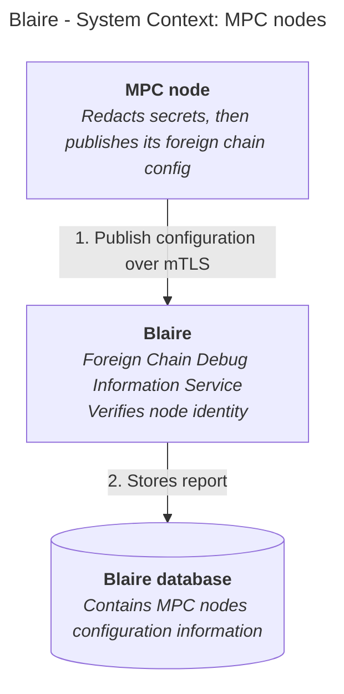
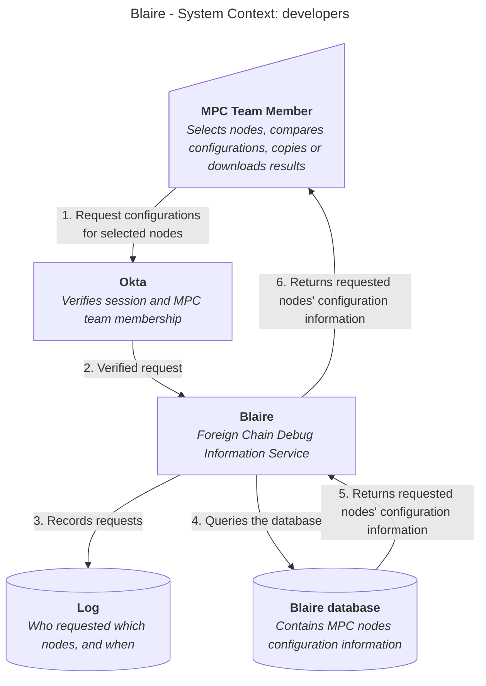

# Blaire - A debug information service for Foreign chain configurations

## Purpose

This document defines goals and outlines the design of the Foreign chain configurations debug information webservice named Blaire. Blaire will enable the MPC team to easily inspect Foreign chain configuration information.

## Background

Nodes have Foreign chain RPC configurations that used to be published on-chain, but this was identified as a potential attack vector. So, a decision was made to remove their visibility in debug endpoints (only leaving `ForeignChainsProviderCounts` exposed), but the MPC team would still like to easily access and inspect this information to spot potential configuration bugs.

## Proposed solution

Blaire will work as a standalone web application that serves Foreign chain RPC configuration debug information (e.g. foreign chain configuration, certain logs etc.) to authenticated users. The current workflow is to ping each node operator manually and separately for the configurations. Through Blaire, the MPC team members will save time and effort by simply requesting the webservice for information relevant to debugging.

## High level design

The webservice will be accessible to authenticated MPC team members.

### Work flow

#### MPC nodes

1. MPC nodes connect to Blaire via mutual TLS and submit their redacted foreign chain configuration.
2. Blaire allows mTLS connection by MPC nodes listed as participants in the MPC smart contract and for nodes whitelisted by users[^1]. Blaire stores the received configuration to a database.

[^1]: MPC team members may whitelist a node that is about to join the network, but not yet a participant.


```mermaid
---
title: "Blaire - System Context: MPC nodes"
---
flowchart TD
    BL["`**Blaire**
    _Foreign Chain Debug Information Service_
    _Verifies node identity_`"]

    MPC["`**MPC node**
    _Redacts secrets, then publishes its foreign chain config_`"]

    DB["`**Blaire database**
    _Contains MPC nodes configuration information_`"]

    MPC -->|"1. Publish configuration over mTLS"| BL
    BL -->|"2. Stores report"| DB

    BL@{ shape: proc}
    MPC@{ shape: proc}
    DB@{ shape: db}
```

#### Users / MPC Team Members

1. Users authenticate themselves to Blaire via Okta auth token.
2. Users can request to view node configurations.
3. Blaire serves the information to users and records each request in an audit log.


```mermaid
---
title: "Blaire - System Context: developers"
---
flowchart TD
    DEV["`**MPC Team Member**
      _Selects nodes, compares configurations, copies or downloads results_`"]

    AUTH["`**Okta**
      _Verifies session and MPC team membership_`"]

    BL["`**Blaire**
      _Foreign Chain Debug Information Service_`"]

    LOG["`**Log**
      _Who requested which nodes, and when_`"]

    DB["`**Blaire database**
      _Contains MPC nodes configuration information_`"]

    DEV -->|"1. Request configurations for selected nodes"| AUTH
    AUTH -->|"2. Verified request"| BL
    BL -->|"3. Records requests"| LOG
    BL -->|"4. Queries the database"| DB
    DB -->|"5. Returns requested nodes' configuration information"|BL
    BL -->|"6. Returns requested nodes' configuration information"| DEV

    DEV@{ shape: manual-input}
    AUTH@{ shape: proc}
    BL@{ shape: proc}
    LOG@{ shape: db}
    DB@{ shape: db}
```

See [the Foreign chain configurations documentation](https://github.com/near/mpc/blob/0185bf46611aece50a9e876ed8ec0ef96133e421/docs/foreign-chain-transactions.md?plain=1#L631) for a configuration example snippet. [Here is also the Foreign chain config struct in the MPC repo.](https://github.com/near/mpc/blob/b647bcd117ee8fcd09e17ad3a963dbf6078403fa/crates/node-config/src/foreign_chains.rs#L46)

API keys for authentication will need to be redacted for security reasons and the nodes will redact these secrets before they are published to Blaire. Therefore, the server never sees the secrets. See redactions table below for details on what will be published.

#### Redaction table

The payload published by nodes is `RedactedConfig`, constructed
field-by-field from `ForeignChainsConfig`. It is an allowlist: any field added
upstream and not listed in the table below is **not** published.

| Upstream field | Published as | Rationale |
| --- | --- | --- |
| `ForeignChainsConfig` map keys (chain identifiers) | verbatim | Identifies which chains the node is configured for; not sensitive. |
| `ForeignChainConfig::timeout_sec` | verbatim | Operational tuning value, the main thing we want to compare across nodes. |
| `ForeignChainConfig::max_retries` | verbatim | As above. |
| `ForeignChainConfig::expected_network_fingerprint` | verbatim | A mismatch here is a bug we want to detect; not a credential. |
| `ForeignChainConfig::providers` map keys (`RpcProviderName`) | verbatim | Identifies the provider; carries no credential. |
| `ForeignChainProviderConfig::rpc_url` | scheme and host only, path/query/userinfo dropped (`https://eth-mainnet.g.alchemy.com/v2/<key>` → `https://eth-mainnet.g.alchemy.com`) | Provider URLs frequently carry an API key in the path, and `AuthConfig::Path` places a token inside the URL by design. Host alone is enough to tell which provider a node uses. Some providers include an MPC node operator-specific slug in the host, but this can be kept as redacting the API key will be enough. |
| `ForeignChainProviderConfig::auth` | variant name only (`"none"` / `"header"` / `"path"`) | Knowing *how* a provider authenticates is useful for debugging; the credential never is. |
| `TokenConfig::Val { val }` | **dropped entirely** | Literal secret. |
| `TokenConfig` environment-variable / file-path variants | **dropped entirely** | The name or path is not itself a secret, but publishing it gives an attacker a map of where credentials live for no debugging benefit. |

### Requirements

Required functions:
- Nodes publish redacted Foreign chain configurations
- SSO authentication of users (only team members) before site can be accessed
- Store MPC nodes' Foreign chain configurations
- Users able to request configurations
- Users can see the audit log request history

Potential functionalities:
- Download the information as a file/JSON
- The ability to easily copy the information to clip board (button)
- Hand-select several nodes of interest and get all of their configuration information at the same time
- Compare different nodes' configurations
- The MPC node operators having access to Blaire

## Wire formats/service API

### Overview

Blaire will expose the following endpoints:

| Method | Endpoint | Description | Scope |
|--------|----------|-------------|-------|
| POST | `/api/v1/reports` | Publish config info | `config:write` |
| GET | `/api/v1/nodes` | List currently participating nodes | `nodes:read` |
| GET | `/api/v1/nodes/{account_id}/{tls_public_key}/config` | Fetch latest reported config from a node | `config:read` |
| GET | `/api/v1/nodes/{account_id}/history` | Fetch the config history of an account's nodes | `config:read` |
| GET | `/api/v1/configs?account_id=X&account_id=Y` | Compare the latest configs of the given accounts' nodes | `config:read` |
| GET | `/api/v1/activity` | List all users' actions/requests | `audit:read` |

In case Blaire needs to handle session management for users, it will additionally expose the following endpoints:

| Method | Endpoint | Description | Scope |
|--------|----------|-------------|-------|
| GET | `/auth/login` | Redirect to Okta to start sign-in | — |
| GET | `/auth/callback` | Exchange Okta auth code, create session | — |
| POST | `/auth/logout` | Clear session, redirect to Okta logout | — |

### MPC nodes --> Blaire

The reports will be posted through the Blaire API, where the configs are recorded at a node's startup. The configurations will have a historic record, so that previous configurations could be compared to newer ones. The Blaire IP/web-address can be passed to the nodes via config-files where the address won't be public. Publishing should also be best-effort, as a Blaire outage or a rejected report must never block or fail MPC node startup.

```rust
async fn publish_node_config_report(
    State(state): State<AppState>,
    node: AuthenticatedNode,
    Json(report): Json<NodeReport>
) -> Result<StatusCode,ApiError> {}
```

### Blaire <--> Users

#### Configuration information

The endpoints will mainly depend on fetching the nodes' configurations from the database and then serve the information in different formats, depending on what the user has requested. First, having an endpoint that serves information on the current participating nodes enables the team to check if there are any nodes that are no longer active and remove their configs from the database tables. One endpoint will serve individual node configurations, so users can inspect for possible problems. There will also be a history endpoint, where users can view older versions of individual node configs.

Among potential functions users will be able to compare different node configs side-by-side in another endpoint. This could be done client-side and is not a priority.

```rust
async fn get_node_config(
    State(state): State<AppState>,
    user: AuthenticatedUser,
    Path(node_id): Path<NodeId>
) -> Result<Json<ReportedData>,ApiError> {}
```

#### Audit log

There will be an endpoint that serves the audit log, so that users can track possible suspicious activity from someone's account. This will connect to a separate audit log table in the database.

```rust
async fn list_audit_log(
    State(state): State<AppState>,
    user: AuthenticatedUser,
) -> Result<Json<Vec<AuditEvent>>,ApiError> {}
```

## Data model

### Node <--> Blaire Interface

`NodeReport` is the payload a node posts to `/api/v1/reports`. It carries no identity: Blaire takes the TLS key from the mTLS handshake and resolves the account id from the contract.

```rust
pub struct NodeReport {
    pub version: Version,
    pub redacted_report: RedactedConfig,
}
```

### User <--> Blaire Interface

`NodeId` identifies a node in URLs and as the lookup key. An account may be associated to multiple nodes, so the TLS key is part of the identity.

```rust
pub struct NodeId {
    pub account_id: AccountId,
    pub tls_public_key: Ed25519PublicKey,
}
```

```rust
pub struct AuthenticatedUser {
    pub username: String,       //username or email, depending on future authentication
}
```

### Database

```rust
pub struct MpcNode {
    pub node_id: NodeId,
    pub added_at: Timestamp,
    pub block_height: BlockHeight,
}

pub struct ReportedData {
    pub node_id: NodeId,
    pub report: NodeReport,
    pub received_at: Timestamp,
}

pub struct AuditEvent {
    pub user_id: UserId,
    pub action: AuditAction,
    pub recorded_at: Timestamp,
}

pub enum AuditAction {
    ListNodes,
    ReadConfig(NodeId),
    ReadHistory(AccountId),
    ReadAuditLog,
}
```

## Authentication/security

### Dev/operator access

Initially, while in development, the webpage will have an authentication system between the dev user and service where there will only be one single user, with a username and password configured in environment variables. Once the webpage is ready for deployment, there will be a stronger authentication system in place. For these purposes we will use the SSO service provided by Okta, making it easy to maintain access to only current team members by using group permissions within the organisation.

Node operators will not have access to the Blaire service when it launches, but access can be added later on if it is deemed necessary.

[For reference, the Okta integration docs can be found here.](https://developer.okta.com/docs/guides/sign-in-overview/main/)

### Node access

Nodes authenticate to Blaire and report their configs using mTLS (from the start/development phase) and we can re-use code from the [backup-cli](https://github.com/near/mpc/tree/main/crates/backup-cli). Blaire accepts a connection when the TLS key the node presents belongs to a node whose operator account is a current participant or is on the whitelist. In both cases the key comes from the contract: participants' keys from the participant set, prospective nodes' keys from the participant info they submit on-chain before being voted in. Blaire stores no node keys of its own. This requires Blaire to have access to the MPC contract state, which can be fetched via the RPC nodes. The nodes will verify that they are communicating with the real Blaire by adding Blaire's public key to the node configuration. This key can be moved to the contract instead later on.

