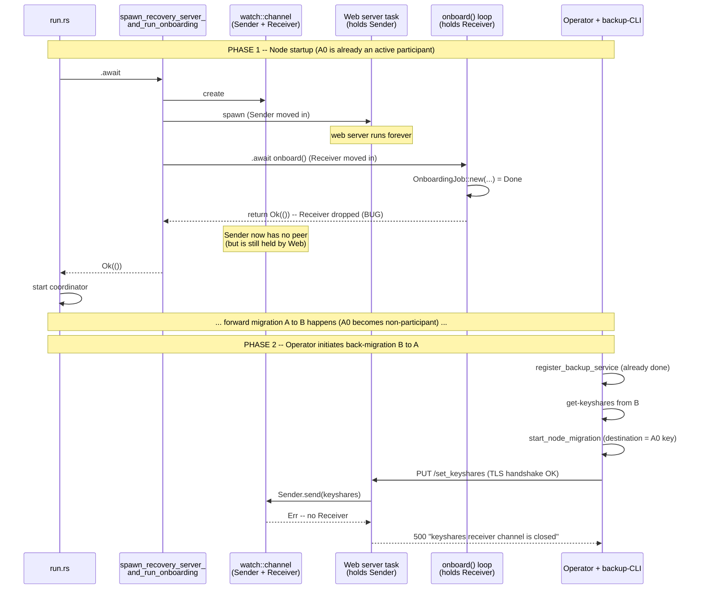
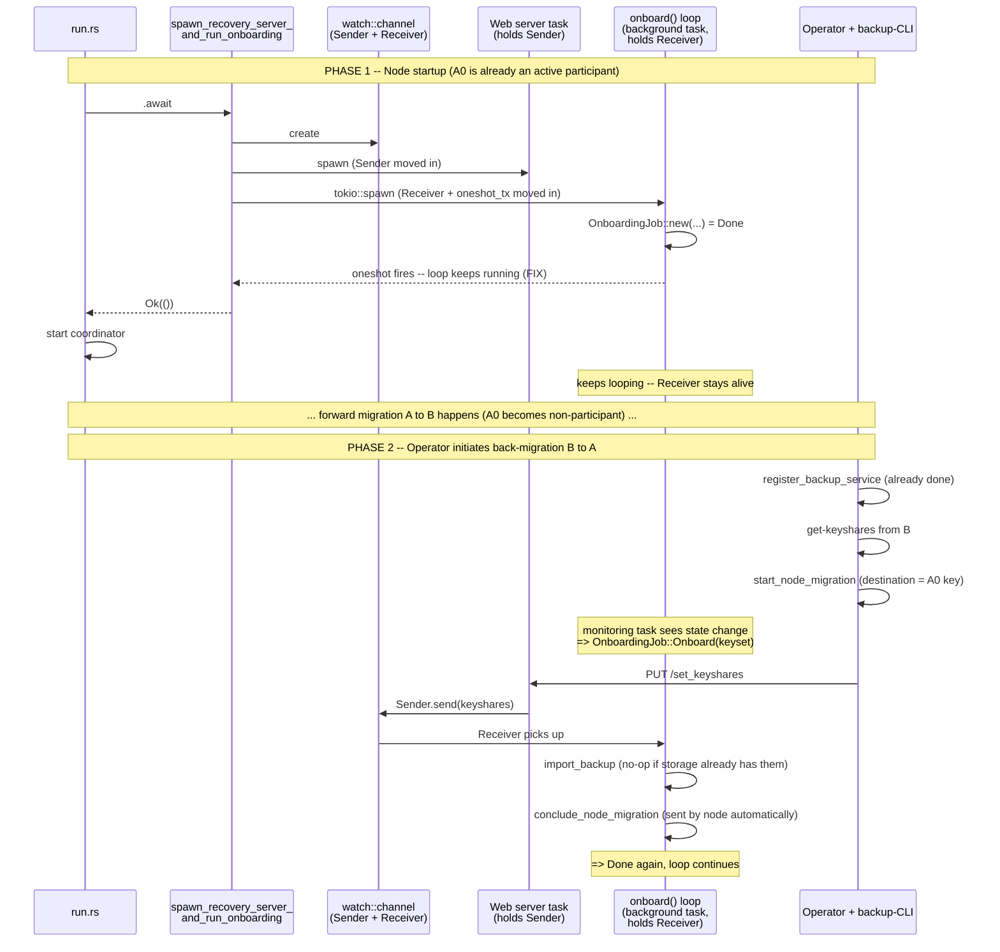

# Design: Re-entrant migration onboarding

Issue: [#3406](https://github.com/near/mpc/issues/3406).

## Motivation

The migration system was designed with one-direction migration in mind
(a → b). Back-migration (a → b → a) — bringing the original node back as
the active participant after it was migrated away — is a useful
operational pattern that isn't a first-class scenario today:

1. **Quick revert.** If something goes wrong with node B after a forward
   migration (operator misconfig, perf regression, attestation issue),
   the fastest recovery is to back-migrate to A instead of doing a full
   fresh-node setup.
2. **Primary + state-synced standby.** Keep two instances alive — one
   active, one on standby — and switch between them with a migration
   round-trip when the active needs maintenance or replacement.

## Today's restrictions

Back-migration to a previously-active node works today, but only when
both of these hold:

1. **Node A must be restarted** between the forward and back directions.
   Without a restart, A0's `PUT /set_keyshares` is rejected with
   `500 keyshares receiver channel is closed`.
2. **Node A must have valid attestation on the contract** for its key
   when `conclude_node_migration` is sent. Tracked separately in
   [#3362](https://github.com/near/mpc/pull/3362) (re-attest before
   concluding back-migration); see also [#2121](https://github.com/near/mpc/issues/2121).

This PR addresses restriction (1). Restriction (2) is independent
work.

## The restart restriction

`onboard()` (`migration_service/onboarding.rs`) owns the keyshare-receiver
end of the channel that the migration web server writes incoming PUTs to.
When that loop reaches `OnboardingJob::Done` it returns, dropping the
receiver. For nodes that start up already-active, this happens immediately
at process start. The web server keeps running with a now-dangling sender;
any subsequent `PUT /set_keyshares` returns
`500 keyshares receiver channel is closed`
(`migration_service/web/server.rs:185-191`).

Restarting the process is the only way to recreate the channel — which is
the constraint a back-migration to a previously-active node hits today.

## Fix

Make `onboard()` a long-lived state machine instead of a one-shot:

- Replace `return Ok(())` on `Done` with `cancellation_token.cancelled().await; continue;`
  (same shape as `WaitForStateChange`).
- The first time the loop hits `Done`, fire a oneshot so the caller can
  unblock startup. Subsequent `Done` transitions are silent.
- `spawn_recovery_server_and_run_onboarding`: `tokio::spawn(onboard(...))`
  instead of `.await onboard(...)`. Await the oneshot before returning.

Nothing else changes. The contract surface, the storage layer's epoch
checks (`keyshare.rs:376-449`, `keyshare/permanent.rs:155-196`), and the
operator workflow are unchanged. The monitoring task at
`onboarding.rs:100-153` already pushes `Onboard(keyset)` when contract
state names this node as a destination, so re-entry from `Done` →
`Onboard` happens automatically. Both sub-cases (epoch unchanged vs.
epoch advanced) fall out of the existing storage check inside
`execute_onboarding`.

## Current behavior

## Proposed behavior

## Risk

In-memory state from A0's prior tenure as a participant could leak into
the re-entered `Onboard` cycle (P2P mesh in `network.rs`/`p2p.rs`, triple
+ presignature pools in `db.rs`). A0 has been `Inactive` for its own key
between forward and back migration, so the coordinator should have wound
those down — but this is the one non-trivial invariant introduced by the
change. Tracked in [#3551](https://github.com/near/mpc/issues/3551).

## References

- Issue: [#3406](https://github.com/near/mpc/issues/3406); related
  operator-messaging: [#3407](https://github.com/near/mpc/issues/3407).
- Migration protocol: [`docs/migration-service.md`](../migration-service.md),
  [`docs/node-migration-guide.md`](../node-migration-guide.md).
