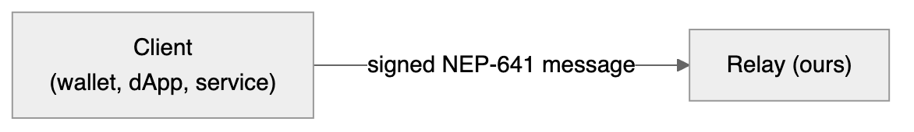
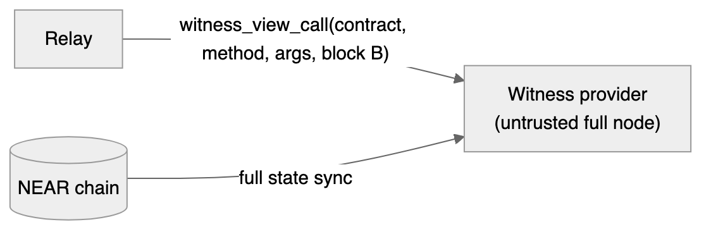
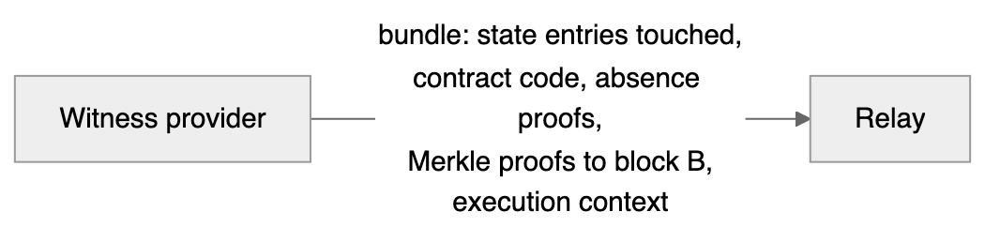
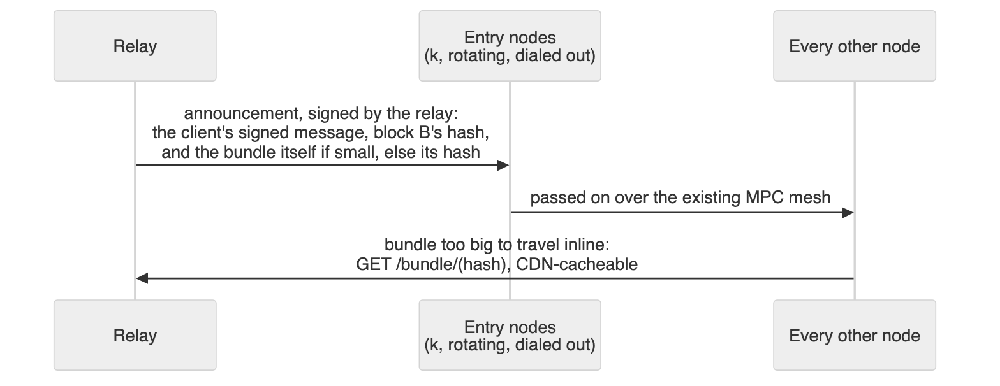
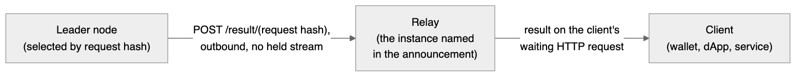

# Authorization Resolution for Off-chain Signature Requests

**Status:** draft for discussion · **Author:** Haiyue Chen (with Claude) · **Date:** 2026-08-17

## Summary

Two separate things meet here.

1. **NEP-641** is an authorization standard. A contract answers one question through a view
   function, `w_resolve_auth`: does this account authorize this payload? An answer can point
   at further authorizations, which is how multisigs, extensions and delegated wallets all
   work through the same interface. Full spec:
   [near/NEPs/neps/nep-0641.md](https://github.com/near/NEPs/blob/master/neps/nep-0641.md).

2. The off-chain request flow takes signature requests
   straight from a client instead of reading them off the chain. Those requests are
   authorized under NEP-641, so every node has to resolve them itself.

The problem is where they meet. When a request arrives as a transaction, the chain does
the hard part for us: every node reads the same request from the same place, and the
block it landed in is the obvious one to resolve against. An off-chain request arrives
with none of that, and the nodes still have to resolve it against state fresh enough for
the timestamp rule (NEP-641), and agree on the answer.

We can achieve off-chain requests without tracking a new shards or trusted RPC providers:

- A client, meaning a wallet, dApp, or backend service, sends its signed message to a
  **relay service** we run.
- The relay asks a **witness provider** (an ordinary full node with one extra endpoint) to
  resolve the authorization at its latest final block. The provider records
  every piece of state the resolution read, with proofs tying each piece to that block.
- Each MPC node redoes the resolution itself, checking that state against headers the
  neard it already embeds has validated.
- Every MPC then works from the same block, named in the request, so everyone reaches the same
  answer.

---

## Problem statement

Resolving `w_resolve_auth` is difficult for our MPC network:

1. **Arbitrary contracts.** The request may name any contract, they sit on any shard, and resharding
   moves accounts between shards.
2. **RPC providers cannot be trusted.** RPC providers could be malicious, the view call response comes with no proofs.
   An honest provider can also lag behind the chain, so its response may be stale.
3. **Determinism.** Nodes resolving at their own latest block may disagree when an
   authorization contract change happens.
4. **Recursion.** A multisig account sends us to its members, who may be contracts with
   conditions of their own. The request never says how deep it goes, and the chain is
   built by contracts we do not trust, so we need to cap depth and breadth.

---

## Architecture

Client to relay, relay to MPC network, with the witness provider and header feed hanging
off that. Only the chain is trusted: nodes re-verify everything the relay and provider hand
over, so the worst either can do is fail to answer.


**Step 1: the client signs and submits.** A plain NEP-641 message over HTTPS.



**Step 2: the relay requests a witness.** A provider resolves the authorization at its
latest final block, call it B, with storage recording on, and reports which block it used.



**Step 3: the provider returns the bundle.** Every state entry the walk touched, contract
code, non-inclusion proofs for what was missing, and Merkle proofs tying it all to B.



**Step 4: the relay injects the request.** It pushes an announcement, carrying the NEP-641 message,
its signature, the block B hash and the bundle hash, to k entry nodes that hold direct
connections to the relay. The entry nodes broadcast the message over the mesh. If the bundle is small, it will ride along inside the announcement. A large one is fetched by each node by hash separately.



**Step 5: Selected leader starts, and the participants each verifies for itself.** Every node now
holds the request, similar to on-chain requests today, a leader node is elected by computing a hash of the request. The leader takes one of its presignatures and opens a session with that presignature's participant set. Each of the participants then verifies the request (Component 6) and walks the authorization tree before signing a share.
A participant that rejects tells that to the leader node, so the leader aborts at
once and retries (Component 7).


**Step 6: the leader posts the result.** `POST /result/<request_hash>`, an outbound call
like the bundle fetch, and the relay answers the client.



### Component 1: the relay (we implement and run)

The relay has four jobs: take the request, get a witness bundle, inject the request into the
MPC network, and return the answer.

**Take the request.** `POST /sign` accepts a signed message carrying a NEP-641 payload. It
returns the signature if one arrives within a few seconds, or HTTP 202 and a handle if the signature could not be generated quickly.

The handle is the signed message's hash, which the client can compute.
`GET /result/<message_hash>` returns the latest result for that message, and servers can
register a callback instead of polling.

Signing is not idempotent. Sending the same payload twice runs it twice and yields two
different but equally valid signatures, each costing a presignature. The result endpoint
holds only the most recently completed one.

**Get a witness bundle.** The relay asks a witness provider to resolve the NEP-641
authorization at its latest final block. The provider returns a witness bundle, which contains the block it used and other information, details in Component 3. The bundle then travels to the MPC nodes, inlined in the Relay to entry node message when small, or fetched by the nodes using bundle_hash when too big. Each node verifies the bundle locally (component 6).

A set of witness providers are supplied through config at launch, and the relay fails over on error, timeout, or a
block too old. The set of providers needs no trust since every node re-verifies the proofs. A bad provider only
costs a retry.

**Inject the request.** Relay pushes a signed announcement to the k entry nodes that hold
connections to it, carrying the bundle inline when small, or served at
`GET /bundle/<bundle_hash>` when too big.

Three hashes appear from here on, so to keep them apart: `message_hash` identifies the
client's signed message, `bundle_hash` identifies the bundle, and `request_hash` covers the
whole `WitnessedSignatureRequest` (message, block reference and bundle together) and is what
binds a signing session.

**Return the answer.** The session leader posts the finished signature, which the relay
verifies against the MPC network's public key before answering the waiting client or filling
the handle.

Rejections are silent today. That is survivable on chain, where the requester is already
waiting on blocks, but off-chain clients expect faster responses, so failing fast
is an UX requirement. A node that rejects should signify to the leader why. It lets the leader and the relay give up as soon as the rejection is clearly deterministic and unanimous across all participants.

**The relay is trusted with nothing.** Nodes verify everything it sends, so it cannot forge
a request. However, the Relay being the only way in it can censor or delay requests, and we accept that risk. This is an off-chain path, so this risk is unavoidable. In this design the worst a compromised or failing relay can do is degrade or stop off-chain signing. It can never produce a wrong signature. Running redundant Relay instances helps us reduce that risk.

### Component 2: the witness provider (untrusted)

A program that owns a NEAR full node tracking every shard, and exposes a `witness_view_call` endpoint that does
not exist anywhere today. It is also the only RPC-shaped thing in the design.

It has three jobs:

1. resolve the authorization at a recent final block
2. record every piece of state that resolution reads
3. prove those pieces belong to that block.

```
witness_view_call(signed_message) -> WitnessBundle
```

The response type `WitnessBundle` is explained further in component 3.

**Resolving.** It runs the view call at its own latest final
block and reports the block height back.

**What "at block B" means here** An RPC query at B
returns the state _after_ B's work ran, but a header only publishes a fingerprint of the
state _before_ it; the post-state fingerprint reaches the chain in the next block carrying
work for that shard. Proving against the post-state would therefore need two blocks, so this
design uses the fingerprint in B itself, and "at block B" means the state as it stood just
before B. That gives up about a second of freshness for a proof needing nothing but B. The
provider and the nodes must make the same choice or every proof fails, on valid requests,
which is the worst kind of failure to debug. (In nearcore terms,
`inner_lite.prev_state_root` rather than `chunk_extra.state_root()`.)

A shard that stops producing chunks stops advancing its fingerprint while block timestamps
keep moving, so B can look fresh while the shard hosting the contract is minutes stale. MPC
nodes see that from the shard's last chunk and reject when the gap exceeds the recency
window.

**Recording.** As a contract runs it reads entries out of the chain's stored data. nearcore's
_storage recording_ keeps a copy of every entry read, together with the chain of hashes that
ties that entry back to the single fingerprint the block publishes for all state. Anyone
holding those copies can check that each entry really came from that block and was not
altered. None of this is new machinery: validators already use it to check a chunk's work
without keeping the state themselves, which is what
[NEP-509 stateless validation](https://github.com/near/NEPs/blob/master/neps/nep-0509.md)
introduced (see also [validators](https://docs.near.org/protocol/network/validators)).

**Proving.** The bundle makes two kinds of claims:

1. At block B certain storage keys held certain values
2. At block B certain accounts or keys were not there at all.
   A node holding no state for those shards has to check both without trusting the provider.

Each shard in NEAR blockchain stores state as a Merkle
trie, in which every node is keyed by the hash of its contents. A parent's hash covers its
children and the hash at the root is a fingerprint of that shard's entire state.


So a proof is a set of trie nodes. To prove a value the resolution read,
the provider keeps the nodes along the path from the state root down to it. To prove a key
was absent, it keeps the path down to the point where that key would have branched off,
showing no such child exists. Storage recording notes down the trie nodes being touched while the witness provider executes contract code.

This only proves what was the blockchain state held by the witness provider at block B. It
says nothing about which entries the contract code actually read, nor that the provider's claimed
answer follows from them. A dishonest provider could ship valid proofs alongside a
fake result. The proofs only make the ingredients trustworthy, replaying the resolution on
each MPC node makes the answer trustworthy (Component 6). Neither half is enough on its own.

Those trie paths stop at the shard's state root, which on its own is just a number the witness provider claims. The bundle (Component 3) closes this gap with one more path, from the shard's root up into the block header, which commits to every shard's state root. Each MPC node anchors verification (Component 5) by looking the named block up in the headers its embedded indexer has already validated, then checks every proof against it.


Further reading: [block structure](https://nomicon.io/DataStructures/Block) for what a
header commits to, [trie storage](https://github.com/near/nearcore/blob/master/docs/architecture/storage/trie_storage.md)
for how state is stored and proved, and [the light client
spec](https://nomicon.io/ChainSpec/LightClient) for verifying headers without running a
node.

**Who runs a witness provider.**
At launch we run the witness provider ourselves.

The hardware requirement is ordinary: a machine running a full near node tracking current state for all shards,
which RPC providers, exchanges and indexer operators run routinely.

The software does not exist, no public RPC provider would record a view call and prove it. Building it looks tractable and needs
no change to nearcore, but we need to align with the nearcore team early on 2 questions:

1. Would they ship the endpoint in `neard` itself, so any full node could serve it by upgrading?
2. If not, we build it on crates they mark internal (`node-runtime`, `near-store`, `near-epoch-manager`, all `publish = false`), and we need to
   know what stability we can expect from them.

The Q&A section [Can `witness_view_call` be built, and who owns
it?](#can-witness_view_call-be-built-and-who-owns-it) expands on requirements for this.

### Component 3: the witness bundle

Everything a MPC node needs to redo the resolution itself while holding no state for the shards
involved.

```rust
WitnessBundle {
  block_hash: CryptoHash,                 // the block everything resolved at,
                                          // always the provider's latest final block
  result: Result<String, String>,         // the payload the walk authorized, or
                                          // the failure that stopped it; advisory
                                          // only, since nodes recompute it
  shard_witnesses: Vec<{                  // one entry per shard the walk visited
    shard_id: ShardId,
    state_root: CryptoHash,               // this shard's root at block B
    recorded_trie_nodes: PartialState,    // every storage node the walk
                                          // touched in this shard, proving each
                                          // value present or absent
    merkle_path_to_header: MerklePath,    // this root's place among
                                          // all shards, up to the block header
  }>,
  contract_code: HashMap<CryptoHash, Vec<u8>>,  // one entry per distinct
                                                // implementation the walk ran
  execution_context: {                    // everything the contracts can observe
    block_height: BlockHeight,
    block_timestamp: u64,                 // nanoseconds
    prev_block_hash: CryptoHash,
    epoch_id: EpochId,
    epoch_height: EpochHeight,
    protocol_version: ProtocolVersion,    // selects the runtime rules in force
  },
}
```

The design choices behind the fields:

- **The execution context is block-level**, both witness provider and the MPC node must execute/verify in context of the same Near block.
- **Witness entries are grouped by shard, not by contract.** A verifier rebuilds one partial
  trie per shard, overlapping paths are stored once.
- **Code is keyed by hash, not by account.** When multiple multisig members run the same wallet
  implementation, the contract code is only sent once.
- **The provider always includes the code**. The provider does not know if the contract code is cached at its downstreams,
  so it always includes the code in the response. The Relay may decide to include only contract code hash or full contract code.
- **The bundle covers the whole authorization tree.** NEP-641 leaves recursion to the
  caller, so the provider runs the `pending` loop itself to find out what to record, all at
  one block. As a simpler first version we could have the relay drive the loop instead, this is up to discussion.
- **Absence is proved** When an access key or account is missing, the
  bundle carries a non-inclusion proof.

**How big is a bundle?** Proof material is small. A serialized branch node is an 11-byte
frame (tag, child bitmap, subtree size) plus 32 bytes per present child, so 75 bytes with
two children up to 523 with all sixteen. A path runs ten to twenty nodes, and paths under
one account share their upper half. An account record, its access key and a few storage
entries come to 5 to 15 KB per account, and absence proofs cost the same.

Contract code size, measured from released artifacts:
[wNEAR](https://github.com/near/intents/blob/ec1e75adb964a6688d5b93777521340224fd19ce/releases/wnear.wasm) 181 KB,
[fungible-token](https://github.com/near/intents/blob/ec1e75adb964a6688d5b93777521340224fd19ce/releases/fungible-token.wasm) 196 KB,
[non-fungible-token](https://github.com/near/intents/blob/ec1e75adb964a6688d5b93777521340224fd19ce/releases/non-fungible-token.wasm) 303 KB,
[PoA factory](https://github.com/near/intents/blob/ec1e75adb964a6688d5b93777521340224fd19ce/releases/defuse_poa_factory.wasm) 575 KB,
[defuse](https://github.com/near/intents/blob/ec1e75adb964a6688d5b93777521340224fd19ce/releases/defuse-0.2.10.wasm) 1.2 MB,
and the MPC contract [1.2 to 1.5 MB across recent
releases](../../crates/contract-history/archive/). The chain caps code at
`max_contract_size`, 4 MiB.

The relay cannot know whether any node's code cache is warm, so a full bundle carries every
contract's code:

| Case                                           | Bundle        |
| ---------------------------------------------- | ------------- |
| 1. Simple auth contract, minimal state touched | 0.2 to 0.6 MB |
| 2. One-layer multisig, members are access keys | 0.3 to 0.7 MB |
| 3. Two-layer multisig, all contracts distinct  | 3 to 8 MB     |
| 4. Any of the above, only code hash is sent    | 5 to 200 KB   |

Case 3 is a multisig whose member candidates are themselves multisigs, whose members in turn
are simple auth contracts. Three wide at each layer, that is 13 distinct contracts, and code size
dwarfs the proofs. Case 4 assumes that the MPC nodes does another round trip to fetch contract code by hashis.

### Component 4: the relay to MPC message format

The object the relay sends to the MPC nodes. It is the ordinary signature request with the
material needed to authorize it alongside.

```rust
WitnessedSignatureRequest {
  nep641_message: OffchainMessage,  // the signed envelope, defined below, frozen
  authorization: String,            // top-level authorization blob, resolver contract-defined
                                    // carries the user's signature(s) when auth resolution
                                    // is signature-based
  witness_bundle: WitnessBundle,    // Component 3; contains block_hash to pin the execution context,
                                    // and it may carry contract code hashes only (case 4 in table above  `How big is a bundle?`)
}
```

`OffchainMessage` is NEP-641's signable envelope:

```rust
OffchainMessage {
  chain_id: String,       // e.g. "mainnet"
  signer_id: AccountId,   // the account being resolved
  path: Vec<AccountId>,   // position in the authorization tree, empty at top
                          // level; NOT a key derivation path
  timestamp: Timestamp,   // u64 nanoseconds at signing
  payload: String,        // the authorized payload, opaque to the spec
}
```

For our network the payload encodes the signature request itself, what `SignRequestArgs`
carries on chain today: the payload to sign, the `domain_id`, and the key derivation path.
Clients should backdate the signed `timestamp` by about 60 seconds, per the standard, so
honest messages are not rejected as future-dated against a block trailing wall clocks.

Each MPC node computes `request_hash = SHA-256(WitnessedSignatureRequest bytes)` over the
bytes it received itself. That hash is the task id for the signing session: the leader is
elected from it and opens the session the same way the on-chain flow does today. A follower
only joins a session IFF prompted by the leader and the locally computed hash matches the task id.

### Component 5: verifying the request (per node)

Everything verifies against block headers the node already trusts today. The neard each MPC node embeds validates every block header, so the recent final headers verification needs are always on hand to anchor the proofs.

"Verify the request" is six checks, run by every participant MPC node on the same
`WitnessedSignatureRequest` bytes before it contributes a share:

1. **Signature.** The NEP-641/NEP-413 signature verifies for the claimed key.
2. **Block validity.** `witness_bundle.block_hash` is a real, final block in the node's own
   header view.
3. **Freshness floor.** `state_block.timestamp >= message.timestamp`, using the shard's
   chunk timestamp. Verifying contracts also enforce this themselves; checking up front rejects before the
   tree walk, allowing the node to fail early..
4. **Recency window** The block, and the shard's chunk height, are no older than the
   recency window against the node's own head. Elaborated in detail below.
5. **TTL, if set.** `block.timestamp - message.timestamp <= TTL`, the network's cap on top
   of any the contracts impose.
6. **Resolution.** The node replays the contract tree itself. (component 6)

**The recency window.** No other check bounds the block's age: NEP-641 permits historical
resolution, proofs of stale state verify with no issue, and a dishonest provider can pick
any final block rather than its latest. If recency is unbounded, a revoked authorization stays usable
forever.


We want the window short, the hard limit is at our MPC nodes. Today we tolerates peers 50
blocks behind, roughly a minute, and a window below that lag rejects honest requests
whenever one participant trails behind in an acceptable manner. Therefore **We propose 60 seconds recency window at launch**, matching the lag
tolerated today.

### Component 6: local verified re-execution (per node)

Running the NEP-641 authorization tree's contracts on the node itself, over state served from the bundle. Nodes already ship NEAR's runtime and run it for their tracked shard.
Replay has three requirements:

1. Confirm the bundle's state is genuine, by verifying the witness provider supplied Merkle proof against local block header hash.
2. Reproduce the resolution exactly, by executing the contract code using the supplied storage state.
3. Survive running malicious contract code, explained in details in `Guard rails` below.

Two caviats:

1. **Access-key type resolution needs a resolver in the MPC node.** When a step in the tree is a
   contract, the contract carries its own verification logic and we only replay it. When it is
   a bare access key there is no contract to execute. The MPC node needs perform the checks defined in NEP-641 directly. We can copy the reference implementation and use its test vectors.

2. **Determinism.** The witness provider and the replaying nodes must execute the NEP-641
   resolution over exactly the same state: block B's state and execution context, both
   carried in the bundle, under the protocol rules in force at B. Nodes therefore must
   upgrade before a new protocol version activates, or requests resolved under it will fail to
   replay.

Guardrails against malicious contract code:

- **Cap gas well below the runtime default.** The default view-call budget allows about a second of CPU per
  call. Authorization resolution contracts should be fairly simple so we should cap the runtime well below 1 second. In order to choose a cap value, we need to measure run time for a reasonable complex auth resolution contract..
- **Keep the attacker's code out of the enclave.** Nodes hold private key shares inside TDX, and
  replay runs request-supplied WebAssembly. The replay runtime should be sandboxed in a separate process.
- **Cache code by hash, never by account.** A contract upgrade changes the hash, so stale code is
  unreachable.
- **Cap the tree's depth and breadth.** Sub-authorizations are attacker-controlled and the
  standard permits cycles, so caps are the only guarantee the walk ends, and they must be
  identical everywhere or nodes disagree by giving up at different points.

### Component 7: leader election and signing

Both work as they do for on-chain requests today. The leader is derived pseudo-randomly
from the request hash over the alive participants. Signing is business as usual: the leader takes one of its presignatures and opens
a session with that presignature's participant set, and a follower contributes a share only
if it holds the request and it passes verification (Component 5).

Two adjustments for the off-chain path:

- **The broadcast from entry nodes to the rest of the network replaces the indexer as the
  trigger.** Details in the Q&A section [How does a request get from the relay into the MPC
  network?](#how-does-a-request-get-from-the-relay-into-the-mpc-network)

- **The signing process must adapt to fail fast.** A client waits on the relay for its
  signature, so a rejection has come fast. On-chain timeout solution is not acceptable
  A follower that rejects tells the leader immediately, and the leader aborts and retries.
  To keep retries cheap, the leader verifies the request before taking a presignature, and an attempt aborted before any share is revealed returns
  its presignature to the pool. None of this is off-chain specific, these changes would improve the onchain flow too.

---


## Q&A

Questions about design choices: the options considered and why one was chosen.

### Why does the request carry a block at all?

Every node must resolve against the same state or no signature forms, so something has to
name the block.

- **A. The relay carries it, discovered from the fetch (chosen).** The provider resolves at
  its latest final block and reports it. The relay passes it along with the bundle.
  MPC Nodes only verify the proposed block. Any block passing the checks is acceptable, so the
  proposer's motives do not matter.
- **B. The session leader picks it.** The same pipeline with the leader as requester, but
  block picking and bundle fetching move inside the nodes, which then need their own
  provider connections and retry loop.
- **C. A periodic checkpoint beacon.** Nodes agree on a checkpoint block every T seconds.
  Amortizes agreement across requests, but imports consensus machinery, makes beacon
  liveness a hard dependency of all authorization, and adds up to T seconds of latency.

A keeps the block picker in a stateless service we already run. B can be the fallback if MPC
input must be independent a relay.

---

### How does the relay and the MPC network talk to each other?

Nodes are TEE machines that should not grow a public inbound surface, and the network must
scale without reshaping the relay.

- **A. Through the MPC contract**, like `sign()`. Rejected. This option adds the block chain with gas and latency back to a flow we want to execute off chain.
- **B. Star shaped network**: every node holds a stream to the relay. Rejected: connections and identity
  management scale linearly with network size, and it ignores the mesh the nodes already
  run.
- **C. Inject through k entry nodes and let the mesh spread it (chosen).** The relay pushes
  a signed announcement to k rotating entry nodes, which dial out over mutual TLS and
  broadcast it over the existing mesh. Relay connections stay O(k) at any network size.

Bundles ride inside the announcement under about 64 KB; larger ones are fetched by
`GET /bundle/<bundle_hash>` and checked against the hash. Fetching rather than pushing
keeps the cost off the entry nodes: a mesh broadcast sends the same bytes once per
participant, so pushing a 4 MB bundle to 30 participants is over 100 MB of egress from one
TEE machine. Content-addressing makes the fetch CDN-cacheable, and nodes should also serve
bundles to each other by hash, in case the relay disappears after the announcement spreads.

The return path needs no held stream. The leader of a signature round posts the signature outbound to
`POST /result/<request_hash>` on the relay.

#### What stops an entry node from quietly dropping requests?

An entry node cannot change what the network signs, since every node verifies the request
and `request_hash` binds the session; the attack surface is delay and withholding. Three
rules shrink it: the relay signs every announcement with an expiry, it pushes to every live entry connection (withholding takes all k
colluding), and it holds k live connections rather than k assigned slots.

The residual is the correlated window: with a third of nodes hostile and k = 3, one window
in about 27 draws an all-hostile entry set, and every request in it stalls until the relay
retries. Raising k or shortening the window buys that down.

Rotation needs no new agreement: each node sorts participants by
`H(seed || participant_id)` with the seed taken from the first final block of the window,
the top k are primaries and the next few hot spares. The relay computes no schedule and
accepts any of them, so rotation changes ship with a node release.

#### How do nodes and the relay authenticate each other?

Each endpoint is different, because authentication does a different job on each:

- **The announcement stream: mutual TLS, both sides grounded on chain.** The node checks
  the relay's key against the voted `identity_key`; the relay checks the node against
  `ParticipantInfo.tls_public_key`, the credential nodes already use with each other.
  Neither check is an integrity input; both keep strangers from consuming resources.
- **`GET /bundle/<bundle_hash>`: deliberately unauthenticated.** The content is
  self-verifying, and credentials would break the CDN caching. Abuse is a rate-limit
  problem.
- **`POST /result/<request_hash>`: authenticated against spam only.** The relay verifies
  the threshold signature before answering the client regardless; the poster reuses its
  participant certificate over the same mutual TLS.

One consequence to decide deliberately: anyone holding a bundle hash, the CDN included, can
read what the authorization touched. Hashes travel only to participants, so this is not
open to the world, but if off-chain requests are meant to be private, that conflicts with
CDN-cacheable bundles.

#### How does a node know which relay to listen to?

Witness providers can stay in local config because their output is verified; relays cannot,
since nodes must agree on who may inject requests at all. So the relay list is voted into
the MPC contract, which nodes read through the shard they already track. The contract
already maintains voted provider whitelists, so the mechanism exists.

- **Vote on identity, never on location.** On chain goes a long-lived `identity_key` and a
  stable name; the TLS handshake checks the presented key against the voted one, so DNS
  hijacks fail the handshake and IP addresses can change without the need to update the contract on chain. The identity
  key signs short-lived records for instance keys and replicas, so routine rotation happens
  below governance. A vote is needed only to admit, remove, or replace a compromised root.
- **The list is an allowlist, not a trust root.** A relay cannot forge state or make any
  node sign, so a wrong list costs availability, never correctness. Updates need not be
  fast or atomic, and an operator can refuse a relay locally before the vote formalizes it.

The relay itself pins one thing in config: the network's public key, which it verifies
posted signatures against, refreshed deliberately at key events. Everything else it reads
over untrusted RPC.

Two consequences of this: payment and metering move off chain, since no deposit rides the
path, and there is no automatic on-chain audit trail. How to track and bill off-chain
requests is left as a follow-up discussion.

---

### Can `witness_view_call` be built, and who owns it?

It can be built. The primitives are public functions in nearcore:
`TrieViewer::call_function` runs a view call with an explicit context,
`Trie::recording_reads_*` records every piece of state it touched, and
`Trie::from_recorded_storage` rebuilds the trie on the verifying side. Non-inclusion proofs
largely fall out of the recorder, and the remaining work is packaging these pieces into one
endpoint. A provider can be our own binary, though it must own its node, since nearcore's
store cannot be followed by a second process.

How and when needs aligning with the nearcore team: either the endpoint ships in `neard`
itself, so any full node can serve it by upgrading, or we build it on `node-runtime`,
`near-store` and `near-epoch-manager`, which are `publish = false` internals with no
compatibility contract, and then we need to know what stability to expect from them. That
same stability question covers the replay path inside the node (Component 6).

---

## Security analysis

| Threat                                                   | Defense                                                                                                                                                     |
| -------------------------------------------------------- | ------------------------------------------------------------------------------------------------------------------------------------------------------------ |
| Provider forges state or code                            | The Merkle chain must land on a state root in a final header the node validated itself.                                                                     |
| Provider omits entries or hides an existing key          | Replay halts on missing data (fail-closed), and "not found" needs a non-inclusion proof.                                                                    |
| Provider picks stale or pre-revocation state             | Freshness floor, recency window and TTL (checks 3 to 5), all measured against the shard's own chunk, so a stalled shard cannot hide behind a fresh block.   |
| Provider runs a different epoch or protocol version      | Execution context pinned and checked against resolution block B; runtime config selected by block B's protocol version, with newer versions refused so nodes upgrade ahead.        |
| Provider unavailable or lagging                          | Stateless and replaceable: the relay fails over to another provider replica, and a lagging block just bounces off check 4 and retries.                                                  |
| Hostile contract code                                    | Gas capped well below the view-call default, replay sandboxed away from key shares, and network-wide caps on tree depth and fan-out.                        |
| Compromised relay                                        | Every field is re-verified by every node, so it can censor, delay, or pick any other (not latest final) blocks inside the recency window, but can never forge state and by extension forge signatures.                                  |
| Relay or entry node sends different requests to different nodes | `request_hash` binds the session. A session is keyed by the `request_hash` of the request being processed.                                  |
| Entry node forges, replays or withholds                  | Announcements are relay-signed with an expiry, and the relay pushes to every live entry connection, so withholding takes all k entry nodes colluding.                   |
| Relay impersonation by DNS or routing hijack             | Nodes pin the voted identity key and check it in the TLS handshake.                                                                                         |
| Same message injected through two relays                 | Dedup on the signed-message hash, so one client request cannot burn two presignatures.                                                                      |
| Duplicate leaders, or a participant accepting then stalling | Deterministic leader ranking with backoff; track aborts and bias selection away from repeat offenders.                                                    |

Replay of a whole request is out of scope: NEP-641's nonce semantics and the target
contract's own replay handling govern it.

---


## Open questions

1. **The recency window.** 60 seconds proposed. Needs measurement against real head lag.
2. **TTL policy.** Should the network impose its own TTL on top of per-contract TTLs, and at what
   value?
3. **Witness bundle limits.** What should be the upper limit of witness bundle that we send along in the announcement message?
4. **Protocol upgrade operations.** How nodes learn of and roll out version bumps without an
   authorization outage.
5. **Cap on authorization resolution depth.** We need to decide on how hard the network is willing to try to resolve an authorization request.
6. **Transport mechanics.** 
- How many entry nodes the relay connects to and how many spares stand by. 
- The rotation window's length and whether windows overlap so handoffs cannot drop announcements. 
- The wire protocol of the relay stream.
- How long the relay waits for a result before retrying with a fresh block.
- How bundles are served at scale (CDN, mirrors, node-to-node fallback).
7. **Code cache policy at MPC node (follow-up, after this design is accepted).** Cache buffer size, warm-up and eviction policies.
8. **Payment and audit trail.** How operators are paid with no deposit in the path, and
   whether to anchor a periodic Merkle root of served requests on chain. How to collect payment from clients?
9. **Presignature pool policy.** Can current presignature setup replenish under expected load? Should off-chain requests share the pool with on-chain `sign()` traffic?
10. **How tight can the recency window go?** Recency window cannot be tigher than head lag across a presignature set. Do we need more slack somewhere else?
11. **Accounts that do not exist yet.** NEAR accounts can be used before they are created.
    An implicit account, whose ID is the public key itself, can authorize with no on-chain
    record. Component 3's absence proofs cover that. 
    A deterministic contract account is harder: its account ID is the hash of the code and initial state it will be deployed
    with (NEP-616), and the reference resolver has a disabled path for resolving against
    that supplied initial state before deployment, when there is nothing on chain for us to
    prove or replay. Is this in scope at launch or deferred to later?
12. **How far to take fail-fast.** Explicit rejects and leader-side pre-verification are
    cheap, at the cost of malicious leader could DOS the network. How far to balance these two competing objectives?
13. **Relay set governance.** Threshold, time to take effect, whether the list wants a size
    cap, whether per-operator deny lists are policy or code, and how long a signed endpoint
    record lives.
14. **Where is the relay.** Where to host it, and what is the path forward beyond a single
    relay instance hosted by the MPC team.
15. **Client API details.** How long the initial wait should be, the error taxonomy, whether
    rejection hints are exposed verbatim or normalized, and how many retries the relay makes
    before giving up.
