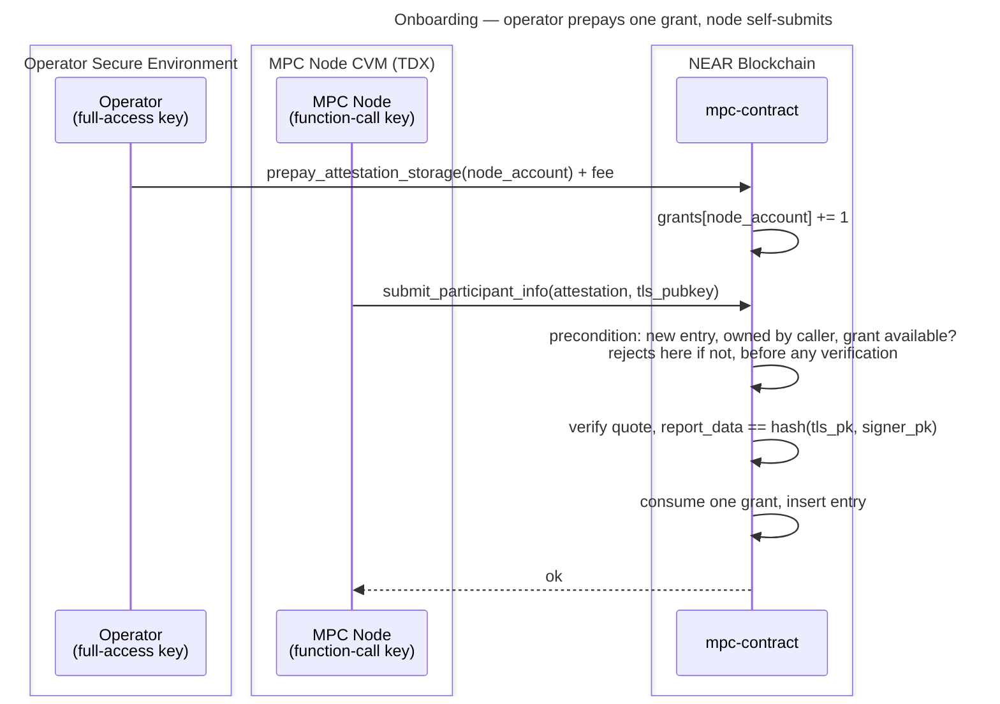

# Operator-Prepaid Attestation Storage

**Status:** Draft — for team review

Funding model for [#3972](https://github.com/near/mpc/issues/3972): the storage cost of an attestation entry moves off the contract's balance and onto whoever onboards the node, at the cost of one new operator step.

One prepayment buys one **grant** — permission for a node account to hold one attestation entry. The grant returns when that entry is reclaimed, so it is a slot the operator keeps rather than a per-attestation charge. No NEAR is ever refunded. Fee: **0.02 NEAR**.

## Background

`submit_participant_info` takes no deposit and the contract funds attestation storage itself. That is true of **every deployed version**, not only since [#3940](https://github.com/near/mpc/pull/3940): the deployed 3.13.0 contains charging code that always reads a zero delta because it measures before the write is flushed, and [#3714](https://github.com/near/mpc/pull/3714), the one version that genuinely required a deposit, never shipped.

So nobody pays. Any account can create unlimited entries, each costs the contract roughly 7× the submitter's gas, and once the balance no longer covers the contract's own storage it cannot write state at all — which halts signing. Full analysis in [#3972](https://github.com/near/mpc/issues/3972#issuecomment-5119758184).

Payment and submission must be **separate transactions**, because neither party can do both halves:

- A **function-call key cannot attach a deposit** — nearcore rejects it ahead of the receiver and method checks, and `validate_delegate_action_key` applies the same rule inside meta-transactions. So the node cannot pay.
- **`report_data` binds the quote to `env::signer_account_pk()`**, so an operator-signed submission fails verification. So the operator cannot submit.

## Design

### Grants

`available_attestation_grants: LookupMap<AccountId, u32>` — a count, never an amount. Prepay `+1`, new entry `−1`, reclaimed entry `+1`, row deleted at zero. The invariant, enforced by refusing to go below zero:

```text
entries an account holds  ≤  grants it has bought
```

Because grants are denominated in *entries*, re-pricing after a storage-price change affects only future grants and can never strand a sold one — the failure mode a NEAR-denominated balance would have.

The counter is **available** grants, not lifetime total, so `0` means either "never prepaid" or "prepaid, now backing an entry"; disambiguate with `get_tee_accounts`. Reclamation waits for the entry to expire (7 days), so an operator prepays for the nodes they run **plus a spare** — typically two: the live node and its migration target.

### API

| Method | Kind | Purpose |
|---|---|---|
| `prepay_attestation_storage(account_id)` | `#[payable]` | Grants `floor(attached / fee)`. Rejects below one fee, keeps any remainder. Permissionless — anyone may prepay for any account. |

Keeping the remainder deviates from the contract's usual `require_deposit` + `refund_to` pattern, deliberately: a grant is a discrete unit, so the leftover is at most one fee short of the next grant, and adding a transfer path to return sub-0.02 NEAR dust is not worth it. "No NEAR is ever returned" means exactly that — no withdrawal method, and no refund of an overpayment.
| `available_attestation_grants(account_id) -> u32` | view | Grants available. |
| `attestation_storage_fee() -> NearToken` | view | Current fee. |

Views are contract-only; operators read them with the NEAR CLI.

### Charging rules

Evaluated read-only at the top of `submit_participant_info` — before any verification, so an ungranted or unauthorised call never reaches the `Mock` checks or a `verify_quote` round trip — and applied at insert.

1. **Entry exists and this account owns it** — re-attestation. Updates in place, consumes nothing. Keys on *ownership*, not key presence: a presence-only test would classify someone else's key as "no grant needed".
2. **New entry** — consume one grant; reject if the account has none.
3. **Entry reclaimed** by `clean_invalid_attestations` — return one grant to its owner. There is exactly one removal site, so the counter cannot drift.

Consuming at insert means a failed attestation consumes nothing — nothing was stored, so nothing is owed — and keeps [#3991](https://github.com/near/mpc/issues/3991) unblocked, since no charge has to survive a failing callback.

Migration and multi-node operators need no special rule: prepay again. Hence no cap constant, no participant-status check, and no assumption about how many nodes share an account.

### Fee

0.02 NEAR, about 2.7× the floor. Figures are **charged** bytes — key and record overhead included — not borsh sizes:

| Component | Charged bytes | Cost |
|---|---|---|
| Worst-case entry: a `Mock` one at 604 (`Dstack` is 599) | 604 | 0.00604 NEAR |
| Grants-map row | ~130 | ~0.0013 NEAR |
| **Floor** | **~734** | **~0.0073 NEAR** |

The remainder is headroom, so a layout change cannot leave sold grants under-funded. Over-sizing costs nothing since the operator never gets it back; under-sizing silently reopens the drain. The 604 is pinned by `stored_attestation_entry__should_have_the_pinned_size` — a test, not a production constant. The fee itself is a governance-votable `Config` field, so it can be re-priced without a release.

### Flow



Without the prepayment the submission fails immediately and the node retries in a loop until granted.

## Operator UX

One new step in the [operator guide](../running-an-mpc-node-in-tdx-external-guide.md), after [Add the Node Account Key](../running-an-mpc-node-in-tdx-external-guide.md#add-the-node-account-key-to-your-account) and before [Submitting Participant Info](../running-an-mpc-node-in-tdx-external-guide.md#submitting-participant-info). Every other step is unchanged, including the off-chain `attestation-cli` check, which this design does not touch.

```bash
near contract call-function as-transaction \
  v1.signer prepay_attestation_storage \
  json-args '{"account_id":"<your-node-account>"}' \
  prepaid-gas '30.0 Tgas' attached-deposit '0.02 NEAR' \
  sign-as <your-operator-account> network-config mainnet sign-with-keychain send
```

Repeat once per node slot. Existing attested nodes need no action — they re-attest under rule 1.

Note the guide's [Submitting Participant Info](../running-an-mpc-node-in-tdx-external-guide.md#submitting-participant-info) still claims the call "will incur a cost (TBD, XXX NEAR)" and cites the closed #903. That is stale on `main` today, independent of this design.

## Decisions

| Decision | Chosen | Instead of | Why |
|---|---|---|---|
| Accounting | Grant counter | Per-account NEAR balance, NEP-145 shaped | No arithmetic, no amounts stored, and a fee change cannot strand a sold grant. |
| Multi-node / migration | Prepay per node | Free extra entry gated on `ongoing_migrations`; or a hard cap of N | Both needed a participant check or a magic number; repeating the prepayment needs neither. |
| Grant semantics | Capacity — reclaiming returns it | Consumable ticket | The contract got the storage back, so charging again charges twice. Also lets an operator re-provision on the grants they hold. |
| Refunds | None | Redeem unconsumed grants | ~0.02 NEAR; recycling covers the real need without moving money. |
| Fee source | Votable `Config` field | Derived from `storage_byte_cost` at call time; or a constant | Re-priceable without a release. Costs a state-schema change. |
| Consumption point | At insert | Up front, charging failures too | Nothing is stored on failure, so nothing is owed; keeps #3991 unblocked. |
| Map hygiene | Delete row at zero; keep grants when a node is kicked | Keep zero rows; or confiscate on removal from the set | Kicks are often temporary, so confiscating would force paying again to rejoin. |

## Alternatives not pursued

| Approach | Why not |
|---|---|
| Full-access node key so the node pays | Least privilege — an always-online key that can move funds. The reason this problem exists. |
| Meta-transactions (NEP-366) | `validate_delegate_action_key` applies the same deposit rule to inner actions. |
| Operator submits on the node's behalf | `report_data` binds to the signer, so it fails verification. |
| Gate `Attestation::Mock` off in production | Would remove the cheap vector, but mock attestations are still needed. |
| Cap entries per account | Implicit accounts are ~free and deletable, so a cap moves amplification only 7.2× → ~5.8×. |
| Owner-callable release returning a grant early | Removes the spare-grant need and reclaims storage sooner, but is another entry point that must refuse to evict a live participant. Revisit if the 7-day wait hurts. |
| Restrict submission to current-or-proposed participants | Not possible today — `vote_new_parameters` rejects proposals naming unattested participants, so attestation must come first. Would need a gate at the Running→Resharing transition. Worth its own issue: it removes the attack surface rather than pricing it. |

## Security

Every new entry consumes a paid grant, so the contract funds no new attestation storage and amplification drops below 1. Recycling does not weaken that — a grant returns only once its entry is gone, so `entries held ≤ grants bought` holds throughout. It does permit unlimited churn on a fixed number of grants, which is harmless because each cycle requires the previous entry to be reclaimed first.

Two accepted residuals:

- **Abandoned pre-upgrade entries yield a grant when swept**, since rule 3 cannot distinguish them from paid ones. Note who this does *not* benefit: an operator running a live node re-attests under rule 1, so its entry never fails re-verification, is never swept, and yields nothing — live operators get no grant and need none. The grants go to whoever *abandoned* an entry. Today that is a negligible set (14 entries on mainnet and 31 on testnet, nearly all live), but the exposure is precisely "abandoned entries present at deploy become permanent capacity", so the count must be checked at deploy rather than assumed. A count in the thousands would mean the still-open drain was exploited before the release, and those entries should be purged rather than granted.
- **The contract carries the price risk on sold grants**, bounded by the number outstanding. It stores counts, not purchase prices, so it cannot retro-price them; a future update can address this if the gap becomes material.

## Implementation notes

1. [#3785](https://github.com/near/mpc/pull/3785) has landed (`stamp_expiry_on_legacy_mocks`, `v3_13_0_state.rs:122`), so abandoned mock entries are already sweepable — no dependency to wait on. Reclaimability is not universal though: `TeeState::with_mocked_participant_attestations` still stores bare, non-expiring `Mock::Valid` sentinels at init, which never fail re-verification and so are never swept. Those stay contract-funded and never yield a grant.
2. **A state migration is required.** The grants map and the `Config` fee field both change `MpcContract`'s borsh layout: frozen snapshot module plus a `migrate()` arm the way `crates/contract/src/v3_13_0_state.rs` does it. Making the fee votable also needs the `ConfigExt` DTO plumbing in `crates/contract/src/dto_mapping.rs`, and both the borsh-schema and ABI snapshots regenerated.
3. **Re-validate the sweep gas budget.** Rule 3 adds a grants-map write per removed entry — a row *insert*, not an update, whenever the owner's row was deleted at zero — inside gas-bounded `clean_invalid_attestations`. Re-check `clean_invalid_attestations_tera_gas` and `RESHARE_CLEAN_INVALID_ATTESTATIONS_MAX_SCAN`, with a guard test of the kind [#3936](https://github.com/near/mpc/pull/3936) adds.
4. Check the stored-entry count at deploy, per [Security](#security).
5. Coordinate the runbook change with the release: operators onboarding after the upgrade must prepay or their node's submissions fail in a loop.

## Testing

- Re-attestation consumes nothing; a new entry consumes exactly one; no grant rejects; a TLS key owned by another account is rejected by the early check, before verification.
- A failed attestation consumes nothing and stores nothing, on both the sync and async paths.
- A reclaimed entry returns one grant to its owner, the row is deleted at zero, a kicked node keeps its grants, and the recycled grant is spendable.
- Sandbox, with a real function-call key: ungranted submission rejected, a second account prepays, the node's own zero-deposit submission succeeds; two prepayments allow two entries.
- Gas guard for the `clean_invalid_attestations` worst case: every scanned entry removed, every owner's row absent so each write is an insert.
