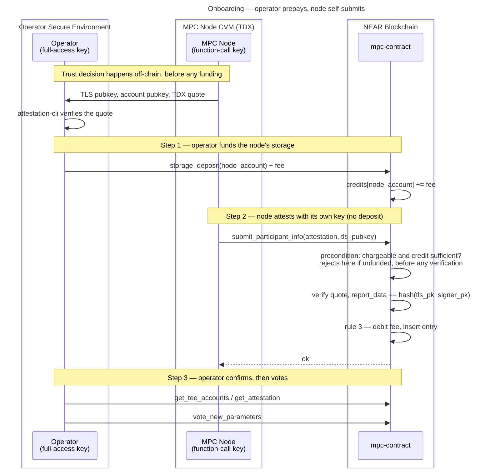

# Operator-Prepaid Attestation Storage

**Status:** Draft — for team review

This document designs the funding model tracked in [#3972](https://github.com/near/mpc/issues/3972): moving the storage cost of a stored attestation entry off the contract's balance and onto whoever onboards the node — by adding a single operational step in which the operator funds that storage — while keeping the node's deposit-less function-call access key able to self-attest.

## Background

Since [#3940](https://github.com/near/mpc/pull/3940), `submit_participant_info` takes no deposit and the contract funds attestation storage from its own balance. That is deliberate but unpriced: any account can create unlimited entries, each costing the contract roughly 7× what the submitter pays in gas, and exhausting the contract's balance stops it writing state, which halts signing. Measurements and the full drain analysis are in [#3972](https://github.com/near/mpc/issues/3972#issuecomment-5119758184).

Two protocol-level constraints shape every possible solution:

1. **A function-call access key cannot attach a deposit.** nearcore's `verify_function_call_permission` rejects it before the receiver and method checks:

   ```rust
   if fc.deposit > Balance::ZERO {
       return Err(InvalidAccessKeyError::DepositWithFunctionCall)
   }
   ```

   `FunctionCallPermission` has no field that could permit it — `allowance` covers gas and transaction fees only. Meta-transactions do not help: `validate_delegate_action_key` applies the same check to inner function-call actions.

2. **The quote binds to the submitter.** `report_data` is `hash(tls_public_key, account_public_key)`, where `account_public_key` comes from `env::signer_account_pk()`. A submission signed by an operator key produces different expected report data and fails verification. `assert_caller_is_signer()` also rules out a proxy contract.

Together these force the shape of the answer: **paying and submitting must be separate transactions.** The operator pays with a deposit-capable key; the node submits with its own restricted key.

## Goals

- Attestation storage for a new node is paid by whoever onboards it, not by the contract.
- The node continues to self-submit its first attestation and every re-attestation with its function-call key.
- Contract-funded attestation storage is bounded and attributable.
- Node migration and key rotation cost the operator nothing extra.

## Non-goals

- Refunds, bonds, or withdrawal of credit (see [Decisions](#decisions)).
- Changing the `report_data` binding.
- Gating `Attestation::Mock` — mock attestations are still needed.
- Reworking the voting model so that submission can be restricted to current-or-proposed participants. That is a stronger, orthogonal defence and belongs in its own issue; see [Alternatives not pursued](#alternatives-not-pursued).

## Assumptions

1. **One node per NEAR account.** The contract does not enforce this today — entries are keyed by `tls_public_key` and nothing caps entries per `account_id`. The per-account bound in this design depends on it. If an operator ever needs two live nodes under one account, the bound and the migration rule below both need revisiting.
2. **The operator verifies the node's quote off-chain before funding it**, using `attestation-cli` as the guide already instructs. The operator's trust decision therefore never depends on anything being on-chain, which is what makes the ordering in [Operator UX](#operator-ux) work.
3. **Mock attestation expiry ([#3785](https://github.com/near/mpc/pull/3785)) lands**, so abandoned entries — including paid ones for nodes that never join — become reclaimable rather than permanent.
4. **The storage price can change.** NEAR's `storage_amount_per_byte` is a protocol parameter, so the fee must be re-priceable without a contract release.

## Design overview

### New contract API

| Method | Kind | Purpose |
|---|---|---|
| `storage_deposit(account_id: AccountId)` | `#[payable]` | Credits the attached deposit to `account_id`'s attestation-storage balance. Permissionless — anyone may fund any account. |
| `storage_balance_of(account_id: AccountId) -> NearToken` | view | Remaining credit, so an operator can confirm funding landed before the node submits. |
| `attestation_storage_fee() -> NearToken` | view | The current per-entry fee, so tooling and the runbook do not hardcode it. |

Shape borrowed from [NEP-145](https://nomicon.io/Standards/StorageManagement) so it reads as a familiar pattern, but deliberately without `storage_withdraw` or `storage_unregister`.

### New state

```rust
// contract state
attestation_storage_credits: LookupMap<AccountId, NearToken>,

// Config, governance-votable
attestation_storage_fee: NearToken,
```

### Charging rules

The rules below decide *whether* a submission is chargeable. They are evaluated **twice**: once as a read-only precondition at the very top of `submit_participant_info`, before any verification work, and once authoritatively at insert. See [Check early, debit late](#check-early-debit-late).

1. **Existing entry, same account** — a re-attestation under a TLS key this account already owns. Updates in place, grows nothing, **charged nothing**. This is today's behaviour and is what keeps the node's function-call key working indefinitely.
2. **New entry, declared migration destination** — the account is a current participant *and* `ongoing_migrations[account_id]` names this exact TLS key. **Charged nothing.** This is the migration and key-rotation path.
3. **Any other new entry** — debit `attestation_storage_fee` from `attestation_storage_credits[account_id]`, and reject the submission if the credit is short. This covers an onboarding node's first attestation (the case the operator prepays for), a participant submitting a new TLS key that no declared destination matches, and any account submitting a fresh key it has no legitimate use for — the drain vector, now priced.

Rule 2's participant requirement is deliberate: a non-participant must never get a free entry, or the drain reopens. One consequence worth knowing is that a prospective node rotating its TLS key before it is voted in pays twice.

Rule 2 is bounded by existing state rather than by a new cap constant: `ongoing_migrations` is an `IterableMap<AccountId, DestinationNodeInfo>`, one declared destination per account, set only by `start_node_migration`, which itself requires the caller to already be a participant. So a participant can hold at most **two** entries — its live one plus one declared destination — and a non-participant can hold none for free.

### Check early, debit late

`submit_participant_info` evaluates the rules read-only before any verification and rejects a chargeable submission with short credit straight away. Everything they need is cheap to read there — submitted TLS key, the existing entry's owner, participant status, `ongoing_migrations[account_id]` — and verification is the expensive part, so an unfunded call never reaches the `Mock` checks or a `verify_quote` round trip.

The authoritative debit happens at insert, in the same receipt as the write. Both exist because a `Dstack` callback lands a block or more later, which makes the early check only a fast-fail guard: two concurrent submissions from one account could both pass it and only the first afford the fee.

Failed attempts are therefore not charged, which is correct rather than lenient — nothing is stored on failure, so the contract funds nothing. It also keeps [#3991](https://github.com/near/mpc/issues/3991) unblocked, since no charge or refund ever has to survive a failing callback. "Non-refundable" means a fee consumed by a successful insert is never returned, including when the entry is later swept.

### Flows

**Onboarding a new node** — the only flow where anyone pays.



If the operator skips step 1, step 2 fails immediately on insufficient credit — before any quote verification and before any cross-contract call — and the node retries in a loop until funded.

**Re-attestation** — the node resubmits on its 1-hour cadence, rule 1 applies, nothing is charged and the operator is not involved.

**Migration / key rotation** — unchanged from today, and free. The operator calls `start_node_migration` as it already does, which requires participant status and records the destination; the destination node then submits under the same account with its new TLS key and rule 2 applies, so no credit is needed. The account holds two entries for the duration — that is the bound — and after `conclude_node_migration` the participant's TLS key points at the destination and the old entry ages out under #3785.

## Operator UX

All section references below are to the [operator guide](../running-an-mpc-node-in-tdx-external-guide.md).

Its existing [Verify Node Attestation](../running-an-mpc-node-in-tdx-external-guide.md#verify-node-attestation) step is an **off-chain** check performed before the node's keys are used, so the operator already knows the node is genuine before anything is on-chain. The funding step slots in cleanly after it.

Placement: a new subsection under [Joining the MPC Cluster](../running-an-mpc-node-in-tdx-external-guide.md#joining-the-mpc-cluster), immediately **before** [Submitting Participant Info](../running-an-mpc-node-in-tdx-external-guide.md#submitting-participant-info).

| Step | Section | Change |
|---|---|---|
| 1 | [Retrieve the Node Account Key and P2P Key](../running-an-mpc-node-in-tdx-external-guide.md#retrieve-the-node-account-key-and-p2p-key) | unchanged |
| 2 | [Verify Node Attestation](../running-an-mpc-node-in-tdx-external-guide.md#verify-node-attestation) (off-chain, `attestation-cli`) | unchanged — the trust gate |
| 3 | [Add the Node Account Key to Your Account](../running-an-mpc-node-in-tdx-external-guide.md#add-the-node-account-key-to-your-account) | unchanged |
| 4 | **Fund Your Node's Attestation Storage** | **new** |
| 5 | [Submitting Participant Info](../running-an-mpc-node-in-tdx-external-guide.md#submitting-participant-info) | node does this automatically; drop the stale cost note |
| 6 | [Verifying the attestation was accepted](../running-an-mpc-node-in-tdx-external-guide.md#verifying-the-attestation-was-accepted) | unchanged |
| 7 | [Voting: (vote_new_parameters)](../running-an-mpc-node-in-tdx-external-guide.md#voting-vote_new_parameters) | unchanged |

The new step, signed with an operator key that has full access:

```bash
near contract call-function as-transaction \
  v1.signer storage_deposit \
  json-args '{"account_id":"<your-node-account>"}' \
  prepaid-gas '30.0 Tgas' attached-deposit '<fee> NEAR' \
  sign-as <your-operator-account> network-config mainnet sign-with-keychain send
```

Two guide fixes fall out of this:

- [Submitting Participant Info](../running-an-mpc-node-in-tdx-external-guide.md#submitting-participant-info) still reads *"Calling this method will incur a cost (TBD, XXX NEAR). Ensure this amount is available in your account. (TBD #903 — confirm exact cost)"*. That is already wrong on `main` — #3940 removed the cost and closed #903 — and it is exactly where the pointer to step 4 belongs. **This one is stale today and worth fixing independently of this design.**
- Existing attested nodes need no operator action at upgrade: their re-attestations hit rule 1. Only a brand-new TLS key needs funding, and migration is free.

## Decisions

| Decision | Chosen | Alternatives considered | Why |
|---|---|---|---|
| What identifies the funded party | Node's NEAR `account_id` | (a) TLS public key — mirrors the entry key 1:1, but a rotation needs a fresh deposit and the operator must know the key before funding. (b) `(account_id, tls_public_key)` pair — strictest binding, most state and most operator ceremony. | The operator already knows their node's account; the credit survives TLS-key rotation; one natural principal per node under the one-node-per-account assumption. |
| Unused credit | Non-refundable, kept by the contract | (a) `storage_withdraw` returning unconsumed credit — forgives operator mistakes and avoids dust, at the cost of a transfer path plus depositor tracking. (b) Exact-fee slot marker with no balance — no arithmetic and no unused credit, but a storage-price change between reading and calling makes the call fail. | Amounts are ~0.006 NEAR. Smallest surface, no transfer path, no depositor bookkeeping. |
| Fee sizing | Governance-votable `Config` field | (a) Computed at call time from `env::storage_byte_cost() * WORST_CASE_ENTRY_BYTES` — auto-adapts to the protocol storage price and needs no `Config` field or migration. (b) Hardcoded constant — simplest to read, goes stale if the storage price moves and needs a release to change. | Participants can re-price without a release. Cost: a `Config` field is a state-schema change requiring migration handling, the same cost that kept #3991 out of #3940. |
| Key rotation / migration | Free, gated on a declared migration destination | (a) Charge again and let the old entry expire — simplest rule, but the operator pays twice during every upgrade. (b) Charge again with no eviction — leans entirely on the expiry sweep and leaves entries per account unbounded. (c) Evict the account's prior entry on every new submission — free rotation and a hard bound of one, but breaks the migration window, which legitimately needs both entries live. | Migration genuinely needs two coexisting entries; `ongoing_migrations` already bounds that to one destination per participant, so the bound comes from existing state rather than a new constant. |
| When the fee is debited | At insert, in the same receipt | Up front in `submit_participant_info`, charging failed attempts too. | Nothing is stored on failure, so there is nothing to fund and nothing to recover. Avoids any charge that must survive a failing callback, which keeps #3991 unblocked. |

## Alternatives not pursued

Whole approaches that were considered and set aside, as distinct from the per-decision alternatives above.

| Approach | Why not |
|---|---|
| **Give the node a full-access key** so it can attach the deposit itself | Violates least privilege — the always-online key could then move funds and add keys. Rejected on security grounds, and the reason this problem exists at all. |
| **Meta-transactions (NEP-366)**: node signs a `DelegateAction`, operator relays and pays | Blocked by the protocol. `validate_delegate_action_key` applies the same `DepositWithFunctionCall` check to inner function-call actions, so a function-call key still cannot carry a deposit even when a relayer funds the transaction. |
| **Operator submits the attestation on the node's behalf** | Blocked by the quote. `report_data` binds to `env::signer_account_pk()`, so an operator-signed submission fails verification. Taking the account key as a parameter instead would break the binding and store a key that `lookup_node_id_by_signer_pk` cannot resolve. |
| **Gate `Attestation::Mock` off in production** | Would remove the cheap drain vector outright — an attacker would need a real TDX quote bound to their own account key per entry. Rejected because mock attestations are still needed. |
| **Cap entries per account** | Only marginal. Implicit accounts cost 0.00182 NEAR (recoverable via `DeleteAccount`) and 0.446 TGas to create, so with a cap of one the attacker pays ~0.00046 NEAR per entry against 0.00267 — amplification falls only 7.2× → ~5.8×. It triples transactions per entry, which is friction and more visible, but prepay makes it redundant. |
| **Restrict submission to current-or-proposed participants** (governance gate) | Not possible today: `vote_new_parameters` calls `reverify_and_cleanup_participants(proposal.participants(), …)` and rejects any proposal naming a participant without a valid attestation, so the order is forced — attest, then propose. Reordering to propose → submit → remaining votes would enable it, but the only production callers of that function are `vote_new_parameters` (proposed set) and `verify_tee` (current set); nothing validates the proposed set at the Running→Resharing transition, so a gate would have to be added there rather than simply relaxed at vote time. Worth its own issue — a governance gate removes the attack surface rather than pricing it, which is strictly stronger than any deposit. |
| **Refundable bond returned on deregistration** | Better operator economics, but the amount (~0.006 NEAR) does not justify the extra state and the refund path. |

## Security analysis

**Paid entries.** Each new entry outside the migration path costs the submitter at least `attestation_storage_fee`, which is sized at or above the worst-case entry cost. Amplification drops below 1, so spamming entries costs the attacker more than it costs the contract and the drain stops being profitable.

**Free entries.** Only a current participant with a declared destination can get one and `ongoing_migrations` holds one per account, so the total is bounded by participant count (≤ ~24 KB, ~0.24 NEAR at 40 participants), non-participants get none at all, and the sole residual — a participant sitting on a migration it never concludes — is visible on-chain and may already be covered by `cleanup_orphaned_node_migrations`.

## Rollout

1. Land [#3785](https://github.com/near/mpc/pull/3785) first or alongside, so abandoned entries — including paid ones for nodes that never join — are reclaimable.
2. Adding `Config.attestation_storage_fee` is a state-schema change; handle migration the way `crates/contract/src/v3_13_0_state.rs` handles prior `Config` changes.
3. No grandfathering needed: existing entries re-attest under rule 1 and are never charged.
4. Coordinate the runbook change with the release, since operators onboarding a new node after the upgrade must fund it first or the node's submissions will fail in a loop.

## Open questions

- **Initial fee value.** `WORST_CASE_ENTRY_BYTES` is 604, so 0.00604 NEAR at today's price; 0.01 NEAR gives ~1.65× headroom. Size it off the *mock* worst case (450 borsh bytes) rather than Dstack's 445 — the largest entry is a mock one.
- Should rule 2 also require the submitted signer key to match `DestinationNodeInfo::signer_account_pk`, or is the TLS-key match sufficient?
- Should the credit map entry be deleted when it reaches zero, to return its own ~130 bytes? If not, the fee should cover it.
- Does `cleanup_orphaned_node_migrations` already bound a stale declared destination, or is a timeout needed?
- Should `storage_balance_of` and `attestation_storage_fee` be added to the DTO/ABI surface for the node and CLI, or are they operator-only?

## Testing

- **Unit** — the charging-rule matrix: re-attestation free; migration destination free; new entry debited; new entry rejected when credit is short; non-participant cannot take the free path.
- **Unit** — a failed attestation debits nothing and stores nothing, on both the sync and async paths.
- **Sandbox** — end to end with a real function-call access key: unfunded submission rejected, `storage_deposit` by a second account, then the node's own zero-deposit submission succeeds.
- **Sandbox** — full migration: `start_node_migration`, destination submits free, `conclude_node_migration`, old entry reclaimable.
- **Bound** — with N participants all declaring migrations, contract-funded attestation storage stays ≤ N × worst-case entry.
