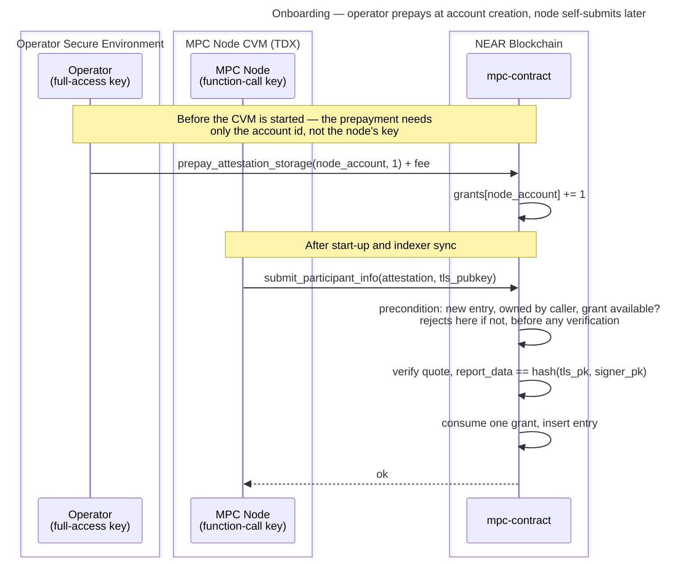

# Operator-Prepaid Attestation Storage

Funding model for [#3972](https://github.com/near/mpc/issues/3972): the storage cost of an attestation entry moves off the contract's balance and onto whoever onboards the node, at the cost of one new operator step.

One prepayment buys one **grant** — permission for a node account to hold one attestation entry. The grant returns when that entry is reclaimed, so it is a slot the operator keeps rather than a per-attestation charge. No NEAR is ever refunded. Fee: **0.02 NEAR**.

## Background

`submit_participant_info` takes no deposit and the contract funds attestation storage itself. That is true of **every deployed version**, not only since [#3940](https://github.com/near/mpc/pull/3940): the deployed 3.13.0 contains charging code that always reads a zero delta because it measures before the write is flushed, and [#3714](https://github.com/near/mpc/pull/3714), the one version that genuinely required a deposit, never shipped.

So nobody pays. Any account can create unlimited entries, each costs the contract roughly 7× the submitter's gas, and once the balance no longer covers the contract's own storage it cannot write state at all — which halts signing. Full analysis in [#3972](https://github.com/near/mpc/issues/3972#issuecomment-5119758184).

Payment and submission must be **separate transactions**, because neither party can do both halves:

- A **function-call key cannot attach a deposit** — nearcore rejects it ahead of the receiver and method checks, and `validate_delegate_action_key` applies the same rule inside meta-transactions. So the node cannot pay.
- **`report_data` binds the quote to `env::signer_account_pk()`**, so an operator-signed submission fails verification. So the operator cannot submit.

## Design

### Grants

`available_attestation_grants: IterableMap<AccountId, u32>` — a count (not an amount). Prepay `+1`, new entry `−1`, reclaimed entry `+1`, row deleted at zero. The invariant, enforced by refusing to go below zero:

```text
entries an account holds  ≤  grants it has bought
```

Because grants are denominated in *entries*, re-pricing after a storage-price change affects only future grants and can never strand a sold one — the failure mode a NEAR-denominated balance would have.

The counter is **available** grants, not lifetime total, so `0` means either "never prepaid" or "prepaid, now backing an entry"; disambiguate with `get_tee_accounts`. Reclamation waits for the entry to expire (7 days), so an operator prepays for the nodes they run **plus a spare** — typically two: the live node and its migration target.

### API

| Method | Kind | Purpose |
|---|---|---|
| `prepay_attestation_storage(account_id, grants)` | `#[payable]` | Adds `grants` to `account_id`. Requires an attached deposit of exactly `fee × grants` and rejects anything else, so there is no remainder to keep or refund. Permissionless — anyone may prepay for any account. |
| `available_attestation_grants(account_id) -> u32` | view | Grants available. |
| `attestation_storage_fee() -> NearToken` | view | **Not implemented — decided during implementation.** The fee is already returned by `config()`, and reading it is a manual step on a value that almost never changes, so a dedicated method does not earn a permanent place in the API ([#4011](https://github.com/near/mpc/pull/4011#discussion_r3688452375)). Adding it later is cheaper than removing it, so revisit if operators ask. |

An operator reads the current fee from `config()` and attaches the exact multiple — the fee is votable, so a number published in a doc instead would eventually produce failed transactions, not overpayments. "No NEAR is ever returned" therefore means simply: no withdrawal method.

### Charging rules

Evaluated read-only at the top of `submit_participant_info` — before any verification, so an ungranted or unauthorised call never reaches the `Mock` checks or a `verify_quote` round trip — and applied at insert.

1. **Entry exists and this account owns it** — re-attestation. Updates in place, consumes nothing. Keys on *ownership*, not key presence: a presence-only test would classify someone else's key as "no grant needed".
2. **New entry** — consume one grant; reject if the account has none. On the async `Dstack` path this is checked twice: once here, and again in `resolve_verification`, which runs a later receipt in which the grant may since have been consumed. Without the second check, two submissions from one account could both clear the first check and then store two entries against a single grant.
3. **Entry reclaimed** by `clean_invalid_attestations` — return one grant to its owner. There is exactly one removal site, so the counter cannot drift. This adds a grants-map write per removed entry — a row *insert*, not an update, whenever the owner's row was deleted at zero — inside a gas-bounded sweep, so `clean_invalid_attestations_tera_gas` and `RESHARE_CLEAN_INVALID_ATTESTATIONS_MAX_SCAN` need re-validating against the heavier per-entry cost — tracked in [#4035](https://github.com/near/mpc/issues/4035), where the budget already fell short of the scan limit before this change. Those two constants bound only the promise `vote_reshared` schedules: `clean_invalid_attestations` is permissionless and takes `max_scan` as a parameter, so an external caller is bound by neither.

Consuming at insert means a failed attestation consumes nothing — nothing was stored, so nothing is owed — and keeps [#3991](https://github.com/near/mpc/issues/3991) unblocked, since no charge has to survive a failing callback.

Migration and multi-node operators need no special rule: prepay again. Hence no cap constant, no participant-status check, and no assumption about how many nodes share an account.

### Fee

0.02 NEAR — a governance-votable `Config` field, not a constant — about 2.5× the floor. Both figures are **charged** bytes, not borsh sizes: `measure_stored_entry_bytes` and `measure_grant_row_bytes` (`crates/contract/src/lib.rs`) insert into the real map, flush, and take the `env::storage_usage()` delta, so record and key overhead are measured rather than estimated. A test pins each and forbids updating the numbers to make a failure pass.

| Component | Charged bytes | Cost |
|---|---|---|
| Worst-case entry: a `Mock` one at 604 (`Dstack` is 599) | 604 | 0.00604 NEAR |
| Grants-map row, worst case (64-char account) | 194 | 0.00194 NEAR |
| **Floor** | **798** | **0.00798 NEAR** |

The rest is headroom, so a layout change cannot leave sold grants under-funded. Over-sizing costs nothing — the margin is never returned — while under-sizing silently reopens the drain. Being a `Config` field, the fee can be re-priced without a release.

### Flow



Without the prepayment the submission fails immediately and the node retries in a loop until granted. Following the guide's order avoids that state entirely.

## Existing nodes

Already-attested nodes need no grant and their operators need to do nothing. Their entry is already stored, and re-attesting under the same key updates it in place for free (rule 1) — so an existing entry is a grant already spent: it holds a slot, and none was ever bought for it.

Nothing in the contract treats these entries specially: no migration step, no per-entry marker, no second map. That is the point — for existing nodes this change needs no code at all.

Accepted deliberately: if such an entry is later swept, rule 3 hands its owner a grant they never bought. Negligible at 14 entries on mainnet and 31 on testnet, but check the count before deploying — thousands would mean the drain was exploited first, and those entries should be purged rather than left to become grants.

## Operator UX

One new step in the [operator guide](../running-an-mpc-node-in-tdx-external-guide.md), right after [Create a NEAR Account for Your Node](../running-an-mpc-node-in-tdx-external-guide.md#create-a-near-account-for-your-node) — the operator already holds that account's full-access key there, and `prepay_attestation_storage` needs only the account id. That is well before the CVM is configured and started, before the node account key is retrieved, and before it is added, so the node never starts into an ungranted state. Every other step is unchanged, including the off-chain `attestation-cli` check, which this design does not touch.

First read the current fee — `attestation_storage_fee_millinear` in the config:

```bash
near contract call-function as-read-only \
  v1.signer config json-args '{}' network-config mainnet now
```

Then prepay that many multiples of it:

```bash
near contract call-function as-transaction \
  v1.signer prepay_attestation_storage \
  json-args '{"account_id":"<your-node-account>","grants":2}' \
  prepaid-gas '30.0 Tgas' attached-deposit '0.04 NEAR' \
  sign-as <your-operator-account> network-config mainnet sign-with-keychain send
```

Ask for as many grants as the operator runs nodes, plus the spare — the example buys two. Existing attested nodes need no action; they re-attest under rule 1.

## Decisions

| Decision | Chosen | Instead of | Why |
|---|---|---|---|
| Accounting | Grant counter | Per-account NEAR balance, NEP-145 shaped | No arithmetic, no amounts stored, and a fee change cannot strand a sold grant. |
| Multi-node / migration | Prepay per node | Free extra entry gated on `ongoing_migrations`; or a hard cap of N | Both needed a participant check or a magic number; repeating the prepayment needs neither. |
| Grant semantics | Capacity — the grant returns when the entry is swept | Consumable ticket | The contract got the storage back, so charging again charges twice. Expiry alone does not return it, which is why an operator keeps a spare. |
| Refunds | None | Redeem unconsumed grants | ~0.02 NEAR; recycling covers the real need without moving money. |
| Fee source | Votable `Config` field | Derived from `storage_byte_cost` at call time; or a constant | Re-priceable without a release. Costs a state migration — the fee field and the grants map both change `MpcContract`'s borsh layout — plus `ConfigExt` DTO plumbing and regenerated borsh-schema and ABI snapshots. |
| Consumption point | At insert | Up front, charging failures too | Nothing is stored on failure, so nothing is owed; keeps #3991 unblocked. |
| Map hygiene | Delete row at zero; keep grants when a node is kicked | Keep zero rows; or confiscate on removal from the set | Kicks are often temporary, so confiscating would force paying again to rejoin. |

## Alternatives not pursued

| Approach | Why not |
|---|---|
| Full-access node key so the node pays | Least privilege — an always-online key that can move funds. The reason this problem exists. |
| Meta-transactions (NEP-366) | `validate_delegate_action_key` applies the same deposit rule to inner actions. |
| Operator submits on the node's behalf | `report_data` binds to the signer, so it fails verification. |
| Gate `Attestation::Mock` off in production | Would remove the cheap vector, but mock attestations are still needed. |
| Cap entries per account | Implicit accounts are ~free and deletable, so a cap moves amplification only 7.2× → ~5.8×. |
| Owner-callable release returning a grant early | Removes the spare-grant need and reclaims storage sooner, but is another entry point that must refuse to evict a live participant. Revisit if the 7-day wait hurts. |
| Restrict submission to current-or-proposed participants | Not possible today — `vote_new_parameters` rejects proposals naming unattested participants, so attestation must come first. Would need a gate at the Running→Resharing transition. Worth its own issue: it removes the attack surface rather than pricing it. |

## Security

Every new entry consumes a paid grant, so the contract funds no new attestation storage and amplification drops below 1. Recycling does not weaken that — a grant returns only once its entry is gone, so `entries held ≤ grants bought` holds throughout, for every entry created after this ships (see [Existing nodes](#existing-nodes) for the ones that predate it). It does permit unlimited churn on a fixed number of grants, which is harmless because each cycle requires the previous entry to be reclaimed first.

One accepted residual: **if storage gets more expensive, grants already sold may not cover their entry** — the contract absorbs the difference, bounded by the number of grants outstanding. It stores counts, not purchase prices, so sold grants cannot be re-priced; revisit if the gap becomes material.
