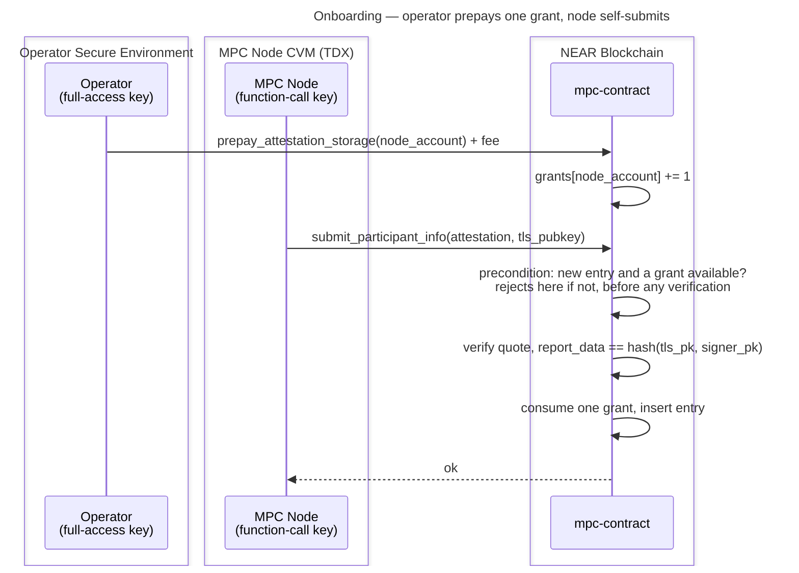

# Operator-Prepaid Attestation Storage

**Status:** Draft — for team review

This document designs the funding model tracked in [#3972](https://github.com/near/mpc/issues/3972): moving the storage cost of a stored attestation entry off the contract's balance and onto whoever onboards the node — by adding a single operational step in which the operator prepays for that storage — while keeping the node's deposit-less function-call access key able to self-attest.

One prepayment buys one **grant**: permission for a node account to store one attestation entry. An operator running two nodes prepays twice. Nothing is refunded, and the contract never records how much anyone paid — only how many grants they hold.

## Background

Since [#3940](https://github.com/near/mpc/pull/3940), `submit_participant_info` takes no deposit and the contract funds attestation storage from its own balance. That is deliberate but unpriced: any account can create unlimited entries, each costing the contract roughly 7× what the submitter pays in gas, and exhausting the contract's balance stops it writing state, which halts signing. Measurements and the full drain analysis are in [#3972](https://github.com/near/mpc/issues/3972#issuecomment-5119758184).

Two protocol-level constraints shape every possible solution:

1. **A function-call access key cannot attach a deposit.** nearcore's `verify_function_call_permission` rejects it before the receiver and method checks:

   ```rust
   if fc.deposit > Balance::ZERO {
       return Err(InvalidAccessKeyError::DepositWithFunctionCall)
   }
   ```

   `FunctionCallPermission` has no field that could permit it — `allowance` covers gas and transaction fees only. Meta-transactions do not help: `validate_delegate_action_key` applies the same check to inner function-call actions.

2. **The quote binds to the submitter.** `report_data` is `hash(tls_public_key, account_public_key)`, where `account_public_key` comes from `env::signer_account_pk()`. A submission signed by an operator key produces different expected report data and fails verification. `assert_caller_is_signer()` also rules out a proxy contract.

Together these force the shape of the answer: **paying and submitting must be separate transactions.** The operator pays with a deposit-capable key; the node submits with its own restricted key.

## Goals

- A new attestation entry is paid for by whoever onboards the node, not by the contract.
- The node keeps self-submitting its first attestation and every re-attestation with its function-call key.
- No new unbounded growth vector, and no per-operator balance to reconcile.

## Non-goals

- Refunds, withdrawals, or bonds.
- Changing the `report_data` binding.
- Gating `Attestation::Mock` — mock attestations are still needed.
- Reworking the voting model so submission can be restricted to current-or-proposed participants. Stronger and orthogonal; see [Alternatives not pursued](#alternatives-not-pursued).

## Design

### Grants, not balances

A grant is a count, not an amount. `prepay_attestation_storage` increments a per-account counter; storing a new entry decrements it. The contract never stores NEAR amounts per operator, so there is no arithmetic to get wrong and nothing to reconcile.

The counter also decouples granted capacity from the NEAR price. Grants are denominated in *entries*, so raising the fee after a storage-price change affects only the cost of future grants — it never strands an operator whose existing grant is suddenly worth less than an entry. A balance model has to handle exactly that case.

### Contract API

| Method | Kind | Purpose |
|---|---|---|
| `prepay_attestation_storage(account_id: AccountId)` | `#[payable]` | Grants `floor(attached_deposit / fee)` entries to `account_id`. Rejects below one fee. Any remainder is kept. Permissionless — anyone may prepay for any account. |
| `attestation_grants(account_id: AccountId) -> u32` | view | Grants remaining, so an operator can confirm prepayment landed before the node submits. |
| `attestation_storage_fee() -> NearToken` | view | Current per-entry fee, so tooling and the runbook do not hardcode it. |

### New state

```rust
// contract state
attestation_grants: LookupMap<AccountId, u32>,

// Config, governance-votable
attestation_storage_fee: NearToken,
```

### Charging rules

1. **Existing entry, same account** — a re-attestation under a TLS key this account already owns. Updates in place, grows nothing, **consumes no grant**. This is today's behaviour and is what keeps the node's function-call key working indefinitely.
2. **New entry** — consume one grant, and reject the submission if the account holds none.

Migration and multi-node operators need no special rule: an operator who wants a second live node prepays a second grant. That is the whole mechanism, and it is why this design needs no cap constant, no participant-status check, and no assumption about how many nodes share an account.

### Check early, consume late

`submit_participant_info` evaluates the rules read-only before any verification and rejects a new-entry submission with no grant straight away. Both inputs are cheap to read there — the submitted TLS key and the existing entry's owner — and verification is the expensive part, so an ungranted call never reaches the `Mock` checks or a `verify_quote` round trip.

The grant is consumed at insert, in the same receipt as the write. Both steps exist because a `Dstack` callback lands a block or more later, which makes the early check only a fast-fail guard: two concurrent submissions from one account could both pass it and only the first could then consume the last grant.

Failed attempts consume nothing, which is correct rather than lenient — nothing is stored on failure, so the contract funds nothing. It also keeps [#3991](https://github.com/near/mpc/issues/3991) unblocked, since no charge or refund ever has to survive a failing callback.

### Flow



If the operator skips the prepayment, the submission fails immediately — before any quote verification and before any cross-contract call — and the node retries in a loop until granted.

Re-attestation needs no operator involvement: the node resubmits on its 1-hour cadence, rule 1 applies, no grant is consumed.

## Operator UX

Every step below **already exists** except the prepayment, which is the one addition this design makes. All references are to the [operator guide](../running-an-mpc-node-in-tdx-external-guide.md).

| Step | Section | Status |
|---|---|---|
| 1 | [Retrieve the Node Account Key and P2P Key](../running-an-mpc-node-in-tdx-external-guide.md#retrieve-the-node-account-key-and-p2p-key) | existing |
| 2 | [Verify Node Attestation](../running-an-mpc-node-in-tdx-external-guide.md#verify-node-attestation) — off-chain, `attestation-cli` | existing |
| 3 | [Add the Node Account Key to Your Account](../running-an-mpc-node-in-tdx-external-guide.md#add-the-node-account-key-to-your-account) | existing |
| 4 | **Prepay Your Node's Attestation Storage** | **new — the only addition** |
| 5 | [Submitting Participant Info](../running-an-mpc-node-in-tdx-external-guide.md#submitting-participant-info) | existing; node does this automatically |
| 6 | [Verifying the attestation was accepted](../running-an-mpc-node-in-tdx-external-guide.md#verifying-the-attestation-was-accepted) | existing |
| 7 | [Voting: (vote_new_parameters)](../running-an-mpc-node-in-tdx-external-guide.md#voting-vote_new_parameters) | existing |

Step 4 slots in after step 3 only because the node's submission in step 5 depends on it. It is not gated on step 2 — that off-chain check is existing practice and is mentioned here solely to show that nothing in this design changes it.

```bash
near contract call-function as-transaction \
  v1.signer prepay_attestation_storage \
  json-args '{"account_id":"<your-node-account>"}' \
  prepaid-gas '30.0 Tgas' attached-deposit '<fee> NEAR' \
  sign-as <your-operator-account> network-config mainnet sign-with-keychain send
```

Operators running a migration or testing several nodes repeat step 4 once per node. Existing attested nodes need no action at upgrade: their re-attestations hit rule 1.

`docs/running-an-mpc-node-in-tdx-external-guide.md` at [Submitting Participant Info](../running-an-mpc-node-in-tdx-external-guide.md#submitting-participant-info) still reads *"Calling this method will incur a cost (TBD, XXX NEAR)… (TBD #903 — confirm exact cost)"*. That is already wrong on `main` — #3940 removed the cost and closed #903 — and it is where the pointer to step 4 belongs. Stale today, worth fixing independently of this design.

## Decisions

| Decision | Chosen | Alternatives considered | Why |
|---|---|---|---|
| Grant counter vs. balance | Per-account grant counter | Full storage-credit accounting — a `LookupMap<AccountId, NearToken>` debited per entry, NEP-145 shaped. See [Alternatives not pursued](#alternatives-not-pursued). | No arithmetic, no per-operator amounts stored, and a fee change cannot strand an existing grant. Simpler for operators to reason about: one prepayment, one node. |
| Multi-node and migration | One prepayment per node | (a) A free extra entry gated on a declared migration destination in `ongoing_migrations`. (b) A hard cap of N nodes per participant. | (a) needed a participant-status check and assumed one node per account, and still broke for operators testing several nodes. (b) hardcodes a magic number. Repeating the prepayment needs neither. |
| Refunds | None | Redeem unconsumed grants and evict entries. | Amounts are ~0.01 NEAR; not worth the logic or the eviction semantics. Raised by @netrome — see [Open questions](#open-questions) for the garbage-accumulation half of that concern. |
| Fee sizing | Governance-votable `Config` field | (a) Computed at call time from `env::storage_byte_cost() * WORST_CASE_ENTRY_BYTES`, needing no `Config` field or migration. (b) Hardcoded constant. | Participants can re-price after a storage-price change without a release. Cost: a `Config` field is a state-schema change requiring migration handling. |
| When the grant is consumed | At insert, in the same receipt | Up front in `submit_participant_info`, consuming on failed attempts too. | Nothing is stored on failure, so there is nothing to fund or recover. Avoids any charge that must survive a failing callback, keeping #3991 unblocked. |

## Alternatives not pursued

| Approach | Why not |
|---|---|
| **Full storage-credit accounting** — per-account NEAR balance, debited per entry, NEP-145 shaped | The original draft of this document. Rejected as more general than the problem needs: it stores an amount per operator that nothing reads back, requires debit arithmetic and a short-credit path, and leaves an operator's credit stranded if the fee rises above what they deposited. A counter has none of those. |
| **Give the node a full-access key** so it can attach the deposit itself | Violates least privilege — the always-online key could then move funds and add keys. The reason this problem exists at all. |
| **Meta-transactions (NEP-366)**: node signs a `DelegateAction`, operator relays and pays | Blocked by the protocol. `validate_delegate_action_key` applies the same `DepositWithFunctionCall` check to inner function-call actions. |
| **Operator submits the attestation on the node's behalf** | Blocked by the quote. `report_data` binds to `env::signer_account_pk()`, so an operator-signed submission fails verification. |
| **Gate `Attestation::Mock` off in production** | Would remove the cheap drain vector outright, but mock attestations are still needed. |
| **Cap entries per account** | Only marginal. Implicit accounts cost 0.00182 NEAR (recoverable via `DeleteAccount`) and 0.446 TGas to create, so a cap of one moves amplification just 7.2× → ~5.8×. Prepayment makes it redundant. |
| **Restrict submission to current-or-proposed participants** (governance gate) | Not possible today: `vote_new_parameters` rejects a proposal naming any participant without a valid attestation, so the order is forced — attest, then propose. Reordering would enable it, but nothing validates the proposed set at the Running→Resharing transition, so a gate would have to be added there. Worth its own issue: a governance gate removes the attack surface rather than pricing it. |

## Security analysis

Every new entry consumes a grant, and every grant was paid for at or above the worst-case entry cost, so the contract funds no new attestation storage at all. Re-attestations are free but grow nothing. The drain closes exactly: creating N entries costs N fees, and amplification drops below 1.

Entries predating the upgrade remain contract-funded and are reclaimable under [#3785](https://github.com/near/mpc/pull/3785).

## Rollout

1. Land [#3785](https://github.com/near/mpc/pull/3785) first or alongside, so abandoned entries — including granted ones for nodes that never join — are reclaimable.
2. Adding `Config.attestation_storage_fee` is a state-schema change; handle migration the way `crates/contract/src/v3_13_0_state.rs` handles prior `Config` changes.
3. No grandfathering needed: existing entries re-attest under rule 1 and consume nothing.
4. Coordinate the runbook change with the release — operators onboarding a node after the upgrade must prepay or the node's submissions fail in a loop.

## Open questions

- **Should a grant be returned when an entry is reclaimed?** Raised by @gilcu3: an operator experimenting with TDX nodes burns a grant per test node and must either prepay again or wait out the TTL. Recycling the grant when `clean_invalid_attestations` removes an entry costs one increment in the sweep, refunds capacity rather than money, and matches the economics — the fee bought storage, and the storage came back. Recommended, but it was not settled in the meeting.
- Should the map entry be deleted when a counter reaches zero, and should grants be dropped when a node is kicked from the network? Addresses @netrome's garbage-accumulation concern without adding a refund path.
- **Initial fee value.** `WORST_CASE_ENTRY_BYTES` is 604, so 0.00604 NEAR at today's price; 0.01 NEAR gives ~1.65× headroom. Size it off the *mock* worst case (450 borsh bytes), not Dstack's 445 — the largest entry is a mock one.
- Should `prepay_attestation_storage` accept several grants in one call (`floor(attached / fee)`, as specified above) or exactly one per call?
- Should `attestation_grants` and `attestation_storage_fee` be added to the DTO/ABI surface for the node and CLI, or are they operator-only?

## Testing

- **Unit** — re-attestation consumes nothing; a new entry consumes exactly one grant; a new entry with no grant is rejected; grants are per account and not transferable.
- **Unit** — a failed attestation consumes nothing and stores nothing, on both the sync and async paths.
- **Sandbox** — end to end with a real function-call access key: ungranted submission rejected, `prepay_attestation_storage` by a second account, then the node's own zero-deposit submission succeeds.
- **Sandbox** — two prepayments let one account hold two entries, as a migration would.
- **Bound** — total attestation entries never exceed total grants issued.
