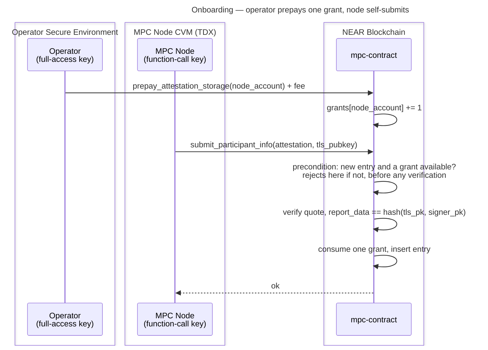

# Operator-Prepaid Attestation Storage

**Status:** Draft — for team review

This document designs the funding model tracked in [#3972](https://github.com/near/mpc/issues/3972): moving the storage cost of a stored attestation entry off the contract's balance and onto whoever onboards the node — by adding a single operational step in which the operator prepays for that storage — while keeping the node's deposit-less function-call access key able to self-attest.

One prepayment buys one **grant**: permission for a node account to store one attestation entry. **A grant comes back when the entry it paid for is reclaimed**, so a grant is a slot the operator keeps rather than a one-time charge. Reclamation waits for the entry to expire, so in practice an operator prepays for the nodes they run plus a spare — typically two: the live node and the one they are migrating to. No NEAR is ever refunded, and the contract records only how many unused grants an account has left.

## Background

`submit_participant_info` takes no deposit, and the contract funds attestation storage from its own balance. That has been true of **every contract version ever deployed**, not just since [#3940](https://github.com/near/mpc/pull/3940). The deployed 3.13.0 does contain charging code, but it never collects: it measures the storage delta before the write is flushed, so the delta reads as zero and the caller is charged nothing. The one version that genuinely required a deposit, [#3714](https://github.com/near/mpc/pull/3714), never shipped. #3940 simply made the existing behaviour intentional.

The problem is that nobody pays for that storage:

- Any account can create unlimited entries.
- Each entry costs the contract roughly 7× what the submitter spends on gas, so draining the balance costs an attacker far less than it costs us.
- Once the balance no longer covers the contract's own storage, the contract cannot write state at all — which halts signing.

Measurements and the full drain analysis are in [#3972](https://github.com/near/mpc/issues/3972#issuecomment-5119758184).

Two protocol-level constraints shape every possible solution:

1. **A function-call access key cannot attach a deposit.** nearcore's `verify_function_call_permission` rejects it before the receiver and method checks:

   ```rust
   if fc.deposit > Balance::ZERO {
       return Err(InvalidAccessKeyError::DepositWithFunctionCall)
   }
   ```

   `FunctionCallPermission` has no field that could permit it — `allowance` covers gas and transaction fees only. Meta-transactions do not help: `validate_delegate_action_key` applies the same check to inner function-call actions.

2. **The quote binds to the submitter.** `report_data` is `hash(tls_public_key, account_public_key)`, where `account_public_key` comes from `env::signer_account_pk()`. A submission signed by an operator key produces different expected report data and fails verification. `assert_caller_is_signer()` also rules out a proxy contract.

Together these force the shape of the answer: **paying and submitting must be separate transactions.** The operator pays with a deposit-capable key; the node submits with its own restricted key.

## Goals

- A new attestation entry is paid for by whoever onboards the node, not by the contract.
- The node keeps self-submitting its first attestation and every re-attestation with its function-call key.
- An operator prepays for the nodes they run plus a spare, and does not pay again for routine rotation or migration.
- No new unbounded growth vector, and no per-operator balance to reconcile.

## Non-goals

- Refunds, withdrawals, or bonds.
- Changing the `report_data` binding.
- Gating `Attestation::Mock` — mock attestations are still needed.
- Reworking the voting model so submission can be restricted to current-or-proposed participants. Stronger and orthogonal; see [Alternatives not pursued](#alternatives-not-pursued).

## Design

### Grants, not balances

A grant is a count, not an amount. `prepay_attestation_storage` increments a per-account counter, storing a new entry decrements it, and reclaiming an entry increments it back. The contract never stores NEAR amounts per operator, so there is no arithmetic to get wrong and nothing to reconcile.

A grant is therefore **capacity to hold one entry**, not a one-time ticket. The invariant is:

```text
entries an account currently holds  ≤  grants that account has bought
```

Recycling the grant on reclamation is what makes that work, and it earns its keep twice over:

- **Fairness** — the fee bought storage. Once the contract has that storage back, charging again for the next entry would be charging twice for the same thing.
- **Operator experience** — a grant is bought once per node slot rather than once per re-provisioning. An operator prepays for the nodes they run plus a spare and then keeps rotating, migrating and re-provisioning on those grants indefinitely. Without recycling, every new CVM is a fresh purchase and a fresh thing to remember.

The spare is needed because a grant returns only once the entry it paid for has become invalid and been swept, which takes up to `DEFAULT_EXPIRATION_DURATION_SECONDS` (7 days). A node re-provisioned with fresh keys needs its grant immediately, so an operator running one node holds two grants, and one running three holds four. This is a deliberate trade: no explicit release method, at the cost of one spare grant. See [Alternatives not pursued](#alternatives-not-pursued).

**No NEAR is ever returned.** Recycling gives back capacity, never money: a deposit is consumed permanently the moment it is made, and the only thing that ever comes back is the right to store another entry. There is no withdrawal path and none is planned.

The counter also decouples granted capacity from the NEAR price. Grants are denominated in *entries*, so raising the fee after a storage-price change affects only the cost of future grants — it never strands an operator whose existing grant is suddenly worth less than an entry. A balance model has to handle exactly that case.

### Contract API

| Method | Kind | Purpose |
|---|---|---|
| `prepay_attestation_storage(account_id: AccountId)` | `#[payable]` | Grants `floor(attached_deposit / fee)` entries to `account_id`. Rejects below one fee. Any remainder is kept. Permissionless — anyone may prepay for any account. |
| `available_attestation_grants(account_id: AccountId) -> u32` | view | Grants **available** — bought, minus those currently backing an entry. An operator checks it between prepaying and the node's first submission. Lifetime total is not tracked; see below. |
| `attestation_storage_fee() -> NearToken` | view | Current per-entry fee, so tooling and the runbook do not hardcode it. |

### New state

The counter holds **available** grants, not the lifetime number bought:

```text
available  =  bought  -  entries currently held
```

Prepaying increments it, storing an entry decrements it, reclaiming an entry increments it back. The contract keeps it non-negative by rejecting a new entry at zero, which is how it enforces the invariant above — so `bought` and `entries held` never need storing separately, and nothing in the design reads them.

A consequence for operators: because the row is deleted at zero, a return of `0` is ambiguous on its own — it means either "never prepaid" or "prepaid, and the grant is now backing an entry". Disambiguate with `get_tee_accounts`: zero grants *and* no entry for your node means you still need to prepay; zero grants *with* an entry present is the normal steady state.

```rust
// contract state
available_attestation_grants: LookupMap<AccountId, u32>,

// Config, governance-votable
attestation_storage_fee: NearToken,
```

### What the fee has to cover

The fee is not just the attestation entry. Prepaying also creates the operator's row in the grants map, which is itself contract-funded storage:

All figures below are **charged storage** — the bytes the runtime actually bills, including the map key and record overhead, not the borsh size of the value alone.

| Component | Charged bytes | At today's storage price |
|---|---|---|
| Attestation entry, worst case | 604 | 0.00604 NEAR |
| Grants-map row — account id, counter, record overhead | ~130 | ~0.0013 NEAR |
| **Subtotal** | **~734** | **~0.0073 NEAR** |

The 604 comes from `stored_attestation_entry__should_have_the_pinned_size`, which pins it in a `#[cfg(test)]` module — it is a test-enforced figure, not a production constant, and because the fee is a `Config` value rather than derived at call time, nothing in the contract reads it. The test is what stops a schema change from silently invalidating the fee.

The 604 is the larger of the two attestation variants: a worst-case `Mock` entry charges 604 bytes and a `Dstack` one 599, so the fee must be sized off the mock branch for as long as `Attestation::Mock` is accepted. (Their borsh *values* are 450 and 445 bytes; the difference is key and record overhead, which is why the charged figure is the one that matters here.)

On top of that the fee needs headroom for future layout growth, since a schema change that grows either structure must not leave already-issued grants under-funded. **The fee is 0.02 NEAR**, roughly 2.7× the floor. 0.01 NEAR would leave only ~1.4×, which is thin for a value governance would rather not re-vote often.

The margin is deliberately one-directional: the operator never gets any of it back, so over-sizing the fee costs the contract nothing and under-sizing it silently reintroduces the drain this design exists to close.

### Charging rules

1. **Existing entry, same account** — a re-attestation under a TLS key this account already owns. Updates in place, grows nothing, **consumes no grant**. This is today's behaviour and is what keeps the node's function-call key working indefinitely.
2. **New entry** — consume one grant, and reject the submission if the account holds none.
3. **Entry reclaimed** — when `clean_invalid_attestations` removes an entry, return one grant to the account that owned it. The contract has exactly one removal site, so the counter cannot drift out of step with the entries it tracks.

Two consequences for entries that predate the upgrade, both intentional and needing no extra code:

- **They keep working with no grant.** An existing node re-attesting under its existing TLS key hits rule 1, so it consumes nothing and no operator has to prepay to stay attested.
- **They yield a grant when swept.** Rule 3 does not distinguish a legacy entry from a paid one, so as pre-upgrade entries expire their owners receive one grant each. That is a deliberate grandfather: it is a small, bounded gift to the operators already running nodes — 14 entries on mainnet and 31 on testnet at the time of writing. The exposure is exactly "entries present at deploy time become permanent capacity", so the entry count should be sanity-checked at deploy rather than assumed; see [Rollout](#rollout).

Rule 1 turns on **ownership, not key presence**. The early precondition check must compare the stored entry's `account_id` against the submitter, not merely test whether the TLS key exists: a submission targeting someone else's key would otherwise be classified as "existing entry, no grant needed", pass the early check, run verification, and only then fail on `TlsKeyOwnedByOtherAccount`. Comparing the owner both classifies correctly and fails before any verification gas is spent.

Rule 3 has a gas cost worth sizing before implementation. It adds a grants-map write for every entry the sweep removes, and that write is a row *insert* — not an update — whenever the owner's row was previously deleted at zero. `clean_invalid_attestations` is gas-bounded and its budget was set for removals alone, so both `clean_invalid_attestations_tera_gas` and the `RESHARE_CLEAN_INVALID_ATTESTATIONS_MAX_SCAN` default need re-validating against the heavier per-entry cost, with a gas-budget guard test of the kind [#3936](https://github.com/near/mpc/pull/3936) adds for `clean_expired_launcher_hashes`.

When a counter reaches zero its row is deleted rather than stored as `0`, so the map does not accumulate rows for accounts that hold nothing. Grants are *not* dropped when a node leaves the participant set: kicks are frequently temporary — an expired attestation, a node mid-upgrade — and confiscating prepaid capacity would force an operator to pay again merely to rejoin.

Migration and multi-node operators need no special rule: an operator who wants a second live node prepays a second grant. That is the whole mechanism, and it is why this design needs no cap constant, no participant-status check, and no assumption about how many nodes share an account.

### Check early, consume late

`submit_participant_info` checks for an available grant before doing any verification, so an ungranted call never reaches the `Mock` checks or a `verify_quote` round trip. The grant is consumed at insert, so a submission that fails verification consumes nothing — nothing was stored, so nothing is owed.

The early check is a fast-fail guard, not the enforcement: a `Dstack` callback lands a block or more later, so two concurrent submissions could both pass it and only the first consume the last grant. Consuming at insert also keeps [#3991](https://github.com/near/mpc/issues/3991) unblocked, since no charge has to survive a failing callback.

### Flow



If the operator skips the prepayment, the submission fails immediately — before any quote verification and before any cross-contract call — and the node retries in a loop until granted.

Re-attestation needs no operator involvement: the node resubmits on its 1-hour cadence, rule 1 applies, no grant is consumed.

## Operator UX

Every step below **already exists** except the prepayment, which is the one addition this design makes. All references are to the [operator guide](../running-an-mpc-node-in-tdx-external-guide.md).

| Step | Section | Status |
|---|---|---|
| 1 | [Retrieve the Node Account Key and P2P Key](../running-an-mpc-node-in-tdx-external-guide.md#retrieve-the-node-account-key-and-p2p-key) | existing |
| 2 | [Verify Node Attestation](../running-an-mpc-node-in-tdx-external-guide.md#verify-node-attestation) — off-chain, `attestation-cli` | existing |
| 3 | [Add the Node Account Key to Your Account](../running-an-mpc-node-in-tdx-external-guide.md#add-the-node-account-key-to-your-account) | existing |
| 4 | **Prepay Your Node's Attestation Storage** | **new — the only addition** |
| 5 | [Submitting Participant Info](../running-an-mpc-node-in-tdx-external-guide.md#submitting-participant-info) | existing; node does this automatically |
| 6 | [Verifying the attestation was accepted](../running-an-mpc-node-in-tdx-external-guide.md#verifying-the-attestation-was-accepted) | existing |
| 7 | [Voting: (vote_new_parameters)](../running-an-mpc-node-in-tdx-external-guide.md#voting-vote_new_parameters) | existing |

Step 4 slots in after step 3 only because the node's submission in step 5 depends on it. It is not gated on step 2 — that off-chain check is existing practice and is mentioned here solely to show that nothing in this design changes it.

```bash
near contract call-function as-transaction \
  v1.signer prepay_attestation_storage \
  json-args '{"account_id":"<your-node-account>"}' \
  prepaid-gas '30.0 Tgas' attached-deposit '<fee> NEAR' \
  sign-as <your-operator-account> network-config mainnet sign-with-keychain send
```

Operators running a migration or testing several nodes repeat step 4 once per node. Existing attested nodes need no action at upgrade: their re-attestations hit rule 1.

`docs/running-an-mpc-node-in-tdx-external-guide.md` at [Submitting Participant Info](../running-an-mpc-node-in-tdx-external-guide.md#submitting-participant-info) still reads *"Calling this method will incur a cost (TBD, XXX NEAR)… (TBD #903 — confirm exact cost)"*. That is already wrong on `main` — #3940 removed the cost and closed #903 — and it is where the pointer to step 4 belongs. Stale today, worth fixing independently of this design.

## Decisions

| Decision | Chosen | Alternatives considered | Why |
|---|---|---|---|
| Grant counter vs. balance | Per-account grant counter | Full storage-credit accounting — a `LookupMap<AccountId, NearToken>` debited per entry, NEP-145 shaped. See [Alternatives not pursued](#alternatives-not-pursued). | No arithmetic, no per-operator amounts stored, and a fee change cannot strand an existing grant. Simpler for operators to reason about: one prepayment, one node. |
| Multi-node and migration | One prepayment per node | (a) A free extra entry gated on a declared migration destination in `ongoing_migrations`. (b) A hard cap of N nodes per participant. | (a) needed a participant-status check and assumed one node per account, and still broke for operators testing several nodes. (b) hardcodes a magic number. Repeating the prepayment needs neither. |
| Refunds | None — no NEAR ever returns | Redeem unconsumed grants for NEAR. Raised by @netrome. | Amounts are ~0.02 NEAR; not worth a withdrawal path. Recycling covers the legitimate need (capacity back after a reclaimed entry) without moving money. |
| Grant semantics | Capacity — a reclaimed entry returns its grant | A consumable ticket, spent permanently on insert. | Fairness: the contract got the storage back, so charging again would charge twice for it. And operator experience: prepay for the capacity you run and never revisit it, instead of buying a grant per re-provisioned node. Costs one increment at the single removal site, and no money moves. Raised by @gilcu3. |
| Grants-map hygiene | Delete the row at zero; keep grants when a node is kicked | (a) Keep zero rows. (b) Confiscate leftover grants on removal from the participant set, per @gilcu3's suggestion. | (a) accumulates rows for accounts holding nothing. (b) punishes temporary kicks — expired attestation, mid-upgrade — forcing an operator to pay again to rejoin, to save ~130 bytes. |
| Fee sizing | Governance-votable `Config` field | (a) Computed at call time from `env::storage_byte_cost() * WORST_CASE_ENTRY_BYTES`, needing no `Config` field or migration. (b) Hardcoded constant. | Participants can re-price after a storage-price change without a release. Cost: a `Config` field is a state-schema change requiring migration handling. |
| When the grant is consumed | At insert, in the same receipt | Up front in `submit_participant_info`, consuming on failed attempts too. | Nothing is stored on failure, so there is nothing to fund or recover. Avoids any charge that must survive a failing callback, keeping #3991 unblocked. |

## Alternatives not pursued

| Approach | Why not |
|---|---|
| **Full storage-credit accounting** — per-account NEAR balance, debited per entry, NEP-145 shaped | The original draft of this document. Rejected as more general than the problem needs: it stores an amount per operator that nothing reads back, requires debit arithmetic and a short-credit path, and leaves an operator's credit stranded if the fee rises above what they deposited. A counter has none of those. |
| **Give the node a full-access key** so it can attach the deposit itself | Violates least privilege — the always-online key could then move funds and add keys. The reason this problem exists at all. |
| **Meta-transactions (NEP-366)**: node signs a `DelegateAction`, operator relays and pays | Blocked by the protocol. `validate_delegate_action_key` applies the same `DepositWithFunctionCall` check to inner function-call actions. |
| **Operator submits the attestation on the node's behalf** | Blocked by the quote. `report_data` binds to `env::signer_account_pk()`, so an operator-signed submission fails verification. |
| **Gate `Attestation::Mock` off in production** | Would remove the cheap drain vector outright, but mock attestations are still needed. |
| **Cap entries per account** | Only marginal. Implicit accounts cost 0.00182 NEAR (recoverable via `DeleteAccount`) and 0.446 TGas to create, so a cap of one moves amplification just 7.2× → ~5.8×. Prepayment makes it redundant. |
| **An owner-callable release method** returning a grant immediately instead of waiting for expiry | Would remove the need for a spare grant and reclaim storage sooner, and is close to what @netrome asked for. Declined for now: it is another entry point that must refuse to evict a *current participant's* live entry, and one spare grant is a cheap alternative. Revisit if operators find the 7-day wait painful. |
| **Restrict submission to current-or-proposed participants** (governance gate) | Not possible today: `vote_new_parameters` rejects a proposal naming any participant without a valid attestation, so the order is forced — attest, then propose. Reordering would enable it, but nothing validates the proposed set at the Running→Resharing transition, so a gate would have to be added there. Worth its own issue: a governance gate removes the attack surface rather than pricing it. |

## Security analysis

Every new entry consumes a grant, and every grant was paid for at or above the worst-case entry cost *plus* its own map row, so the contract funds no new attestation storage at all. Re-attestations are free but grow nothing. The drain closes exactly: holding N entries at once costs N fees, and amplification drops below 1.

Recycling does not weaken that bound. A grant returns only when the entry it paid for is gone, so the invariant `entries held ≤ grants bought` holds at every point, and an operator can never hold more storage than they have paid for. What recycling does allow is unlimited *churn* at a fixed cost — an operator can create and abandon entries in sequence forever on one fee — but each cycle requires the previous entry to have been reclaimed first, so the contract's storage never grows.

Entries predating the upgrade remain contract-funded and are reclaimable under [#3785](https://github.com/near/mpc/pull/3785). When they are reclaimed they yield a grant to their owner, which is the deliberate grandfather described in [Charging rules](#charging-rules); the deploy-time count check in [Rollout](#rollout) is what keeps that from grandfathering an exploit.

**Accepted residual: the contract carries the price risk on outstanding grants.** Grants are denominated in entries and never expire, so if the storage price or the entry layout grows beyond the fee's ~2.7× headroom, an already-sold grant under-funds its entry and the contract absorbs the difference. The exposure is bounded by the number of outstanding grants, and governance can re-price future grants but cannot retro-price sold ones — the contract stores counts, not purchase prices, so it cannot even identify which grants are underwater. This is the flip side of not stranding operators, it is bounded, and a future contract update can address it if the gap ever becomes material.

## Rollout

1. Land [#3785](https://github.com/near/mpc/pull/3785) first or alongside, so abandoned entries — including granted ones for nodes that never join — are reclaimable.
2. Both the grants map and `Config.attestation_storage_fee` change `MpcContract`'s borsh layout, so this needs a state migration: a frozen snapshot module plus a `migrate()` arm, the way `crates/contract/src/v3_13_0_state.rs` handles prior changes, and a regenerated borsh-schema and ABI snapshot.
3. Existing entries need no grandfathering — they re-attest under rule 1 and consume nothing.
4. **Check the stored-entry count at deploy.** Entries present at deploy time become permanent capacity once they are swept and yield a grant. Fourteen on mainnet and 31 on testnet is a rounding error; a count in the thousands would mean someone exploited the still-open drain before the release, and those entries should be purged rather than granted.
5. Coordinate the runbook change with the release — operators onboarding a node after the upgrade must prepay or the node's submissions fail in a loop.

## Testing

- **Unit** — re-attestation consumes nothing; a new entry consumes exactly one grant; a new entry with no grant is rejected; grants are per account and not transferable.
- **Unit** — a failed attestation consumes nothing and stores nothing, on both the sync and async paths.
- **Sandbox** — end to end with a real function-call access key: ungranted submission rejected, `prepay_attestation_storage` by a second account, then the node's own zero-deposit submission succeeds.
- **Sandbox** — two prepayments let one account hold two entries, as a migration would.
- **Unit** — `clean_invalid_attestations` returns one grant per entry it removes, to the account that owned it; the counter's row is deleted when it reaches zero; a kicked node keeps its remaining grants.
- **Unit** — the recycled grant is spendable: reclaim an entry, then store a new one without prepaying again.
- **Bound** — entries held by an account never exceed grants bought, across insert, reclaim and re-prepay sequences.
- **Gas** — a `clean_invalid_attestations` budget guard covering the worst case for rule 3: every scanned entry removed, and every owner's grants row absent so each write is an insert.
- **Unit** — a submission for a TLS key owned by another account is rejected by the early check, before verification, and consumes no grant.
