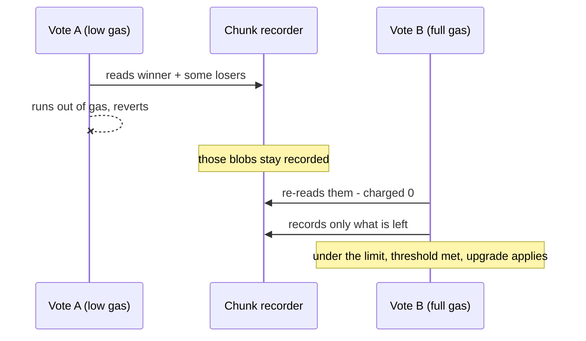

# Pending Update Proposals and the Receipt Storage-Proof Budget

**Status:** Proposal. The recovery described here is demonstrated in sandbox
([`upgrade_proof_limit_recovery.rs`](../../crates/contract/tests/sandbox/upgrade_proof_limit_recovery.rs))
but has not been executed on any real network.

`v1.signer` on mainnet cannot be upgraded. This document explains why, proposes a recovery
that needs nothing outside the team, and lists the contract changes that stop it recurring.

## Background

On 2026-09-14 the 3.15.0 release was proposed four times in about ninety seconds, creating
update ids 15, 16, 17 and 18. All four hold identical bytes — sha256 `c0e2d40e…3a56`,
1,229,682 bytes each. Eight of fifteen participants voted for id 18; the governance threshold
is nine.

Every attempt at the ninth vote fails identically:

```
ActionError / FunctionCallError / ExecutionError:
  "Size of the recorded trie storage proof has exceeded the allowed limit (4.0 MB)"
```

Because the receipt reverts, the ninth vote is never recorded, the count falls back to eight,
and the contract returns to exactly the state it started in.

Signing is unaffected. What is frozen is `propose_update` / `vote_update` — and that covers
**config updates as well as code updates**, since [`update_config`](../../crates/contract/src/api/update.rs)
is reachable only from `do_update`. Every other governance path (TEE measurements, launcher
hashes, foreign-chain providers, participants, resharing, domains) has its own vote state and
still works.

## Why it is stuck

[`do_update`](../../crates/contract/src/update.rs) takes the winner and clears the rest in one
receipt:

```rust
let entry = self.entries.remove(id)?;
self.entries.clear();
```

`IterableMap::clear()` avoids deserializing the losers, but each `storage_remove` still makes
the host read the old value, so every pending proposal is charged to that receipt's
storage-proof budget.

`do_update` is the only code path that removes an entry. There is no withdraw, no expiry, and
no sweep — `UpdateEntry` does not even record who proposed it, so a proposer-based cleanup is
not expressible against the current data model. Deleting proposals is only ever a side effect
of an upgrade succeeding, and the upgrade is what cannot happen.

## The budget

NEAR charges each receipt for trie data it has not already recorded in that chunk, against
`per_receipt_storage_proof_size_limit` (4,000,000 bytes). Removals add a flat 2,000 bytes each.

| Pending proposals | Charged to the receipt | Result |
| --- | --- | --- |
| 1 — every prior upgrade | 1,229,682 | applies |
| 3 | 3,689,046 | applies |
| 4 — current mainnet state | 4,918,728 | **fails** |

The ceiling is **three**; the fourth proposal is what crossed it. Both boundary cases are
pinned by test.

> An earlier reading of this counted the executing contract's own code toward the same budget
> via `record_code_len`, which put the ceiling at one. Testing disproved it: three 1.23 MB
> proposals apply cleanly, which they could not if the 1.19 MB of contract code were also
> charged. Do not reintroduce that assumption without re-measuring.

## Proposed recovery: a paired vote

Two nearcore properties make an escape possible:

1. **The recorder is chunk-scoped and deduplicates by node hash.** `TrieRecorder.record_with`
   accounts size only the first time it sees a value, and the recorder exposes no un-record
   path.
2. **The limit is a per-receipt delta**, measured against what the chunk had already recorded
   before that receipt began.

A receipt that *fails* still leaves its reads in the chunk's recorder — it must, because a
validator re-executing the chunk has to replay the failure. Receipt atomicity is not in
tension with this: rollback discards staged writes (`TrieUpdate::rollback` clears
`prospective`), while the recorder hangs off `Trie`, on the other side of that boundary.

So the bill can be split across two votes sent together:



Vote A changes nothing. Its vote is not counted and no proposal is removed; the contract after
it is byte-for-byte unchanged. Vote B, arriving in the same chunk, reaches threshold and
applies the upgrade, which clears all four proposals.

### Sizing vote A

Vote A must stop before the chunk's cumulative recording reaches
`main_storage_proof_size_soft_limit` (also 4,000,000), because past that the runtime stops
processing receipts in the chunk and vote B is deferred to the next one — where the recorder
is empty and it fails as before.

Recording one, two or three blobs all leave vote B under its own limit, so the window is wide.
It is only closed if vote A is given enough gas to record all four. Note that the cut-off
cannot be calculated: `storage_remove` reads the evicted value *before* charging
`storage_remove_ret_value_byte` on its length, so the per-byte fee is not the boundary — gas
exhaustion inside the trie traversal is.

### Failure modes

Every one of them reverts and costs only gas. None can corrupt state or worsen the situation.

| Scenario | Result |
| --- | --- |
| Vote A under- or over-gassed | B fails; retry with a different value |
| Vote A given full gas | Hits the per-receipt limit exactly as today's votes do |
| A and B land in different chunks | B fails; retry |
| Other receipts consume the chunk budget first | B deferred; retry when quieter |
| B lands but `migrate` panics | Deploy rolls back, **the clear stays committed** — unstuck, and upgradable normally |
| B lands and migrate succeeds | Proposals cleared, 3.15.0 deployed |

## What is verified

- Sandbox, against the archived mainnet binary: three proposals apply, four fail, a lone vote
  still fails, and the paired vote lands.
- Testnet, on a throwaway contract: three proposals apply cleanly, and 3.15.0 migrates from
  3.14.0 state — the version mainnet actually runs.
- **Not verified:** the paired vote on a real network. Sandbox is single-shard, so both votes
  are guaranteed to share a chunk; mainnet offers no such guarantee. A four-proposal testnet
  rehearsal is the remaining gap.

## Follow-up contract changes

Ordered by how much each would have helped.

1. **Reject a code proposal whose hash matches a pending one.** All four entries are identical;
   this alone would have prevented the incident.
2. **Add `withdraw_update(id)`**, removing a single entry per receipt. Its absence is why an
   ordinary mistake became unrecoverable.
3. **Cap pending code proposals**, so "the proposals map must fit one receipt" stops being an
   implicit invariant.
4. **Move the clear out of the deploy receipt** into a bounded `prune_stale_updates(max)`, in
   the same shape as `clean_invalid_attestations(max_scan)`.
5. **Store a code hash rather than the WASM**, deploying via `UseGlobalContract` ([NEP-591],
   live on mainnet). This deletes the failure class instead of bounding it: the proposals map
   becomes kilobytes, storage deposits largely disappear, and contract size stops being a
   governance constraint.

[NEP-591]: https://github.com/near/NEPs/blob/master/neps/nep-0591.md
