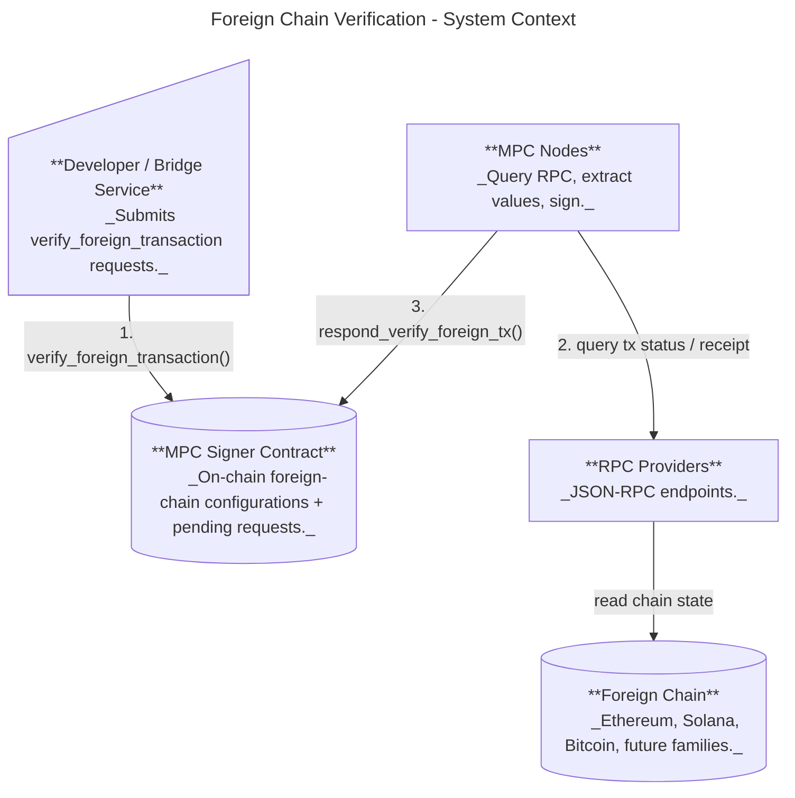
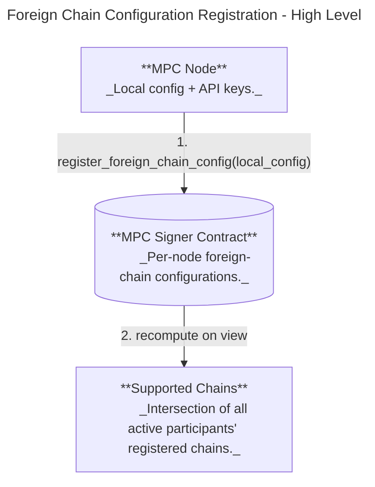

# Foreign Chain Transaction Verification Design

Status: Ready for development

## Purpose & Motivation

This feature lets the MPC network sign payloads only after verifying a specific foreign-chain transaction, so NEAR contracts can react to external chain events without a trusted relayer. Primary use cases:

* Omnibridge inbound flow (foreign chain -> NEAR) where Chain Signatures are required to attest that a foreign transaction finalized successfully.
* Broader chain abstraction: a single MPC network verifies foreign chain state and returns small, typed observations that contracts can interpret.

## Scope

* In scope: contract-level API for verify+sign requests, node-side verification via configured RPC providers, deterministic provider selection, and extensible per-chain-family extractors.
* Out of scope: on-chain light clients / cryptographic proofs, multi-round MPC consensus on verification results.

## Overview

At a high level:

1. A user submits a `verify_foreign_transaction` request with a chain-specific query and a list of **extractors**.
2. MPC nodes query the foreign chain via configured RPC providers.
3. Each node runs the requested extractors over the fetched RPC result(s), producing a **bounded set of small typed values**.
4. If extraction succeeds, MPC signs a canonical encoding of `(request, observed_values, observed_at)` and returns the signature on-chain.

This design intentionally keeps responses small and on-chain-friendly by enforcing:

* Each extractor returns **exactly one** typed value.
* The request includes a bounded number of extractors.
* Extracted values have strict size limits (e.g., bytes length caps).

### RPC Call Plan

Not all extractors can be satisfied by a single RPC method call.

* **Provider selection**: The request does **not** specify an RPC URL. Nodes deterministically select an allowed provider from the on-chain foreign-chain configurations.
* **Extractor-driven calls**: Each extractor implicitly defines which RPC method(s) it requires. Some extractors require more than one call. For the initial set:

  * **BlockHash (Ethereum)**: `eth_getTransactionReceipt` for `blockHash`, plus `eth_getBlockByNumber` for the finality-head and canonical-chain checks.
  * **BlockHash (Bitcoin)**: `getrawtransaction` (verbose) for the containing `blockhash` and confirmation count, then `getblockheader` + `getblockhash` for the canonical-chain defense-in-depth check.
  * **BlockHash (Starknet)**: `starknet_getTransactionReceipt` for `block_hash` + `finality_status`, then `starknet_getBlockWithTxHashes` for the canonical-chain defense-in-depth check.
  * **SolanaProgramIdIndex / SolanaDataHash**: `getTransaction` to access `transaction.message` + `meta` and instruction data.
* **Shared fetches**: When multiple extractors require the same underlying data, nodes may perform the RPC call once and share the result across extractors.

To keep behavior predictable and auditable, each extractor family must have a fixed, well-specified set of RPC methods it may invoke, with strict timeouts and response-size limits.

### User Flow: Verify a Foreign Transaction



## Contract Interface (Request/Response)

```rust
// Contract methods
verify_foreign_transaction(request: VerifyForeignTransactionRequestArgs) -> VerifyForeignTransactionResponse // Through a promise
respond_verify_foreign_tx({ request, response }) // Respond method for signers
```

### Request DTOs

```rust
#[non_exhaustive]
#[repr(u8)]
pub enum ForeignTxPayloadVersion {
    V1 = 1,
}

pub struct VerifyForeignTransactionRequestArgs {
    pub request: ForeignChainRpcRequest,
    pub derivation_path: String, // Key derivation path
    pub domain_id: DomainId,
    pub payload_version: ForeignTxPayloadVersion,
}

pub struct VerifyForeignTransactionRequest {
    pub request: ForeignChainRpcRequest,
    pub tweak: Tweak,
    pub domain_id: DomainId,
    pub payload_version: ForeignTxPayloadVersion,
}
```

### Chain Query DTOs

```rust
pub enum ForeignChainRpcRequest {
    Ethereum(EvmRpcRequest),
    Solana(SolanaRpcRequest),
    Bitcoin(BitcoinRpcRequest),
    // Future chains...
}

pub struct EvmRpcRequest {
    pub tx_id: EvmTxId,
    pub extractors: Vec<EvmExtractor>,
    pub finality: EvmFinality,
}

pub struct SolanaRpcRequest {
    pub tx_id: SolanaTxId, // This is the payload we're signing
    pub finality: SolanaFinality, // Optimistic or Final
    pub extractors: Vec<SolanaExtractor>,
}

pub struct BitcoinRpcRequest {
    pub tx_id: BitcoinTxId, // This is the payload we're signing
    pub confirmations: BlockConfirmations, // required confirmations before considering final
    pub extractors: Vec<BitcoinExtractor>,
}

pub enum EvmFinality {
    Latest,
    Safe,
    Finalized,
}
pub enum SolanaFinality {
    Processed,
    Confirmed,
    Finalized,
}
```

### Response DTOs

The response contains the hash of the sign payload, so callers can verify the signature
by checking it against the expected hash they reconstruct locally.

```rust
pub struct VerifyForeignTransactionResponse {
    pub payload_hash: Hash256,
    pub signature: SignatureResponse,
}
```

### Sign Payload Serialization

The MPC network signs a canonical hash derived from the request and its observed results.
The payload is versioned to allow future format changes without breaking existing verifiers.
Only the hash is included in the response to stay within NEAR's promise data limits.

```rust
pub enum ForeignTxSignPayload {
    V1(ForeignTxSignPayloadV1),
}

pub struct ForeignTxSignPayloadV1 {
    pub request: ForeignChainRpcRequest,
    pub values: Vec<ExtractedValue>,
}
```

The 32-byte `msg_hash` that nodes sign is computed as:

```
msg_hash = SHA-256(borsh(ForeignTxSignPayload))
```

Callers select the payload version via `VerifyForeignTransactionRequestArgs::payload_version`.
Borsh field ordering is stability-critical — fields and enum variants must never be reordered.

### Extractors

Extractors are strongly typed, bounded operations defined by the MPC protocol implementation.

* Each `Extractor` identifies a built-in extractor and its parameters.
* Each extractor must return exactly one `ExtractedValue`.
* Extractors must be deterministic and specified independently of provider-specific JSON formatting.
* Initial extractor set is intentionally limited and isolated to avoid ambiguity. We'll add more as we uncover more use cases and needs.

```rust
pub enum EthereumExtractor {
    BlockHash,
}

pub enum SolanaExtractor {
    // Resolves instruction.programIdIndex to the actual program pubkey via account keys.
    SolanaProgramIdIndex { ix_index: u32 },
    // Hash of the instruction data bytes for ix_index.
    SolanaDataHash { ix_index: u32 },
}

pub enum BitcoinExtractor {
    BlockHash,
}
```

#### Solana extractor details (context from RPC responses)

Solana transaction RPC responses encode the instruction’s program as an index (`programIdIndex`) into the
transaction’s account list. To make the value useful on-chain, `SolanaProgramIdIndex` **resolves the index**
to the actual 32-byte program pubkey using the `accountKeys` / loaded addresses arrays from `getTransaction`.
This avoids relying on caller-side mapping and keeps the extracted value self-contained.

`SolanaDataHash` hashes the raw instruction data bytes for the requested `ix_index` so large instruction payloads
never appear on-chain. The hash function is fixed by the extractor definition and is **sha256**.

## Domain Separation

To prevent callers from using plain `sign()` requests that could be mistaken for validated foreign-chain
transactions, we enforce domain separation by extending `DomainConfig` with a `DomainPurpose` enum.
Requests are only accepted for domains matching the purpose:

* `sign()` may only target domains with purpose `Sign`.
* `verify_foreign_transaction()` may only target domains with purpose `ForeignTx`.

```rust
pub enum DomainPurpose {
    Sign,
    ForeignTx,
    CKD,
}

pub struct DomainConfig {
    pub id: DomainId,
    pub scheme: SignatureScheme,
    pub purpose: DomainPurpose,
}
```

Compatibility note: legacy contract state does not include `DomainPurpose`. New nodes reading old state
must infer the purpose (e.g., treat existing Secp256k1/Ed25519/V2Secp256k1 domains as `Sign` and
Bls12381 domains as `CKD`) until a migration writes explicit purposes.

## Tweak Derivation (Sign vs ForeignTx)

`verify_foreign_transaction()` uses a **different tweak derivation prefix** than `sign()` so the same
`(predecessor_id, derivation_path)` can never yield the same derived key across the two purposes.

Design:

* Keep the existing sign tweak derivation prefix unchanged.
* Introduce a foreign-tx-specific prefix and derive the tweak from the same `(predecessor_id, derivation_path)`
  input using the same hash construction.
* The contract derives the tweak internally from `request.derivation_path` (callers do not submit raw tweaks).

Example:

```rust
const SIGN_TWEAK_DERIVATION_PREFIX: &str =
    "near-mpc-recovery v0.1.0 epsilon derivation:";
const FOREIGN_TX_TWEAK_DERIVATION_PREFIX: &str =
    "near-mpc-recovery v0.1.0 foreign-tx epsilon derivation:";

pub fn derive_sign_tweak(predecessor_id: &AccountId, path: &str) -> Tweak {
    let hash: [u8; 32] = derive_from_path(SIGN_TWEAK_DERIVATION_PREFIX, predecessor_id, path);
    Tweak::new(hash)
}

pub fn derive_foreign_tx_tweak(predecessor_id: &AccountId, path: &str) -> Tweak {
    let hash: [u8; 32] = derive_from_path(FOREIGN_TX_TWEAK_DERIVATION_PREFIX, predecessor_id, path);
    Tweak::new(hash)
}
```

This ensures key material used for validated foreign transactions is **always** distinct from
general-purpose `sign()` keys, even if the same account and derivation path are reused.

## Terminology

Defined here once; the two design docs
([calculating the whitelisted/available sets](design/calculating-supported-foreign-chains.md),
[per-node RPC configuration](design/allowing-per-node-foreign-chain-rpc-configuration.md)) point
back here rather than redefining them.

- **Local RPC config** — a node's `foreign_chains.yaml`: the per-chain set of whitelisted providers
  (referenced by `provider_id`) and API tokens that node is configured to query. Local to each
  operator, not network state. See [Configuration (Node)](#configuration-node).
- **Whitelisted chain** — a chain the network has voted into the on-chain RPC whitelist
  (`foreign_chain_rpc_whitelist`): there is a `ChainEntry` for it (trusted provider list + RPC
  quorum). The policy set every node is expected to cover; **no single operator can add or remove a
  chain — only a threshold vote can**. Returned by `get_whitelisted_foreign_chains()`. See
  [On-chain RPC Provider Whitelist](#on-chain-rpc-provider-whitelist).
- **RPC quorum** (`rpc_quorum(C)`) — per whitelisted chain `C`, how many of a node's configured
  providers must return the same response for that node to accept a verification result
  (`ChainEntry.quorum`), voted in alongside the provider list. A runtime knob; distinct from the
  *signing threshold*.
- **Signing threshold** — the cryptographic reconstruction threshold of the `ForeignTx` signing
  domain (`self.threshold()`): how many participants must produce signature shares to sign an
  observation. Distinct from the RPC quorum.
- **A node covers (supports) a chain `C`** — the node's local RPC config has at least `rpc_quorum(C)`
  of `C`'s whitelisted providers configured (enough to reach the RPC quorum on its own). Reported
  on-chain via `register_foreign_chain_config`. *"Covers" and "supports" are interchangeable; this
  doc prefers* covers.
- **Available chain** — a whitelisted chain that at least `signing_threshold` active participants
  currently cover, so the network can serve it now. Computed dynamically from per-node reports;
  `available ⊆ whitelisted`. `verify_foreign_transaction(C)` is rejected unless `C` is available.
  Returned by `get_available_foreign_chains()`.
- **Incomplete coverage** — a whitelisted chain some active nodes do not cover. Expected to be
  transient and surfaced by alerting, not a steady state; a node not covering a whitelisted chain is
  treated as down for it. If coverage drops below `signing_threshold` the chain leaves the available
  set until enough nodes report it again.

## Contract State (Foreign Chain Configurations)

The **whitelisted** set is derived from the **on-chain RPC whitelist** (`foreign_chain_rpc_whitelist`): a chain is whitelisted iff the network has voted in a `ChainEntry` for it, exposed by `get_whitelisted_foreign_chains()`. The **available** set — the chains ≥ signing threshold active nodes currently cover — is computed from the per-participant registrations and exposed by `get_available_foreign_chains()`; `verify_foreign_transaction` gates on it. The per-participant registration also drives alerting (detecting an active node that does not cover a whitelisted chain). See [Calculating the whitelisted and available foreign-chain sets](design/calculating-supported-foreign-chains.md).

```rust
pub struct ForeignChainSupportByNode {
    pub foreign_chain_support_by_node: BTreeMap<AccountId, SupportedForeignChains>,
}

pub struct SupportedForeignChains(pub BTreeSet<ForeignChain>);

pub enum ForeignChain {
    Solana,
    Bitcoin,
    Ethereum,
    Base,
    Bnb,
    Arbitrum,
    Abstract,
    Starknet,
    // Future chains...
}
```

Relevant contract methods:

* `register_foreign_chain_config(foreign_chain_configuration: ForeignChainConfiguration)` — call method. The authenticated participant (re)registers its per-chain provider set. The call is idempotent.
* `get_whitelisted_foreign_chains() -> WhitelistedForeignChains` — view method. Returns the chains present in the on-chain RPC whitelist (`foreign_chain_rpc_whitelist`). (`get_supported_foreign_chains()`, the old intersection rule, is **to be deprecated**.)
* `get_available_foreign_chains() -> AvailableForeignChains` — view method. Returns the chains that ≥ signing threshold active nodes currently cover; `verify_foreign_transaction` gates on this set.
* `get_foreign_chain_support_by_node() -> ForeignChainSupportByNode` — view method. Returns each participant's registered set of covered chains. Feeds the available-set computation and the coverage alerting (does every active node cover every whitelisted chain?).

## On-chain RPC Provider Whitelist

> Tracked under issue [#3208](https://github.com/near/mpc/issues/3208). Landing in stacked PRs:
> PR 1 (contract storage types) → PR 2 (vote endpoints) → PR 3 (node-side wiring + chain-identity probe).
> The text below describes the end-state design; sections call out per-PR scope where relevant.

The per-participant registration model above leaves the network with no shared notion of *which RPC providers it trusts* — a TEE-attested node binary still pulls URLs from its own config file. To close that gap the contract carries a per-chain whitelist of providers, voted in by participants. Operators reference providers from the whitelist by `provider_id` in their local `foreign_chains.yaml`; the node assembles the final URL from `base_url` + `chain_routing` + the operator-supplied token (placed per `auth_scheme`).

### What changes vs the per-participant model

| Concern                                | Today                                                                                       | After this change                                                                                                                                                                              |
|----------------------------------------|---------------------------------------------------------------------------------------------|------------------------------------------------------------------------------------------------------------------------------------------------------------------------------------------------|
| Source of truth for "trusted provider" | Implicit consensus across operator yamls (everyone independently set the same URLs)         | Explicit on-chain `foreign_chain_rpc_whitelist`, mutated by `vote_update_foreign_chain_providers(votes: Vec<ChainVote>)` — each `ChainVote` is a full per-chain snapshot (provider list + RPC response quorum). The chain's stored state is replaced when the protocol's signing threshold of participants holds the same canonical proposal.                                                            |
| Where the RPC URL lives                | Operator's `foreign_chains.yaml`, as a full string with auth placeholders                   | Contract `ProviderEntry`: `base_url` + `auth_scheme` + `chain_routing` enum (`Embedded` / `PathSegment` / `QueryParam` — exactly one). Node assembles the final URL at startup.                  |
| Where the operator's API key lives     | Operator's yaml, via `TokenConfig::env`                                                     | Operator's yaml, via `TokenConfig::env` *(unchanged)*                                                                                                                                          |
| What the operator picks                | Full URL, auth scheme, token reference                                                      | `provider_id` (label) + token reference                                                                                                                                                        |
| Adding a new provider                  | Every operator updates their yaml; the network effectively supports a chain once enough do  | Threshold of participants vote in `(chain, ProviderEntry)`; operators reference it by `provider_id` only                                                                                       |
| Removing a compromised provider        | Every operator manually edits their yaml; coordination problem                              | Threshold of participants vote remove; nodes pick up the change via the indexer and drop the provider on next reconfigure                                                                       |
| Testnet vs mainnet separation          | Implicit — operator decides what URL goes under which chain                                 | Per-`ForeignChain` map slot, plus a startup *chain-identity probe* that calls the chain's self-identifying RPC and asserts the response matches a constant hardcoded in the inspector — catches both lookup-level (wrong bucket) and content-level (wrong URL voted into the right bucket) confusion. |

### Whitelist storage shape

PR 1 shipped the DTOs and a nested map of providers; PR 2 refactored the storage to the
snapshot-friendly shape below (one `ChainEntry` per chain, holding both the canonical
provider list and the RPC response quorum) and added the pending-vote storage. The
whitelist is exposed via the borsh `allowed_foreign_chain_providers` view fn; serde-JSON
was avoided because the closure would push WASM past the per-tx size cap.

```rust
pub struct ProviderId(pub String); // newtype around String — typed boundary so a
                                   // base_url can't be passed where a provider_id
                                   // is expected.

#[non_exhaustive]
pub enum AuthScheme {
    Header { name: String, scheme: Option<String> },
    Path   { placeholder: String },
    Query  { name: String },
    None,
}

#[non_exhaustive]
pub enum ChainRouting {
    /// Chain identity is already in `base_url` (subdomain or path prefix). Alchemy / Infura.
    Embedded,
    /// Append `segment` to `base_url`'s path. Ankr Ethereum: `PathSegment { segment: "eth" }`.
    PathSegment { segment: String },
    /// Merge a single chain-identifying query param. dRPC Ethereum: `{ name: "network", value: "ethereum" }`.
    QueryParam { name: String, value: String },
}

pub struct ProviderEntry {
    pub provider_id: ProviderId,
    pub base_url: String,
    pub auth_scheme: AuthScheme,
    pub chain_routing: ChainRouting,
}

/// Per-chain stored state: the canonical (sorted) provider list and the RPC response
/// quorum nodes should use when querying.
pub struct ChainEntry {
    pub providers: Vec<ProviderEntry>,
    pub quorum: u64,
}

pub struct AllowedProviders {
    entries: BTreeMap<ForeignChain, ChainEntry>,
}

pub struct ProviderVotes {
    // Pending per-chain proposals. The slot holds the exact `ChainEntry` the
    // participant is proposing for that chain. Replaced wholesale on apply.
    pending: BTreeMap<(AuthenticatedParticipantId, ForeignChain), ChainEntry>,
}

pub struct ForeignChainRpcWhitelist {
    entries: AllowedProviders,
    votes: ProviderVotes,
}
```

### Example URL assembly

The node assembles the final URL deterministically: start from `base_url`, apply `chain_routing` (no-op for `Embedded`, append segment for `PathSegment`, merge param for `QueryParam`), then apply `auth_scheme` to inject the token.

| Vote                  | base_url                                | chain_routing                                  | auth_scheme       | Assembled URL                                              |
|-----------------------|------------------------------------------|------------------------------------------------|-------------------|------------------------------------------------------------|
| `(Ethereum, alchemy)` | `https://eth-mainnet.g.alchemy.com/v2/`  | `Embedded`                                     | `Path("")`        | `https://eth-mainnet.g.alchemy.com/v2/TOKEN`               |
| `(Ethereum, ankr)`    | `https://rpc.ankr.com`                   | `PathSegment { segment: "eth" }`               | `Path("")`        | `https://rpc.ankr.com/eth/TOKEN`                           |
| `(Sepolia, ankr)`     | `https://rpc.ankr.com`                   | `PathSegment { segment: "eth_sepolia" }`       | `Path("")`        | `https://rpc.ankr.com/eth_sepolia/TOKEN`                   |
| `(Ethereum, drpc)`    | `https://lb.drpc.org/ogrpc`              | `QueryParam { name: "network", value: "ethereum" }` | `Query("dkey")` | `https://lb.drpc.org/ogrpc?network=ethereum&dkey=TOKEN`  |
| `(Ethereum, infura)`  | `https://mainnet.infura.io/v3/`          | `Embedded`                                     | `Path("")`        | `https://mainnet.infura.io/v3/TOKEN`                       |

### Vote semantics

The vote endpoint takes a **batch of per-chain snapshots**, one `ChainVote` per chain
the caller wants to update. Each `ChainVote` proposes the chain's complete state
(provider list + RPC response quorum), not a diff:

```rust
pub struct ChainVote {
    pub chain: ForeignChain,
    pub providers: Vec<ProviderEntry>,
    /// RPC response quorum nodes apply when fanning out queries to those providers.
    pub quorum: u64,
}

#[handle_result]
pub fn vote_update_foreign_chain_providers(
    &mut self,
    #[serializer(borsh)] votes: Vec<ChainVote>,
) -> Result<(), Error>;
```

Borsh args (not JSON) because serde::Deserialize for the nested `ChainVote`/`ProviderEntry`/`AuthScheme`/`ChainRouting` closure would push the contract past the per-tx WASM size cap.

- **Vote target = the per-chain snapshot.** For each `ChainVote` in the batch, the participant is voting on the chain's *full* proposed state — providers and RPC response quorum together. Two participants count toward the same proposal for a chain when their canonical `(providers, quorum)` pairs are byte-identical.
- **Canonicalization.** Within each `ChainVote`, the contract sorts `providers` by `provider_id` before comparison, so two participants who submitted the same logical set in different orders still count as the same proposal. A duplicate `provider_id` inside a single `ChainVote`, or a duplicate `chain` across the batch, is rejected with `InvalidParameters::MalformedPayload`.
- **One active vote per participant per chain.** Votes are keyed by `(participant, chain)`. Recasting for a chain overwrites that participant's slot for *only that chain*; chains the participant didn't touch in the new call keep their prior slot.
- **Gated on the protocol signing threshold.** A chain applies when the count of participants holding the same canonical `(providers, quorum)` pair reaches `self.threshold()?.value()` — the same threshold used by `verify_tee` and `vote_add_os_measurement`. There is no separate per-chain *voting* threshold; the per-chain numeric on `ChainVote.quorum` is the *RPC quorum* (a runtime concept consumed by nodes), not a voting parameter.
- **Apply = full snapshot replacement.** When threshold is reached for a chain, `AllowedProviders.entries[chain]` is set to the proposed `ChainEntry` — the old provider list is discarded wholesale. The chain's pending votes are cleared (`clear_chain`) so the next round starts fresh. Other chains' pending votes are untouched.
- **Threshold checked synchronously on every call.** No periodic sweep.
- **Vote withdraw.** No explicit withdraw endpoint. Recasting overwrites your slot for the chains you touch. A vote is also cleared by being removed from the participant set (`clean_tee_status` → `ProviderVotes::retain_only`) or by the chain applying.
- **Return value.** `vote()` returns the chains whose threshold was reached and applied on this call; the entry point logs them as `applied chains={:?}`. Chains still pending are absent from the log.

### Design rationale

#### Why move the connection config on chain

Threat model: an operator runs a TEE-attested node binary, but the binary trusts its config file at startup — including the RPC URLs. A malicious or compromised operator can therefore swap one chain's RPC for a fake server returning forged receipts, and TEE attestation doesn't help — it attests the binary, not its config. Putting URL components on chain and validating the operator's local config against the whitelist closes that gap: the operator can no longer point the node at an arbitrary URL, only at one the network has voted to trust for that chain.

#### Why the URL is split into structured pieces

Providers use three mutually-exclusive conventions to identify which chain a request targets:

- **Subdomain / path prefix** (Alchemy, Infura): `https://eth-mainnet.g.alchemy.com/v2/…`
- **Path segment** (Ankr): `https://rpc.ankr.com/eth/…`
- **Query param** (dRPC): `https://lb.drpc.org/ogrpc?network=ethereum&…`

If `base_url` were a single string *and* the operator chose the auth scheme, the operator could declare e.g. `auth: { kind: Query, name: "network", token_env: KEY }` against a `base_url` ending in `…?network=ethereum&`. The assembled URL becomes `…?network=ethereum&network=sepolia` — most servers take the last value, redirecting the call to Sepolia. Modelling chain identity as a `ChainRouting` enum (`Embedded` | `PathSegment` | `QueryParam`) and putting `auth_scheme` on chain removes that syntactic surface. The operator only supplies a token *value*; they have no way to inject extra path components or query keys.

#### Why each `(chain, provider_id)` gets its own `ProviderEntry`

The "same" provider needs different connection config per chain:

- **Alchemy**: `base_url` differs by chain (`eth-mainnet.g.alchemy.com` vs `eth-sepolia.g.alchemy.com`); `chain_routing = Embedded`.
- **Ankr**: `chain_routing = PathSegment` value differs (`"eth"` vs `"eth_sepolia"`); `base_url` is shared.
- **dRPC**: `chain_routing = QueryParam` value differs (`"ethereum"` vs `"sepolia"`); `base_url` is shared.

There is no shared "Alchemy" record reused across chains — each `(chain, provider_id)` pair has its own `ProviderEntry` with chain-specific connection details. The fact that two entries share `provider_id: "alchemy"` is the natural cross-chain marker, not duplication.

#### Why testnets get separate `ForeignChain` enum variants, not an `environment` field

An `environment: Testnet | Mainnet` field would have to be re-checked everywhere `ForeignChain` is used and threaded through every signing flow. A separate enum variant carries the same information through the type system at no extra cost: the MPC contract already keys everything on `ForeignChain`, so `Sepolia` / `Goerli` / `Holesky` slot in as new variants. Adding the variants themselves is out of scope for this change; the whitelist design just doesn't *prevent* them.

#### Why threshold (not unanimous) for both add and remove

Removing a compromised provider quickly matters more than tolerating one hostile participant blocking removal indefinitely; node-side falls back to other surviving providers so removal isn't fatal to chain availability. The unanimous-remove precedent (`vote_remove_launcher_hash`) exists because removing a launcher invalidates attestations — that argument doesn't apply to RPC providers.

#### Why per-chain snapshots rather than separate add/remove endpoints

Two reasons together drove the snapshot model over an Add/Remove diff-ops endpoint:

1. **Bootstrap coordination cost.** Enabling N chains with M providers each is N×M individual rounds if every action is its own vote, and every round needs threshold participants to vote *the same value*. For a realistic launch (5 chains × 5 providers, 13 operators) that's 325 individual votes to coordinate. A per-call batch — multiple chains in one `Vec<ChainVote>` — collapses that to roughly one vote per operator. Per-chain rather than per-action because each chain is the natural unit of agreement: operators audit "here's the trusted set for Ethereum" together with "here's the response quorum for Ethereum" in one decision.
2. **Canonicalization.** Diff-ops batches (`Vec<Add | Remove>`) introduce order ambiguity at threshold-check time — `[Add A, Remove B]` and `[Remove B, Add A]` produce the same end state, but as raw `Vec`s they don't compare equal, so two participants would never count toward the same proposal unless they happened to submit in identical order. Snapshot semantics sidestep this: the contract sorts `providers` by `provider_id` and equality is on the sorted list, so two participants who submitted the same logical set in different orders contribute to the same proposal.

#### Why protocol signing threshold (not unanimous, not a separate per-chain knob)

Voting uses the protocol's existing signing threshold (`self.threshold()?.value()`), the same gate as `verify_tee` and `vote_add_os_measurement`. An earlier design proposed a separate per-chain *voting* threshold so mainnet and testnet could be voted in under different agreement requirements; that was dropped because (a) there's no setter that could safely populate it without itself being voted in, leaving a hardcoded default that's strictly weaker than the protocol threshold, and (b) the per-chain numeric on `ChainVote.threshold` already covers the *runtime* security knob — how many of N whitelisted providers must agree for a node to accept a response — which is what operators actually need to tune per chain.

#### Why the chain-identity probe in addition to per-chain keying (PR 3)

The per-chain map key prevents *lookup* confusion: when the node resolves the operator's `ethereum:` section, only `entries[Ethereum]` is consulted, never `entries[Sepolia]`. What it doesn't prevent is a `ChainVote { chain: Ethereum, providers: [ProviderEntry { provider_id: "ankr", chain_routing: PathSegment { segment: "eth_sepolia" }, … }, …], threshold: _ }` getting voted in — the contract just stores what threshold consensus produces; it can't tell whether `"eth_sepolia"` actually corresponds to Ethereum mainnet. Threshold voter review is the first line of defense; the chain-identity probe is the structural one.

At startup, each resolved provider gets its self-identifying RPC called (`eth_chainId` for EVM, `getGenesisHash` for Solana, `starknet_chainId` for Starknet, a checkpointed block hash for Bitcoin) and the response is compared against a per-`ForeignChain` constant hardcoded in the inspector. A provider whose RPC reports the wrong network is dropped before any traffic flows. Because the expected value is in the TEE-attested binary, a malicious vote with the wrong URL can't bypass it.

#### Why drop-and-log on local-config mismatch, not hard-crash

If an operator's `foreign_chains.yaml` references a `provider_id` not on the whitelist for that chain (e.g. just removed by a vote), the node logs a warning and excludes that provider from registration; the chain is still served by surviving providers. A chain falls off the registration set only when zero providers survive. Hard-crashing would let a single hostile vote-removal participant take a node offline by removing a provider that node depends on.

### Out of scope / deferred

- **Per-chain quorum policy** (`RpcPolicy.quorum_threshold` from the precursor design doc). This is the number of providers a node must independently agree with on a verification result — distinct from the per-chain voting threshold for add/remove. A follow-up under the same milestone.
- **Hostname templating** for Alchemy / Infura. Chain identity for subdomain-encoded providers stays inside `base_url` rather than being structurally extracted; symmetric extraction was rejected as over-engineering with no concrete attack benefit.
- **Moving `sample_tx_id` on chain.** Stays in operator config for now; promoting it (so the whole network probes the same tx) is a candidate follow-up if operators start disagreeing on which tx to probe.
- **Adding testnet `ForeignChain` variants** (`Sepolia`, `Goerli`, `Holesky`). The whitelist design doesn't need them and doesn't prevent them.

## Deterministic Provider Selection

Each node selects a provider using a deterministic hash of the provider identity (RPC URL):

```
hash = sha256(participant_id || request_id || provider_rpc_url)
```

Providers are sorted by this hash to build a deterministic ordering:

* **Primary provider** = first in the ordering.

This ensures different nodes query different providers for the same request while preserving determinism.

## Failure and Timeout Behavior

* Nodes **do not participate** if RPC queries fail or extraction fails.
* A failed verification does **not** produce an on-chain failure response. The request eventually times out and fails with the standard timeout error.

For operators, enabling a chain requires each node to register its local foreign-chain configuration with the contract:

### Operator Flow: Registering Foreign Chain Configurations



### Contract State (Types)
See "Contract State (Foreign Chain Configurations)" above.

## Node Configuration and Contract Registration

* Node config contains chain RPC providers and timeouts (API keys stay local).
* On startup, each node submits a single `register_foreign_chain_config` transaction derived from its local configuration. The call is idempotent.
* Nodes do **not** vote, poll, or wait for network-wide consensus — the transaction is sent and startup continues.
* `get_whitelisted_foreign_chains()` returns the on-chain RPC whitelist's chains, not these registrations: a chain is *whitelisted* once the network votes in a `ChainEntry`, and no single node can change it. It is *available* — actually served — only while ≥ signing threshold active nodes cover it (`get_available_foreign_chains()`); `verify_foreign_transaction` early-rejects a whitelisted-but-unavailable chain. See [Calculating the whitelisted and available foreign-chain sets](design/calculating-supported-foreign-chains.md).
* `get_foreign_chain_support_by_node()` exposes per-participant registrations, which feed the availability check and the coverage alerting.

### Configuration (Node)

Example config snippet:

```yaml
foreign_chains:
  solana:
    timeout_sec: 30
    max_retries: 3
    providers:
      alchemy:
        rpc_url: "https://solana-mainnet.g.alchemy.com/v2/"
        auth:
          kind: header
          name: Authorization
          scheme: Bearer
          token:
            env: ALCHEMY_API_KEY
      quicknode:
        rpc_url: "https://your-endpoint.solana-mainnet.quiknode.pro/"
        auth:
          kind: header
          name: x-api-key
          token:
            val: "<your-api-key-here>"
      ankr:
        rpc_url: "https://rpc.ankr.com/near/{api_key}"
        auth:
          kind: path
          placeholder: "{api_key}"
          token:
            env: ANKR_API_KEY
      helius:
        rpc_url: "https://mainnet.helius-rpc.com/"
        auth:
          kind: query
          name: api-key
          token:
            env: HELIUS_API_KEY
      public:
        rpc_url: "https://rpc.public.example.com"
        auth:
          kind: none
```

Each registered configuration references providers by **rpc_url**, and nodes must have matching
provider entries in config (including API keys) to actually serve traffic for that chain.

Auth variants are explicitly modeled because providers differ in how they expect API keys
to be supplied (e.g., bearer tokens, custom headers, query params, or URL path tokens), and some
providers require no auth at all.

## Risks

* **RPC trust and correctness**: Verification relies on centralized RPC providers. A malicious
  or faulty provider could return incorrect data for a subset of nodes.
* **No additional consensus**: Nodes independently query providers and do not participate on failures.
  If a threshold of nodes are misled by providers, the network could sign invalid observations.
* **Provider availability**: Outages or rate limits can cause verification failures and reduced
  signing availability.
* **Finality semantics**: Finality definitions differ across chains; mapping them correctly is critical.
* **Incomplete chain coverage**: A chain is whitelisted as soon as the network votes in its whitelist entry, independent of any single operator. A node that hasn't configured a whitelisted chain is treated like a node that is down for it — it does not participate in that chain's verification requests, and the pre-generated triples/presignatures it co-owns become offline assets. As long as the leader knows the node is down there is no waste, but an asset that stays offline for a long period is eventually discarded. Foreign-tx presignatures live in their own dedicated `ForeignTx`-domain pool, but triples are shared across all CaitSith domains with the same signing threshold, so stranding them also reduces ordinary `sign()` presignature generation — the waste is not confined to that chain's availability. This is mitigated operationally by alerting on any active node that does not cover a whitelisted chain, rather than by the protocol.
* **Config drift**: Nodes missing required provider keys will fail startup validation.
* **Extractor correctness**: Bugs or ambiguous specifications in extractors could produce incorrect values.
