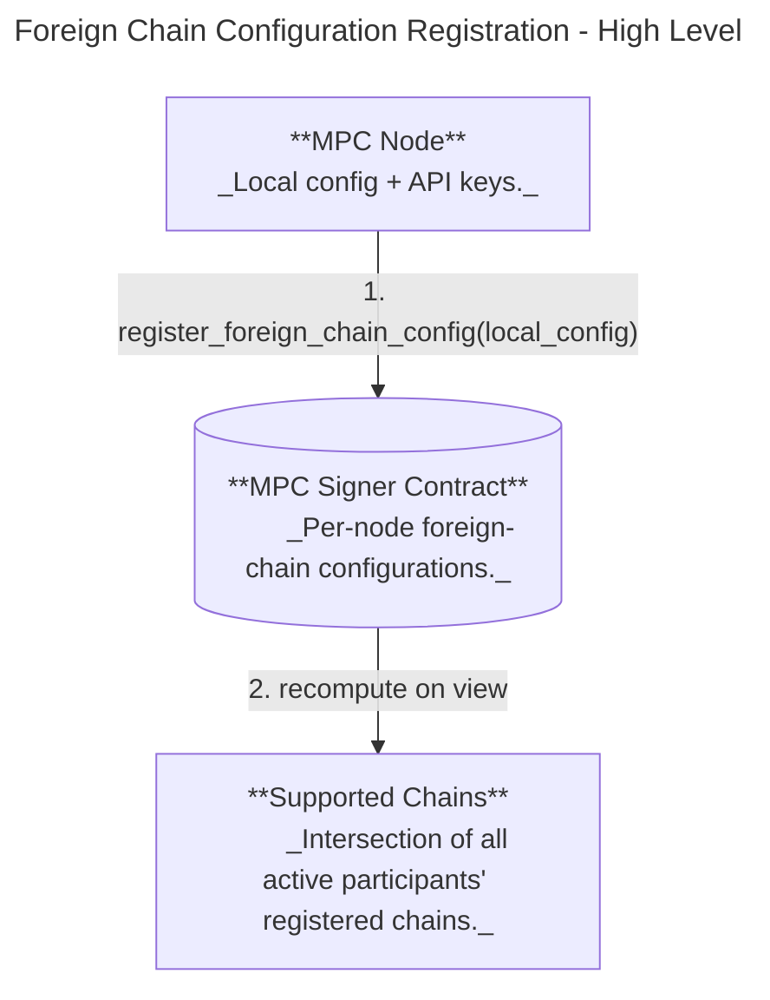

# Foreign Chain Transaction Verification Design

Status: Ready for development

## Purpose & Motivation

This feature lets the MPC network sign payloads only after verifying a specific foreign-chain transaction, so NEAR contracts can react to external chain events without a trusted relayer. Primary use cases:

* Omnibridge inbound flow (foreign chain -> NEAR) where Chain Signatures are required to attest that a foreign transaction finalized successfully.
* Broader chain abstraction: a single MPC network verifies foreign chain state and returns small, typed observations that contracts can interpret.

## Scope

* In scope: contract-level API for verify+sign requests, node-side verification via configured RPC providers, deterministic provider selection, and extensible per-chain-family extractors.
* Out of scope: on-chain light clients / cryptographic proofs, multi-round MPC consensus on verification results.

## Overview

At a high level:

1. A user submits a `verify_foreign_transaction` request with a chain-specific query and a list of **extractors**.
2. MPC nodes query the foreign chain via configured RPC providers.
3. Each node runs the requested extractors over the fetched RPC result(s), producing a **bounded set of small typed values**.
4. If extraction succeeds, MPC signs a canonical encoding of `(request, observed_values, observed_at)` and returns the signature on-chain.

This design intentionally keeps responses small and on-chain-friendly by enforcing:

* Each extractor returns **exactly one** typed value.
* The request includes a bounded number of extractors.
* Extracted values have strict size limits (e.g., bytes length caps).

### RPC Call Plan

Not all extractors can be satisfied by a single RPC method call.

* **Provider selection**: The request does **not** specify an RPC URL. Nodes deterministically select an allowed provider from the on-chain foreign-chain configurations.
* **Extractor-driven calls**: Each extractor implicitly defines which RPC method(s) it requires. Some extractors require more than one call. For the initial set:

  * **BlockHash (Ethereum)**: `eth_getTransactionReceipt` for `blockHash`.
  * **BlockHash (Bitcoin)**: `getrawtransaction` (with verbose) to get the containing `blockhash` (and `getblock` if needed).
  * **SolanaProgramIdIndex / SolanaDataHash**: `getTransaction` to access `transaction.message` + `meta` and instruction data.
* **Shared fetches**: When multiple extractors require the same underlying data, nodes may perform the RPC call once and share the result across extractors.

To keep behavior predictable and auditable, each extractor family must have a fixed, well-specified set of RPC methods it may invoke, with strict timeouts and response-size limits.

### User Flow: Verify a Foreign Transaction


## Contract Interface (Request/Response)

```rust
// Contract methods
verify_foreign_transaction(request: VerifyForeignTransactionRequestArgs) -> VerifyForeignTransactionResponse // Through a promise
respond_verify_foreign_tx({ request, response }) // Respond method for signers
```

### Request DTOs

```rust
#[non_exhaustive]
#[repr(u8)]
pub enum ForeignTxPayloadVersion {
    V1 = 1,
}

pub struct VerifyForeignTransactionRequestArgs {
    pub request: ForeignChainRpcRequest,
    pub derivation_path: String, // Key derivation path
    pub domain_id: DomainId,
    pub payload_version: ForeignTxPayloadVersion,
}

pub struct VerifyForeignTransactionRequest {
    pub request: ForeignChainRpcRequest,
    pub tweak: Tweak,
    pub domain_id: DomainId,
    pub payload_version: ForeignTxPayloadVersion,
}
```

### Chain Query DTOs

```rust
pub enum ForeignChainRpcRequest {
    Ethereum(EvmRpcRequest),
    Solana(SolanaRpcRequest),
    Bitcoin(BitcoinRpcRequest),
    // Future chains...
}

pub struct EvmRpcRequest {
    pub tx_id: EvmTxId,
    pub extractors: Vec<EvmExtractor>,
    pub finality: EvmFinality,
}

pub struct SolanaRpcRequest {
    pub tx_id: SolanaTxId, // This is the payload we're signing
    pub finality: SolanaFinality, // Optimistic or Final
    pub extractors: Vec<SolanaExtractor>,
}

pub struct BitcoinRpcRequest {
    pub tx_id: BitcoinTxId, // This is the payload we're signing
    pub confirmations: BlockConfirmations, // required confirmations before considering final
    pub extractors: Vec<BitcoinExtractor>,
}

pub enum EvmFinality {
    Latest,
    Safe,
    Finalized,
}
pub enum SolanaFinality {
    Processed,
    Confirmed,
    Finalized,
}
```

### Response DTOs

The response contains the hash of the sign payload, so callers can verify the signature
by checking it against the expected hash they reconstruct locally.

```rust
pub struct VerifyForeignTransactionResponse {
    pub payload_hash: Hash256,
    pub signature: SignatureResponse,
}
```

### Sign Payload Serialization

The MPC network signs a canonical hash derived from the request and its observed results.
The payload is versioned to allow future format changes without breaking existing verifiers.
Only the hash is included in the response to stay within NEAR's promise data limits.

```rust
pub enum ForeignTxSignPayload {
    V1(ForeignTxSignPayloadV1),
}

pub struct ForeignTxSignPayloadV1 {
    pub request: ForeignChainRpcRequest,
    pub values: Vec<ExtractedValue>,
}
```

The 32-byte `msg_hash` that nodes sign is computed as:

```
msg_hash = SHA-256(borsh(ForeignTxSignPayload))
```

Callers select the payload version via `VerifyForeignTransactionRequestArgs::payload_version`.
Borsh field ordering is stability-critical — fields and enum variants must never be reordered.

### Extractors

Extractors are strongly typed, bounded operations defined by the MPC protocol implementation.

* Each `Extractor` identifies a built-in extractor and its parameters.
* Each extractor must return exactly one `ExtractedValue`.
* Extractors must be deterministic and specified independently of provider-specific JSON formatting.
* Initial extractor set is intentionally limited and isolated to avoid ambiguity. We'll add more as we uncover more use cases and needs.

```rust
pub enum EthereumExtractor {
    BlockHash,
}

pub enum SolanaExtractor {
    // Resolves instruction.programIdIndex to the actual program pubkey via account keys.
    SolanaProgramIdIndex { ix_index: u32 },
    // Hash of the instruction data bytes for ix_index.
    SolanaDataHash { ix_index: u32 },
}

pub enum BitcoinExtractor {
    BlockHash,
}
```

#### Solana extractor details (context from RPC responses)

Solana transaction RPC responses encode the instruction’s program as an index (`programIdIndex`) into the
transaction’s account list. To make the value useful on-chain, `SolanaProgramIdIndex` **resolves the index**
to the actual 32-byte program pubkey using the `accountKeys` / loaded addresses arrays from `getTransaction`.
This avoids relying on caller-side mapping and keeps the extracted value self-contained.

`SolanaDataHash` hashes the raw instruction data bytes for the requested `ix_index` so large instruction payloads
never appear on-chain. The hash function is fixed by the extractor definition and is **sha256**.

## Domain Separation

To prevent callers from using plain `sign()` requests that could be mistaken for validated foreign-chain
transactions, we enforce domain separation by extending `DomainConfig` with a `DomainPurpose` enum.
Requests are only accepted for domains matching the purpose:

* `sign()` may only target domains with purpose `Sign`.
* `verify_foreign_transaction()` may only target domains with purpose `ForeignTx`.

```rust
pub enum DomainPurpose {
    Sign,
    ForeignTx,
    CKD,
}

pub struct DomainConfig {
    pub id: DomainId,
    pub scheme: SignatureScheme,
    pub purpose: DomainPurpose,
}
```

Compatibility note: legacy contract state does not include `DomainPurpose`. New nodes reading old state
must infer the purpose (e.g., treat existing Secp256k1/Ed25519/V2Secp256k1 domains as `Sign` and
Bls12381 domains as `CKD`) until a migration writes explicit purposes.

## Tweak Derivation (Sign vs ForeignTx)

`verify_foreign_transaction()` uses a **different tweak derivation prefix** than `sign()` so the same
`(predecessor_id, derivation_path)` can never yield the same derived key across the two purposes.

Design:

* Keep the existing sign tweak derivation prefix unchanged.
* Introduce a foreign-tx-specific prefix and derive the tweak from the same `(predecessor_id, derivation_path)`
  input using the same hash construction.
* The contract derives the tweak internally from `request.derivation_path` (callers do not submit raw tweaks).

Example:

```rust
const SIGN_TWEAK_DERIVATION_PREFIX: &str =
    "near-mpc-recovery v0.1.0 epsilon derivation:";
const FOREIGN_TX_TWEAK_DERIVATION_PREFIX: &str =
    "near-mpc-recovery v0.1.0 foreign-tx epsilon derivation:";

pub fn derive_sign_tweak(predecessor_id: &AccountId, path: &str) -> Tweak {
    let hash: [u8; 32] = derive_from_path(SIGN_TWEAK_DERIVATION_PREFIX, predecessor_id, path);
    Tweak::new(hash)
}

pub fn derive_foreign_tx_tweak(predecessor_id: &AccountId, path: &str) -> Tweak {
    let hash: [u8; 32] = derive_from_path(FOREIGN_TX_TWEAK_DERIVATION_PREFIX, predecessor_id, path);
    Tweak::new(hash)
}
```

This ensures key material used for validated foreign transactions is **always** distinct from
general-purpose `sign()` keys, even if the same account and derivation path are reused.

## Contract State (Foreign Chain Configurations)

The contract stores a foreign-chain configuration **per participant** — there is no global, voted-on policy. The set of chains the network collectively supports is derived as the **intersection** of chains registered by every active participant.

```rust
pub struct ForeignChainSupportByNode {
    pub foreign_chain_support_by_node: BTreeMap<AccountId, SupportedForeignChains>,
}

pub struct SupportedForeignChains(pub BTreeSet<ForeignChain>);

pub enum ForeignChain {
    Solana,
    Bitcoin,
    Ethereum,
    Base,
    Bnb,
    Arbitrum,
    Abstract,
    Starknet,
    // Future chains...
}
```

Relevant contract methods:

* `register_foreign_chain_config(foreign_chain_configuration: ForeignChainConfiguration)` — call method. The authenticated participant (re)registers its per-chain provider set. The call is idempotent.
* `get_supported_foreign_chains() -> SupportedForeignChains` — view method. Returns the set of chains that appear in **every** active participant's registered configuration.
* `get_foreign_chain_support_by_node() -> ForeignChainSupportByNode` — view method. Returns each participant's registered set of supported chains.

## Deterministic Provider Selection

Each node selects a provider using a deterministic hash of the provider identity (RPC URL):

```
hash = sha256(participant_id || request_id || provider_rpc_url)
```

Providers are sorted by this hash to build a deterministic ordering:

* **Primary provider** = first in the ordering.

This ensures different nodes query different providers for the same request while preserving determinism.

## Failure and Timeout Behavior

* Nodes **abstain** if RPC queries fail or extraction fails.
* A failed verification does **not** produce an on-chain failure response. The request eventually times out and fails with the standard timeout error.

For operators, enabling a chain requires each node to register its local foreign-chain configuration with the contract:

### Operator Flow: Registering Foreign Chain Configurations



### Contract State (Types)
See "Contract State (Foreign Chain Configurations)" above.

## Node Configuration and Contract Registration

* Node config contains chain RPC providers and timeouts (API keys stay local).
* On startup, each node submits a single `register_foreign_chain_config` transaction derived from its local configuration. The call is idempotent.
* Nodes do **not** vote, poll, or wait for network-wide consensus — the transaction is sent and startup continues.
* A chain appears in `get_supported_foreign_chains()` only once **every** active participant has registered it.
* Per-participant registrations can be inspected with `get_foreign_chain_support_by_node()`.

### Configuration (Node)

Example config snippet:

```yaml
foreign_chains:
  solana:
    timeout_sec: 30
    max_retries: 3
    providers:
      alchemy:
        rpc_url: "https://solana-mainnet.g.alchemy.com/v2/"
        auth:
          kind: header
          name: Authorization
          scheme: Bearer
          token:
            env: ALCHEMY_API_KEY
      quicknode:
        rpc_url: "https://your-endpoint.solana-mainnet.quiknode.pro/"
        auth:
          kind: header
          name: x-api-key
          token:
            val: "<your-api-key-here>"
      ankr:
        rpc_url: "https://rpc.ankr.com/near/{api_key}"
        auth:
          kind: path
          placeholder: "{api_key}"
          token:
            env: ANKR_API_KEY
      helius:
        rpc_url: "https://mainnet.helius-rpc.com/"
        auth:
          kind: query
          name: api-key
          token:
            env: HELIUS_API_KEY
      public:
        rpc_url: "https://rpc.public.example.com"
        auth:
          kind: none
```

Each registered configuration references providers by **rpc_url**, and nodes must have matching
provider entries in config (including API keys) to actually serve traffic for that chain.

Auth variants are explicitly modeled because providers differ in how they expect API keys
to be supplied (e.g., bearer tokens, custom headers, query params, or URL path tokens), and some
providers require no auth at all.

## Risks

* **RPC trust and correctness**: Verification relies on centralized RPC providers. A malicious
  or faulty provider could return incorrect data for a subset of nodes.
* **No additional consensus**: Nodes independently query providers and abstain on failures.
  If a threshold of nodes are misled by providers, the network could sign invalid observations.
* **Provider availability**: Outages or rate limits can cause verification failures and reduced
  signing availability.
* **Finality semantics**: Finality definitions differ across chains; mapping them correctly is critical.
* **Rollout coordination**: A chain is only considered supported once **every** active participant has registered it; a single lagging operator can delay enabling a new chain.
* **Config drift**: Nodes missing required provider keys will fail startup validation.
* **Extractor correctness**: Bugs or ambiguous specifications in extractors could produce incorrect values.
