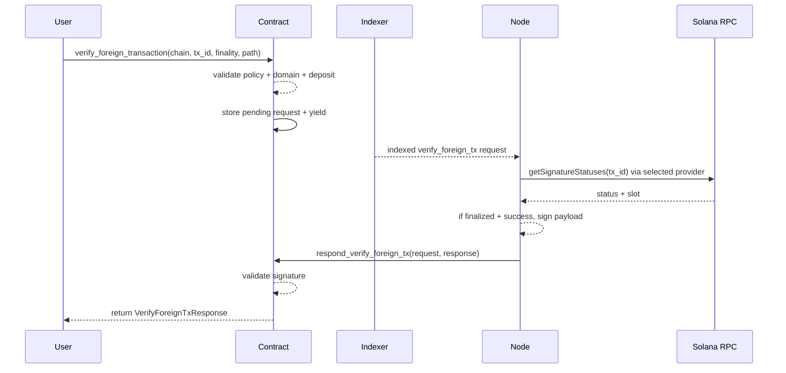
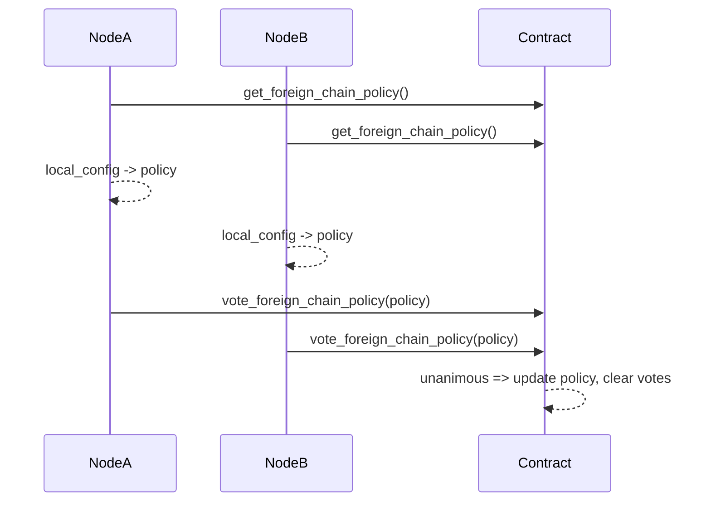

# Foreign Chain Transaction Verification & Policy Voting

## Status
- Proposed/Implemented in `read-foreign-chain` (PR #1851)

## Summary
This document describes the foreign-chain transaction verification feature (currently Solana) and the on-chain policy mechanism that governs which chains/providers are allowed. The feature enables users to submit a foreign transaction ID, have MPC nodes verify the transaction via RPC, then return a signature over a payload derived from the transaction ID.

Key points:
- New on-chain policy: `ForeignChainPolicy` (chains + required provider names).
- Policy changes require unanimous participant votes.
- Nodes auto-validate config vs policy and auto-vote for policy derived from local config.
- Verification is off-chain via RPC; on-chain contract only checks policy + signature.

## Goals
- Allow users to request MPC signatures for foreign-chain transactions after verification.
- Ensure the network agrees on supported chains/providers via an on-chain policy.
- Distribute RPC trust by deterministic provider selection per request.

## Non-Goals
- On-chain cryptographic proof verification (no light-client/proof).
- Non-ECDSA signing for foreign-chain verification.
- Multi-chain support beyond Solana (future work).

## Actors
- **User**: Calls `verify_foreign_transaction` with foreign tx ID and finality.
- **MPC Contract**: Enforces policy and returns response after node verification.
- **MPC Node**: Verifies foreign tx via RPC, runs MPC signing, responds to contract.
- **RPC Providers**: External Solana JSON-RPC endpoints.

## Architecture Overview

```
+--------------------+          +-------------------+          +-----------------------+
|      User/App      |          |   MPC Contract    |          |       MPC Nodes       |
| verify_foreign_tx  |  ---->   | policy + queue    |  ---->   | verify via RPC + sign |
+--------------------+          +-------------------+          +-----------------------+
                                      ^      |                              |
                                      |      v                              |
                                      |  respond_verify_foreign_tx          |
                                      +-------------------------------------+
```

## Data Model (Contract)
### Policy Types
- `ForeignChain`: currently `Solana`.
- `RpcProviderName(String)`.
- `ForeignChainEntry { chain, required_providers: Vec<RpcProviderName> }`.
- `ForeignChainPolicy { chains: Vec<ForeignChainEntry> }`.
- Validation rules:
  - No duplicate chains.
  - Each chain has at least one provider.

### Request/Response Types
- `VerifyForeignTxRequestArgs` (user input):
  - `chain`, `tx_id`, `finality`, `path`, optional `domain_id`.
- `VerifyForeignTxRequest` (stored):
  - `chain`, `tx_id`, `finality`, `tweak`, `domain_id`.
- `VerifyForeignTxResponse`:
  - `verified_at_block`, `signature`.

### Storage
- `pending_verify_foreign_tx_requests: LookupMap<VerifyForeignTxRequest, YieldIndex>`
- Migration adds this map and initializes `ForeignChainPolicy` to empty.

## Data Model (Node)
- `VerifyForeignTxRequest` mirrors contract request + metadata (`id`, `receipt_id`, `entropy`, `timestamp_nanosec`).
- `payload()` = `sha256(tx_id_bytes)` and **must match** contract logic.

## On-Chain API
### User API
- `verify_foreign_transaction(request: VerifyForeignTxRequestArgs)` (payable)
  - Requires ECDSA domain, non-empty policy, chain in policy.
  - Stores request and yields to callback.

### Node API
- `respond_verify_foreign_tx(request: VerifyForeignTxRequest, response: VerifyForeignTxResponse)`
  - Verifies signature over payload derived from `tx_id`.

### Policy API
- `vote_foreign_chain_policy(proposal: ForeignChainPolicy)`
- `get_foreign_chain_policy() -> ForeignChainPolicy`
- `get_foreign_chain_policy_proposals() -> Vec<(ForeignChainPolicy, u64)>`

## Node Configuration
New `foreign_chains` config section (provider-based):

```yaml
foreign_chains:
  solana:
    timeout_sec: 30
    max_retries: 3
    providers:
      alchemy:
        rpc_url: "https://solana-mainnet.g.alchemy.com/v2/${ALCHEMY_KEY}"
        backup_urls: []
      quicknode:
        rpc_url: "https://..."
        backup_urls:
          - "https://backup1..."
```

### Config-to-Policy
- Nodes convert local config to a `ForeignChainPolicy` for voting.
- Provider names are sorted to ensure deterministic policy equality across nodes.

## Provider Selection
Deterministic provider selection ensures different nodes query different providers for the same request.

Algorithm:
- For each provider name `p`, compute:
  - `hash = sha256(participant_id || request_id || p)`
- Sort providers by `hash`.
- Use the first as primary, then fallback in deterministic order.

## End-to-End Flow

### 1) Policy Establishment (Startup)
1. Node reads current on-chain policy.
2. Validate local config vs policy:
   - If policy empty: pass.
   - If policy requires missing providers: startup fails.
3. Node computes `local_policy` from config.
4. If different from on-chain policy, node votes.
5. Unanimous votes update policy.

### 2) User Request
1. User calls `verify_foreign_transaction` with tx ID + finality.
2. Contract validates:
   - Domain exists, ECDSA.
   - Policy not empty.
   - Chain in policy.
   - Gas/deposit sufficient.
3. Contract derives `tweak` from `predecessor_id` and `path`.
4. Stores request and yields callback.

### 3) Indexing & Queueing
1. Indexer sees `verify_foreign_transaction` call and parses args.
2. Node creates `VerifyForeignTxRequest` plus a corresponding `SignatureRequest`:
   - Signature payload = `sha256(tx_id_bytes)`.
3. Both are stored atomically to avoid crash inconsistencies.

### 4) Verification + MPC Signing
1. Leader node is selected by existing request queue logic.
2. Leader verifies foreign tx via RPC using selected provider order.
3. If tx is successful and meets finality:
   - Run MPC signing (ECDSA only).
   - Construct `VerifyForeignTxResponse` with `verified_at_block` + signature.
4. Submit `respond_verify_foreign_tx` to contract.

### 5) Contract Response
- Contract verifies signature against derived payload.
- If valid: resume yield and return response.
- On timeout: remove pending request and fail with timeout error.

## Diagrams

### Sequence: Verify Foreign Transaction



### Policy Voting



## Failure Modes
- **Policy not configured**: contract rejects requests.
- **Chain not in policy**: request rejected.
- **RPC errors / tx not found / not finalized**: no response, request times out.
- **Tx failed**: verification returns failed status; node aborts signing.
- **Config mismatch**: node startup fails if policy requires missing providers.

## Security Considerations
- No cryptographic foreign-chain proofs; trust delegated to RPC providers.
- Policy only encodes provider names, not URLs. Operators must ensure names map to intended endpoints.
- Deterministic provider selection reduces single-provider dependency but does not enforce multi-source quorum verification.

## Observability
New metrics:
- `mpc_num_verify_foreign_tx_requests_indexed`
- `mpc_num_verify_foreign_tx_responses_indexed`
- `mpc_num_verify_foreign_tx_computations_led{status=...}`
- `verify_foreign_tx_request_channel_failed`

## Tests
- Contract sandbox tests: policy voting + enforcement.
- Node unit tests: mock verifier responses + provider selection.
- Integration tests: full flow against Solana mainnet RPC (CI-excluded).

## Rollout Plan (Suggested)
1. Deploy contract upgrade (policy + verify support).
2. Update node configs with foreign chain providers.
3. Restart nodes; auto-vote for policy.
4. Confirm policy established via `get_foreign_chain_policy`.
5. Enable user traffic.

## Open Questions / Risks
- No explicit error returned to user for verification failure (only timeout).
- Policy does not pin provider URLs.
- No on-chain proof verification; RPC correctness assumed.
