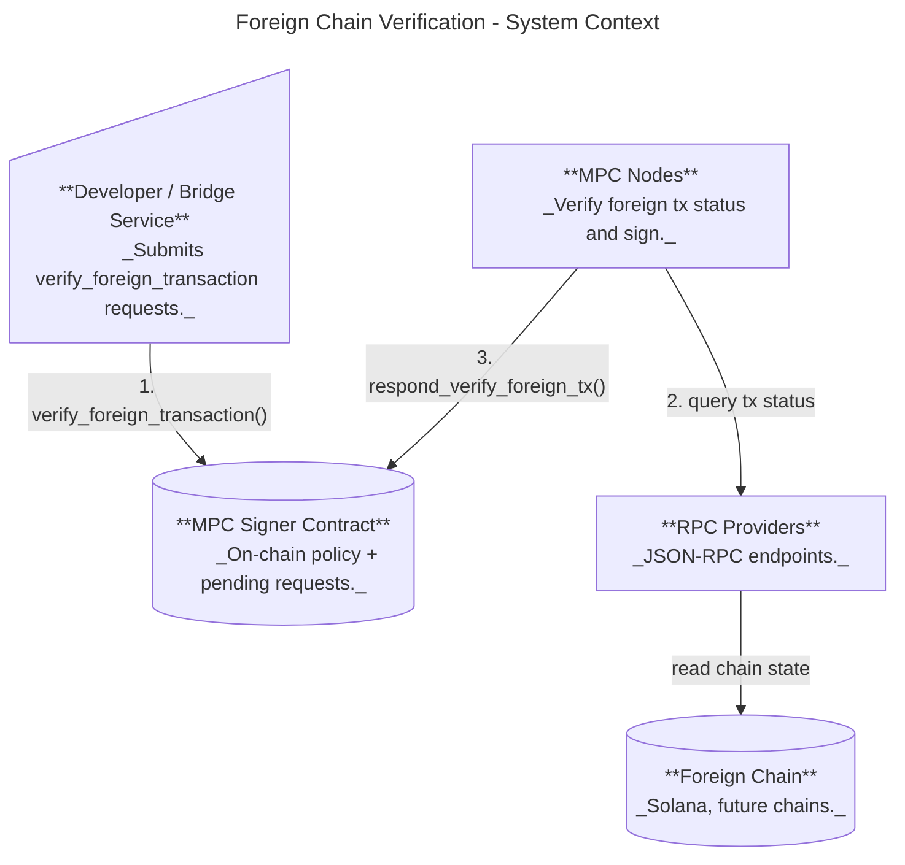
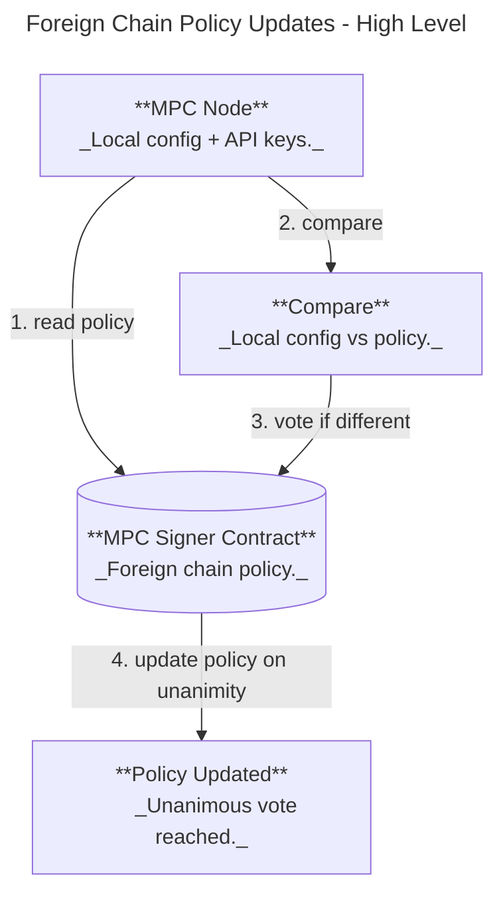

# Foreign Chain Transaction Verification (Design Proposal)

Status: Under discussion/design iterations

## Purpose & Motivation

This feature lets the MPC network sign payloads only after verifying a specific foreign-chain transaction, so NEAR contracts can react to external chain events without a trusted relayer. Primary use cases:

- Omnibridge inbound flow (foreign chain -> NEAR) where Chain Signatures are required to attest that a foreign transaction finalized successfully.
- Broader chain abstraction: a single MPC network verifies foreign chain state and signs conditional payloads.

## Scope

- In scope: contract-level API for verify+sign requests, node-side verification via configured RPC providers, deterministic provider selection, and extensible per-chain verifiers.
- Out of scope: on-chain light clients / cryptographic proofs, multi-round MPC consensus on verification results, and non-ECDSA schemes for verify_foreign_transaction (initially ECDSA only).

## Overview

At a high level:

1. A user submits a `verify_foreign_transaction` request with a chain-specific verification config.
2. MPC nodes verify the foreign transaction via configured RPC providers.
3. If verified, MPC signs `sha256(tx_id_bytes)` with the derived domain key and returns the signature on-chain.

### User Flow: Verify a Foreign Transaction



With the user flow in mind, this design extends the on-chain interface with the following methods:

### Contract Interface (Request/Response)

```rust
// Contract methods
verify_foreign_transaction(request: VerifyForeignTxRequestArgs) -> VerifyForeignTxResponse // Through a promise
respond_verify_foreign_tx({ request, response }) // Respond method for signers
```

```rust
// Contract DTOs
pub struct VerifyForeignTxRequestArgs {
    pub chain: ForeignChain,
    pub tx_id: ForeignTransactionId, // TxID is the payload we're signing
    pub path: String, // Key derivation path
    pub domain_id: DomainId,
}

pub struct VerifyForeignTxRequest {
    // Constructed from the args
    pub chain: ForeignChainRpcRequest,
    pub tx_id: ForeignTransactionId,
    pub tweak: Tweak,
    pub domain_id: DomainId,
}

pub struct VerifyForeignTxResponse {
    pub verified_at_block: ForeignBlockId,
    pub signature: SignatureResponse, // Signature over `sha256(tx_id_bytes)` where `tx_id_bytes` are chain-native bytes (e.g., Solana 64-byte signature).
}

pub enum ForeignChainRpcRequest {
    Solana(SolanaRpcRequest),
    Bitcoin(BitcoinRpcRequest),
    // Future chains...
}

pub struct SolanaRpcRequest {
    pub tx_id: SolanaTxId,
    pub finality: Finality, // Optimistic or Final
}

pub struct BitcoinRpcRequest {
    pub tx_id: BitcoinTxId,
    pub confirmations: usize, // required confirmations before considering final
}

pub enum Finality{
    Optimistic,
    Final,
}
```

### Domain Separation

To prevent callers from using plain `sign()` requests that could be mistaken for validated foreign-chain
transactions, we enforce domain separation by extending `DomainConfig` with a `DomainPurpose` enum.
Requests are only accepted for domains matching the purpose:
- `sign()` may only target domains with purpose `Sign`.
- `verify_foreign_transaction()` may only target domains with purpose `ForeignTx`.

```rust
pub enum DomainPurpose {
    Sign,
    ForeignTx,
    CKD,
}

pub struct DomainConfig {
    pub id: DomainId,
    pub scheme: SignatureScheme,
    pub purpose: DomainPurpose,
}
```

Compatibility note: legacy contract state does not include `DomainPurpose`. New nodes reading old state
must infer the purpose (e.g., treat existing Secp256k1/Ed25519/V2Secp256k1 domains as `Sign` and
Bls12381 domains as `CKD`) until a migration writes explicit purposes.

### Contract state (Foreign Chain Policy)

The contract maintains a *foreign chain policy* that defines which chains and RPC providers are allowed.

```rust
pub struct ForeignChainPolicy {
    pub chains: BTreeSet<ForeignChainConfig>,
}

pub struct ForeignChainConfig {
    pub chain: ForeignChain,
    pub providers: NonEmptyVec<RpcProvider>,
}

pub enum ForeignChain {
    Solana,
    Bitcoin,
    // Future chains...
}

pub struct RpcProvider{
    rpc_url: String,
};

pub struct ForeignChainPolicyVotes {
    // Each authenticated participant has one active vote for a proposal.
    pub proposal_by_account: BTreeMap<AccountId, ForeignChainPolicy>,
}
```

### Failure and Timeout Behavior

- Nodes **abstain** if verification fails (RPC error, tx not found, or not finalized).
- A failed verification does **not** produce an on-chain failure response. The request eventually times out and fails with the standard timeout error.

For operators, policy updates control which chains/providers are allowed:

### Operator Flow: Policy Updates (New Chains / Providers)



### Contract Policy State (Types)
See "Contract state (Foreign Chain Policy)" above.

### Node Configuration and Policy Updates

- Node config contains chain RPC providers and timeouts (API keys stay local).
- On startup, nodes compare local config to the on-chain policy.
- If different, a node submits a vote for the policy derived from its local config.
- Policy updates are applied only when all current participants vote for the same proposal.
- Pending proposals and vote counts are visible via `get_foreign_chain_policy_proposals()`.

Provider selection is deterministic across nodes:

### Deterministic Provider Selection

Each node selects a provider using a deterministic hash of the policy identity (provider RPC URL):

```
hash = sha256(participant_id || request_id || provider_rpc_url)
```

Providers are sorted by this hash to build a deterministic ordering:

- **Primary provider** = first in the ordering.
- **Fallback** = subsequent providers in order.
- Each provider can include backup URLs for failover.

This ensures different nodes query different providers for the same request while preserving determinism.

### Configuration (Node)

Example config snippet:

```yaml
foreign_chains:
  solana:
    timeout_sec: 30
    max_retries: 3
    providers:
      alchemy:
        rpc_url: "https://solana-mainnet.g.alchemy.com/v2/"
        api_key:
          env: ALCHEMY_API_KEY
      quicknode:
        rpc_url: "https://your-endpoint.solana-mainnet.quiknode.pro/"
        api_key:
          val: "<your-api-key-here>"
```

The contract policy references providers by **rpc_url**, and nodes must have matching
provider entries in config (including API keys) to satisfy the policy.

## Risks

- **RPC trust and correctness**: Verification relies on centralized RPC providers. A malicious
  or faulty provider could return incorrect status for a subset of nodes.
- **No additional consensus**: Nodes independently verify and abstain on failure. If a threshold
  of nodes are misled by providers, the network could sign invalid payloads.
- **Provider availability**: Outages or rate limits can cause verification failures and reduced
  signing availability.
- **Finality semantics**: Finality definitions differ across chains; mapping them correctly is critical.
- **Operational friction**: Unanimous voting for policy updates may slow rollouts and hot fixes.
- **Config drift**: Nodes missing required provider keys will fail startup validation.

## Discussion points
- The current design only proves transactions exists. For most bridges you'd want to verify the execution result, and potentially check values in transaction logs or events. How can we update the design to support this?
- Can we assume all RPC providers take API keys as bearer tokens?
  - Need to investigate this.
