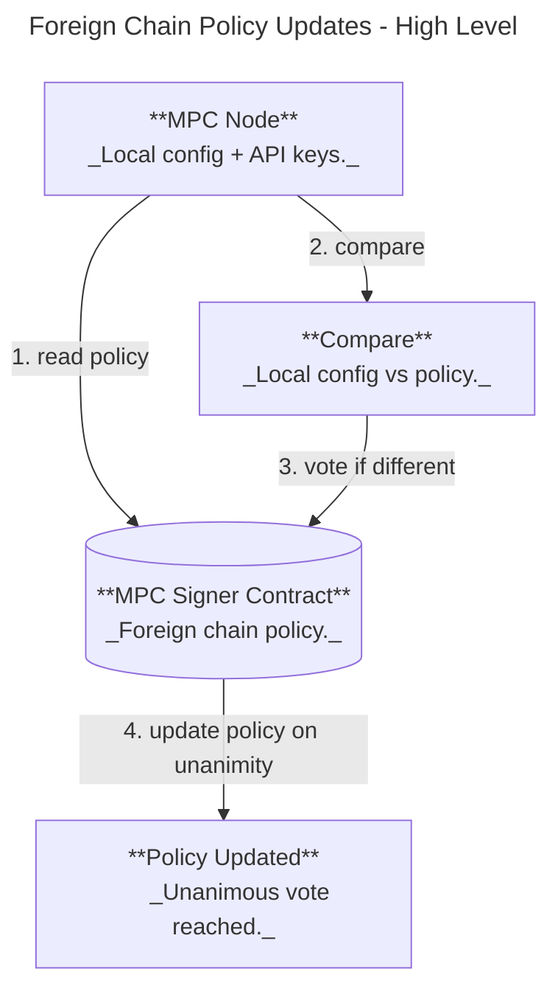

# Foreign Chain Transaction Verification (Design Proposal)

Status: Draft (based on PR #1851 / branch `read-foreign-chain`)

## Purpose & Motivation

This feature lets the MPC network sign payloads only after verifying a specific foreign-chain transaction, so NEAR contracts can react to external chain events without a trusted relayer. Primary use cases:

- Omnibridge inbound flow (foreign chain -> NEAR) where Chain Signatures are required to attest that a foreign transaction finalized successfully.
- Broader chain abstraction: a single MPC network verifies foreign chain state and signs conditional payloads.

## Scope

- In scope: contract-level API for verify+sign requests, node-side verification via configured RPC providers, deterministic provider selection, and extensible per-chain verifiers.
- Out of scope: on-chain light clients / cryptographic proofs, multi-round MPC consensus on verification results, and non-ECDSA schemes for verify_foreign_transaction (initially ECDSA only).

## High-Level Design

### System Context Diagram


### Core Flow: Foreign Chain Policy Updates (New Chains / Providers)



### Key Components and Responsibilities

**On-chain (mpc-contract)**

- New API:
  - `verify_foreign_transaction(request)` - stores request, yields a callback. Request includes `chain`, `tx_id`, `finality`, `path`, and optional `domain_id`.
  - `respond_verify_foreign_tx(request, response)` - validates signature + resolves the callback. Response includes `verified_at_block` and the signature.
  - `vote_foreign_chain_policy(proposal)` - unanimous vote to update supported chains/providers.
  - `get_foreign_chain_policy()` and `get_foreign_chain_policy_proposals()`.
- Policy gating:
  - If policy is empty, verification is **disabled**.
  - Request chain must be in policy.
  - Policy includes **provider names only** (no secrets).
- Payload derivation:
  - `payload = sha256(tx_id_bytes)` (ECDSA only).
  - For Solana, `tx_id` is a base58 signature in JSON, but the hash uses the raw 64-byte signature bytes.
  - Tweak derivation: `tweak = derive_tweak(predecessor_account_id, path)`.
- Finality levels:
  - `Optimistic` (e.g., Solana confirmed)
  - `Final` (e.g., Solana finalized)

**Off-chain (mpc-node)**

- **ForeignChainVerifierRegistry**
  - Dispatches to chain-specific verifiers (initially Solana).
  - Uses deterministic provider selection.
- **Foreign Chain Policy Voter**
  - On startup: validates local config vs on-chain policy.
  - Auto-votes if policy differs from local config.
- **MPC Client**
  - Indexes verify_foreign_tx requests.
  - Verifies transaction via RPC, then runs MPC signing.
  - Responds to contract with `verified_at_block` + signature.
- **Storage**
  - `VerifyForeignTxStorage` persists verification requests.
  - Atomic write with `SignRequestStorage` to avoid crash inconsistencies.

### Request/Response Summary (Contract)

```
verify_foreign_transaction({
  chain, tx_id, finality, path, domain_id?
}) -> promise (callback on success)

respond_verify_foreign_tx({
  request, response: { verified_at_block, signature }
})
```

### Failure and Timeout Behavior

- Nodes **abstain** if verification fails (RPC error, tx not found, or not finalized).
- A failed verification does **not** produce an on-chain failure response. The request eventually times out and fails with the standard timeout error.

### Deterministic Provider Selection

Each node selects a provider using a deterministic hash of:

```
hash = sha256(participant_id || request_id || provider_name)
```

Providers are sorted by this hash to build a deterministic ordering:

- **Primary provider** = first in the ordering.
- **Fallback** = subsequent providers in order.
- Each provider can include backup URLs for failover.

This ensures different nodes query different providers for the same request while preserving determinism.

### Configuration (Node)

Example config snippet:

```yaml
foreign_chains:
  solana:
    timeout_sec: 30
    max_retries: 3
    providers:
      alchemy:
        rpc_url: "https://solana-mainnet.g.alchemy.com/v2/${ALCHEMY_API_KEY}"
      quicknode:
        rpc_url: "https://your-endpoint.solana-mainnet.quiknode.pro/${QN_API_KEY}"
        backup_urls:
          - "https://backup.solana.quiknode.pro/${QN_API_KEY}"
```

The contract policy references providers by **name**, and nodes must have matching
provider entries in config (including API keys) to satisfy the policy.

## Risks

- **RPC trust and correctness**: Verification relies on centralized RPC providers. A malicious
  or faulty provider could return incorrect status for a subset of nodes.
- **No additional consensus**: Nodes independently verify and abstain on failure. If a threshold
  of nodes are misled by providers, the network could sign invalid payloads.
- **Provider availability**: Outages or rate limits can cause verification failures and reduced
  signing availability.
- **Finality semantics**: Finality definitions differ across chains; mapping them correctly is critical.
- **Operational friction**: Unanimous voting for policy updates may slow rollouts and hot fixes.
- **Config drift**: Nodes missing required provider keys will fail startup validation.

## Open Questions / Follow-ups

- Should the policy vote threshold stay **unanimous**, or be configurable (e.g., threshold)?
- Should nodes keep a minimum number of independent providers per chain?
- Should we add optional multi-provider verification for high-value requests?
- How do we standardize finality mapping for additional chains (Ethereum, Bitcoin, etc.)?
- Startup validation: when policy is empty, nodes skip config validation and can still boot/vote an initial policy. Is this the desired operational behavior?
