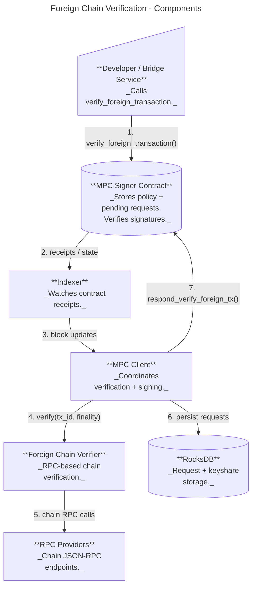
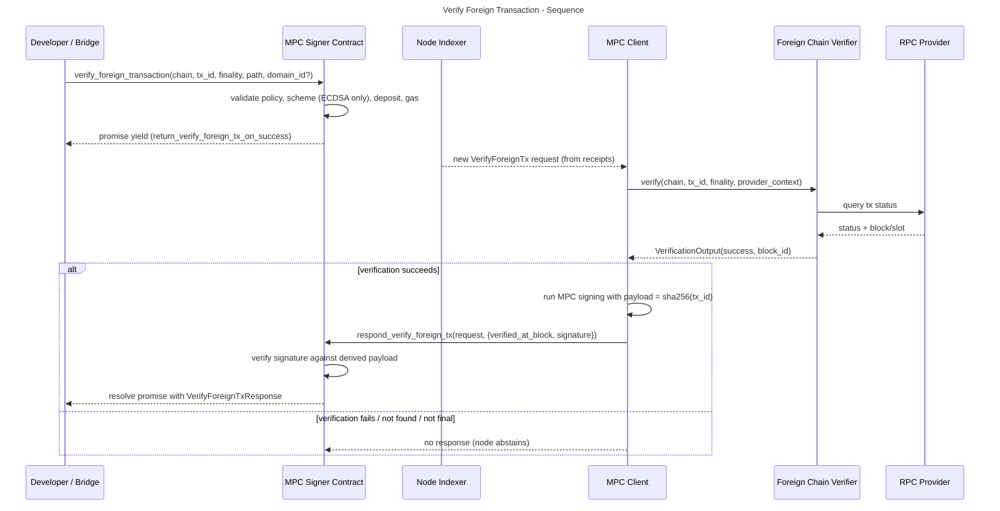
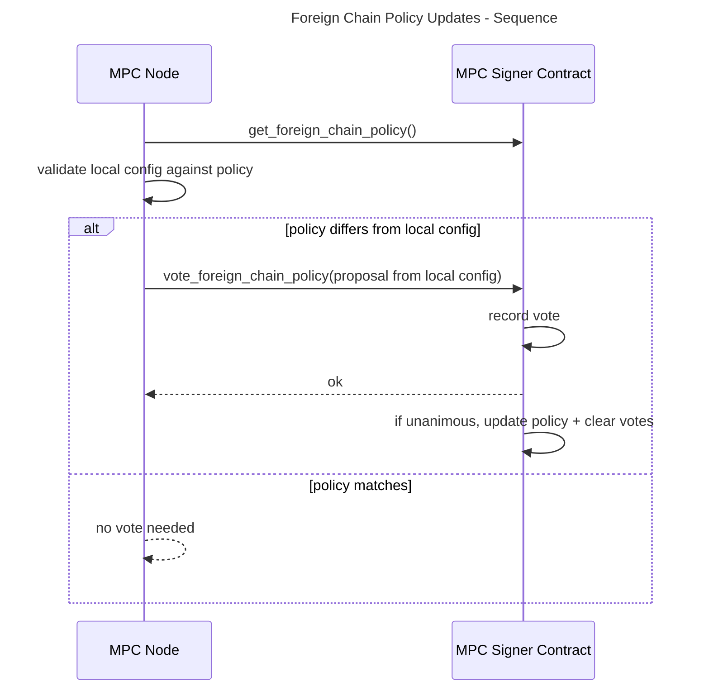

# Foreign Chain Transaction Verification (Design Proposal)

Status: Draft (based on PR #1851 / branch `read-foreign-chain`)

## Motivation

The MPC network currently signs payloads that are already known to be valid within NEAR. For cross-chain use cases, we need to ensure that a foreign-chain transaction has actually succeeded before the MPC network signs a message derived from it.

Primary motivations and use cases:

- Omnibridge inbound flow (foreign chain -> NEAR) where Chain Signatures are required to attest that a foreign transaction finalized successfully.
- Broader chain abstraction efforts where a single MPC network can verify foreign chain state and sign conditional payloads.
- Reduce reliance on centralized oracles by having MPC nodes independently verify foreign-chain transaction status.

Scope notes from the initial discussion:

- Start with **foreign transaction status verification** only.
- This enables bridge use cases but does **not** migrate the hot-wallet use case.
- "Hot bridge" can work with this but would require significant refactors on their end.

## Goals

- Provide a **contract-level API** to request verification + signing for a foreign transaction.
- Ensure each MPC node independently verifies the transaction using **configured RPC providers**.
- Avoid extra consensus rounds: nodes that cannot verify simply **abstain**.
- Support deterministic provider selection to reduce reliance on any single RPC endpoint.
- Make it easy to extend support to additional foreign chains over time.

## Non-Goals

- Provide on-chain light client verification (too heavy for the contract).
- Provide cryptographic proofs of foreign chain state.
- Support non-ECDSA signature schemes for verify_foreign_transaction (initially ECDSA only).
- Support hot-wallet migration or generalized signing conditioned on arbitrary predicates.

## High-Level Design

### System Context Diagram


### Component Diagram



### Core Flow: Verify Foreign Transaction



### Core Flow: Foreign Chain Policy Updates (New Chains / Providers)



### Key Components and Responsibilities

**On-chain (mpc-contract)**

- New API:
  - `verify_foreign_transaction(request)` - stores request, yields a callback.
  - `respond_verify_foreign_tx(request, response)` - validates signature + resolves the callback.
  - `vote_foreign_chain_policy(proposal)` - unanimous vote to update supported chains/providers.
  - `get_foreign_chain_policy()` and `get_foreign_chain_policy_proposals()`.
- Policy gating:
  - If policy is empty, verification is **disabled**.
  - Request chain must be in policy.
  - Policy includes **provider names only** (no secrets).
- Payload derivation:
  - `payload = sha256(tx_id)` (ECDSA only).
- Finality levels:
  - `Optimistic` (e.g., Solana confirmed)
  - `Final` (e.g., Solana finalized)

**Off-chain (mpc-node)**

- **ForeignChainVerifierRegistry**
  - Dispatches to chain-specific verifiers (initially Solana).
  - Uses deterministic provider selection.
- **Foreign Chain Policy Voter**
  - On startup: validates local config vs on-chain policy.
  - Auto-votes if policy differs from local config.
- **MPC Client**
  - Indexes verify_foreign_tx requests.
  - Verifies transaction via RPC, then runs MPC signing.
  - Responds to contract with `verified_at_block` + signature.
- **Storage**
  - `VerifyForeignTxStorage` persists verification requests.
  - Atomic write with `SignRequestStorage` to avoid crash inconsistencies.

### Deterministic Provider Selection

Each node selects a provider using a deterministic hash of:

```
hash = sha256(participant_id || request_id || provider_name)
```

Providers are sorted by this hash to build a deterministic ordering:

- **Primary provider** = first in the ordering.
- **Fallback** = subsequent providers in order.
- Each provider can include backup URLs for failover.

This ensures different nodes query different providers for the same request while preserving determinism.

### Configuration (Node)

Example config snippet:

```yaml
foreign_chains:
  solana:
    timeout_sec: 30
    max_retries: 3
    providers:
      alchemy:
        rpc_url: "https://solana-mainnet.g.alchemy.com/v2/${ALCHEMY_API_KEY}"
      quicknode:
        rpc_url: "https://your-endpoint.solana-mainnet.quiknode.pro/${QN_API_KEY}"
        backup_urls:
          - "https://backup.solana.quiknode.pro/${QN_API_KEY}"
```

The contract policy references providers by **name**, and nodes must have matching
provider entries in config (including API keys) to satisfy the policy.

## Risks

- **RPC trust and correctness**: Verification relies on centralized RPC providers. A malicious
  or faulty provider could return incorrect status for a subset of nodes.
- **No additional consensus**: Nodes independently verify and abstain on failure. If a threshold
  of nodes are misled by providers, the network could sign invalid payloads.
- **Provider availability**: Outages or rate limits can cause verification failures and reduced
  signing availability.
- **Finality semantics**: Finality definitions differ across chains; mapping them correctly is critical.
- **Operational friction**: Unanimous voting for policy updates may slow rollouts and hot fixes.
- **Config drift**: Nodes missing required provider keys will fail startup validation.

## Alternatives Considered

1. **On-chain light clients / proofs**
   - Strong security but high on-chain cost and complexity.
   - Not practical for multiple chains and frequent requests.

2. **Dedicated oracle / relayer**
   - Simpler operational model but introduces a new trusted party.

3. **Explicit MPC consensus on verification result**
   - Adds a round of agreement on foreign tx status.
   - Increases latency and protocol complexity.

4. **Each node queries multiple providers and cross-checks**
   - More robust to bad data but higher latency and RPC costs.
   - Could be added later as a hardening option.

5. **Sign full transaction data or proofs instead of tx_id hash**
   - Larger payloads, chain-specific parsing, and validation logic.
   - Current design keeps payload small and stable.

## Open Questions / Follow-ups

- Should the policy vote threshold stay **unanimous**, or be configurable (e.g., threshold)?
- Should nodes keep a minimum number of independent providers per chain?
- Should we add optional multi-provider verification for high-value requests?
- How do we standardize finality mapping for additional chains (Ethereum, Bitcoin, etc.)?
