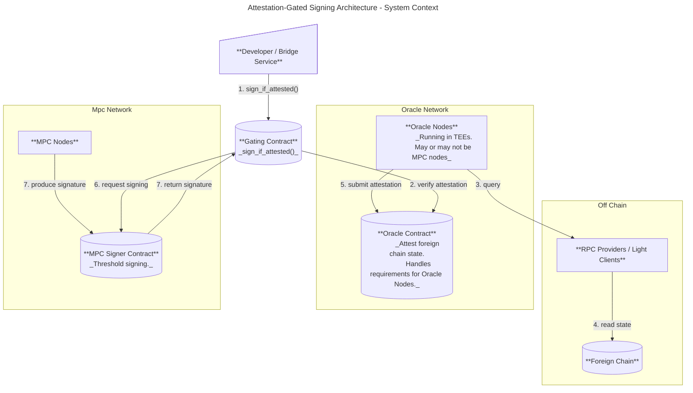

```mermaid
---
title: Attestation-Gated Signing Architecture - System Context
---
flowchart TD

    subgraph OffChain["Off Chain"]
        RPC["**RPC Providers / Light Clients**"]
        FC["**Foreign Chain**"]
        RPC -->|"4. read state"| FC
    end

    %% Oracle layer
    subgraph OracleLayer["Oracle Network"]
        OC["**Oracle Contract**
            _Attest foreign chain state.
             Handles requirements for Oracle Nodes._"]
        
        ON["**Oracle Nodes**
             _Running in TEEs.
             May or may not be MPC nodes_"]
        
        ON -->|"5. submit attestation"| OC
    end
    
    ON -->|"3. query"| RPC

    GC["**Gating Contract**
      _sign_if_attested()_"]


    %% MPC layer
    subgraph MpcLayer["Mpc Network"]
        MN["**MPC Nodes**"]
        MC["**MPC Signer Contract**
          _Threshold signing._"]
        MN -->|"7. produce signature"| MC
        
    end

    %% External
    DEV["**Developer / Bridge Service**"]

    %% Flows
    GC -->|"2. verify attestation"| OC
    GC -->|"6. request signing"| MC

    DEV -->|"1. sign_if_attested()"| GC
    MC -->|"7. return signature"| GC
    %% Shapes
    DEV@{ shape: manual-input}
    OC@{ shape: db}
    GC@{ shape: db}
    MC@{ shape: db}
    ON@{ shape: proc}
    MN@{ shape: proc}
    RPC@{ shape: proc}
    FC@{ shape: cylinder}
```
