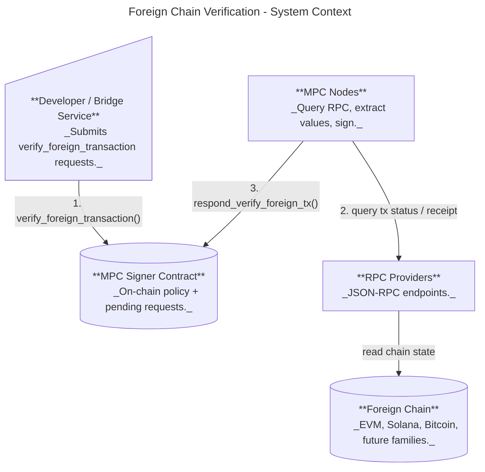
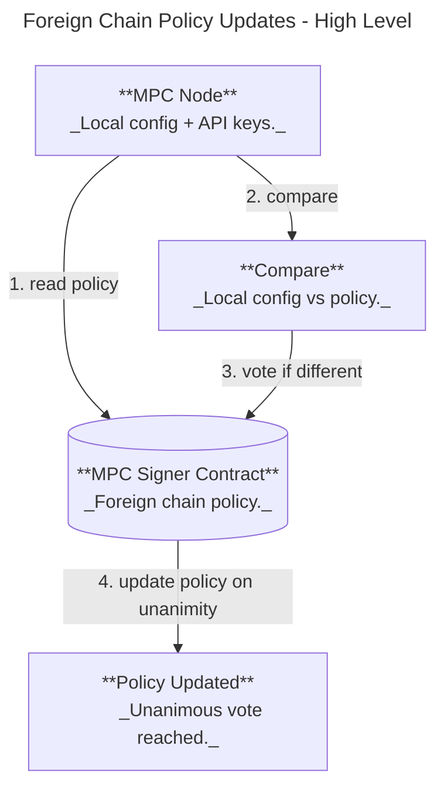

# Foreign Chain Transaction Verification Design

Status: Ready for development

## Purpose & Motivation

This feature lets the MPC network sign payloads only after verifying a specific foreign-chain transaction, so NEAR contracts can react to external chain events without a trusted relayer. Primary use cases:

* Omnibridge inbound flow (foreign chain -> NEAR) where Chain Signatures are required to attest that a foreign transaction finalized successfully.
* Broader chain abstraction: a single MPC network verifies foreign chain state and returns small, typed observations that contracts can interpret.

## Scope

* In scope: contract-level API for verify+sign requests, node-side verification via configured RPC providers, deterministic provider selection, and extensible per-chain-family extractors.
* Out of scope: on-chain light clients / cryptographic proofs, multi-round MPC consensus on verification results.

## Overview

At a high level:

1. A user submits a `verify_foreign_transaction` request with a chain-specific query and a list of **extractors**.
2. MPC nodes query the foreign chain via configured RPC providers.
3. Each node runs the requested extractors over the fetched RPC result(s), producing a **bounded set of small typed values**.
4. If extraction succeeds, MPC signs a canonical encoding of `(request, observed_values, observed_at)` and returns the signature on-chain.

This design intentionally keeps responses small and on-chain-friendly by enforcing:

* Each extractor returns **exactly one** typed value.
* The request includes a bounded number of extractors.
* Extracted values have strict size limits (e.g., bytes length caps).

### RPC Call Plan

Not all extractors can be satisfied by a single RPC method call.

* **Provider selection**: The request does **not** specify an RPC URL. Nodes deterministically select an allowed provider from the on-chain foreign-chain policy (with fallbacks).
* **Extractor-driven calls**: Each extractor implicitly defines which RPC method(s) it requires. Some extractors require more than one call. For the initial set:

  * **BlockHash (EVM)**: `eth_getTransactionReceipt` (or equivalent) for `blockHash`.
  * **BlockHash (Bitcoin)**: `getrawtransaction` (with verbose) to get the containing `blockhash` (and `getblock` if needed).
  * **SolanaProgramIdIndex / SolanaDataHash**: `getTransaction` to access `transaction.message` + `meta` and instruction data.
* **Shared fetches**: When multiple extractors require the same underlying data, nodes may perform the RPC call once and share the result across extractors.

To keep behavior predictable and auditable, each extractor family must have a fixed, well-specified set of RPC methods it may invoke, with strict timeouts and response-size limits.

### User Flow: Verify a Foreign Transaction



## Contract Interface (Request/Response)

```rust
// Contract methods
verify_foreign_transaction(request: VerifyForeignTxRequestArgs) -> VerifyForeignTxResponse // Through a promise
respond_verify_foreign_tx({ request, response }) // Respond method for signers
```

### Request DTOs

```rust
pub struct VerifyForeignTxRequestArgs {
    pub request: ForeignChainRpcRequest,
    pub path: String, // Key derivation path
    pub domain_id: DomainId,

    // Extractor-based observation request
    pub extractors: Vec<Extractor>,
    // (caller contracts validate extracted values on-chain)
}

pub struct VerifyForeignTxRequest {
    pub request: ForeignChainRpcRequest,
    pub tweak: Tweak,
    pub domain_id: DomainId,

    pub extractors: Vec<Extractor>,
}
```

### Chain Query DTOs

```rust
pub enum ForeignChainRpcRequest {
    Evm(EvmRpcRequest),
    Solana(SolanaRpcRequest),
    Bitcoin(BitcoinRpcRequest),
    // Future chains...
}

pub struct EvmRpcRequest {
    // Ethereum/Base/Bnb/Arbitrum
    pub chain: ForeignChain,
}

pub struct SolanaRpcRequest {
    pub tx_id: SolanaTxId, // This is the payload we're signing
    pub finality: Finality, // Optimistic or Final
}

pub struct BitcoinRpcRequest {
    pub tx_id: BitcoinTxId, // This is the payload we're signing
    pub confirmations: usize, // required confirmations before considering final
}

pub enum Finality {
    Optimistic,
    Final,
}
```

### Response DTOs

```rust
pub struct VerifyForeignTxResponse {
    pub observed_at_block: ForeignBlockId,

    // One value per extractor (same ordering as request.extractors)
    pub values: Vec<ExtractedValue>,

    // Signature over canonical bytes of (request, observed_at_block, values)
    pub signature: SignatureResponse,
}

pub enum ExtractedValue {
    Bool(bool),
    U64(u64),
    Bytes(Vec<u8>),          // length-capped
    H160([u8; 20]),
    H256([u8; 32]),
}
```

### Extractors

Extractors are strongly typed, bounded operations defined by the MPC protocol implementation.

* Each `Extractor` identifies a built-in extractor and its parameters.
* Each extractor must return exactly one `ExtractedValue`.
* Extractors must be deterministic and specified independently of provider-specific JSON formatting.
* Initial extractor set is intentionally limited and isolated to avoid ambiguity. We'll add more as we uncover more use cases and needs.

```rust
pub enum EvmExtractor {
    BlockHash,
}

pub enum SolanaExtractor {
    // Resolves instruction.programIdIndex to the actual program pubkey via account keys.
    SolanaProgramIdIndex { ix_index: u32 },
    // Hash of the instruction data bytes for ix_index.
    SolanaDataHash { ix_index: u32 },
}

pub enum BitcoinExtractor {
    BlockHash,
}
```

#### Solana extractor details (context from RPC responses)

Solana transaction RPC responses encode the instruction’s program as an index (`programIdIndex`) into the
transaction’s account list. To make the value useful on-chain, `SolanaProgramIdIndex` **resolves the index**
to the actual 32-byte program pubkey using the `accountKeys` / loaded addresses arrays from `getTransaction`.
This avoids relying on caller-side mapping and keeps the extracted value self-contained.

`SolanaDataHash` hashes the raw instruction data bytes for the requested `ix_index` so large instruction payloads
never appear on-chain. The hash function is fixed by the extractor definition and is **sha256**.

## Domain Separation

To prevent callers from using plain `sign()` requests that could be mistaken for validated foreign-chain
transactions, we enforce domain separation by extending `DomainConfig` with a `DomainPurpose` enum.
Requests are only accepted for domains matching the purpose:

* `sign()` may only target domains with purpose `Sign`.
* `verify_foreign_transaction()` may only target domains with purpose `ForeignTx`.

```rust
pub enum DomainPurpose {
    Sign,
    ForeignTx,
    CKD,
}

pub struct DomainConfig {
    pub id: DomainId,
    pub scheme: SignatureScheme,
    pub purpose: DomainPurpose,
}
```

Compatibility note: legacy contract state does not include `DomainPurpose`. New nodes reading old state
must infer the purpose (e.g., treat existing Secp256k1/Ed25519/V2Secp256k1 domains as `Sign` and
Bls12381 domains as `CKD`) until a migration writes explicit purposes.

## Contract State (Foreign Chain Policy)

The contract maintains a *foreign chain policy* that defines which chains and RPC providers are allowed.

```rust
pub struct ForeignChainPolicy {
    pub chains: BTreeSet<ForeignChainConfig>,
}

pub struct ForeignChainConfig {
    pub chain: ForeignChain,
    pub providers: NonEmptyVec<RpcProvider>,
}

pub enum ForeignChain {
    Solana,
    Bitcoin,
    Ethereum,
    Base,
    Bnb,
    Arbitrum,
    // Future chains...
}

pub struct RpcProvider {
    rpc_url: String,
}

pub struct ForeignChainPolicyVotes {
    // Each authenticated participant has one active vote for a proposal.
    pub proposal_by_account: BTreeMap<AccountId, ForeignChainPolicy>,
}
```

## Deterministic Provider Selection

Each node selects a provider using a deterministic hash of the policy identity (provider RPC URL):

```
hash = sha256(participant_id || request_id || provider_rpc_url)
```

Providers are sorted by this hash to build a deterministic ordering:

* **Primary provider** = first in the ordering.
* **Fallback** = subsequent providers in order.
* Each provider can include backup URLs for failover.

This ensures different nodes query different providers for the same request while preserving determinism.

## Failure and Timeout Behavior

* Nodes **abstain** if RPC queries fail or extraction fails.
* A failed verification does **not** produce an on-chain failure response. The request eventually times out and fails with the standard timeout error.

For operators, policy updates control which chains/providers are allowed:

### Operator Flow: Policy Updates (New Chains / Providers)



### Contract Policy State (Types)
See "Contract State (Foreign Chain Policy)" above.

## Node Configuration and Policy Updates

* Node config contains chain RPC providers and timeouts (API keys stay local).
* On startup, nodes compare local config to the on-chain policy.
* If different, a node submits a vote for the policy derived from its local config.
* Policy updates are applied only when all current participants vote for the same proposal.
* Pending proposals and vote counts are visible via `get_foreign_chain_policy_proposals()`.

### Configuration (Node)

Example config snippet:

```yaml
foreign_chains:
  solana:
    timeout_sec: 30
    max_retries: 3
    providers:
      alchemy:
        rpc_url: "https://solana-mainnet.g.alchemy.com/v2/"
        auth:
          kind: header
          name: Authorization
          scheme: Bearer
          token:
            env: ALCHEMY_API_KEY
      quicknode:
        rpc_url: "https://your-endpoint.solana-mainnet.quiknode.pro/"
        auth:
          kind: header
          name: x-api-key
          token:
            val: "<your-api-key-here>"
      ankr:
        rpc_url: "https://rpc.ankr.com/near/{api_key}"
        auth:
          kind: path
          placeholder: "{api_key}"
          token:
            env: ANKR_API_KEY
      public:
        rpc_url: "https://rpc.public.example.com"
        auth:
          kind: none
```

The contract policy references providers by **rpc_url**, and nodes must have matching
provider entries in config (including API keys) to satisfy the policy.

Auth variants are explicitly modeled because providers differ in how they expect API keys
to be supplied (e.g., bearer tokens, custom headers, query params, or URL path tokens), and some
providers require no auth at all.

## Risks

* **RPC trust and correctness**: Verification relies on centralized RPC providers. A malicious
  or faulty provider could return incorrect data for a subset of nodes.
* **No additional consensus**: Nodes independently query providers and abstain on failures.
  If a threshold of nodes are misled by providers, the network could sign invalid observations.
* **Provider availability**: Outages or rate limits can cause verification failures and reduced
  signing availability.
* **Finality semantics**: Finality definitions differ across chains; mapping them correctly is critical.
* **Operational friction**: Unanimous voting for policy updates may slow rollouts and hot fixes.
* **Config drift**: Nodes missing required provider keys will fail startup validation.
* **Extractor correctness**: Bugs or ambiguous specifications in extractors could produce incorrect values.
