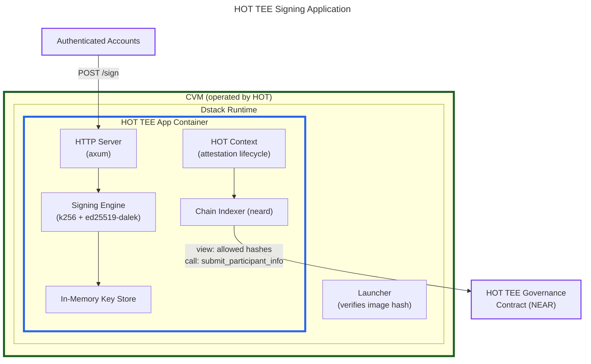
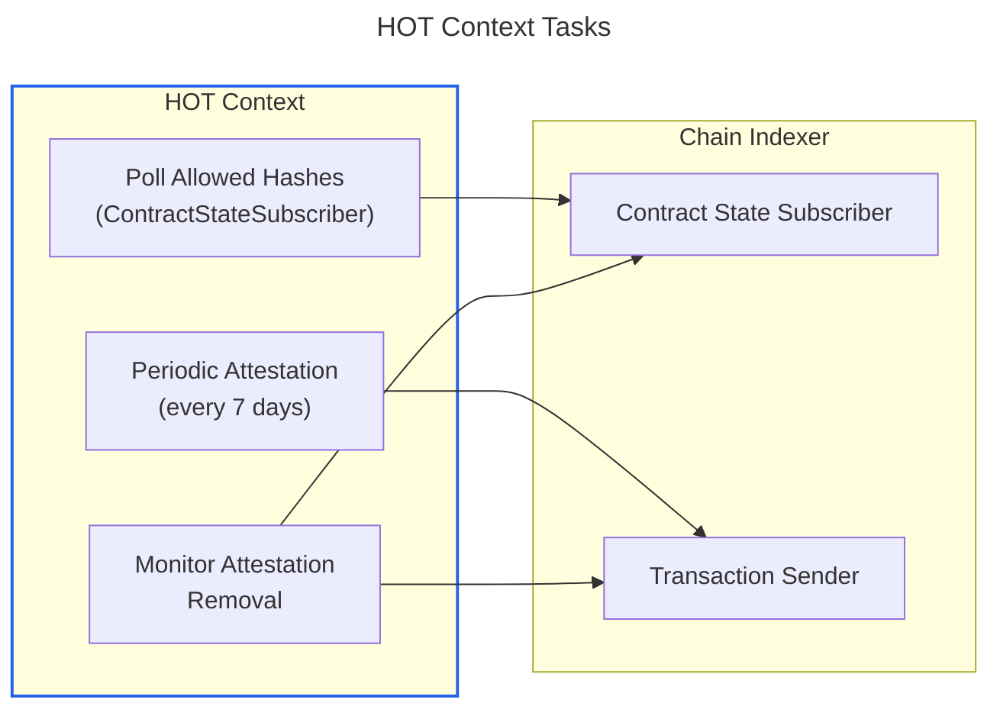
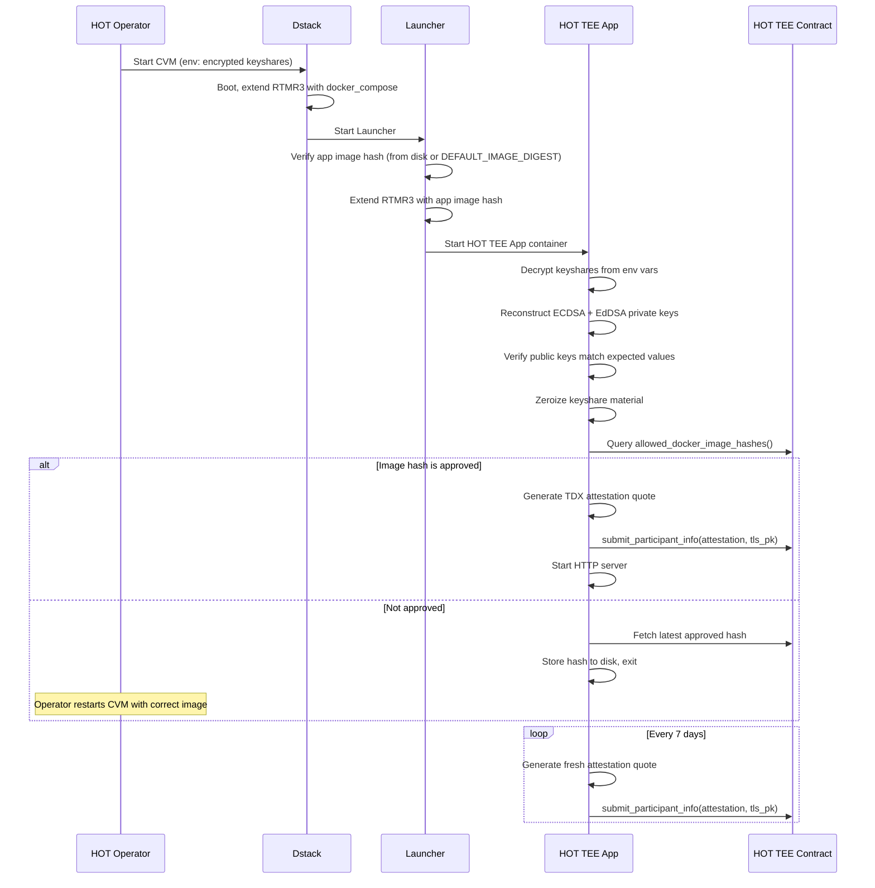

# HOT TEE Signing Application

This document outlines the design of a TEE application for long-term support of legacy HOT Wallet keys.

## Background

### Problem

HOT Labs operates a threshold MPC network for ECDSA (secp256k1) and EdDSA (ed25519) signing on behalf of HOT Wallet users. HOT Labs wants to retire this network. NEAR does not want to import HOT's keyshares into its own MPC network due to liability concerns: if a key was compromised before import, NEAR would still be held responsible for any resulting exploit — regardless of the security guarantees NEAR's MPC network provides.

The compromise: build a standalone application running inside a Trusted Execution Environment (TEE) that holds the reconstructed full private keys and handles signing requests. HOT will operate this application.

c.f. [#2062](https://github.com/near/mpc/issues/2062), [#2018](https://github.com/near/mpc/issues/2018), [#2021](https://github.com/near/mpc/pull/2021)

### HOT MPC Network vs. NEAR MPC Network

HOT's MPC network ([`near/hot-mpc`](https://github.com/near/hot-mpc)) is a fork of an earlier version of NEAR's MPC network ([`near/mpc`](https://github.com/near/mpc)). They share a common ancestor and the same high-level architecture, but have diverged significantly:

| Aspect | NEAR MPC | HOT MPC |
|---|---|---|
| **Crypto library** | [`threshold-signatures`](https://github.com/near/threshold-signatures) (FROST-based) | `cait-sith` fork (Beaver triple-based) |
| **Signature schemes** | ECDSA, EdDSA, Robust ECDSA, CKD | ECDSA, EdDSA |
| **Sign request source** | On-chain (block event indexer) | Off-chain only (HTTP API via `hot_protocol::MpcClient`) |
| **Sign authorization** | Implicit: on-chain contract checks caller and deposit | Explicit: each node calls [`Validation::verify()`](https://github.com/hot-dao/hot-validation-sdk/blob/2c669f97d547d2fc9cfb011ff207282590aa8bc5/core/src/lib.rs#L143) with a [`ProofModel`](https://github.com/hot-dao/hot-validation-sdk/blob/2c669f97d547d2fc9cfb011ff207282590aa8bc5/primitives/src/validation.rs#L7-L12) — looks up a wallet contract via the user's [`Uid`](https://github.com/hot-dao/hot-validation-sdk/blob/2c669f97d547d2fc9cfb011ff207282590aa8bc5/primitives/src/uid.rs#L11), which may delegate to cross-chain auth calls |
| **Keygen / resharing** | Contract-driven (on-chain state machine: `Initializing`/`Resharing` → `Running`) | CLI-driven (`HotProtocolKeygen`, `HotProtocolReshare` commands) |
| **Codebase structure** | Modular multi-crate workspace | Single monolithic node crate |
| **TEE support** | Full attestation framework (`tee-authority`, `mpc-attestation`) | None |
| **Contract** | TEE attestation, DCAP verification, launcher compose hashes | Basic code hash voting only, no attestation infrastructure |

### Why a Custom Binary

Several approaches were considered:

1. **Running the existing MPC stack with a single node** — rejected because the [`threshold-signatures`](https://github.com/near/threshold-signatures) crate does not support fewer than 2 shares, and it carries significant unnecessary complexity (P2P networking, resharing, triple/presignature generation, block event indexing).

2. **Running two MPC nodes inside one CVM** — rejected because it has a higher maintenance burden and is susceptible to the same bugs seen in mainnet/testnet deployments.

3. **Custom lightweight binary** — chosen because:
   - Light-weight, easy to reason about.
   - Reuses modular TEE attestation logic and chain indexer components already being developed ([indexer design](indexer-design.md)).
   - Future-proof: can be reused as a "graveyard" for NEAR's own deprecated domains.
   - More in line with other ongoing priorities (backup service, [#1891](https://github.com/near/mpc/issues/1891)) — both reuse the same modular components (attestation, chain indexer) without the full MPC node stack.

### Scope

The HOT TEE Signing Application:
- Receives signature requests via an HTTP API (_not_ on-chain). HOT's existing backend already sends sign requests via HTTP. Current volume is ~25k requests/day (bearish market baseline) with spikes to 25+ TPS during campaigns (airdrops, mints, claims). On-chain requests would add per-request gas costs (~$0.001/tx → ~$750/month at current low volume, scaling with activity), latency, and require the _Block Event Subscriber_.
- Signs using the [reconstructed](#key-import-process) full private key directly with `k256` and `ed25519-dalek` (_not_ threshold signatures). With the full private key reconstructed inside the TEE, threshold signing provides no security benefit.
- Submits TEE attestation on-chain to a dedicated HOT governance contract.
- Monitors the HOT governance contract for allowed Docker image hashes and launcher compose hashes.
- Is operated by the HOT Wallet team, not NEAR.

### Supported Signature Schemes

| Scheme | Curve | Library | HOT Domain |
|--------|-------|---------|------------|
| ECDSA | secp256k1 | [`k256`][k256] | [`DomainId(0)`][domain-0] |
| EdDSA | ed25519 | [`ed25519-dalek`][ed25519-dalek] | [`DomainId(1)`][domain-1] |

[k256]: https://crates.io/crates/k256
[ed25519-dalek]: https://crates.io/crates/ed25519-dalek
[domain-0]: https://github.com/near/hot-mpc/blob/kuksag/hot-protocol/libs/chain-signatures/contract/src/primitives/domain.rs#L21-L24
[domain-1]: https://github.com/near/hot-mpc/blob/kuksag/hot-protocol/node/src/tests/multidomain.rs#L36-L37

---

## Architecture Overview

### Component Diagram



### Relationship to MPC Network Architecture

The HOT TEE app reuses the chain indexer (Contract State Subscriber, Transaction Sender), TEE attestation crates (`tee-authority`, `mpc-attestation`), and the [Context pattern](indexer-design.md#mpc-context) (adapted as HOT Context for attestation lifecycle only). Everything else from the MPC node is omitted: P2P networking, threshold signing protocols, triple/presignature generation, key generation/resharing, block event indexing, and RocksDB storage. Signing is done directly with `k256`/`ed25519-dalek` using the reconstructed full private keys.

### Crate Dependencies


### Embedded Indexer Node

The HOT TEE app embeds a full `near-indexer` (which includes a `neard` node), the same as the MPC node, rather than using a lightweight RPC client. The embedded neard is used exclusively for **TEE governance operations**: monitoring the HOT governance contract for allowed Docker image hashes and launcher compose hashes, and submitting TEE attestation transactions. Running `neard` inside the CVM eliminates external RPC trust assumptions — the app verifies chain state directly, with no external trust assumptions beyond the NEAR network itself.

The signing flow itself is entirely off-chain — HTTP requests in, signatures out. Request authorization uses `hot-validation-core`'s own RPC clients (not the embedded neard) to query wallet contracts on NEAR and other chains.

The Chain Indexer's `ContractStateSubscriber` and `TransactionSender` traits (from the [indexer design](indexer-design.md)) provide the interface. The HOT Context sits on top of the chain indexer, the same way the MPC Context does in the MPC node.

---

## Key Import Process

### Overview

Key import is a one-time operation performed at initial deployment. HOT MPC network operators export their threshold keyshares, which are then delivered to the TEE application. The application reconstructs the full private keys via Lagrange interpolation and verifies them against the expected public keys.

### Phase 1: Export (HOT Operators)

Each HOT MPC node operator runs the `ExportKeyshareCmd` CLI command (from [`hot-mpc/node/src/cli.rs`](https://github.com/near/hot-mpc/blob/bd19508821ceb974e107e701cc106866b1442d6f/node/src/cli.rs#L411-L459)):

```rust
pub struct ExportKeyshareCmd {
    pub home_dir: String,
    pub local_encryption_key_hex: String,
}
```

This currently **only exports ECDSA keyshares** — it calls `legacy_ecdsa_key_from_keyshares()` (see [`keyshare/compat.rs`](https://github.com/near/hot-mpc/blob/bd19508821ceb974e107e701cc106866b1442d6f/node/src/keyshare/compat.rs)) which only handles `KeyshareData::Secp256k1`. It must be extended to also export EdDSA keyshares (this work is on the HOT codebase side). Recommended extended export format:

```rust
/// Recommended export format for the HOT TEE import process.
/// One of these is produced per HOT MPC node operator.
#[derive(Serialize, Deserialize)]
pub struct ExportedKeyshares {
    /// Epoch ID of the exported keyshares.
    pub epoch: u64,
    /// Participant index of the exporting node (1-indexed, used for Lagrange).
    pub participant_index: u32,
    /// ECDSA (secp256k1) keyshare.
    pub ecdsa: ExportedKeyshare,
    /// EdDSA (ed25519) keyshare — requires extending the current export.
    pub eddsa: ExportedKeyshare,
}

#[derive(Serialize, Deserialize)]
pub struct ExportedKeyshare {
    /// The threshold secret share (scalar), hex-encoded.
    pub private_share: String,
    /// The group public key, hex-encoded (SEC1 for ECDSA, compressed for EdDSA).
    pub public_key: String,
}
```

The extension is straightforward: iterate over all keyshares in `PermanentKeyshareData` instead of just the first one, and handle both `KeyshareData::Secp256k1` and `KeyshareData::Ed25519` variants. The `participant_index` should be derived from the node's position in the participant set (available from the contract state or the node's config).

### Phase 2: Encryption and Delivery

The exported keyshares are encrypted and delivered to the TEE as environment variables:

1. Each keyshare is encrypted with AES-256-GCM using a strong symmetric key.
2. The encrypted payloads are signed by the exporting operator for authenticity verification.
3. The encrypted keyshares and decryption key are passed as environment variables to the CVM.

```rust
/// Environment variables passed to the CVM (listed in app-compose.json allowed_envs)
///
/// HOT_ENCRYPTED_KEYSHARES: JSON array of encrypted keyshare payloads
///   Each entry: { operator_id: u32, ciphertext: hex, nonce: hex, signature: hex }
///
/// HOT_KEYSHARE_DECRYPTION_KEY: hex-encoded AES-256-GCM key
///
/// HOT_EXPECTED_ECDSA_PUBLIC_KEY: hex-encoded SEC1 uncompressed public key
///
/// HOT_EXPECTED_EDDSA_PUBLIC_KEY: hex-encoded 32-byte compressed Edwards point
```

The `allowed_envs` field in `app-compose.json` must list these environment variable names so they are measured into the attestation, ensuring no arbitrary env vars can be injected.

Since Dstack encrypts the CVM filesystem with a key derived from TDX measurements, env vars are protected at rest within the CVM.

### Phase 3: Reconstruction (Inside TEE)

The TEE application decrypts the keyshares and reconstructs the full private keys via Lagrange interpolation:

```rust
/// Reconstructs a full secret key from threshold keyshares
/// using Lagrange interpolation at x=0.
///
/// `shares` contains (participant_index, secret_share) pairs.
/// At least `threshold` shares are required.
fn reconstruct_secret<S: PrimeField>(
    shares: &[(u32, S)],
) -> S {
    let mut secret = S::ZERO;
    for (i, (_, share_i)) in shares.iter().enumerate() {
        let x_i = S::from(shares[i].0 as u64 + 1); // 1-indexed
        let mut lagrange_coeff = S::ONE;
        for (j, _) in shares.iter().enumerate() {
            if i != j {
                let x_j = S::from(shares[j].0 as u64 + 1);
                lagrange_coeff *= x_j * (x_j - x_i).invert().unwrap();
            }
        }
        secret += *share_i * lagrange_coeff;
    }
    secret
}
```

Applied to both curves:
- **ECDSA:** `reconstruct_secret::<k256::Scalar>(ecdsa_shares)` → `k256::Scalar`
- **EdDSA:** `reconstruct_secret::<curve25519_dalek::Scalar>(eddsa_shares)` → `curve25519_dalek::Scalar`

### Phase 4: Verification

After reconstruction, the application verifies the public keys match:

```rust
fn verify_reconstructed_keys(
    ecdsa_secret: &k256::Scalar,
    eddsa_secret: &curve25519_dalek::Scalar,
    expected_ecdsa_pk: &k256::AffinePoint,
    expected_eddsa_pk: &curve25519_dalek::EdwardsPoint,
) -> anyhow::Result<()> {
    let derived_ecdsa = (k256::ProjectivePoint::GENERATOR * ecdsa_secret).to_affine();
    anyhow::ensure!(derived_ecdsa == *expected_ecdsa_pk, "ECDSA key mismatch");

    let derived_eddsa = curve25519_dalek::constants::ED25519_BASEPOINT_POINT * eddsa_secret;
    anyhow::ensure!(derived_eddsa == *expected_eddsa_pk, "EdDSA key mismatch");

    Ok(())
}
```

If verification succeeds:
1. Intermediate keyshare material is zeroized (using `zeroize` crate).
2. Only the final reconstructed private keys are retained in memory.
3. The keys are also written to the CVM's encrypted disk for subsequent boots (see [Redundancy & Recovery](#redundancy-and-recovery)).

If verification fails, the application logs the error and exits without starting the HTTP server.

### Security Considerations

- Keyshares are AES-256-GCM encrypted in transit.
- The decryption key is used only once during initial boot.
- Inside the TEE, keyshare material is zeroized after reconstruction.
- The private keys never leave CVM memory (enforced by TDX hardware isolation).
- The `allowed_envs` in `app-compose.json` constrains injectable env vars.
- The expected public keys serve as a tamper-detection mechanism: if any keyshare is corrupted or substituted, reconstruction produces wrong public keys and verification fails.

---

## HOT Context

The HOT Context is a lightweight analogue of the MPC Context. Where the MPC Context manages keygen, resharing, signing jobs, and network state, the HOT Context manages only the TEE attestation lifecycle.

### Struct Definition

```rust
use tokio::sync::watch;

/// Configuration for the HOT TEE application.
pub struct HotConfig {
    /// NEAR account ID for the HOT TEE governance contract.
    pub hot_contract_id: AccountId,
    /// NEAR account ID for this HOT TEE node operator.
    pub node_account_id: AccountId,
    /// HTTP server bind address.
    pub http_bind_addr: std::net::SocketAddr,
    /// NEAR RPC URL.
    pub near_rpc_url: String,
    /// Path to the NEAR account secret key file.
    pub account_secret_key_path: std::path::PathBuf,
    /// Re-attestation interval (default: 7 days).
    pub attestation_interval: std::time::Duration,
}

/// The HOT-specific context that replaces the MPC Coordinator.
/// Manages TEE attestation and chain interaction only.
pub struct HotContext {
    config: HotConfig,
    /// TEE authority for generating attestation quotes.
    /// Reused from `crates/tee-authority`.
    tee_authority: TeeAuthority,
    /// Watches allowed Docker image hashes from the HOT governance contract.
    allowed_image_hashes: watch::Receiver<Vec<MpcDockerImageHash>>,
    /// Watches allowed launcher compose hashes from the HOT governance contract.
    allowed_launcher_hashes: watch::Receiver<Vec<LauncherDockerComposeHash>>,
    /// Handle for submitting transactions to the NEAR chain.
    tx_sender: TransactionSenderHandle,
}
```

### Responsibilities

The HOT Context runs a small set of long-lived async tasks:



1. **Poll allowed hashes** — Periodically queries the HOT governance contract for `allowed_docker_image_hashes()` and `allowed_launcher_compose_hashes()` via the Contract State Subscriber. Publishes updates through `watch` channels.

2. **Periodic attestation** — Every 7 days, generates a fresh TDX attestation quote and submits it to the HOT governance contract via `submit_participant_info()`. Follows the same pattern as [`crates/node/src/tee/remote_attestation.rs::periodic_attestation_submission`](https://github.com/near/mpc/blob/main/crates/node/src/tee/remote_attestation.rs), including exponential backoff retries.

3. **Monitor attestation removal** — Watches the contract for changes to the attested nodes list. If this node's attestation is removed (e.g., due to image hash rotation), resubmits immediately. Follows the pattern from [`monitor_attestation_removal`](https://github.com/near/mpc/blob/main/crates/node/src/tee/remote_attestation.rs).

---

## HTTP Signing API

The HTTP API is designed to be compatible with HOT's existing interface so their backend can switch to the TEE app without client-side changes.

### Request and Response Types

```rust
/// Signature request — compatible with HOT's OffchainSignatureRequest.
///
/// The `uid` field is a HOT-specific user identifier from the
/// `hot-validation-primitives` crate. The tweak is derived from it
/// via `uid.to_tweak()`, which produces a 32-byte value used for
/// child key derivation.
#[derive(Debug, Clone, Deserialize)]
pub struct SignRequest {
    /// HOT user identifier — tweak is derived from this.
    pub uid: Uid,
    /// The message to sign.
    /// ECDSA: exactly 32 bytes (pre-hashed).
    /// EdDSA: 1-1232 bytes (raw message).
    pub message: Vec<u8>,
    /// Which signature scheme to use.
    pub key_type: KeyType,
    /// HOT validation proof (authentication).
    pub proof: ProofModel,
}

/// Signature response — compatible with HOT's OffchainSignatureResponse
/// (see hot-mpc/node/src/hot_protocol/types.rs:121-133).
///
/// ECDSA: uses identical k256 types — serialization is compatible.
/// EdDSA: uses ed25519-dalek instead of cait_sith's frost_ed25519 — must validate compatibility.
#[derive(Debug, Clone, Serialize)]
pub enum SignResponse {
    Ecdsa {
        big_r: k256::AffinePoint,
        signature: k256::Scalar,
        public_key: k256::AffinePoint,
    },
    Eddsa {
        signature: ed25519_dalek::Signature,
        public_key: ed25519_dalek::VerifyingKey,
    },
}
```

**Note on response format compatibility:** The current HOT MPC network returns `OffchainSignatureResponse` (defined in [`hot-mpc/node/src/hot_protocol/types.rs:121-133`](https://github.com/near/hot-mpc/blob/kuksag/hot-protocol/node/src/hot_protocol/types.rs)). For **ECDSA**, HOT already uses `k256` types (`k256::AffinePoint`, `k256::Scalar`) — identical to our `SignResponse`, so JSON serialization is compatible out of the box. For **EdDSA**, HOT uses cait_sith's `frost_ed25519::Signature` and `frost_ed25519::VerifyingKey`, while the TEE app uses `ed25519_dalek::Signature` and `ed25519_dalek::VerifyingKey`. These must serialize identically in JSON. If they do not, we may need to use cait_sith's types in the EdDSA response or write custom serialization. This must be validated during implementation.

### Endpoints

| Method | Path | Description |
|--------|------|-------------|
| `POST` | `/sign` | Sign a message |

### Request Authorization

The TEE app reuses HOT's existing authorization model via [`hot-validation-sdk`](https://github.com/hot-dao/hot-validation-sdk) (`hot-validation-core` and `hot-validation-primitives` crates) rather than reimplementing it. Request authentication is HOT's responsibility — reimplementing their validation would be error-prone and would shift responsibility onto NEAR. Using their SDK directly maintains the existing security boundary. Every sign request includes a caller-constructed `ProofModel`, and the TEE app verifies it before signing. The entire signing flow (request → validation → signature → response) is **off-chain** — no on-chain transactions are involved.

1. **Caller** (HOT's backend) sends a `SignRequest` containing `uid`, `message`, `key_type`, and `proof: ProofModel`.
2. **TEE app** derives `wallet_id = SHA256(uid)` and calls [`Validation::verify(wallet_id, message, proof)`](https://github.com/hot-dao/hot-validation-sdk/blob/2c669f97d547d2fc9cfb011ff207282590aa8bc5/core/src/lib.rs#L143).
3. **Validation SDK** makes RPC calls to look up the user's wallet contract on NEAR (`mpc.hot.tg`) and calls `hot_verify()` on it, passing the proof.
4. The wallet contract either returns a **bool** directly, or returns a `HotVerifyAuthCall` — parameters for a **cross-chain auth call** (target chain, contract address, method, input data).
5. If a cross-chain auth call is needed, the SDK makes an RPC call to the target chain (EVM, Cosmos, Stellar, TON, Solana) using chain-specific verifiers with threshold voting (multiple RPCs must agree). All cross-chain orchestration is internal to `hot-validation-core`.
6. If verification passes, the TEE app proceeds to sign. If not, it returns `401 UNAUTHORIZED`.

This is the same authorization flow the HOT MPC network uses today. The key difference: in the MPC network, **every node** independently validates each request. In the TEE app, there is only one node, so validation happens once.

`ProofModel` is constructed off-chain by the caller:

```rust
pub struct ProofModel {
    pub message_body: String,
    pub user_payloads: Vec<String>,
}
```

**Cross-chain RPC configuration:** The `Validation` struct requires RPC endpoints for every chain HOT wallets may reference in auth calls — NEAR included. Each chain is configured with a `ChainValidationConfig { threshold, servers }` (multiple RPC providers with threshold consensus). The validation SDK uses its own HTTP RPC clients for all chain calls (NEAR and foreign chains alike); the embedded neard is **not** used for validation — it is strictly for TEE governance.

**Note:** This authorization flow is unrelated to NEAR MPC's [foreign transaction verification](foreign_chain_transactions.md) feature. Foreign TX verification is an on-chain feature for verifying events on other chains (bridges/intents). HOT's `hot_verify()` is an off-chain authorization mechanism for wallet signing — different use case, different infrastructure.

### Signing Endpoint

```rust
async fn handle_sign(
    State(state): State<Arc<AppState>>,
    Json(request): Json<SignRequest>,
) -> Result<Json<SignResponse>, StatusCode> {
    // 1. Validate the request using HOT's validation SDK
    state.validation.verify(
        request.uid.to_wallet_id(),
        request.message.clone(),
        request.proof.clone(),
    ).await.map_err(|_| StatusCode::UNAUTHORIZED)?;

    // 2. Derive tweak from uid
    let tweak_bytes: [u8; 32] = request.uid.to_tweak();

    // 3. Sign based on key type
    match request.key_type {
        KeyType::Ecdsa => sign_ecdsa(state, tweak_bytes, &request.message),
        KeyType::Eddsa => sign_eddsa(state, tweak_bytes, &request.message),
    }
    .map(Json)
    .map_err(|e| {
        tracing::error!("Signing failed: {e:?}");
        StatusCode::INTERNAL_SERVER_ERROR
    })
}
```

### ECDSA Signing

```rust
fn sign_ecdsa(
    state: &AppState,
    tweak_bytes: [u8; 32],
    message: &[u8],
) -> anyhow::Result<SignResponse> {
    anyhow::ensure!(message.len() == 32, "ECDSA payload must be exactly 32 bytes");

    // Derive tweaked private key: sk' = sk + tweak
    let tweak = k256::Scalar::from_repr(tweak_bytes.into())
        .into_option()
        .ok_or_else(|| anyhow::anyhow!("invalid tweak scalar"))?;
    let derived_secret = state.ecdsa_secret + tweak;

    // Derive public key: pk' = G * tweak + root_pk
    let derived_pk = (k256::ProjectivePoint::GENERATOR * derived_secret).to_affine();

    // Sign using RFC 6979 deterministic ECDSA
    let signing_key = k256::ecdsa::SigningKey::from(
        k256::NonZeroScalar::new(derived_secret).into_option()
            .ok_or_else(|| anyhow::anyhow!("derived secret is zero"))?,
    );
    let (signature, _recovery_id) = signing_key
        .sign_prehash_recoverable(message)?;

    // Extract (r, s) components as (big_r point, s scalar)
    // to match HOT's FullSignature<Secp256k1> format
    let (r_bytes, s_bytes) = signature.split_bytes();
    let r_scalar = k256::Scalar::from_repr(r_bytes).into_option()
        .ok_or_else(|| anyhow::anyhow!("invalid r scalar"))?;
    let big_r = (k256::ProjectivePoint::GENERATOR * r_scalar).to_affine();
    let s = k256::Scalar::from_repr(s_bytes).into_option()
        .ok_or_else(|| anyhow::anyhow!("invalid s scalar"))?;

    Ok(SignResponse::Ecdsa {
        big_r,
        s,
        public_key: derived_pk,
    })
}
```

**Important:** The HOT MPC network's ECDSA response uses `cait_sith::ecdsa::sign::FullSignature<Secp256k1>` which contains `big_r: AffinePoint` (the R _point_, not just the r scalar) and `s: Scalar`. This is the FROST/threshold signature output format where `big_r` is the nonce commitment point. When signing directly with a full private key, we need to produce a compatible `(R_point, s)` pair rather than the standard `(r_scalar, s_scalar)` ECDSA signature encoding. This means we need to compute `big_r = k * G` (the nonce point) and return it directly. The `k256::ecdsa::SigningKey` internally computes this, but we need access to the intermediate `R` point. We may need to implement the RFC 6979 nonce generation and signing steps directly to access `R`, or use a lower-level API. **This is a key implementation detail that must be validated.**

### EdDSA Signing

```rust
fn sign_eddsa(
    state: &AppState,
    tweak_bytes: [u8; 32],
    message: &[u8],
) -> anyhow::Result<SignResponse> {
    anyhow::ensure!(
        !message.is_empty() && message.len() <= 1232,
        "EdDSA payload must be 1-1232 bytes"
    );

    // Derive tweaked private key: sk' = sk + tweak
    let tweak = curve25519_dalek::Scalar::from_bytes_mod_order(tweak_bytes);
    let derived_secret = state.eddsa_secret + tweak;

    // Derive public key
    let derived_pk = curve25519_dalek::constants::ED25519_BASEPOINT_POINT * derived_secret;
    let verifying_key = ed25519_dalek::VerifyingKey::from_bytes(
        &derived_pk.compress().to_bytes()
    )?;

    // EdDSA signing with derived scalar.
    // Standard ed25519 signing uses a specific nonce derivation from the
    // secret key seed. Since our key is a derived scalar (not a seed), we
    // must use Schnorr-style signing compatible with FROST's output format:
    //   1. Generate deterministic nonce: k = H(derived_secret || message)
    //   2. Compute R = k * G
    //   3. Compute challenge: c = H(R || pk || message)
    //   4. Compute s = k + c * derived_secret
    //   5. Signature = (R, s)
    let signature = sign_ed25519_with_scalar(
        &derived_secret, &verifying_key, message
    )?;

    Ok(SignResponse::Eddsa {
        signature,
        public_key: verifying_key,
    })
}
```

**Note:** EdDSA signing with a derived scalar requires care. Standard `ed25519-dalek` expects a 32-byte seed that it hashes to produce the scalar and nonce prefix. Since our private key is already a scalar (from Lagrange reconstruction + tweak), we cannot use `SigningKey::from_bytes()`. Instead, we implement the Schnorr signing equation directly, matching the output format of FROST's `frost_ed25519::Signature`. The implementation must be verified to produce signatures that pass `ed25519-dalek::VerifyingKey::verify()`.

### Key Derivation

The tweak derivation replicates the exact same algorithm used by both NEAR's MPC network and the HOT MPC network (defined in [`contract/src/crypto_shared/kdf.rs`](https://github.com/near/hot-mpc/blob/kuksag/hot-protocol/libs/chain-signatures/contract/src/crypto_shared/kdf.rs)):

```rust
const TWEAK_DERIVATION_PREFIX: &str =
    "near-mpc-recovery v0.1.0 epsilon derivation:";

/// Derives a tweak from an account ID and derivation path.
/// MUST produce identical output to the MPC network's implementation.
fn derive_tweak(predecessor_id: &str, path: &str) -> [u8; 32] {
    use sha3::{Digest, Sha3_256};
    let input = format!("{}{},{}", TWEAK_DERIVATION_PREFIX, predecessor_id, path);
    Sha3_256::digest(input).into()
}

/// ECDSA: derived_pk = G * tweak + root_pk
fn derive_ecdsa_public_key(
    root_pk: &k256::AffinePoint,
    tweak: &[u8; 32],
) -> anyhow::Result<k256::AffinePoint> {
    let scalar = k256::Scalar::from_repr((*tweak).into())
        .into_option()
        .ok_or_else(|| anyhow::anyhow!("tweak not a valid scalar"))?;
    Ok((k256::ProjectivePoint::GENERATOR * scalar + root_pk).to_affine())
}

/// EdDSA: derived_pk = root_pk + G * tweak
fn derive_eddsa_public_key(
    root_pk: &curve25519_dalek::EdwardsPoint,
    tweak: &[u8; 32],
) -> curve25519_dalek::EdwardsPoint {
    let scalar = curve25519_dalek::Scalar::from_bytes_mod_order(*tweak);
    root_pk + curve25519_dalek::constants::ED25519_BASEPOINT_POINT * scalar
}
```

In the HOT TEE app, the tweak is derived from the request's `uid` field via `uid.to_tweak()` (from the `hot-validation-primitives` crate), not from `derive_tweak()` directly. The `uid.to_tweak()` function encapsulates the same derivation logic but takes a HOT-specific user identifier as input. The TEE app must use the `hot-validation-primitives` crate to maintain compatibility.

### Application State

```rust
/// Shared application state.
pub struct AppState {
    /// HOT validation SDK instance for authenticating requests.
    validation: Arc<hot_validation_core::Validation>,
    /// Reconstructed ECDSA root private key (secp256k1).
    ecdsa_secret: k256::Scalar,
    /// Reconstructed ECDSA root public key.
    ecdsa_public_key: k256::AffinePoint,
    /// Reconstructed EdDSA root private key (ed25519).
    eddsa_secret: curve25519_dalek::Scalar,
    /// Reconstructed EdDSA root public key.
    eddsa_public_key: curve25519_dalek::EdwardsPoint,
}
```

---

## On-Chain Contract (HOT TEE Governance)

### Overview

A dedicated NEAR smart contract manages TEE governance for the HOT signing application. This is **separate** from the MPC signer contract (`v1.signer`) — the HOT TEE app is operated by HOT, not NEAR, and mixing HOT's TEE governance into the MPC signer contract would couple two operationally independent systems with different upgrade cycles and ownership. The contract is structurally similar to the TEE-related subset of the MPC contract (see [`crates/contract/src/tee/`](https://github.com/near/mpc/tree/main/crates/contract/src/tee)).

### State

```rust
#[near(contract_state)]
pub struct HotTeeContract {
    /// Set of accounts that can vote on image hashes.
    /// Multiple entities (per Bowen's requirement).
    governors: BTreeSet<AccountId>,
    /// Number of governor votes required to approve an action.
    vote_threshold: u32,
    /// TEE state: allowed image hashes, attestations.
    /// Reuses the existing TeeState structure from mpc-contract.
    tee_state: TeeState,
}
```

The `TeeState` struct is reused from [`crates/contract/src/tee/tee_state.rs`](https://github.com/near/mpc/blob/main/crates/contract/src/tee/tee_state.rs):

```rust
pub struct TeeState {
    pub allowed_docker_image_hashes: AllowedDockerImageHashes,
    pub allowed_launcher_compose_hashes: Vec<LauncherDockerComposeHash>,
    pub votes: CodeHashesVotes,
    pub stored_attestations: BTreeMap<PublicKey, NodeAttestation>,
}
```

### Governance

Although the HOT TEE app is a single node (not a multi-node network), the voting mechanism is still relevant because it governs **which code is allowed to touch the private keys**, not node coordination. Multiple stakeholders vote on approved Docker image hashes, ensuring no single party can unilaterally push a new image that handles the reconstructed keys.

The governor set should reflect the broader ecosystems on both sides:
- **HOT side:** HOT Labs and affiliated companies in the HOT ecosystem that have a stake in the wallet's success.
- **NEAR side:** NEAR Foundation and other NEAR ecosystem entities invested in MPC/HOT Wallet continuity.

Each side can have multiple governor accounts, giving both ecosystems proportional influence. The `vote_threshold` should be set high enough that neither side can act unilaterally, but low enough that legitimate upgrades aren't blocked by a single absent governor. The exact governor set and threshold are to be decided.

This follows the same multi-entity voting pattern as the MPC contract.

### Contract Methods

| Method | Type | Caller | Description |
|--------|------|--------|-------------|
| `vote_code_hash(code_hash)` | Call | Governor | Vote for a new Docker image hash |
| `submit_participant_info(attestation, tls_public_key)` | Call | HOT TEE App | Submit TEE attestation |
| `verify_tee()` | Call | Anyone | Re-validate all stored attestations |
| `allowed_docker_image_hashes()` | View | HOT TEE App | Query approved image hashes |
| `allowed_launcher_compose_hashes()` | View | HOT TEE App | Query approved launcher hashes |
| `get_tee_accounts()` | View | Anyone | Query nodes with valid attestations |

```rust
#[near]
impl HotTeeContract {
    /// Vote for a new Docker image hash. When vote_threshold is reached,
    /// the hash is added to the allowed list.
    pub fn vote_code_hash(&mut self, code_hash: MpcDockerImageHash) {
        let voter = env::predecessor_account_id();
        assert!(self.governors.contains(&voter), "Not a governor");
        // Delegate to TeeState voting logic.
        // When threshold reached: hash is whitelisted, and the launcher
        // compose hash is derived automatically (see below).
    }

    /// Submit TEE attestation. Reuses verification logic from mpc-attestation.
    pub fn submit_participant_info(
        &mut self,
        attestation: Attestation,
        tls_public_key: Ed25519PublicKey,
    ) {
        // Verify attestation against allowed hashes
        // Store in tee_state.stored_attestations
    }

    /// Re-validate all stored attestations. Removes expired ones.
    pub fn verify_tee(&mut self) -> bool {
        // Delegate to tee_state.reverify_and_cleanup_participants()
    }
}
```

### Launcher Compose Hash Derivation

When a Docker image hash is voted in and reaches the threshold, the contract automatically derives the corresponding **launcher compose hash**. This follows the same mechanism as the MPC signer contract (see [`crates/contract/src/tee/proposal.rs`](https://github.com/near/mpc/blob/main/crates/contract/src/tee/proposal.rs)):

1. A YAML template ([`launcher_docker_compose.yaml.template`](https://github.com/near/mpc/blob/main/crates/contract/assets/launcher_docker_compose.yaml.template)) contains a `{{DEFAULT_IMAGE_DIGEST_HASH}}` placeholder.
2. The placeholder is replaced with the approved Docker image hash.
3. The filled YAML is SHA256-hashed to produce the `LauncherDockerComposeHash`.

During attestation verification, the contract replays the TDX event log to reconstruct RTMR3 and checks that both the Docker image hash and launcher compose hash match the allowed lists. This ensures the attesting CVM is running an approved image via an approved launcher configuration.

The HOT TEE governance contract will need its own launcher compose template, since the HOT TEE app has a different Docker Compose configuration than the MPC node.

### Trust Boundaries

| Responsibility | Owner |
|---|---|
| Contract deployment and upgrades | Governor multisig (HOT + NEAR + others) |
| Docker image hash voting | Governors |
| CVM operation (start/stop/restart) | HOT Wallet team |
| HTTP API authentication | HOT Wallet team (via hot-validation-sdk) |
| Attestation verification logic | Shared (mpc-attestation crate, audited by NEAR) |

---

## Attestation Flow

### Boot Flow



### Attestation Generation

The HOT TEE App uses `TeeAuthority` from [`crates/tee-authority`](https://github.com/near/mpc/tree/main/crates/tee-authority) to generate attestation quotes. The flow is identical to the MPC node:

1. Contact Dstack via Unix socket (`/var/run/dstack.sock`) to get `TcbInfo`.
2. Request TDX quote with `report_data = Version || SHA384(tls_public_key)`.
3. Upload quote to Phala's collateral endpoint for verification collateral.
4. Package into `Attestation::Dstack(DstackAttestation { quote, collateral, tcb_info })`.

### On-Chain Verification

The HOT governance contract verifies attestations using the same DCAP verification logic from the `mpc-attestation` crate:

1. Verify TDX quote cryptographic integrity.
2. Verify `report_data` matches `Version || SHA384(tls_public_key)`.
3. Replay RTMR3 from event log and verify it matches the quote.
4. Check Docker image hash against allowed list.
5. Check launcher compose hash against allowed list.

---

## Upgrade Path

### Application Upgrade

Application upgrades follow the same Launcher pattern used by the MPC network (see [TEE design doc](securing_mpc_with_tee_design_doc.md)):

1. Governors vote for a new HOT TEE App Docker image hash on-chain via `vote_code_hash()`.
2. When `vote_threshold` is reached, the new hash is added to the allowed list.
3. The running app's Contract State Subscriber detects the new allowed hash.
4. The app stores the new hash to an encrypted file on disk.
5. The HOT operator restarts the CVM.
6. On restart, the Launcher pulls the new image, verifies the hash, extends RTMR3, starts the container.
7. The new app submits a fresh attestation.
8. After the upgrade deadline (configurable, default 7 days), old image hashes expire.

### Contract Upgrade

The HOT TEE governance contract can be upgraded by the governor multisig through standard NEAR contract deployment. Governors should use a DAO or multisig pattern for contract upgrades.

### Key Rotation

Key rotation is **not supported** for legacy HOT keys. The reconstructed private keys are fixed for the lifetime of the application. If key compromise is suspected, the HOT TEE app should be shut down immediately and users migrated to NEAR's MPC network.

---

## Redundancy and Recovery

Since the HOT TEE app is a single node holding the full private key, redundancy is critical. A hardware failure or misconfiguration must not result in permanent loss of user funds.

### Primary: Encrypted Disk Persistence

Keys are held in memory for signing and persisted on the CVM's encrypted disk for restart resilience. Relying solely on env vars would require the operator to pass keyshares on every restart, increasing exposure. The CVM's encrypted disk (key derived from RTMR measurements) provides safe at-rest storage. The env var path is used only for initial import.

After successful key reconstruction and verification on first boot, the private keys are stored on the CVM's encrypted filesystem. Dstack's Gramine Key Provider derives the encryption key from TDX measurements, so only the same TEE image can decrypt this data.

On subsequent boots, the app first attempts to load keys from the encrypted disk. If found and valid, it skips the env var import path. This means:
- The HOT operator does not need to pass keyshare env vars on every restart.
- The exposure window for keyshare material is limited to the initial deployment.

### Hot Standby (Recommended)

For high availability, run a second CVM instance in a different availability zone:

- Both instances hold the same reconstructed keys (imported separately or copied via encrypted disk backup).
- Both submit attestations to the HOT governance contract.
- An HTTP load balancer routes traffic to the active instance.
- ECDSA signing is deterministic (RFC 6979), so concurrent requests to both instances produce identical signatures.
- EdDSA signing with derived scalars must use deterministic nonce generation to avoid nonce reuse across instances.

### Offline Backup

HOT operators must maintain encrypted backups of:
1. The original encrypted keyshare payloads and decryption key, stored in geographically distributed secure storage (e.g., HSM, air-gapped vault).
2. Periodically tested via dry-run recovery in a test CVM.

### Disaster Recovery Matrix

| Scenario | Recovery Path |
|---|---|
| CVM restart (no disk loss) | Keys loaded from encrypted disk. App re-attests. |
| CVM disk loss | Re-import from encrypted keyshare env vars. |
| Complete backup loss | **Unrecoverable.** Same risk as HOT's current MPC network losing keyshares. |
| Suspected key compromise | Shut down HOT TEE app. Migrate users to NEAR MPC network. |

---

## Acceptance Criteria

1. **TEE proof submission** — See [Attestation Flow](#attestation-flow). The app generates TDX quotes via `TeeAuthority`, submits them to the governance contract via `submit_participant_info()`, and re-attests every 7 days.
2. **Receiving keyshares** — See [Key Import Process](#key-import-process). Operators export encrypted keyshares → delivered as CVM env vars → reconstructed via Lagrange interpolation → verified against expected public keys → persisted on encrypted disk.
3. **Future upgrades** — See [Upgrade Path](#upgrade-path). Governors vote on new image hashes on-chain → app detects via Contract State Subscriber → operator restarts CVM → Launcher pulls new image → app re-attests.

---

## New Crate Structure

**New crates:**
- `hot-tee-app` -- HOT TEE signing application binary
- `hot-tee-contract` -- HOT TEE governance contract

**From `near/mpc`:**
- `tee-authority` -- attestation quote generation
- `mpc-attestation` -- attestation types and DCAP verification
- `contract-interface` -- shared attestation DTOs
- Chain Indexer (`ContractStateSubscriber`, `TransactionSender`) -- from [indexer design](indexer-design.md)

**From `near/hot-mpc` (private):**
- `hot-validation-core` -- request authentication (`Validation::verify()`)
- `hot-validation-primitives` -- `Uid`, `KeyType`, `ProofModel`, `OffchainSignatureRequest` types

---

## Open Questions

1. **EdDSA keyshare export:** The HOT `ExportKeyshareCmd` currently only exports ECDSA shares. It must be extended to also export EdDSA shares -- see the recommended export format in the [Key Import Process](#key-import-process) section. This work is on the HOT codebase side; we provide the format recommendation.

2. **Response format byte-level compatibility:** Do `k256::AffinePoint` and `k256::Scalar` serialize to the same JSON as `cait_sith::frost_secp256k1::VerifyingKey` and `cait_sith::ecdsa::sign::FullSignature`? This must be validated. If not, we may need to depend on `cait_sith` types in the response or write adapter serialization.

3. **EdDSA signing with derived scalar:** Standard `ed25519-dalek` does not support signing with an arbitrary scalar (it expects a seed). We need to implement Schnorr signing directly or use a library that supports this. The implementation must produce signatures verifiable by `ed25519-dalek::VerifyingKey::verify()`.

4. **Number of HOT keyshares / threshold:** How many operators does HOT have, and what is their threshold? This determines how many keyshares we need for reconstruction.

5. **Hot standby nonce safety:** If running multiple instances for HA, deterministic nonce generation (RFC 6979 for ECDSA, deterministic nonce for EdDSA) is critical to avoid nonce reuse. Is this sufficient, or do we need an active/passive failover mechanism?

## Related Issues

- [#2062](https://github.com/near/mpc/issues/2062) -- TEE application for long-term support of legacy keys
- [#2018](https://github.com/near/mpc/issues/2018) -- HOT keyshare import (original)
- [#2021](https://github.com/near/mpc/pull/2021) -- Design: HOT migration (closed)
- [#1891](https://github.com/near/mpc/issues/1891) -- TEE backup service
- [#2103](https://github.com/near/mpc/pull/2103) -- Indexer design proposal
