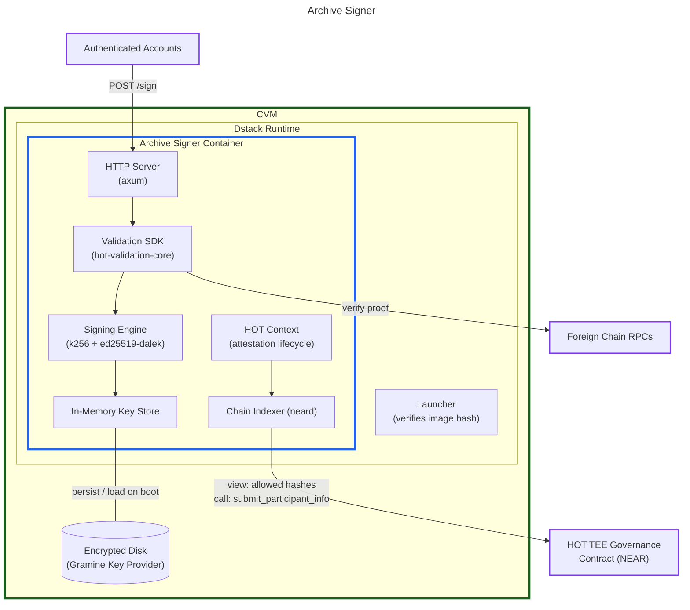
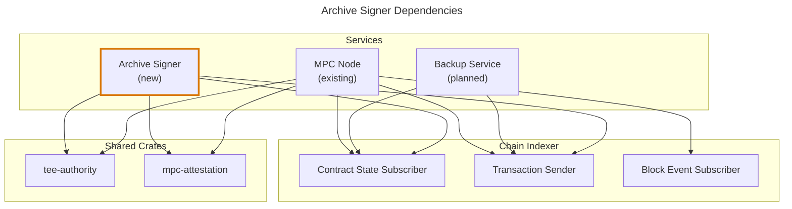
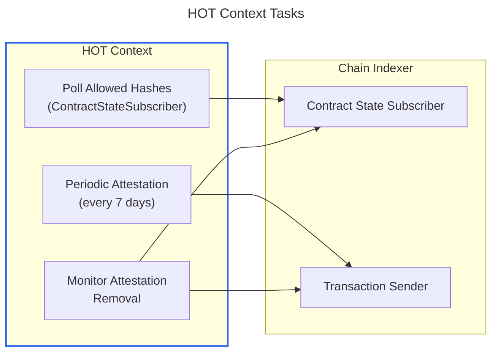
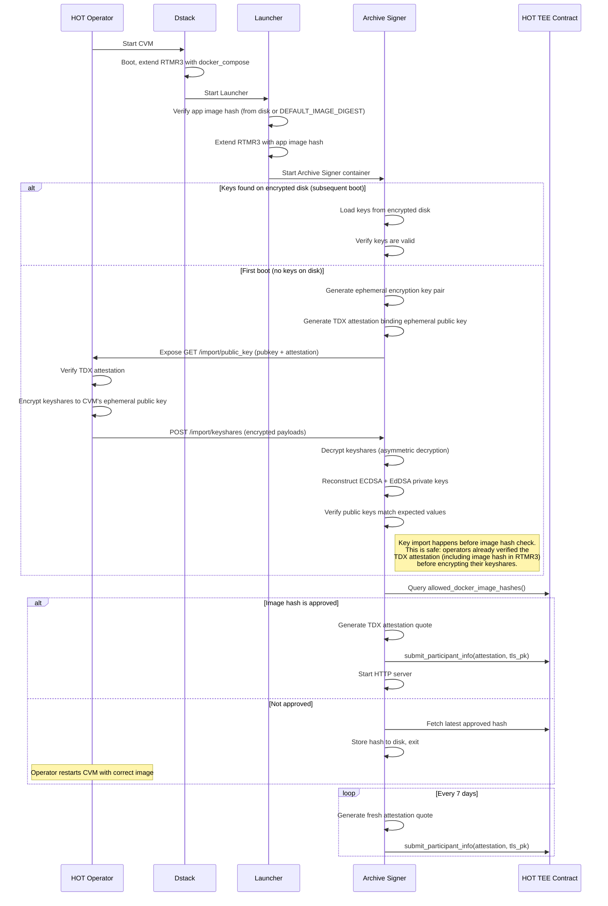

# Archive Signer

This document outlines the design of the Archive Signer — a TEE application for long-term support of legacy HOT Wallet keys.

## Background

### Problem

HOT Labs operates a threshold MPC network for ECDSA (secp256k1) and EdDSA (ed25519) signing on behalf of HOT Wallet users. HOT Labs wants to retire this network.

To support this, we'll provide a standalone application running inside a Trusted Execution Environment (TEE) that holds the reconstructed full private keys and handles signing requests. HOT will then be able to operate an instance of this application for their keyshares.

c.f. [#2062](https://github.com/near/mpc/issues/2062), [#2018](https://github.com/near/mpc/issues/2018), [#2021](https://github.com/near/mpc/pull/2021)

### Scope

The Archive Signer is a custom lightweight binary that replaces HOT's MPC network ([`near/hot-mpc`][hot-mpc]). It must:

- **Sign ECDSA (secp256k1) and EdDSA (ed25519)** using the [reconstructed](#key-import-process) full private keys directly with `k256` and `ed25519-dalek` (_not_ threshold signatures).
- **Receive signature requests via an off-chain HTTP API** compatible with [`hot_protocol::MpcClient`][mpc-client]. HOT's existing backend already sends sign requests via HTTP. Current volume is \~25k requests/day (bearish market baseline) with spikes to 25+ TPS during campaigns (airdrops, mints, claims). On-chain requests would add per-request gas costs (\~$0.001/tx → \~$750/month at current low volume, scaling with activity), latency, and require the [_Block Event Subscriber_][block-event-subscriber].
- **Authorize requests** using HOT's existing [`Validation::verify()`][validation-verify] with [`ProofModel`][proof-model] — looks up wallet contract via user's [`Uid`][uid], may delegate to cross-chain auth calls.
- **Submit TEE attestation** on-chain to a dedicated HOT governance contract.
- **Monitor the HOT governance contract** for allowed Docker image hashes and launcher compose hashes.

[block-event-subscriber]: indexer-design.md#block-event-subscriber
[hot-mpc]: https://github.com/near/hot-mpc
[mpc-client]: https://github.com/near/hot-mpc/blob/bd19508821ceb974e107e701cc106866b1442d6f/node/src/hot_protocol/mpc_client.rs
[validation-verify]: https://github.com/hot-dao/hot-validation-sdk/blob/2c669f97d547d2fc9cfb011ff207282590aa8bc5/core/src/lib.rs#L143
[proof-model]: https://github.com/hot-dao/hot-validation-sdk/blob/2c669f97d547d2fc9cfb011ff207282590aa8bc5/primitives/src/validation.rs#L7-L12
[uid]: https://github.com/hot-dao/hot-validation-sdk/blob/2c669f97d547d2fc9cfb011ff207282590aa8bc5/primitives/src/uid.rs#L11

The HOT MPC network characteristics the Archive Signer replaces:

| Aspect | HOT MPC |
|---|---|
| **Crypto library** | `cait-sith` fork (ECDSA, Beaver triple-based) + FROST (EdDSA) |
| **Signature schemes** | ECDSA (secp256k1) — [`k256`][k256], [`DomainId(0)`][domain-0]; EdDSA (ed25519) — [`ed25519-dalek`][ed25519-dalek], [`DomainId(1)`][domain-1] |
| **Sign request source** | Off-chain only (HTTP API via [`hot_protocol::MpcClient`][mpc-client]) |
| **Sign authorization** | [`Validation::verify()`][validation-verify] with [`ProofModel`][proof-model] via user's [`Uid`][uid] |
| **Keygen / resharing** | CLI-driven ([`HotProtocolKeygen`][hot-keygen], [`HotProtocolReshare`][hot-reshare] commands) |
| **TEE support** | None |
| **Contract** | Basic code hash voting only, no attestation infrastructure |

[hot-keygen]: https://github.com/near/hot-mpc/blob/bd19508821ceb974e107e701cc106866b1442d6f/node/src/hot_protocol/keygen_cli.rs
[hot-reshare]: https://github.com/near/hot-mpc/blob/bd19508821ceb974e107e701cc106866b1442d6f/node/src/hot_protocol/resharing_cli.rs
[k256]: https://crates.io/crates/k256
[ed25519-dalek]: https://crates.io/crates/ed25519-dalek
[domain-0]: https://github.com/near/hot-mpc/blob/kuksag/hot-protocol/libs/chain-signatures/contract/src/primitives/domain.rs#L21-L24
[domain-1]: https://github.com/near/hot-mpc/blob/kuksag/hot-protocol/node/src/tests/multidomain.rs#L36-L37

### Why a Custom Binary

Other approaches were considered and rejected:
- **Running the existing MPC stack with a single node** — [`threshold-signatures`][threshold-sigs] does not support fewer than 2 shares, and carries unnecessary complexity (P2P networking, resharing, triple/presignature generation, block event indexing).
- **Running two MPC nodes inside one CVM** — higher maintenance burden and susceptible to the same bugs seen in mainnet/testnet deployments.

[threshold-sigs]: https://github.com/near/threshold-signatures

A custom binary was chosen because it is light-weight and easy to reason about, reuses modular TEE attestation and chain indexer components already being developed ([indexer design](indexer-design.md)), is future-proof (can be reused as a "graveyard" for NEAR's own deprecated domains), and aligns with other ongoing priorities (backup service, [#1891](https://github.com/near/mpc/issues/1891)).

See also: [#2062](https://github.com/near/mpc/issues/2062), [#2018](https://github.com/near/mpc/issues/2018), [#2021](https://github.com/near/mpc/pull/2021).

## Architecture Overview

### Component Diagram



### Relationship to MPC Network Architecture

The Archive Signer reuses the chain indexer ([Contract State Subscriber, Transaction Sender][indexer-design] — proposed but not yet extracted as standalone crates), TEE attestation crates ([`tee-authority`][tee-authority], [`mpc-attestation`][mpc-attestation]), and the Context pattern (adapted as HOT Context for attestation lifecycle only). Everything else from the MPC node is omitted: P2P networking, threshold signing protocols, triple/presignature generation, key generation/resharing, block event indexing, and RocksDB storage. Signing is done directly with `k256`/`ed25519-dalek` using the reconstructed full private keys.

[indexer-design]: indexer-design.md
[tee-authority]: https://github.com/near/mpc/tree/main/crates/tee-authority
[mpc-attestation]: https://github.com/near/mpc/blob/main/crates/mpc-attestation/src/attestation.rs

### Crate Dependencies



### Embedded Indexer Node

The Archive Signer embeds a full `near-indexer` (which includes a `neard` node), the same as the MPC node, rather than using a lightweight RPC client. The embedded neard is used exclusively for **TEE governance operations**: monitoring the HOT governance contract for allowed Docker image hashes and launcher compose hashes, and submitting TEE attestation transactions. Running `neard` inside the CVM eliminates external RPC trust assumptions — the app verifies chain state directly, with no external trust assumptions beyond the NEAR network itself.

The signing flow itself is entirely off-chain — HTTP requests in, signatures out. Request authorization uses `hot-validation-core`'s own RPC clients (not the embedded neard) to query wallet contracts on NEAR and other chains.

The Chain Indexer's `ContractStateSubscriber` and `TransactionSender` traits (proposed in the [indexer design][indexer-design], not yet extracted) provide the interface. The HOT Context sits on top of the chain indexer, the same way the MPC Context does in the MPC node.

## Key Import Process

### Overview

Key import is a one-time operation performed at initial deployment. HOT MPC network operators export their threshold keyshares via the [`ExportKeyshare`](https://github.com/near/hot-mpc/blob/bd19508821ceb974e107e701cc106866b1442d6f/node/src/cli.rs#L411-L459) CLI command, which are then encrypted to the CVM's ephemeral public key and delivered via an HTTP endpoint (see [Phase 2](#phase-2-encryption-and-delivery)). The application decrypts the keyshares, reconstructs the full private keys, and verifies them against the expected public keys.

### Phase 1: Export (HOT Operators)

Each HOT MPC node operator runs the `ExportKeyshareCmd` CLI command (from [`hot-mpc/node/src/cli.rs`](https://github.com/near/hot-mpc/blob/bd19508821ceb974e107e701cc106866b1442d6f/node/src/cli.rs#L411-L459)):

```rust
#[derive(Parser, Debug)]
pub struct ExportKeyshareCmd {
    /// Path to home directory
    #[arg(long, env("MPC_HOME_DIR"))]
    pub home_dir: String,

    /// Hex-encoded 16 byte AES key for local storage encryption
    #[arg(help = "Hex-encoded 16 byte AES key for local storage encryption")]
    pub local_encryption_key_hex: String,
}
```

This currently **only exports ECDSA keyshares** — it calls `legacy_ecdsa_key_from_keyshares()` (see [`keyshare/compat.rs`](https://github.com/near/hot-mpc/blob/bd19508821ceb974e107e701cc106866b1442d6f/node/src/keyshare/compat.rs)) which only handles `KeyshareData::Secp256k1`. It must be extended to also export EdDSA keyshares (this work is on the HOT codebase side).

### Phase 2: Encryption and Delivery

Keyshares are encrypted **to the CVM's public key** so that only the TEE can decrypt them. This follows the same principle as [#2094](https://github.com/near/mpc/issues/2094) (secure provisioning of AES migration key for MPC nodes): the decryption key never exists outside the TEE, protecting against a compromised host intercepting keyshare material.

The key import is a two-phase process:

#### Phase 2a: CVM Boot and Encryption Key Publication

1. The CVM boots and the Archive Signer starts.
2. On first boot (no keys on encrypted disk), the app generates an **ephemeral encryption key pair** inside the TEE.
3. The app exposes the ephemeral public key via a local HTTP endpoint (`GET /import/public_key`). This endpoint is only available during the initial import phase and is disabled after key reconstruction succeeds.
4. The app generates a TDX attestation quote binding the ephemeral public key in `report_data`, so operators can verify the public key belongs to a genuine TEE running the approved image.

#### Phase 2b: Operator Encrypts and Delivers Keyshares

1. Each operator fetches the CVM's ephemeral public key from `GET /import/public_key` and verifies the accompanying TDX attestation to confirm it originates from a genuine TEE.
2. Each operator encrypts their exported keyshare to the CVM's ephemeral public key.
3. The encrypted keyshares are delivered to the app via `POST /import/keyshares`.

An attacker who controls the host could substitute a fake CVM with their own encryption key. The TDX attestation quote binding the ephemeral public key defends against this — operators must verify the attestation before encrypting. An attacker would need to compromise **both** the host and forge a valid TDX attestation.

### Phase 3: Reconstruction (Inside TEE)

The TEE application decrypts the keyshares using its ephemeral private key and reconstructs the full private keys (TODO: how? apparently via Lagrange interpolation).

### Phase 4: Verification

After reconstruction, the application derives the ECDSA public key from the reconstructed ECDSA private key and the EdDSA public key from the reconstructed EdDSA private key, then compares each against the known HOT wallet root public key for that domain. This detects corrupted keyshares, tampered ciphertext, or shares from different key generation epochs (TODO: Not sure if this makes sense from a cryptography perspective — perhaps this check is redundant?)

If verification succeeds, the keys are written to the CVM's encrypted disk for subsequent boots (see [Redundancy & Recovery](#redundancy-and-recovery)).

If verification fails, the application logs the error and exits without starting the HTTP server.

## HOT Context

The HOT Context is a lightweight analogue of the MPC Context. Where the MPC Context manages keygen, resharing, signing jobs, and network state, the HOT Context manages only the TEE attestation lifecycle.

### Responsibilities

The HOT Context runs a small set of long-lived async tasks:



1. **Poll allowed hashes** — Periodically queries the HOT governance contract for `allowed_docker_image_hashes()` and `allowed_launcher_compose_hashes()` via the Contract State Subscriber.

2. **Periodic attestation** — Every 7 days, generates a fresh TDX attestation quote and submits it to the HOT governance contract via `submit_participant_info()`. Follows the same pattern as [`periodic_attestation_submission`][remote-attestation], including exponential backoff retries.

3. **Monitor attestation removal** — Watches the contract for changes to the attested nodes list. If this node's attestation is removed (e.g., due to image hash rotation), resubmits immediately. Follows the pattern from [`monitor_attestation_removal`][remote-attestation].

[remote-attestation]: https://github.com/near/mpc/blob/main/crates/node/src/tee/remote_attestation.rs

## HTTP Signing API

The HTTP API is designed to be compatible with HOT's existing interface so their backend can switch to the TEE app without client-side changes.

### Request and Response Types

```rust
/// Signature request — compatible with HOT's OffchainSignatureRequest.
///
/// The `uid` field is a HOT-specific user identifier from the
/// `hot-validation-primitives` crate. The tweak is derived from it
/// via `uid.to_tweak()`, which produces a 32-byte value used for
/// child key derivation.
#[derive(Debug, Clone, Deserialize)]
pub struct SignRequest {
    /// HOT user identifier — tweak is derived from this.
    pub uid: Uid,
    /// The message to sign.
    /// ECDSA: exactly 32 bytes (pre-hashed).
    /// EdDSA: 1-1232 bytes (raw message).
    pub message: Vec<u8>,
    /// Which signature scheme to use.
    pub key_type: KeyType,
    /// HOT validation proof (authentication).
    pub proof: ProofModel,
}

/// Signature response — compatible with HOT's OffchainSignatureResponse
/// (see hot-mpc/node/src/hot_protocol/types.rs:121-133).
///
/// ECDSA: uses identical k256 types — serialization is compatible.
/// EdDSA: uses ed25519-dalek instead of cait_sith's frost_ed25519 — must validate compatibility.
#[derive(Debug, Clone, Serialize)]
pub enum SignResponse {
    Ecdsa {
        big_r: k256::AffinePoint,
        signature: k256::Scalar,
        public_key: k256::AffinePoint,
    },
    Eddsa {
        signature: ed25519_dalek::Signature,
        public_key: ed25519_dalek::VerifyingKey,
    },
}
```

**Note on response format compatibility:** The current HOT MPC network returns `OffchainSignatureResponse` (defined in [`hot-mpc/node/src/hot_protocol/types.rs:121-133`](https://github.com/near/hot-mpc/blob/kuksag/hot-protocol/node/src/hot_protocol/types.rs)). For **ECDSA**, HOT already uses `k256` types (`k256::AffinePoint`, `k256::Scalar`) — identical to our `SignResponse`, so JSON serialization is compatible out of the box. For **EdDSA**, HOT uses cait_sith's `frost_ed25519::Signature` and `frost_ed25519::VerifyingKey`, while the TEE app uses `ed25519_dalek::Signature` and `ed25519_dalek::VerifyingKey`. These must serialize identically in JSON. If they do not, we may need to use cait_sith's types in the EdDSA response or write custom serialization. This must be validated during implementation.

### Endpoints

| Method | Path | Description |
|--------|------|-------------|
| `POST` | `/sign` | Sign a message |
| `GET` | `/import/public_key` | Get CVM's ephemeral public key + TDX attestation (first boot only) |
| `POST` | `/import/keyshares` | Deliver encrypted keyshares (first boot only) |

### Request Authorization

The TEE app reuses HOT's existing authorization model via [`hot-validation-sdk`](https://github.com/hot-dao/hot-validation-sdk) (`hot-validation-core` and `hot-validation-primitives` crates). Every sign request includes a caller-constructed `ProofModel`, and the TEE app verifies it before signing. The entire signing flow (request → validation → signature → response) is **off-chain** — no on-chain transactions are involved.

1. **Caller** (HOT's backend) sends a `SignRequest` containing `uid`, `message`, `key_type`, and `proof: ProofModel`.
2. **TEE app** derives `wallet_id = SHA256(uid)` and calls [`Validation::verify(wallet_id, message, proof)`](https://github.com/hot-dao/hot-validation-sdk/blob/2c669f97d547d2fc9cfb011ff207282590aa8bc5/core/src/lib.rs#L143).
3. **Validation SDK** makes RPC calls to look up the user's wallet contract on NEAR (`mpc.hot.tg`) and calls `hot_verify()` on it, passing the proof.
4. The wallet contract either returns a **bool** directly, or returns a `HotVerifyAuthCall` — parameters for a **cross-chain auth call** (target chain, contract address, method, input data).
5. If a cross-chain auth call is needed, the SDK makes an RPC call to the target chain (EVM, Cosmos, Stellar, TON, Solana) using chain-specific verifiers with threshold voting (multiple RPCs must agree). All cross-chain orchestration is internal to `hot-validation-core`.
6. If verification passes, the TEE app proceeds to sign. If not, it returns `401 UNAUTHORIZED`.

This is the same authorization flow the HOT MPC network uses today. The key difference: in the MPC network, **every node** independently validates each request. In the TEE app, there is only one node, so validation happens once.

`ProofModel` is constructed off-chain by the caller:

```rust
pub struct ProofModel {
    pub message_body: String,
    pub user_payloads: Vec<String>,
}
```

**Cross-chain RPC configuration:** The `Validation` struct requires RPC endpoints for every chain HOT wallets may reference in auth calls — NEAR included. Each chain is configured with a `ChainValidationConfig { threshold, servers }` (multiple RPC providers with threshold consensus). The validation SDK uses its own HTTP RPC clients for all chain calls (NEAR and foreign chains alike); the embedded neard is **not** used for validation — it is strictly for TEE governance. For improved security, NEAR smart contract verification can be routed through a [`chain-gateway`][chain-gateway] that runs its own neard node, avoiding reliance on external RPC providers for NEAR calls.

[chain-gateway]: indexer-design.md#design-proposal

**Note:** This authorization flow is unrelated to NEAR MPC's [foreign transaction verification](foreign_chain_transactions.md) feature. Foreign TX verification is an on-chain feature for verifying events on other chains (bridges/intents). HOT's `hot_verify()` is an off-chain authorization mechanism for wallet signing.

### Signing Endpoint

```rust
async fn handle_sign(
    State(state): State<Arc<AppState>>,
    Json(request): Json<SignRequest>,
) -> Result<Json<SignResponse>, StatusCode> {
    // 1. Validate the request using HOT's validation SDK
    state.validation.verify(
        request.uid.to_wallet_id(),
        request.message.clone(),
        request.proof.clone(),
    ).await.map_err(|_| StatusCode::UNAUTHORIZED)?;

    // 2. Derive tweak from uid
    let tweak_bytes: [u8; 32] = request.uid.to_tweak();

    // 3. Sign based on key type
    match request.key_type {
        KeyType::Ecdsa => sign_ecdsa(state, tweak_bytes, &request.message),
        KeyType::Eddsa => sign_eddsa(state, tweak_bytes, &request.message),
    }
    .map(Json)
    .map_err(|e| {
        tracing::error!("Signing failed: {e:?}");
        StatusCode::INTERNAL_SERVER_ERROR
    })
}
```

## On-Chain Contract (HOT TEE Governance)

### Overview

A dedicated NEAR smart contract manages TEE governance for the HOT signing application. This is **separate** from the MPC signer contract (`v1.signer`). The contract is structurally similar to the TEE-related subset of the MPC contract (see [`crates/contract/src/tee/`][tee-dir]).

[tee-dir]: https://github.com/near/mpc/tree/main/crates/contract/src/tee

### State

```rust
pub struct HotTeeContract {
    /// Set of accounts that can vote on image hashes.
    /// Multiple entities.
    governors: BTreeSet<AccountId>,
    /// Number of governor votes required to approve an action.
    vote_threshold: u32,
    /// TEE state: allowed image hashes, attestations.
    /// Reuses the existing TeeState structure from mpc-contract.
    tee_state: TeeState,
}
```

The [`TeeState`][tee-state] struct is reused from the MPC contract:

[tee-state]: https://github.com/near/mpc/blob/main/crates/contract/src/tee/tee_state.rs

```rust
pub struct TeeState {
    pub(crate) allowed_docker_image_hashes: AllowedDockerImageHashes,
    pub(crate) allowed_launcher_compose_hashes: Vec<LauncherDockerComposeHash>,
    pub(crate) votes: CodeHashesVotes,
    pub(crate) stored_attestations: BTreeMap<near_sdk::PublicKey, NodeAttestation>,
}
```

### Governance

Although the Archive Signer is a single node (not a multi-node network), the voting mechanism is still relevant because it governs **which code is allowed to touch the private keys**, not node coordination. The governance body consists of multiple actors with equal voting weight, ensuring no single party can unilaterally push a new image that handles the reconstructed keys. This follows the same multi-entity voting pattern as the MPC contract.

Note: the MPC contract's [`vote_new_parameters`][vote-new-params] method does not have a direct equivalent here. In the MPC contract, `vote_new_parameters` changes the **participant set and threshold for the threshold signing protocol** (via [`ThresholdParameters`][threshold-params]), triggering a resharing. The Archive Signer is a single node doing direct signing — there is no threshold protocol, no resharing, and no signing participant set to manage. Instead, the HOT governance contract needs methods for managing its own **governor set** (see below).

[vote-new-params]: https://github.com/near/mpc/blob/main/crates/contract/src/lib.rs#L921
[threshold-params]: https://github.com/near/mpc/blob/main/crates/contract/src/primitives/thresholds.rs#L33

### Governor Management

The initial governor set and vote threshold are configured at contract deployment. After deployment, governors can vote to change the governor set and/or threshold via `vote_update_governors`. This requires `vote_threshold` votes on the same proposal to take effect — ensuring that governor changes go through the same multi-stakeholder approval as code hash changes.

### Contract Methods

| Method | Type | Caller | Description |
|--------|------|--------|-------------|
| `vote_code_hash(code_hash)` | Call | Governor | Vote for a new Docker image hash |
| `vote_remove_code_hash(code_hash)` | Call | Governor | Vote to remove a Docker image hash before natural expiry |
| `vote_update_governors(governors, threshold)` | Call | Governor | Vote to change the governor set and/or vote threshold |
| `submit_participant_info(attestation, tls_public_key)` | Call | Archive Signer | Submit TEE attestation |
| `verify_tee()` | Call | Anyone | Re-validate all stored attestations |
| `allowed_docker_image_hashes()` | View | Archive Signer | Query approved image hashes |
| `allowed_launcher_compose_hashes()` | View | Archive Signer | Query approved launcher hashes |
| `get_tee_accounts()` | View | Anyone | Query nodes with valid attestations |

### Launcher Compose Hash Derivation

When a Docker image hash is voted in and reaches the threshold, the contract automatically derives the corresponding **launcher compose hash**. This follows the same mechanism as the MPC signer contract (see [`proposal.rs`][tee-proposal]):

[tee-proposal]: https://github.com/near/mpc/blob/main/crates/contract/src/tee/proposal.rs
[launcher-template]: https://github.com/near/mpc/blob/main/crates/contract/assets/launcher_docker_compose.yaml.template

1. A YAML template ([`launcher_docker_compose.yaml.template`][launcher-template]) contains a `{{DEFAULT_IMAGE_DIGEST_HASH}}` placeholder.
2. The placeholder is replaced with the approved Docker image hash.
3. The filled YAML is SHA256-hashed to produce the `LauncherDockerComposeHash`.

During attestation verification, the contract replays the TDX event log to reconstruct RTMR3 and checks that both the Docker image hash and launcher compose hash match the allowed lists. This ensures the attesting CVM is running an approved image via an approved launcher configuration.

The HOT TEE governance contract will need its own launcher compose template, since the Archive Signer has a different Docker Compose configuration than the MPC node.

## Attestation Flow

### Boot Flow



### Attestation Generation

The Archive Signer uses `TeeAuthority` from [`crates/tee-authority`][tee-authority] to generate attestation quotes. The flow is identical to the MPC node:

1. Contact Dstack via Unix socket (`/var/run/dstack.sock`) to get `TcbInfo`.
2. Request TDX quote with `report_data = Version || SHA384(tls_public_key)`.
3. Upload quote to Phala's collateral endpoint for verification collateral.
4. Package into `Attestation::Dstack(DstackAttestation { quote, collateral, tcb_info })`.

### On-Chain Verification

The HOT governance contract verifies attestations using the same DCAP verification logic from the `mpc-attestation` crate:

1. Verify TDX quote cryptographic integrity.
2. Verify `report_data` matches `Version || SHA384(tls_public_key)`.
3. Replay RTMR3 from event log and verify it matches the quote.
4. Check Docker image hash against allowed list.
5. Check launcher compose hash against allowed list.

## Upgrade Path

### Application Upgrade

Application upgrades follow the same Launcher pattern used by the MPC network (see [TEE design doc](securing_mpc_with_tee_design_doc.md)):

1. Governors vote for a new Archive Signer Docker image hash on-chain via `vote_code_hash()`.
2. When `vote_threshold` is reached, the new hash is added to the allowed list.
3. The running app's Contract State Subscriber detects the new allowed hash.
4. The app stores the new hash to an encrypted file on disk.
5. The HOT operator restarts the CVM.
6. On restart, the Launcher pulls the new image, verifies the hash, extends RTMR3, starts the container.
7. The new app submits a fresh attestation.
8. After the upgrade deadline (configurable, default 7 days), old image hashes expire.

## Redundancy and Recovery

Since the Archive Signer is a single node holding the full private key, redundancy is critical. A hardware failure or misconfiguration must not result in permanent loss of user funds.

### Primary: Encrypted Disk Persistence

Keys are held in memory for signing and persisted on the CVM's encrypted disk for restart resilience. The CVM's encrypted disk (key derived from RTMR measurements) provides safe at-rest storage.

After successful key reconstruction and verification on first boot, the private keys are stored on the CVM's encrypted filesystem. Dstack's Gramine Key Provider derives the encryption key from TDX measurements, so only the same TEE image can decrypt this data.

On subsequent boots, the app first attempts to load keys from the encrypted disk. If found and valid, it skips the import flow entirely (the `/import/*` endpoints are never exposed).

### Recovery via Confidential Key Derivation (CKD)

Encrypted disk persistence protects against restarts, but not against total loss of the CVM instance — for example, if the TEE image is updated (changing RTMR measurements and invalidating the disk encryption key) or all CVM instances are destroyed. Without an additional recovery mechanism, this would be unrecoverable after the HOT MPC network is retired, since keyshares can no longer be re-imported.

To address this, we use [Confidential Key Derivation][ckd] (CKD) via the NEAR MPC network to create a hardware-independent encrypted backup:

1. **Derive a wrapping key.** After key reconstruction, the Archive Signer calls the NEAR MPC network's CKD endpoint with its `app_id`. CKD returns a deterministic, confidential key that only this application can obtain.
2. **Encrypt and store a backup.** The reconstructed HOT private keys are encrypted with the CKD-derived wrapping key. The resulting ciphertext is stored in external storage.
3. **Recover from any new instance.** A new instance re-derives the same CKD key — since CKD is deterministic on `app_id`, not on hardware measurements — and decrypts the backup.

This decouples recovery from any specific CVM instance or disk encryption key, requiring only that the NEAR MPC network remains operational.

For additional high availability, a hot standby instance (a second CVM holding the same keys) can be added in the future if needed.

[ckd]: ../crates/threshold-signatures/docs/confidential_key_derivation/confidential-key-derivation.md

## Open Questions

1. **EdDSA keyshare export:** The HOT `ExportKeyshareCmd` currently only exports ECDSA shares. It must be extended to also export EdDSA shares. This work is on the HOT codebase side.

2. **Response format byte-level compatibility:** Do `k256::AffinePoint` and `k256::Scalar` serialize to the same JSON as `cait_sith::frost_secp256k1::VerifyingKey` and `cait_sith::ecdsa::sign::FullSignature`? This must be validated. If not, we may need to depend on `cait_sith` types in the response or write adapter serialization.

## Related Issues

- [#2062](https://github.com/near/mpc/issues/2062) -- TEE application for long-term support of legacy keys
- [#2018](https://github.com/near/mpc/issues/2018) -- HOT keyshare import (original)
- [#2021](https://github.com/near/mpc/pull/2021) -- Design: HOT migration (closed)
- [#1891](https://github.com/near/mpc/issues/1891) -- TEE backup service
- [#2103](https://github.com/near/mpc/pull/2103) -- Indexer design proposal
