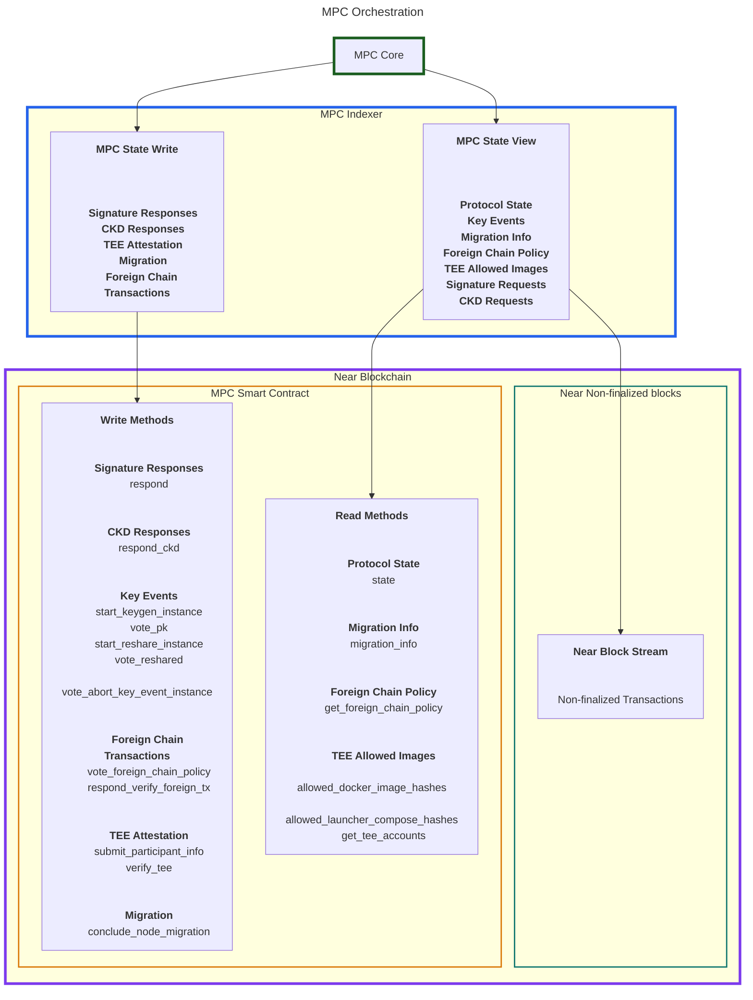
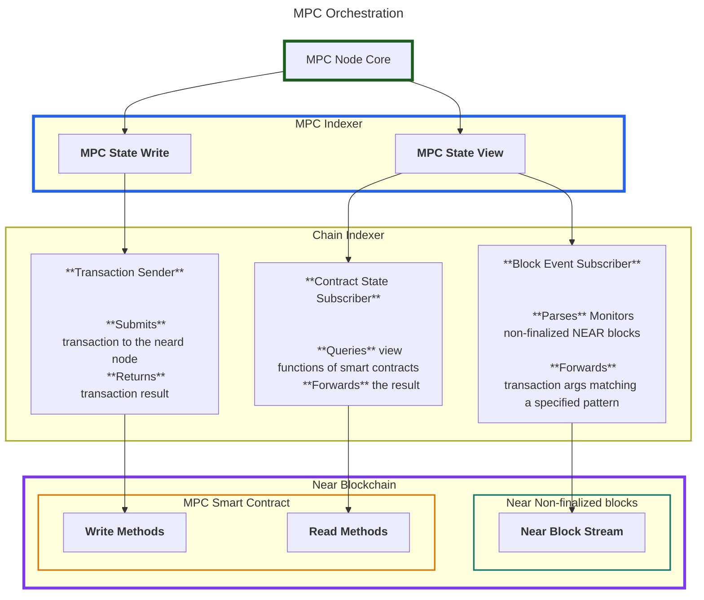

# MPC Indexer Breakout

This documents outlines the design and efforts for breaking out the indexer into its own crate and potentially binary.

## Background

### Current State

The MPC node relies heavily on the Near blockchain for coordination. It fetches the following information from chain:
- pending signature and CKD requests (read from non-finalized block state)
- MPC protocol state (read from contract-state)
- Node migration instructions and data
- Foreign Chain Transaction Data
- TEE related information, such as the current docker image hashes of launcher and node

Additionally, an MPC node writes data to chain, such as:
- responses to signature and CKD requests
- confirmations during critical operations such as key generation and resharing (key events)
- its own TEE attestation
- migration confirmation

The nodes monitor and intract with the NEAR blockchain by spawning a neard node in the same process, but in a different thread, with its own tokio runtime (c.f. [`spawn_real_indeer`](https://github.com/near/mpc/blob/dacc610b92b8ef4d80b389d86e450a3488ae72ed/crates/node/src/indexer/real.rs#L49). 

We have an MPC indexer that interacts with the neard node (which, in turn, has an indexer interface)

Conceptually, the following graph depicts information flow:




The communication between the MPC Indexer currently offers the following API:

```rust
pub struct IndexerAPI<TransactionSender, ForeignChainPolicyReader> {
        /// Provides the current contract state as well as updates to it.
    pub contract_state_receiver: watch::Receiver<ContractState>,
        /// Provides block updates (signature requests and other relevant receipts).
    /// It is in a mutex, because the logical "owner" of this receiver can
    /// change over time (specifically, when we transition from the Running
    /// state to a Resharing state to the Running state again, two different
    /// tasks would successively "own" the receiver).
    /// We do not want to re-create the channel, because while resharing is
    /// happening we want to buffer the signature requests.
    pub block_update_receiver: Arc<tokio::sync::Mutex<mpsc::UnboundedReceiver<ChainBlockUpdate>>>,
        /// Handle to transaction processor.
    pub txn_sender: TransactionSender,
        /// Watcher that keeps track of allowed [`DockerImageHash`]es on the contract.
    pub allowed_docker_images_receiver: watch::Receiver<Vec<MpcDockerImageHash>>,
        /// Watcher that keeps track of allowed [`LauncherDockerComposeHash`]es on the contract.
    pub allowed_launcher_compose_receiver: watch::Receiver<Vec<LauncherDockerComposeHash>>,
        /// Watcher that tracks node IDs that have TEE attestations in the contract.
    pub attested_nodes_receiver: watch::Receiver<Vec<NodeId>>,
    pub my_migration_info_receiver: watch::Receiver<MigrationInfo>,
    pub foreign_chain_policy_reader: ForeignChainPolicyReader,
}

```

### Design Goals

An improved indexer design should achieve the following goals:

1. Re-usability of components:
    - We have planned works for other applications that would greatly profit from one or multiple functionalities:
        - The TEE backup service will need to monitor the same MPC smart contract, requiring viewing state and submitting transactions (c.f.[#1891](https://github.com/near/mpc/issues/1891);
        - The HOT wallet TEE application will want to monitor a different smart contract, but require similar methods (viewing Attestations and docker image hashes, c.f. [#2062](https://github.com/near/mpc/issues/2062));
        - We could leverage parts of the MPC indexer to monitor our production deployments;
2. Improved testing:
    - we currently have a `FakeIndexer` to isolate the core logic of our node. This mostly achieves its goal, but if we had a more mature interface, we could increase test coverage;
3. Isolation of nearcore internals:
    - This ties into point 1., but is worth mentioning as a stand-alone goal. The interface exposed by the neard node has experienced braking changes in the past and due to the usage of nearcore internals in our code, we have no guarantee that this won't happen again. Since we will require this functionality in other applications, it makes sense to have a stand-alone crate that has an isolated dependency on the nearcore inernals. This way, in case we do experience breaking changes, we only need to fix them once.

### Design Proposal

We propose to add an abstraction layer (we call it **Chain Indexer**) between MPC indexer and Nearcore Indexer (the interface exposed by the neard node). This will be a library, allowing us to:
- spin-up a neard node;
- abstract the neard indexer interface such that no nearcore internals are exposed. The interface should be able to:
    - call any view function on any contract and monitor for changes;
    - forward transactions to the NEAR blockchain;
    - monitor non-finalized blocks for transactions matching a user-specified pattern

This is the first step and primary goal. That abstraction is a huge enabler or migrating the backup service into a TEE [(#1891)](https://github.com/near/mpc/issues/1891) and for the our long-term support of legacy keys [(#2062)](https://github.com/near/mpc/issues/2062)

As secondary goals, we might want to:
- re-work the current indexer API between MPC node and MPC indexer
- have a dedicatd library for transactions relevant to the MPC systems




### API Proposal

#### Chain Indexer

##### Contract State Subscriber

The indexer should offer a convenient method for viewing and subscribing to contract state. We assume that contract state is seen through view methods in the contract implementation and propose the following interface:

```rust
/// one-time call to `view_method` on the contract at `contract_id`
trait ContractStateView {
    async fn get<T: DeserializeOwned>(
        &self,
        contract_id: AccountId,
        contract_method: String,
    ) -> anyhow::Result<(BlockHeight, T)>;
}

/// subscriber for state view - the receiver passed trough the Oneshot channel is used to pass the latest output of the view method.
/// Note that the receiver returns Result<(BlockHeight, T), Error>, meaning that errors encountered on the indexer side are passed to the receiver.
trait ContractStateSubscriber {
    async fn subscribe<T: DeserializeOwned + PartialEq + Send + 'static>(
        &self,
        contract_id: AccountId,
        contract_method: String,
        poll_strategy: PollStrategy,
    ) -> Result<Oneshot<watch::Receiver<anyhow::Result<(BlockHeight,T), Error>>>>;
}
```

The type `PollStategy` describes the desired interval to poll for new state, as well as behavior on error

```rust
pub struct PollStrategy {
    /// duration between two consecutive polls
    pub poll_interval: Duration,
    pub on_failure: FailurePolicy,
}

/// Defines the behavior on failure
pub enum FailurePolicy {
    /// Abort the stream immediately on error
    FailFast,
    /// Retry after applying a backoff strategy
    Retry {
        backoff: BackoffStrategy,
    },
}

/// Defines the timeout between consecutive attempts
pub enum BackoffStrategy {
    Fixed(Duration),
    Exponential {
        initial: Duration,
        max: Duration,
    },
}
```

Alternatively, if we are concerned about having `tokio::watch` and `oneshot` channels in our API, we could return rely on a `latest()` and `next()` subscription interface:

```rust
trait ContractStateView<T> {
    /// is synchronous, contains the last value
    fn latest(&self) -> Result<(BlockHeight, &T), Error>;
    /// must be cancellation safe
    /// returned BlockHeight is monotonically increasing
    async fn next(&mut self) -> Result<(BlockHeight, &T), Error>;
}

trait ContractStateSubscriber {
    async fn subscribe<T: DeserializeOwned + PartialEq + Send + 'static>(
        &self,
        contract: AccountId,
        view_method: str,
        subscriber_policy: SubscriberPolicy,
    ) -> Result<Box<dyn ContractStateView<T> + Send>>;
}
```


##### Block Event Subscriber

The purpose of this intreface is to enable easy subscription to block events. In the MPC node, we use this to monitor the mempool for requests to the MPC network and responses from the MPC network. We do so by filtering all receipts for:

1. signature and CKD requests, as well as foreign transaction verifications. We do so by:
    1. matching the `executor_id` of a receipt with the MPC contracts `AccountId`. This means that this receipt is executed by the MPC contract;
    2. matching the method called in the contract to one of the expected methods (in the case of the MPC network, we are looking for calls to `sign`, `request_app_private_key` and `verify_foreign_transaction`).
    3. if we have a match, we are interested in the following data:
        - receipt id
        - predecessor id
        - next receipt id
        - arguments for the function call (note: we currently deserialize the json and return a type).
        - block entropy
        - block timestamp
2. sigature responses, CKD response and foreign transaction verification responses. We do so by:
    1. matching on the `receiver_id` of the receipt (must match the contract);
    2. matching the method called in the contract to one of the expected values (`return_signature_and_clean_state_on_success`, `return_ck_and_clean_state_on_success` or `return_verify_foreign_tx_and_clean_state_on_success`, for the MPC contract).
    3. In case we match, we track the following data:
        - receipt id (this will match the _next receipt id_ of the corresponding request from point 3 above)

_Open Question: we should figure out if `receipt_id` and `executor_id` can be different from one another. If not, then we could simply our design slightly_

For each block, the indexer composes a `BlockUpdate` for all of the above and sends that to the MPC node, together with some information about the block, such as:
- block height
- block hash
- previous block hash

```rust
/// This is a block update - containing all matched events for the latest block
pub struct ChainBlockUpdate {
    pub block: BlockViewLite,
    pub signature_requests: Vec<SignatureRequestFromChain>,
    pub completed_signatures: Vec<SignatureId>,
    pub ckd_requests: Vec<CKDRequestFromChain>,
    pub completed_ckds: Vec<CKDId>,
    #[allow(dead_code)] // TODO(#1960): remove when integrating with node
    pub verify_foreign_tx_requests: Vec<VerifyForeignTxRequestFromChain>,
    #[allow(dead_code)] // TODO(#1960): remove when integrating with node
    pub completed_verify_foreign_txs: Vec<VerifyForeignTxId>,
}

pub struct BlockViewLite {
    pub hash: CryptoHash,
    pub height: u64,
    pub prev_hash: CryptoHash,
    pub last_final_block: CryptoHash,
}
```


There are a few questions for this API:
- instead of bundling everything into one `BlockUpdate`, we could have one stream for each event type;
- we could either provide a rather specific interface for the use-case at hand, or try to provide a more general interface

**Proposal A - specific API:**

Note: **this is heavy WIP!**

This is a simple proposal, trying to stay close to what we currently have, yet allowing somewhat more flexibility:

```rust
/// This event is associated to a transaction that matched a specific (transaction_outcome_executor_id: AccountId, method_name: String) pattern.
struct ExecutorFunctionCallEventDefinition {
    /// the executor of the transaction outcome
    transaction_outcome_executor: AccountId,
    /// the method called on `transaction_outocme_executor`
    method_name: String,
}

/// This event is associated to a transaction that matched a specific (transaction_outcome_executor_id: AccountId, method_name: String) pattern.
struct ExecutorFunctionCallEvent {
    /// the receipt_id of the recipt this event came from
    receipt_id: CryptoHash,
    // predecessor_id who signed the transaction
    predecessor_id : AcccountId,
    // the receipt that will hold the outcome of this receipt
    next_receipt_id: CryptoHash,
    /// block randomness
    pub block_entropy: [u8; 32],
    /// block timestamp
    pub block_timestamp_nanosec: u64,
    /// serialized function call args (verbatim from the blockchain)
    args: String,
}

/// defines an event to watch out for
struct ReceiverFunctionCallEventDefinition {
    // the receiver recepit id this transaction must match
    receipt_receiver_id: AccountId,
    /// the method name this transaction must match
    method_name: String,
}

/// This event is associated to a transaction that matched a specific ReeiverEventDefinition
struct ReceiverFunctionCallEvent {
    // the receipt id for the matched trasaction
    receipt_id: CrpytoHash,
}
```

If we want a per-event stream, we can have this:

```rust
trait BlockEventSubscriber {
    fn subscribe_executor(event_definiton: ExecutorFunctionCallEventDefinition) -> tokio::channel:receiver<(ExecutorFunctionCallEvent, BlockViewLite)>;
    fn subscribe_reciver(event_definition: ReceiverFunctionCallEventDefinition) -> tokio::channel::receiver<(ReceiverFunctionCallEvent, BlockViewLite)>;
}

pub struct BlockViewLite {
    pub hash: CryptoHash,
    pub height: u64,
    pub prev_hash: CryptoHash,
    pub last_final_block: CryptoHash,
}
```

or if we want to stick with the current `BlockUpdate` design, we can return:

```rust
pub struct BlockUpdate {
    block_view: BlockViewLite,
    executor_events: Vec<(ExecutorFunctionCallId, ExecutorFunctionCallEvent)>,
    receiver_events: Vec<(ReceiverFunctionCallId, ReceiverFunctionCallEvent)>,
}

trait BlockEventSubscriber<T> {
    /// returning the id for this event, used to match the events from `BlockUpdate`
    fn subscribe(executor_events: ExecutorFunctionCallEventDefinition) -> ExecutorFunctionCallId;
    /// returning the id for this event
    fn subscribe(receiver_events: ReceiverfunctionCallEventDefinitoin) -> ReceiverFunctionCallId;
}

```

*Remark: can we actually bundle for different types <T>? We don't have to. We could return the json function call args as a string, as opposed to the deserialized type. Then we would have the receiver handle it, which would also help in recognizing if the interface broke.*


Note: on the low-level, we want the indexer to parse efficently. if multiple ExecutorFunctionCallEvents have the same executor target, lets make sure we optimize internally.


**Proposal B - generic API**

*to follow, but the idea is to use some sort of builder pattern, where we specify what to match on. Ie. something like*

```rust
let block_event_id : BlockEventId = BlockEventSubscriber.new().match_on_receiver(contract_id).match_on_executor(contract_id).match_on_method(contract_method).build() -> EventId; // returning uid fort the event in case we want a BlockUpdate
// maybe we can have it return a channel, but we would need more generics, because the return types are different.
```


##### Transaction Sender

*this still needs to be written. We could probably just forward the RPC handle or expose a generic API for signing and submitting arbitrary payload*

#### MPC Indexer

*Remark: This needs to be reworked, as it is inconsistent right now.*


##### State View

To do 
The MPC indexer should offer a convenient method for viewing and subscribing to MPC contract state.


##### BlockStream

To do 

Q: do we really need this? This is more MPC Indexer API. We could just forward the handle:
```rust

    pub fn streamer(&self) -> mpsc::Receiver<StreamerMessage> {
```

For the next few months, the only expected user of block streams is the MPC node. This might change in the future if we use the indexer crate for monitoring and testing our MPC code, but for now, it seems safe to just port the existing design to the indexer until we have a better idea of what changes we would want from it.

```Rust
// c.f. https://github.com/near/mpc/issues/236 for start_block_height
trait MpcEventSubscriber {
    async fn subscribe(interval: Duration, channel_size: usize, start_block_height: BlockHeight) -> anyhow::Result<mpsc::Receiver<ChainBlockUpdate>>;
}

pub struct ChainBlockUpdate {
    pub block: BlockViewLite,
    pub signature_requests: Vec<SignatureRequestFromChain>,
    pub completed_signatures: Vec<SignatureId>,
    pub ckd_requests: Vec<CKDRequestFromChain>,
    pub completed_ckds: Vec<CKDId>,
}
```

##### Transaction Sender

To do 
It's probably fine for the first iteration to keep the existing `TransactionSender` trait and have the indexer return a Transaction Processor Handle that implements those traits:

```rust
impl TransactionProcessorHandle {
    pub(crate) fn start_transaction_processor(
        owner_account_id: AccountId,
        owner_secret_key: SigningKey,
        config: RespondConfig,
        indexer_state: Arc<IndexerState>,
    ) -> anyhow::Result<impl TransactionSender>;
}

pub trait TransactionSender: Clone + Send + Sync {
    fn send(
        &self,
        transaction: ChainSendTransactionRequest,
    ) -> impl Future<Output = Result<(), TransactionProcessorError>> + Send;

    fn send_and_wait(
        &self,
        transaction: ChainSendTransactionRequest,
    ) -> impl Future<Output = Result<TransactionStatus, TransactionProcessorError>> + Send;
}
```

```rust
pub enum ChainSendTransactionRequest {
        Respond(ChainSignatureRespondArgs),
        CKDRespond(ChainCKDRespondArgs),
        VotePk(ChainVotePkArgs),
        StartKeygen(ChainStartKeygenArgs),
        VoteReshared(ChainVoteResharedArgs),
        StartReshare(ChainStartReshareArgs),
        VoteAbortKeyEventInstance(ChainVoteAbortKeyEventInstanceArgs),
        VerifyTee(),
        // Boxed as this variant is big, 2168 bytes.
        // Big discrepancies in variant sizes will lead to memory fragmentation
        // due to rust's memory layout for enums.
        //
        // For more info see clippy lint:
        // https://rust-lang.github.io/rust-clippy/master/index.html#large_enum_variant
        SubmitParticipantInfo(Box<SubmitParticipantInfoArgs>),
        ConcludeNodeMigration(ConcludeNodeMigrationArgs),
        VerifyForeignTransactionRespond(ChainVerifyForeignTransactionRespondArgs),
}
```


## related issues

https://github.com/near/mpc/issues/1956
https://github.com/near/mpc/issues/592
https://github.com/near/mpc/issues/950
https://github.com/near/mpc/issues/913
https://github.com/near/mpc/issues/1187
https://github.com/near/mpc/issues/439
https://github.com/near/mpc/issues/1957
https://github.com/near/mpc/issues/155
https://github.com/near/mpc/issues/236

potentialy:
https://github.com/near/mpc/issues/1643

## Smart contract & Backup service changes

Note: WIP

