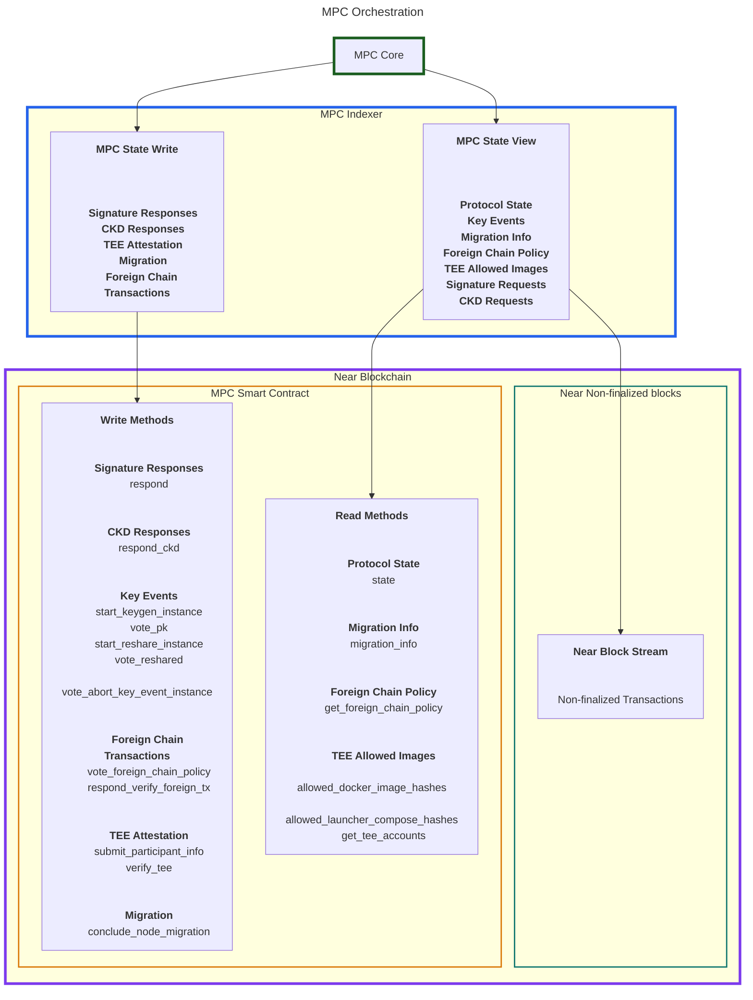
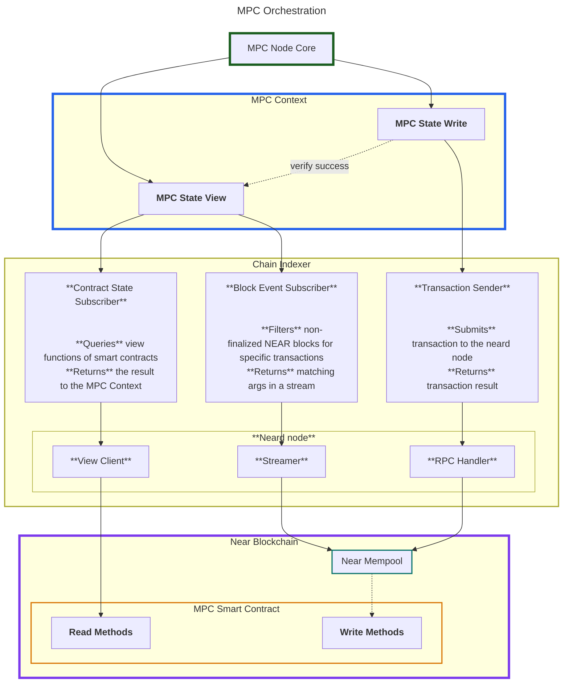
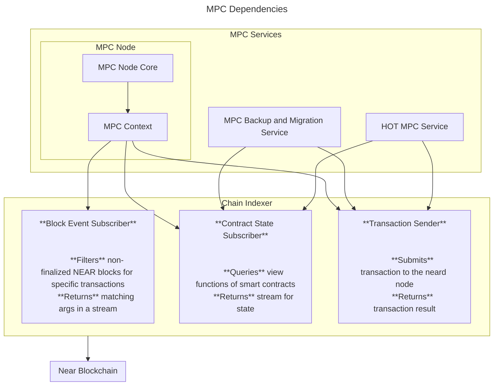

# MPC Indexer Breakout

This documents outlines the design and efforts for breaking out the indexer into its own crate.

## Background

### Current State

The MPC node relies heavily on the NEAR blockchain for coordination. It fetches the following information from chain:
- pending signature and CKD requests (read from non-finalized block state)
- MPC protocol state (read from contract-state)
- Node migration instructions and data
- Foreign Chain Transaction Data
- TEE related information, such as the current docker image hashes of launcher and node

Additionally, an MPC node writes data to chain, such as:
- responses to signature and CKD requests
- confirmations during critical operations such as key generation and resharing (key events)
- its own TEE attestation
- migration confirmation

The MPC nodes monitor and intract with the NEAR blockchain by spawning a neard node in the same process (but in a different thread, with its own tokio runtime, c.f. [`spawn_real_indexer`](https://github.com/near/mpc/blob/dacc610b92b8ef4d80b389d86e450a3488ae72ed/crates/node/src/indexer/real.rs#L49).

The part of the code that is responsible for spawning the neard node, fetching data from it and forwarding transactions to it, is what we currently refer to as _MPC Indexer_.

Conceptually, the following graph depicts information flow:



The communication between the MPC Indexer currently offers the following API:

```rust
pub struct IndexerAPI<TransactionSender, ForeignChainPolicyReader> {
        /// Provides the current contract state as well as updates to it.
    pub contract_state_receiver: watch::Receiver<ContractState>,
        /// Provides block updates (signature requests and other relevant receipts).
    /// It is in a mutex, because the logical "owner" of this receiver can
    /// change over time (specifically, when we transition from the Running
    /// state to a Resharing state to the Running state again, two different
    /// tasks would successively "own" the receiver).
    /// We do not want to re-create the channel, because while resharing is
    /// happening we want to buffer the signature requests.
    pub block_update_receiver: Arc<tokio::sync::Mutex<mpsc::UnboundedReceiver<ChainBlockUpdate>>>,
        /// Handle to transaction processor.
    pub txn_sender: TransactionSender,
        /// Watcher that keeps track of allowed [`DockerImageHash`]es on the contract.
    pub allowed_docker_images_receiver: watch::Receiver<Vec<MpcDockerImageHash>>,
        /// Watcher that keeps track of allowed [`LauncherDockerComposeHash`]es on the contract.
    pub allowed_launcher_compose_receiver: watch::Receiver<Vec<LauncherDockerComposeHash>>,
        /// Watcher that tracks node IDs that have TEE attestations in the contract.
    pub attested_nodes_receiver: watch::Receiver<Vec<NodeId>>,
    pub my_migration_info_receiver: watch::Receiver<MigrationInfo>,
    pub foreign_chain_policy_reader: ForeignChainPolicyReader,
}

```

##### Issues with the current design

Currently, the MPC indexer tries to achieve two things:

1. Interacting with the neard node:
    - spawning the neard node
    - generating and forwarding of transactions
    - viewing contract state
    - monitoring blocks and filtering for relevant events (signature requests, ckd requests, ...)
2. Orchestration of the MPC network:
    - Acting as an abstraction layer for the blockchain, ensuring no blockchain-internals are leaked to the node;
    - informing the MPC node about jobs such as resharings, signature requests, ckd requests, etc.
    - informing the MPC node about relevant TEE information such as allowed docker images etc.

The main concern with our current implementation is the lack of separation between abstraction layer 1 (neard-node-abstraction) and abstraction layer 2 (MPC orchestration). We would like to re-use the chain-spcific abstraction layer for our backup service implementation (c.f.[#1891](https://github.com/near/mpc/issues/1891), as well as the HOT wallet TEE application (c.f. [#2062](https://github.com/near/mpc/issues/2062), but this is not easy to do with the current design.

Additionally, the second abstraction layer is not enforced coherently. Looking at the `IndexerAPI` above, it reads pretty much verbatim like the corresponding contract endpoints. Additionally, the `TransactionSender` trait is relatively low-level.
But there is _some_ abstraction happening, because the forwarded types are all node-internal and do not correspond to the types returned by the blockchain interface.
Overall, this interface makes testing the node non-trivial. We have a `FakeIndexer` implementation, which is a bit annoying to set-up with the chosen interface.


### Design Goals

An improved indexer design should achieve the following goals:

1. Re-usability of components:
    - We have planned works for other applications that would greatly profit from one or multiple functionalities:
        - The TEE backup service will need to monitor the same MPC smart contract, requiring viewing state and submitting transactions (c.f.[#1891](https://github.com/near/mpc/issues/1891);
        - The HOT wallet TEE application will want to monitor a different smart contract, but require similar methods (viewing Attestations and docker image hashes, c.f. [#2062](https://github.com/near/mpc/issues/2062));
        - We could leverage parts of the MPC indexer to monitor our production deployments;
2. Improved testing:
    - we currently have a `FakeIndexer` to isolate the core logic of our node. This mostly achieves its goal, but if we had a more mature interface, we could increase test coverage;
3. Isolation of nearcore internals:
    - This ties into point 1., but is worth mentioning as a stand-alone goal. The interface exposed by the neard node has experienced braking changes in the past and due to the usage of nearcore internals in our code, we have no guarantee that this won't happen again. Since we will require this functionality in other applications, it makes sense to have a stand-alone crate that has an isolated dependency on the nearcore inernals. This way, in case we do experience breaking changes, we only need to fix them once.

### Design Proposal

We propose to split the two functionalities of the current indexer (MPC orchestration and Chain Indexing) into two separate components:

The **Chain Indexer**:
This component is responsible for:
- spinning-up a neard node;
- abstracting the neard indexer interface such that no nearcore internals are exposed.
- providing a convenient interface to:
    - call arbitrary view methods on arbitrary contracts
    - subscribe to view methods of contracts
    - forward transactions to the NEAR blockchain
    - monitor non-finalized blocks for transactions matching a user-specified pattern;

This is the first step and primary goal. This abstraction is a huge enabler for migrating the backup service into a TEE [(#1891)](https://github.com/near/mpc/issues/1891) and for the our long-term support of legacy keys [(#2062)](https://github.com/near/mpc/issues/2062)

As a secondary goal, we propose the **MPC Context**.
This component is responsible for informing the MPC node about:
    - pending jobs (signature, CKD, forein chain verification requests)
    - network state (peers)
    - protoocl state (resharing)





### Crate Dependencies

Below is a graph depicting dependencies of the envisioned crate dependencies as it relates to NEAR indexer functionality.




### API Proposal

In this section, we propose API designs for the Chain Indexer and MPC Context.

#### Chain Indexer

The chain indexer consists of three functionalities, each one with their own API:

- **Contract State subscriber:** subscribe to arbitrary view methods on arbitrary contracts on the NEAR blockchain.
- **Block Events:** Filter the mempool for transactions matching a specific pattern (receiptient or executor id and method names). Receive a stream of all matching transactions.
- **Transaction Sender:** send transactions to the NEAR blockchain.

##### Contract State Subscriber

The chain indexer should offer a convenient method for viewing and subscribing to contract state. We assume that contract state is seen through view methods in the contract implementation and propose the following interface:

```rust
/// one-time call to `view_method` on the contract at `contract_id`
trait ContractStateView {
    async fn get<T: DeserializeOwned>(
        &self,
        contract_id: AccountId,
        contract_method: String,
    ) -> Result<(BlockHeight, T)>;
}

/// subscriber for state view - the receiver passed trough the Oneshot channel is used to pass the latest output of the view method.
/// Note that the receiver returns Result<(BlockHeight, T), Error>, meaning that errors encountered on the indexer side are passed to the receiver.
trait ContractStateSubscriber {
    async fn subscribe<T: DeserializeOwned + PartialEq + Send + 'static>(
        &self,
        contract_id: AccountId,
        contract_method: String,
        poll_strategy: PollStrategy,
    ) -> Result<Oneshot<watch::Receiver<Result<(BlockHeight,T), Error>>>>;
}
```

The type `PollStategy` describes the desired interval to poll for new state, as well as behavior on error

```rust
pub struct PollStrategy {
    /// duration between two consecutive polls
    pub poll_interval: Duration,
    pub on_failure: FailurePolicy,
}

/// Defines the behavior on failure
pub enum FailurePolicy {
    /// Abort the stream immediately on error
    FailFast,
    /// Retry after applying a backoff strategy
    Retry {
        backoff: BackoffStrategy,
    },
}

/// Defines the timeout between consecutive attempts
pub enum BackoffStrategy {
    Fixed(Duration),
    /// watis for max(initial*e^(exponent*t), max)
    Exponential {
        initial: Duration,
        exponent: Duration,
        max: Duration,
    },
}
```

Alternatively, if we are concerned about having `tokio::watch` and `oneshot` channels in our API, we could return rely on a `latest()` and `next()` subscription interface:

```rust
trait ContractStateSnapshot<T> {
    /// is synchronous, contains the last value
    fn latest(&self) -> Result<(BlockHeight, &T), Error>;
}

trait ContractStateStream<T> {
    /// must be cancellation safe
    /// returned BlockHeight is monotonically increasing
    async fn next(&mut self) -> Result<(BlockHeight, &T), Error>;
}

trait ContractStateView<T>:
    ContractStateSnapshot<T> + ContractStateStream<T> {}

trait ContractStateSubscriber {
    async fn subscribe<T: DeserializeOwned + PartialEq + Send + 'static>(
        &self,
        contract: AccountId,
        view_method: str,
        subscriber_policy: SubscriberPolicy,
    ) -> Result<Box<dyn ContractStateView<T> + Send>>;
}
```


##### Block Event Subscriber

The purpose of this intreface is to enable easy subscription to block events. In the MPC node, we use this to monitor the mempool for requests to the MPC network and responses from the MPC network.


Specifically, we filter for receipts that match one of the following pattern:
- They are executed on a specific contract and call a specific method of that contract. We will call this `ExecutorFunctionCall`:
    - in case of our MPC node, we are looking for any calls to `sign`, `request_app_private_key` or `verify_foreign_chain_transaction` of our MPC contract.
- They are addressed to a specfic contract and call a specefic method of that contract. We call those `ReceiverFunctionCall`:
    - in the case of our MPC node, we are looking for calls to  `return_signature_and_clean_state_on_success`, `return_ck_and_clean_state_on_success` or `return_verify_foreign_tx_and_clean_state_on_success` that originate from the contract.

If we want this interface to be re-usable in othe parts of our code, we can create a more or less generic filter interface:

```rust
impl BlockEventSubscriber {
    pub fn new(subscription_replay: SubscriptionReplay) -> Self;
    
    /// Configure queue size between producer and consumer.
    /// we can define overflow behavior later, by default we could just stop producing (neard indexer will consume unlimited amount of memory).
    pub fn buffer_size(&mut self, n: usize) -> Self;

    /// Add a subscription and get a unique identifier for it.
    /// Can be called multiple times before build().
    /// the identifier can be used to match a return value to the given subscription id.
    pub fn add_subscription(&mut self, filter: SubscriptionFilter) -> SubscriptionId;

    /// Finalise and start streaming.
    pub async fn start(&mut self) -> Result<tokio::sync::mpsc::Receiver<BlockUpdate>, BuilderError>;
}

/// an identifier for a subscription
pub struct SubscriptionId(pub u64);

/// Filter - can be easily extended later
pub enum SubscriptionFilter {
    /// Filter for events where a receipt outcome was executed by `transaction_outcome_executor_id` and called `method_name`.
    ExecutorFunctionCall {
        transaction_outcome_executor_id: AccountId,
        method_name: String,
    },
    /// Filter for events where a receipt was addressed to `receipt_receiver_id` and called `method_name`.
    ReceiverFunctionCall {
        receipt_receiver_id: AccountId,
        method_name: String,
    },
}

/// we want to offer the possibility to re-play blocks if necessary (c.f. [#236](https://github.com/near/mpc/issues/236))
pub enum SubscriptionReplay {
    /// no replay, start once indexer has catched up to the current block height
    None,
    /// Start at a specific height
    BlockHeight(u64),
}

```

Example usage:
```rust

let mut subscriber = BlockEventSubscriber::new(SubscriptionReplay::None);

let signature_requests_id = subscriber.add_subscription(
    SubscriptionFilter::ExecutorFunctionCall {
        transaction_outcome_executor_id: "v1.signer".parse()?,
        method_name: "sign".to_string(),
    }
);

let ckd_request_id = subscriber.add_subscription(
    SubscriptionFilter::ExecutorFunctionCall {
        transaction_outcome_executor_id: "v1.signer".parse()?,
        method_name: "request_app_private_key".to_string(),
    }
);

let mut block_stream_receiver : tokio::sync::mpsc::Receiver<BlockUpdate> = subscriber.start().await?;

while let Some(update) = block_stream_receiver.recv().await {
    for matched in update.events {
        match matched.id {
            id if id == signature_requests_id => { /* handle signature request */ }
            id if id == ckd_request_id => { /* handle ckd request */ }
            _ => {}
        }
    }
}

```

Specific types (c.f. [Appendix](current-block-update) and `indexer/handler.rs` for justification).
```rust
/// The BlockUpdate returned by the Chain indexer. Similar to the current `BlockUpdate`
pub struct BlockUpdate {
    pub ctx: BlockContext,
    pub events: Vec<MatchedEvent>,
}

/// Context for a single block
pub struct BlockContext {
    pub hash: CryptoHash,
    pub height: u64,
    pub prev_hash: CryptoHash,
    pub last_final_block: CryptoHash,
    pub block_entropy: [u8; 32],
    pub block_timestamp_nanosec: u64,
}

pub struct MatchedEvent {
    /// this is needed such that the caller can identify the filter
    pub id: SubscriptionId,
    /// any data associated with that event
    pub event_data: EventData,
}

/// this can be extended if required
pub enum EventData {
    ExecutorFunctionCall(ExecutorFunctionCallEventData),
    ReceiverFunctionCall(ReceiverFunctionCallEventData),
}

/// This event is associated to a transaction that matched a specific (transaction_outcome_executor_id: AccountId, method_name: String) pattern.
struct ExecutorFunctionCallEventData {
    /// the receipt_id of the recipt this event came from
    receipt_id: CryptoHash,
    /// predecessor_id who signed the transaction
    predecessor_id : AcccountId,
    /// the receipt that will hold the outcome of this receipt
    next_receipt_id: CryptoHash,
    /// raw bytes used for function call. Could probably also be a String.
    args_raw: Vec<u8>,
}

/// This event is associated to a transaction that matched a specific ReeiverEventDefinition
struct ReceiverFunctionCallEventData {
    // the receipt id for the matched transaction
    receipt_id: CrpytoHash,
}
```


##### Transaction Sender

We propose the following API for the transaction sender:
```rust
impl TransactionSender {
    /// creates a function call transaction for contract `receiver_id` with method `method_name` and args `args`
    /// returns the CryptoHash for the receipt, such that the execution outcome can be tracked
    pub async fn submit_function_call_tx(
        &self,
        signer: TransactionSigner,
        receiver_id: AccountId,
        method_name: String,
        args: Vec<u8>,
        // potentially, add deposit
        gas: Gas,
    ) -> Result<CryptoHash, TxSignerError>;
}
```

Additonally, we will expose the following types (copied verbatim from tx_signer.rs)
```rust
pub struct TransactionSigner {
    signing_key: SigningKey,
    account_id: AccountId,
    nonce: Mutex<u64>,
}

impl TransactionSigner {
    pub(crate) fn from_key(account_id: AccountId, signing_key: SigningKey) -> Self {
        TransactionSigner {
            account_id,
            signing_key,
            nonce: Mutex::new(0),
        }
    }

    /// Atomically increments the nonce and returns the previous value
    fn make_nonce(&self, last_known_block_height: u64) -> u64 {
        let min_nonce = AccessKey::ACCESS_KEY_NONCE_RANGE_MULTIPLIER * last_known_block_height;
        let mut nonce = self.nonce.lock().unwrap();
        let new_nonce = std::cmp::max(min_nonce, *nonce + 1);
        *nonce = new_nonce;
        new_nonce
    }

    pub(crate) fn create_and_sign_function_call_tx(
        &self,
        receiver_id: AccountId,
        method_name: String,
        args: Vec<u8>,
        gas: Gas,
        block_hash: CryptoHash,
        block_height: u64,
    ) -> SignedTransaction {
        let action = FunctionCallAction {
            method_name,
            args,
            gas,
            deposit: Balance::from_near(0),
        };

        let verifying_key = self.signing_key.verifying_key();
        let verifying_key_bytes: &[u8; 32] = verifying_key.as_bytes();
        #[allow(clippy::disallowed_methods)]
        let near_core_public_key = near_crypto::ED25519PublicKey(*verifying_key_bytes).into();

        let transaction = Transaction::V0(TransactionV0 {
            signer_id: self.account_id.clone(),
            public_key: near_core_public_key,
            nonce: self.make_nonce(block_height),
            receiver_id,
            block_hash,
            actions: vec![action.into()],
        });

        let tx_hash = transaction.get_hash_and_size().0;

        let signature: ed25519_dalek::Signature = self.signing_key.sign(&tx_hash.0);
        let near_crypto_signature: near_crypto::Signature =
            near_crypto::Signature::ED25519(signature);

        SignedTransaction::new(near_crypto_signature, transaction.clone())
    }

    pub(crate) fn public_key(&self) -> VerifyingKey {
        self.signing_key.verifying_key()
    }
}
```


#### MPC Context

TODO(#2138): handle in a separate discussion. This is not of priority right now.

## Appendix
### Current Block Update

Currntly, the MPC indexer monitors the mempool for transactions of interest to the MPC node.
It does so by filtering all receipts for:
1. signature and CKD requests, as well as foreign transaction verifications. We do so by:
    1. matching the `executor_id` of a receipt with the MPC contracts `AccountId`. This means that this receipt is executed by the MPC contract;
    2. matching the method called in the contract to one of the expected methods (in the case of the MPC network, we are looking for calls to `sign`, `request_app_private_key` and `verify_foreign_transaction`).
    3. if we have a match, we are interested in the following data:
        - receipt id
        - predecessor id
        - next receipt id
        - arguments for the function call (note: we currently deserialize the json and return a type).
        - block entropy
        - block timestamp
2. sigature responses, CKD response and foreign transaction verification responses. We do so by:
    1. matching on the `receiver_id` of the receipt (must match the contract);
    2. matching the method called in the contract to one of the expected values (`return_signature_and_clean_state_on_success`, `return_ck_and_clean_state_on_success` or `return_verify_foreign_tx_and_clean_state_on_success`, for the MPC contract).
    3. In case we match, we track the following data:
        - receipt id (this will match the _next receipt id_ of the corresponding request from point 3 above)

_Open Question: we should figure out if `receipt_id` and `executor_id` can be different from one another. If not, then we could simply our design slightly_

For each block, the indexer composes a `BlockUpdate` for all of the above and sends that to the MPC node, together with some information about the block, such as:
- block height
- block hash
- previous block hash

```rust
/// This is a block update - containing all matched events for the latest block
pub struct ChainBlockUpdate {
    pub block: BlockViewLite,
    pub signature_requests: Vec<SignatureRequestFromChain>,
    pub completed_signatures: Vec<SignatureId>,
    pub ckd_requests: Vec<CKDRequestFromChain>,
    pub completed_ckds: Vec<CKDId>,
    #[allow(dead_code)] // TODO(#1960): remove when integrating with node
    pub verify_foreign_tx_requests: Vec<VerifyForeignTxRequestFromChain>,
    #[allow(dead_code)] // TODO(#1960): remove when integrating with node
    pub completed_verify_foreign_txs: Vec<VerifyForeignTxId>,
}

pub struct BlockViewLite {
    pub hash: CryptoHash,
    pub height: u64,
    pub prev_hash: CryptoHash,
    pub last_final_block: CryptoHash,
}
```


## related issues

https://github.com/near/mpc/issues/1956
https://github.com/near/mpc/issues/592
https://github.com/near/mpc/issues/950
https://github.com/near/mpc/issues/913
https://github.com/near/mpc/issues/1187
https://github.com/near/mpc/issues/439
https://github.com/near/mpc/issues/1957
https://github.com/near/mpc/issues/155
https://github.com/near/mpc/issues/236

potentialy:
https://github.com/near/mpc/issues/1643

