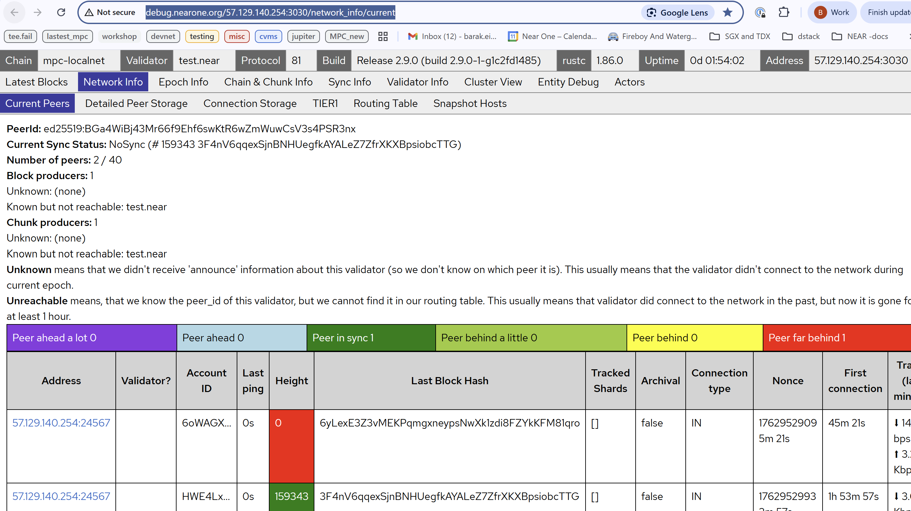

# Setting Up a Local MPC Network Using CVMs

This guide explains how to create and test a **Multi-Party Computation (MPC)** network on a local blockchain (localnet), where each MPC node runs inside a **Confidential Virtual Machine (CVM)**.

It builds upon the [Localnet Setup Guide](https://github.com/near/mpc/blob/main/docs/localnet/localnet.md), which describes how to launch a local blockchain network.  
However, instead of running MPC nodes as local binaries, this setup runs each MPC node inside a CVM, where the MPC node itself runs as a Docker container.

For details on how to set up a TDX-based Confidential VM and prepare the DStack environment, refer to the [Running an MPC Node in TDX External Guide](https://github.com/near/mpc/blob/main/docs/running_an_mpc_node_in_tdx_external_guide.md).

---

## High-Level Steps

1. Prepare a TDX-enabled setup as described in the [TDX Guide](https://github.com/near/mpc/blob/main/docs/running_an_mpc_node_in_tdx_external_guide.md).  
2. Prepare the localnet setup as described in the [Localnet Setup Guide](https://github.com/near/mpc/blob/main/docs/localnet/localnet.md), excluding the startup of the MPC nodes.  
3. Start two MPC nodes that will run inside CVMs.  
4. Extract the public keys from the nodes and add them to the contract and user accounts.  
5. Vote for a new MPC Docker image hash on the contract.  
6. Vote to add a domain to the contract.  
7. Send a `sign` command to the network.

---
## Step 1: Prepare a TDX-enabled setup 
Follow the [TDX Guide](https://github.com/near/mpc/blob/main/docs/running_an_mpc_node_in_tdx_external_guide.md). Up until (but not including **MPC Node Setup and Deployment**
)

Note - You can use the instructions in **MPC Node Setup and Deployment** section - as guidelines on how to configure and manage an MPC node in a CVMs (but the actual configuration values will differ)

## Step 2: Spin Up the Localnet

Follow the [Localnet Setup Guide](https://github.com/near/mpc/blob/main/docs/localnet/) up until (but not including) the **“Start MPC nodes”** section.

---

## Step 3: Deploy MPC Nodes

Create two accounts for the MPC nodes (we’ll call them **Frodo** and **Sam**):

```bash
near account create-account fund-myself frodo.test.near '100 NEAR' autogenerate-new-keypair save-to-keychain sign-as test.near network-config mpc-localnet sign-with-plaintext-private-key "$VALIDATOR_KEY" send

near account create-account fund-myself sam.test.near '100 NEAR' autogenerate-new-keypair save-to-keychain sign-as test.near network-config mpc-localnet sign-with-plaintext-private-key "$VALIDATOR_KEY" send
```

### Configuration Parameters

Those are the recommended configuration settings:
you will need the following files:

* [docker-compose.yml](./tee_launcher/launcher_docker_compose.yaml)
* [frodo.conf](./deployment/localnet/TEE/frodo.conf) / [sam.conf](./deployment/localnet/TEE/sam.conf) 
* [frodo.env](./deployment/localnet/TEE/frodo.env)/ [sam.env](./deployment/localnet/TEE/sam.env)    - if you use the deployment script


#### Define the machine's external IP once  

```bash
export MACHINE_IP=$(curl -4 -s ifconfig.me)  # or use known IP for the machine
```

#### Example `docker-compose.yml`

```yaml
version: '3.8'

services:
  launcher:
    image: nearone/mpc-launcher@sha256:bab4577e61bebcbcbed9fff22dd5fa741ded51465671638873af8a43e8f7373b
    container_name: launcher
    environment:
      - DOCKER_CONTENT_TRUST=1
      - DEFAULT_IMAGE_DIGEST=sha256:5c456b7f5f3da5f92e28b4ae031fb085bde74ae59ad6691e6713309d79fb323c
    volumes:
      - /var/run/docker.sock:/var/run/docker.sock
      - /var/run/dstack.sock:/var/run/dstack.sock
      - /tapp:/tapp:ro
      - shared-volume:/mnt/shared:ro
    security_opt:
      - no-new-privileges:true
    read_only: true
    tmpfs:
      - /tmp

volumes:
  shared-volume:
    name: shared-volume
```


#### Environment File (`.env` , `user.conf` )

Frodo 

```env
# MPC Docker image override
MPC_IMAGE_NAME=nearone/mpc-node
MPC_IMAGE_TAGS=1356-more-detailed-error-messages-when-attestation-validation-fails-3a12c28
MPC_REGISTRY=registry.hub.docker.com

# MPC node settings
MPC_ACCOUNT_ID=frodo.test.near
MPC_LOCAL_ADDRESS=127.0.0.1
MPC_SECRET_STORE_KEY=AAAAAAAAAAAAAAAAAAAAAAAAAAAAAAAA
MPC_CONTRACT_ID=mpc-contract.test.near
MPC_ENV=mpc-localnet
MPC_HOME_DIR=/data
RUST_BACKTRACE=full
RUST_LOG=info

NEAR_BOOT_NODES=ed25519:BGa4WiBj43Mr66f9Ehf6swKtR6wZmWuwCsV3s4PSR3nx@${MACHINE_IP}:24566

# Port forwarding
PORTS=8080:8080,24567:24567,13001:13001
```


Sam:

```env
# MPC Docker image override
MPC_IMAGE_NAME=nearone/mpc-node
MPC_IMAGE_TAGS=1356-more-detailed-error-messages-when-attestation-validation-fails-3a12c28
MPC_REGISTRY=registry.hub.docker.com

# MPC node settings
MPC_ACCOUNT_ID=frodo.test.near
MPC_LOCAL_ADDRESS=127.0.0.1
MPC_SECRET_STORE_KEY=AAAAAAAAAAAAAAAAAAAAAAAAAAAAAAAA
MPC_CONTRACT_ID=mpc-contract.test.near
MPC_ENV=mpc-localnet
MPC_HOME_DIR=/data
RUST_BACKTRACE=full
RUST_LOG=info

NEAR_BOOT_NODES=ed25519:BGa4WiBj43Mr66f9Ehf6swKtR6wZmWuwCsV3s4PSR3nx@${MACHINE_IP}:24566

# Port forwarding
PORTS=8080:8080,24567:24567,13002:13002
```

**Key Provider ID:**

```
1b7a49378403249b6986a907844cab0921eca32dd47e657f3c10311ccaeccf8b
```

> 💡 *Suggestion:* Consider extracting environment-specific variables (like `MPC_ACCOUNT_ID`, `PORTS`, and `MPC_HOME_DIR`) into per-node `.env` files for maintainability.

---

### Node Startup

You can start the nodes **manually** as described in the Operator Guide or start them using the script `deploy-launcher.sh` below.


Once all paths and configuration files (`*.env` and `*.conf`) are prepared, you can launch each MPC node (Frodo and Sam) using the `deploy-launcher.sh` helper script.

### 1. Move into the `tee_launcher` Directory

```bash
cd tee_launcher
```

### 2. Ensure the Script Is Executable

```bash
chmod +x deploy-launcher.sh
```

### 3. Start the Frodo MPC Node

```bash
./deploy-launcher.sh \
  --env-file ../deployment/localnet/tee/frodo.env \
  --base-path /mnt/data/barak/dstack \
  --python-exec python3
```

### 4. Start the Sam MPC Node

```bash
./deploy-launcher.sh \
  --env-file ../deployment/localnet/tee/sam.env \
  --base-path /mnt/data/barak/dstack \
  --python-exec python3
```

If successful, each command will output an **App ID** and confirm creation of a **CVM instance** (e.g., `Created VM with ID: …`).  
Your MPC nodes are now running inside TDX-backed CVMs and ready to participate in the network.

## Extracting Keys from MPC Nodes

We must delegate the generated account/responder keys from Sam and Frodo as access keys to their NEAR accounts, allowing them to sign transactions requiring authorization on the contract.

> 📝 *Note:* Responder keys are deprecated and can be removed in future revisions.

```bash
export FRODO_PUBKEY=$(curl -s localhost:18081/public_data | jq -r ".near_signer_public_key")
export SAM_PUBKEY=$(curl -s localhost:18082/public_data | jq -r ".near_signer_public_key")

export FRODO_RESPONDER_KEY=$(curl -s localhost:18081/public_data | jq -r ".near_responder_public_keys[0]")
export SAM_RESPONDER_KEY=$(curl -s localhost:18082/public_data | jq -r ".near_responder_public_keys[0]")
```

```bash
export FRODO_P2P_KEY=$(curl -s localhost:18081/public_data | jq -r '.near_p2p_public_key')
export SAM_P2P_KEY=$(curl -s localhost:18082/public_data | jq -r '.near_p2p_public_key')

export MPC_HOST=$MACHINE_IP
```

### Add the Keys to User Accounts

Now, add these keys to the appropriate NEAR accounts using the NEAR CLI:

```bash
near account add-key frodo.test.near grant-full-access use-manually-provided-public-key "$FRODO_PUBKEY" network-config mpc-localnet sign-with-keychain send
near account add-key frodo.test.near grant-full-access use-manually-provided-public-key "$FRODO_RESPONDER_KEY" network-config mpc-localnet sign-with-keychain send

near account add-key sam.test.near grant-full-access use-manually-provided-public-key "$SAM_PUBKEY" network-config mpc-localnet sign-with-keychain send
near account add-key sam.test.near grant-full-access use-manually-provided-public-key "$SAM_RESPONDER_KEY" network-config mpc-localnet sign-with-keychain send
```

### Initialize the MPC Contract

Initialize the MPC contract with the two participants (using the `P2P_KEY` values retrieved earlier).

Prepare the arguments for the init call:

```bash
envsubst < docs/localnet/args/init.json > /tmp/init_args.json
```

Now call the `init` function on the contract:

```bash
near contract call-function as-transaction mpc-contract.test.near init file-args /tmp/init_args.json prepaid-gas '300.0 Tgas' attached-deposit '0 NEAR' sign-as mpc-contract.test.near network-config mpc-localnet sign-with-keychain send
```

Verify that initialization succeeded:

```bash
near contract call-function as-read-only mpc-contract.test.near state json-args {} network-config mpc-localnet now
```

---

## Voting for a New MPC Docker Image Hash

Before voting, ensure that the contract’s list of valid MPC image hashes is updated.  
If it’s not, node attestation submissions will fail.

**Sample Error Log (Expected Before Voting):**

```
Smart contract panicked: Invalid TEE Remote Attestation...
MPC image hash ... is not in the allowed hashes list
```

### Vote Commands

### Vote Commands

Set **CODE_HASH** to value you want to vote for.
```bash
export CODE_HASH=5c456b7f5f3da5f92e28b4ae031fb085bde74ae59ad6691e6713309d79fb323c
```

```bash

# Sam votes
near contract call-function as-transaction mpc-contract.test.near vote_code_hash \
  json-args "{\"code_hash\": \"$CODE_HASH\"}" \
  prepaid-gas '100.0 Tgas' attached-deposit '0 NEAR' \
  sign-as sam.test.near network-config mpc-localnet sign-with-keychain send

# Frodo votes
near contract call-function as-transaction mpc-contract.test.near vote_code_hash \
  json-args "{\"code_hash\": \"$CODE_HASH\"}" \
  prepaid-gas '100.0 Tgas' attached-deposit '0 NEAR' \
  sign-as frodo.test.near network-config mpc-localnet sign-with-keychain send
```

Verify the contract state:

```bash
near contract call-function as-read-only mpc-contract.test.near state json-args {} network-config mpc-localnet now
```

### Check That Valid Attestations Are Registered

```bash
near contract call-function as-transaction \
  mpc-contract.test.near \
  get_tee_accounts \
  json-args '{}' \
  prepaid-gas '300 Tgas' \
  attached-deposit '0 NEAR' \
  sign-as sam.test.near \
  network-config mpc-localnet \
  sign-with-keychain send
```

You should see both nodes with valid attestations containing a `tls_public_key` and `account_public_key`.

---

## Add a Domain

Now the contract should be initialized and both nodes should be running.  
To verify that the network is functional, request a signature from it.  
Before that, add a domain.

Both Frodo and Sam should vote to add a **Secp256k1** domain:

```bash
near contract call-function as-transaction mpc-contract.test.near vote_add_domains file-args docs/localnet/args/add_domain.json prepaid-gas '300.0 Tgas' attached-deposit '0 NEAR' sign-as frodo.test.near network-config mpc-localnet sign-with-keychain send

near contract call-function as-transaction mpc-contract.test.near vote_add_domains file-args docs/localnet/args/add_domain.json prepaid-gas '300.0 Tgas' attached-deposit '0 NEAR' sign-as sam.test.near network-config mpc-localnet sign-with-keychain send
```

Check the contract state again. The status should transition from **Running** → **Initializing** → **Running** after DKG completion.

```bash
near contract call-function as-read-only mpc-contract.test.near state json-args {} network-config mpc-localnet now
```

In the MPC node's logs you should see something like this:

```bash
2025-11-16T07:42:09.728557971Z 2025-11-16T07:42:09.728318Z  INFO mpc_node::p2p: Outgoing 1 --> 0 connected
2025-11-16T07:42:09.855900011Z 2025-11-16T07:42:09.855671Z  INFO mpc_node::p2p: Incoming 1 <-- 0 connected
```

> 📝 *Note:* If the contract remains stuck in the *Initializing* state, your nodes may be unable to connect to each other.


---

## Sending a Sign Command to the MPC Network

```bash
near contract call-function as-transaction mpc-contract.test.near sign \
  file-args docs/localnet/args/sign.json \
  prepaid-gas '300.0 Tgas' attached-deposit '100 yoctoNEAR' \
  sign-as frodo.test.near network-config mpc-localnet sign-with-keychain send
```

**Expected Output:**

```
 INFO Function execution return value (printed to stdout):
{
  "big_r": {
    "affine_point": "0266959C2F1A155D38FAB0B15A7E6FAD8DDEB857594FB2F1DFEF323E395949F8E2"
  },
  "recovery_id": 0,
  "s": {
    "scalar": "6C38CCEF118EA86F3A5DB5CC8703E9A2B5289FCD564D3224DC61E374B58ABB8C"
  },
  "scheme": "Secp256k1"
}
 INFO

 |    The "sign" call to <mpc-contract.test.near> on behalf of <frodo.test.near> succeeded.
```


---

## Troubleshooting

### NearD Dashboard

When running a localnet, you can use the **NearD debug dashboard** to inspect the state of the chain and monitor your MPC nodes.

#### Example

In the example below (running on a machine with external IP **57.129.140.254**), the dashboard displays two MPC nodes — one fully synced and the other still catching up:

**Dashboard URL:**
```
http://debug.nearone.org/57.129.140.254:3030/network_info/current
```

**Screenshot:**



