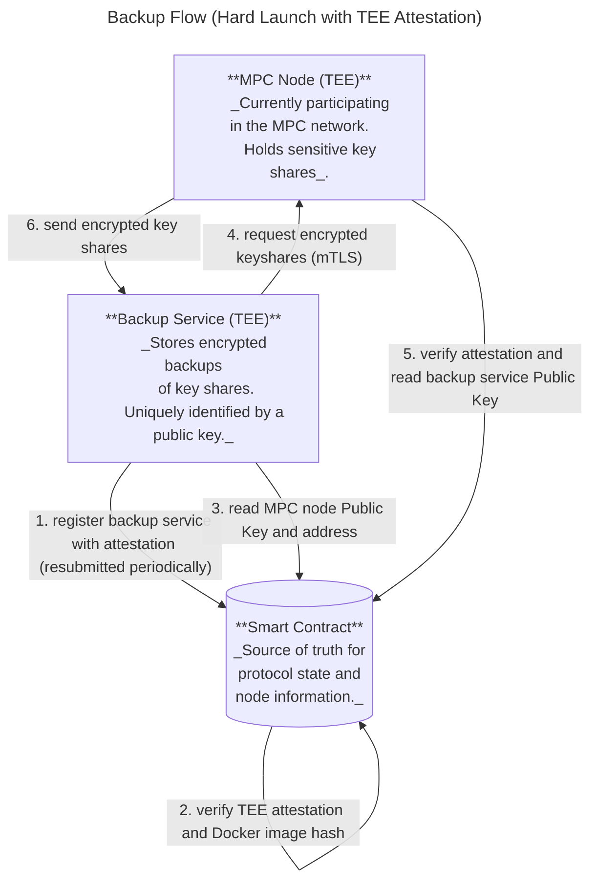
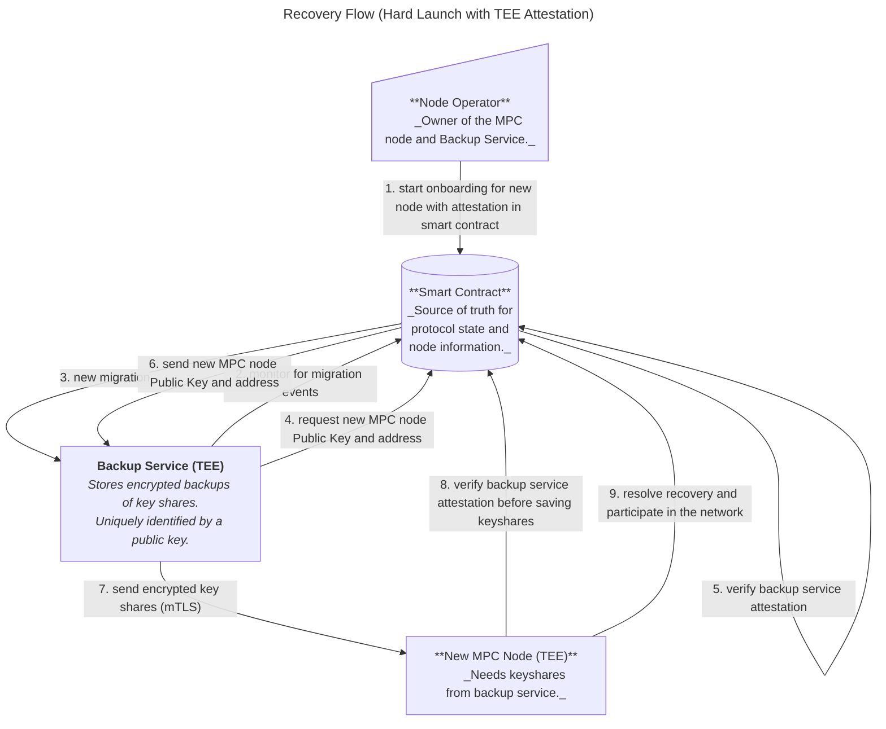

# Migration Service TEE integration

This documents outlines the design and efforts for runnnig the migration and backup service inside a trusted execution environment (c.f. [miration-service](docs/migratoion-service.md) for more details on the migration and backup service, as well as for the motivation of running it inside a TEE).

For the hard launch, the above steps will not be run manually, but automatically:
- The backup service runs a NEAR node and monitors the MPC smart contract;
- The backup service compares the keyshares it has in its possession with the keyshares it is supposed to have (the contract [keeps track](https://github.com/near/mpc/blob/2d833aee6eab1e7a796348787028f3392cafe1bd/crates/contract/src/state/running.rs#L27-L29) of what keys are currently used);
- If the backup service is missing keyshares, it requests them from the MPC node (similar to steps 2.1-2.4 in the [Soft Launch](#soft-launch) section).
Additionally, the MPC node will have to verify the attestation submitted by the backup service.




*recovery*


For the hard launch, the recovery flow is the same as in the soft launch, but more automated: the backup service monitors the contract state and initiates migrations automatically (e.g., by calling `conclude_node_migration(keyset)`). The operator only needs to initiate the process by calling `start_node_migration`.

There's also an additional TEE-attestation step: the new node must verify that the smart contract successfully verified the backup service's attestation before saving the received keyshares, and the contract must verify the backup service's attestation before handing over the public key and address of the new MPC node.



## Introduction

The backup service will want to submit proof to the blockchain that it's running inside a TEE. Further, it will need to track the MPC contract state, such that it can act autonomously without intervention by the node operator (currently, backups and migrations require a lot of manual intervention by the node operators).
For that reason, the design discussion can be split in two tracks:

1. Indexer integration with the migration and backup service. Similar to how the MPC nodes keep track of the Contract state by running an indexer, the migration and backup service will do the same.
2. TEE integration under the assumption that the migration and backup service is running an indexer.

It seems possible to work on both of these tracks in parallel, if we agree on the indexer an MPC contract API beforehand.

## Indexer

### Background and Motivation

The node is already running an indexer. It makes sense to re-use the existing logic for the following reasons:
- Generally, it is preferred to re-use code where applicable;
- The indexer exposes some Near internals, which have experienced breaking changes in the past. It would thus be good to only have to maintain one place where we depend on these internals.
- There exist larger plans for the indexer. It is quite useful to have a standalone binary that is capable of mnoitoring the MPC contract and recognizing transactions related to the MPC network. We could use it as a tool for monitoring our production deployments.

On a high-level, we expect to be doing the following:

1. Clean up the indexer API in the MPC node, such that it will be easy to separate it from the node. WE MUST ENSURE TO NOT EXPOSE nearcore internals - we would like to have a single point of failure in case nearcore decides to change the indexer API.
2. Move the indexer code into its own crate.
3. Add the indexer crate as a dependency to the migration and backup service.

As a first step, we need to agree on an indexer API.

### Proposed Indexer API

This is the current IndexerAPI:

```rust
/// API to interact with the indexer. Can be replaced by a dummy implementation.
/// The MPC node implementation needs this and only this to be able to interact
/// with the indexer.
/// TODO(#155): This would be the interface to abstract away having an indexer
/// running in a separate process.
pub struct IndexerAPI<TransactionSender> {
    /// Provides the current contract state as well as updates to it.
    pub contract_state_receiver: watch::Receiver<ContractState>,
    /// Provides block updates (signature requests and other relevant receipts).
    /// It is in a mutex, because the logical "owner" of this receiver can
    /// change over time (specifically, when we transition from the Running
    /// state to a Resharing state to the Running state again, two different
    /// tasks would successively "own" the receiver).
    /// We do not want to re-create the channel, because while resharing is
    /// happening we want to buffer the signature requests.
    pub block_update_receiver: Arc<tokio::sync::Mutex<mpsc::UnboundedReceiver<ChainBlockUpdate>>>,
    /// Handle to transaction processor.
    pub txn_sender: TransactionSender,
    /// Watcher that keeps track of allowed [`DockerImageHash`]es on the contract.
    pub allowed_docker_images_receiver: watch::Receiver<Vec<MpcDockerImageHash>>,
    /// Watcher that keeps track of allowed [`LauncherDockerComposeHash`]es on the contract.
    pub allowed_launcher_compose_receiver: watch::Receiver<Vec<LauncherDockerComposeHash>>,
    /// Watcher that tracks node IDs that have TEE attestations in the contract.
    pub attested_nodes_receiver: watch::Receiver<Vec<NodeId>>,

    pub my_migration_info_receiver: watch::Receiver<MigrationInfo>,
}
```

Note that it consist of the following:
- view functions (for finalized contract state):
    - `contract_state_receiver`
    - `allowed_docker_images_receiver`
    - `allowed_launcher_compose_receiver`
    - `attested_nodes_receiver`
    - `my_migration_info_receiver`
- view streams (for monitoring non-finalized transactions related to the contract)
    - `block_update_receiver`
- write functions (sending transactions)
    - `txn_sender`

Not all users of the indexer crate will be interested in all of these capabilities. Monitoring our production deployments might not need the ability to send any transactions, while the backup and migration service does not care about block updates.

Thus, it seems sensible to offer separate API's for:
- state view
- block stream 
- transaction sender


#### State View

The indexer should offer a convenient method for viewing and subscribing to MPC contract state. While it would be sufficient to only expose a simple view function like the following:

```rust
trait MpcContractStateView {
    async fn get<T: DeserializeOwned>(
        &self,
        endpoint: MpcContractEndpoint,
    ) -> anyhow::Result<(BlockHeight, T)>;
}
```

we might need re-write a lot of the monitoring and subscription logic on the consumer side. Hence, it makes sense to additionally expose a subscriber logic:

```rust
trait MpcContractStateSubscriber {
    async fn subscribe<T: DeserializeOwned + PartialEq + Send + 'static>(
        &self,
        endpoint: MpcContractEndpoint,
        subscriber_policy: SubscriberPolicy,
    ) -> anyhow::Result<Oneshot<watch::Receiver<(BlockHeight,T)>>>;
}
```

where `SubscriberPolicy` details how the indexer should query new contract state (e.g. exponential backoff, interval, etc), the behavior on error etc.
It could look something like this:

```rust
pub struct SubscriberPolicy {
    query_policy: QueryPolicy,
    error_policy: ErrorPolicy,
}

pub enum QueryPolicy {
    Interval(Duration),
    ExponentialBackoff()
}

pub enum ErrorPolicy {
    DropSenderOnError,// drop as soon as we encounter an error. This might crash the node
    RetryUntilFirstSuccess(QueryPolicy),// when starting up, retry following QueryPolicy until the first query was successful. Then stop
    IgnoreError(Querypolicy), // ignore any errors, retry forever following the QueryPolicy for errors
}
```

#### BlockStream

For the next few months, the only expected user of block streams is the MPC node. This might change in the future if we use the indexer crate for monitoring and testing our MPC code, but fo rnow, it seems safe to just port the existing design to the indexer until we have a better idea of what changes we would want from it.

```Rust
// c.f. https://github.com/near/mpc/issues/236 for start_block_height
trait MpcEventSubscriber {
    async fn subscribe(interval: Duration, channel_size: usize, start_block_height) -> anyhow::Result<mpsc::Receiver<ChainBlockUpdate>>;
}

pub struct ChainBlockUpdate {
    pub block: BlockViewLite,
    pub signature_requests: Vec<SignatureRequestFromChain>,
    pub completed_signatures: Vec<SignatureId>,
    pub ckd_requests: Vec<CKDRequestFromChain>,
    pub completed_ckds: Vec<CKDId>,
}
```

##### Transaction Sender

Similarly, it's probably fine for the first iteration to keep the existing `TransactionSender` trait:

```rust
pub trait TransactionSender: Clone + Send + Sync {
    fn send(
        &self,
        transaction: ChainSendTransactionRequest,
    ) -> impl Future<Output = Result<(), TransactionProcessorError>> + Send;

    fn send_and_wait(
        &self,
        transaction: ChainSendTransactionRequest,
    ) -> impl Future<Output = Result<TransactionStatus, TransactionProcessorError>> + Send;
}
```

### Implementation

Some pre-conditions must be met:
1. We need to refactor the node, such that the Indexer's view methods only transmit types part of the contract interface. C.f. https://github.com/near/mpc/issues/1184
2. we can then construct what is currently `IndexerAPI` from our traits (WIP):

```rust
fn make_indexer_api(indexer_config: IndexerConfig) -> IndexerAPI<MpcTransactionSender> {
    let indexer = crate::indexer::new(indexer_config);

    // view subscribers
    let contract_state_receiver: watch::Receiver<ContractState> = indexer.view.subscribe(CONTRACT_STATE_ENDPOINT, policy);
    let allowed_docker_images_receiver: watch::Receiver<Vec<MpcDockerImageHash>> = indexer.view.subscribe(ALLOWED_IMAGE_HASHES_ENDPOINT, policy);
    let allowed_launcher_compose_receiver: watch::Receiver<Vec<LauncherDockerComposeHash>> = indexer.view.subscribe(ALLOWED_LAUNCHER_COMPOSE_HASHES_ENDPOINT, policy);
    let attested_nodes_receiver: watch::Receiver<Vec<NodeId>> = indexer.view.subscribe(TEE_ACCOUNTS_ENDPOINT, policy);
    let my_migration_info_receiver: watch::Receiver<MigrationInfo> = indexer.view.subscribe(MIGRATION_INFO_ENDPOINT, policy);

    // block update receivers
    pub block_update_receiver: Arc<tokio::sync::Mutex<mpsc::UnboundedReceiver<ChainBlockUpdate>>> = indexer.stream.subscribe();

    // transaction sender
    pub txn_sender: TransactionSender = indexer.make_sender();
}
```

for the second part, we can check if we can propose something like this (this is with exponential backoff):
```rust

// self is MpcIndexer
async fn subscribe<Fetcher, T, FetcherResponseFuture>(
    self,
    indexer_state: Arc<IndexerState>,
    mpc_contract_enpoint: MpcContractEndpoint
) -> Oneshot<watch::Receiver<T>>,
    where
    T: PartialEq,
    Fetcher: Fn(AccountId) -> FetcherResponseFuture + Send + Sync,
    FetcherResponseFuture: Future<Output = anyhow::Result<(u64, T)>> + Send,
{
    // generate channel

    // separate below to external function
    let fetch_allowed_hashes = {
        let indexer_state = indexer_state.clone();
        async move || {
            let mut backoff = ExponentialBuilder::default()
                .with_min_delay(MIN_BACKOFF_DURATION)
                .with_max_delay(MAX_BACKOFF_DURATION)
                .without_max_times()
                .with_jitter()
                .build();

            loop {
                match self.view_client.get_mpc_state(self.mpc_contract_id, mpc_contract_endpoint).await {
                    Ok((_block_height, allowed_hashes)) => {
                        break allowed_hashes;
                    }
                    Err(e) => {
                        let error_msg = format!("{:?}", e);
                        if error_msg.contains(
                            "wasm execution failed with error: MethodResolveError(MethodNotFound)",
                        ) {
                            tracing::info!(target: "mpc", "method  not found in contract: {error_msg}");
                        } else {
                            tracing::error!(target: "mpc", "error reading tee state from chain: {error_msg}");
                        }

                        let backoff_duration = backoff.next().unwrap_or(MAX_BACKOFF_DURATION);
                        tokio::time::sleep(backoff_duration).await;

                        continue;
                    }
                };
            }
        }
    };

    // wait for full sync
    tracing::debug!(target: "indexer", "awaiting full sync to read mpc contract state");
    indexer_state.client.wait_for_full_sync().await;

    // spawn this in a task
    loop {
        tokio::time::sleep(ALLOWED_HASHES_REFRESH_INTERVAL).await;
        let allowed_hashes = fetch_allowed_hashes().await;
        sender.send_if_modified(|previous_allowed_hashes| {
            if *previous_allowed_hashes != allowed_hashes {
                *previous_allowed_hashes = allowed_hashes;
                true
            } else {
                false
            }
        });
    }

    // return a onechot channel that resolves once we are fully synced
}

```

and simplify these getters:

```rust
impl IndexerViewClient {

    pub(crate) async fn get_pending_request(
        &self,
        mpc_contract_id: &AccountId,
        chain_signature_request: &ChainSignatureRequest,
    ) -> anyhow::Result<Option<YieldIndex>> {
        let get_pending_request_args: Vec<u8> =
            serde_json::to_string(&ChainGetPendingSignatureRequestArgs {
                request: chain_signature_request.clone(),
            })
            .unwrap()
            .into_bytes();

        let request = QueryRequest::CallFunction {
            account_id: mpc_contract_id.clone(),
            method_name: "get_pending_request".to_string(),
            args: get_pending_request_args.into(),
        };
        let block_reference = BlockReference::Finality(Finality::Final);

        let query = near_client::Query {
            block_reference,
            request,
        };

        let query_response = self
            .view_client
            .send_async(query)
            .await
            .context("failed to query for pending request")??;

        match query_response.kind {
            QueryResponseKind::CallResult(call_result) => {
                serde_json::from_slice::<Option<YieldIndex>>(&call_result.result)
                    .context("failed to deserialize pending request response")
            }
            _ => {
                anyhow::bail!("Unexpected result from a view client function call");
            }
        }
    }

    pub(crate) async fn get_pending_ckd_request(
        &self,
        mpc_contract_id: &AccountId,
        chain_ckd_request: &ChainCKDRequest,
    ) -> anyhow::Result<Option<YieldIndex>> {
        let get_pending_request_args: Vec<u8> =
            serde_json::to_string(&ChainGetPendingCKDRequestArgs {
                request: chain_ckd_request.clone(),
            })
            .unwrap()
            .into_bytes();

        let request = QueryRequest::CallFunction {
            account_id: mpc_contract_id.clone(),
            method_name: "get_pending_ckd_request".to_string(),
            args: get_pending_request_args.into(),
        };
        let block_reference = BlockReference::Finality(Finality::Final);

        let query = near_client::Query {
            block_reference,
            request,
        };

        let query_response = self
            .view_client
            .send_async(query)
            .await
            .context("failed to query for pending CKD request")??;

        match query_response.kind {
            QueryResponseKind::CallResult(call_result) => {
                serde_json::from_slice::<Option<YieldIndex>>(&call_result.result)
                    .context("failed to deserialize pending CKD request response")
            }
            _ => {
                anyhow::bail!("Unexpected result from a view client function call");
            }
        }
    }

    pub(crate) async fn get_participant_attestation(
        &self,
        mpc_contract_id: &AccountId,
        participant_tls_public_key: &contract_interface::types::Ed25519PublicKey,
    ) -> anyhow::Result<Option<contract_interface::types::VerifiedAttestation>> {
        let get_attestation_args: Vec<u8> = serde_json::to_string(&GetAttestationArgs {
            tls_public_key: participant_tls_public_key,
        })
        .unwrap()
        .into_bytes();

        let request = QueryRequest::CallFunction {
            account_id: mpc_contract_id.clone(),
            method_name: GET_TEE_ATTESTATION_ENDPOINT.to_string(),
            args: get_attestation_args.into(),
        };
        let block_reference = BlockReference::Finality(Finality::Final);

        let query = near_client::Query {
            block_reference,
            request,
        };

        let query_response = self
            .view_client
            .send_async(query)
            .await
            .context("failed to query for pending request")??;

        match query_response.kind {
            QueryResponseKind::CallResult(call_result) => serde_json::from_slice::<
                Option<contract_interface::types::VerifiedAttestation>,
            >(&call_result.result)
            .context("failed to deserialize pending request response"),
            _ => {
                anyhow::bail!("Unexpected result from a view client function call");
            }
        }
    }

    pub(crate) async fn latest_final_block(&self) -> anyhow::Result<BlockView> {
        let block_query = near_client::GetBlock(BlockReference::Finality(Finality::Final));
        self.view_client
            .send_async(block_query)
            .await?
            .context("failed to get query for final block")
    }
}
```


## Smart contract & Backup service changes

## Implementation Details

### Contract


For hard launch, `NodeMigrations` will be extended with the existing `TeeState` struct, which contains attestation, timestamp, and all TEE-related verification data. The global `TeeState` maintains allowed Docker image and launcher hash lists for backup services (separate from MPC node images), managed through existing voting mechanisms.

```
/// Manages backup service registration and ongoing node migrations
pub struct NodeMigrations {
    /// Maps AccountId to backup service info (public key for TLS authentication)
    backup_services_info: IterableMap<AccountId, BackupServiceInfo>,

    /// Maps AccountId to destination node info for in-progress migrations
    ongoing_migrations: IterableMap<AccountId, DestinationNodeInfo>,

    /// Global TEE state for backup services (for hard launch)
    /// Contains shared allowed Docker image hashes, launcher hashes, and voting state
    pub backup_service_tee_state: TeeState,
}
```

Additionally, the backup service will need to provide a TEE attestation similar to MPC nodes, which requires extending the contract to support attestation verification for backup services. (TODO(#947): Define attestation data for backup service)

#### Backup Service Registration

The backup service attestation registreation and verification would follow the same process as MPC node attestations:
1. Backup service generates TLS keypair inside TEE
2. Backup service generates account keypair inside TEE for signing contract transactions (required to submit the attestation to the contract)
3. Creates `ReportData` V1: `[version(2 bytes big endian) || sha384(TLS pub key || account_pubkey) || zero padding]`
4. Obtains TEE quote embedding the `ReportData`
5. Submits attestation via `register_backup_service(tls_public_key, account_public_key, attestation)`
6. Contract verifies (using existing `TeeState` verification logic):
   - Quote validity via attestation provider
   - Docker image hash against allowed list
   - Launcher compose hash (if applicable)
   - Timestamp within deadline
   - `ReportData` matches SHA3-384 hash of `SHA3-384(tls_public_key || account_public_key)`
   - Transaction signer's public key matches `account_public_key` via `env::signer_account_pk()`
7. Contract stores `TeeState` (containing attestation and all verification data)

> **Note**: Unlike MPC nodes which may need multiple attestations per operator, backup services use a simpler one-per-operator model. The `AccountId` remains the unique identifier, consistent with soft launch.

#### Backup Service TEE methods

The contract provides separate voting endpoints for backup service Docker image hashes. These are intentionally separate from MPC node voting to maintain backwards compatibility:

- **`vote_backup_service_code_hash(code_hash: BackupServiceDockerImageHash)`** - Votes to add a backup service Docker image hash to the whitelist:
    - Called by MPC node operators (must be a current participant)
    - Similar to `vote_code_hash()` but for backup service images
    - When threshold is reached, the hash is added to the allowed backup service images list
    - Can only be called when protocol is in `Running` state
    - Separate from MPC node image voting for backwards compatibility
    - Automatically generates and whitelists the corresponding launcher compose hash

- **`allowed_backup_service_code_hashes()`** - Returns all currently allowed backup service Docker image hashes:
    - Read-only view method
    - Returns hashes that are still within their validity period
    - Separate list from MPC node allowed hashes

- **`allowed_backup_service_launcher_compose_hashes()`** - Returns all allowed backup service launcher compose hashes:
    - Read-only view method
    - Launcher compose hashes are automatically generated from voted Docker image hashes
    - Used by backup service launchers to verify the correct compose file is being used
    - Separate list from MPC node launcher hashes

> **Note on Launcher Compose Hashes**: Launcher compose hashes are **not voted on directly**. When operators vote for a backup service Docker image hash via `vote_backup_service_code_hash()` and the voting threshold is reached, the contract automatically:
> 1. Computes the launcher compose hash by filling the template with the Docker image hash
> 2. Adds both the Docker image hash and launcher compose hash to their respective allowed lists
>
> This deterministic derivation ensures the launcher configuration always matches the voted Docker image, eliminating the need for separate voting. The same pattern is used for MPC nodes with `vote_code_hash()`.

#### Migration Methods

The contract provides the following methods:

- **`start_node_migration(destination_node_info: ParticipantInfo)`** - Initiates a node migration:
    - Called by the node operator
    - Creates an `OngoingNodeMigration` record for the given `AccountId`
    - Stores the destination node's `ParticipantInfo` (new TLS keys, etc.)
    - Can be called multiple times to update the destination node info (only the last value is retained)
    - Returns an error if the protocol is not in `Running` state
    - Returns an error if caller is not a current participant

- **`cancel_node_migration()`** - Cancels an ongoing node migration:
    - Called by the node operator
    - Removes the `OngoingNodeMigration` record for the given `AccountId`
    - Useful if the new node is not functioning correctly or wrong information was provided

- **`conclude_node_migration(keyset: &Keyset)`** - Finalizes a node migration:
    - Called by the new node after receiving keyshares from backup service
    - Verifies the provided `keyset` matches the expected key event IDs for this epoch
    - Replaces the old node's `ParticipantInfo` with the new node's info in the current participant set
    - Removes the `OngoingNodeMigration` record
    - Returns an error if the protocol is not in `Running` state
    - Returns an error if no ongoing migration exists for the caller

- **`register_backup_service(backup_service_info: BackupServiceInfo)`** - Registers or updates backup service:
    - Called by the node operator
    - Stores the backup service's public key and URL for the node operator's account
    - Defines or overrides the `BackupServiceInfo` for the node operator
    - Can be called in any protocol state (`Running`, `Initializing`, or `Resharing`)
    - Returns an error if caller is not a current participant

> **Hard Launch Extension (Planned):** For hard launch, `register_backup_service()` will require an `attestation` and `operator_account_pk` parameter. The contract will verify the attestation validity, Docker image hash, and that the `ReportData` includes both the TLS public key and operator's account public key (`SHA3-384(tls_public_key || operator_account_pk)`). This cryptographically binds the backup service TEE to the specific operator, preventing a malicious backup service from registering under a different operator's account. Backup services will need to refresh attestations before expiration.

#### Migration Related Behavior

- The `OngoingNodeMigration` records are automatically cleared when the protocol transitions from `Running` state to `Resharing` or `Initializing` state, effectively cancelling any in-progress migrations.
- **Future Enhancement**: It may be desirable for the contract to verify that calls to `conclude_node_migration(keyset)` come from the actual onboarding node by checking the transaction signer's public key _(see [(#1086)](https://github.com/near/mpc/issues/1086))_. This would prevent ill-behaved decommissioned nodes from making spurious migration calls. This would require:
    - Comparing `env::signer_account_pk()` with the public key associated with the participant (note: this is different from the TLS key currently stored as [`signer_pk`](https://github.com/near/mpc/blob/b5a9d1b2eef4de47d19b66cb25b577da2b897560/crates/contract/src/tee/tee_state.rs#L32) in TEEState)
    - Including this public key in the TEE attestation

### Backup Service Components

Both soft launch and hard launch implementations share common core components, with hard launch adding TEE-specific features and automation.

#### Common Components (Both Soft and Hard Launch)

1. **mTLS Client**: Establishes authenticated connections to MPC nodes using P2P keys
   - Performs mutual TLS handshake using keys registered in the contract
   - Validates peer identity against expected public key from contract

2. **Symmetric Encryption**: Uses an operator-provided environment variable for an additional encryption layer
   - Operator manually provides the same key to both MPC node and backup service: `MPC_BACKUP_ENCRYPTION_KEY_HEX` (soft launch) or `BS_BACKUP_ENCRYPTION_KEY_HEX` (hard launch)
   - Adds second layer of encryption beyond mTLS transport security
   - Extra protection if contract state becomes inconsistent or manipulated


#### Hard Launch-Specific Components

3. **Contract Transaction Interface**: Signs and submits transactions automatically
   - Calls `register_backup_service()` with attestation periodically
   - Uses account private key generated in TEE

4. **TEE Runtime**: TDX-enabled environment backed by [dstack](https://github.com/Dstack-TEE/dstack)
   - Generates hardware attestations proving execution in genuine TEE
   - Protects cryptographic keys in hardware-encrypted memory
   - Uses `BS_BACKUP_ENCRYPTION_KEY_HEX` for symmetric encryption of keyshares
   - Runs continuously (24/7) to maintain keyshares in memory
   - Keeps keyshares in memory only: does not persist to disk as encryption key would be lost on restart, and operator must not access it
   - Must re-fetch keyshares from MPC nodes after restart or power loss

5. **Blockchain Monitor**: Maintains current view of MPC contract state
   - Embedded NEAR light client to track contract state
   - Automatically detects events, e.g., migration initiations
   - Enables autonomous operation without operator intervention

6. **HTTP Server** (Optional): Operational monitoring and observability
   - Health checks for liveness/readiness probes
   - Prometheus-style metrics (keyshare freshness, backup success/failure rates)
   - Operator dashboards for status visibility

### Remaining Work

See [(#949)](https://github.com/near/mpc/issues/949)
- It is advised that the node operator grants access only to specific contract methods for the backup service and the node: [(#946)](https://github.com/near/mpc/issues/946)
- Consider making `TeeState` generic over the identifier type (e.g., `TeeState<T>` where `T` can be `NodeId` or `AccountId`). Currently, `TeeState` uses `NodeId` for MPC nodes (allowing multiple nodes per operator), but backup services need `AccountId` as the identifier (one per operator). A generic implementation would avoid code duplication while supporting both use cases.

**Hard Launch Implementation Tasks:**

*Phase 1: Standalone Application with Mocked Attestations*
- [ ] Create `BackupServiceDockerImageHash` type in primitives (separate from `MpcDockerImageHash`)
- [ ] Implement voting structures for backup service images (`BackupServiceCodeHashesVotes`, `AllowedBackupServiceDockerImageHashes`)
- [ ] Implement `allowed_backup_service_code_hashes()` and `allowed_backup_service_launcher_compose_hashes()` view methods
- [ ] Update `register_backup_service()` to accept and verify attestations using `TeeState` verification logic
- [ ] Develop backup service as standalone long-running application
- [ ] Implement contract monitoring and event detection in backup service
- [ ] Add backup service attestation refresh mechanism (before expiration)
- [ ] Implement automatic backup/recovery flows based on contract events
- [ ] Add comprehensive integration tests with mocked attestations

*Phase 2: TEE Migration*
- [ ] Port backup service to TEE runtime (TDX with dstack)
- [ ] Replace mocked attestations with real TEE attestations
- [ ] Add attestation validity check to the contract
- [ ] Implement Docker image hash validation for backup services
- [ ] Update contract to reject mocked attestations (enforce real TEE attestations)
- [ ] Add automatic cleanup of expired backup service attestations
- [ ] Add comprehensive integration tests for full TEE attestation flow
- [ ] Create monitoring dashboards for backup service health
- [ ] Document TEE deployment procedures
- [ ] Document backup service upgrade procedure (voting for new images)

> **Implementation Strategy**: Similar to MPC nodes, the backup service will first be developed as a standalone application that uses mocked attestations. This allows development and testing of the blockchain interface, contract monitoring, and automatic backup/recovery flows in a controlled environment. Once the core functionality is stable, the service can be migrated into a TEE with real attestations.

## Materials

https://nearone.slack.com/archives/C07UW93JVQ8/p1753830474083739
NIST SP 800-56A https://csrc.nist.gov/pubs/sp/800/56/a/r3/final
https://nvlpubs.nist.gov/nistpubs/SpecialPublications/NIST.SP.800-56Ar3.pdf - page 105 - 106

