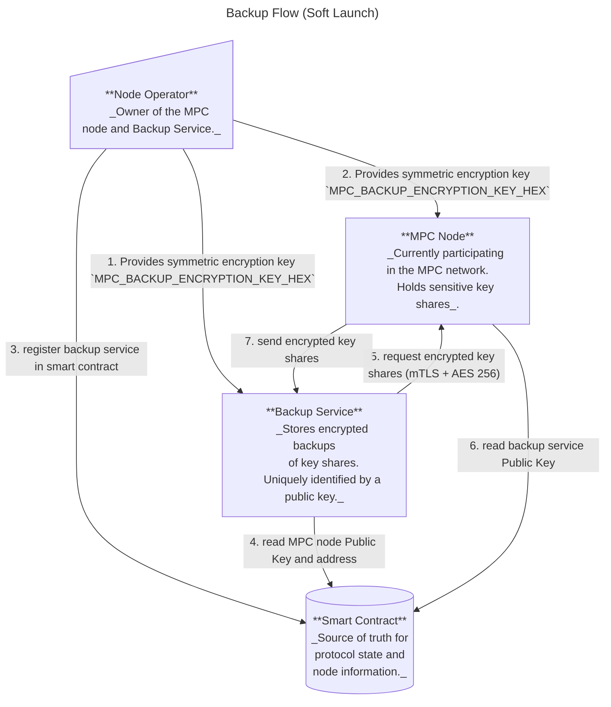
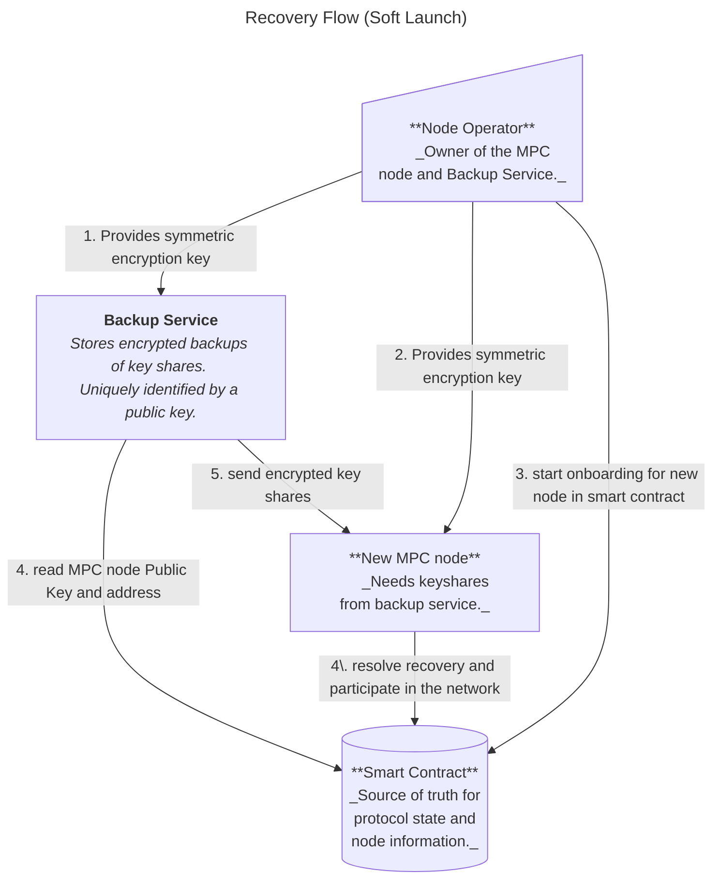

# Backup and Migration Service

## Overview

Near One is currently in the process of migrating the MPC nodes into **Trusted Execution Environment (TEEs)** (c.f. [TEE doc](./securing_mpc_with_tee_design_doc.md) for an introduction to TEEs and their benefits).

Running MPC nodes inside TEEs significantly increases the security of the network, but poses additional operational challenges:

- **Node migrations become more difficult:** Once an MPC node operates inside a TEE, extracting or transferring its secret key shares is infeasible. Migrating a node would normally require a full resharing, involving the entire MPC network.  
- **Recovery from catastrophic failures is harder:** If multiple MPC nodes fails irrecoverably and simultaneously, the network risks losing its signing quorum, which could halt protocol operations.

This document outlines the design and implementation of a **Migration Service**, a service aimed at addressing those issues by solving the above problems:

1. **Operational resilience** — the migration service enables secure recovery of nodes in the event of hardware or system failure.  
2. **Node migration** — the migration service allows node operators to move their MPC nodes into or between TEEs without resharing.

Near-One will roll-out its TEE implementation in two phases:
- **Soft Launch:**
    - Some MPC nodes are running within TEEs.
    - Their key shares are backed-up outside of the TEE through the migration service.
    - The MPC contract does not formally enforce nodes to run inside a TEE.
    - The migration service is used to move nodes into TEEs.
- **Hard Launch:** 
    - All MPC nodes are running within TEEs.
    - Their key shares are backed-up inside another TEE through the Migration Service.
    - The MPC contract kicks out any nodes that are not running inside a TEE.
    - The migration service is used to move nodes between different TEEs (if required).

## Migration Service Design

### System Components

The Migration Service enables secure backup and recovery of MPC node key shares. It involves four main components:
- **MPC Node**
  Runs the Multi-Party Computation protocol and holds the node’s secret key shares.  
- **Node Operator** 
  A person or entity responsible for an MPC node.
- **Backup Service**
  A separate process, running on a different machine than the MPC node. The backup service stores the encrypted key shares from the MPC node.
  During the *soft launch*, this service is implemented as a simple CLI and manually triggered by the node operator.
  For the *hard launch*, it will be a long-running program inside its own TEE, maintain an up-to-date view of the on-chain MPC contract and handle back-up and recovery processes in an automated manner. Each node operator must run their own back-up service.
- **MPC Smart Contract**
  Serves as the source of truth for protocol state and node information.  
  It stores metadata about registered backup services and information about node migrations.

Communication between the backup service and the MPC node takes place over **mutual TLS**. The MPC smart-contract, (i.e. the NEAR blockchain) is used as a public key infrastructure, that is, the MPC node and the backup service fetch the expected public key from the smart contract and authenticate their peer against the expected value.
To protect against spoofing attacks, sensitive data is additonally encrypted via AES 256 (the symmetric key is passed to the backup-service and MPC node by the node operator).

### Workflows

On a high-level, the migration service allows two workflows:
- _Back-up_: securely back-up and store their secret shares in an external environment;
- _Recovery/Migration_: securely request the backed-up secret shares from the external environment and import them into a new node.

Note that the migration service does not enable a _"Recovery"_ of the _entire_
node, but only of the secret shares. The MPC node generates a few secrets that would still be unrecoverable, since no back-up exists (such as TLS keys or access keys for NEAR accounts). As such, _Recovery_ is just a special case of _Migration_, where the target host machine stays the same. TLS Key and access key of the node are still expected to change.

The workflows outlined below represent the current state of the network (soft launch). We are currently working on enabling the hard-launch, c.f. [migration servcie tee implementation](docs/migration-service-tee-implementation).

#### Backup 

1. The node operator calls the contract method `register_backup_service()` to register the backup service's public key in the smart contract. The node, running a NEAR client, has access to this information and uses it for the authentication in the following step.
2. The node operator manually runs `backup-cli get-keyshares` with the MPC node's URL, public key and the symmetric AES-256 key (matching `MPC_BACKUP_ENCRYPTION_KEY_HEX` below) as input. This triggers the following:
    1. The `backup-cli` and MPC node establish a mutually authenticated TLS connection using their P2P keys.
    2. The `backup-cli` requests the keyshares from the MPC node's `GET /get_keyshares` endpoint
    3. The MPC node returns the AES-256 encrypted keyshares. The MPC node uses the node-operator provided symmetric key `MPC_BACKUP_ENCRYPTION_KEY_HEX` for encryption.
    4. The `backup-cli` saves the encrypted keyshares to local storage

> **Note**: The operator must manually trigger the backup using the `backup-cli` tool. There is no automatic periodic backup.




#### Recovery/Migration


1. The node operator calls `start_node_migration()` with the new node's `ParticipantInfo` in the smart contract
2. The node operator manually runs `backup-cli put-keyshares` with the MPC node's URL, public key and the symmetric AES-256 key (matching `MPC_BACKUP_ENCRYPTION_KEY_HEX` below) as input. This triggers the following:
    - The `backup-cli` and MPC node establish a mutually authenticated TLS connection using their P2P keys.
    - The `backup-cli` submits the AES-256 encrypted keyshares over the TLS connection to the nodes `PUT /set_keyshares` endpoint.
    - The node decrypts the received encrypted keyshares using the symmetric key (`MPC_BACKUP_ENCRYPTION_KEY_HEX`)
    - The new node calls `conclude_node_migration(keyset)` to finalize the migration

> **Note**: The operator must manually trigger the keyshare transfer using the `backup-cli` tool. There is no automatic contract monitoring.




### Operational Details and Constraints

For security reasons and to avoid edge cases and race conditions, the MPC network allows migration of nodes only while the protocol is in a `Running` state (as opposed to `Resharing` or `Initializing`, which are the two other well-defined states).

Note that starting a migration workflow does not require a signing quorum. Instead, each participant can migrate their node at their own discretion. However, to avoid making the migration process a DoS attack vector, protocol state changes must have priority over any ongoing migrations.
If the protocol state changes into a `Resharing` or `Initializing` state, any ongoing migration processes will simply be cancelled.

## Implementation Details

### Contract

The following structs are stored in the contract and related to the migration service:

```rust
/// Manages backup service registration and ongoing node migrations
pub struct NodeMigrations {
    /// Maps AccountId to backup service info (public key for TLS authentication)
    backup_services_info: IterableMap<AccountId, BackupServiceInfo>,

    /// Maps AccountId to destination node info for in-progress migrations
    ongoing_migrations: IterableMap<AccountId, DestinationNodeInfo>,
}

/// Backup service authentication information
pub struct BackupServiceInfo {
    /// Ed25519 public key for mutual TLS authentication
    pub public_key: Ed25519PublicKey,
}

/// Destination node information during migration
pub struct DestinationNodeInfo {
    /// NEAR account public key (for verifying contract transaction signatures)
    pub signer_account_pk: near_sdk::PublicKey,

    /// New node's participant info (TLS key, cipher key, URL, etc.)
    pub destination_node_info: ParticipantInfo,
}
```


#### Migration Methods

The contract provides the following methods:

- **`start_node_migration(destination_node_info: ParticipantInfo)`** - Initiates a node migration:
    - Called by the node operator
    - Creates an `OngoingNodeMigration` record for the given `AccountId`
    - Stores the destination node's `ParticipantInfo` (new TLS keys, etc.)
    - Can be called multiple times to update the destination node info (only the last value is retained)
    - Returns an error if the protocol is not in `Running` state
    - Returns an error if caller is not a current participant

- **`cancel_node_migration()`** - Cancels an ongoing node migration:
    - Called by the node operator
    - Removes the `OngoingNodeMigration` record for the given `AccountId`
    - Useful if the new node is not functioning correctly or wrong information was provided

- **`conclude_node_migration(keyset: &Keyset)`** - Finalizes a node migration:
    - Called by the new node after receiving keyshares from backup service
    - Verifies the provided `keyset` matches the expected key event IDs for this epoch
    - Replaces the old node's `ParticipantInfo` with the new node's info in the current participant set
    - Removes the `OngoingNodeMigration` record
    - Returns an error if the protocol is not in `Running` state
    - Returns an error if no ongoing migration exists for the caller

- **`register_backup_service(backup_service_info: BackupServiceInfo)`** - Registers or updates backup service:
    - Called by the node operator
    - Stores the backup service's public key and URL for the node operator's account
    - Defines or overrides the `BackupServiceInfo` for the node operator
    - Can be called in any protocol state (`Running`, `Initializing`, or `Resharing`)
    - Returns an error if caller is not a current participant


#### Migration Related Behavior

- The `OngoingNodeMigration` records are automatically cleared when the protocol transitions from `Running` state to `Resharing` or `Initializing` state, effectively cancelling any in-progress migrations.
- **Future Enhancement**: It may be desirable for the contract to verify that calls to `conclude_node_migration(keyset)` come from the actual onboarding node by checking the transaction signer's public key _(see [(#1086)](https://github.com/near/mpc/issues/1086))_. This would prevent ill-behaved decommissioned nodes from making spurious migration calls. This would require:
    - Comparing `env::signer_account_pk()` with the public key associated with the participant (note: this is different from the TLS key currently stored as [`signer_pk`](https://github.com/near/mpc/blob/b5a9d1b2eef4de47d19b66cb25b577da2b897560/crates/contract/src/tee/tee_state.rs#L32) in TEEState)
    - Including this public key in the TEE attestation


