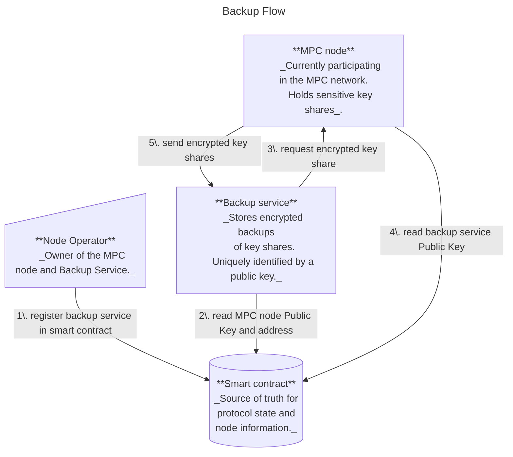
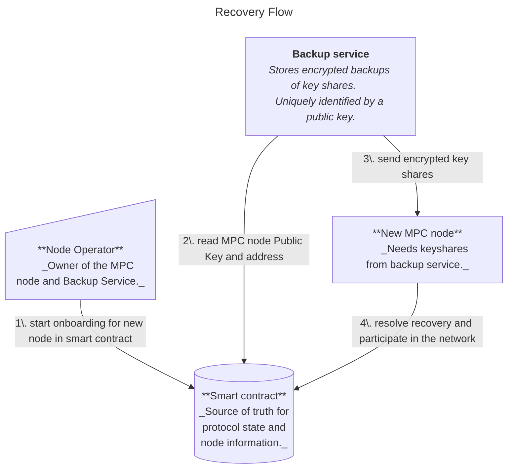

# Migration Service

## Overview
A **t**rusted **e**xecution **e**nvironment (TEE) is an environment isolated from the operating system. A TEE provides security guarantees about confidentiality and integrity of the code and memory executed inside it.

The security guarantees provided by TEEs are attractive to the MPC network for two reasons:
1. They help enforce backward secrecy. Since TEEs can guarantee that former nodes never gain lasting possession of plain text secret-shares, collusion attacks after departure become infeasible.
2. They allow to relax the threat models (e.g. honest-but-curious instead of malicious adversaries). This allows the adoption of significantly more efficient MPC protocols.

TEEs provide their security guarantees by restricting how anything outside of the TEE can interact with the code running inside the TEE. This is great to protect against malicious actors, but it also restricts the honest actors. It has to be expected that debugging and handling of emergencies will become much more difficult compared to running an MPC node outside of a TEE.

In the context of threshold cryptography, this poses the risk of losing the "signing quorum". If too few nodes remain operational, the protocol grinds to halt, in which case, no funds can be moved.

Therefore, Near-One will roll-out its TEE implementation in two phases:
- Soft Launch: All mainnet nodes are running within TEEs. Their key shares are backed-up outside of the TEE.
- Hard Launch: All mainnet nodes are running within TEEs. Their key shares are backed-up inside a different TEE.

As long as the secret shares of the MPC nodes are securely backed-up outside of the TEE's in which the nodes are running, it is highly likely that the network will be able to recover from otherwise catastrophic failures. 

Besides the existential risk, TEE's make it (without additional precautions) impossible for node operators to migrate their node to a different machine without entering a resharing procedure, which requires the explicit approval of all MPC participants.

Having keyshare backups outside of the TEE environment allows node operators not only to recover from a catastrophic event, but also to migrate their nodes to new machines without going through a reshring process. In fact, disaster recovery is just a special case of the more general migration use case.

## Migration of an MPC Node
Migrating a node requires a procedure that allows an MPC node to:
- _Back-up_: securely back-up and store their secret shares in an external environment;
- _Recover_: securely request the backup from the external environment and join the MPC network.

To allow migration, a node operator will need to run a **backup service**. This service is separate from the MPC node and should run on a different machine. Its responsiblities are:
- to request an encrypted copy of the secret keys from the MPC node belonging to this node operator;
- securely store the secret keys;
- provide the secret keys to a newly set-up node.

For the soft launch, the node operator (assisted by a script) can act as the backup service. For the hard launch, the backup service must run in its own TEE environment and it must have a current view of the MPC smart contract on the NEAR blockchain.

For security reasons and to avoid edge cases and race conditions, the MPC network allows migration of nodes only while the protocol is in a `Running` state (as opposed to `Resharing` or `Initializing`, which are the two other well-defined states).

Note that starting a migration does not require a signing quorum. Instead, each participant can migrate their node at their own discretion. But, to avoid making the migration process a DOS attack vector, protocol state changes must have priority over any ongoing migrations.
If the protocol state changes into a `Resharing` or `Initializing` state, any ongoing Migration processes will simply be cancelled.

### Backup Flow
The node provides an HTTP `GET` endpoint on which requests for the encrypted keyshares can be submitted. 
The node fetches the public key associated to the backup service from the MPC contract and uses it to derive a symmetric key, with which it will encrypt the shares (c.f. [cryptography](#cryptography) for more details on the encryption).
The backup service requests the encrypted keyshares on the web endpoint. The request includes an authentication header.



### Recovery Flow
The node provides an HTTP `PUT` endpoint on which the encrypted keyshares can be sent.
The backup service monitors the smart contract for any onboarding events and uses the public key stored in the smart contract to derive a shared secret, used to encrypt the keys (c.f. [cryptography](#cryptography) for more details on the encryption).
The backup service submits the encrypted keys via the nodes HTTP endpoint.



### Implementation Details

#### Node 
##### Node behavior
A node must only participate in the MPC protocol, if it is in the set of active participants of the current running or resharing epoch. For this, the TLS key of a node acts as a unique identifier _(implemented in [(#1032)](https://github.com/near/mpc/pull/1032/files#diff-c54adafe6cebf73c37af97ce573a28c60593be635aa568ec93e912b8f286aa83R181))_.

Currently, due to limitations of our implementation, nodes need to drop and re-establish all connections in case of a change in the participant set. Before adding the migration feature, this was only possible if the epoch id changed, which happened only during a protocol state change.
Now, nodes need to be able to recognize and re-establish a connection if the participant set changes without an epoch incrementing _(implemented in [(#1061)](https://github.com/near/mpc/pull/1061) and [(#1032)](https://github.com/near/mpc/pull/1032/))_.

Additionally, nodes need to remove any triples and pre-signatures involving the node that was removed from the participant set in the migration process _(implemented in [(#1032)](https://github.com/near/mpc/pull/1032/))_

##### Web Endpoints
The **MPC node** will expose a web endpoint over which the backup service can submit requests. These endpoints require some sort of authentication using the published public keys _(todo: [(#1088)](https://github.com/near/mpc/issues/1088))_.
The exposed endpoints are:
- GET /shares_backup - with an authentication header
    - Returns the encrypted shares, if a valid backup service is registered.
- POST /shares_recover
    - Posts encrypted shares to a new node.

#### Contract
The contract needs to store information related to the recovery process, namely:
- any information related to the backup service
- any ongoing recovery processes

Below is a draft for the structs to add (c.f. _([(#1083)](https://github.com/near/mpc/issues/1083))_:

```Rust
struct Recovery {
    backup_services: IterableMap<AccountId, BackupService>,
    recoveries: IterableMap<AccountId, RecoveringNode>,
}

struct BackupService {
    public_key: PublicKey,
}

struct RecoveringNode {
    epoch_id: EpochId,
    prospective_participant_info: ParticipantInfo,
}
```

Additionally, the contract must allow the same node operator (`AccountId`) to store multiple TEE attestations. Instead of using `AccountId` as a unique identifier in [`TEEState`](https://github.com/near/mpc/blob/b5a9d1b2eef4de47d19b66cb25b577da2b897560/crates/contract/src/tee/tee_state.rs#L32), Attestations shall be stored with respect to the TLS key _(c.f. [(#1084)](https://github.com/near/mpc/issues/1084))_.

##### Migration Methods
The contract also needs to proved the following methods:
- `swap_node(participant_info: ParticipantInfo)`. This method:
    - is called by the node operator
    - generates a `RecoveringNode` for the given `AccountId`.
    - returns an error if the protocol is not in `Running` state.
- `conclude_recovery(public_keys: Vec<(KeyEventId, PublicKey)>)`. This method:
    - is called by the new node after it received the keyshares from the backup service.
    - concludes the recovery process in case it still exists, replacing the `ParticipantInfo` associated to `AccountId` in the current participant set with the information stored in the corresponding `RecoveringNode`.
    - returns an error if the protocol is not in `Running` state.
- `set_backup_service(backup_service: BackupService)`. This method:
    - is called by the node operator
    - defines or overrides the BackupService for the node operator.


##### Migration Related Behavior
- The map `Recovery::recoveries` needs to be emptied upon concluding a `Running` state and entering a `Resharing` or `Initialization` state
- It may be desirable if the Contract verified that the calls to `conclude_recovery` are actually coming from the onboarding node. It might actually be desirable that the contract verified for all calls stemming from a node, that are signed by the correct public key. That is, to avoid mistaking any calls from ill-behaved decomissioned nodes as valid instructions _(c.f. [(#1086)](https://github.com/near/mpc/issues/1086))_. For this:
    - the contract would need to compare the `env::signer_account_pk()` with the public key associated to the nodee (note: this is a different key to the TLS Key. The TLS key is already stored in the contract under the name [`signer_pk`](https://github.com/near/mpc/blob/b5a9d1b2eef4de47d19b66cb25b577da2b897560/crates/contract/src/primitives/participants.rs#L14)) _(tangent: the team is aware the chosen name is not ideal and eager to change it when opportun)_)
    - the public key used by the node would need to be part of the `ParticipantInfo` struct
    - we would probably also want that public key to be part of the TEE attestation.


#### Backup Service
For the soft launch, the node operator and a few scripts will act as the backup-service. For the hard-launch, the backup service will be a standalone application running inside a separate TEE from the MPC node. A detailed design of the hard launch backup service is currently out of the scope of this document.

#### Node Operator
- needs to add backup service information
- needs to submit `ParticipantInfo` for new (recovering) node
- needs to act as the backup service before soft launch (there will be scripts or binaries to support).


#### Cryptography
A pair-wise key establishment scheme can be leveraged to establish a symmetric key. A suitable implementation can be found in [libsodium](https://doc.libsodium.org/) and its rust wrapper [libsodium-rs](https://docs.rs/crate/libsodium-rs/latest). Specifically, the **key exchange protocol based on X25519** would be a good fit for the given set-up (c.f. [libsodium](https://doc.libsodium.org/key_exchange) and [libsodium-rs](https://docs.rs/libsodium-rs/latest/libsodium_rs/crypto_kx/index.html)).

The key establishment scheme requires that the node as well as the backup service have *mutually authenticated Curve25519 public keys*. The NEAR blockchain can be leveraged for this, more specifically, for each backup generation or recovery, the node and the backup service generate ephemeral keys on the `Curve25519` and publish them on the MPC smart contract. The node and the backup service can then each run a key generation protocol using their private key and the public key of the other party. 

_Note: The curious reader might ask why this protocol does not simply use the NEAR public/private key pairs associated to the MPC node and the backup service. The reason for this is is twofold:_
- _those keys are meant for signature generation._
- _While it is true that Curve25519 used in X25519 and edwards25519 used by the NEAR blockchain are [birationally equivalent](https://crypto.stackexchange.com/questions/43013/what-does-birational-equivalence-mean-in-a-cryptographic-context), so one could theoretically convert the NEAR account keys and use them for `X25519`, it is generally advised to use one key per application. This also allows us to use ephemeral keys, as opposed to static keys for the encryption. Which is desirable._


#### Todo
c.f. [(#949)](https://github.com/near/mpc/issues/949)
- it is advised that the node operator grants access only to specific contract methods for the backup service and the node: [(#946)](https://github.com/near/mpc/issues/946)
- define attestation for backup service [(#947)](https://github.com/near/mpc/issues/947)

## Materials:
https://nearone.slack.com/archives/C07UW93JVQ8/p1753830474083739
NIST SP 800-56A https://csrc.nist.gov/pubs/sp/800/56/a/r3/final
https://nvlpubs.nist.gov/nistpubs/SpecialPublications/NIST.SP.800-56Ar3.pdf - page 105 - 106

