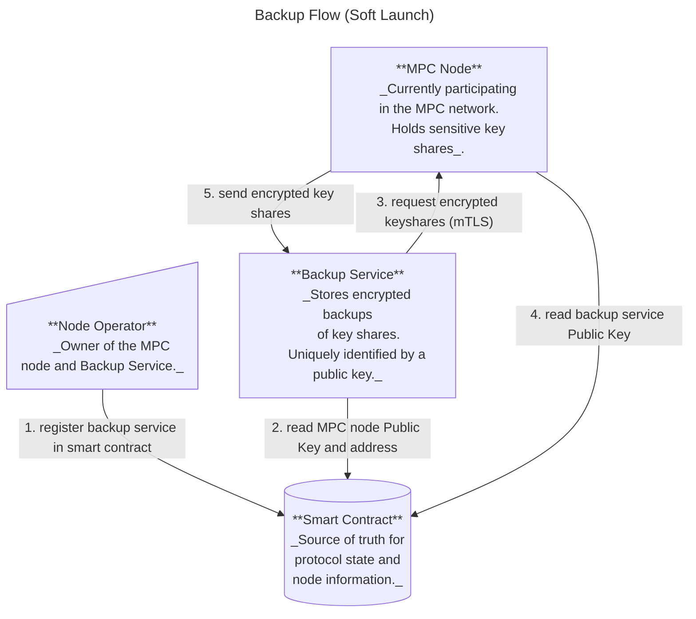
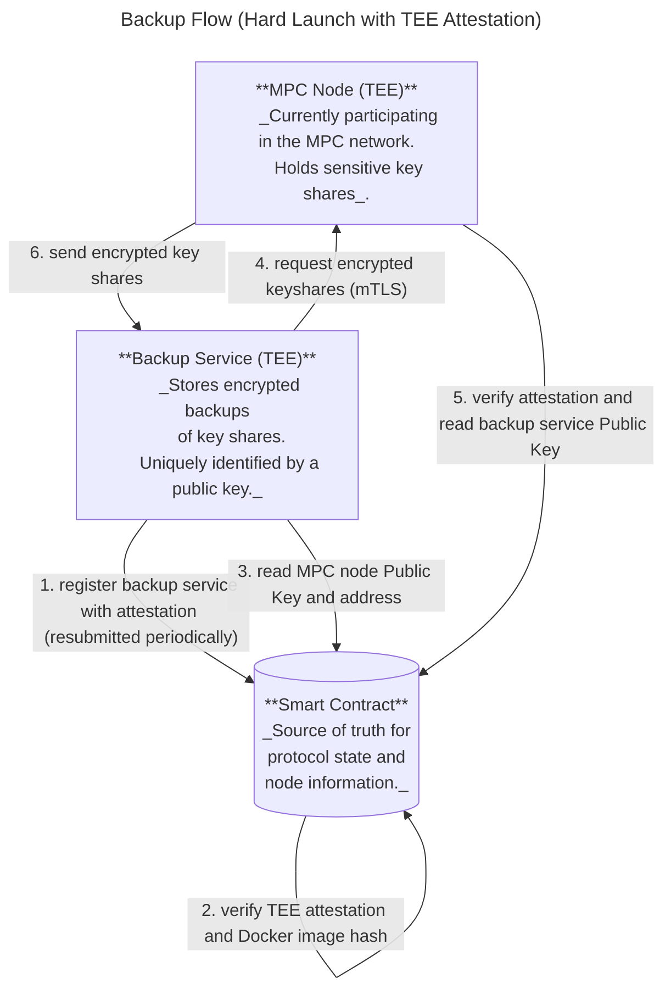
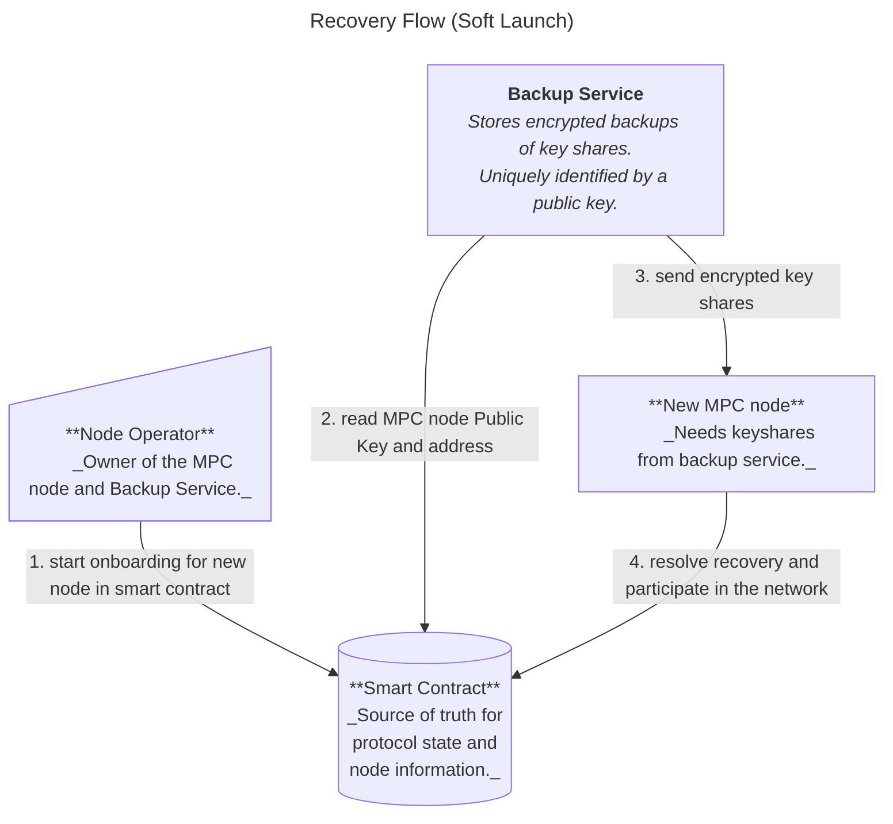

# Migration Service

## Overview

Near One is currently in the process of migrating the MPC nodes into a **Trusted Execution Environment (TEEs)** (c.f. [TEE doc](docs/securing_mpc_with_tee_design_doc.md) for an introduction to TEEs and their benefits).

Running MPC nodes inside TEEs significantly increases the security of the network, but poses additional operational challenges:

- **Node migrations become more difficult:** Once an MPC node operates inside a TEE, extracting or transferring its secret key shares is infeasible. Migrating a node would normally require a full resharing, involving the entire MPC network.  
- **Recovery from catastrophic failures is harder:** If multiple MPC nodes fails irrecoverably and simultaneusly, the network risks losing its signing quorum, which could halt protocol operations.

This document outlines the design and implementation of a **Migration Service**, a service aimed at addressing those issues by solving above problems:

1. **Operational resilience** — the migration service enables secure recovery of nodes in the event of hardware or system failure.  
2. **Node migration** — the migration service allows node operators to move their MPC nodes into or between TEEs without resharing.

Near-One will roll-out its TEE implementation in two phases:
- **Soft Launch:**
    - Some MPC nodes are running within TEEs.
    - Their key shares are backed-up outside of the TEE through the Migration Service.
    - The MPC contract does not formally enforce nodes to run inside a TEE.
    - The migration service is used to move nodes into TEEs.
- **Hard Launch:** 
    - All MPC nodes are running within TEEs.
    - Their key shares are backed-up inside another TEE through the Migration Service.
    - The MPC contract kicks out any nodes that are not running inside a TEE.
    - The migration service is used to move nodes between different TEEs (if required).


## Soft Launch vs Hard Launch Comparison

The migration service design supports both deployment phases with different security properties:

**Soft Launch** is the initial deployment phase where the backup service runs as the [`backup-cli`][backup-cli] binary outside the TEE, relying on the node operator's operational security. This allows for easier debugging and operational flexibility during the early stages.

**Hard Launch** is the future production deployment phase where the backup service runs as a long-running process inside its own TEE. The backup service must prove its correct execution through attestations verified by the smart contract, eliminating the need to trust the node operator's security practices.

| Aspect | Soft Launch (Current) | Hard Launch (Planned) |
|--------|-------------|-------------|
| **Backup Service** | Manual scripts ([`backup-cli`][backup-cli]) | Long-running TEE process |
| **Backup Storage** | Encrypted keyshares saved to disk | Encrypted keyshares kept in enclave's RAM only |
| **Trust Model** | Node operator trusted | Attestation-verified TEE |
| **Transport Encryption** | Mutual TLS (ephemeral keys via ECDHE) | Mutual TLS (ephemeral keys via ECDHE) |
| **Application Encryption** | AES-256-GCM with static pre-shared key (`MPC_BACKUP_ENCRYPTION_KEY_HEX` env var) | AES-256-GCM with static pre-shared key (`MPC_BACKUP_ENCRYPTION_KEY_HEX` env var) |
| **Attestation** | Not required | Required and verified by contract |
| **Docker Image Verification** | No | Yes (via contract) |
| **Automation** | Manual intervention required | Fully automated monitoring |
| **Service Deployment** | Scripts run by operator | Dedicated automated TEE instance |
| **Security Guarantees** | Operational security | Cryptographic and TEE guarantees |

[backup-cli]: https://github.com/near/mpc/tree/main/crates/backup-cli

## Migration of an MPC Node
Migrating a node requires a procedure that allows an MPC node to:
- _Back-up_: securely back-up and store their secret shares in an external environment;
- _Recover_: securely request the backup from the external environment and join the MPC network.

To allow migration, a node operator will need to run a **backup service**. This service is separate from the MPC node and should run on a different machine. Its responsibilities are:
- to request an encrypted copy of the secret keys from the MPC node belonging to this node operator via an mTLS channel;
- to securely store the secret keys: on disk outside of the TEE for soft launch, and in a TEE's memory for hard launch;
- to provide the secret keys to a newly set up node via an encrypted mTLS channel.

For the soft launch, the node operator (assisted by a [`backup-cli`][backup-cli] script) can act as the backup service. For the hard launch, the backup service must run in its own TEE environment and must have a current view of the MPC smart contract on the NEAR blockchain.

For security reasons and to avoid edge cases and race conditions, the MPC network allows migration of nodes only while the protocol is in a `Running` state (as opposed to `Resharing` or `Initializing`, which are the two other well-defined states).

Note that starting a migration does not require a signing quorum. Instead, each participant can migrate their node at their own discretion. However, to avoid making the migration process a DoS attack vector, protocol state changes must have priority over any ongoing migrations.
If the protocol state changes into a `Resharing` or `Initializing` state, any ongoing migration processes will simply be cancelled.

### Backup Flow

#### Soft Launch

The MPC node provides an HTTP `GET /get_keyshares` endpoint for retrieving encrypted keyshares.

When the node operator needs to back up keyshares:
1. The node operator calls `register_backup_service()` to register the backup service's public key in the smart contract
2. The node operator manually runs `backup-cli get-keyshares` with the MPC node's URL and public key
3. The `backup-cli` and MPC node establish a mutually authenticated TLS connection using their P2P keys (the TLS handshake derives ephemeral symmetric keys for transport encryption)
4. The MPC node verifies the backup service's public key is registered in the contract
5. The `backup-cli` requests the keyshares from the MPC node's `GET /get_keyshares` endpoint
6. The MPC node returns the keyshares, which are encrypted at the application layer using a pre-shared static symmetric key `MPC_BACKUP_ENCRYPTION_KEY_HEX`
7. The `backup-cli` saves the encrypted keyshares to local storage

> **Note**: For soft launch, the operator must manually trigger the backup using the `backup-cli` tool. There is no automatic periodic backup.

**Defense in Depth**: The additional application-layer encryption provides protection in case either the MPC node or backup service has an incorrect view of the blockchain state. Since both components fetch their communication partner's information from the smart contract, a compromised or out-of-sync nearcore node could potentially cause the MPC node to connect to a malicious backup service (or vice versa). With application-layer encryption, an attacker would only obtain encrypted keyshares rather than plaintext secrets, providing an extra layer of security beyond the TLS transport encryption _(implemented in [#1376](https://github.com/near/mpc/pull/1376), addressing [#1368](https://github.com/near/mpc/issues/1368))_.



#### Hard Launch

For hard launch, the backup flow is the same as soft launch but with additional TEE attestation verification steps. The backup service must prove it's running approved code in a TEE, and the MPC node verifies this attestation before sharing keyshares:



### Recovery Flow

#### Soft Launch

The MPC node provides an HTTP `PUT /set_keyshares` endpoint to receive encrypted keyshares.

When the node operator needs to recover a node:
1. The node operator calls `start_node_migration()` with the new node's `ParticipantInfo` in the smart contract
2. The node operator manually runs `backup-cli put-keyshares` with the new node's URL and public key
3. The `backup-cli` establishes a mutually authenticated TLS connection with the new node using their P2P keys (the TLS handshake derives ephemeral symmetric keys for transport encryption)
4. The `backup-cli` sends the keyshares over the TLS connection. The keyshares are encrypted at the application layer with the static pre-shared key `MPC_BACKUP_ENCRYPTION_KEY_HEX`
5. The new node receives the doubly-encrypted keyshares (TLS + application layer), decrypts them, and imports them into local storage
6. The new node calls `conclude_node_migration()` to finalize the migration

> **Note**: For soft launch, the operator must manually trigger the keyshare transfer using the `backup-cli` tool. There is no automatic contract monitoring.



#### Hard Launch

For the hard launch, the recovery flow is the same as in the soft launch, but more automated: the backup service monitors the contract state and initiates migrations automatically (e.g., by calling `conclude_node_migration`). The operator only needs to initiate the process by calling `start_node_migration`.

There’s also an additional TEE-attestation step: the new node must verify the backup service’s attestation before saving the received keyshares, and the contract must verify the backup service’s attestation before handing over the public key and address of the new MPC node.


### Implementation Details

#### Node

##### Node behavior

A node must only participate in the MPC protocol if it is in the set of active participants of the current running or resharing epoch. For this, the TLS key of a node acts as a unique identifier _(implemented in [(#1032)](https://github.com/near/mpc/pull/1032/files#diff-c54adafe6cebf73c37af97ce573a28c60593be635aa568ec93e912b8f286aa83R181))_.

Currently, due to limitations of our implementation, nodes need to drop and re-establish all connections in case of a change in the participant set. Before adding the migration feature, this was only possible if the epoch id changed, which happened only during a protocol state change.
Now, nodes need to be able to recognize and re-establish a connection if the participant set changes without an epoch incrementing _(implemented in [(#1061)](https://github.com/near/mpc/pull/1061) and [(#1032)](https://github.com/near/mpc/pull/1032/))_.

Additionally, nodes need to remove any triples and pre-signatures involving the node that was removed from the participant set in the migration process _(implemented in [(#1032)](https://github.com/near/mpc/pull/1032/))_.

##### Web Endpoints

The **MPC node** exposes web endpoints over which the backup service can submit requests. These endpoints require mutual TLS authentication using the published P2P keys.

The exposed endpoints are:
- **GET /get_keyshares** - Returns the encrypted keyshares if a valid backup service is registered in the contract.
- **PUT /set_keyshares** - Accepts encrypted keyshares from the backup service to restore a recovering node.

#### Contract

The contract stores migration-related information in the `NodeMigrations` struct:

```rust
/// Manages backup service registration and ongoing node migrations
pub struct NodeMigrations {
    /// Maps AccountId to backup service info (public key for TLS authentication)
    backup_services_info: IterableMap<AccountId, BackupServiceInfo>,

    /// Maps AccountId to destination node info for in-progress migrations
    ongoing_migrations: IterableMap<AccountId, DestinationNodeInfo>,
}

/// Backup service authentication information
pub struct BackupServiceInfo {
    /// Ed25519 public key for mutual TLS authentication
    pub public_key: Ed25519PublicKey,
}

/// Destination node information during migration
pub struct DestinationNodeInfo {
    /// NEAR account public key (for verifying contract transaction signatures)
    pub signer_account_pk: near_sdk::PublicKey,

    /// New node's participant info (TLS key, cipher key, URL, etc.)
    pub destination_node_info: ParticipantInfo,
}
```

> **Hard Launch Extension (Planned):** `BackupServiceInfo` will be extended with `attestation: Option<Attestation>` and `registered_at: Timestamp` fields for TEE attestation verification and expiration tracking.

**Hard Launch Extensions:**

For hard launch, the backup service must provide TEE attestation similar to MPC nodes. The contract will need to be extended to support attestation verification for backup services.

**Planned Implementation Approach:**

The backup service identification remains the same as soft launch: `AccountId` maps to `BackupServiceInfo`. For hard launch, the `BackupServiceInfo` struct would be extended to include attestation:

```Rust
/// Backup service authentication information (PLANNED extension for hard launch)
pub struct BackupServiceInfo {
    /// Ed25519 public key for mutual TLS authentication
    pub public_key: Ed25519PublicKey,
    
    /// TEE attestation proving backup service runs approved code (hard launch only)
    pub attestation: Option<Attestation>,
    
    /// Timestamp when backup service registered (for attestation expiration tracking)
    pub registered_at: Option<Timestamp>,
}
```

The backup service attestation verification would follow the same process as MPC node attestations:
1. Backup service generates TLS keypair inside TEE
2. Creates `ReportData` V1: `[version(2 bytes) || SHA3-384(tls_public_key) || padding]`
   - Note: Unlike MPC nodes, backup services don't include an `account_public_key` since they don't sign transactions
3. Obtains TEE quote embedding the `ReportData`
4. Submits attestation via `register_backup_service(public_key, attestation)`
5. Contract verifies:
   - Quote validity via attestation provider
   - Docker image hash against allowed list
   - Launcher compose hash (if applicable)
   - Timestamp within deadline
   - `ReportData` matches SHA3-384 hash of the submitted `tls_public_key`
6. Contract stores attestation in `backup_services_info[AccountId].attestation`

> **Note**: Unlike MPC nodes which may need multiple attestations per operator, backup services use a simpler one-per-operator model. The `AccountId` remains the unique identifier, consistent with soft launch.

##### Migration Methods

The contract provides the following methods:

- **`start_node_migration(destination_node_info: ParticipantInfo)`** - Initiates a node migration:
    - Called by the node operator
    - Creates an `OngoingNodeMigration` record for the given `AccountId`
    - Stores the destination node's `ParticipantInfo` (new TLS keys, etc.)
    - Returns an error if the protocol is not in `Running` state
    - Returns an error if caller is not a current participant

- **`conclude_node_migration(keyset: &Keyset)`** - Finalizes a node migration:
    - Called by the new node after receiving keyshares from backup service
    - Verifies the provided `keyset` matches the expected key event IDs for this epoch
    - Replaces the old node's `ParticipantInfo` with the new node's info in the current participant set
    - Removes the `OngoingNodeMigration` record
    - Returns an error if the protocol is not in `Running` state
    - Returns an error if no ongoing migration exists for the caller

- **`register_backup_service(backup_service_info: BackupServiceInfo)`** - Registers or updates backup service:
    - Called by the node operator
    - Stores the backup service's public key and URL for the node operator's account
    - Defines or overrides the `BackupServiceInfo` for the node operator
    - Can be called in any protocol state (`Running`, `Initializing`, or `Resharing`)
    - Returns an error if caller is not a current participant

> **Hard Launch Extension (Planned):** For hard launch, `register_backup_service()` will require an `attestation` parameter and perform TEE verification similar to MPC nodes. The contract will verify the attestation validity, Docker image hash, and store the attestation before allowing backup operations. Backup services will need to refresh attestations before expiration.

##### Migration Related Behavior

- The `OngoingNodeMigration` records are automatically cleared when the protocol transitions from `Running` state to `Resharing` or `Initializing` state, effectively cancelling any in-progress migrations.
- **Future Enhancement**: It may be desirable for the contract to verify that calls to `conclude_node_migration()` come from the actual onboarding node by checking the transaction signer's public key _(see [(#1086)](https://github.com/near/mpc/issues/1086))_. This would prevent ill-behaved decommissioned nodes from making spurious migration calls. This would require:
    - Comparing `env::signer_account_pk()` with the public key associated with the participant (note: this is different from the TLS key currently stored as [`signer_pk`](https://github.com/near/mpc/blob/b5a9d1b2eef4de47d19b66cb25b577da2b897560/crates/contract/src/tee/tee_state.rs#L32) in TEEState)
    - Adding this public key to the `ParticipantInfo` struct
    - Including this public key in the TEE attestation


#### Backup Service

##### Soft Launch Implementation

For the soft launch, the node operator and a few scripts (`backup-cli`) will act as the backup service. The operator runs these scripts manually on their own infrastructure.

##### Hard Launch Implementation

For hard launch, the backup service is a standalone long-running application inside its own TEE, physically separate from any MPC node TEE.

**Architecture Requirements:**
1. **TEE Execution**: Runs in TDX.
2. **Attestation Generation**: Generates and refreshes TEE attestations.
3. **Contract Monitoring**: Maintains current view of MPC smart contract state.
4. **Event Processing**: Monitors for migration events (`start_node_migration` calls).
5. **HTTP Server**: Exposes endpoints for health checks and metrics (optional).

**Operational Characteristics:**
- **Always Running**: Unlike the soft-launch scripts, the hard-launch backup service runs 24/7. All backed-up keyshares are kept in memory only (not on disk), so it needs to re-fetch the secret shares after recovering, e.g. after a power loss.
- **Automatic Response**: Detects migration events and initiates keyshare transfer without operator intervention.
- **Attestation Refresh**: Periodically refreshes TEE attestation before expiration.
- **Monitoring**: Provides health status and operation logs for operators.

**Security Properties:**
- **TEE Isolation**: Backup service code and memory protected by hardware.
- **Attestation Proof**: Contract cryptographically verifies correct execution.
- **No Operator Access**: Node operator cannot access decrypted keyshares.
- **Forward Secrecy**: Ephemeral keys ensure past sessions remain secure even if current keys compromised.
- **Docker Image Verification**: Contract ensures only approved backup service code executes.

#### Node Operator

Node operators are responsible for:
1. **Registering Backup Service**: Call `register_backup_service()` to store the backup service's public key in the contract
2. **Initiating Migration**: Call `start_node_migration()` with the new node's `ParticipantInfo` when migrating to new hardware
3. **Running Backup Service** (Soft Launch): Execute `backup-cli` scripts to backup and restore keyshares during migrations
4. **Managing Environment Variables** (Soft Launch): Ensure `MPC_BACKUP_ENCRYPTION_KEY_HEX` is consistently set on both MPC node and backup-cli

> **Hard Launch**: In hard launch, the backup service runs autonomously in a TEE and requires no manual intervention from operators beyond initial registration.


#### Cryptography

**Key Establishment:**

The key establishment scheme requires that the node as well as the backup service have *mutually authenticated Curve25519 public keys*. The NEAR blockchain can be leveraged for this, more specifically, for each backup generation or recovery, the node and the backup service generate ephemeral keys on the `Curve25519` and publish them on the MPC smart contract. The node and the backup service can then each run a key generation protocol using their private key and the public key of the other party. 

_Note: The curious reader might ask why this protocol does not simply use the NEAR public/private key pairs associated to the MPC node and the backup service. The reason for this is is twofold:_
- _those keys are meant for signature generation._
- _While it is true that Curve25519 used in X25519 and edwards25519 used by the NEAR blockchain are [birationally equivalent](https://crypto.stackexchange.com/questions/43013/what-does-birational-equivalence-mean-in-a-cryptographic-context), so one could theoretically convert the NEAR account keys and use them for `X25519`, it is generally advised to use one key per application. This also allows us to use ephemeral keys, as opposed to static keys for the encryption. Which is desirable._

The migration service uses a defense-in-depth encryption approach with two layers:

**Transport Layer (TLS 1.3):**

- **Authentication**: Mutual TLS (mTLS) authenticates both parties using Ed25519 P2P keys registered in the contract
- **Key Exchange**: TLS 1.3 handshake performs Elliptic Curve Diffie-Hellman Ephemeral (ECDHE) key exchange to derive ephemeral session keys
- **Session Encryption**: Negotiated cipher suite
- **Forward Secrecy**: Past sessions remain secure even if long-term Ed25519 keys are compromised (ephemeral keys discarded after session)
- Implemented using `rustls` with TLS 1.3 only ([enforced](https://github.com/near/mpc/blob/9c34614e87280932da9d6cdc3cee8537b6443b7a/crates/tls/src/constants.rs#L11) via `&rustls::version::TLS13`)

**Application Layer:**
- **Encryption**: AES-256-GCM authenticated encryption ([implemented](https://github.com/near/mpc/blob/9c34614e87280932da9d6cdc3cee8537b6443b7a/crates/node/src/migration_service/web/encryption.rs#L10-L34) using `aes_gcm` crate)
- **Key**: Static pre-shared symmetric key (`MPC_BACKUP_ENCRYPTION_KEY_HEX` environment variable, 256-bit hex-encoded)
- **Key Reuse**: Same key used for both backup and recovery operations (no key rotation)
- **Purpose**: Defense-in-depth protection if either party has an incorrect blockchain view (prevents plaintext exposure to wrong peer)

**Why Two Layers?**

The additional application-layer encryption protects against a specific attack scenario: if either the MPC node or backup service has an incorrect/compromised view of the blockchain state, a malicious actor could potentially cause them to connect to a fake peer (by manipulating the contract state they see). With application-layer encryption, even in this scenario, the attacker would only obtain encrypted keyshares rather than plaintext secrets.

This dual-encryption approach provides security even if the TLS layer is correctly established with the wrong peer due to blockchain state manipulation.

#### Todo
See [(#949)](https://github.com/near/mpc/issues/949)
- It is advised that the node operator grants access only to specific contract methods for the backup service and the node: [(#946)](https://github.com/near/mpc/issues/946)

**Hard Launch Implementation Tasks:**
- [ ] Add `attestation` parameter to `register_backup_service()` contract method
- [ ] Implement attestation verification for backup services in contract
- [ ] Store attestation with expiration tracking in contract
- [ ] Add attestation validity check in MPC node before backup/recovery operations
- [ ] Develop backup service as long-running TEE application
- [ ] Implement contract monitoring and event detection in backup service
- [ ] Add backup service attestation refresh mechanism (before expiration)
- [ ] Implement Docker image hash validation for backup services
- [ ] Add automatic cleanup of expired backup service attestations
- [ ] Add comprehensive integration tests for attestation flow
- [ ] Document backup service deployment procedures
- [ ] Create monitoring dashboards for backup service health

## Materials:
https://nearone.slack.com/archives/C07UW93JVQ8/p1753830474083739
NIST SP 800-56A https://csrc.nist.gov/pubs/sp/800/56/a/r3/final
https://nvlpubs.nist.gov/nistpubs/SpecialPublications/NIST.SP.800-56Ar3.pdf - page 105 - 106

