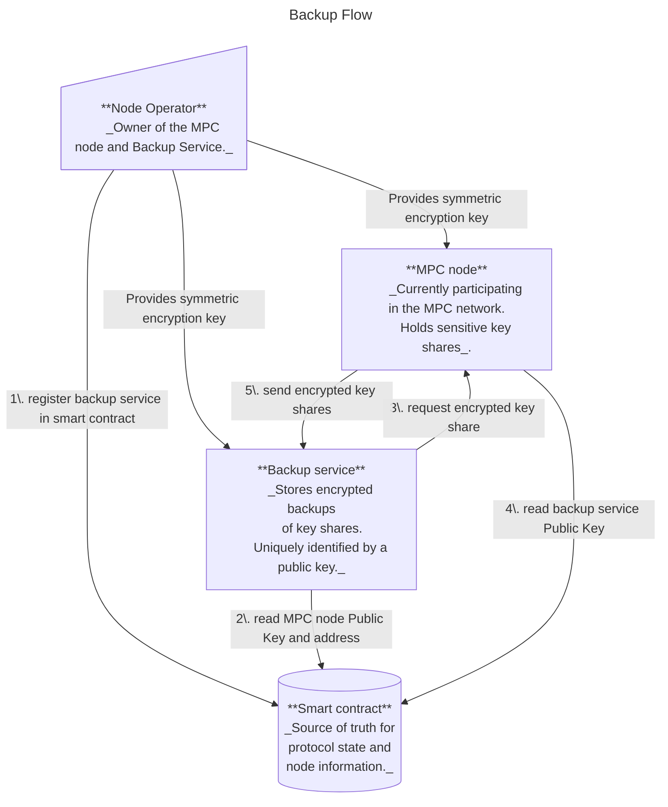
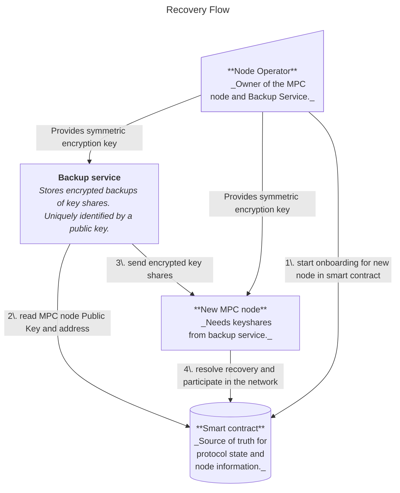

# Migration Service

## Overview
Near One is currently in the process of migrating the MPC nodes into a **Trusted Execution Environment (TEEs)** (c.f. [TEE doc](docs/securing_mpc_with_tee_design_doc.md) for an introduction to TEEs).

Running MPC nodes inside TEEs significantly increases the security of the MPC network by ensuring that sensitive key material cannot be accessed or exfiltrated, even by a compromised host system. 

However, this added protection comes with operational challenges:

- **Node migrations become more difficult:** Once an MPC node operates inside a TEE, extracting or transferring its secret key shares is infeasible. Migrating a node would normally require a full resharing, involving the entire MPC network.  
- **Recovery from catastrophic failures is harder:** If multiple MPC nodes fails irrecoverably and simultaneusly, the network risks losing its signing quorum, which could halt protocol operations.

To address these issues, Near One is developing a **Migration Service**. This service enables secure backup and recovery of MPC node secrets outside of the TEEs in which the MPC notdes are running, allowing nodes to be safely migrated or restored without triggering a resharing process.

Near-One will roll-out its TEE implementation in two phases:
- **Soft Launch:**
    - Some MPC nodes are running within TEEs.
    - Their key shares are backed-up outside of the TEE through the Migration Service.
    - The MPC contract does not formally enforce nodes to run inside a TEE.
    - The migration service is used to move nodes into TEEs.
- **Hard Launch:** 
    - All MPC nodes are running within TEEs.
    - Their key shares are backed-up inside another TEE through the Migration Service.
    - The MPC contract kicks out any nodes that are not running inside a TEE.
    - The migration service is used to move nodes between different TEEs (if required).

The Migration Service therefore serves two purposes:
1. **Operational resilience** — enabling secure recovery of nodes in the event of hardware or system failure.  
2. **Seamless migration** — allowing node operators to move their MPC nodes into or between TEEs without resharing.

## 2. Migration Service Design

### a) System Components

The Migration Service enables secure backup and recovery of MPC node key shares. It involves four main components:
- **MPC Node**  
  Runs the Multi-Party Computation protocol and holds the node’s secret key shares.  
  It exposes authenticated web endpoints for backup and recovery operations and uses **mutual TLS** for all communication.  
  The node encrypts its secrets using **AES-256**, with a symmetric key provided by the node operator.
- **Backup Service**  
  A separate process—running on a different machine than the MPC node. The backup service stores encrypted key shares.  
  During the *soft launch*, this service is implemented as a simple CLI or set of scripts operated by the node operator.  
  For the *hard launch*, it will run inside its own TEE and maintain an up-to-date view of the on-chain MPC contract.
- **Smart Contract**  
  Serves as the source of truth for protocol state and node information.  
  It stores metadata about registered backup services and information about nodes currently undergoing migration or recovery.  
- **Node Operator**  
  The entity responsible for both the MPC node and the backup service.  
  The operator registers the backup service in the smart contract, initiates backups and recoveries, and manages the symmetric encryption keys used between their node and backup service.

### b) Workflows

#### Backup flow

1. The **node operator** registers their backup service in the MPC smart contract.  
2. The **backup service** reads the MPC node’s public key and endpoint from the contract.  
3. The backup service sends a request to the **MPC node** to retrieve an encrypted copy of its key shares.  
4. The **MPC node**, after verifying the backup service’s identity via mutual TLS and comparing against on-chain data, returns the encrypted key shares.  
5. The **backup service** decrypts the key shares and stores the securely.

```mermaid
---
title: Backup Flow
---
flowchart TD

    SC("
      **Smart contract**
      _Source of truth for
      protocol state and
      node information._
    ");

    MPC("
      **MPC node**
      _Currently participating in the MPC network.
      Holds sensitive key shares_.
    ");

    BS("
      **Backup service**
      _Stores encrypted backups
      of key shares.
      Uniquely identified by a public key._
    ");

    NO("
      **Node Operator**
      _Owner of the MPC node and Backup Service._
    ");
    
    NO -->|Provides symmetric encryption key| BS;
    NO -->|Provides symmetric encryption key| MPC;
    NO -->|1\. register backup service in smart contract| SC;
    BS -->|2\. read MPC node Public Key and address| SC;
    BS --> |3\. request encrypted key share| MPC;
    MPC -->|4\. read backup service Public Key | SC;
    MPC -->|5\. send encrypted key shares | BS;

    NO@{ shape: manual-input}
    SC@{ shape: db}
    BS@{ shape: proc}
    MPC@{ shape: proc}
```

#### Recovery Flow

1. The **node operator** initiates onboarding for a new MPC node in the smart contract.  
2. The **backup service** retrieves the public key and address of the new node from the contract.  
3. The **backup service** sends the previously stored encrypted key shares to the **new MPC node**, verifying the MPC nodes’s identity via mutual TLS and comparing against on-chain data.  
4. The **MPC node** decrypts the shares using the symmetric key.  
5. Once recovery is complete, the smart contract updates the network state accordingly, at which point the MPC node becomes an active participant.

```mermaid
---
title: Recovery Flow
---
flowchart TD
    NO["**Node Operator**
      _Owner of the MPC node and Backup Service._"]

    SC["**Smart contract**
      _Source of truth for
      protocol state and
      node information._"]
      
    BS@{ label: "**Backup service**
        _Stores encrypted backups of key shares.     
        Uniquely identified by a public key._" }

    MPC["**New MPC node**
      _Needs keyshares from backup service._"]
    
    NO -->|Provides symmetric encryption key| BS;
    NO -->|Provides symmetric encryption key| MPC;
    NO -- "1\. start onboarding for new node in smart contract" --> SC
    BS -- "2\. read MPC node Public Key and address" --> SC
    BS -- "3\. send encrypted key shares" --> MPC
    MPC -- "4\. resolve recovery and participate in the network" --> SC

    NO@{ shape: manual-input}
    SC@{ shape: db}
    BS@{ shape: proc}
    MPC@{ shape: proc}
```

### c) Operational Details and Constraints

- **Migration is only allowed in the `Running` state.**  
  To prevent race conditions or inconsistencies, nodes can only be migrated when the protocol is in the `Running` state.  
  Migration is blocked during `Resharing` or `Initializing` phases.
- **Independent migrations.**  
  Each node operator can migrate their node independently without requiring a signing quorum.  
  This ensures flexibility for operators and minimizes coordination overhead.
- **Protocol state priority.**  
  To prevent denial-of-service scenarios, protocol state changes always take precedence over ongoing migrations.  
  If the protocol transitions into `Resharing` or `Initializing`, all active migration processes are automatically cancelled.

## How to migrate a node:
todo: give an explainer on what commands to run and in what order.
- backup
- recovery

## Relevant Works and PRs:

to verify:
- It may be desirable if the Contract verified that the calls to `conclude_recovery` are actually coming from the onboarding node. It might actually be desirable that the contract verified for all calls stemming from a node, that are signed by the correct public key. That is, to avoid mistaking any calls from ill-behaved decomissioned nodes as valid instructions _(c.f. [(#1086)](https://github.com/near/mpc/issues/1086))_. For this:
    - the contract would need to compare the `env::signer_account_pk()` with the public key associated to the node (note: this is a different key to the TLS Key. The TLS key is already stored in the contract under the name [`signer_pk`](https://github.com/near/mpc/blob/b5a9d1b2eef4de47d19b66cb25b577da2b897560/crates/contract/src/primitives/participants.rs#L14)) _(tangent: the team is aware the chosen name is not ideal and eager to change it when opportun)_)
    - the public key used by the node would need to be part of the `ParticipantInfo` struct
    - we would probably also want that public key to be part of the TEE attestation.

### Todo
c.f. [(#949)](https://github.com/near/mpc/issues/949)
- it is advised that the node operator grants access only to specific contract methods for the backup service and the node: [(#946)](https://github.com/near/mpc/issues/946)
- define attestation for backup service [(#947)](https://github.com/near/mpc/issues/947)
- attestation service must run an indexer

## Materials:
https://nearone.slack.com/archives/C07UW93JVQ8/p1753830474083739

