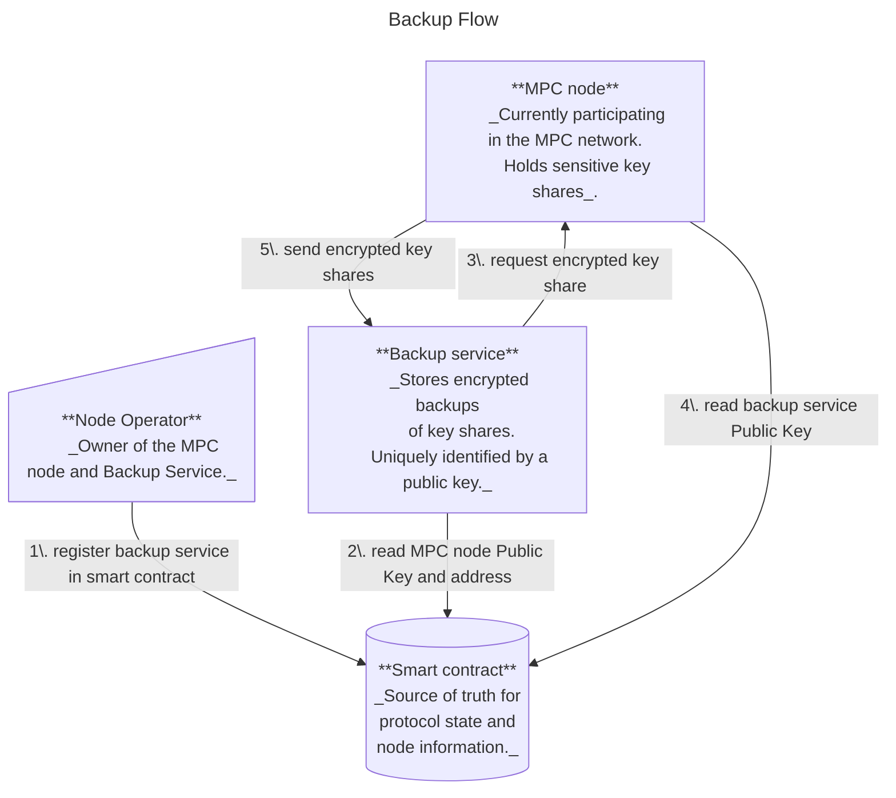
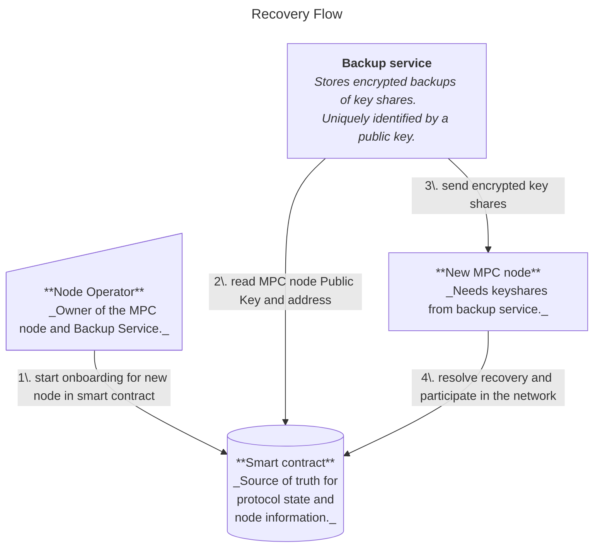

# Migration Service
## Overview
Near One is currently in the process of migrating the MPC nodes into a Trusted Execution environment (c.f. [TEE doc](docs/securing_mpc_with_tee_design_doc.md) for an introduction to TEEs).

A feature of TEEs is that accessing any secrets inside it is really hard (ideally, impossible). This means that once an MPC node runs inside a TEE, it will be impossible to migrate that node without going through a resharing. Additionally, TEEs make it much harder to recover from catastrophic failures - if something goes wrong, we risk to lose a signing quorum of the network.

For this reason, Near One is developing a migration service. The service allows to backup secrets in a secure manner outsied of the TEEs in which the MPC nodes are running. These backups can be used to recover a node in case a catastrophic failure occured.

Near-One will roll-out its TEE implementation in two phases:
- Soft Launch: All mainnet nodes are running within TEEs. Their key shares are backed-up outside of the TEE.
- Hard Launch: All mainnet nodes are running within TEEs. Their key shares are backed-up inside a different TEE.

## Migration of an MPC Node
To allow migration, a node operator will need to run a **backup service**. This service is separate from the MPC node and should run on a different machine. Its responsiblities are:
- to request an encrypted copy of the secret keys from the MPC node belonging to this node operator;
- securely store the secret keys;
- provide the secret keys to a newly set-up node.

### Backup Flow
The backup service requests the encrypted keyshares on the web endpoint.

```mermaid
---
title: Backup Flow
---
flowchart TD

    SC("
      **Smart contract**
      _Source of truth for
      protocol state and
      node information._
    ");

    MPC("
      **MPC node**
      _Currently participating in the MPC network.
      Holds sensitive key shares_.
    ");

    BS("
      **Backup service**
      _Stores encrypted backups
      of key shares.
      Uniquely identified by a public key._
    ");

    NO("
      **Node Operator**
      _Owner of the MPC node and Backup Service._
    ");
    
    NO -->|1\. register backup service in smart contract| SC;
    BS -->|2\. read MPC node Public Key and address| SC;
    BS --> |3\. request encrypted key share| MPC;
    MPC -->|4\. read backup service Public Key | SC;
    MPC -->|5\. send encrypted key shares | BS;

    NO@{ shape: manual-input}
    SC@{ shape: db}
    BS@{ shape: proc}
    MPC@{ shape: proc}
```

### Recovery Flow
The backup service submits encrypted keyshares to the node.

```mermaid
---
title: Recovery Flow
---
flowchart TD
    NO["**Node Operator**
      _Owner of the MPC node and Backup Service._"]

    SC["**Smart contract**
      _Source of truth for
      protocol state and
      node information._"]
      
    BS@{ label: "**Backup service**
        _Stores encrypted backups of key shares.     
        Uniquely identified by a public key._" }

    MPC["**New MPC node**
      _Needs keyshares from backup service._"]
    
    NO -- "1\. start onboarding for new node in smart contract" --> SC
    BS -- "2\. read MPC node Public Key and address" --> SC
    BS -- "3\. send encrypted key shares" --> MPC
    MPC -- "4\. resolve recovery and participate in the network" --> SC

    NO@{ shape: manual-input}
    SC@{ shape: db}
    BS@{ shape: proc}
    MPC@{ shape: proc}
```

### Backup Service
For the soft launch, the backup service is just a simple CLI. For the hard launch, the backup service must run in its own TEE environment and it must have a current view of the MPC smart contract on the NEAR blockchain.

### Remarks
- For security reasons and to avoid edge cases and race conditions, the MPC network allows migration of nodes only while the protocol is in a `Running` state (as opposed to `Resharing` or `Initializing`, which are the two other well-defined states).
- Note that starting a migration does not require a signing quorum. Instead, each participant can migrate their node at their own discretion. But, to avoid making the migration process a DOS attack vector, protocol state changes have priority over any ongoing migrations.
- If the protocol state changes into a `Resharing` or `Initializing` state, any ongoing Migration processes will simply be cancelled.

## Implementation Details
### Node 
#### Web Endpoints
The **MPC node** exposes web endpoints that the backup service can use to submit requests. All communication takes place over **HTTP with mutual TLS authentication** (implemented in [(#1283)](https://github.com/near/mpc/pull/1283)). For added security and to protcet against spoofing of malicious contract state, a nodes secrets are encrypted with **AES-256** (implemented in [#1376](https://github.com/near/mpc/pull/1376)). The symmetric key is passed to the backup service and node as a command line argument or environment variable. The symmetric key is provided by the node operator. 

The exposed endpoints are:
- GET /shares_backup - with an authentication header
    - Returns the encrypted shares
- POST /shares_recover
    - Posts encrypted shares to the node

#### Node behavior
A node must only participate in the MPC protocol, if it is in the set of active participants of the current running or resharing epoch. For this, the TLS key of a node acts as a unique identifier _(implemented in [(#1032)](https://github.com/near/mpc/pull/1032/files#diff-c54adafe6cebf73c37af97ce573a28c60593be635aa568ec93e912b8f286aa83R181))_.

Currently, due to limitations of our implementation, nodes need to drop and re-establish all connections in case of a change in the participant set. Before adding the migration feature, this was only possible if the epoch id changed, which happened only during a protocol state change.
Now, nodes need to be able to recognize and re-establish a connection if the participant set changes without an epoch incrementing _(implemented in [(#1061)](https://github.com/near/mpc/pull/1061) and [(#1032)](https://github.com/near/mpc/pull/1032/))_.

Additionally, nodes need to remove any triples and pre-signatures involving the node that was removed from the participant set in the migration process _(implemented in [(#1032)](https://github.com/near/mpc/pull/1032/))_

### Backup Service
For the soft launch, the node operator and a few scripts will act as the backup-service. For the hard-launch, the backup service will be a standalone application running inside a separate TEE from the MPC node. A detailed design of the hard launch backup service is currently out of the scope of this document.

### Contract
The contract stores information related to the recovery process, namely:
- any information related to the backup service
- information for destination nodes of active migrations / recovery processe.

This was implemented in [#1162](https://github.com/near/mpc/pull/1162).

#### Migration Related Behavior
- It may be desirable if the Contract verified that the calls to `conclude_recovery` are actually coming from the onboarding node. It might actually be desirable that the contract verified for all calls stemming from a node, that are signed by the correct public key. That is, to avoid mistaking any calls from ill-behaved decomissioned nodes as valid instructions _(c.f. [(#1086)](https://github.com/near/mpc/issues/1086))_. For this:
    - the contract would need to compare the `env::signer_account_pk()` with the public key associated to the node (note: this is a different key to the TLS Key. The TLS key is already stored in the contract under the name [`signer_pk`](https://github.com/near/mpc/blob/b5a9d1b2eef4de47d19b66cb25b577da2b897560/crates/contract/src/primitives/participants.rs#L14)) _(tangent: the team is aware the chosen name is not ideal and eager to change it when opportun)_)
    - the public key used by the node would need to be part of the `ParticipantInfo` struct
    - we would probably also want that public key to be part of the TEE attestation.

### Node Operator
- needs to add backup service information
- needs to submit `ParticipantInfo` for new (recovering) node
- needs to act as the backup service before soft launch (there will be scripts or binaries to support).

### Todo
c.f. [(#949)](https://github.com/near/mpc/issues/949)
- it is advised that the node operator grants access only to specific contract methods for the backup service and the node: [(#946)](https://github.com/near/mpc/issues/946)
- define attestation for backup service [(#947)](https://github.com/near/mpc/issues/947)
- attestation service must run an indexer

## Materials:
https://nearone.slack.com/archives/C07UW93JVQ8/p1753830474083739

