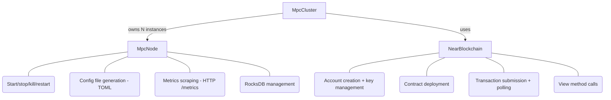

# Design: Rust E2E Test Infrastructure

## Purpose

This is a mostly claude-generated design document for replacing the Python E2E test
infrastructure with Rust. It describes the components we need to build, their APIs,
and how tests will use them.

It's intended as a design reference for issues
[#2440](https://github.com/near/mpc/issues/2440) and
[#2441](https://github.com/near/mpc/issues/2441), and should be updated as
implementation progresses.

---

## Architecture Overview

The Python E2E tests use `MpcCluster` → `MpcNode` → `LocalNode` (from nearcore) to
orchestrate real processes. We replace this with a Rust equivalent:



### Key design decisions

1. **RPC-based blockchain access, environment-agnostic.** The Python tests use
   nearcore's `LocalNode` + `start_cluster()` to manage neard processes directly. We
   don't need any of that — no test ever kills/restarts a neard validator. All
   blockchain interaction is RPC calls: deploy contract, send transactions, query
   state. The `NearBlockchain` component is just an RPC client that takes a URL.
   Whether that URL points to a local sandbox (`localhost:3030`) or NEAR testnet
   (`rpc.testnet.near.org`), the code path is identical. For local development and
   CI, we use [`near-sandbox`](https://github.com/near/near-sandbox-rs) which
   downloads and runs a real neard binary (single-node, fast block times, but real
   WASM execution and gas metering). To run the same tests against production
   testnet, just pass the testnet RPC URL instead — no code changes needed.

2. **Real `mpc-node` binary as OS process.** Unlike the existing Rust integration tests
   (which run node logic as in-process tokio tasks with `FakeIndexerManager`), E2E
   tests spawn real `mpc-node` binaries via `std::process::Command`. This tests the
   real binary, real config parsing, real P2P networking, and real Prometheus metrics.

3. **Support for mixed node versions.** `MpcNode` takes a `binary_path` parameter,
   allowing tests to run clusters with different `mpc-node` versions for compatibility
   testing. An auto-generated `mpc_binary_versions` file tracks the history of
   releases, and a resolver function fetches the requested binary version on demand
   (abstracting away the storage backend — git LFS, S3, etc.). Tests simply request
   a version from the history file and get a local binary path back.

4. **Crate location.** The E2E infrastructure lives in `crates/e2e-tests/` as a
   separate crate with `#[cfg(test)]` tests. It depends on `mpc-contract` (for
   contract types), `contract-interface` (for DTOs), `near-api` (for blockchain
   RPC access), and `near-sandbox` (for running a local neard in dev/CI).

---

> **Note:** The component APIs below are not finalized. They are intended to show the
> direction of the implementation, not prescribe exact signatures. Expect these to
> evolve as we build.

## Component 1: `MpcNode` — Node Process Manager

Wraps a single `mpc-node` OS process. Equivalent of Python's `MpcNode` class.

### Struct

```rust
use std::path::{Path, PathBuf};
use std::process::Child;
use std::net::SocketAddr;

/// All configuration and state needed to start an mpc-node process.
/// Represents a node that is NOT running. Can wipe DB, modify config, etc.
pub struct MpcNodeSetup {
    /// Path to the mpc-node binary.
    binary_path: PathBuf,
    /// Working directory containing config, RocksDB data, and keys.
    home_dir: PathBuf,
    /// The node's NEAR account ID.
    account_id: AccountId,
    /// Address where the node serves HTTP (health, debug, metrics).
    web_address: SocketAddr,
    /// Address for P2P communication.
    p2p_address: SocketAddr,
    /// Address for the migration service.
    migration_address: SocketAddr,
    /// Node configuration that will be written to disk as TOML.
    config: MpcNodeConfig,
}

/// Handle to a running mpc-node OS process. Always represents a live process.
/// Obtained by calling `MpcNodeSetup::start()`.
pub struct MpcNode {
    /// The setup that was used to start this node (returned on kill).
    setup: MpcNodeSetup,
    /// The running child process.
    process: Child,
}
```

### API

```rust
impl MpcNodeSetup {
    /// Creates a new node setup.
    pub fn new(
        binary_path: PathBuf,
        home_dir: PathBuf,
        account_id: AccountId,
        config: MpcNodeConfig,
    ) -> Self;

    /// Deletes RocksDB files (.sst, MANIFEST, etc.) from the data directory.
    /// Safe to call because the node is not running.
    pub fn wipe_db(&self) -> anyhow::Result<()>;

    /// Writes the TOML config file and spawns the mpc-node binary.
    /// Consumes self, returning an MpcNode handle to the running process.
    pub fn start(self) -> anyhow::Result<MpcNode>;
}

impl MpcNode {
    /// Sends SIGTERM (gentle=true) or SIGKILL (gentle=false) to the process.
    /// Consumes self, returning the MpcNodeSetup for potential restart.
    pub fn kill(self, gentle: bool) -> anyhow::Result<MpcNodeSetup>;

    /// Kill then start. New process, same config and data directory.
    pub fn restart(self, gentle: bool) -> anyhow::Result<MpcNode>;

    /// Scrapes the node's /metrics HTTP endpoint and returns the value of
    /// the named metric, parsed as i64.
    pub async fn get_metric(&self, name: &str) -> anyhow::Result<Option<i64>>;

    /// Scrapes /metrics and returns all label→value pairs for a multi-label metric.
    pub async fn get_metric_labels(
        &self,
        name: &str,
    ) -> anyhow::Result<Vec<(HashMap<String, String>, f64)>>;

    /// Polls the named metric until it equals the expected value or timeout.
    pub async fn wait_for_metric(
        &self,
        name: &str,
        expected: i64,
        timeout: Duration,
    ) -> anyhow::Result<()>;

    /// Writes a flag file that controls block ingestion. Requires the
    /// network-hardship-simulation feature on the mpc-node binary.
    pub fn set_block_ingestion(&self, active: bool) -> anyhow::Result<()>;

    /// Creates a marker file in temporary_keys/ to reserve a key event attempt.
    pub fn reserve_key_event_attempt(
        &self,
        epoch_id: u64,
        domain_id: u64,
        attempt_id: u64,
    ) -> anyhow::Result<()>;

    /// HTTP GET to /debug/migrations, parsed into contract migration types.
    pub async fn migration_state(&self) -> anyhow::Result<NodeMigrations>;

    /// Returns the web_address for HTTP requests.
    pub fn web_address(&self) -> SocketAddr;

    /// Returns the migration service address.
    pub fn migration_address(&self) -> SocketAddr;
}

impl Drop for MpcNode {
    /// Kills the process on drop to avoid orphaned processes.
    fn drop(&mut self) { /* SIGKILL if running */ }
}
```

### Config generation

```rust
/// Node configuration written to disk as TOML before starting the binary.
/// Mirrors the StartConfig structure that `mpc-node start-with-config-file` reads.
pub struct MpcNodeConfig {
    pub home_dir: PathBuf,
    pub secrets: SecretsConfig,
    pub tee: TeeConfig,
    pub node: ConfigFile,
}

impl MpcNodeConfig {
    /// Writes the config as TOML to `{home_dir}/start_config.toml`.
    pub fn write_to_disk(&self) -> anyhow::Result<PathBuf>;
}
```

---

## Component 2: `NearBlockchain` — Blockchain RPC Client

RPC client for interacting with any NEAR network. Takes an RPC URL — whether that
points to a local sandbox neard or NEAR testnet, the code path is identical.

Replaces the Python nearcore layer (`cluster.py`, `transaction.py`, `key.py`,
`NearAccount`).

### Struct

```rust
use near_api::*;

/// RPC client for any NEAR network (sandbox or testnet).
/// Pure blockchain interaction — no contract-specific state.
pub struct NearBlockchain {
    /// The RPC URL (e.g. "http://localhost:3030" or "https://rpc.testnet.near.org").
    rpc_url: String,
    /// RPC client for sending transactions and queries.
    client: near_api::JsonRpcClient,
}

/// Handle to a deployed MPC signer contract. Wraps a NearBlockchain reference
/// and adds the contract account ID and signer for contract management.
pub struct DeployedContract<'a> {
    /// The underlying blockchain client.
    blockchain: &'a NearBlockchain,
    /// The deployed MPC signer contract account ID.
    contract_id: AccountId,
    /// Signer for the account that deploys and manages the contract.
    signer: near_api::Signer,
}
```

### API

```rust
impl NearBlockchain {
    /// Connects to a NEAR RPC endpoint.
    pub async fn connect(rpc_url: &str) -> anyhow::Result<Self>;

    /// Deploys the MPC contract WASM and returns a DeployedContract handle.
    pub async fn deploy_contract(
        &self,
        signer: Signer,
        account_id: &AccountId,
        wasm: &[u8],
    ) -> anyhow::Result<DeployedContract<'_>>;

    /// Calls a contract method as a transaction (state-changing).
    pub async fn call(
        &self,
        signer: &Signer,
        contract_id: &AccountId,
        method: &str,
        args: serde_json::Value,
        gas: Gas,
        deposit: NearToken,
    ) -> anyhow::Result<FinalExecutionOutcomeView>;

    /// Calls a view method (read-only).
    pub async fn view(
        &self,
        contract_id: &AccountId,
        method: &str,
        args: serde_json::Value,
    ) -> anyhow::Result<serde_json::Value>;

    /// Creates a new NEAR account (sub-account of the given signer).
    pub async fn create_account(
        &self,
        signer: &Signer,
        name: &str,
        balance: NearToken,
    ) -> anyhow::Result<(AccountId, Signer)>;

    /// Returns the RPC URL. Used to configure mpc-node's indexer.
    pub fn rpc_url(&self) -> &str;
}

impl<'a> DeployedContract<'a> {
    /// Returns the contract account ID.
    pub fn contract_id(&self) -> &AccountId;

    /// Returns the underlying blockchain client.
    pub fn blockchain(&self) -> &NearBlockchain;

    /// Calls a method on this contract as a transaction.
    pub async fn call(
        &self,
        method: &str,
        args: serde_json::Value,
        gas: Gas,
        deposit: NearToken,
    ) -> anyhow::Result<FinalExecutionOutcomeView>;

    /// Calls a view method on this contract.
    pub async fn view(
        &self,
        method: &str,
        args: serde_json::Value,
    ) -> anyhow::Result<serde_json::Value>;

    /// Queries the contract's state() view method and parses it.
    pub async fn state(&self) -> anyhow::Result<ProtocolContractState>;
}
```

### Environment setup (outside the framework)

The `NearBlockchain` client is environment-agnostic. How the blockchain is provided
is a separate concern:

- **Local sandbox (dev/CI):** Use [`near-sandbox`](https://github.com/near/near-sandbox-rs)
  to download and run a real neard binary locally. It runs a single-node NEAR blockchain
  with fast block times but real WASM execution, state, and gas metering. Pass
  `http://localhost:3030` as RPC URL. Accounts can be created freely with the genesis
  root key.
- **NEAR testnet:** No blockchain to start — it's already running. Pass
  `https://rpc.testnet.near.org` as RPC URL. Use pre-funded accounts or the testnet
  faucet for account creation. Contract can be pre-deployed or deployed fresh each run.

Since the test framework only talks RPC, switching between sandbox and testnet is
purely a configuration change — same test code, same assertions, same contract
interactions.

---

## Component 3: `MpcCluster` — Cluster Orchestration

Orchestrates the full test environment: blockchain + contract + N mpc-nodes.
Equivalent of Python's `MpcCluster` class.

### Struct

```rust
/// A node that is either running or stopped (killed).
pub enum MpcNodeState {
    Running(MpcNode),
    Stopped(MpcNodeSetup),
}

/// A running MPC test cluster with a deployed contract and N mpc-node processes.
pub struct MpcCluster {
    /// The underlying blockchain RPC client.
    pub blockchain: NearBlockchain,
    /// Handle to the deployed MPC signer contract.
    pub contract: DeployedContract,
    /// The MPC nodes, each either running or stopped.
    pub nodes: Vec<MpcNodeState>,
    /// Accounts used for submitting signature/CKD requests.
    pub user_accounts: HashMap<AccountId, Signer>,
}
```

### Builder

```rust
/// Configuration for creating a new MpcCluster.
pub struct MpcClusterConfig {
    /// NEAR RPC URL (e.g. "http://localhost:3030" or "https://rpc.testnet.near.org").
    pub rpc_url: String,
    /// Signer for the root/funder account.
    pub root_signer: Signer,
    /// Number of MPC nodes.
    pub num_nodes: usize,
    /// Threshold for signing.
    pub threshold: usize,
    /// Signature domains to initialize.
    pub domains: Vec<DomainConfig>,
    /// Path(s) to the mpc-node binary. If a single path is given, all nodes
    /// use it. If multiple paths are given, each node uses the corresponding
    /// entry (length must equal num_nodes). Defaults to target/release/mpc-node.
    pub binary_paths: Vec<PathBuf>,
    /// Path to the compiled contract WASM.
    pub contract_wasm_path: PathBuf,
    /// Triple generation config overrides for faster tests.
    pub triple_config: Option<TripleConfig>,
    /// Presignature config overrides.
    pub presignature_config: Option<PresignatureConfig>,
    /// Port seed to avoid collisions between parallel test runs.
    pub port_seed: u16,
    /// Optional: pre-deployed contract account ID. If None, deploys fresh from WASM.
    pub existing_contract: Option<AccountId>,
}

impl MpcClusterConfig {
    pub fn default_for_test(num_nodes: usize, threshold: usize) -> Self;
}
```

### API

```rust
impl MpcCluster {
    /// Creates the full cluster: starts blockchain, deploys contract, calls init(),
    /// spawns mpc-node binaries, waits for Running state.
    /// This is the main entry point for E2E tests.
    pub async fn start(config: MpcClusterConfig) -> anyhow::Result<Self>;

    // --- Node lifecycle ---

    /// Kills nodes at the given indices.
    pub fn kill_nodes(&mut self, indices: &[usize], gentle: bool) -> anyhow::Result<()>;

    /// Starts previously killed nodes.
    pub fn start_nodes(&mut self, indices: &[usize]) -> anyhow::Result<()>;

    /// Kills all nodes.
    pub fn kill_all(&mut self) -> anyhow::Result<()>;

    // --- Contract operations ---

    /// Queries the contract's state() view method and parses it.
    pub async fn get_contract_state(&self) -> anyhow::Result<ProtocolContractState>;

    /// Polls contract state until it matches the predicate or timeout.
    pub async fn wait_for_state(
        &self,
        predicate: impl Fn(&ProtocolContractState) -> bool,
        timeout: Duration,
    ) -> anyhow::Result<()>;

    /// Submits vote_add_domains from each node and waits for Initializing→Running.
    pub async fn add_domains(&self, domains: Vec<DomainConfig>) -> anyhow::Result<()>;

    /// Submits vote_new_parameters from each node to trigger resharing.
    pub async fn start_resharing(
        &self,
        new_participants: Vec<usize>,
        new_threshold: usize,
    ) -> anyhow::Result<()>;

    // --- Request submission ---

    /// Submits a sign() transaction to the contract and waits for the response.
    pub async fn sign_and_await(
        &self,
        domain: &DomainConfig,
        payload: &[u8; 32],
        path: &str,
        timeout: Duration,
    ) -> anyhow::Result<SignatureResponse>;

    /// Submits N signature requests in parallel, awaits all responses.
    pub async fn batch_sign(
        &self,
        requests: Vec<SignRequest>,
        timeout: Duration,
    ) -> anyhow::Result<Vec<SignatureResponse>>;

    /// Submits a CKD request and awaits the response.
    pub async fn ckd_and_await(
        &self,
        domain: &DomainConfig,
        app_public_key: &[u8],
        path: &str,
        timeout: Duration,
    ) -> anyhow::Result<CKDResponse>;

    /// Submits a verify_foreign_transaction request and awaits the response.
    pub async fn verify_foreign_tx_and_await(
        &self,
        domain: &DomainConfig,
        request: &ForeignChainRpcRequest,
        timeout: Duration,
    ) -> anyhow::Result<VerifyForeignTxResponse>;

    // --- Metrics ---

    /// Scrapes a metric from all nodes, returns values indexed by node.
    pub async fn get_metric_all_nodes(
        &self,
        name: &str,
    ) -> anyhow::Result<Vec<Option<i64>>>;

    /// Polls until all nodes report the expected metric value.
    pub async fn wait_for_metric_all_nodes(
        &self,
        name: &str,
        expected: i64,
        timeout: Duration,
    ) -> anyhow::Result<()>;

    // --- Data management ---

    /// Wipes RocksDB data for nodes at given indices. Nodes must be stopped.
    pub fn wipe_db(&self, indices: &[usize]) -> anyhow::Result<()>;

    /// Controls block ingestion for nodes at given indices.
    pub fn set_block_ingestion(
        &mut self,
        indices: &[usize],
        active: bool,
    ) -> anyhow::Result<()>;

    // --- Migration ---

    /// Registers backup service info on the contract for the given node.
    pub async fn register_backup_service(
        &self,
        node_index: usize,
        info: BackupServiceInfo,
    ) -> anyhow::Result<()>;

    /// Starts a node migration on the contract.
    pub async fn start_node_migration(
        &self,
        node_index: usize,
        dest: DestinationNodeInfo,
    ) -> anyhow::Result<()>;
}

impl Drop for MpcCluster {
    /// Kills all nodes on drop to avoid orphaned processes.
    fn drop(&mut self) { /* kill_all */ }
}
```

---

## Component 4: Foreign Chain Mock Servers

For `test_foreign_transaction_validation`, we need mock RPC servers that pretend to be
Bitcoin/EVM/Starknet nodes. The `httpmock` crate is already used in
`foreign-chain-inspector/tests/`.

```rust
/// Starts mock foreign chain RPC servers and returns their URLs.
pub struct ForeignChainMocks {
    pub bitcoin_url: String,
    pub abstract_url: String,
    pub starknet_url: String,
    servers: Vec<httpmock::MockServer>,
}

impl ForeignChainMocks {
    /// Starts mock servers for Bitcoin, Abstract (EVM), and Starknet.
    pub async fn start() -> Self;

    /// Returns a ForeignChainsConfig pointing at the mock servers,
    /// suitable for injecting into MpcNodeConfig.
    pub fn as_config(&self) -> ForeignChainsConfig;
}
```

---

## Example: How a test looks

### Basic signature test

```rust
#[tokio::test]
async fn test_signature_lifecycle() -> anyhow::Result<()> {
    let config = MpcClusterConfig::default_for_test(2, 2);
    let cluster = MpcCluster::start(config).await?;

    // Wait for presignatures to be generated
    cluster.wait_for_metric_all_nodes(
        "MPC_OWNED_NUM_PRESIGNATURES_AVAILABLE",
        10,
        Duration::from_secs(120),
    ).await?;

    // Submit signature requests
    let domain = &cluster.get_contract_state().await?.domains[0];
    let payload = rand::random::<[u8; 32]>();
    let response = cluster.sign_and_await(domain, &payload, "test", Duration::from_secs(30)).await?;

    assert!(response.big_r.is_some());
    assert!(response.s.is_some());
    Ok(())
}
```

### Node failure test

```rust
#[tokio::test]
async fn test_node_failure_and_recovery() -> anyhow::Result<()> {
    let config = MpcClusterConfig::default_for_test(3, 2);
    let mut cluster = MpcCluster::start(config).await?;

    // Kill a node and wipe its DB
    cluster.kill_nodes(&[2], false)?;
    cluster.wipe_db(&[2])?;

    // Verify remaining nodes detect the dead peer
    for i in 0..2 {
        cluster.nodes[i].wait_for_metric(
            "MPC_NETWORK_LIVE_CONNECTIONS",
            1, // only 1 peer now
            Duration::from_secs(30),
        ).await?;
    }

    // Signatures should still work with 2-of-3
    let domain = &cluster.get_contract_state().await?.domains[0];
    let payload = rand::random::<[u8; 32]>();
    cluster.sign_and_await(domain, &payload, "test", Duration::from_secs(30)).await?;

    // Restart the wiped node
    cluster.start_nodes(&[2])?;

    // Verify it reconnects
    for i in 0..3 {
        cluster.nodes[i].wait_for_metric(
            "MPC_NETWORK_LIVE_CONNECTIONS",
            2,
            Duration::from_secs(60),
        ).await?;
    }

    Ok(())
}
```

### Mixed version compatibility test

```rust
#[tokio::test]
async fn test_mixed_version_compatibility() -> anyhow::Result<()> {
    let mut config = MpcClusterConfig::default_for_test(3, 2);
    // Two nodes run the old version, one runs the new version
    config.binary_paths = vec![
        PathBuf::from("target/release/mpc-node-v1"),
        PathBuf::from("target/release/mpc-node-v1"),
        PathBuf::from("target/release/mpc-node"),
    ];

    let cluster = MpcCluster::start(config).await?;

    // Verify mixed-version cluster can still produce signatures
    let domain = &cluster.get_contract_state().await?.domains[0];
    let payload = rand::random::<[u8; 32]>();
    cluster.sign_and_await(domain, &payload, "test", Duration::from_secs(30)).await?;

    Ok(())
}
```

---

### Criteria for choosing

This will be decided on case-by-case basis but rule of thumb is to have it as
integration test if it can be meaningfully covered, but we must have few critical
user journes covered end-to-end as close to production as possible.
---

## Implementation order

1. **`MpcNode`** — Node process manager. Start/stop/kill a single mpc-node binary,
   write config TOML, scrape metrics. This is the foundation everything else builds on.
   *([#2440](https://github.com/near/mpc/issues/2440))*

2. **`NearBlockchain`** — RPC client wrapper using `near-api-rs`. Deploy contract,
   submit transactions, query state. Environment-agnostic — same code talks to
   sandbox or testnet.

3. **`MpcCluster`** — Combines `NearBlockchain` + N `MpcNode` instances. Handles the
   full setup sequence: start sandbox → deploy contract → create accounts → generate
   configs → spawn nodes → wait for Running state.
   *([#2441](https://github.com/near/mpc/issues/2441))*

4. **`ForeignChainMocks`** — Mock HTTP servers for Bitcoin/EVM/Starknet RPCs. Uses
   `httpmock` crate (already in use in `foreign-chain-inspector/tests/`).

5. **Migrate tests** — Starting with the simplest (e.g., `test_request_lifecycle`)
   and working up to complex ones (`test_lost_assets`, `test_key_event`).

---

## Parallel test execution

Python tests currently run serially (~28 min). Concurrent execution shows ~9 min
speedup. To support parallel Rust E2E tests:

- **Unique ports per test**: `MpcClusterConfig.port_seed` offsets all ports (P2P, web,
  migration, pprof) to avoid collisions. Each test uses a different seed.
- **Unique data directories**: Each `MpcNode` gets its own tempdir for RocksDB and
  config files.
- **Independent sandbox instances**: Each test starts its own `near-sandbox` neard
  process with its own data directory (when running locally).
- **`cargo nextest`**: Already used for Rust tests; runs each test in its own process
  by default, providing natural isolation.
