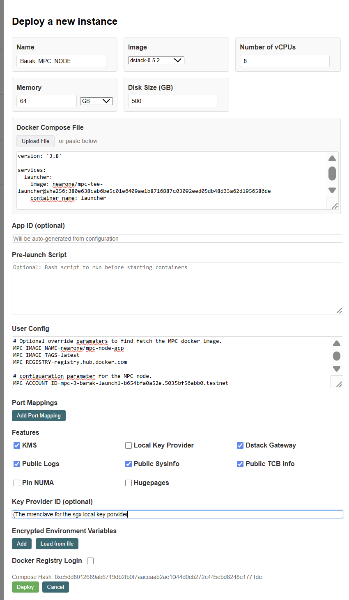
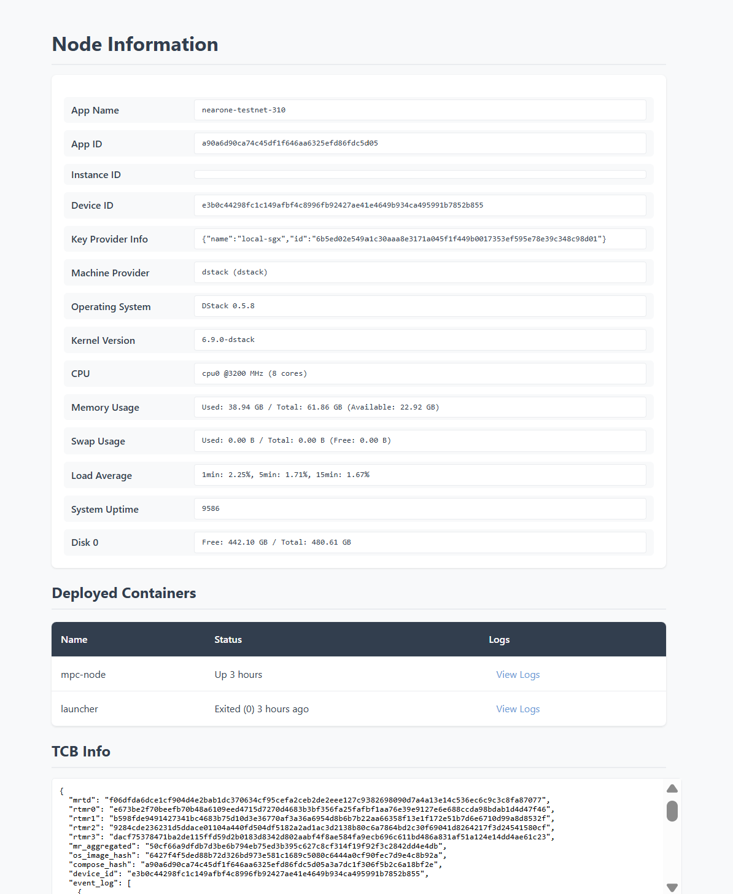
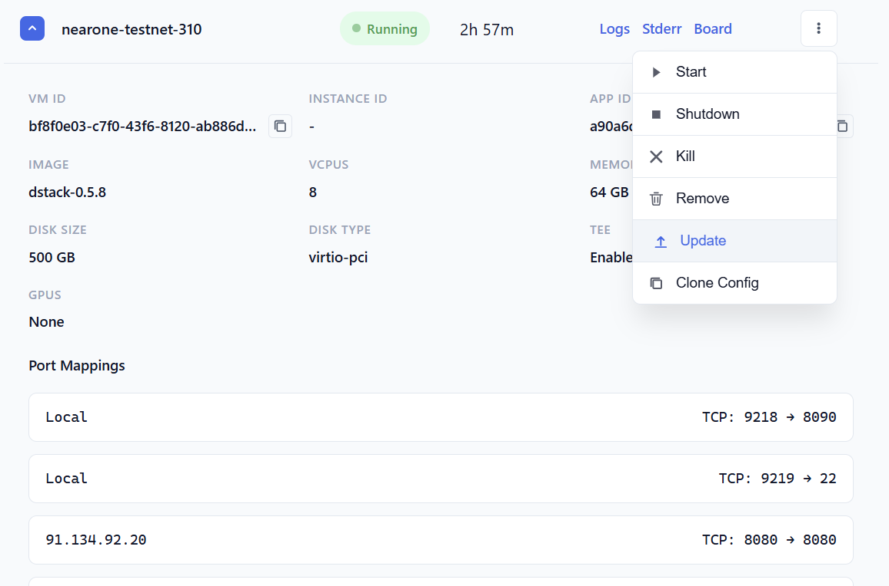
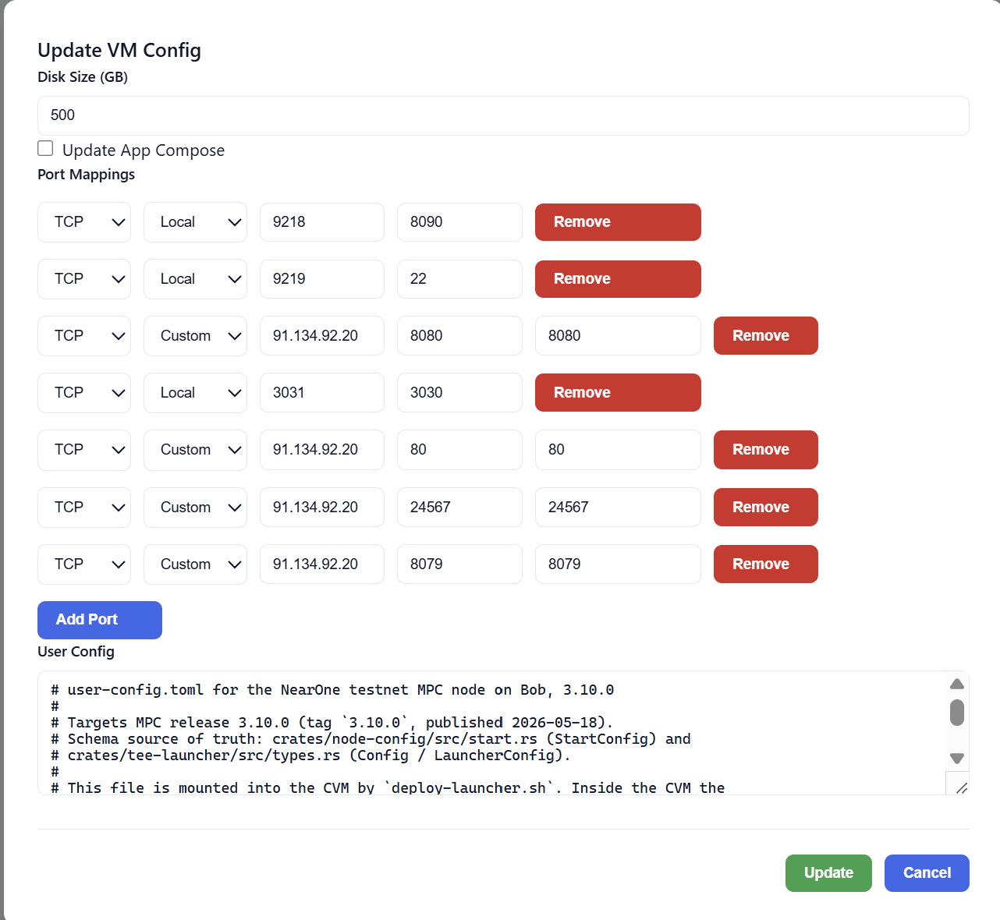

# MPC Node Deployment in TDX \- External Guide

## Introduction

Chain signatures is a Multi-Party Computation (MPC) service that lets you sign arbitrary payloads by calling a smart contract and receiving a signature. The returned signature can be used to derive public keys on external chains (for example, Ethereum or Bitcoin).

This guide walks you through deploying a self-hosted MPC node on a bare-metal server using Intel Trusted Domain Extensions (TDX). The node runs inside a Confidential VM (CVM) for isolation and attestation.

We use Dstack (from Phala) to orchestrate the environment and run the MPC container inside the CVM

## Limitations and Restrictions

 **Important:**

The CVM filesystem is encrypted with a hardware-bound key derived from SGX sealing, so copying the CVM or disk data to another machine will not work and may result in data loss, including loss of key shares and P2P identity keys.

Platform-bound sealed data may also become unrecoverable if TDX-related hardware changes (for example, a CPU replacement).

To move a node between hosts, follow the supported procedure described in the [Node Migration](./node-migration-guide.md) section, which uses the backup-cli tool to securely transfer key shares.


## Main difference between TEE and non TEE MPC nodes

From an operator’s perspective, the key differences between a **TEE-based** MPC node and a **non-TEE** node are:

For a full architecture review of the TEE-based MPC, see: [design doc](securing-mpc-with-tee-design-doc.md)

| Category/feature | Non TEE | With TEE |
| :---- | :---- | :---- |
|  |  |  |
| Hardware Setup | Any hardware that meets the bandwidth, compute and memory requirements.  | Additional requirements to support Intel TDX Hardware.  |
| Deployment  | Deploy an MPC Docker image directly. | Use Dstack interface to deploy a Launcher docker image that will deploy the MPC node.  |
| Node Account key and P2P key | Generated by the operator, and provided to the node. | Generated by the node. Private keys are never exposed outside of the CVM. Public keys are exported by the node. And added to the operator's account. |
| Debug, Recovery| Operator has complete control over the environment | Operator has no access into the CVM (except for defined entry points) |

## Prerequisites and Requirements

### Hardware Requirements

* Have a TDX enabled, bare metal, server.

Note \- we currently only support bare metal and do not support virtualized TDX solutions (such as GCP)

* Intel Xeon 5th/6th Generation CPU (TDX Support) and 8 RAM slots filled
  See [Intel TDX HW requirements](https://cc-enabling.trustedservices.intel.com/intel-tdx-enabling-guide/03/hardware_selection/)
* Memory \- 64GB
* (v)Cores \- 8
* Disk space \- 500GB, SSD NVMe or similar performance

For a list of supported cloud providers offering bare metal servers with Intel TDX, see [Cloud Providers Supporting Bare Metal Servers with Intel TDX](./cloud-providers-tdx.md).

### General

* Firewall:allow ingress port 80 (MPC), 24567 (near) and port 8080 (web)
* Assign a static public IP for access towards machine from outside

### Create DNS A record (optional)

Although a node can be accessed using a public IP address, it is recommended to use a domain name instead. Using a domain name allows some flexibility in case of public IP address change/repurpose or failover scenarios. To use a domain name, one must register a DNS A record. Some recommended providers:

* [Namecheap](https://www.namecheap.com/support/knowledgebase/article.aspx/319/2237/how-can-i-set-up-an-a-address-record-for-my-domain/)
* [Cloudflare](https://developers.cloudflare.com/dns/manage-dns-records/how-to/create-dns-records/)

### TDX and Dstack Setup

This section describes how to enable TDX on your machine (BIOS, operating system, and software configurations), and how to install and configure Dstack.

Follow the three steps below to ensure you have a working TDX machine with Dstack configured:

1. [Set up a bare-metal TDX server](#1-tdx-bare-metal-server-setup)
2. [Dstack Setup and Configuration](#2-dstack-setup-and-configuration)
3. [Set up a Local Gramine-Sealing-Key-Provider](#3-local-gramine-sealing-key-provider-setup)

---

#### 1. TDX Bare-Metal Server Setup

To create a bare-metal TDX server, follow the [canonical/tdx guide](https://github.com/canonical/tdx/blob/9023cb2d952f5fe9d72004092b93a155482ba18a/README.md).

Make sure to complete:

* Steps 1–4 (basic TDX setup configuration)
* Steps 9.1–9.2 (Remote Attestation setup)

This ensures that your TDX setup is correctly configured.

---

#### 2. Dstack Setup and Configuration

This section will guide you through installing and configuring `dstack-vmm`, which is the only dstack component needed for running MPC nodes in TDX environments.
The instructions are based on the [dstack deployment guide](https://github.com/Dstack-TEE/dstack/blob/eab86e8a3fd934656946a39bf07849bd75cf20fb/docs/deployment.md).

**Prerequisites:**

* Follow the [TDX setup guide](https://github.com/canonical/tdx) to setup the TDX host (completed in step 1 above)

* Install system dependencies

```bash
sudo apt update
sudo apt install build-essential qemu-system-x86=1:8.2.2* docker.io
```

> **Note:** The QEMU version is pinned to **8.2.2** because TDX attestation measurements
> (MRTD/RTMR0) depend on the QEMU version. Using a different version will produce different
> measurements and attestation might fail.

* Create `mpc` user and installation folder

```bash
# allow the MPC user to access docker and KVM for running CVMs.
sudo useradd -m -G docker,kvm -s /usr/bin/bash mpc
sudo passwd mpc
# create installation folder
sudo mkdir /opt/mpc
sudo chown mpc:mpc /opt/mpc
# change user
sudo -u mpc -s
cd /opt/mpc
```

* Install `cargo` and `rustc`. This can be done with the following command.

```bash
curl --proto '=https' --tlsv1.2 -sSf https://sh.rustup.rs | sh
```

Note that after running this command you might need to restart the shell.

**Installation Steps:**

All steps below assume the current user is `mpc` and the current directory is
`/opt/mpc`.

1. **Clone the dstack repository:**

   ```bash
   git clone https://github.com/Dstack-TEE/dstack
   ```

2. **Compile dstack-vmm:**

   ```bash
   cd dstack
   git checkout v0.5.8 # Should point to commit `368c62e7de5d4016bd75332824aa7f2ef1d7d19e`

   cargo build --release -p dstack-vmm -p supervisor
   mkdir -p vmm-data
   cp target/release/dstack-vmm vmm-data/
   cp target/release/supervisor vmm-data/
   cd vmm-data/
   ```

3. **Create the VMM configuration file:**

```bash
cat <<EOF > vmm.toml

# Communication endpoint for the VMM:
# - Use an IP and port when you want to access the VMM web UI from a browser (recommended)
address = "127.0.0.1"
port = 10000
# - Or use a UNIX socket if you don’t need the web UI and prefer not to expose an IP/port
#   address = "unix:./vmm.sock"

reuse = true
image_path = "./images"
run_path = "./run/vm"

[cvm]
kms_urls = ["https://kms.test2.dstack.phala.network:9201"]
gateway_urls = []
cid_start = 30000
cid_pool_size = 1000
max_disk_size = 1000

[cvm.port_mapping]
enabled = true
address = "127.0.0.1"
range = [
    { protocol = "tcp", from = 1, to = 30000 },
    { protocol = "udp", from = 1, to = 30000 },
]

[host_api]
address = "vsock:2"
port = 9300
EOF
```

4. **Download Guest OS images:**

   ```bash
   DSTACK_VERSION=0.5.8
   wget "https://github.com/Dstack-TEE/meta-dstack/releases/download/v${DSTACK_VERSION}/dstack-${DSTACK_VERSION}.tar.gz"
   mkdir -p images/
   tar -xvf dstack-${DSTACK_VERSION}.tar.gz -C images/
   rm -f dstack-${DSTACK_VERSION}.tar.gz
   ```

**Configuration Notes:**

* KMS and Gateway are not used in this MPC setup
* The configuration includes port **24567** which is required for MPC nodes
* The `max_disk_size = 1000` setting is specifically required for MPC operations

##### VMM service persistence

To run dstack-vmm, you can start it manually with:

```bash
./dstack-vmm -c vmm.toml
```

When `dstack-vmm` is running, you should be able to access its web interface at port `10000`.

However, for persistent operation, we recommend using the following systemd service:

```text
[Unit]
Description=Daemon for dstack-vmm

[Service]
Type=simple
WorkingDirectory=/opt/mpc/dstack/vmm-data/
ExecStart=/opt/mpc/dstack/vmm-data/dstack-vmm -c vmm.toml
Restart=on-failure
RestartSec=5
User=mpc
Group=mpc

[Install]
WantedBy=multi-user.target
```

The file should be located in the user systemd config folder, for example `/etc/systemd/system/dstack-vmm.service`.
After the file is created or modified you must run:

```bash
# to reload the service files
sudo systemctl daemon-reload
# to start/stop/restart the service
sudo systemctl start/stop/restart dstack-vmm
# to check the status the service
systemctl status dstack-vmm
```

Notice that some of the commands require `sudo`, so they cannot be run using the
`mpc` user which has no such permissions by default.

---

##### Guest OS Image (optional)

> **Important:** The guest OS image that runs inside the CVM must be **identical across all nodes**.
> The image is **measured**, and those measurements are **hardcoded in the contract**.

The guest OS image was downloaded automatically during **Step 4** of the installation process using version **0.5.8**. This version ensures **compatibility** and **reproducibility** across all MPC nodes.

If you need to **verify**, **re-download**, or **rebuild** the image, follow one of the methods below.

---

###### Option 1 — Re-download the pre-built image

Use this method to retrieve the official pre-built image provided by the Dstack project.

```bash
DSTACK_VERSION=0.5.8
wget "https://github.com/Dstack-TEE/meta-dstack/releases/download/v${DSTACK_VERSION}/dstack-${DSTACK_VERSION}.tar.gz"
mkdir -p images/
tar -xvf dstack-${DSTACK_VERSION}.tar.gz -C images/
rm -f dstack-${DSTACK_VERSION}.tar.gz
```

This ensures you are using the verified release image corresponding to version **0.5.8**.

---

###### Option 2 — Build the image from source

This method is intended for advanced users who wish to inspect, rebuild, or reproduce the image for verification purposes.

1. **Clone and check out the exact release:**

   ```bash
   git clone https://github.com/Dstack-TEE/meta-dstack.git
   cd meta-dstack/
   git checkout 48dd3df6f443bfe25a65701d4453fb7cf9c3dbb9
   git submodule update --init --recursive
   ```

2. **Choose one of the following actions:**

   - **Download the pre-built image (recommended, faster):**
     ```bash
     ./build.sh dl 0.5.8
     ```

   - **Build a reproducible image from source (slower, ~1–2 hours):**
     ```bash
     cd repro-build && ./repro-build.sh -n
     ```


###### Verification Steps

Run these commands from inside your image folder (e.g., `dstack-0.5.8`).

**1. Verify file hashes against expected values:**

```bash
#!/usr/bin/env bash
set -euo pipefail

# Hard-coded expected hashes
declare -A EXPECTED
EXPECTED["ovmf.fd"]="76888ce69c91aed86c43f840b913899b40b981964b7ce6018667f91ad06301f0"
EXPECTED["bzImage"]="2afe5b0571363fe2278a3438e337630bfeffc74bafba3d116630e2a1ef1805f3"
EXPECTED["initramfs.cpio.gz"]="1272ab4b10db1933d02a80059fbb94b4be9eb4af8c4f79e739dfc0b0101acc40"
EXPECTED["metadata.json"]="20fde70b9e4f31ab6ef55d8a5bf33b1734593a9e605982c510c0963d69af075b"

ALL_OK=1
for FILE in "${!EXPECTED[@]}"; do
    if [[ ! -f "$FILE" ]]; then
        echo "$FILE not found"
        ALL_OK=0
        continue
    fi

    CALC_HASH=$(sha256sum "$FILE" | awk '{print $1}')
    if [[ "$CALC_HASH" == "${EXPECTED[$FILE]}" ]]; then
        echo "$FILE: OK"
    else
        echo "$FILE: FAILED"
        echo "  Expected: ${EXPECTED[$FILE]}"
        echo "  Found:    $CALC_HASH"
        ALL_OK=0
    fi
done

if [[ $ALL_OK -eq 1 ]]; then
    echo "All files verified successfully"
else
    echo "One or more files did not match"
fi
```

**2. Verify the `rootfs.img.verity`:**
```bash
#!/usr/bin/env bash
set -euo pipefail

META="metadata.json"

# Extract values from metadata.json
ROOTFS=$(jq -r '.rootfs' "$META")
ROOTFS_SIZE=$(jq -r '.cmdline' "$META" | sed -n 's/.*dstack.rootfs_size=\([0-9]*\).*/\1/p')
ROOTFS_HASH=$(jq -r '.cmdline' "$META" | sed -n 's/.*dstack.rootfs_hash=\([a-f0-9]*\).*/\1/p')

# Compute parameters
BLOCK_SIZE=4096
DATA_BLOCKS=$(( ROOTFS_SIZE / BLOCK_SIZE ))
HASH_OFFSET=$ROOTFS_SIZE

echo "Verifying $ROOTFS"
echo "  Rootfs size:   $ROOTFS_SIZE bytes"
echo "  Data blocks:   $DATA_BLOCKS"
echo "  Hash offset:   $HASH_OFFSET"
echo "  Rootfs hash:   $ROOTFS_HASH"

# Run verification
veritysetup verify \
  --data-blocks=$DATA_BLOCKS \
  --hash-offset=$HASH_OFFSET \
  --data-block-size=$BLOCK_SIZE \
  --hash-block-size=$BLOCK_SIZE \
  "$ROOTFS" "$ROOTFS" "$ROOTFS_HASH"

echo "✅ Verification succeeded"
```

**3. Check actual vs. expected RTMR values:**

1. Build `dstack-mr` tool (using Docker).
2. Calculate the actual RTMRs of the image.
3. Compare against expected RTMRs from the contract (shown below).

For more details, see the [Dstack attestation guide](https://github.com/Dstack-TEE/dstack/blob/master/attestation.md).

Build `dstack-mr` docker image:

```bash
cd /opt/mpc/dstack/vmm-data/images/dstack-0.5.8
```

Create a Dockerfile file with the following contents:
```shell
# Dockerfile
FROM rust:1.86.0@sha256:300ec56abce8cc9448ddea2172747d048ed902a3090e6b57babb2bf19f754081 AS kms-builder
ARG DSTACK_REV
WORKDIR /build
RUN apt-get update && \
    apt-get install -y --no-install-recommends \
    git \
    build-essential \
    musl-tools \
    libssl-dev \
    protobuf-compiler \
    libprotobuf-dev \
    clang \
    libclang-dev
RUN git clone https://github.com/Dstack-TEE/dstack.git && \
    cd dstack
RUN rustup target add x86_64-unknown-linux-musl
RUN cd dstack && cargo build --release -p dstack-mr-cli --target x86_64-unknown-linux-musl

FROM kvin/kms:latest
COPY --from=kms-builder /build/dstack/target/x86_64-unknown-linux-musl/release/dstack-mr /usr/local/bin/
ENTRYPOINT ["dstack-mr"]
CMD []
```

Build:

```bash
docker build . -t dstack-mr
```

Run:

> **Important:** MRTD and RTMR0 depend on the QEMU version installed on the TDX host.
> The `dstack-mr` tool must be told this version via `--qemu-version`, otherwise it
> produces incorrect MRTD/RTMR0 values.
>
> The MPC contract is tested and verified with **QEMU 8.2.2**.
> Verify your version:
> ```bash
> qemu-system-x86_64 --version
> # Expected: QEMU emulator version 8.2.2
> ```
> If your version is not **8.2.2**, attestation might fail.

```bash
docker run --rm \
  -v "$(pwd)":/dstack-0.5.8 \
  dstack-mr \
  measure -c 8 -m 64G --qemu-version 8.2.2 /dstack-0.5.8/metadata.json
```

Example output:

```text
Machine measurements:
MRTD: f06dfda6dce1cf904d4e2bab1dc370634cf95cefa2ceb2de2eee127c9382698090d7a4a13e14c536ec6c9c3c8fa87077
RTMR0: e673be2f70beefb70b48a6109eed4715d7270d4683b3bf356fa25fafbf1aa76e39e9127e6e688ccda98bdab1d4d47f46
RTMR1: b598fde9491427341bc4683b75d10d3e36770af3a36a6954d8b6b7b22aa66358f13e1f172e51b7d6e6710d99a8d8532f
RTMR2: 9284cde236231d5ddace01104a440fd504df5182a2ad1ac3d2138b80c6a7864bd2c30f69041d8264217f3d24541580cf
```

---

##### MPC-Specific Configurations

The `vmm.toml` configuration provided in the installation steps above already includes a few necessary MPC-specific settings:

* Port **24567** is included in the `cvm.port_mapping.range` (1-30000)
* port **80** is used by default for MPC node to node communication.

To allow binding to port 80, run the following command:
```bash
sudo setcap 'cap_net_bind_service=+ep' $(which qemu-system-x86_64)
```

* The `max_disk_size = 1000` setting is configured in the `[cvm]` section
* KMS and Gateway are not used in this MPC setup

If you need to modify the configuration later, ensure these settings remain in your `vmm.toml`:

```toml
[cvm]
max_disk_size = 1000

[cvm.port_mapping]
enabled = true
address = "127.0.0.1"
range = [
    { protocol = "tcp", from = 1, to = 30000 },
    { protocol = "udp", from = 1, to = 30000 },
]
```


#### 3. Local Gramine-Sealing-Key-Provider Setup

In this solution, we use the `gramine-sealing-key-provider`, which runs inside an SGX enclave, to generate a key.
This key is derived from TDX measurements and the SGX enclave’s hardware sealing key, and it is used to encrypt the CVM’s file system.

> **Note:** This key is tied to the platform. Losing it will prevent the CVM from decrypting the drive on subsequent VM boots.

For more information, see [local-key-provider-from-phala](https://github.com/Dstack-TEE/dstack/tree/master/kms#local-key-provider-mode-1).

##### Setup Instructions

1. Follow the [canonical/tdx setup](#1-tdx-bare-metal-server-setup) if not already completed — especially step 9.1–2 (establishing an SGX PCCS: Provisioning Certification Caching Service).

2. **Patch `Dockerfile.key-provider` to pin transitive deps.** This is a
   temporary build-reproducibility patch; the structural fix is tracked in
   [#3153](https://github.com/near/mpc/issues/3153). The upstream
   Dockerfile leaves apt dependencies and the Rust toolchain version
   under-pinned, so a fresh build on a different date produces a different
   `mr_enclave` and your CVM fails attestation. After completing the
   v0.5.8 dstack checkout from
   [§2 *Dstack Setup and Configuration*](#2-dstack-setup-and-configuration),
   edit `/opt/mpc/dstack/key-provider-build/Dockerfile.key-provider`:

   - Replace the original apt block, which reads:

     ```dockerfile
     RUN apt-get update && apt-get install -y \
         git=1:2.34.1-1ubuntu1.17 \
         build-essential=12.9ubuntu3 \
         && rm -rf /var/lib/apt/lists/*
     ```

     with this snapshot-pinned version, which points apt at a fixed
     Ubuntu archive date by rewriting `/etc/apt/sources.list`:

     ```dockerfile
     RUN { \
           echo 'deb https://snapshot.ubuntu.com/ubuntu/20260423T000000Z jammy main universe restricted multiverse'; \
           echo 'deb https://snapshot.ubuntu.com/ubuntu/20260423T000000Z jammy-updates main universe restricted multiverse'; \
           echo 'deb https://snapshot.ubuntu.com/ubuntu/20260423T000000Z jammy-security main universe restricted multiverse'; \
         } > /etc/apt/sources.list \
      && rm -rf /etc/apt/sources.list.d/* \
      && apt-get update && apt-get install -y \
           git=1:2.34.1-1ubuntu1.17 \
           build-essential=12.9ubuntu3 \
      && rm -rf /var/lib/apt/lists/*
     ```

     Paste this block exactly as shown — the snapshot date
     `20260423T000000Z` is the specific value that produces the canonical
     `mr_enclave`. Any change will produce a different one.

   - On the `rustup` line, change `--default-toolchain 1.85` to
     `--default-toolchain 1.85.1`. (`1.85` resolves to whatever 1.85.x is
     current when rustup runs; pinning the exact patch version makes the
     build deterministic.)

   After running `./run.sh` in the next step, the `mr_enclave` you see in
   step 4 should match `6b5ed02e…`. If it doesn't, the patch wasn't
   applied correctly — re-check both edits.

   <!-- TODO(#3153): remove this manual patch once the structural fix lands. -->
   <!-- Requires snapshot.ubuntu.com to be reachable from the build host. -->


3. Deploy an instance of `gramine-sealing-key-provider` on the host machine.
   * On the TDX server, run the script [run.sh](https://github.com/Dstack-TEE/dstack/blob/master/key-provider-build/run.sh)
   > **Prerequisite:** Docker must be installed.

    ```bash
    cd /opt/mpc/dstack/key-provider-build
    ./run.sh
    ```
4. To find the `mr_enclave` value of the SGX key provider, run:

   ```bash
   docker logs gramine-sealing-key-provider 2>&1 | grep mr_enclave | head -n 1
   ```

   Ensure that the `mr_enclave` matches the expected value:

   ```console
   6b5ed02e549a1c30aaa8e3171a045f1f449b0017353ef595e78e39c348c98d01
   ```

 **Note**: As part of the mutual attestation between the CVM and the key provider, the CVM will check that the key provider’s `mr_enclave` matches the above hash.

## MPC Node Setup and Deployment

This section will describe how to configure and deploy your MPC node inside a CVM.

Including

* Creating a Near account for your node

* Preparing a configuration file based on [user-config.toml](https://github.com/near/mpc/blob/main/deployment/cvm-deployment/user-config.toml)

* Creating a docker compose file for the launcher based on [launcher\_docker\_compose.yaml](https://github.com/near/mpc/blob/main/deployment/cvm-deployment/launcher_docker_compose.yaml).
* Configuring and starting your CVM with the MPC node.
* Accessing mpc docker logs.
* Retrieve keys from the CVM.
* Verify the node's attestation before trusting the keys.
* Add the node key to your Near account.

### Create a NEAR Account for Your Node

> **Important** – In the following examples, the account keys are auto-generated as part of the command. But it is also possible to create the keys separately and add them to the account creation command.
>
> In either case, it is the operator's full responsibility to manage and protect these keys.
>
> See the [NEAR CLI](https://github.com/near/near-cli-rs/blob/main/docs/GUIDE.en.md) documentation for more options and details.

#### **Mainnet**

A named mainnet account is required. To create one, you can use a known wallet like [https://www.mynearwallet.com](https://www.mynearwallet.com) or [https://wallet.meteorwallet.app](https://wallet.meteorwallet.app), or fund it yourself:

```bash
near account create-account fund-myself <ACCOUNT_NAME> '<AMOUNT TO FUND> NEAR' autogenerate-new-keypair save-to-keychain sign-as <SIGNER_ACCOUNT_ID> network-config mainnet
```

#### **Testnet**

If you're using testnet, the easiest way to get started is to create an account sponsored by the faucet — the [NEAR command line interface](https://github.com/near/near-cli-rs) can set this up for you. Public and private keys are generated during this process. You can also use an existing account if you have one.

Using auto-generated keypair:

```bash
near account create-account sponsor-by-faucet-service <ACCOUNT_NAME> autogenerate-new-keypair save-to-keychain network-config testnet create
```

Using a manually provided public key:

```bash
near account create-account sponsor-by-faucet-service <ACCOUNT_NAME> use-manually-provided-public-key <PUBLIC_KEY> network-config testnet create
```

For more details, please refer to the NEAR account documentation.

### Prepare MPC node configuration

Create a `user-config.toml` file based on the [user-config.toml](https://github.com/near/mpc/blob/main/deployment/cvm-deployment/user-config.toml) template.

The configuration has two sections: `[launcher_config]` for the launcher and `[mpc_node_config]` for the MPC node.

```toml
[launcher_config]
image_reference = "nearone/mpc-node"
port_mappings = [
  { host = 80, container = 80 },
  { host = 8080, container = 8080 },
  { host = 8079, container = 8079 },
  { host = 3030, container = 3030 },
  { host = 24567, container = 24567 },
]

[mpc_node_config]
home_dir = "/data"

# PCCS endpoints for TDX attestation collateral. Tried in order until
# one succeeds. To customize (e.g. add a self-hosted local PCCS), see
# [Customizing PCCS endpoints](#customizing-pccs-endpoints-optional) below.
[[mpc_node_config.pccs_endpoints]]
url = "https://pccs.phala.network/"

[[mpc_node_config.pccs_endpoints]]
url = "https://api.trustedservices.intel.com/"

[mpc_node_config.node]
my_near_account_id = "$MY_MPC_NEAR_ACCOUNT_ID"
mpc_contract_id = "$CONTRACT_ID"  # v1.signer-prod.testnet for Testnet or v1.signer for Mainnet
near_rpc = "https://rpc.testnet.near.org"
near_boot_nodes = "$BOOT_NODES"

[mpc_node_config.secrets]
secret_store_key_hex = "$SECRET_STORE_KEY"

[mpc_node_config.log]
format = "plain"
filter = "mpc=debug,info"
```

Adjust the variables as per your environment.

\* \`image_reference\` — the Docker image reference. The actual image version is determined by the manifest digest from the contract (stored in the approved hashes file), not by a tag. A tag may be appended for readability (e.g., `"nearone/mpc-node:3.8.1"`) but is ignored during pull.
* `my_near_account_id` — use the NEAR account ID created in the previous step
* `mpc_contract_id` — **v1.signer-prod.testnet** for testnet, **v1.signer** for mainnet
* `port_mappings` — port forwarding rules for the MPC container. These should be a subset of the port forwarding for the CVM defined in [Port Mapping](#using-the-web-interface)
* `tier3_public_addr` *(optional)* — `IP:24567` the node advertises for Tier3 state-sync responses. Applied at first init only; changing later requires a CVM redeploy via the [Node Migration](./node-migration-guide.md) flow.
* `external_storage_fallback_threshold` *(optional)* — DSS attempts per state part before falling back to the external storage bucket. `0` = bucket-only. Same first-init-only constraint as `tier3_public_addr`.
* A fresh set of boot nodes can be selected using Testnet/Mainnet RPC endpoints. Copy at least 4-5 nodes from curl results into `near_boot_nodes`.
  **Important:** Boot nodes must not contain duplicate addresses or peer IDs. Duplicates will cause the node to crash on startup. The command below deduplicates automatically:

```bash
curl -s -X POST https://rpc.[testnet|mainnet].near.org \
  -H "Content-Type: application/json" \
  -d '{
        "jsonrpc": "2.0",
        "method": "network_info",
        "params": [],
        "id": "dontcare"
      }'| \
jq -r '.result.active_peers | unique_by(.addr) | unique_by(.id) | map("\(.id)@\(.addr)") | .[]' |\
paste -sd',' -
```

#### Customizing PCCS endpoints (optional)

The MPC node fetches Intel-signed attestation collateral from a PCCS.
The example above lists Phala and Intel as `pccs_endpoints` — the
node tries each in order until one succeeds. This works out of the
box for most operators.

To customize (e.g. add a self-hosted local PCCS as the primary),
modify the `pccs_endpoints` array. Whatever entries you list become
the entire fallback chain, in order — no defaults are auto-inserted.

For a self-hosted local PCCS, see [Appendix: Self-hosting a local PCCS](#appendix-self-hosting-a-local-pccs).

### Preparing a Docker Compose File

To launch the launcher in the TEE environment, use the Docker Compose file from the [NEAR MPC repository](https://github.com/near/mpc/blob/main/deployment/cvm-deployment/launcher_docker_compose.yaml).

Update the `DEFAULT_IMAGE_DIGEST` field in `launcher_docker_compose.yaml` with the latest MPC Docker image manifest digest retrieved from the contract.

For details on how to verify this digest, see the section [MPC Node Image Upgrade](#mpc-node-image-upgrade).

Example digest value:

```bash
DEFAULT_IMAGE_DIGEST=sha256:331cfec941671ac343c52847e255eb36a280da65535d2a1e4d002c4c64686e19
```

You can retrieve the allowed MPC Docker image manifest digest directly from the contract using the NEAR CLI. The latest allowed digest will appear first in the returned vector:

```bash
near contract call-function as-transaction \
  v1.signer-prod.testnet \
  allowed_docker_image_hashes \
  json-args '{}' \
  prepaid-gas '100.0 Tgas' \
  attached-deposit '0 NEAR' \
  sign-as <your-account-id> \
  network-config testnet \
  sign-with-keychain \
  send
```

The transaction output will include the latest MPC Docker image manifest digest.

**Note:** The [launcher\_docker\_compose.yaml](https://github.com/near/mpc/blob/main/deployment/cvm-deployment/launcher_docker_compose.yaml) is measured, and the measurements are part of the remote attestation. Make sure not to change any other fields or values (including whitespaces).

### Required Ports and Port Collisions

MPC nodes use a fixed set of ports for communication and telemetry.
This creates a limitation when trying to run both **mainnet** and **testnet** nodes on the same physical server, since both sets of nodes attempt to bind to the same ports.

---

* **Single network per machine**: By default, running both mainnet and testnet on the same machine is not supported because of port collisions.
* **Workaround with multiple IPs**: It is possible to run multiple nodes (e.g., one mainnet and one testnet) on the same host if the server is configured with **multiple external IP addresses**.
  * Each node binds to the required ports (see below) on a separate IP.
  * Additional IP/port routing on the local machine may be required.

---

#### Required Ports

| Port   | Purpose                                                                 |
|--------|-------------------------------------------------------------------------|
| **80** | Node-to-node communication (port override convention)                   |
| **24567** | Decentralized state sync                                             |
| **8080** | Debug and telemetry collection, plus the `/public_data` endpoint       |
| **3030** | Debug and telemetry collection                                         |
| **8079** | Migration port                    |

### Configuring and starting the MPC binary in a CVM

There are 2 ways to manage the VM that will run the MPC node.

1\. Using the Web interface
2\. Using a script.

Note \- both methods provide the same functionality. The Web interface provides a more manual approach and control. While the script is useful for automating processes.

#### **Using the Web interface**

Follow the [Dstack guide](https://github.com/Dstack-TEE/dstack?tab=readme-ov-file#deploy-an-app) (deploy an App):

Use the following custom settings for MPC:

1. Launcher docker compose file \- provided above.
2. VM HW setting: (use exactly those settings, since vCPU/Memory are measured )
    vCPU number=8 , Memory \= 64GB, disk \= 500 GB
3. Pre script \- empty.
4. user-config \- provided above
5. KMS=disable, Local Keyprovier=enabled, Tproxy=disable, public logs=enabled,public sysinfo=enabled,pin NUMA=disabled
6. Port mapping: (taken from the list above)
   Public 80:80 (main node to node communication port)
   Public 24567:24567 (required for decentralized state sync)
   Public 8080:8080 (required for collecting debug and telemetry information)
   Local 3030:3030: (use public with you want the debug metrics to be available on the internet)
   Local <dstack_agent_port>:8090: (required for access CVM information and container logs)

7. Key Provider ID: (The MrEnclave for the sgx local key provider) 6b5ed02e549a1c30aaa8e3171a045f1f449b0017353ef595e78e39c348c98d01



#### Using the script

Use the script [deploy-launcher.sh](https://github.com/near/mpc/blob/main/deployment/cvm-deployment/deploy-launcher.sh) described in
[deploy-launcher-guide.md](https://github.com/near/mpc/blob/main/deployment/cvm-deployment/deploy-launcher-guide.md)
to configure and start your VM.

### Accessing MPC (or Launcher) Docker Logs

#### Overview

Dstack provides a dedicated web page to view CVM information, including links to the Docker logs.
More details can be found in [Phala's guide](https://github.com/Dstack-TEE/dstack?tab=readme-ov-file#deploy-an-app).

---

#### Local Access

The web page is available on the **TDX server** at **`dstack_agent_port`** configured earlier in [Using the Web Interface](#using-the-web-interface).

Open in your browser:

```txt
http://localhost:<dstack_agent_port>
```

---

#### Remote Access

If you need to access the web page from another machine, set up SSH port forwarding.

For example, if `dstack_agent_port = 8090`:

```bash
ssh -NL 17190:localhost:8090 USER_NAME@TDX_SERVER
```

Then open:

```txt
http://localhost:17190
```

---

#### Example / Screenshot



### Retrieve public keys from the MPC node

There are 2 keys that should be retrieved from node.

* P2P (near\_p2p\_public\_key)- this key is used by the nodes to authenticate with one another. This key needs to be registered on the contract. (see details below)
* Node Account Key (near\_signer\_public\_key) \- this key is used by the node to issue operations such as "vote\_reshared".
  This key needs to be added to the Near account that was created in the step above.

### Retrieve the node account key and P2P key

In order to retrieve the node account key and the P2P key. On your server
Call the HTTP end point [http://localhost:8080/public\_data](http://localhost:8080/public_data)  \- and search for near\_signer\_public\_key and near\_p2p\_public\_key

```json
{"near_signer_public_key":"ed25519:B2JvaYmgzfXsvCxrqd4nBrBt8jo9ReqUZatG3dAZEBv5","near_p2p_public_key":"ed25519:5SiS1SJiABiM79Yt6uEjMabAT9UguQY9hSyF7xfHLGYt"}
```

Sample curl command to extract the keys:

```bash
$ curl -s http://<IP>:8080/public_data | jq -r '.near_signer_public_key'
ed25519:B2JvaYmgzfXsvCxrqd4nBrBt8jo9ReqUZatG3dAZEBv5
$ curl -s http://<IP>:8080/public_data | jq -r '.near_p2p_public_key'
ed25519:5SiS1SJiABiM79Yt6uEjMabAT9UguQY9hSyF7xfHLGYt
```

### Verify Node Attestation

> **Important:** Before using the node's keys (P2P key or account key), you must verify the node's attestation to confirm that the keys were generated inside a genuine TEE. Without this step, you are susceptible to a man-in-the-middle attack — an adversary could substitute their own keys for the node's real keys.

The `attestation-cli` tool performs the same Intel TDX (DCAP) attestation verification that the NEAR contract and MPC nodes use, allowing you to independently validate that the node is running trusted code inside genuine hardware.

> **Note:** Run the `attestation-cli` on a trusted machine. The verification should be performed from an environment you control and trust.

The CLI supports two modes:

- **Online mode** (`--url`) — Fetches attestation data directly from the node's `/public_data` endpoint.
- **Offline mode** (`--file`) — Reads attestation data from a previously saved JSON file. This is useful if you want to save the data first, inspect it, or verify on an air-gapped machine.

For full documentation, see the [attestation-cli README](../crates/attestation-cli/README.md).

#### Install the attestation-cli

From the [NEAR MPC repository](https://github.com/near/mpc) root:

```bash
cargo install --path crates/attestation-cli
```

#### Gather the required inputs

1. **Allowed MPC Docker image manifest digest** — The SHA256 manifest digest of the approved MPC Docker image. You can query it from the contract:

   ```bash
   near contract call-function as-transaction \
     v1.signer-prod.testnet \
     allowed_docker_image_hashes \
     json-args '{}' \
     prepaid-gas '100.0 Tgas' \
     attached-deposit '0 NEAR' \
     sign-as <your-account-id> \
     network-config testnet \
     sign-with-keychain \
     send
   ```

   The latest allowed manifest digest will appear first in the returned vector.

2. **Launcher docker-compose file** — The same `launcher_docker_compose.yaml` you prepared in the [Preparing a Docker Compose File](#preparing-a-docker-compose-file) section. The CLI computes its SHA256 hash and compares it against the hash attested by the node.

#### Run the verification

**Online mode** — fetch and verify directly from the node:

```bash
attestation-cli \
  --url http://<IP>:8080/public_data \
  --allowed-image-hash <IMAGE_HASH> \
  --launcher-compose-file launcher_docker_compose.yaml
```

**Offline mode** — save the data first, then verify locally:

```bash
# Save the attestation data
curl -o public_data.json http://<IP>:8080/public_data

# Verify from the saved file
attestation-cli \
  --file public_data.json \
  --allowed-image-hash <IMAGE_HASH> \
  --launcher-compose-file launcher_docker_compose.yaml
```

Replace `<IP>` with your node's IP address, and `<IMAGE_HASH>` with the hash from the contract.

#### Verify the output

On success, the output will show the node's keys and end with `Verdict: PASS`:

```
=== MPC Node Attestation Verification ===

TLS Public Key (P2P):   ed25519:<base58-encoded key>
Account Public Key:     ed25519:<base58-encoded key>
Attestation Type:       Dstack (TDX)

--- Extracted Values ---
MPC Image Hash:         <64-char hex>
Launcher Compose Hash:  <64-char hex>
Expiry Timestamp:       2025-07-15 12:00:00 UTC (unix: 1752577200)

Verdict: PASS
```

Confirm that the **TLS Public Key (P2P)** and **Account Public Key** shown in the output match the keys you retrieved in the previous step. If they match and the verdict is PASS, the keys are authenticated — you can proceed to register them.

If the verdict is FAIL, **do not use the keys**. See the [attestation-cli troubleshooting](../crates/attestation-cli/README.md#troubleshooting) section for guidance.

### Add the Node Account Key to Your Account

This section shows how to add the MPC node's public key (from the previous section) as a **restricted function-call access key** to your NEAR account using the previously mentioned NEAR-CLI, allowing the MPC node to interact with the **MPC signer contract**.

---

#### Parameters

* **`ACCOUNT_ID`** → The NEAR account that will own the new key.
  Example: `your-node-account.testnet`

* **`MPC_CONTRACT_ID`** → The MPC signer contract ID:

  Testnet:   v1.signer-prod.testnet
  Mainnet:   v1.signer

* **`MPC_NODE_PUBLIC_KEY`** → The public key of the MPC node you want to add.
  Example: `ed25519:ABCDEFG...`

* **`METHOD_NAMES`** → The list of contract methods the MPC node is allowed to call:

  ```txt
  respond,respond_ckd,respond_verify_foreign_tx,vote_pk,start_keygen_instance,vote_reshared,vote_foreign_chain_policy,start_reshare_instance,vote_abort_key_event_instance,verify_tee,submit_participant_info,conclude_node_migration
  ```

  > **Note:** This must be a single comma-separated string with no spaces or newlines.

* **`ALLOWANCE`** → Use `unlimited`. A finite allowance just means the node
  will eventually stop being able to submit `respond*` transactions once the
  budget runs out, with no error visible in node logs.

---

#### Example Command

```bash
./target/release/near account add-key $ACCOUNT_ID \
  grant-function-call-access \
  --allowance unlimited \
  --contract-account-id $MPC_CONTRACT_ID \
  --function-names $METHOD_NAMES \
  use-manually-provided-public-key $MPC_NODE_PUBLIC_KEY \
  network-config testnet \
  sign-with-keychain \
  send
```

---

#### Sample Bash Script

```bash
#!/bin/bash

# === Configuration ===
ACCOUNT_ID="your-node-account.testnet"
MPC_CONTRACT_ID="v1.signer-prod.testnet"    # use "v1.signer" for mainnet
MPC_NODE_PUBLIC_KEY="ed25519:YOUR_PUBLIC_KEY_HERE"
ALLOWANCE="unlimited"
NETWORK="testnet"   # or "mainnet"

# Methods the MPC node is allowed to call
METHOD_NAMES="respond,respond_ckd,respond_verify_foreign_tx,vote_pk,start_keygen_instance,vote_reshared,vote_foreign_chain_policy,start_reshare_instance,vote_abort_key_event_instance,verify_tee,submit_participant_info,conclude_node_migration"

# === Add Access Key ===
./target/release/near account add-key $ACCOUNT_ID \
  grant-function-call-access \
  --allowance "$ALLOWANCE" \
  --contract-account-id $MPC_CONTRACT_ID \
  --function-names $METHOD_NAMES \
  use-manually-provided-public-key $MPC_NODE_PUBLIC_KEY \
  network-config $NETWORK \
  sign-with-keychain \
  send
```

---

#### Transaction Verification

After sending the transaction, check that the new key was added:

```bash
./target/release/near account list-keys $ACCOUNT_ID \
  network-config $NETWORK \
  now
```

## Joining the MPC Cluster

After the MPC node has been deployed and its NEAR account key successfully added to the operator's account, the node will attempt to sync and then submit its attestation information to the contract.

Once these steps are complete, the operator should request all other operators to vote for adding the new MPC node by calling the **vote_new_parameters** method.

## Wait for NEAR Indexer to Sync

Wait until the NEAR Indexer has completed state sync. This process can take several hours. You can check the progress in the Docker container logs or via the metrics endpoint:

```bash
$ curl http://127.0.0.1:3030/metrics | grep near_sync_status
# Sync is completed when status is 0:
near_sync_status 0
```

### Submitting Participant Info

> **Note:** During the [transition phase](#transition-phase), this step is optional. The contract will accept nodes that do not submit an attestation.

Once the MPC node is fully synced, it will call `submit_participant_info` to submit its attestation information to the contract.

If the node’s key has not been added to the account, this operation will fail. In that case, the node will retry the operation in a loop.

> **Note:** This behavior is not yet implemented. See issue [#1069](https://github.com/near/mpc/issues/1069).
> **TBD [#1079]:** Add screenshot/logs/cURL example for detecting when the MPC node has submitted attestation information.
> **Note:** Calling this method will incur a cost (TBD, XXX NEAR). Ensure this amount is available in your account.
> _(TBD [#903](https://github.com/near/mpc/issues/903) – confirm exact cost)_

### Voting: (vote_new_parameters)

Ask other members to vote for your candidacy via the `vote_new_parameters` contract method.

To generate a voting command, follow these steps:

1. **Get the current state**

   ```bash
   near contract call-function as-read-only v1.signer-prod.testnet state json-args {} network-config testnet now
   ```

   Example output (truncated for clarity):

   ```json
   {
     "Running": {
       "keyset": {
         "domains": [
           {
             "attempt": 0,
             "domain_id": 0,
             "key": {
               "Secp256k1": {
                 "near_public_key": "secp256k1:4NfTiv3UsGahebgTaHyD9vF8KYKMBnfd6kh94mK6xv8fGBiJB8TBtFMP5WWXz6B89Ac1fbpzPwAvoyQebemHFwx3"
               }
             }
           },
           {
             "attempt": 0,
             "domain_id": 1,
             "key": {
               "Ed25519": {
                 "near_public_key_compressed": "ed25519:6vSEtQxrQj6txUMh33WC4ERyCWmNMRTdufDWAaDY3Un2"
               }
             }
           }
         ],
         "epoch_id": 10
       },
       "parameters": {
         "participants": {
           "next_id": 12,
           "participants": [
             [
               "aurora-multichain.testnet",
               0,
               { "tls_public_key": "ed25519:BSgizrs...", "url": "http://34.49.211.4" }
             ],
             [
               "bst-near.testnet",
               1,
               { "tls_public_key": "ed25519:AadQTC...", "url": "http://34.98.94.79" }
             ]
             ...
             ...
             ...
           ]
         },
         "threshold": 5

       }
     }
   }
   ```

   From this output, extract:
   * `participants`
   * `epoch_id` (10 in this example)
   * `next_id` (12 in this example)

2. **Update the state**
   * Add your new participant to the `participants` array.
   * Set `prospective_epoch_id = epoch_id + 1` (11 in this example).
   * Set `next_id = next_id + 1` (13 in this example).

#### Before

   ```json
   "participants": {
     "next_id": 12,
     "participants": [
       [
         "aurora-multichain.testnet",
         0,
         { "tls_public_key": "ed25519:BSgizrs...", "url": "http://34.49.211.4" }
       ],
       [
         "bst-near.testnet",
         1,
         { "tls_public_key": "ed25519:AadQTC...", "url": "http://34.98.94.79" }
       ]
       ...
       ...
       ...
     ]
   }
   ```

#### After (new participant `new-node.testnet` added)

   ```json
   "participants": {
     "next_id": 13,
     "participants": [
       [
         "aurora-multichain.testnet",
         0,
         { "tls_public_key": "ed25519:BSgizrs...", "url": "http://34.49.211.4" }
       ],
       [
         "bst-near.testnet",
         1,
         { "tls_public_key": "ed25519:AadQTC...", "url": "http://34.98.94.79" }
       ],
       [
         "new-node.testnet",
         12,
         { "tls_public_key": "ed25519:NEWKEY...", "url": "http://example.org" }
       ]
       ...
       ...
       ...
     ]
   }
   ```

   Example request payload:

   ```json
   REQUEST='{
     "prospective_epoch_id": 11,
     "proposal": {
       "participants": {
         "next_id": 13,
         "participants": <participants_with_new_entry>
       }
     }
   }'
   ```

#### **Create the vote command**

   ```bash
   near contract call-function as-transaction v1.signer vote_new_parameters json-args "$REQUEST" prepaid-gas '100.0 Tgas' attached-deposit '0 NEAR' sign-as $YOUR_MPC_NEAR_ACCOUNT network-config mainnet sign-with-keychain send
   ```

After all participants have voted, the contract will move to a resharing phase.
You can see this in the node logs (TBD) [#906](https://github.com/near/mpc/issues/906)

And when the resharing has finished look for… (TBD) [#906](https://github.com/near/mpc/issues/906)

## Upgrades

There are two types of upgrades, with different frequencies and operator effort:

| Upgrade Type | Frequency | Operator Effort | Sealing Key Changes |
| :--- | :--- | :--- | :--- |
| MPC node image | High (~monthly) | Vote + restart CVM | No |
| Launcher / CVM | Low | Vote + deploy new CVM + migrate key shares | Yes |

When either type of hash is voted in, the contract automatically derives the expected launcher docker compose hash from an on-chain template. Operators do not need to vote on compose hashes separately.

## MPC Node Image Upgrade

This is the most common upgrade. When a new MPC node version is released, operators vote for the new image manifest digest and restart their CVM. The MPC node image does **not** affect the sealing key, so existing key shares remain accessible.

**Steps:**

1. Verify the Docker image (see [Image/code inspection](#imagecode-inspection)).
2. Vote for the new manifest digest in the contract.
3. Restart the CVM. The launcher will pull the new image by manifest digest automatically.

### Image/code inspection

The following steps allow you to inspect the code that was used to build the
docker image. Let's assume you want to vote for a docker image with tag
[mpc-node:main-828f816](https://hub.docker.com/layers/nearone/mpc-node/main-828f816/),
corresponding to the commit hash `828f816be36aed6f0d2438e0131b3e9d7d0931ad`.
Notice that the suffix of the image tag is the short version of the git hash.

* The manifest digest is shown on DockerHub. To verify it, build the image
  yourself from the same commit and compare the manifest digest.

* Download the MPC code from this repository:

```bash
git clone https://github.com/near/mpc
cd mpc/
git checkout 828f816be36aed6f0d2438e0131b3e9d7d0931ad
```

* Build the image and compute its manifest digest. You need `nix` (with
  flakes enabled) installed locally; no docker daemon required.

```bash
$ nix build .#node-image-manifest-digest && cat result
sha256:331cfec941671ac343c52847e255eb36a280da65535d2a1e4d002c4c64686e19
```

  See [reproducible-builds.md](reproducible-builds.md) for the full set of
  available derivations (binaries, images, and digests).

The `node manifest digest` is what you vote for. When submitting the `code_hash` value in the voting command, strip the `sha256:` prefix and provide only the hex digest. The launcher pulls the image directly by this digest — Docker verifies the content matches during the pull.

* Do your own due diligence on the code/binary

> **Important:** Each operator is responsible for verifying that the image hashes being voted for correspond to the intended Git commit, and for performing their own due diligence on the code.

### Voting for the MPC image hash

Each participant submits a vote for the new MPC Docker image **manifest digest**.
A **threshold** number of participant votes is required for the vote to pass.

```bash
near contract call-function as-transaction \
  v1.signer-prod.testnet \
  vote_code_hash \
  json-args '{"code_hash": "<MANIFEST_DIGEST>"}' \
  prepaid-gas '100.0 Tgas' \
  attached-deposit '0 NEAR' \
  sign-as <your-account-id> \
  network-config testnet \
  sign-with-keychain \
  send
```

The **MANIFEST_DIGEST** argument must be provided as an SHA-256 hex digest (without the `sha256:` prefix).

For example, for the manifest digest `sha256:331cfec9...`:

```bash
MANIFEST_DIGEST=331cfec941671ac343c52847e255eb36a280da65535d2a1e4d002c4c64686e19
```

TBD [#908](https://github.com/near/mpc/issues/908) Add here voting procedure.

### Update the MPC node

After voting has finished, the MPC node will detect the new approved manifest digest on the contract and save it to a secure location inside the CVM.

Following the digest update, upgrade the MPC node:
1. (Optional) Confirm the manifest digest shown on DockerHub for the image tag matches the hash you voted for.
2. Restart the CVM. The launcher will pull the new image by manifest digest automatically.

## Launcher / CVM Upgrade

Launcher or CVM upgrades are less frequent than MPC node upgrades. Unlike MPC node upgrades, changing the launcher image or OS measurements affects the sealing key derivation, which means existing encrypted key shares **cannot** be decrypted by the new CVM. This requires deploying a new CVM and migrating key shares from the old one.

For full design details, see the [CVM Upgrades section in the TEE design doc](securing-mpc-with-tee-design-doc.md#cvm-upgrades).

**Steps:**

1. Verify the new launcher manifest digest and/or OS measurements.
2. Participants vote to approve the new launcher manifest digest and/or OS measurements.
3. Operator deploys a new CVM with the new launcher image and/or OS.
4. Operator migrates key shares from the old CVM to the new one using the [migration service](node-migration-guide.md).
5. After all operators have migrated, participants vote to remove the old launcher manifest digest and/or OS measurements.

### Launcher image voting

#### Launcher image/code inspection

The following steps allow you to inspect the code used to build the launcher image and verify its manifest digest before voting.

* The launcher manifest digest is shown on DockerHub. To verify it, build the launcher image yourself from the same commit and compare the manifest digest.

* Download the MPC code from this repository:

```bash
git clone https://github.com/near/mpc
cd mpc/
git checkout <commit-hash>
```

* Build the image and compute its manifest digest. You need `nix` (with
  flakes enabled) installed locally; no docker daemon required.

```bash
$ nix build .#rust-launcher-image-manifest-digest && cat result
sha256:<hex>
```

  See [reproducible-builds.md](reproducible-builds.md) for the full set of
  available derivations.

The `rust launcher manifest digest` is what you vote for. When submitting the `launcher_hash` value in the voting command, strip the `sha256:` prefix and provide only the hex digest.

* Do your own due diligence on the code/binary.

> **Important:** Each operator is responsible for verifying that the manifest digest being voted for corresponds to the intended Git commit, and for performing their own due diligence on the code.

#### Adding a launcher manifest digest

Requires a threshold of participants to vote. The `launcher_hash` argument must be an SHA-256 hex digest (without the `sha256:` prefix).

```bash
near contract call-function as-transaction \
  v1.signer-prod.testnet \
  vote_add_launcher_hash \
  json-args '{"launcher_hash": "<LAUNCHER_MANIFEST_DIGEST>"}' \
  prepaid-gas '100.0 Tgas' \
  attached-deposit '0 NEAR' \
  sign-as <your-account-id> \
  network-config testnet \
  sign-with-keychain \
  send
```

#### Removing a launcher manifest digest

Requires **all** participants to vote. The last launcher manifest digest cannot be removed.

```bash
near contract call-function as-transaction \
  v1.signer-prod.testnet \
  vote_remove_launcher_hash \
  json-args '{"launcher_hash": "<LAUNCHER_MANIFEST_DIGEST>"}' \
  prepaid-gas '100.0 Tgas' \
  attached-deposit '0 NEAR' \
  sign-as <your-account-id> \
  network-config testnet \
  sign-with-keychain \
  send
```

#### Query allowed launcher manifest digests

The contract method is named `allowed_launcher_image_hashes` for historical reasons, but the values returned are manifest digests.

```bash
near contract call-function as-read-only \
  v1.signer-prod.testnet \
  allowed_launcher_image_hashes \
  json-args '{}' \
  network-config testnet \
  now
```

#### Query launcher hash votes

```bash
near contract call-function as-read-only \
  v1.signer-prod.testnet \
  launcher_hash_votes \
  json-args '{}' \
  network-config testnet \
  now
```

### OS measurement voting

OS measurements (MRTD, RTMR0-2, key-provider event digest) identify the CVM environment. Participants can vote to approve new measurement sets, enabling OS/Dstack upgrades without contract redeployment.

#### Adding an OS measurement

Requires a threshold of participants to vote.

```bash
near contract call-function as-transaction \
  v1.signer-prod.testnet \
  vote_add_os_measurement \
  json-args '{"measurement": {"mrtd": "<hex>", "rtmr0": "<hex>", "rtmr1": "<hex>", "rtmr2": "<hex>", "key_provider_event_digest": "<hex>"}}' \
  prepaid-gas '100.0 Tgas' \
  attached-deposit '0 NEAR' \
  sign-as <your-account-id> \
  network-config testnet \
  sign-with-keychain \
  send
```

#### Removing an OS measurement

Requires **all** participants to vote. The last measurement cannot be removed.

```bash
near contract call-function as-transaction \
  v1.signer-prod.testnet \
  vote_remove_os_measurement \
  json-args '{"measurement": {"mrtd": "<hex>", "rtmr0": "<hex>", "rtmr1": "<hex>", "rtmr2": "<hex>", "key_provider_event_digest": "<hex>"}}' \
  prepaid-gas '100.0 Tgas' \
  attached-deposit '0 NEAR' \
  sign-as <your-account-id> \
  network-config testnet \
  sign-with-keychain \
  send
```

#### Query allowed OS measurements

```bash
near contract call-function as-read-only \
  v1.signer-prod.testnet \
  allowed_os_measurements \
  json-args '{}' \
  network-config testnet \
  now
```

#### Query OS measurement votes

```bash
near contract call-function as-read-only \
  v1.signer-prod.testnet \
  os_measurement_votes \
  json-args '{}' \
  network-config testnet \
  now
```

### Deploy new CVM and migrate key shares

After the new launcher manifest digest and/or OS measurements are approved, deploy a new CVM with the updated configuration and migrate key shares from the old node. Both old and new configurations are accepted by the contract during the migration period.

For the migration procedure, see the [node migration guide](node-migration-guide.md) and [migration service design](migration-service.md).

### Remove old launcher manifest digest / OS measurements

After all operators have migrated to the new CVM, participants should vote to remove the old launcher manifest digest using `vote_remove_launcher_hash` and/or old OS measurements using `vote_remove_os_measurement`. This requires **all** participants to vote, ensuring no node is still running with the old configuration.

## Updating the CVM `user-config.toml` with new image information

If the image repository changes, update the `image` field in `user-config.toml`:

**Example:**

```toml
[launcher_config]
image_reference = "nearone/mpc-node"
```

The image version is determined by the manifest digest from the contract (not by a tag). You do not need to update the config for routine image upgrades — just vote for the new manifest digest and restart the CVM.

---

### Steps

1. **Stop the CVM**
2. **Update `user-config.toml`** with the new values
3. **Start the CVM**

---

### Options for performing the update

#### Manually Via Web UI

* Stop the CVM from the WebUI.
* Press the **update** button
* Update The config file and press **Upgrade**
* Start the CVM







#### Via Command Line

* See the [VMM CLI user guide](https://github.com/Dstack-TEE/dstack/blob/master/docs/vmm-cli-user-guide.md).
* The CLI script is located at:
  `meta-dstack/dstack/vmm/src/vmm-cli.py`

First, define environment variables (once per shell session):

```bash

export VMM_URL=http://127.0.0.1:11100 # change to your port
export VMM_CLI_PATH="meta-dstack/dstack/vmm/src/vmm-cli.py" # change to your meta-dstack location
```

Then you can use `$VMM_CLI` for all commands:

```bash
# 1. Enumerate and find your VM ID
python $VMM_CLI_PATH --url $VMM_URL lsvm

# 2. Gracefully stop the VM
python $VMM_CLI_PATH --url $VMM_URL stop <vm-id>

# 3. Update user-config
python $VMM_CLI_PATH --url $VMM_URL update-user-config <vm-id> ./new-user-config.txt

# 4. Start the VM
python $VMM_CLI_PATH --url $VMM_URL start <vm-id>
```

#### Restart the CVM

If not done in the previous step, stop and start the CVM.

The new MPC docker binary should be automatically pulled from docker hub, verified and launched, and a remote attestation will be sent to the contract.

You can see in the MPC node's logs (TBD) [#910](https://github.com/near/mpc/issues/910)that the image was updated, and that node has synced again. (TBD, [#910](https://github.com/near/mpc/issues/910) add logs).

## Trouble shooting

TBD [#912](https://github.com/near/mpc/issues/912)
Reviewers \- please add here more scenarios (with or without solutions)

* do we have logs that indicate the node version/hash?
* How to see what MPC node hash is expected by the launcher (docker-compose v.s file on disk)
* Recovery \- how to erase the indexer state (e.g data folder)
* …..

## Transition phase {#transition-phase}

During the transition phase, both MPC nodes with TEE and without TEE will be allowed.
After the transition phase is completed, only MPC nodes with valid remote attestation of a valid TEE configuration will be allowed to join the MPC cluster, and any node without a valid TEE configuration will be kicked out of the cluster.

## Appendix: Self-hosting a local PCCS

Run your own PCCS instead of (or alongside) Phala / Intel's public
services. Install PCCS following step 9.1–2 of the canonical TDX
setup (see [1. TDX Bare-Metal Server Setup](#1-tdx-bare-metal-server-setup)
above). That gets you a Node.js service listening on `127.0.0.1:8081`,
config under `/opt/intel/sgx-dcap-pccs/config/default.json`, and
self-signed TLS material under `/opt/intel/sgx-dcap-pccs/ssl_key/`.

The two MPC-specific steps below cover what's needed beyond the stock
install: replacing the unusable shipped TLS cert, and pointing the
node at the local PCCS with cert pinning.

### Replace the stock TLS certificate

The cert that ships with `sgx-dcap-pccs` is X.509 v1, has no Subject
Alternative Name, and is short-dated. Modern TLS clients — including
the rustls-based verifier the MPC node uses — will reject it.
Regenerate it as a proper PKI before pinning.

The recipe below produces a 2-cert chain: a long-lived **root CA**
used only as a trust anchor, plus a **leaf cert** (signed by the root)
that the PCCS server actually serves. This shape is required: rustls
rejects a single self-signed CA cert that's also presented as the leaf.

```bash
mkdir -p ~/pccs-pki && cd ~/pccs-pki

# 1. Root CA (CA:TRUE; valid 10y; only used as trust anchor)
openssl req -x509 -newkey rsa:2048 -nodes \
  -keyout pccs-rootCA.key -out pccs-rootCA.crt \
  -days 3650 \
  -subj "/CN=PCCS Local Root CA" \
  -addext "basicConstraints=critical,CA:TRUE,pathlen:0" \
  -addext "keyUsage=critical,keyCertSign,cRLSign"

# 2. Leaf CSR
openssl req -newkey rsa:2048 -nodes \
  -keyout pccs-leaf.key -out pccs-leaf.csr \
  -subj "/CN=pccs.local"

# 3. Sign leaf with root CA — CA:FALSE; SAN must match the URL the
#    MPC node uses to reach the PCCS. Common SANs:
#      IP:10.0.2.2     — when the MPC node runs in a QEMU/dstack CVM
#                         on the same host (slirp gateway address)
#      IP:<LAN IP>     — when the node is on a separate machine
cat > pccs-leaf.ext <<EOF
basicConstraints=critical,CA:FALSE
keyUsage=critical,digitalSignature,keyEncipherment
extendedKeyUsage=serverAuth
subjectAltName=DNS:localhost,IP:127.0.0.1,IP:10.0.2.2
EOF

openssl x509 -req -in pccs-leaf.csr \
  -CA pccs-rootCA.crt -CAkey pccs-rootCA.key -CAcreateserial \
  -out pccs-leaf.crt -days 365 \
  -extfile pccs-leaf.ext

openssl verify -CAfile pccs-rootCA.crt pccs-leaf.crt    # → OK
```

### Install the new cert and restart PCCS

```bash
sudo cp pccs-leaf.crt /opt/intel/sgx-dcap-pccs/ssl_key/file.crt
sudo cp pccs-leaf.key /opt/intel/sgx-dcap-pccs/ssl_key/private.pem
sudo chown pccs:pccs /opt/intel/sgx-dcap-pccs/ssl_key/{file.crt,private.pem}
sudo chmod 644 /opt/intel/sgx-dcap-pccs/ssl_key/file.crt
sudo chmod 600 /opt/intel/sgx-dcap-pccs/ssl_key/private.pem
sudo systemctl restart pccs

# Verify the new chain is being served
echo | openssl s_client -showcerts -connect 127.0.0.1:8081 \
  -servername localhost 2>/dev/null \
  | grep -E "subject=|issuer="
# Expected:
#   subject=CN = pccs.local
#   issuer=CN = PCCS Local Root CA
```

### Configure the MPC node

In `user-config.toml`, add the **root CA** as a trust anchor (default
public-CA roots remain active). The server presents the leaf, which
chains to this root:

```toml
[[mpc_node_config.pccs_endpoints]]
url = "https://10.0.2.2:8081/"
tls = { override = "ca_cert_pem", ca_cert_pem = """
-----BEGIN CERTIFICATE-----
... contents of pccs-rootCA.crt ...
-----END CERTIFICATE-----
""" }

# Phala fallback for resilience (Intel direct could also be added as a third entry)
[[mpc_node_config.pccs_endpoints]]
url = "https://pccs.phala.network/"
```

### About `tls.override = "insecure"`

Disables all TLS certificate validation (cert chain *and* hostname).
The startup log emits a clearly-labeled WARN when this mode is active.
Acceptable for local-host bring-up before you've provisioned a proper
cert; not recommended for any persistent setup.

The code does **not** enforce loopback-only — `insecure` disables TLS
for any URL configured. It is the operator's responsibility to use this
value correctly. The startup WARN is the only guardrail.
