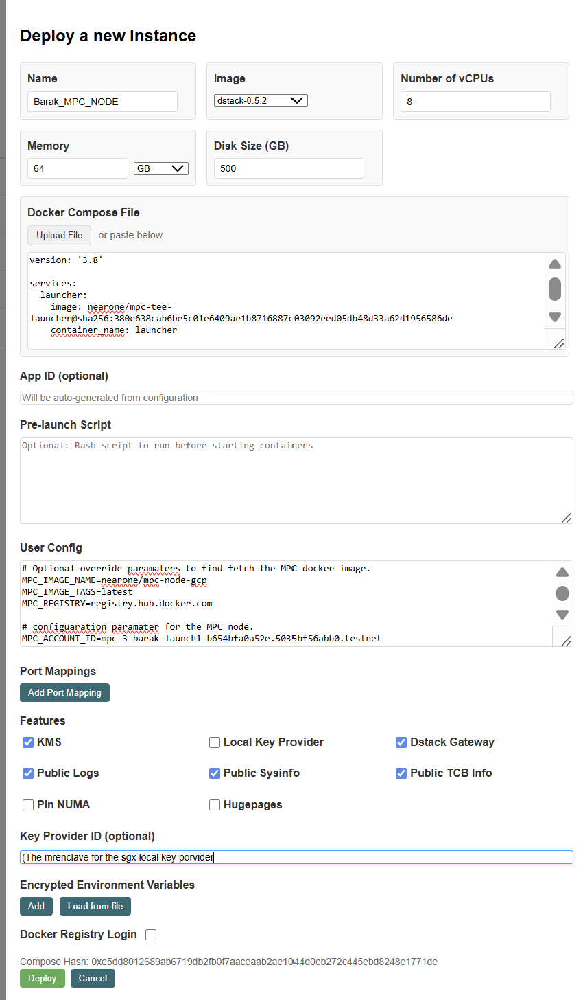
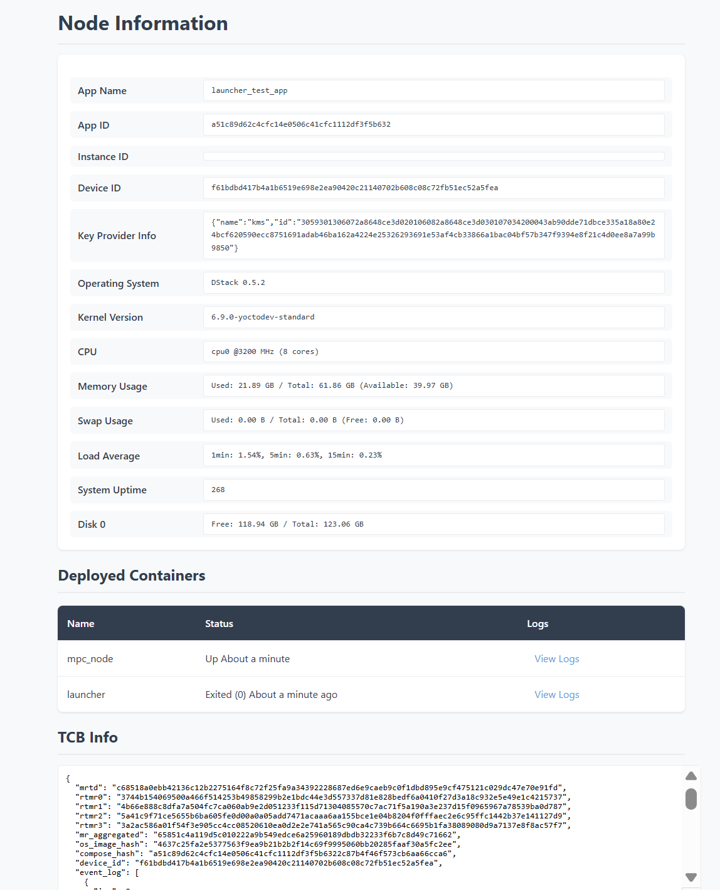
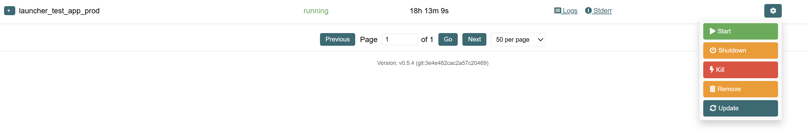
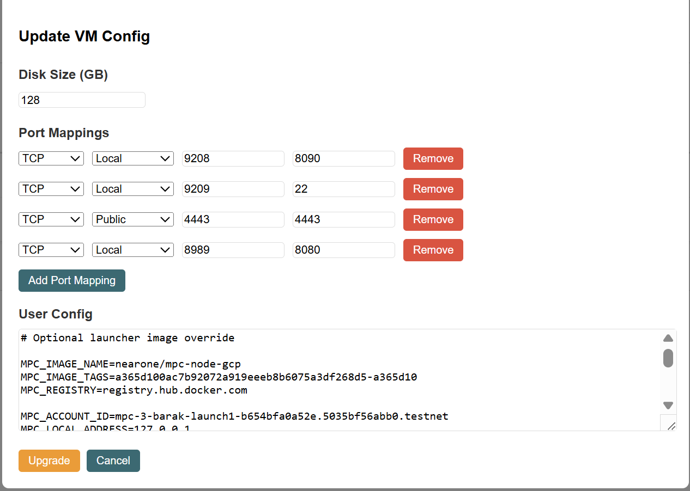

# MPC Node Deployment in TDX \- External Guide

## Introduction

Chain signatures is a Multi-Party Computation (MPC) service that lets you sign arbitrary payloads by calling a smart contract and receiving a signature. The returned signature can be used to derive public keys on external chains (for example, Ethereum or Bitcoin).

This guide walks you through deploying a self-hosted MPC node on a bare-metal server using Intel Trusted Domain Extensions (TDX). The node runs inside a Confidential VM (CVM) for isolation and attestation.

We use Dstack (from Phala) to orchestrate the environment and run the MPC container inside the CVM

## Limitations and Restrictions

 **Important:**
You cannot migrate an existing MPC node out of its CVM without data loss (for example: key share, P2P key). In addition, replacing or changing TDX-related hardware or dependencies (e.g., a CPU swap) may render the data unrecoverable.

## Main difference between TEE and non TEE MPC nodes

From an operator’s perspective, the key differences between a **TEE-based** MPC node and a **non-TEE** node are:

For a full architecture review of the TEE-based MPC, see: [design doc](securing_mpc_with_tee_design_doc.md)

| Category/feature | Non TEE | With TEE |
| :---- | :---- | :---- |
|  |  |  |
| Hardware Setup | Any hardware that meets the bandwidth, compute and memory requirements.  | Additional requirements to support Intel TDX Hardware.  |
| Deployment  | Deploy an MPC Docker image directly. | Use Dstack interface to deploy a Launcher docker image that will deploy the MPC node.  |
| Node Account key and P2P key | Generated by the operator, and provided to the node. | Generated by the node. Private keys are never exposed outside of the CVM. Public keys are exported by the node. And added to the operator's account. |
| Debug, Recovery| Operator has complete control over the environment | Operator has no access into the CVM (except for defined entry points) |

## Prerequisites and Requirements

### Hardware Requirements

* Have a TDX enabled, bare metal, server.  

Note \- we currently only support bare metal and do not support virtualized TDX solutions (such as GCP)  

* Intel Xeon 5th/6th Generation CPU (TDX Support) and 8 RAM slots filled  
  See [Intel TDX HW requirements](https://cc-enabling.trustedservices.intel.com/intel-tdx-enabling-guide/03/hardware_selection/)  
* Memory \- 64GB  
* (v)Cores \- 8  
* Disk space \- 500GB, SSD NVMe or similar performance

For a list of supported cloud providers offering bare metal servers with Intel TDX, see [Cloud Providers Supporting Bare Metal Servers with Intel TDX](./cloud-providers-tdx.md).

### General

* Firewall:allow ingress port 80 (MPC), 24567 (near) and port 8080 (web)  
* Assign a static public IP for access towards machine from outside

### Create DNS A record (optional)

Although a node can be accessed using a public IP address, it is recommended to use a domain name instead. Using a domain name allows some flexibility in case of public IP address change/repurpose or failover scenarios. To use a domain name, one must register a DNS A record. Some recommended providers:

* [Namecheap](https://www.namecheap.com/support/knowledgebase/article.aspx/319/2237/how-can-i-set-up-an-a-address-record-for-my-domain/)  
* [Cloudflare](https://developers.cloudflare.com/dns/manage-dns-records/how-to/create-dns-records/)

### TDX and Dstack Setup

This section describes how to enable TDX on your machine (BIOS, operating system, and software configurations), and how to install and configure Dstack.  

Follow the three steps below to ensure you have a working TDX machine with Dstack configured:

1. [Set up a bare-metal TDX server](#1-tdx-bare-metal-server-setup)  
2. [Dstack Setup and Configuration](#2-dstack-setup-and-configuration)  
3. [Set up a Local Gramine-Sealing-Key-Provider](#3-local-gramine-sealing-key-provider-setup)

---

#### 1. TDX Bare-Metal Server Setup

To create a bare-metal TDX server, follow the [canonical/tdx guide](https://github.com/canonical/tdx/blob/9023cb2d952f5fe9d72004092b93a155482ba18a/README.md).  

Make sure to complete:

* Steps 1–4 (basic TDX setup configuration)  
* Steps 9.1–9.2 (Remote Attestation setup)  

This ensures that your TDX setup is correctly configured.  

---

#### 2. Dstack Setup and Configuration

This section will guide you through installing and configuring `dstack-vmm`, which is the only dstack component needed for running MPC nodes in TDX environments.
The instructions are based on the [dstack deployment guide](https://github.com/Dstack-TEE/dstack/blob/eab86e8a3fd934656946a39bf07849bd75cf20fb/docs/deployment.md).

**Prerequisites:**

* Follow the [TDX setup guide](https://github.com/canonical/tdx) to setup the TDX host (completed in step 1 above)

* Install system dependencies

```bash
sudo apt update
sudo apt install build-essential qemu-system docker.io
```

* Create `mpc` user and installation folder

```bash
sudo useradd -m -G docker -s /usr/bin/bash mpc
sudo passwd mpc
# create installation folder
sudo mkdir /opt/mpc
sudo chown mpc:mpc /opt/mpc
# change user
sudo -u mpc -s
cd /opt/mpc
```

* Install `cargo` and `rustc`. This can be done with the following command.

```bash
curl --proto '=https' --tlsv1.2 -sSf https://sh.rustup.rs | sh
```

Note that after running this command you might need to restart the shell.

**Installation Steps:**

All steps below assume the current user is `mpc` and the current directory is
`/opt/mpc`.

1. **Clone the dstack repository:**

   ```bash
   git clone https://github.com/Dstack-TEE/dstack
   ```

2. **Compile dstack-vmm:**

   ```bash
   cd dstack
   git checkout v0.5.4 # Should point to commit `3e4e462cac2a57c204698d2443d252d13e75cd29`

   cargo build --release -p dstack-vmm -p supervisor
   mkdir -p vmm-data
   cp target/release/dstack-vmm vmm-data/
   cp target/release/supervisor vmm-data/
   cd vmm-data/
   ```

3. **Create the VMM configuration file:**

```bash
cat <<EOF > vmm.toml

# Communication endpoint for the VMM:
# - Use an IP and port when you want to access the VMM web UI from a browser (recommended)
address = "127.0.0.1"
port = 10000
# - Or use a UNIX socket if you don’t need the web UI and prefer not to expose an IP/port
#   address = "unix:./vmm.sock"

reuse = true
image_path = "./images"
run_path = "./run/vm"

[cvm]
kms_urls = ["https://kms.test2.dstack.phala.network:9201"]
gateway_urls = []
cid_start = 30000
cid_pool_size = 1000
max_disk_size = 1000

[cvm.port_mapping]
enabled = true
address = "127.0.0.1"
range = [
    { protocol = "tcp", from = 1, to = 30000 },
    { protocol = "udp", from = 1, to = 30000 },
]

[host_api]
address = "127.0.0.1"
port = 9300
EOF
```

4. **Download Guest OS images:**

   ```bash
   DSTACK_VERSION=0.5.4
   wget "https://github.com/Dstack-TEE/meta-dstack/releases/download/v${DSTACK_VERSION}/dstack-${DSTACK_VERSION}.tar.gz"
   mkdir -p images/
   tar -xvf dstack-${DSTACK_VERSION}.tar.gz -C images/
   rm -f dstack-${DSTACK_VERSION}.tar.gz
   ```

**Configuration Notes:**

* KMS and Gateway are not used in this MPC setup
* The configuration includes port **24567** which is required for MPC nodes
* The `max_disk_size = 1000` setting is specifically required for MPC operations

##### VMM service persistence

To run dstack-vmm, you can start it manually with:

```bash
./dstack-vmm -c vmm.toml
```

When `dstack-vmm` is running, you should be able to access its web interface at port `10000`.

However, for persistent operation, we recommend using the following systemd service:

```text
[Unit]
Description=Daemon for dstack-vmm

[Service]
Type=simple
WorkingDirectory=/opt/mpc/dstack/vmm-data/
ExecStart=/opt/mpc/dstack/vmm-data/dstack-vmm -c vmm.toml
Restart=on-failure
RestartSec=5
User=mpc
Group=mpc

[Install]
WantedBy=multi-user.target
```

The file should be located in the user systemd config folder, for example `/etc/systemd/system/dstack-vmm.service`.
After the file is created or modified you must run:

```bash
# to reload the service files
sudo systemctl daemon-reload
# to start/stop/restart the service
sudo systemctl start/stop/restart dstack-vmm
# to check the status the service
systemctl status dstack-vmm
```

Notice that some of the commands require `sudo`, so they cannot be run using the
`mpc` user which has no such permissions by default.

---

##### Guest OS Image - Advanced (optional) - build your own and/or verify measurements.    

> **Important:** The guest OS image that runs inside the CVM must be exactly the same across all nodes.  
> The OS image is measured, and those measurements are hardcoded in the contract.

The Guest OS image was already downloaded in step 4 of the installation process above using the specific version 0.5.4. This ensures compatibility and reproducibility across all MPC nodes.

If you need to verify or re-download or build the image, you can use:

```bash
DSTACK_VERSION=0.5.4
wget "https://github.com/Dstack-TEE/meta-dstack/releases/download/v${DSTACK_VERSION}/dstack-${DSTACK_VERSION}.tar.gz"
mkdir -p images/
tar -xvf dstack-${DSTACK_VERSION}.tar.gz -C images/
rm -f dstack-${DSTACK_VERSION}.tar.gz
```

For alternative approaches or building from source, you can also:

1. **Clone meta-dstack and checkout release `v0.5.4`:**
   ```bash
   git clone https://github.com/Dstack-TEE/meta-dstack.git
   cd meta-dstack/
   git checkout f7c795b76faa693f218e1c255007e3a68c541d79
   git submodule update --init --recursive
   ```

2. **Then either download pre-built image or build yourself:**
   * **Download pre-built (recommended, faster):** `./build.sh dl 0.5.4`
   * **Build reproducible image (slower, ~1–2 hours):** `cd repro-build && ./repro-build.sh -n`

---

##### Verification Steps

Run these commands from inside your image folder (e.g., `dstack-0.5.4`).

**1. Verify file hashes against expected values:**

```bash
#!/usr/bin/env bash
set -euo pipefail

# Hard-coded expected hashes
declare -A EXPECTED
EXPECTED["ovmf.fd"]="76888ce69c91aed86c43f840b913899b40b981964b7ce6018667f91ad06301f0"
EXPECTED["bzImage"]="987083c434a937e47361377196644169b8d2183919c6c3ab89e251e021ab55cb"
EXPECTED["initramfs.cpio.gz"]="fd5267f04bf95dc073c21934de552517506acde6485524834376c8a479c92fcd"
EXPECTED["metadata.json"]="a0a8489dd9f05db9ba26b37c1a7e3c99e94fa4a3e82736b57b1c19b058a11674"

ALL_OK=1
for FILE in "${!EXPECTED[@]}"; do
    if [[ ! -f "$FILE" ]]; then
        echo "$FILE not found"
        ALL_OK=0
        continue
    fi

    CALC_HASH=$(sha256sum "$FILE" | awk '{print $1}')
    if [[ "$CALC_HASH" == "${EXPECTED[$FILE]}" ]]; then
        echo "$FILE: OK"
    else
        echo "$FILE: FAILED"
        echo "  Expected: ${EXPECTED[$FILE]}"
        echo "  Found:    $CALC_HASH"
        ALL_OK=0
    fi
done

if [[ $ALL_OK -eq 1 ]]; then
    echo "All files verified successfully"
else
    echo "One or more files did not match"
    exit 1
fi
```

**2. Verify the `rootfs.img.verity`:**
```bash
#!/usr/bin/env bash
set -euo pipefail

META="metadata.json"

# Extract values from metadata.json
ROOTFS=$(jq -r '.rootfs' "$META")
ROOTFS_SIZE=$(jq -r '.cmdline' "$META" | sed -n 's/.*dstack.rootfs_size=\([0-9]*\).*/\1/p')
ROOTFS_HASH=$(jq -r '.cmdline' "$META" | sed -n 's/.*dstack.rootfs_hash=\([a-f0-9]*\).*/\1/p')

# Compute parameters
BLOCK_SIZE=4096
DATA_BLOCKS=$(( ROOTFS_SIZE / BLOCK_SIZE ))
HASH_OFFSET=$ROOTFS_SIZE

echo "Verifying $ROOTFS"
echo "  Rootfs size:   $ROOTFS_SIZE bytes"
echo "  Data blocks:   $DATA_BLOCKS"
echo "  Hash offset:   $HASH_OFFSET"
echo "  Rootfs hash:   $ROOTFS_HASH"

# Run verification
veritysetup verify \
  --data-blocks=$DATA_BLOCKS \
  --hash-offset=$HASH_OFFSET \
  --data-block-size=$BLOCK_SIZE \
  --hash-block-size=$BLOCK_SIZE \
  "$ROOTFS" "$ROOTFS" "$ROOTFS_HASH"

echo "✅ Verification succeeded"
```

**3. Check actual vs. expected RTMR values:**

1. Build `dstack-mr` tool (using Docker).
2. Calculate the actual RTMRs of the image.
3. Compare against expected RTMRs from the contract (shown below).

For more details, see the [Dstack attestation guide](https://github.com/Dstack-TEE/dstack/blob/master/attestation.md).

Build `dstack-mr` docker image:

```bash
cd /opt/mpc/dstack/vmm-data/images/dstack-0.5.4
```

Create a Dockerfile file, and add the content below to it.
```shell
# Dockerfile
FROM rust:1.86.0@sha256:300ec56abce8cc9448ddea2172747d048ed902a3090e6b57babb2bf19f754081 AS kms-builder
ARG DSTACK_REV
WORKDIR /build
RUN apt-get update && \
    apt-get install -y --no-install-recommends \
    git \
    build-essential \
    musl-tools \
    libssl-dev \
    protobuf-compiler \
    libprotobuf-dev \
    clang \
    libclang-dev
RUN git clone https://github.com/Dstack-TEE/dstack.git && \
    cd dstack
RUN rustup target add x86_64-unknown-linux-musl
RUN cd dstack && cargo build --release -p dstack-mr-cli --target x86_64-unknown-linux-musl

FROM kvin/kms:latest
COPY --from=kms-builder /build/dstack/target/x86_64-unknown-linux-musl/release/dstack-mr /usr/local/bin/
ENTRYPOINT ["dstack-mr"]
CMD []
```

Build:

```bash
docker build . -t dstack-mr
```

Run:

```bash
docker run --rm \
  -v "$(pwd)":/dstack-0.5.4 \
  dstack-mr \
  measure -c 8 -m 64G /dstack-0.5.4/metadata.json
```

Example output:

```text
Machine measurements:
MRTD: f06dfda6dce1cf904d4e2bab1dc370634cf95cefa2ceb2de2eee127c9382698090d7a4a13e14c536ec6c9c3c8fa87077
RTMR0: e673be2f70beefb70b48a6109eed4715d7270d4683b3bf356fa25fafbf1aa76e39e9127e6e688ccda98bdab1d4d47f46
RTMR1: a7b523278d4f914ee8df0ec80cd1c3d498cbf1152b0c5eaf65bad9425072874a3fcf891e8b01713d3d9937e3e0d26c15
RTMR2: 24847f5c5a2360d030bc4f7b8577ce32e87c4d051452c937e91220cab69542daef83433947c492b9c201182fc9769bbe
```

---

##### MPC-Specific Configurations

The `vmm.toml` configuration provided in the installation steps above already includes a few necessary MPC-specific settings:

* Port **24567** is included in the `cvm.port_mapping.range` (1-30000)
* The `max_disk_size = 1000` setting is configured in the `[cvm]` section
* KMS and Gateway are not used in this MPC setup

If you need to modify the configuration later, ensure these settings remain in your `vmm.toml`:

```toml
[cvm]
max_disk_size = 1000

[cvm.port_mapping]
enabled = true
address = "127.0.0.1"
range = [
    { protocol = "tcp", from = 1, to = 30000 },
    { protocol = "udp", from = 1, to = 30000 },
]
```


#### 3. Local Gramine-Sealing-Key-Provider Setup

In this solution, we use the `gramine-sealing-key-provider`, which runs inside an SGX enclave, to generate a key.  
This key is derived from TDX measurements and the SGX enclave’s hardware sealing key, and it is used to encrypt the CVM’s file system.  

> **Note:** This key is tied to the platform. Losing it will prevent the CVM from decrypting the drive on subsequent VM boots.

For more information, see [local-key-provider-from-phala](https://github.com/Dstack-TEE/dstack/tree/master/kms#local-key-provider-mode-1).  

##### Setup Instructions

1. Follow the [canonical/tdx setup](#1-tdx-bare-metal-server-setup) if not already completed — especially step 9.1–2 (establishing an SGX PCCS: Provisioning Certification Caching Service).

2. Deploy an instance of `gramine-sealing-key-provider` on the host machine.  
   * On the TDX server, run the script [run.sh](https://github.com/Dstack-TEE/dstack/blob/master/key-provider-build/run.sh)  
   > **Prerequisite:** Docker must be installed.
   
    ```bash
    cd /opt/mpc/dstack/key-provider-build
    ./run.sh
    ```
3. To find the `mr_enclave` value of the SGX key provider, run:

   ```bash
   docker logs gramine-sealing-key-provider 2>&1 | grep mr_enclave | head -n 1
   ```

   Ensure that the `mr_enclave` matches the expected value:

   ```console
   1b7a49378403249b6986a907844cab0921eca32dd47e657f3c10311ccaeccf8b
   ```

 **Note**: As part of the mutual attestation between the CVM and the key provider, the CVM will check that the key provider’s `mr_enclave` matches the above hash.

## MPC Node Setup and Deployment

This section will describe how to configure and deploy your MPC node inside a CVM.

Including

* Creating a Near account for your node

* Preparing a configuration file based on [user-config.conf](https://github.com/near/mpc/blob/main/tee_launcher/user-config.conf)

* Creating a docker compose file for the launcher based on [launcher\_docker\_compose.yaml](https://github.com/near/mpc/blob/main/tee_launcher/launcher_docker_compose.yaml).  
* Configuring and starting your CVM with the MPC node.  
* Accessing mpc docker logs.
* Retrieve keys from the CVM.
* Add the node key to your Near account.

### Create a NEAR Account for Your Node

> **Important** – In the following examples, the account keys are auto-generated as part of the command. But it is also possible to create the keys separately and add them to the account creation command.  
>
> In either case, it is the operator's full responsibility to manage and protect these keys.  
>
> See the [NEAR CLI](https://github.com/near/near-cli-rs/blob/main/docs/GUIDE.en.md) documentation for more options and details.

#### **Mainnet**

A named mainnet account is required. To create one, you can use a known wallet like [https://www.mynearwallet.com](https://www.mynearwallet.com) or [https://wallet.meteorwallet.app](https://wallet.meteorwallet.app), or fund it yourself:

```bash
near account create-account fund-myself <ACCOUNT_NAME> '<AMOUNT TO FUND> NEAR' autogenerate-new-keypair save-to-keychain sign-as <SIGNER_ACCOUNT_ID> network-config mainnet
```

#### **Testnet**

If you're using testnet, the easiest way to get started is to create an account sponsored by the faucet — the [NEAR command line interface](https://github.com/near/near-cli-rs) can set this up for you. Public and private keys are generated during this process. You can also use an existing account if you have one.

Using auto-generated keypair:

```bash
near account create-account sponsor-by-faucet-service <ACCOUNT_NAME> autogenerate-new-keypair save-to-keychain network-config testnet create
```

Using a manually provided public key:

```bash
near account create-account sponsor-by-faucet-service <ACCOUNT_NAME> use-manually-provided-public-key <PUBLIC_KEY> network-config testnet create
```

For more details, please refer to the NEAR account documentation.

### Prepare MPC container environment variables

Create a user-config.conf file based on the [user-config.conf](https://github.com/near/mpc/blob/main/tee_launcher/user-config.conf) .

```txt
# MPC docker image local override
MPC_IMAGE_NAME=nearone/mpc-node-gcp
MPC_IMAGE_TAGS=latest
MPC_REGISTRY=registry.hub.docker.com

# MPC node settings
MPC_ACCOUNT_ID=$MY_MPC_NEAR_ACCOUNT_ID
MPC_LOCAL_ADDRESS=127.0.0.1
MPC_SECRET_STORE_KEY=AAAAAAAAAAAAAAAAAAAAAAAAAAAAAAAA
MPC_CONTRACT_ID=$CONTRACT_ID # v1.signer-prod.testnet for Testnet or v1.signer for Mainnet
MPC_ENV=$CHAIN_ID # testnet or mainnet
MPC_HOME_DIR=/data
RUST_BACKTRACE=full
RUST_LOG=mpc=debug,info

NEAR_BOOT_NODES=$BOOT_NODES


# Port forwarding 
PORTS=8080:8080,24567:24567,80:80

```

Adjust the variables as per your environment.

* MPC_ACCOUNT_ID `-` use the near account ID that was created in the previous step  
  MPC\_CONTRACT\_ID is **v1.signer-prod.testnet** for testnet and **v1.signer** for mainnet
* PORTS: Those are the port forwarding rules for the MPC container. Those should be a subset of the port forwarding for the CVM that are defined [Port Mapping](https://github.com/near/mpc/blob/main/docs/running_an_mpc_node_in_tdx_external_guide.md#using-the-web-interface)
* A fresh set of boot nodes can be selected using Testnet/Mainnet RPC endpoints. Copy at least 4-5 nodes from curl results into NEAR\_NOOT\_NODES variable:

```bash
curl -X POST https://rpc.[testnet|mainnet].near.org \
  -H "Content-Type: application/json" \
  -d '{
        "jsonrpc": "2.0",
        "method": "network_info",
        "params": [],
        "id": "dontcare"
      }'| \
jq -r '.result.active_peers[]  as $active_peer  | "\($active_peer.id)@\($active_peer.addr)"' |\
paste -sd',' -
```

### Preparing a Docker Compose File

To launch the MPC node in the TEE environment, use the Docker Compose file from the [NEAR MPC repository](https://github.com/near/mpc/blob/main/tee_launcher/launcher_docker_compose.yaml).

Update the `DEFAULT_IMAGE_DIGEST` field in `launcher_docker_compose.yaml` with the latest MPC Docker image digest retrieved from the contract.

For details on how to map this hash to a specific Docker image published on DockerHub, or to the corresponding source code, see the section [MPC Node Upgrades](#mpc-node-upgrades).

Example digest value:

```bash
DEFAULT_IMAGE_DIGEST=sha256:0e48003c0ac6ec01e79ce47aa094379e7a8fac428512dfeb18d49d558e100a53
```

You can retrieve the latest MPC Docker image hash directly from the contract using the NEAR CLI:

```bash
near contract call-function as-transaction \
  v1.signer-prod.testnet \
  latest_code_hash \
  json-args '{}' \
  prepaid-gas '100.0 Tgas' \
  attached-deposit '0 NEAR' \
  sign-as <your-account-id> \
  network-config testnet \
  sign-with-keychain \
  send
```

The transaction output will include the latest MPC Docker image hash.

**Note:** - the [launcher\_docker\_compose.yaml](https://github.com/near/mpc/blob/main/tee_launcher/launcher_docker_compose.yaml) is measured, and the measurements are part of the remote attestation. Make sure not to change any other fields or values (including whitespaces).

### Required Ports and Port Collisions

MPC nodes use a fixed set of ports for communication and telemetry.  
This creates a limitation when trying to run both **mainnet** and **testnet** nodes on the same physical server, since both sets of nodes attempt to bind to the same ports.

---

* **Single network per machine**: By default, running both mainnet and testnet on the same machine is not supported because of port collisions.  
* **Workaround with multiple IPs**: It is possible to run multiple nodes (e.g., one mainnet and one testnet) on the same host if the server is configured with **multiple external IP addresses**.  
  * Each node binds to the required ports (see below) on a separate IP.  
  * Additional IP/port routing on the local machine may be required.  

---

#### Required Ports

| Port   | Purpose                                                                 |
|--------|-------------------------------------------------------------------------|
| **80** | Node-to-node communication (port override convention)                   |
| **24567** | Decentralized state sync                                               |
| **8080** | Debug and telemetry collection, plus the new `getdata` endpoint         |
| **3030** | Debug and telemetry collection                                         |

### Configuring and starting the MPC binary in a CVM

There are 2 ways to manage the VM that will run the MPC node.

1\. Using the Web interface  
2\. Using a script.

Note \- both methods provide the same functionality. The Web interface provides a more manual approach and control. While the script is useful for automating processes.  

#### **Using the Web interface**

Follow the [Dstack guide](https://github.com/Dstack-TEE/dstack?tab=readme-ov-file#deploy-an-app) (deploy an App):

Use the following custom settings for MPC:

1. Launcher docker compose file \- provided above.  
2. VM HW setting: (use exactly those settings, since vCPU/Memory are measured )  
    vCPU number=8 , Memory \= 64GB, disk \= 500 GB  
3. Pre script \- empty.  
4. user-config \- provided above  
5. KMS=disable, Local Keyprovier=enabled, Tproxy=disable, public logs=enabled,public sysinfo=enabled,pin NUMA=disabled  
6. Port mapping: (taken from the list above)  
   Public 80:80 (main node to node communication port)
   Public 24567:24567 (required for decentralized state sync)  
   Public 8080:8080 (required for collecting debug and telemetry information)
   Local 3030:3030: (use public with you want the debug metrics to be available on the internet)  
   Local <dstack_agent_port>:8090: (required for access CVM information and container logs)

7. Key Provider ID: (The MrEnclave for the sgx local key provider) 1b7a49378403249b6986a907844cab0921eca32dd47e657f3c10311ccaeccf8b



#### Using the script

Use the script [deploy-launcher.sh](https://github.com/near/mpc/blob/main/tee_launcher/deploy-launcher.sh) described here
[https://github.com/near/mpc/blob/main/tee\_deployment/deploy\_launcher\_guide.md](https://github.com/near/mpc/blob/main/tee_launcher/deploy_launcher_guide.md)  
To configure and start your VM.

### Accessing MPC (or Launcher) Docker Logs

#### Overview

Dstack provides a dedicated web page to view CVM information, including links to the Docker logs.  
More details can be found in [Phala's guide](https://github.com/Dstack-TEE/dstack?tab=readme-ov-file#deploy-an-app).  

---

#### Local Access

The web page is available on the **TDX server** at **`dstack_agent_port`** configured earlier in [Using the Web Interface](#using-the-web-interface).  

Open in your browser:  

```txt
http://localhost:<dstack_agent_port>
```

---

#### Remote Access

If you need to access the web page from another machine, set up SSH port forwarding.  

For example, if `dstack_agent_port = 8090`:  

```bash
ssh -NL 17190:localhost:8090 USER_NAME@TDX_SERVER
```

Then open:  

```txt
http://localhost:17190
```

---

#### Example / Screenshot



### Retrieve public keys from the MPC node

There are 2 keys that should be retrieved from node.  

* P2P (near\_p2p\_public\_key)- this key is used by the nodes to authenticate with one another. This key needs to be registered on the contract. (see details below)  
* Node Account Key (near\_signer\_public\_key) \- this key is used by the node to issue operations such as “vote\_reshared”.  
  This key needs to be added to the Near account that was created in the step above.

### Retrieve the node account key and P2P key

In order to retrieve the node account key and the P2P key. On your server
Call the HTTP end point [http://localhost:8080/public\_data](http://localhost:8080/public_data)  \- and search for near\_signer\_public\_key and near\_p2p\_public\_key

```json
{"near_signer_public_key":"ed25519:B2JvaYmgzfXsvCxrqd4nBrBt8jo9ReqUZatG3dAZEBv5","near_p2p_public_key":"ed25519:5SiS1SJiABiM79Yt6uEjMabAT9UguQY9hSyF7xfHLGYt"}
```

Sample curl command to extract the keys:

```bash
$ curl -s http://<IP>:8080/public_data | jq -r '.near_signer_public_key'
ed25519:B2JvaYmgzfXsvCxrqd4nBrBt8jo9ReqUZatG3dAZEBv5
$ curl -s http://<IP>:8080/public_data | jq -r '.near_p2p_public_key'$ed25519:5SiS1SJiABiM79Yt6uEjMabAT9UguQY9hSyF7xfHLGYt
```

### Add the Node Account Key to Your Account

This section shows how to add the MPC node's public key (from the previous section) as a **restricted function-call access key** to your NEAR account using the previously mentioned NEAR-CLI, allowing the MPC node to interact with the **MPC signer contract**.

---

#### Parameters

* **`ACCOUNT_ID`** → The NEAR account that will own the new key.  
  Example: `your-node-account.testnet`

* **`MPC_CONTRACT_ID`** → The MPC signer contract ID:  
  
  Testnet:   v1.signer-prod.testnet  
  Mainnet:   v1.signer

* **`MPC_NODE_PUBLIC_KEY`** → The public key of the MPC node you want to add.  
  Example: `ed25519:ABCDEFG...`

* **`METHOD_NAMES`** → The list of contract methods the MPC node is allowed to call:  

  ```txt
  respond,
  respond_ckd,
  vote_pk,
  start_keygen_instance,
  vote_reshared,
  start_reshare_instance,
  vote_abort_key_event_instance,
  verify_tee,
  submit_participant_info
  ```

---

#### Example Command

```bash
./target/release/near account add-key $ACCOUNT_ID   grant-function-call-access   --allowance '1 NEAR'   --contract-account-id $MPC_CONTRACT_ID   --function-names $METHOD_NAMES   use-manually-provided-public-key $MPC_NODE_PUBLIC_KEY   network-config testnet   sign-with-keychain   send
```

---

#### Sample Bash Script

```bash
#!/bin/bash

# === Configuration ===
ACCOUNT_ID="your-node-account.testnet"
MPC_CONTRACT_ID="v1.signer-prod.testnet"    # use "v1.signer" for mainnet
MPC_NODE_PUBLIC_KEY="ed25519:YOUR_PUBLIC_KEY_HERE"
ALLOWANCE="1 NEAR"
NETWORK="testnet"   # or "mainnet"

# Methods the MPC node is allowed to call
METHOD_NAMES="respond,respond_ckd,vote_pk,start_keygen_instance,vote_reshared,start_reshare_instance,vote_abort_key_event_instance,verify_tee,submit_participant_info"

# === Add Access Key ===
./target/release/near account add-key $ACCOUNT_ID   grant-function-call-access   --allowance "$ALLOWANCE"   --contract-account-id $MPC_CONTRACT_ID   --function-names $METHOD_NAMES   use-manually-provided-public-key $MPC_NODE_PUBLIC_KEY   network-config $NETWORK   sign-with-keychain   send
```

---

#### Transaction Verification

After sending the transaction, check that the new key was added:

```bash
./target/release/near account list-keys $ACCOUNT_ID \
  network-config $NETWORK \
  now
```

## Joining the MPC Cluster

After the MPC node has been deployed and its NEAR account key successfully added to the operator's account, the node will attempt to sync and then submit its attestation information to the contract.

Once these steps are complete, the operator should request all other operators to vote for adding the new MPC node by calling the **vote_new_parameters** method.

## Wait for NEAR Indexer to Sync

Wait until the NEAR Indexer has completed state sync. This process can take several hours. You can check the progress in the Docker container logs or via the metrics endpoint:

```bash
$ curl http://127.0.0.1:3030/metrics | grep near_sync_status
# Sync is completed when status is 0: 
near_sync_status 0
```

### Submitting Participant Info

> **Note:** During the [transition phase](#transition-phase), this step is optional. The contract will accept nodes that do not submit an attestation.  

Once the MPC node is fully synced, it will call `submit_participant_info` to submit its attestation information to the contract.

If the node’s key has not been added to the account, this operation will fail. In that case, the node will retry the operation in a loop.

> **Note:** This behavior is not yet implemented. See issue [#1069](https://github.com/near/mpc/issues/1069).  
> **TBD [#1079]:** Add screenshot/logs/cURL example for detecting when the MPC node has submitted attestation information.
> **Note:** Calling this method will incur a cost (TBD, XXX NEAR). Ensure this amount is available in your account.  
> _(TBD [#903](https://github.com/near/mpc/issues/903) – confirm exact cost)_

### Voting: (vote_new_parameters)

Ask other members to vote for your candidacy via the `vote_new_parameters` contract method.

To generate a voting command, follow these steps:

1. **Get the current state**

   ```bash
   near contract call-function as-read-only v1.signer-prod.testnet state json-args {} network-config testnet now
   ```

   Example output (truncated for clarity):

   ```json
   {
     "Running": {
       "keyset": {
         "domains": [
           {
             "attempt": 0,
             "domain_id": 0,
             "key": {
               "Secp256k1": {
                 "near_public_key": "secp256k1:4NfTiv3UsGahebgTaHyD9vF8KYKMBnfd6kh94mK6xv8fGBiJB8TBtFMP5WWXz6B89Ac1fbpzPwAvoyQebemHFwx3"
               }
             }
           },
           {
             "attempt": 0,
             "domain_id": 1,
             "key": {
               "Ed25519": {
                 "near_public_key_compressed": "ed25519:6vSEtQxrQj6txUMh33WC4ERyCWmNMRTdufDWAaDY3Un2"
               }
             }
           }
         ],
         "epoch_id": 10
       },
       "parameters": {
         "participants": {
           "next_id": 12,
           "participants": [
             [
               "aurora-multichain.testnet",
               0,
               { "sign_pk": "ed25519:BSgizrs...", "url": "http://34.49.211.4" }
             ],
             [
               "bst-near.testnet",
               1,
               { "sign_pk": "ed25519:AadQTC...", "url": "http://34.98.94.79" }
             ]
             ...
             ...
             ...
           ]
         },
         "threshold": 5
     
       }
     }
   }
   ```

   From this output, extract:
   * `participants`
   * `epoch_id` (10 in this example)
   * `next_id` (12 in this example)

2. **Update the state**  
   * Add your new participant to the `participants` array.  
   * Set `prospective_epoch_id = epoch_id + 1` (11 in this example).  
   * Set `next_id = next_id + 1` (13 in this example).  

#### Before

   ```json
   "participants": {
     "next_id": 12,
     "participants": [
       [
         "aurora-multichain.testnet",
         0,
         { "sign_pk": "ed25519:BSgizrs...", "url": "http://34.49.211.4" }
       ],
       [
         "bst-near.testnet",
         1,
         { "sign_pk": "ed25519:AadQTC...", "url": "http://34.98.94.79" }
       ]
       ...
       ...
       ...
     ]
   }
   ```

#### After (new participant `new-node.testnet` added)

   ```json
   "participants": {
     "next_id": 13,
     "participants": [
       [
         "aurora-multichain.testnet",
         0,
         { "sign_pk": "ed25519:BSgizrs...", "url": "http://34.49.211.4" }
       ],
       [
         "bst-near.testnet",
         1,
         { "sign_pk": "ed25519:AadQTC...", "url": "http://34.98.94.79" }
       ],
       [
         "new-node.testnet",
         12,
         { "sign_pk": "ed25519:NEWKEY...", "url": "http://example.org" }
       ]
       ...
       ...
       ...
     ]
   }
   ```

   Example request payload:

   ```json
   REQUEST='{
     "prospective_epoch_id": 11,
     "proposal": {
       "participants": {
         "next_id": 13,
         "participants": <participants_with_new_entry>
       }
     }
   }'
   ```

#### **Create the vote command**

   ```bash
   near contract call-function as-transaction v1.signer vote_new_parameters json-args "$REQUEST" prepaid-gas '100.0 Tgas' attached-deposit '0 NEAR' sign-as $YOUR_MPC_NEAR_ACCOUNT network-config mainnet sign-with-keychain send
   ```

After all participants have voted, the contract will move to a resharing phase.  
You can see this in the node logs (TBD) [#906](https://github.com/near/mpc/issues/906)

And when the resharing has finished look for… (TBD) [#906](https://github.com/near/mpc/issues/906)

## MPC Node Upgrades

From time to time, MPC nodes will need to be upgraded.  
This section describes how to vote for a new MPC Docker image hash and how to securely upgrade the MPC node in the CVM.

When a new MPC node is released, the release will along with precompiled binaries contain the following information:

* Git commit used to build the MPC image, identified by the release tag.
* Link to Docker Hub (or another repository) containing the released MPC Docker image.  
* Hash of the MPC Docker image (note: this is not the same as the Docker image manifest hash published on Docker Hub).  

> **Important:** Each operator is responsible for verifying that the MPC Docker image hash being voted for corresponds to the intended MPC Git commit, and for performing their own due diligence on the code.

**Main Steps:**

1. Verify that the Docker image hash matches the expected MPC node Git commit.  
2. Vote for the new Docker image hash in the contract.  
3. Upgrade the MPC node running in your CVM.

### MPC node Image/code inspection

The following steps allow you to inspect the code that was used to build the
docker image. Let's assume you want to vote for a docker image with tag
[mpc-node:main-828f816](https://hub.docker.com/layers/nearone/mpc-node/main-828f816/),
corresponding to the commit hash `828f816be36aed6f0d2438e0131b3e9d7d0931ad`.
Notice that the suffix of the image tag is the short version of the git hash.

* First, we need to obtain the image hash, which is not the same as the manifest
  hash shown in DockerHub. For that you need to install `docker` and `jq`, and
  have the `docker` daemon running.

```bash
$ docker pull nearone/mpc-node:main-828f816
$ docker inspect nearone/mpc-node:main-828f816 | jq -r .[0].Id
sha256:0e48003c0ac6ec01e79ce47aa094379e7a8fac428512dfeb18d49d558e100a53
```

* Download the MPC code from this repository:

```bash
git clone https://github.com/near/mpc
cd mpc/
git checkout 828f816be36aed6f0d2438e0131b3e9d7d0931ad
```

* Compile it using the reproduce build script. For this you need to install
  `repro-env` and `docker-buildx`, and have the `docker` daemon
  running.

```bash
$ ./deployment/build-images.sh
...
commit hash: 828f816be36aed6f0d2438e0131b3e9d7d0931ad
SOURCE_DATE_EPOCH used: 1758103448
node binary hash: 86c8f7d8913d6fe37a6992bba165d15a3a1d88fbf6cdff605e4827d5183721bc
node tee docker image hash: sha256:0e48003c0ac6ec01e79ce47aa094379e7a8fac428512dfeb18d49d558e100a53
launcher docker image hash: sha256:97e8a9618125c452f1f22528c15008627e9d4cf422ae2bd48150bebeac01346d
```

Note that the `node tee docker image hash` must coincide with the one obtained
before. In the same way, the launcher images published in
[mpc-launcher tags](https://hub.docker.com/r/nearone/mpc-launcher/tags) can be
verified. The one shown above corresponds to
[mpc-launcher:main-828f816](https://hub.docker.com/layers/nearone/mpc-launcher/main-828f816/)

* Do your own self do diligence on the code/binary

### **Voting for the Image**

After deciding to vote for a new MPC Docker image hash, each participant submits a vote for that hash.  
A **threshold** number of participant votes is required in order for the vote to pass.

Vote Command using NEAR CLI:

```bash
  near contract call-function as-transaction \
  v1.signer-prod.testnet \
  vote_code_hash \
  json-args '{"code_hash": "<IMAGE_HASH>"}' \
  prepaid-gas '100.0 Tgas' \
  attached-deposit '0 NEAR' \
  sign-as <your-account-id> \
  network-config testnet \
  sign-with-keychain \
  send
```

The **IMAGE_HASH** argument must be provided as an SHA-256 hex digest.

For example, for the digest

````bash
IMAGE_HASH=4b08c2745a33aa28503e86e33547cc5a564abbb13ed73755937ded1429358c9d
````

TBD [#908](https://github.com/near/mpc/issues/908) Add here voting procedure.

### **Update the MPC node**

After voting has finished, the MPC node will detect that there is a new approved MPC docker image hash register on the contract, and will download and save the hash into a secure location inside the CVM.

You can view this has happened by

TBD [#909](https://github.com/near/mpc/issues/909) \- add logs/screen shoot.

Following the hash update, you should upgrade the MPC node by following those steps:  
1\. Manually confirm the MPC dockerhub path/tag.  (optionly)
2\. Update the dockerhub image path/tag in the user-config.conf  
3\. Restart the CVM.  

#### Confirm that you have the correct dockerhub link to the approved MPC docker image

* Assume the dockerhub link provided to you is  nearone/mpc-node-gcp:abc..
* download the image to some local machine via the command:
  “docker pull nearone/mpc-node-gcp:abc..  
* Retrieve the image hash via  
  * docker inspect nearone/mpc-node-gcp:abc | grep “Id”:  
* Check that you got "Id":"xyz…", that matches the hash you voted for.

## Updating the CVM `user-config.conf` with new registry information

If any of the following fields change, you must update your `user-config.conf`:

* `MPC_REGISTRY`  
* `MPC_IMAGE_NAME`  
* `MPC_IMAGE_TAGS`  

**Example:**

```ini
MPC_REGISTRY=registry.hub.docker.com
MPC_IMAGE_NAME=nearone/mpc-node-gcp
MPC_IMAGE_TAGS=SHA256:abc
```

---

### Steps

1. **Stop the CVM**  
2. **Update `user-config.conf`** with the new values  
3. **Start the CVM**

---

### Options for performing the update

#### Manually Via Web UI

* Stop the CVM from the WebUI.  
* Press the **update** button  
* Update The config file and press **Upgrade**
* Start the CVM







#### Via Command Line

* See the [VMM CLI user guide](https://github.com/Dstack-TEE/dstack/blob/master/docs/vmm-cli-user-guide.md).  
* The CLI script is located at:  
  `meta-dstack/dstack/vmm/src/vmm-cli.py`  

First, define environment variables (once per shell session):  

```bash

export VMM_URL=http://127.0.0.1:11100 # change to your port 
export VMM_CLI_PATH="meta-dstack/dstack/vmm/src/vmm-cli.py" # change to your meta-dstack location 
```

Then you can use `$VMM_CLI` for all commands:

```bash
# 1. Enumerate and find your VM ID
python $VMM_CLI_PATH --url $VMM_URL lsvm

# 2. Gracefully stop the VM
python $VMM_CLI_PATH --url $VMM_URL stop <vm-id>

# 3. Update user-config
python $VMM_CLI_PATH --url $VMM_URL update-user-config <vm-id> ./new-user-config.txt

# 4. Start the VM
python $VMM_CLI_PATH --url $VMM_URL start <vm-id>
```

#### Restart the CVM

If not done in the previous step, stop and start the CVM.  

The new MPC docker binary should be automatically pulled from docker hub, verified and launched, and a remote attestation will be sent to the contract.

You can see in the MPC node's logs (TBD) [#910](https://github.com/near/mpc/issues/910)that the image was updated, and that node has synced again. (TBD, [#910](https://github.com/near/mpc/issues/910) add logs).

## Trouble shooting

TBD [#912](https://github.com/near/mpc/issues/912)
Reviewers \- please add here more scenarios (with or without solutions)

* do we have logs that indicate the node version/hash?  
* How to see what MPC node hash is expected by the launcher (docker-compose v.s file on disk)  
* Recovery \- how to erase the indexer state (e.g data folder)  
* …..

## Transition phase {#transition-phase}

During the transition phase, both MPC nodes with TEE and without TEE will be allowed.
After the transition phase is completed, only MPC nodes with valid remote attestation of a valid TEE configuration will be allowed to join the MPC cluster, and any node without a valid TEE configuration will be kicked out of the cluster.
